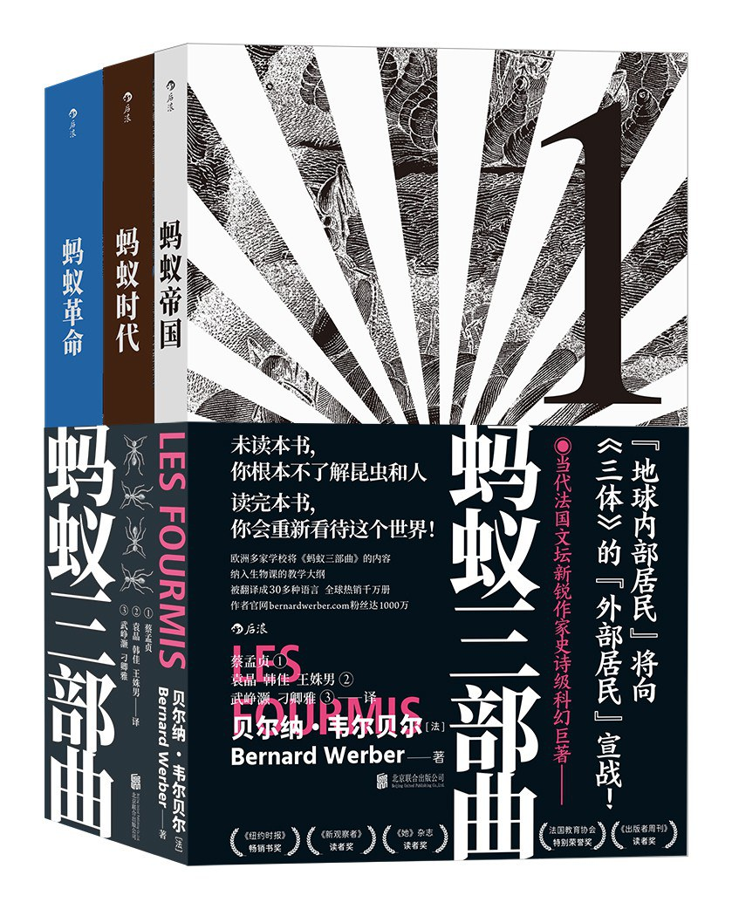
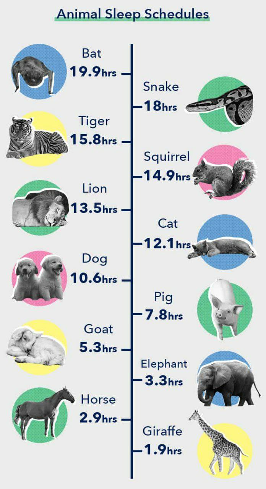
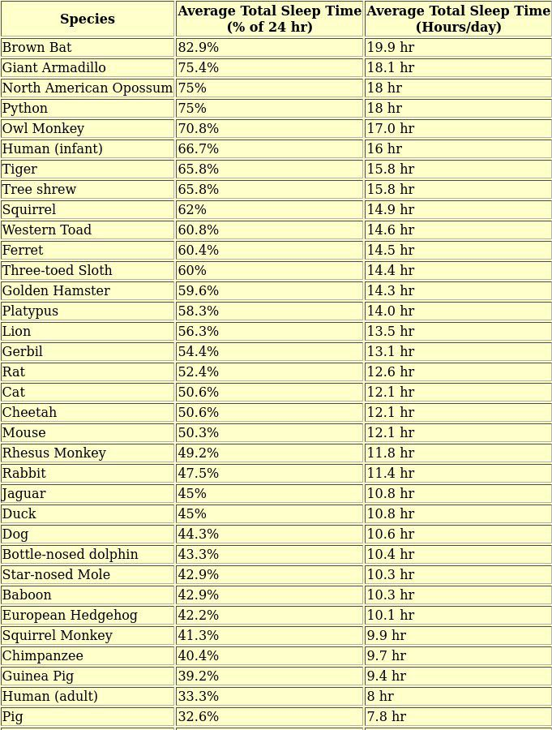

啰里啰唆是一份偏向互联网中青年的数字杂志，旨在分享与讨论，话题通常不固定，暂定每周一期。

第一期：衁子

# 科技日常

## 1.OneDev 自托管 Git 服务器 

OneDev是一个开源的一体化的DevOps平台，目前项目在GitHub上有6.9K星。你可以把它理解为简化版的GitHub/GitLab，原生支持Docker和Kubernetes，图形化的Build定义界面。相比Gitlab，安装维护简单，资源占用少。相比Gerrit这个简陋而古老的代码托管服务，界面更漂亮，多了CI/CD的支持。

https://github.com/theonedev/onedev

## 2.andOPT

开源双因素认证应用，可能是界面最漂亮，功能最干净的双因素认证App了。支持导入导出认证信息，支持App图标。

关于导入导出认证信息，有的App和用户认为认证信息应该是唯一且不能被复制传播的，但是实际使用中，伴随着换机，重装App等操作，导入导出功能又是必不可少的功能。

https://f-droid.org/zh_Hans/packages/org.shadowice.flocke.andotp/

# 读书分享

## 1.蚂蚁三部曲

人类、蚂蚁，地球上两大社会，千百年来的互不了解，引起了惊心动魄地血腥残杀， 法国文坛贝尔纳·韦尔贝尔以其充满奇异和大胆想象、知识和哲理的智慧写作以蚂蚁为题材"地球内部居民"系列作品--《蚂蚁帝国》、《蚂蚁时代》、《蚂蚁革命》 。被国际书评界誉为"伟大的史诗说"、"改变读者世界观的天才作品"，"精彩绝伦的旷世之作"，全球发行量突破2000万册。

这三本书分别于1991年、1992年和1996年由法国阿尔班•米歇尔（Albin Michel）出版社首次出版，国内最近在2021年出版过一次三部曲合集。

第一本比较多悬念也最精彩，后面两本比较难熬一些，但如果你熬过去了，方能完整领悟这套书的精彩。

douban:https://book.douban.com/subject/35324442/

## 2.丁香医生人体调查组

丁香医生出的一本书，介绍一些人们想知道又不方便问的问题，漫画形式，有态度又有趣。

douban:https://book.douban.com/subject/35544885/

# 图论

## 1.人类原来比猪还贪睡

俗话常说某人像猪一样懒且贪睡，但是实际上，猪睡得比人还要少。一项研究表明，猪每天只睡7.8个小时，而人类则要比猪睡得略久，平均每天8小时

更详细的统计如下，每天睡眠时间最多的是蝙蝠，其次是大犰狳，最少的是长颈鹿和马。

这看起来很反直觉，甚至像是一个谣言。但是有相关养猪经验的人应该能理解。虽然猪每天大部分时间都趴在地上，但是睡眠时间并不多，而且猪的警觉性也不低。

一般来说，普遍规律是体型大的动物比体型小的动物睡眠时间要少，食草动物比食肉动物睡得要少。睡得最少的牛蛙，黑斑羚，虽然会闭眼休息，但并不进入睡眠阶段，依然保持警觉。马和长颈鹿也属于类似机制，休息但不睡觉。鸟类通常采用半睡半醒的机制。

参考资料：https://startsleeping.org/animal-sleep/

## 2.从设计到产品

# 谈天说地

## 1.南北语言小谈

衁子：读音 **（huāng zi）**，即血。中西部地区方言，即北方地区的鸭血，猪血等血制品。

通常，西部和南部地区的文字水平要高于北方，其中一个表相就是西部和南方的词语和汉字要多不少，表达力更丰富。不少方言里的发音都有对应的中文，而北方普通话地区汉字相比则贫瘠很多。

再者比如粤语和上海话里用来骂人的曱甴**（yuēyóu）**两字，对北方人则十分生疏。再者，比如西南和江浙地区，用来表示小口喝的 渳**（mǐ）**  字。

由于长江以南有大量方言，故而保留了大量的汉字和词语在日常生活和撰文中的使用。

## 2.以形补形

《东坡志林》卷三记载了苏东坡和欧阳修的一次闲谈。

> 欧阳文忠公尝言：有患疾者，医问其得疾之由，曰：‘乘船遇风，惊而得之。’医取多年柂牙为柂工手汗所渍处，刮末杂丹砂茯神之流，饮之而愈。今本草注别药性论云：‘止汗，用麻黄根节及故竹扇为末服之。’文忠因言：‘医以意用药多此比，初似儿戏，然或有验，殆未易致诘也。’予因谓公：‘以笔墨烧灰饮学者，当治昬惰耶？推此而广之，则饮伯夷之盥水，可以疗贪；食比干之馂余，可以已佞；舐樊哙之盾，可以治怯；齅西子之珥，可以疗恶疾矣。’公遂大笑。元祐六年闰八月十七日，舟行入颍州界。坐念二十年前见文忠公于此，偶记一时谈笑之语，聊复识之。

欧阳修曾经跟我说过这样的事情：有人生了病，医生问他是怎么得病的，他回答说：“坐船时遇上刮大风，惊恐害怕，然后就病了。”医生就在使用了多年、被舵工手上出的汗水浸透了的船舵把柄上用刀刮下一些碎屑来，加上丹砂、茯神一类的药，泡水给他喝了，他的病就好了。

如今《本草注别药性论》上说：“治疗出汗多的毛病，可以用麻黄的根节（麻黄，中药名，以茎枝入药，性温、味辛微苦，功能发汗；根节入药，性平、味甘，功能止汗）和被人用旧了的竹扇（上面浸透了人的手汗）来打成碎末让病人服用。”

欧阳修就说：“医生凭借自己的揣度配药大都像这样，初看好像儿戏，然而有时还真有点疗效，恐怕这其中的道理还不容易招致责难吧。” 我说：“把毛笔、墨锭拿来烧成灰给学生吃，能够治疗愚蠢和懒惰吗？由此推广开来，那么，喝了伯夷的洗手水，就可以治疗贪心；吃了比干吃剩下的饭菜，就可以改掉谄媚的毛病；舔一舔樊哙用过的盾牌，就可以医治胆小的毛病；嗅一嗅西施的耳环，就可以治好天生的丑怪残疾啦。”欧阳修听了我的话，大笑起来。

# 一句话快讯

1.工信部近期发布不得强制用户下载App才能查看全文或评论的新闻，被各大互联网公司要求强制安装App才能查看全部内容。

2.联想于2022年2月28日宣布了首款采用 ARM 处理器的 ThinkPad 笔记本电脑：ThinkPad X13s。

3.Reactjs 的github issue被中国网民洗版后，一名俄籍核心开发者发表了谴责声明。

# 订阅方式

https://luoliluosuo.zhubai.love/

https://www.getrevue.co/profile/luoliluosuo