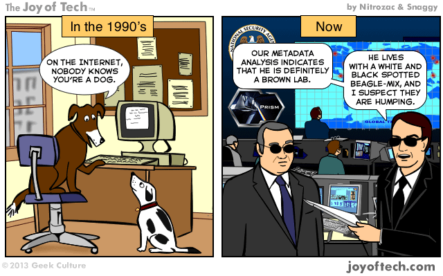
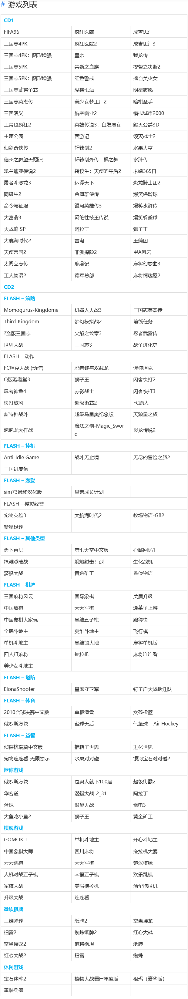
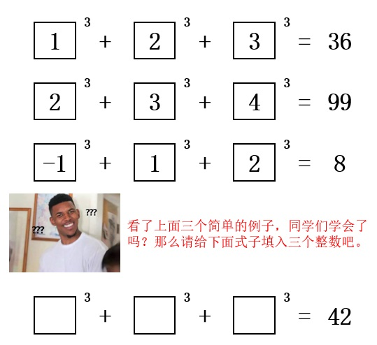

啰里啰唆是一份偏向互联网中青年的数字杂志，旨在分享与讨论，话题通常不固定，暂定每周一期。

免责声明：部分内容可能会引起内心冲突或愤怒等不适症状。

第二期：古代爽文

# 科技日常

## 1. PSN与隐私
Processor Serial Number，即CPU序列号。

序列号是硬件的唯一识别码，但是在主流的CPU上，我们却看不到SN码，这是为什么呢？

序列号内包含了很多信息，而厂商通过序列号就能判断出产品的生产日期，产品批次，生产工厂甚至流水线号。当硬件出现问题时，就可以根据其制造信息去反推可能出现问题的地方，同时发现存在同样问题的同批次产品。

那么CPU有序列号吗？答案是曾经有，在CPU的包装盒上，就可以看到序列号在内的一系列编码，一方面是方便产品追溯，同时也是提供保修的需求。

那么为什么现在的CPU上不印SN码呢？这更多地是出于保护用户的隐私。早期在奔腾3处理器上曾经出现过PSN（Processor Serial Number），也就是处理器的序列号，但是因为CPU和个人电脑是高度绑定的，此举可能严重泄漏个人隐私，且一般用户都无法防范，当年引起很大的争议。所以从奔腾4开始就不再在CPU上印制SN码了。

无论是通过cpuz还是操作系统自带的一些命令，我们都是无法查到CPU序列号的，但是我们可以查到CPU ID，这是一个标识CPU各种版本信息的字符串。

但是需要注意，**某些国家**的出厂服务器依然是带有PSN的。至于手机的PSN，则是另一个话题了，有兴趣的读者可以自行了解。

参考文档：https://courses.ischool.berkeley.edu/i224/s99/GroupJ/presentation.pdf

## 2. 绝版游戏保护工程
绝版游戏保护工程是一个在 GitHub 的开源项目，收集了近 200 款 DOS 时代、早期 Windows 系统的单机游戏，目前只占用两张光盘的容量（640MB x 2），推荐给想要复古怀旧的同学。

作者从上千款游戏中筛选出来的两张 CD。

CD1：光碟收录了 64 款几近绝版的精品 DOS 游戏，大部分游戏现在网上都很难找到。
 每个游戏配上截图和文字介绍，包括游戏类型，简介等，怀旧就是要有个气氛，才能有更高的娱乐和收藏价值。
CD2：绝版经典小游戏
 光碟包含一百个简单又耐玩的小游戏（Windows + Flash），上手容易，无需充值，百玩不腻。

GitHub：https://github.com/skywind3000/preserve-cd

另，关于DOS游戏，推荐两个网站：
https://www.dosgamesarchive.com/
（有1146款DOS游戏可下载）
https://www.dosbox.com/wiki/GAMES
玩DOS游戏必备工具

# 读书分享

## 1.古代第一爽文《野叟曝言》

自从10年前流行起来的网络爽文，描述各种现代神医，绝命保镖，天降之子各种自带不死光环的主角以来，爽文一直是网络小说中最能获取流量的类型，以至于曾被视为市井意淫，格调不高的爽文纷纷被搬上了电视屏幕。

那爽文文化是何时出现的，古代有爽文吗？

《野叟曝言》是清代夏敬渠著白话长篇世情小说，一名《第一奇书野叟曝言》，又名《第一奇书》《兴替宝鉴》《大侠艳史》《剑骨琴心》《文素臣》，二十卷一百五十四回。成书于清乾隆年间。 

该小说托明朝事，叙苏州府吴江县书生文素臣，少不得志，历经磨难，建功立业，飞黄腾达的故事。文素臣只崇儒学，不信异端，由一个不得志的书生得到朝庭信用，征苗诛藩，除奸灭佛，平定天下，封镇国公，皇帝尊为素父，全家出将入相，尊荣已极。书中极力宣扬儒教，欲以理学为正宗，扫除佛道等一切异端。文素臣、水夫人等都是这种政治理想的代表人物。该书在艺术上力求将讲史、世情、传奇、公案、神话和才子佳人小说的各种写法融于一炉，追求一种独特的艺术风格。书中大量穿插谈经说法、夸饰才学的文章和色情猥亵描写。共写了五百二十多个人物，148W字。

这算是古代篇幅最长最爽的一篇小说吧。

**当然，这本书并不推荐你去细读。**

## 2.《夜航船》-古代的百科全书

这本书从书名上来说看起来像什么，游记？故事会？小说？都不是。实际上它是古代的百科全书。

《夜航船》是明末清初文学家、史学家张岱所著的百科类图书。该书讲述了从三教九流到神仙鬼怪，从政治人事到典章沿革等二十大类125个小类的学科知识。

张岱为什么把他的著作取名《夜航船》呢?夜航船是南方水乡苦途长旅的象征，人们外出都要坐船，在时日缓慢的航行途中，坐着无聊，便以闲谈消遣。其中乘客有文人学士，也有富商大贾。有赴任的官员，也有投亲的百姓。各色人等应有尽有，谈话的内容也包罗万象。张岱说：“天下学问，惟夜航船最难对付。”他在《夜航船》序中讲了这样一个故事：昔日有一僧人与一士子同宿夜航船。士子高谈阔论，僧畏慑，弮足而寝。僧人听其语有破绽，乃曰：“请问相公，澹台灭明是一个人、两个人?”士子曰：“是两个人”。僧曰：“这等尧舜是一个人、两个人?”士子曰：“自然是一个人!”僧乃笑曰：“这等说来，且待小僧伸伸脚。”于是，张岱便编写了一本列述中国文化常识的书，便取名《夜航船》，使人们不至于在类似夜航船的场合丢丑。“但勿使僧人伸脚则可矣”。

《夜航船》并非高深莫测的古书，而是用较为浅显的文言叙述四千余个文化常识段子，这些条目绝大多数都是作为一个有文化的人所必须熟知的内容。虽然也收录了一些现在看来荒诞不经的内容，但作为古人的情趣笑谈，有助于我们了解古代的一些文化状况，也未尝不可以看看。 

全书有天文地理，人物考古，政事人文，礼仪日用，外国植物，四灵方术等内容

# 图论

## 1.这个数学题看起来不难!

这个题初看似乎很简单，但是稍微一试试，发现却不是这样。

1992 年，数学家罗杰希思 - 布朗（Roger Heath-Brown）提出猜想，除了 9n±4 型自然数外，所有自然数都可以用无穷多种不同方式写成三个立方数的和。

2019 年，数学家 Andrew Sutherland 和 Andrew Booker 首次将 42 写成 3 个整数的立方和，这意味着 100 以内自然数全部被攻破。Sutherland 和 Booker 的相关研究文章发表在了《美国国家科学院院刊》（[PNAS](https://www.pnas.org/doi/10.1073/pnas.2022377118)）上。

三立方数和一直是困扰数学家的难题之一，一些数字的求解非常简单，例如 29 可以写成 3^3+1^3+1^3 (27 + 1 + 1)，但42却很难。

实际上，(−80,538,738,812,075,974)^3+(80,435,758,145,817,5153)^3+(12,602,123,297,335,631)^3=42

之后短短数周时间，他们又解决了一个更大的难题：找到了自然数 3 的第 3 个三立方数和解

569,936,821,221,962,380,720^3+(−569,936,821,113,563,493,509)^3+(−472,715,493,453,327,032)^3=3

为了计算42的三立方数，科研团队用了全球40万台计算机助力，将问题分解为400 万个任务，每台计算机大约花费 3 个小时来完成一个任务。

## 2.真正的安全问题

没有什么是一把扳手解决不了的。

# 谈天说地

## 1.初春美食
初春到了，推荐两道美食，长江以南地域的读者可以尝试下（长江以北的可能得再等等）。
一个是嫩蚕豆焖饭，另一个是凉拌香椿芽，做法都很简单。
嫩蚕豆焖饭：在煮饭时，米中放上洗干净且掐去两头的嫩蚕豆（去皮不去皮均可），少许盐和油，即可。
凉拌香椿芽：香椿芽焯水一分钟，放置三分钟，捞出切碎，加入盐，酱油，放置一会待其入味即可。

## 2.匪夷所思的结论
如今的中文互联网圈，各种谣言，阴谋，阳谋，大棋，神探满天飞。有一个很突出的现象，很多人往往滥用所谓逻辑，从一些看似平常的事，一步一步拉读者入局，最终推出各种耸人听闻的结局。

比如，看到一个12月衣着单薄的人，就能推出“众所周知，12月是冬季，衣着单薄，正常人绝不会这样，肯定是有精神病”。但是真相呢，很可能这是海南的冬天，也有可能是网红在摆拍。类似这样的无稽之谈有很多，往往是一个串一个小论点，最后串起来一个匪夷所思的结论。

类似的还有

> 假如潘金莲不开窗户，就不会遇见西门庆；不遇西门，就不会出轨；不出轨武松就不会逼上梁山。武松不上梁山，方腊就不会被擒；方腊不被擒，就可灭大宋江山；没有了大宋江山，就不会有靖康耻；金兵就不会入关，就不会有大清朝；没有大清朝，中国就不会闭关锁国，不会有鸦片战争和八国联军入侵。那么， 中国， 将是世界上唯一的超级大国。
>

这属于滑坡谬误（Slippery  slope），是一种非形式谬误，使用连串的因果推论，却夸大了每个环节的因果强度，而得到不合理的结论。

阴谋论也好，滑坡谬误也好，最脆弱的一点就是，**只要有一环串不起来**，整个环就坍塌了。当然，相信阴谋论的人，总会乐此不彼地编织下一个环。

还有中文圈最流行的比烂大法，又叫“那又怎么说”主义（英语：Whataboutism，又译“那又怎么说”论或“那你们还”论），指的是东方大国在冷战时期对西方世界使用的一种政治宣传技巧。每当有人批评东方大国，就会获得形如“那（西方世界的某某事件）呢？”（What about…?）的回应。这种技巧是“你也一样”（诉诸伪善）这种逻辑谬误的应用，试图通过指出对手言行不一之处削弱其可信度，而不直接反驳其论点。

这个词于2008年由爱德华·卢卡斯的一篇《经济学人》文章带火。

## 3.Yogo Pant

Pants that make anyone look like they have an ass. 
> "Damn when did Jillian get an ass". 
> "She doesn't, its just the yoga pants". 

嗯，真形象。

## 4.妇女节还是女生节
又到了3月8日妇女节，现在很多女性不愿意过38妇女节，都去过37女生/神节了。

38原本是个表示日期的中性词，但随着影视的流行，慢慢变成了骂人的话。我印象中，90年代38就带有骂人的意味了。

最近（2020年开始，因为清华大学一次女生节标语翻车事件）网上有一种声音，说37女神节来源于一个恶臭梗。“三月七日还是女生 一日之后就是妇女 ”。

这个恶臭梗确实有，很流行，也确实来源于中文网络。但37女神节其实在九十年代还没有互联网的时候，就在高校中有了流行，但是三十年前流行的初衷是什么已经不可考了，是否也有性暗示不得知，也不是没有可能。

但说37女神节来源于最近的网络恶臭梗，这个说法是不成立的，是被污染了的互联网信息传播案例。

不论如何，鼓吹女生和妇女的差别，依然是中文圈的恶趣味。

互联网时代，各种资讯繁杂，但是又互相引用抄袭，要想溯源也变得很困难。比如网上很多资料都说女生节来源于86年山东高校和90年代的广东工学院，网上找到的文章都是雷同，但没有给出任何出处的参考。所以我也很难给出女生节的真实来源。仅就我的经历来说，200X年的时候，中国大陆地区西部的高校已经有女生节这一活动，但那时在男生口中，解释依然是“一日之别”。

也有文章说女生节源自清华大学，我于“清华大学 女生节 200X”这种字眼嗖嗖，没有找到来源比较早的可靠出处，能找到的都是最近相关的文章。后来在搜狐找到一篇2006年的新闻《充满幸福感的清华“女生节”》（出处：http://news.sohu.com/20060308/n242193209.shtml），文中最后指出，“清华大学'女生节'已有超过十年的历史，2002年，又增加了校园服饰大赛，丰富了学生们的课余生活。”，这应该是互联网上能找到比较靠谱的出处佐证。

只能说，互联网对信息的保存和传播之便利，但其污染也同样厉害。

# 一句话快讯

1.声称收购乌克兰航空发动机公司被阻、投资千亿建设尼加拉瓜大运河的中国民营企业信威科技集团于2022年2月提出破产申请。

2.印度总人口千年来首次超过中国，成为世界第一人口国，达到14.16亿。

3.据国家烟草专卖局消息，2021年烟草行业实现工商税利总额13581亿元。

4.1776年3学9日苏格兰经济学家亚当·斯密的著作《国富论》正式出版，奠定现代经济学的基础。

# 订阅方式

https://luoliluosuo.zhubai.love/

https://www.getrevue.co/profile/luoliluosuo