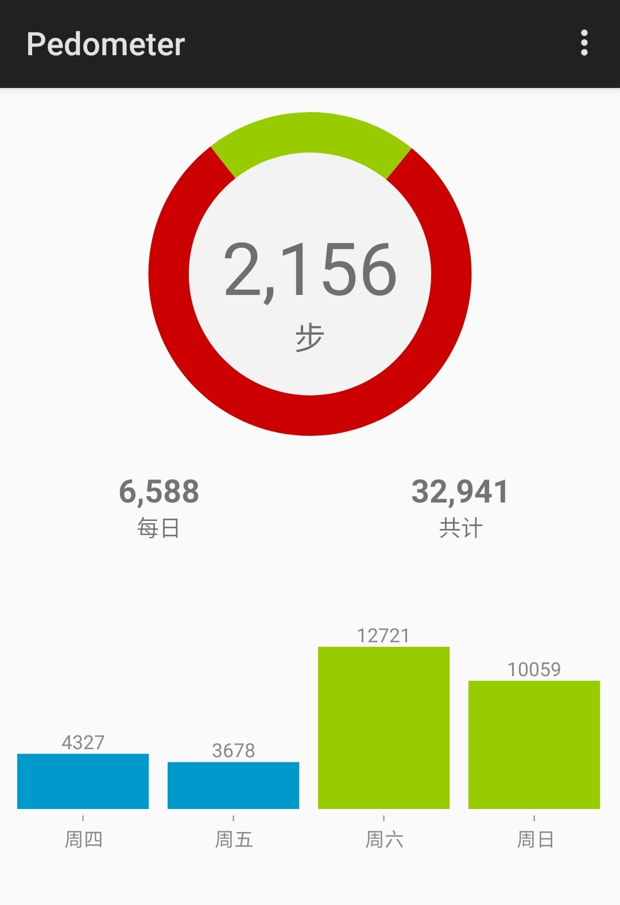
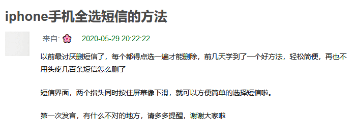
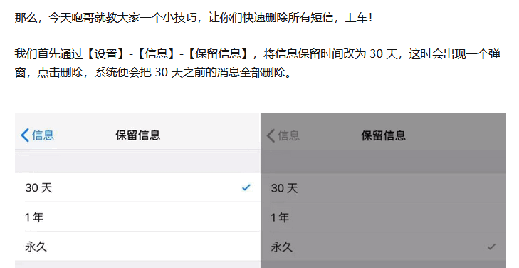
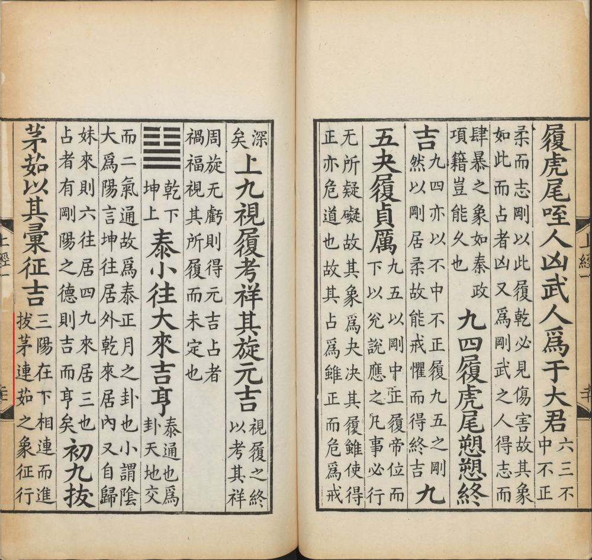

啰里啰唆是一份偏向互联网中青年的数字杂志，旨在分享与讨论，话题通常不固定，暂定每周一期。

免责声明：部分内容可能会引起内心冲突或愤怒等不适症状。

第3期：爷爷到底是爸爸还是爸爸的爸爸还是爸爸的弟弟

# 科技日常

## 1. 邮件撤回实现原理
曾经聊到过邮件撤回这个功能，通用的POP3/SMTP都是没有邮件撤回相关协议的。部分邮箱如QQ邮箱的撤回功能仅限于同域名邮箱之间。

但是支持IMAP协议的客户端和邮件服务是可以实现这个功能的。

IMAP支持在服务器保留消息状态信息，通过使用在IMAP4协议中定义的标志客户端可以跟踪消息状态，例如邮件是否被读取，回复，或者删除。这些标识存储在服务器，多个客户在不同时间访问一个邮箱可以感知其他用户所做的操作。

IMAP也正是基于服务端的邮件标志加上IMAP协议的双向互通特性，配合客户端实现了撤回功能。普通的POP3是单向的，客户端一旦收到信后，客户端的状态更改是不会影响服务器端状态变化的，反之亦然。不过POP3协议支持客户端收信后不保留服务器上的信件。

## 2. Pedometer

Lightweight pedometer using the hardware step-sensor for minimal battery consumption. This app is designed to be kept running all the time without having
any impact on your battery life! It uses the hardware step detection sensor of
the Mobile, which is already running even when not using any pedometer app.

现在的各种运动健身App多如牛毛，为什么提到这个App呢，因为它真正做到了“do one thing and do it best”。除了健康权限外，不需要GPS，通讯录，网络等任何多余权限，体积仅1M大小。只计步，不做任何其它多余的事。

支付宝运动不能查看历史记录，很奇怪支付宝为什么不实现这么个简单的功能，微信运动虽然能查看历史记录，但是又容易暴露隐私（默认加入排行榜，但可以关闭）且不精确。但是无论支付宝或微信怎么声称保护隐私，我认为都是不值得信赖的。

对于我这种系统简洁，手机没有自带完整运动计步功能（手机没有自带健康或运动App，自带的桌面组件有计步功能，但只能统计当天数据，不具有历史数据记录功能）的用户来说，这个App是个很好的选择。

只需要把这个app的Widget加入桌面或负一屏即可，不需要常驻前台。

前面提到支付宝和微信的计步功能，也不需要app常驻前台，我不是安卓开发人员，我推测其实现计步的原理，是开启了一个后台service，不断接收step-sensor的通知，即使你划掉了app也不影响计步。通过我的使用体验，支付宝计步比微信要准确。

Pedometer的记录精确度非常高，超出其它类似软件，如果能保持更新或少一些bug无疑是最好的。

下载：https://f-droid.org/zh_Hans/packages/de.j4velin.pedometer/

注：
1.Pedometer这个名称比较大众脸，所以如果你搜索名字的话，会搜到很多同名的App，注意鉴别。

2.Pedometer的数据支持导入导出成csv文件。

3.可惜的是这个软件虽然开源，但是快3年没有更新了，积累了不少bug。

已知bug:

1.重启手机后Pedometer数据可能会错乱，删除数据后用备份覆盖无效，需要卸载重新安装再导入备份数据。

2.有时统计会出现误差，并且之后的统计每一天都会重复这个误差。需要卸载重新安装再导入。

3.长时间使用，可能出现无法计步的现象，需要重新打开APP。

## 3. IOS终于支持短信全选操作了

2022年3月的某一天，突然发现更新(应该是iOS 15.3)后的iPhone 13终于支持全选操作了。

在之前的iPhone 版本中，短信收件箱并不支持全选，只能下划选中全部后再操作，在最早不早于2022年2月的一次更新中，收件箱终于增加了“全选”这个复选框。

不愧是世界上最好用的手机，苹果的一小步，人类的一大步。/(ㄒoㄒ)/~~

可能有的读者并不是iPhone用户，不能理解全选这种基本操作在iPhone竟然会没有。所以贴几张图，解释下这个问题。

之前还有更灵魂的变通操作

# 读书分享

## 1.《镜中世界》
德国奇幻名家携手哈利·波特制片人打造黑童话宇宙，《墨水世界》精神续作，2011年法国幻想文学大奖得主。

这里是童话真正活过来的地方。这里有化身狐狸的变形者，有皮肤坚硬的石人族，有行踪隐秘的剪刀手裁缝，还有通晓读心术的女妖。镜子就是传送门，它们只向无法看见自己的人敞开。

幻境石魔：雅各布可以通过镜子来往于现实世界与镜中世界。弟弟威尔不小心跟着雅各布穿过镜子，却遭到诅咒变成了石身人，雅各布需要动用自己的智慧来破解咒语。

复活暗影：血色婚礼之后，雅各布胸前的飞蛾烙印让他越来越痛苦，只有一把魔法十字弓能挽救他的生命。但不只一人在寻找这把十字弓，雅各布只能抢得先机。

命运纱线：一股新的势力悄然崛起，雅各布、威尔和狐狸一路向东，来到沙皇统治的国度，却接连陷入迷局，一群神秘的生物正偷偷盯着着他们。

注：不是《爱丽丝漫游奇境》作者卡罗尔的续作，这两本书同名了。

## 2.The Four-Letter Code to Selling Just About Anything

本期分享的是一篇英文文章 https://getpocket.com/explore/item/the-four-letter-code-to-selling-just-about-anything

雷蒙德·洛威（Raymond Fernand Loewy，也译作雷蒙·洛伊、洛伊威等名，1893年11月5日－1986年7月14日），20世纪最著名的美国工业设计师之一与美国工业设计奠基人，在平面设计与企业识别系统设计上也颇有成就。

洛威出生於法国巴黎，大部分的职业生涯在美国度过，对美国文化造成深远的影响。
他著名的设计包括壳牌石油标识、灰狗巴士、宾州铁路机车GG1和S-1、Lucky Strike雪茄包装、「Coldspot」冰箱、史都德贝克汽车阿泛提号以及空军一号的涂装。设计生涯长达70年之久。

洛威在1893年出生於巴黎，父亲是位维也纳记者，自幼热爱汽车、飞机等机械器具，早期成就为一项成功的飞机设计，其赢得了1908年的班奈特杯（James Gordon Bennett Cup）比赛。往后几年他便贩售这型飞机，并命名它为Ayrel。他在第一次世界大战中服役於法国军队，晋升至上尉阶级，曾於战役中负伤并获颁英勇十字勋章。1919年，战后的法国经济萧条，怀抱着对新大陆的憧憬，洛威只穿着他的军官制服，以及在口袋中的50元美金，只身搭船前往美国闯荡。

# 图论

## 1.17个改变世界的公式

看看你认识几个。

## 2. 真实的困难

深海恐惧，O(∩_∩)O

# 谈天说地

## 1.拔茅连茹
拔茅连茹 取自《周易》泰卦·初九：拔茅茹，以其彙，征吉。

茅，茅草。茹，根部相连者。拔茅连茹语本《易经．泰卦．初九》：“拔茅茹，以其汇，征吉。” 三国魏. 王弼．注：“茅之为物，拔其根而相牵引者也。茹，相牵引之貌也。” 比喻贤人相继引进。《幼学琼林·花木类》：“国家进多贤，曰拔茅连茹。”

## 2.嬢和孃
偶尔看到一篇某北方人写的文章，提到南方人把姑叫liang，很明显，一则是南方人发音上往往不区分n和l造成作者写错了发音，再则是北方地区很少认识嬢这个汉字。

嬢，汉字，读音niáng，意思是姑、姨。
孃，娘的繁体字。

嬢嬢在云南和南京上海一带有时候用来特指父亲的妹妹，父亲的姐姐则叫姑妈。在四川、湖北、江西一带，嬢嬢则通常指姑妈或姨妈。
当然，在整个长江以南，嬢嬢也可以泛指比自己年长一代的女性，类似北方阿姨的称呼。

为什么云南的方言会很接近南京上海话，这就要从明代说起了。很多云南人自称南京人后代，是明代江苏向云南移民定边民众的后裔。朱元璋平定云南后，明朝在洪武年间数次向云南所派遣的军队，总人数达15万之多。因为军事征伐的特殊性，这一时期的移民几乎来自全国各地，尤以中原、江南籍为众，又以江西，南京籍最多。

同理，爷爷到底是爸爸还是爸爸的爸爸还是爸爸的弟弟呢？三者都是。
一般来说，在北方普通话地区，爷爷就是爸爸的爸爸。在西部和南方地区，爷也指爸爸（这时一般叫阿爷，对应祖父叫公公），或者爸爸的弟弟，或者泛指父辈。在指爸爸的弟弟或者泛指父辈时，爷爷读音为平声[yēyē]。

## 3. Bakku-shan

Or there's this Japanese slang term, which describes the experience of seeing a woman who appears pretty from behind but not from the front. 

对应的中文单词应该就是 **背影杀手** 了。

# 一句话快讯

1.2022年3月8日谷歌宣部Android 12L 将首批登陆三星、联想和微软设备。

2.据美国马里兰大学医学中心2022年3月9日发布的消息，在该中心接受猪心脏移植手术的病人8日去世，目前尚不清楚确切死因。

3.1994年3月14日由芬蘭程式設計師林納斯·托瓦茲最早開始編寫的開源軟體Linux内核1.0.0正式版本发布。

# 订阅方式

https://luoliluosuo.zhubai.love/

https://www.getrevue.co/profile/luoliluosuo