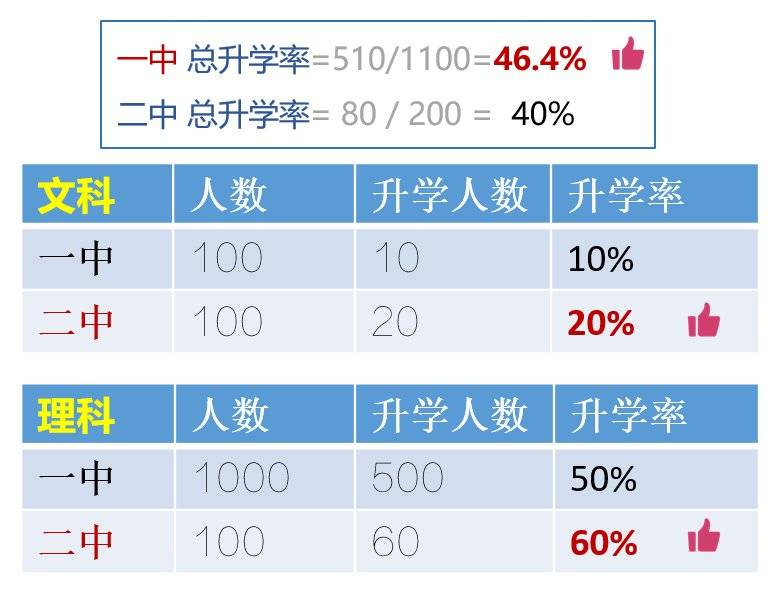
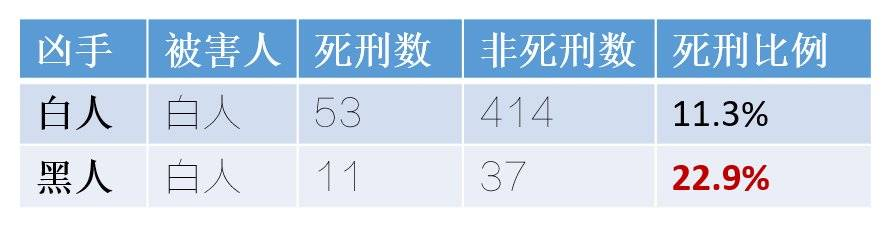
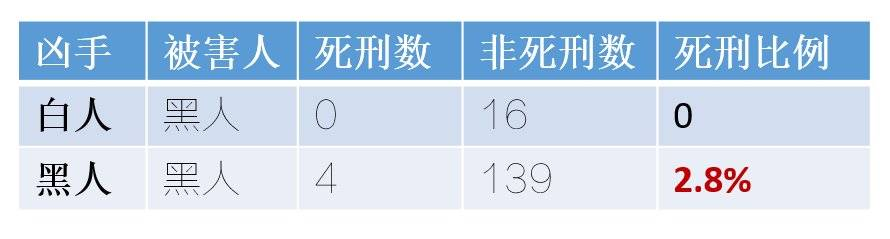

啰里啰唆是一份偏向互联网中青年的数字杂志，旨在分享与讨论，话题通常不固定，暂定每周四发布。
部分资源来源于网络。
免责声明：部分内容可能会引起内心冲突或愤怒等不适症状。

啰里啰唆互联网周刊第4期：为什么很多手机不支持通话音量无级调节

# 科技日常

## 1. ChaCha20-Poly1305  
科学上网的读者想必会经常接触到ChaCha20这种在教科书里没有提及到的算法。

Salsa20 是一种流加密算法，由 Daniel J. Bernstein 于2007年提交到 eSTREAM，2008年时丹尼尔·J·伯恩斯坦发布了一个密切相关的“ChaCha”密码家族，其目的是增加每一轮的扩散以实现相同或稍微提升的性能。后来Google选择了带有 Bernstein 的 Poly1305 消息认证码的 ChaCha20 作为一个 OpenSSL 中 RC4 的替代品，用以完成互联网的安全通信。这就是ChaCha20-Poly1305 的来历。之所以叫ChaCha20，是因为20表示该算法有20轮的加密计算。

Google 最初把这个算法用于 https流量在 Chrome 浏览器（Android手机版）与 Google 网站之间的通信。不久之后，Google 在 TLS 中采用它，ChaCha20 和 Poly1305 算法也以 chacha20-poly1305@openssh.com 成为 OpenSSH 中的一个新密码包。

ChaCha20 已经在2015年的 RFC 7539 中标准化。它在 IKE 和 IPsec 中的使用已在 RFC 7634 中标准化。在 RFC7905 中，Chacha20-Poly1305 已经被加入 TLS 扩展标准。

ChaCha20-Poly1305 针对移动端设备大量使用的ARM芯片做了优化，能够充分利用 ARM 向量指令，在移动设备上加解密速度更快、更省电。性能上，ChaCha20-Poly1305与AES算法相近或略快，不过由于
现代的ARM设备已经在硬件上支持AES算法，ChaCha20-Poly1305也不再是ARM设备上的首选加密算法了。不过在一些性能不强的设备上，比如家用路由器，ChaCha20依然是首选，可提供比AES更好的效能。

因此，在服务器后端这块，并不建议替换现有的AES算法到ChaCha20，不过可以作为一种增加复杂度的备选算法。
## 2. openSearchDescription
Firefox版本号升级到98后，已经去掉了内置的百度搜索引擎，但公司网络不允许使用代理工具，某些情况又不得不使用百度。

但firefox的设置里现在已经不能直接添加搜索引擎。于是翻了半天代码，翻到自己之前写的代码里使用的openSearchDescription，但是发现浏览器搜索栏不能自动识别了，然后查了会搜索引擎自己摸索了，发现浏览器对openSearchDescription的识别做了修改。

只有当你打开有openSearchDescription的页面，在浏览器地址栏搜索时，地址栏才会出现添加搜索引擎这个提示（早期的浏览器是打开页面就在搜索框黄标提示）。

出于考据癖，考察了各大搜索引擎，挺好，都支持。唯一一家不支持的搜索引擎是有国家队背景的中搜（前身是人民日报的即刻搜索）。

关于openSearchDescription的文档可以参看：[https://developer.mozilla.org/en-US/docs/Web/OpenSearch](https://developer.mozilla.org/en-US/docs/Web/OpenSearch)

## 3.为什么很多手机不支持通话音量无级调节

无级调节指在亮度、角度、音量等维度实现从0到最大值的任意调节的模式。无极调节对应的是“有极调节”，比如厂家在产品出厂时将屏幕亮度设置为3档，亮、中、暗，将音量设置为5格等。无极调节则可以让用户在允许的范围内设置任意参数，比如可以将屏幕亮度在 0 到 300nits 的亮度范围内任意调节，音量可以停留在 0-100 范围内的任意大小，屏幕角度可以在 0 到 180 度的区间内任意停留。

此处以大部分安卓手机为例。

手机的音量分四种：媒体音量，闹铃音量，电话铃声音量，通话音量，而通话音量平时是看不到的，只有在通话时才有这个调节按钮出现。

很多人会发现，在微信视频通话的过程中，没法降低音量，这个需求场景是有合理性的。尤其是在安静、严肃的场合，即有接通微信视频的客观需求，但又有不打扰其他人或不想其他人听到通话内容或者只想看画面的主观需求，加上很多人有大嗓门，这时候的通话音量即使调到最低依然很大，关闭通话音更是做不到。

原因就在于，微信视频使用的是通话的音道，包括一些live stream的直播，使用的并不是媒体音量，而是通话音量。在手机的设计和制造中，通话音量大多被设置为最低值为10%，不能彻底关闭，至于目前这么设计的理由，并没有统一的说法。有一种说法认为这是人性化设计，类似电视或电脑屏幕即使调到最暗还是能看到影像一样，避免由于不慎操作出现一些莫名其妙的不容易排查的傻瓜式错误，也有人认为这是工业化设计的历史糟粕遗留。

但是音量和屏幕亮度又不一样，手机听不到声音，用户第一个想到的而且也是唯一想到的方案就是去调音量，而不像电视看不到屏幕，用户可能会以为是接触不良或停电了。

另外不同的是，手机听不到声音可以用硬件按钮去调节，但是屏幕亮度为0，是没有办法通过硬件按钮去调节，因为屏幕亮度为0就看不到屏幕，看不到屏幕就无法调节亮度，这就陷入死胡同了。反而对电视来说是没有这个死胡同的，因为电视有硬件滚轮或遥控按钮来调节屏幕亮度，但是会陷入第一个问题，即增加排查成本。

**因此，一个参数是否支持无级调节，需要看三个因素：**

**1.在技术上实现是否有难度或高昂成本**

**2.是否会增加故障排查成本**

**3.在逻辑和使用上是否有死胡同的问题**

基于以上三点，我认为智能手机不支持通话音量无级调节是历史原因遗留的糟粕，是需要改正的。像小米这种在功能上比较体贴用户的手机就考虑的比较周到，当然，ADUI是另一回事了。

注：
1.有部分用户反馈其手机支持通话音量调节到最小或关闭，但很多是理解错误，其调的是媒体音量，不是通话音量。
2.确实有部分手机支持通话音量调节到最小或关闭，比如小米六，但不少手机并不支持。

# 读书分享

## 1. 《十日谈》

《十日谈》是意大利作家乔万尼·薄伽丘创作的短篇小说集，创作于1350—1353年。

该作讲述1348年，意大利佛罗伦萨瘟疫流行，10名男女在乡村一所别墅里避难。他们终日游玩欢宴，每人每天讲一个故事，共住了10天讲了百个故事，这些故事批判教会，嘲笑教会传授黑暗和罪恶，赞美爱情是才华和高尚情操的源泉，谴责禁欲主义，无情暴露和鞭挞封建贵族的堕落和腐败，体现了人文主义思想。
《十日谈》是欧洲文学史上第一部现实主义巨著 ，世界上第一部短篇小说集；意大利近代评论家桑克提斯曾把《十日谈》与但丁的《神曲》并列，称之为“人曲”。

注：
1.尽管这是一本我10岁时读完的小说，但该书大部分内容仍然可能被认定为18+的内容。该书宣扬爱情，谴责禁欲，内有涉及偷情，纵欲的内容，但并无具体色情描写。

2.有一部香港三级片电影叫《性工作者十日谈》往往也被简称《十日谈》，该片根据杨漪珊的报告文学《古老生意新专业——香港性工作者社会报告》改编，由邱礼涛执导，朱茵、余安安、蒋雅文、董敏莉等主演。电影于2007年5月17日在香港上映。
电影走进了性工作者的世界，以平实却具戏剧性的手法，感动而不煽情的内容，论尽行内百态。

## 2.“微雨寒村”，寥寥数字为什么给人“古典”的感觉？——谈中国文学的汉字性 
    “江南河港交流，且又地滨大海，湖沼特多，故空气里时含水分；到得冬天，不时也会下着微雨，而这微雨寒村里的冬霖景象，又是一种说不出的悠闲境界。你试想想，秋收过后，河流边三五家人家会聚在一道的一个小村子里，门对长桥，窗临远阜，这中间又多是树枝槎丫的杂木树林；在这一幅冬日农村的图上，再洒上一层细得同粉也似的白雨，加上一层淡得几不成墨的背景，你说还够不够悠闲？若再要点景致进去，则门前可以泊一只乌篷小船，茅屋里可以添几个喧哗的酒客，天垂暮了，还可以加一味红黄，在茅屋窗中画上一圈暗示着灯光的月晕。”

对于这些常用字而言，唯有陌生化的组合，才能激活字的形音义的各种可能性。“微雨寒村”就是这样一个组合。
  “微”和“雨”很少组合，“寒”和“村”很少组合，“微雨寒村”的组合更罕见。两个相互“陌生”的字组合在一起，由于没有现成的“平滑”的理解，读者就会展开字义间的丰富的联想。这就是“微雨寒村”这个字组的“初心”。而小徐同学的“古典”感，就是这样来的。显然，相较于现代汉语，文言文在字思维方面更胜一筹。

[https://mp.weixin.qq.com/s/--FeSi4Xi9mcibchAhbsuQ](https://mp.weixin.qq.com/s/--FeSi4Xi9mcibchAhbsuQ)

# 图论

## 1.辛普森悖论谎言

如果我给你一个组数据——市一中的升学率为46.4%，市二中的升学率为40%，你会把你的孩子送到哪个学校读书？当然是市一中！对不起，你选错了！看一看下面一张表，不管是文科升学率还是理科升学率，市一中都没有市二中高，但它的总体升学率却高于二中，你没看错，数据就是这么神奇！

一中在文科理科升学率都低于二中的情况下，总升学率却高于二中，很多人不理解，这其实是统计学上一个经典的悖论——辛普森悖论，它是英国统计学家E.H.辛普森于1951年提出的一个经典统计学现象，即总体结论和部分结论恰好相反。

那么这是为什么呢？是因为总体和部分在结构上呈现了大的差异，而这个差异有时候也会被人来制造谎言。1991年，科罗拉多大学的统计学家 Michael L. Radelet统计了1976-1987年美国佛罗里达州的谋杀案的数据，总体结果如下：

从结果上看，白人的死刑率为11%，黑人的死刑率为7.9%，看起来在审判上并没有种族歧视，然而真相并没有这么简单。

我们如果按凶手和被害人的种族进行细分，结论就完全不一样了，具体如下：

不管被害人是白人还是黑人，只要凶手是黑人，死刑率就明显高于凶手是白人的情况：

当被害者为黑人而凶手为白人的死刑率居然为0，即这种情况一个都没有判。

如何避免陷入辛普森悖论呢？

答案是警惕总体结论，通过科学合理的分组来查看具体细致的数据。
## 2.who love me back 

好心酸

# 谈天说地

## 1.菇娘与苦姑娘
近几年，在北方的超市越来越多见到了菇娘果的声影。

这是一种在除大西北和中原地区外，在全国均有广泛分布的野果，俗名“酸汤果”，“洋菇娘”、“毛酸浆 ”，甜中带酸，通常长在田间地头墙角下，植株矮小。

还有一种外形跟菇娘比较类似但微苦的野果，叫苦姑娘，也叫红姑娘，东北华北一带比较常见。

还有一种野果，叫灯笼果，原产南美洲的秘鲁和智利，外形跟上两者也类似，在长江以南和东北分布比较广泛。

至于在植物学上的分类，那就比较乱了，几者很容易被混淆。

## 2.此心安处，便是吾乡
北宋人王巩（字定国）是苏轼好友，“乌台诗案”中被牵连贬至宾州。王巩遭祸后家奴仆从顿时做鸟兽散，惟有一位名为宇文柔奴的女子愿意与他共赴宾州。苏轼对二人的遭遇一直心存愧疚，几年后有幸重聚，苏轼问柔奴岭南的日子是不是很苦。柔奴答：“此心安处，便是吾乡。”苏轼大为感慨，作《定风波》词一首。

《定风波·南海归赠王定国侍人寓娘》

常羡人间琢玉郎，天应乞与点酥娘。尽道清歌传皓齿，风起，雪飞炎海变清凉。
万里归来颜愈少，微笑，笑时犹带岭梅香。试问岭南应不好，却道：此心安处是吾乡。

## 3.同人于野，亨，利涉大川，利君子贞

偶见某社区将“同人于野”用于形容开源社区合作，感觉是个不错的场景。第三期的“拔茅连茹”同样是一个用于描述开放性社区互相协作、推荐传递的成语。

彖传曰：同人，柔得位、得中而应乎乾，曰同人。《同人》曰：“同人于野，亨、利涉大川。”乾行也。文明以健，中正而应，君子正也，唯君子为能通天下之志。

【玩辞】：与人亲同在旷野，亨通，利于济渡险难，利君子之占。一阴应五阳，是同人之象。旷远而无私，是「于野」之喻，「同人于野」，其同也大。六二中正，无私无曲，亲同五阳，物无不应，人无不助，事无不济，而亨之道也。乾之性健，离之情明，健而能明，足以济渡险难，故曰「利涉大川」。乾乾君子，烨烨之明，千里万古，志无不同，道无不合，君子之道如是，则其占无所不利也。

【疏传】：《序卦》曰：“物不可终否，故受之以同人。” 《否》象天地不交，《同人》象上下志通，倾否之始，惟天下同心同德，方能离否开泰，此《同人》所以次《否》也。《杂卦》曰：“同人亲也。” 《同人》是乾舍于离，《比》是坤舍于坎，故皆有亲比和同之义。

# 一句话快讯

1.根据《晚点 LatePost》了解，字节跳动 2017 年起大量招募内容审核员，至2021年初有超过 2 万人，多数被列入字节正式员工数，2022年最新数据未知。

2.2022年3月19日用户反映，Firefox 根据IP地址屏蔽中国大陆用户安装广告拦截扩展（如 uBlock Origin、AdGuard AdBlocker、AdBlock For Firefox 和 AdNauseam）,此次拦截与是否使用中国特供版无关，即使使用Mozilla官方英文版也会受影响。扩展页返回HTTP 451 状态码，此状态码表示 Unavailable For Legal Reasons.

3.2022年3月15日 F5 宣布禁止俄罗斯为 NGINX 项目作贡献，暂停在俄业务。

4.2022年3月21日，东航一架波音737客机在执行昆明——广州MU5735航班任务时，于梧州上空失联。目前，已确认该飞机坠毁。机上人员共132人，其中旅客123人、机组9人。

# 订阅方式

竹白：https://luoliluosuo.zhubai.love/
语雀：https://www.yuque.com/baicaibushicai/zk/

语雀可以使用rsshub进行rss订阅，比如本周刊rss地址为 (https://rsshub.uneasy.win/yuque/doc/25632997)，这并不是个好的方案，如果有比较完善且能照顾国内用户网络现状的订阅方式还望反馈（可通过邮箱、频道或者语雀评论等）。

建议或素材提供

邮件：bairadish@gmail.com
纸飞机频道：notonlyshare
