啰里啰唆是一份针对互联网和生活爱好者的数字杂志，旨在发现和分享一切有趣的东西。部分内容来自互联网采编，也有一些是编者本人的思考和短文，话题不固定，每期大约十五分钟阅读量，暂定每周四发布。

免责声明：部分内容可能会引起内心冲突或愤怒等不适症状。

第5期：一根针尖上能站多少个天使

# 科技日常

## 1. Fabrice Bellard
提起 法布里斯·贝拉 这个人，你可能不太熟悉，但是如果说一下他的事迹和作品，你大概率会说：“哦！原来是他啊”。

法布里斯·贝拉 1972 年出生在法国，大学就读于巴黎高等综合理工学院，后在国立巴黎高等电信学院攻读。

1989 年，贝拉写了一个压缩器 LZEXE，成为了 DOS 环境下很受欢迎的一个压缩软件，这一年，他 17 岁。

1997 年，他发现了最快速的计算圆周率的算法，后被称之为 “贝拉公式”。此后，在 2009 年，贝拉打破了圆周率计算的世界纪录，算出小数点后2.7万亿位，超过了由目前排名世界第 47 位的 T2K Open 超级计算机于 2009 年 8 月 17 日创造的世界纪录，新纪录比原纪录多出1200亿位。而贝拉仅用了一台价值 2000 欧元的普通 PC 机，2.93GHz Core i7 CPU，6GB内存，7.5TB硬盘。圆周率强者，恐怖如斯。

1998 年，他编写了一个简洁的 OpenGL 实现 TinyGL，如果你对图形学感兴趣，可以去看看这个项目。

2000 年，他发起了 FFmpeg。

2001年，他发起了TCC项目。

2005 年，他发布了 QEMU 项目。

大佬具体的履历可以访问 https://bellard.org/ 查看。这就是传说中的“真正的程序员”吧。

大佬的牛逼很容易让人想起十几年前夸高斯的一个网站，“用事实告诉你高斯有多牛B”（http://www.gaussfacts.com/，这个网站如今已下线）

> Erdős 相信上帝手中有一本包含世间所有精妙证明的天书。上帝相信这本书在 Gauss 手上。
> Gauss 不用任何公理就能证明一个定理。
> Gauss 可以化圆为方，再把它变成一个四维球。
> Gauss 可以既无重复又无遗漏地走遍 Königsberg 的七座桥。
> Gauss 可以用尺规作图三等分角。
> Gauss 可以在六步以内解决骑士周游问题。
> Gauss 同时给 Bertrand Russell 和自己理发。
> 不是 Gauss 发现了正态分布，而是自然规律遵循着 Gauss 的模型。
> 尽管微积分在 Gauss 生前 100 年诞生，但 Gauss 仍然发明了微积分。
> 如果 Gauss 发表了他的所有发现，数学界里就没啥可证的了。
> 有一次，Gauss 和自己玩了一个零和游戏，然后赢了 50 块钱。
> 有一次，Fermat 惹怒了 Gauss，于是就有了 Fermat 最终定理。
> 只有 Gauss 才知道 Schrödinger 的猫是死是活。

当然，IT圈也有类似的段子。

提到FFMpeg，就得说下耻辱柱一事。

FFMpeg 基于 LGPL/GPL 协议, 任何人都可以使用 ffmpeg 源码,但是必须遵守 LGPL/GPL 协议. 必须把自己的源代码也进行开源. 由于一些企业没有遵守 LGPL/GPL 协议, 没有公开源代码, FFMpeg 因此对这些不讲信誉的软件进行" 展示标榜 "。

2009年加入 FFmpeg 的播放软件： 暴风影音、QQ影音、KMP、GOM Player、 PotPlayer（2010）都在其列。

事到如今, FFmpeg 官网耻辱柱已经已2014年暂停，2019年下线（页面还在内容已清空，首页不可见）。一个小插曲，2011年3月13日，FFmpeg 项目新的维护开发组决定 FFmpeg 项目将分裂(fork)为 libav，但这个项目2018年后就停更了，然后再次合入了FFmpeg 。真乃分久必合，合久必分。

## 2.我的噪音

一个很好的白噪音网站。

myNoise creates beautiful noises to mask the noises you don’t want to hear : your chatty colleagues, tinnitus, or even your inner voice when you can't shut it down! The concept is simple, works extremely well, and does not require expensive noise-cancelling headphones. Thanks to its unique audio engineering, myNoise sets the standard among background sounds. 

https://mynoise.net/

## 3.tokei 项目代码类型和文件数统计
可以用来统计一个项目使用了哪些编程语言，各占多少文件和比例，对于了解一个项目的全貌比较有用。项目经理也很喜欢问类似的问题。这个软件的优点就是使用rust编写，单文件无依赖，速度快，跨平台。

下图是我对正在开发中的一个大型开源项目的统计，在机械硬盘上只花了2分钟左右。
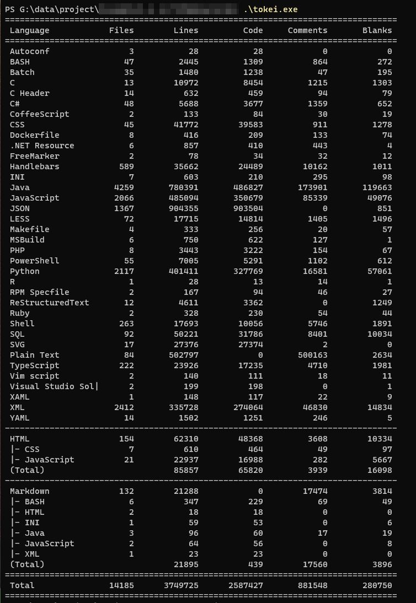

https://github.com/XAMPPRocky/tokei
# 读书分享

## 1.中国的山与茶：一文看懂茶叶大国江山图

> 中国产茶山脉大多集中在南方，从西边**怒山山脉**到中部**苗岭**、**武陵山脉**，至东南**武夷山脉**，再到**大别山脉**，都是孕育名茶的摇篮。
>
> 中国茶区平面分布在北纬18～37°，东经94～122°的广阔范围内，地跨19个省区的上千个县（市），6个气候带。在垂直分布上，茶树最高种植在海拔**2600米**高地上，而最低仅距海平面**几十米或百米**。

https://mp.weixin.qq.com/s/yciEl5YDOU9Syvm7CapEAA

## 2.江南三部曲-莫言心中的当代《**红楼梦**》

江南三部曲，是著名作家格非的代表作《人面桃花》《山河入梦》《春尽江南》，从构思到定稿，历时十七年,2015年获第九届茅盾文学奖。

三个老实人，三个疯子
三段爱情，三个时代
从清末民初直至当下欲望都市，一个家族跨越百年
在荒诞中奋斗，在飞蛾扑火中轮回
梦起于花家舍，梦尽于花家舍
一曲恢弘冷艳的史诗
映照中国人一个世纪的命运

“她觉得自己就是一只花间迷路的蚂蚁。生命中的一切都是卑微的，琐碎的，没有意义，但却不可漠视，也无法忘却。”
新娘秀米出嫁途中，被绑架到了一座与世隔绝的小岛，与花家舍隔岸相望。秀米以为自己误入世外桃源，却不曾想跌进了血雨腥风的土匪窝。神秘表哥离开前留下一本日记，解开了秀米心中的疑惑，也埋下了一个萦绕不去念头：这花家舍要是落到我的手里，保管叫它诸事停当，成了真正的人间天国。
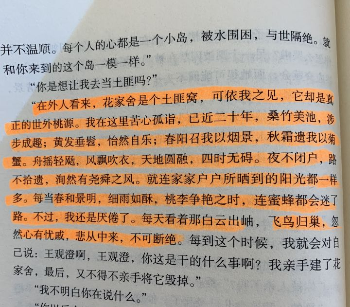

大家都说梅城县县长谭功达是个花痴，身上有股贾宝玉的呆气。一场暴风雨冲垮了谭力主修建的水坝，也把他的县长职位和他的爱情一起冲走了。花家舍成了他的流放地。心上人姚佩佩从此孤身一人逃亡荒野，在朝不保夕的日子里将一封封信寄到花家舍，也把悲剧带到了两个人的身边。

# 图论

## 1.视觉误导谎言

视觉误导是指把数据变成图表过程中玩的猫腻，图表严格意义上都没有错，但它呈现给你的方式会误导你得出错误的结论。我们来看几种典型的视觉欺骗。

### 1. 并不从0开始的Y轴

这是图片欺骗最低级最容易识别的手段，但现实中却被使用的最为广泛，目的是为了让图片走势更突出。为显示履约费用率持续走低，京东2019年Q2财报的宣传图里的Y轴是从5%开始，而不是从0开始：

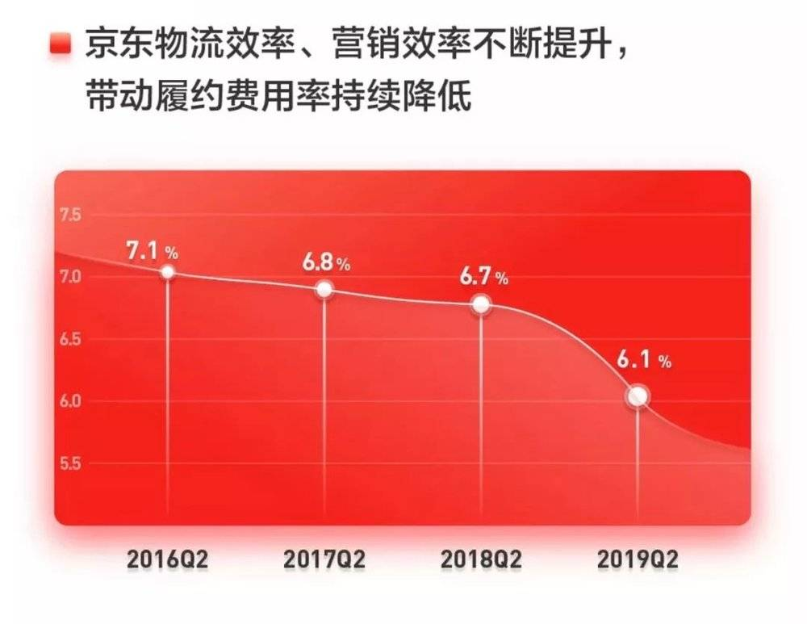

履约费用率下降很明显有木有，其实只有 1% (注：此图未出现在京东集团官网正式财报PDF，疑似外宣用途)。

小米在小米9的发布会上的这张图，乍一看小米9跑分遥遥领先，但仔细一看，Y轴还是被截断了：

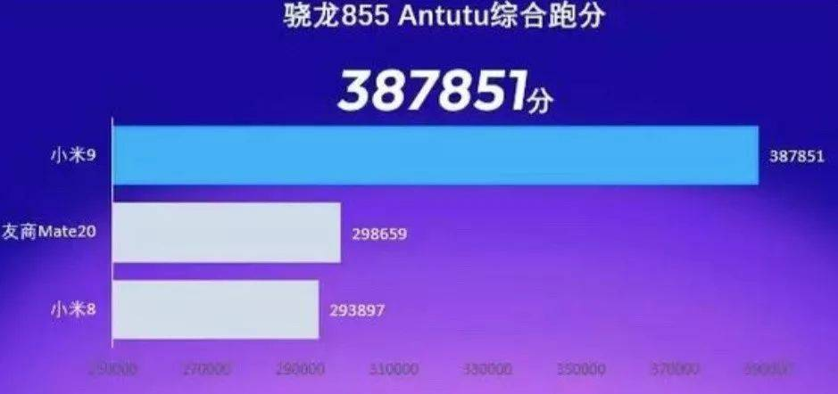

### 2. 刻意伸缩的Y轴

刻意拉长缩短，为的是突出或者缩小数据变化，我们来看一个典型的案例，一些反对气候变化的人士绘制了一张一百年来全球平均温度的图。

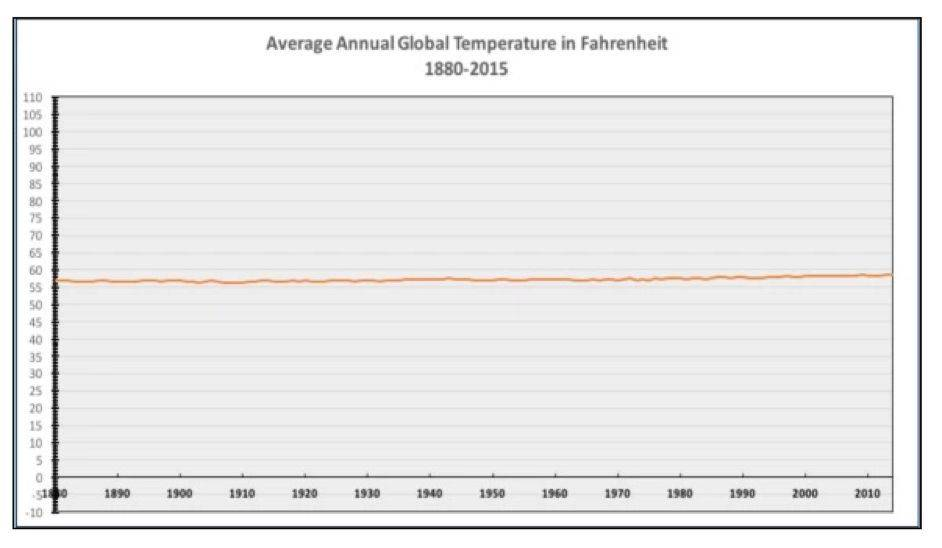

乍一看全球气温貌似一直是一条直线，并没有神马明显的变化，但一些环保人士则绘制了另一个条平均气温的图表，在下面这个图表中我们可以明显看到平均气温的上升，哪一个是真相？

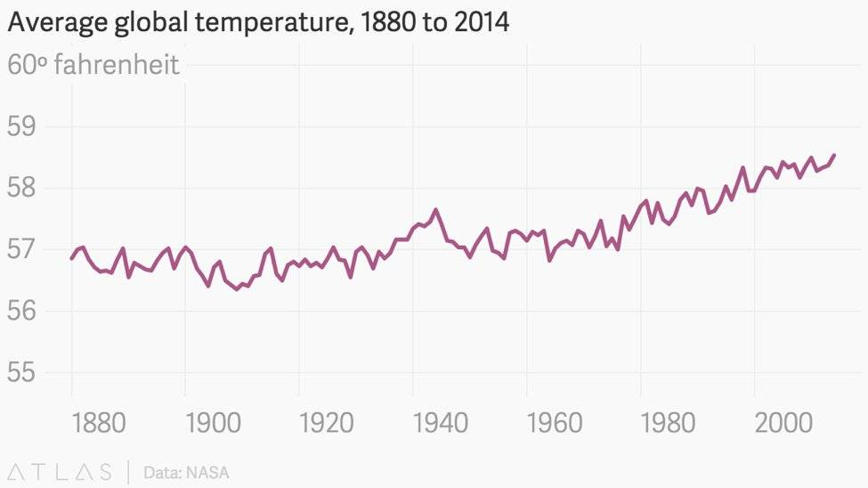

### 3. 意味深长的饼图

饼图原本是让我们清楚地看到各个部分的比例，但如果把饼图放倒，就会发生意想不到的效果，下面这张图来自爱奇艺的官方微博，直观看爱奇艺占据了图片的半壁江山：

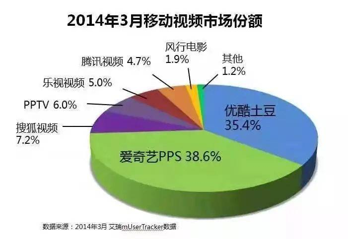

如果我们把图片还原，爱奇艺的领先效果就没那么明显了。

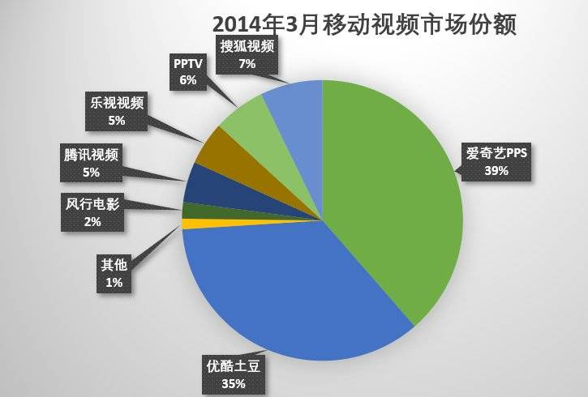

这个技巧是如此普遍，以至于乔帮主曾经也在发布会上也使用过

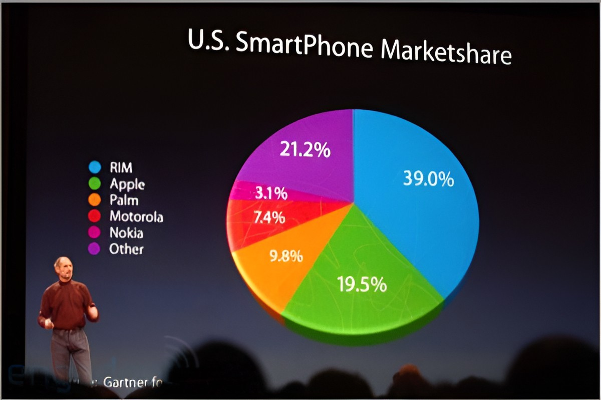

有没有发现苹果的份额19.5%比“其他”21.2%还要大。

### 4. 并不恰当的示意图

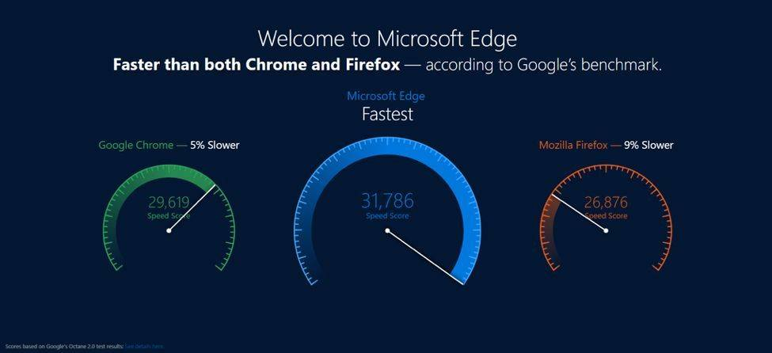

这张图片来自微软Edge浏览器官网，它把它的速度和Chrome和Firefox进行了对比，Edge的浏览速度的确领先，但在图上的领先比例被明显夸大了。

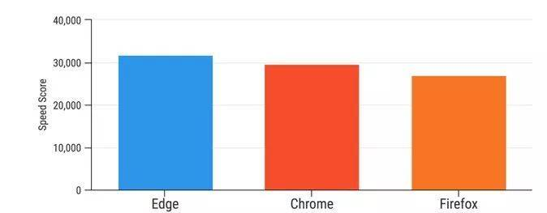

该节素材来源：https://gohalo.me/post/cunning-lie-about-facts-and-digital.html

## 2. 活干完了

# 谈天说地

## 1.圆周率是无限不循环数，里面可以找到世界所有人的生日、所有银行号码和所有手机号码吗
无限不代表一切皆有可能，虽然圆周率长度无限长，但是并没有规律，虽然确实有人找到了自己的生日或者手机号，但这都只是凑巧，而不是必然。
无穷不等于所有。

非常遗憾的是，目前为止我们只证明了π是个无理数。π是合取（包含所有可能）的吗？是正规（所有数字出现频率趋于一致）的吗？是随机（每一位上的数字都随机）的吗？

答案是：全都不知道。

虽然我们可以通过工程的方法来证明一些猜测，比如我们都知道银行卡的卡密其实是6位数的，也就是说，这个问题可以转化为圆周率是不是包含所有的六位数，这里包括000000~999999。比较简单的方法就是写代码，这个工程量并不大，要满足这条件，已经有很多人做过这个工作了，实际上在圆周率小数点后14,118,307位就包含了所有的六位数，最后出现的是569540。

同理，我们的生日实际上是8位数，从00,000,000~99,999,999。不过实际上，按照目前的情况来看，最多就是19,000,000~20,191,110。同样的方式，其实只要写代码就可以，这同样有很多人做过，在前10亿位内是可以把生日都找全的。

可以推测出，要想找齐11位的手机号或19位的银行卡号，需要更多的位数，但是随着位数增长，能寻到到的空间也以数量级增长。但是我们要从数学的角度判断π是否合取、是否正规，却极其困难。我们甚至都不知道pi里面是不是有无限个数字2。

当然，我们都已经计算出π的几十万亿位了，可以看看它们的分布来猜规律；也可以通过一些其他数学方法拐弯抹角地试图推断。从已知事实来看，π和正规性吻合得非常之好，换做任何别的人文、社科、自然科学，都可以当做定论来用了，因此几乎所有人都“觉得”它该是正规的。可惜，这是数学，数学是靠证明说话的，只要拿不出证明，数学家就不能安心睡好觉。

在2000年，数学家基于混沌理论的一个猜想初步证明了圆周率在二进制下是一个正规数。即便如此，这也不能说明圆周率在十进制或者其他进制下是正规数。正规数很特别，有些数只在某些进制下才具有正规性，而在其他进制下不具正规性。迄今为止，圆周率还没有被严格证明在任何一种进制下具有正规性。

## 2.**Seigneur-terraces** 
Coffee shop dwellers who sit at tables a long time but spend little money.    

> Even the greatest wordsmiths have moments when they just can’t find  the right word. Sometimes it’s because of a brain lapse, and other  times, it’s because we’re just not sure what we’re trying to say. But  sometimes, the word may just not exist in English. For those times when  you’re literally at a loss for written words, don’t be afraid to use  other languages as inspiration.
>
> Take, for instance, that feeling of dread when you first see your bad haircut. The Japanese have a word for that: Age-tori. Or, that joke  that’s so bad that so poorly told that you can’t help but laugh at it  (“jayus” in Indonesian). And tell me that there shouldn’t be an English  equivalent to this one: “Tartle,” the Scottish term for hesitating to  introduce someone because you’ve forgotten his or her name.

第四期我们谈到中文的意境美，这一次谈的是外语的意境。中文固然能做到简短，外语也一样，也往往能描述一种比较传神的意境。

比如Kilig，做名词的时候表示a feeling of exhilaration or elation caused by an exciting or romantic experience，形容那种喜欢一个人喜欢得好像胃里正有成千上万只蝴蝶翩翩，一张嘴就要全部飞出来一样的醉醺醺、麻酥酥感。。
例句：
"she could not contain her smiles and kilig, especially when he brought a bouquet of flowers just for her" · 

看到某平台把Kilig译为性欲，一口老血喷出来。。

## 3.一根针尖上能站多少个天使

How many angels can dance on the point of a very fine needle, without jostling one another?

8.6766×10^49

这既是个数学题，也是个哲学题。

**我们先来说数学**。

大致的推导逻辑如下：

普朗克长度大约是一个质子的10000000000000000000000之一那么长，普朗克长度根据光速、普朗克常数和引力常数推导而来。物理学研究认为普朗克长度是宇宙时空的最小分辨率：它是理论上能被测量的最短距离。也就是说如果两个位置之间的距离小于普朗克长度，这两个位置就无法被区分。

普朗克长度=1.61619926*10^-35 米

针尖的横截面长度=1埃=1.0*10^-10 米

以上两者都是长度，当我们利用普朗克长度计算出普朗克面积（普朗克长度的平方），那么它的量级是10^-70。同样的，针尖的面积是10^-20量级。这样做简单的相除的话我们得出的结果应该是10^50这个量级。

上面简单运算得出的10^50的量级其实是很好的答案了，但是还可以更加精确一点。就要考虑铁原子的质量，以及把针尖视作球体了。

老外的推导原文：https://improbable.com/airchives/paperair/volume7/v7i3/angels-7-3.htm

**然后再来说哲学。**

这个关于「天使」的问题最早来自神学大师阿奎那的著作 *Summa Theologica* 。在这本书中，阿奎那提出了一系列关于「天使」性质的问题，其中最有名的当然是这个「针尖」问题了。另外，他还饶有兴趣地问了很多超出常人想象的问题。举些例子：

天堂里会不会有排泄物？
复活的时候指甲和头发有没有长？
复活这件事会不会发生在晚上？
天使是否能瞬移？
天使能否辨别白天和夜晚？

能问出这种问题的人，你可以说他「无聊」，但这位当时最富盛名的大师却能引经据典地严肃研究「天堂排泄物」这样似乎非常「渎神」，「反媚俗」（用昆德拉的词语来形容）的问题。

阿奎那曾经说过这样的话：「世界并无起源」，「Christ从一开始并没有要解释万事万物」，「God不是万能造物主，他只是用爱维持已有的事物，即便世界没有源头他也会依然如此。」。

# 一句话快讯

1.自2022年1月1日起纳税人照护3岁以下婴幼儿子女的相关支出，按照每个婴幼儿每月1000元的标准定额扣除。2022年3月29日可在个税软件填报，前3个月可累计扣除。

2.“3·21”东航MU5735坠毁，132名乘客和机组人员确认全部遇难。

3.2022年3月29日，豆瓣发布公告称，因业务调整，4月18日私密小组将全部停用，6月30日私密小组功能正式停止服务。在此之前，小组组长可提交申请将私密小组转为公开小组。

4.电商巨头京东和视频网站 Bilibili将裁员称为是毕业，并恭喜被裁掉的员工毕业了。

5.2022年3月27日晚，第94届奥斯卡金像奖颁奖典礼上出现了戏剧性的一幕：颁奖人、脱口秀演员克里斯·洛克（Chris Rock）在介绍最佳纪录片奖时，拿威尔·史密斯妻子贾达（Jada）开了一个玩笑，没想到威尔·史密斯（Will Smith）突然走上舞台，对克里斯·洛克挥拳攻击，手掌直接扇到他脸上，现场众人惊呆，打完人不解气，威尔·史密斯在下台后还对着克里斯洛克大骂道：“你的烂嘴里别再出现我老婆的名字”。事后，威尔·史密斯向被他掌掴的洛克致歉。

# 订阅方式

竹白：https://luoliluosuo.zhubai.love/
语雀：https://www.yuque.com/baicaibushicai/zk/

有些读者希望通过 RSS 订阅本周刊，这里介绍两个可以用 RSS 订阅周刊的方法。

方法一：

语雀可以使用rsshub进行rss订阅，比如本周刊rss地址为 (https://rsshub.uneasy.win/yuque/doc/25632997，25632997为语雀id，需要有一定编程经验才能找到，如果使用语雀rss，请使用此固定id)。

或者使用 RSSHub 提供的路由，获得竹白周刊 RSS 源地址。

举例: https://rsshub.uneasy.win/zhubai/luoliluosuo

路由: /zhubai/:name

参数:
name, 必选 - name 为竹白主页 url 中的三级域名，如 luoliluosuo.zhubai.love 的 name 为 luoliluosuo

> 提示：
> 在路由末尾处加上 ?limit=限制获取数目 来限制获取条目数量，默认值为 20
> 这个 RSS 源不支持全文输出。

方法 2：使用 Kill the Newsletter! 服务，把竹白 newsletter 转成 RSS。

1. 打开 https://kill-the-newsletter.com/ ，输入 Newsletter 的名字(任意起个名字即可，比如：啰里啰唆)，然后点击 Create Inbox
2. 然后你会看到它提供给你的用来订阅的邮箱地址和 RSS 订阅源地址
3. 将邮箱地址输入到你要订阅的 newsletter 网站（[啰里啰唆](https://luoliluosuo.zhubai.love/)）里
4. 将 RSS 订阅源地址添加到你的 RSS 阅读器里
5. 一般情况下，RSS 阅读器里收到的第一个订阅消息是叫你确认订阅或验证邮箱的内容，点击确认地址即可。**下一期内容**开始会出现在 RSS feed 里。

使用方法建议或素材提供

邮件：bairadish@gmail.com
频道：notonlyshare