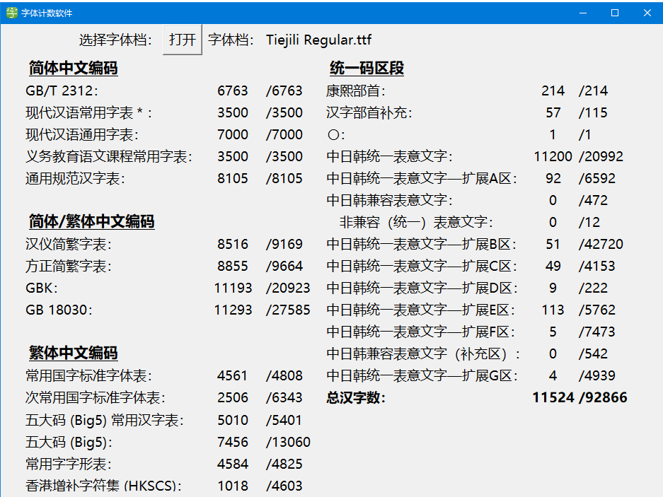
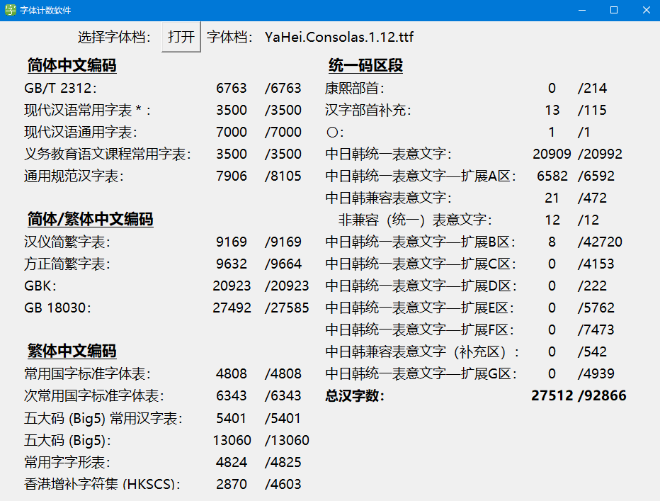
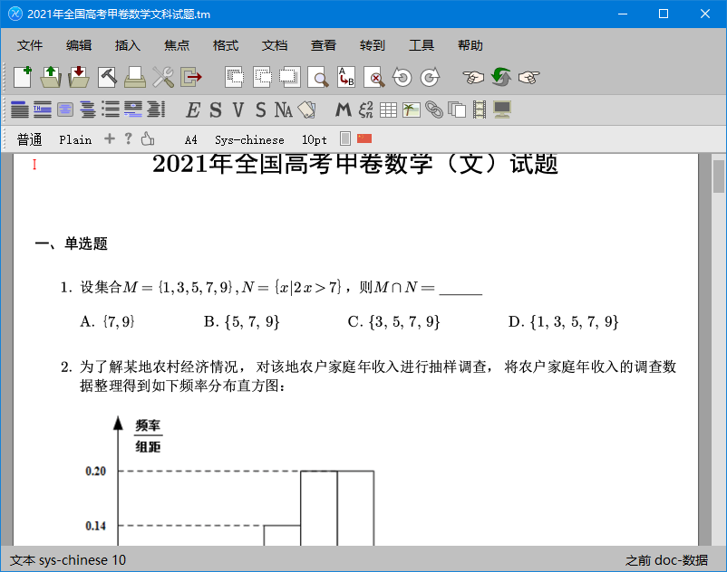
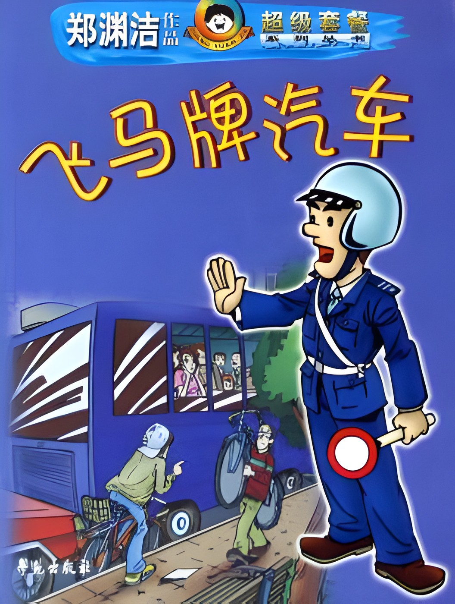
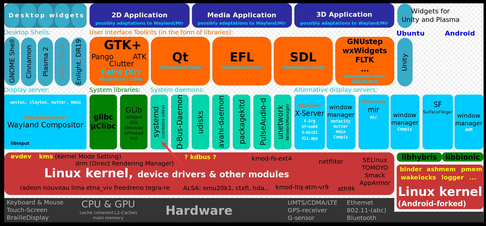
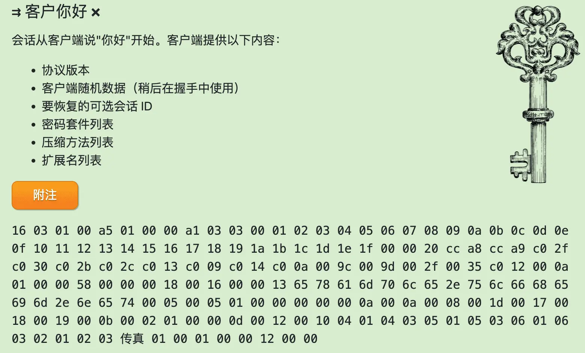
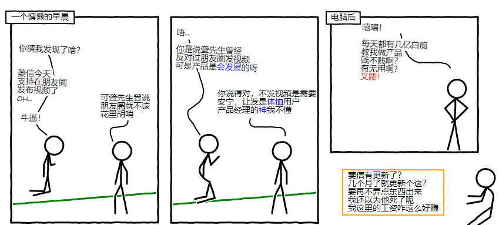
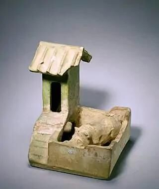
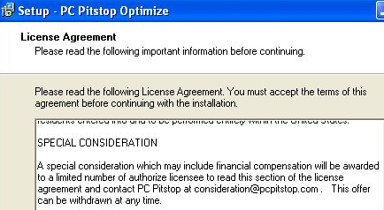

啰里啰唆是一份针对互联网和生活爱好者的数字杂志，旨在发现和分享一切有趣的东西。部分内容来自互联网采编，也有一些是编者本人的思考和短文，话题不固定，每期大约十五分钟阅读量，暂定每周四发布。

免责声明：部分内容可能会引起内心冲突或愤怒等不适症状。

第6期：第一次的亲密接触

# 科技日常

## 1. 字体计数软件
假如你下载了一个中文字体，你怎么知道这个字体的质量如何，是否是完备的。虽然常用汉字只有6700多，但是实际使用中还会遇到不少生僻字，尤其是做文字和排版工作的，如果一个字体虽然好看，但是缺少了不少高频汉字，那么这个字体显然是不够用的。
对于非专业字体用户，这个字体计数软件软件就很有用了，它能显示这个字体所覆盖的各类字符集的大小以及总汉字字数。
下面是对一款免费可商用的字体-铁蒺藜体的统计

对比下微软推出的雅黑字体，少了一万五千多个汉字，但依然比很多名人字体和艺术字体好多了。名人字体和艺术字体通常只覆盖了GB2312的6000多个汉字。

软件地址：[https://github.com/NightFurySL2001/CJK-character-count](https://github.com/NightFurySL2001/CJK-character-count)

## 2. 墨干编辑器V1.0.1发布

墨干编辑器衍生自GNU TeXmacs。与TeXmacs的主要区别是：
•  界面：从Qt 4.x升级到了Qt 5.x
•  脚本引擎：从Guile 1.8切换到了S7
墨干编辑器v1.0.1是基于GNU TeXmacs 2.1.1定制的基础版本，功能上和2.1.1完全一致，擅长处理数学公式以及LaTex，并支持导出PDF。其内置了10套高考数学试卷排版demo以及部分中文排版示例。最新版支持Win/Linux/MacOs。

## 3.Spring框架存在高危RCE零日漏洞
2022年3月28日起，由微博网红黑客日娃和云舒传出Spring框架存在高危RCE零日漏洞，随后该消息在中文互联网圈疯传。

据网上疯传的介绍，该 RCE 漏洞源于 Spring 框架核心的 SerializationUtils#dserialize 方法，该方法基于 Java 的序列化与反序列机制，可导致远程代码执行 (RCE)，使用 JDK9 及以上版本皆有可能受到影响。

事实上，早在2022年2月19日 Spring 框架的仓库就出现过对该 SerializationUtils 方法的讨论，开发者 ledoyen（https://github.com/ledoyen）  就指出：基于 Java 的序列化机制，SerializationUtils#dserialize 可能导致 RCE 远程代码执行漏洞，因此他提出了弃用 SerializationUtils#dserialize 的 PR #28075 （https://github.com/spring-projects/spring-framework/pull/28075）。

有人询问在该 PR 下询问“SerializationUtils#dserialize 是否应该作为漏洞报道”时， ledoyen 也进行解释：

    SerializationUtils#dserialize本身不是漏洞，使用此工具处理用户输入数据可能会导致 CVE，但该方法在内部作为缓存结果拦截器（ CacheResultInterceptor） 使用的话，则不会导致任何漏洞。

目前， SerializationUtils#dserialize在 Spring Framework 6.0 中已弃用，而对于 5.3.x 版本，则是向 Javadoc 中添加针对 SerializationUtils 工具类的警告，以提高用户的警觉意识。

实际上，这次漏洞并非网传的SerializationUtils导致。3 月 31 日 ~ 4 月 1 日 ，Spring 框架开发者 ROSSEN STOYANCHEV 发博客（https://spring.io/blog/2022/03/31/spring-framework-rce-early-announcement）承认 Spring 框架存在 RCE 漏洞，代号为  CVE-2022-22965（https://tanzu.vmware.com/security/cve-2022-22965） 。这个漏洞是3月29日深夜，由中国的蚂蚁集团的codePlutos，meizjm3i向VMware报告。

该漏洞触发条件：

- JDK 9 or higher
- Apache Tomcat as the Servlet container
- Packaged as a traditional WAR (in contrast to a Spring Boot executable jar)
- spring-webmvc or spring-webflux dependency
- Spring Framework versions 5.3.0 to 5.3.17, 5.2.0 to 5.2.19, and older versions

However, the nature of the vulnerability is more general, and there may be other ways to exploit it that have not been reported yet.

对于安全问题，我们当然需要重视，但搞个大新闻，违规披露漏洞也是中文互联网安全圈的常规操作了。为什么蚂蚁集团向VMware报告的漏洞会在报告给厂商前就泄露呢，然后再微博和微信广泛传播？

最早在微博披露此漏洞的两位业界“大佬”，既不是一线安全从业人员，也不是阿里员工，为何蚂蚁的员工向这两位披露了漏洞详情，也许可以理解为业界交流，也许是违规操作。

注：对于安全漏洞，通行的规则是先披露给厂商，并给予30-90天宽限期用于补丁修复及新版本更替，而不是发在微博上或微信公众号平台，沽名钓誉，吸引流量。按照通行规则，漏洞先披露给厂商，然后才是在小圈子内披露给相关安全人员，最后才是公众。

# 读书分享

## 1. 《第一次的亲密接触》
《第一次的亲密接触》被公认为是“网络小说开山之作”，也是中国互联网史上的第一部畅销小说。

《第一次的亲密接触》是当代作家蔡智恒（痞子蔡）于1998年创作的一部网络言情小说。这部小说讲述了主角痞子蔡因一篇Plan邂逅女孩轻舞飞扬，而发展成为知心好友，小说描述了“一杯大可乐两份薯条”，“泰坦尼克号”、“香水雨”等一幕幕故事场景，最后，女主角却因疾病离开人世。

《第一次的亲密接触》中作品情节、角色设置看似简单，细细品味却含蓄隽永。其中痞子蔡的戏谑、欢快背后是轻舞飞扬的哀怨、悲怆，在外在的戏谑下是永恒的纯真。从开头的谐谑到结尾的真挚，恰恰意味着当代的游戏精神始终还是难掩人心人性深处永远的真情底色。

这本书很老了，里面描述的时代可能对很多人来说很远了，但是对80后来说，又历历在目。曾经互联网上的那份真诚和乌托邦已经不在。

> 最后她张开双臂，像是淋雨般，仰着脸走过这场香水雨。
> “呵呵呵，痞子，好香好好玩哦！轮到你了。”
> 她开怀地笑着，像个天真无邪的小孩。
> 此时别说只叫我擦香水，就算要我喝下去，我也不会皱一下眉头。
> 我让她把香水擦在我的左耳后，以及脖子上和左手的静脉。
> 这是我第三次感觉到她手指的冰冷。
> 是香水的缘故吧！我想。
> “痞子，准备了哦，我要洒香水啰！”
> 我学着她张开双臂，仰起脸，走过我人生的第一场香水雨。
> “痞子，接下来换右耳和右手了。”
> 哇勒，还要再来吗？我赚钱不容易耶。
> 在我还来不及心疼前，她已经走过了她的第二场香水雨。
> 而这次她更高兴，手舞足蹈的样子，就像她的昵称一样，是一只轻舞飞扬的蝴蝶。
> 深夜的胜利路巷子内，就这样下了好几场的香水雨。直到我们用光了那瓶Dolce Vita。
> “DolceVita用完了，这个甜蜜的日子也该结束了。痞子，我上去睡了。今夜三点一刻，我不上线，你也不准上线。”
> “为什么？”
> “你在中午12点上线时就知道了。记住哦！只准在中午12点上线。”
> 她拿出钥匙，转过身去打开公寓大门。
> 就在此时，我看到她的后颈，有一处明显的红斑。

注：除了小说外，本书在大陆也有改编的电视剧。

## 2. 《飞马牌汽车》
《飞马牌汽车》是学苑出版社2005年02月出版的图书，作者是郑渊洁。
这部作品讲述了一辆新出厂的叫飞马牌的公交车刚上路就遇上了极其严重的堵车，而从司机到售票员再到交警都严格的“遵守”交通管理条例——公交车没有进站时车上任何人员不得下车，以至引发了一连串如吃饭，上厕所，结婚，抓捕逃犯等问题，而在人们解决这些问题中则发生了各种令人啼笑皆非，忍俊不禁的故事。

> “警察先生，车上不少乘客要。……要上厕所，能开车门吗？”女售票员问执勤的警察。
> 警察看了一下表，他也觉得堵的时间可以了。但他是法律的执行者，他无权修正法律。
> “我请示一下，现在还不能开。”警察说完从皮带上解下对讲机。
> “我是００８，我是００８，呼叫０１，呼叫０１，请回答。”警察右手拿着对讲机喊话，左手的大拇指勾住腰带。
> 乘客们的耳朵都对准对讲机，捕捉着喜讯或噩耗。
> “我是０１，我是０１，请讲。”对讲机喊叫着。
> 全车乘客都对“０１”坚守岗位的工作精神大加赞赏和钦佩。
> “请示０１，００８管区内有一辆公共汽车，已经被堵了三个多小时。车上部分乘客要求上厕所，能否开车门？”００８号警察请示上级。
> “此事涉及国家交通管理法规，我不能擅自决定，我立即向上边请示。”０１回答。

> “这。……我得请示一下市里。”堵车局长感到事关重大。
> 市长立即召开了紧急会议，讨论研究飞马牌汽车里的一名乘客能否离车问题。
> “如果同意他出来，咱们可就前功尽弃了。”一位局长说。
> “对，交通法规上写得清清楚楚，公共汽车未进站，乘客不得离车。”交通警察局长提醒大家。
> “可他已经死了，而且还是位领导人员。”教育局长发表意见。
> “什么级别？”市长问。
> “驴级。”堵车局长回答。
> “可以不考虑他的级别问题。”市长指示。
> 驴级领导在该市不属于珍贵动物保护范围。
>
> 经过一番有滋有味的讨论，会议决定：１．该乘客（已故）不能离车，因为法规上没有已故乘客可以在公共汽车未进站下车的规定；２．飞马牌汽车现在是具有国际影响的汽车，是全世界观察该国法制健全的窗口，今后任何有关飞马牌汽车的情况均由市里决定；３．飞马牌汽车飞乘司联合会主席的级别上升为马级，新任主席由市里任命，在车外对车内实行遥控领导；４．立即命令科研单位研制保存尸体的新产品（注：不是水晶棺，因为该尸体级别不够）。
>
> 。。。
> 新任市长决定解决交通堵塞。他花了比建造１００座立交桥更多的精力财力人力物力终于以数万人失业为代价换取了通车。
> 当飞马牌汽车突然发现前面的汽车没有了时，它感到阳光很刺眼。司机狠命打火才点燃了它的发动机，飞马牌汽车喘着粗气，像婴儿初学走路一样一面观望一面犹豫不决地行走。
> 它讨厌行车，渴望停顿。

# 图论

## 1.Linux层次图

## 2.图解 TLS 连接
图解 TLS 连接。用在线交互的方式讲解 TLS 的全过程，从建立 TLS 1.2 客户端发送 ping 再到接收 pong，详细到每一个字节。在线尝试:https://tls.ulfheim.net/

## 3.神的启示录

谁是神谁牛逼！

# 谈天说地

## 1.粪文化
曾经在某乎看到一个提问，问古代没有下水道和污水处理措施，不会到处是粪便吗，臭气熏天。
黑人问号？？看来很多年轻一代人，对历史和古代文化没有了解，两指不沾阳春水。

中国古代农业特别重视追肥技术，也就是说古代所产生的粪便大部分都被农田消耗了。
中国有句老话叫：庄稼一枝花，全靠粪当家。

直到本世纪初，还有不少老农还会背着粪篓，拿着钳子去田间地头捡羊粪、牛粪。古代农民一直把粪当做宝贝去对待，以至于《抚郡农产考略》里面曾经说过：“此间农人惜粪如金。”就是把粪便当做金子一样看待，所以那时候还产生了一个名词，管粪叫“金汁”。甚至于围绕城市清理粪便，贩卖粪便等专门产生一系列行业，卖粪还演变成一种商业行为。

农村还有一句话，肥水不流外人田，自己的屎尿得拉到自家厕所去。我年轻的时候（90年代），村里养牛的人家，粪便还有人来购买，一牛车10-20元。

除了农田施肥外，粪便还可以吃，比如喂猪。古代粮食产量有限，用粮食喂猪是不现实的，但猪又不像🐂和🐏一样，可以吃草为生。牛羊吃的草，猪大部分不能消化，也不会吃，猪主要是吃野菜，小的时候我曾经打过猪菜，打碗花，灰灰菜等都是猪的最爱。所以在古代，猪的口粮主要是人粪和野菜。

猪是杂食动物，需要注意的是杂食动物不等于食草动物+食肉动物。杂食动物的植物性食物很有限，并且从解剖学上来说跟食草动物区别也很明显。

古代的厕所结构虽然与现代不同，但使用方法还是差不多的。
在秦汉时期，古代的厕所多为上下两层结构，上层是厕所，下层为猪圈。这也导致了在古代猪肉一直不受人欢迎，被称作下等人的肉食。

在秦汉、隋唐一直到南北朝时期，上等人的肉食一直为羊肉，然后是鱼肉、鸡肉等。虽然牛肉也吃，但是出于保护耕牛的目的，古代获取牛肉的渠道很狭窄，所以羊肉始终排在第一位。

在宋朝之后，肉食中的猪肉后来居上，一方面是金朝入主北方，对中原饮食文化产生了影响，另一方面则是因为人口增多。因为宋朝以后，中原地区的人口不断繁衍，但是耕地就那么多，这时候就出现了人与土地之间的矛盾。人越来越多，地越来越狭窄，能够放牧的土地逐渐减少，因此羊肉变得越来越贵。而猪最大的优点就是好养活，并且不挑食，啥都吃，于是猪肉就变成主要的肉食了。当然，厕所形制的改变也是原因之一，宋代以后厕所就与猪分开，变成单独的了。当然，在中国的偏远农村，直到上个世纪末，还有一些人猪混居混厕的现象存在。

另外补充一点，除了人粪可以喂猪，鸡粪、鸭粪也能喂猪，而且更好。因为鸟类消化道短，食物消化不完整，所以鸡粪更有营养。曾经家里养鸡，每当猪胃口不好的时候，加一份鸡屎大餐，猪仔的胃口哗啦哗啦地变好了。

虽然古代粪便可以肥田很受欢迎，但是粪便的堆积会导致渗透入地下水。到了清朝，随着城市的规模扩大，人口密集，粪便处理不及时，北京城里的井水都成了苦水井，只有极少数的井水口味正常，所以家家户户只能喝苦水，除非是大户人家才能喝到从远处挑来的清甜井水。

## 2.故事和讲故事
200X年代的时候，互联网其实已经很发达了，QQ和淘宝已经比较普及了，在线听歌，看电影，玩网络游戏都不是稀奇事，但是那个年代，媒体还没有今天这么发达。除了各大新闻网站，就是论坛和博客，微博和自媒体还没有出现。

那个年代，《读者》和《故事会》依然是报刊亭里受欢迎的杂志，哦，今天已经没有报刊亭这个东西了。0几年的时候看过这么一篇《读者》的文章：讲的是暧昧的一男一女冬天开车出去旅行，女的尿急，风雪又大，女的就躲在打开的车门后尿尿，然后屁股被冻在车门上了。又要活命又要解冻，那没办法，随行男士只能用一泡热尿给她解冻了。

有点味道？有点低俗？

《读者》的结尾是这样的“后来，他俩结婚了，这么尴尬的经历都走过了，还有什么不能接受呢”。

但是，我明明记得更早几年的另一本杂志，也许是《意林》，也写了个一模一样的事，只不过结尾是这样的，“后来，他俩分手了，经历了这么尴尬的事，还有什么脸相处呢”

当年，我陷入了深深的纠结，这个故事，到底哪个结局和合理的呢。明明是一样的故事，为什么会讲出完全相反的两个结局。

时至今日，看着各种会讲故事的自媒体和官媒体遍地开花，算是想清楚了，你们就使劲编吧！

## 3.真的有人会去看用户协议吗

2005年的时候，PC Pitstop公司为了测试下是否真的有人会去看最终用户协议（EULA，End User License Agreements），在用户协议里放了一笔奖金，只要有人联系他们就能拿到这笔钱。结果直到5个月卖出去了3000份产品后，才有人跟他们联系，然后拿到了1000刀的奖金。

来源：https://techtalk.pcmatic.com/2012/06/12/it-pays-to-read-license-agreements-7-years-later/?

甚至有的公司在EULA中写了一些很滑稽、荒诞的东西，但是并没有太多人会去关注，也许你已经悄悄默认这些协议了。

比如iTunes的用户协议中（https://www.apple.com/legal/internet-services/itunes/us/terms.html），除了提到任何来自美国禁运国家或地区不能使用该产品外，还有一条是“不能用iTunes建造核武器”

> You also agree that you will not use these products for any purposes prohibited by United States law, including, without limitation, the development, design, manufacture, or production of nuclear, missile, or chemical or biological weapons.
>

还有亚马逊的zombie条款。

Amazon Lumberyard是一个免费的游戏引擎。任何人都可以使用它来构建或运行一个游戏; 它集成了 Twitch 流媒体和亚马逊的 AWS 云平台。

在 AWS EULA 的第42.10节中（https://aws.amazon.com/service-terms/），亚马逊声明Lumberyard不适用于生命关键或安全关键系统，如医疗设备操作、自动化运输系统、自动车辆、飞机或空中交通管制、核设施、载人航天器或与实战有关的军事用途。但是有一个例外：

> However, this restriction will not apply in the event of the occurrence (certified by the United States Centers for Disease Control or successor body) of a widespread viral infection transmitted via bites or contact with bodily fluids that causes human corpses to reanimate and seek to consume living human flesh, blood, brain or nerve tissue and is likely to result in the fall of organized civilization
>

来源：https://www.makeuseof.com/tag/10-ridiculous-eula-clauses-agreed/

# 一句话快讯

1.中国卫健委表示，3月份累计新增本土感染者已超过10W。

2.辽宁都市频道主持人朱霞，因在个人直播平台发表涉疫言论，被通报批评，免去都市频道管理部负责人职务，暂停其主持、采访等工作。

3.2010年4月6日，北京中关村银谷大厦807，雷军成立了小米。

4.著名武打明星王羽因病4月5日辞世，代表作有《独臂刀》、《风雨双流星》等。

5.4月4日消息，在美国证券交易委员会披露文件显示特斯拉 CEO 埃隆・马斯克持有推特（Twitter）9.2% 股份后，Twitter 美股盘前交易量上升，盘前股价上涨超 26%。根据推特周五的收盘价计算，马斯克这些股份价值 28.9 亿美元，现在他已成为推特单一最大股东。

6.当地时间4月1日，位于美国纽约市斯塔顿岛的亚马逊公司员工以55%的支持率，投票决定成立工会，不过这一结果仍在等待美国劳资关系委员会的批准。若工会最终成立，这将是历史上亚马逊首次在美国成立工会。

# 订阅方式

竹白：https://luoliluosuo.zhubai.love/
语雀：https://www.yuque.com/baicaibushicai/zk/

有些读者希望通过 RSS 订阅本周刊，这里介绍两个可以用 RSS 订阅周刊的方法。

方法一：

语雀可以使用rsshub进行rss订阅，比如本周刊rss地址为 (https://rsshub.uneasy.win/yuque/doc/25632997，25632997为语雀id，需要有一定编程经验才能找到，如果使用语雀rss，请使用此固定id)。

或者使用 RSSHub 提供的路由，获得竹白周刊 RSS 源地址。

举例: https://rsshub.uneasy.win/zhubai/luoliluosuo

路由: /zhubai/:name

参数:
name, 必选 - name 为竹白主页 url 中的三级域名，如 luoliluosuo.zhubai.love 的 name 为 luoliluosuo

> 提示：
> 在路由末尾处加上 ?limit=限制获取数目 来限制获取条目数量，默认值为 20
> 这个 RSS 源不支持全文输出。

方法 2：使用 Kill the Newsletter! 服务，把竹白 newsletter 转成 RSS。

1. 打开 https://kill-the-newsletter.com/ ，输入 Newsletter 的名字(任意起个名字即可，比如：啰里啰唆)，然后点击 Create Inbox
2. 然后你会看到它提供给你的用来订阅的邮箱地址和 RSS 订阅源地址
3. 将邮箱地址输入到你要订阅的 newsletter 网站（[啰里啰唆](https://luoliluosuo.zhubai.love/)）里
4. 将 RSS 订阅源地址添加到你的 RSS 阅读器里
5. 一般情况下，RSS 阅读器里收到的第一个订阅消息是叫你确认订阅或验证邮箱的内容，点击确认地址即可。**下一期内容**开始会出现在 RSS feed 里。

使用方法建议或素材提供

邮件：bairadish@gmail.com
频道：notonlyshare