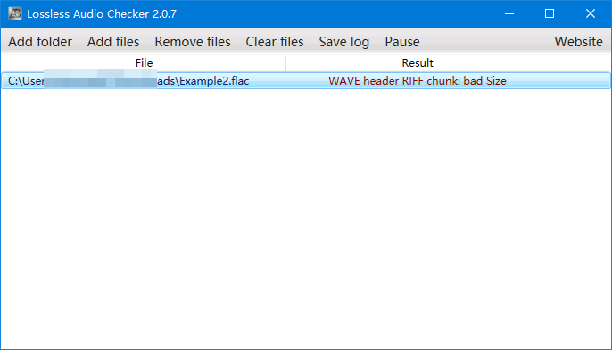
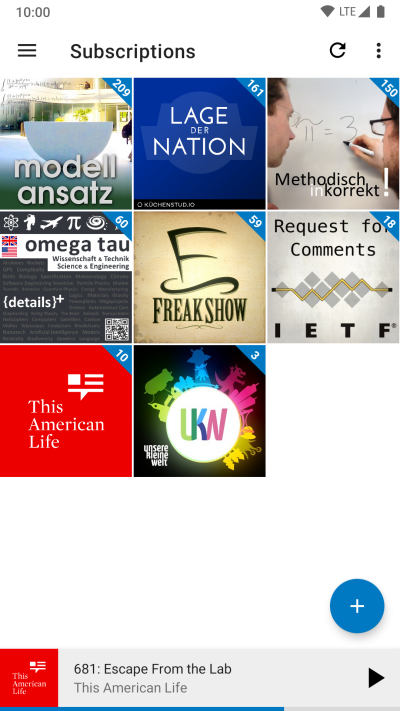
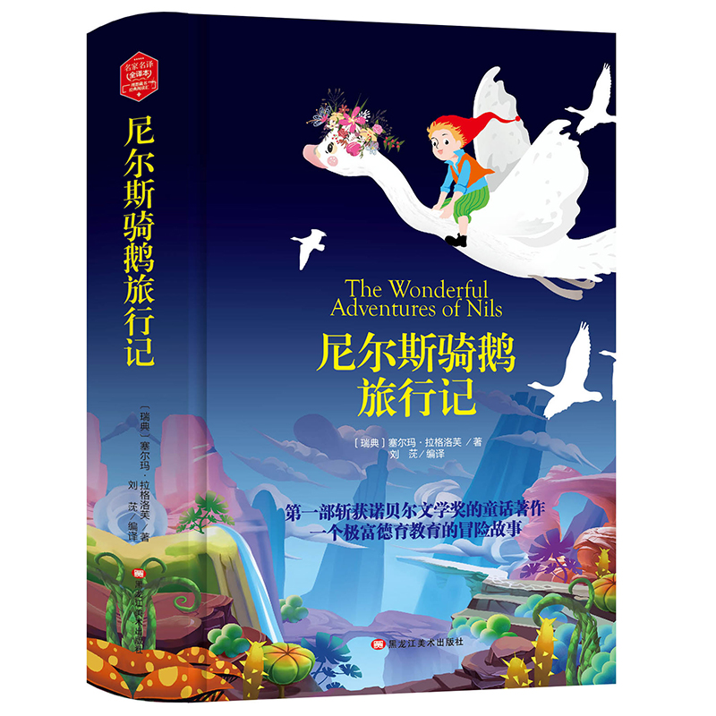
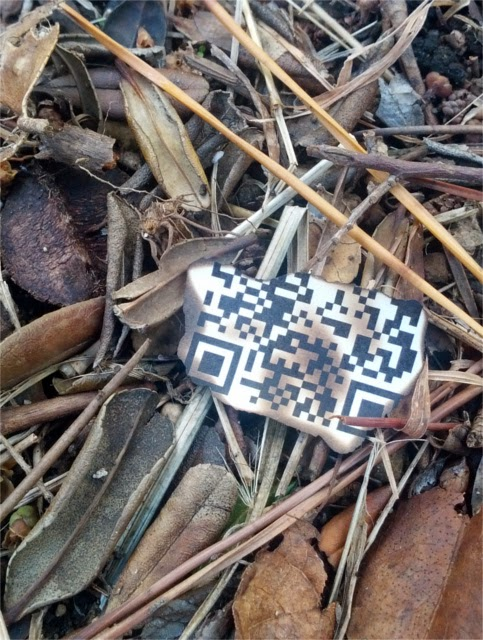
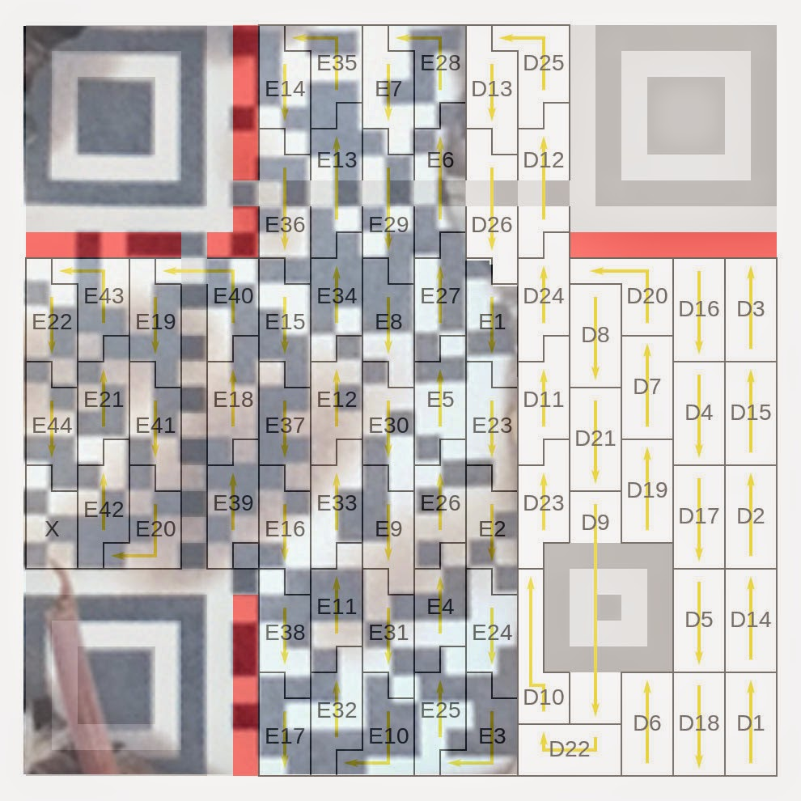
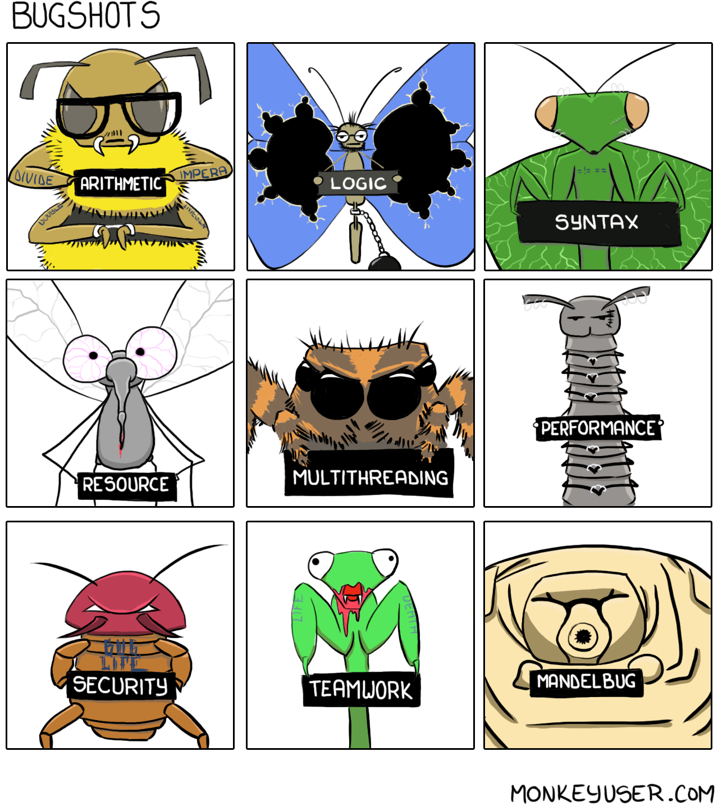
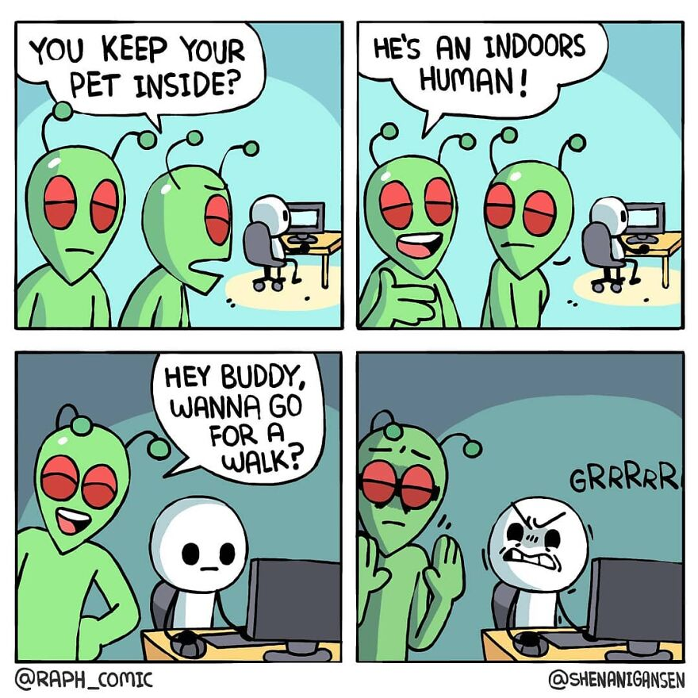

啰里啰唆是一份针对互联网和生活爱好者的数字杂志，旨在发现和分享一切有趣的东西。部分内容来自互联网采编，也有一些是编者本人的思考和短文，话题不固定，每期大约十五分钟阅读量，暂定每周四发布。

免责声明：部分内容可能会引起内心冲突或愤怒等不适症状。

第7期：古登堡计划

# 科技日常

## 1. 免费开源视频剪辑软件OpenShot
OpenShot创建于2008年，是一个免费开源的视频编辑器。可在Linux，Mac和Windows上使用。界面操作对新手比较友好。可用于修剪与切片，视频效果调整，动画&关键帧特效，音轨调整等。
下载包约160MB.

当然，如果您是专业的视频编辑器，则应使用付费版本，例如Adobe Premiere Pro，以获得最佳效果。

https://www.openshot.org/zh-hans/

## 2. Spek && Lossless Audio Checker 无损音乐检查
首先普及一下音乐文件常识：

音乐文件播放格式分为有损压缩和无损压缩两种。常见到的MP3、WMA、OGG被称为有损压缩，有损压缩顾名思义就是降低音频采样频率与比特率，输出的音频文件会比原文件小。另一种音频压缩被称为无损压缩，能够在100%保存原文件的所有数据的前提下，将音频文件的体积压缩的更小，而将压缩后的音频文件还原后，能够实现与源文件相同的大小、相同的码率。无损压缩格式常见的、主流的无损压缩格式有APE、FLAC、TTA、TAK。

直接看文件格式和文件大小能区分无损吗？

不能，这个方法是非常不可靠的！因为有很多假无损，要么是原CD碟为盗版碟，要么文件是由早期磁带转录而成，即盒带数字化，要么由MP3等有损转录的（这种最搞笑），从容量和文件格式来看，看不出来！

所以，靠耳朵听过于不靠谱，靠频谱分析又稍微专业了一些。

相比收费软件Adobe Audition ，Lossless Audio Checker不仅免费，而且体积只有几百K。

下载地址：https://losslessaudiochecker.com/

如图所示，if the audio file is lossless, the result is “Clean". If the audio is converted from a lower specification audio file using sophisticated audio converter software or hardware, "Upsampled" or others.

其原理可以看这篇论文：https://www.aes.org/e-lib/browse.cfm?elib=17972

另一款免费软件 Spek，同样跨平台，体积小（体积仅8M）。

下载地址：http://spek.cc/

另外，auCDtect也是一个不错的选择。

## 3.AntennaPod 开源、免费无广告的播客软件

想比于国内小宇宙（https://www.xiaoyuzhoufm.com/）、领奖台（https://www.lingjiangtai.com/）、荔枝、喜马拉雅等播客软件，其最大的特点就是无中心化（不依赖软件方提供的内容平台），支持OPML、RSS导入导出，无内容审核。

当然，既然是无中心化，也就意味着你必须自己寻找播客源，好在AntennaPod内置了一些中文频道，另外也内置了很多英文频道。
同理，既然是无中心化，必然就无法吸引流量，也就无法像小宇宙类平台提供独家内容。如果你依赖独家内容，那就需要使用平台自己的App。

想比于其它开源、免费的博客软件，除了无广告外，最大的一个优点就是支持RSS订阅，除了播客收听外，还能订阅RSS文章（很多播客软件只能收听音频节目，对于普通的RSS文章则无法导入和订阅更新）。

仅支持Android平台，当前最新版本 2.5.0，下载地址：https://antennapod.org/

# 读书分享

## 1. 《尼尔斯骑鹅旅行记》
《尼尔斯骑鹅旅行记》是瑞典女作家塞尔玛·拉格洛夫创作的童话，首次出版于1907年。

在该书中，作者用新颖、灵活的手法，幽默而生动的笔调为孩子们描绘了瑞典一幅幅气象万千的美丽图画，并通过引人入胜的故事情节，对瑞典的地理和地貌、动物、植物、文化古迹、内地居民和偏僻少数民族地区的人民的生活和风俗习惯，进行了真实的记录，融文艺性、知识性、科学性于一体。

《尼尔斯骑鹅旅行记》是世界文学史上第一部，也是唯一一部获得诺贝尔文学奖的童话作品。

> 内容简介：
> 尼尔斯不爱学习，一看到书本就会犯困；不爱牧鹅放鸭，会经常捉弄家里饲养的小动物，以至于家禽看到他就会咬他。可是同住一个小村庄里的还有一群小精灵，尼尔斯有一天戏弄了一只小精灵，受到惩罚变成一个拇指大的小人，还被家里的猫欺负。没等他弄明白是怎么回事，他已经骑在家鹅马丁的脖子上，和一群大雁飞上了天空。马丁决定和大雁飞往北方，那是他向往已久的拉普兰。途中尼尔斯发挥人的聪明机智和狡猾的狐狸做斗争，不畏艰险和困难智取乌鸦山的盗贼。尼尔斯和大雁群一起主持正义，扶危济困，在去往拉普兰的路上，结交了很多好朋友。正是这些经历使尼尔斯从一个顽皮捣蛋的孩子变成一名具有正义感、真诚、智慧、勇敢、善良的小英雄。尼尔斯最终变成善良懂事的小男孩，他变回原形，回到家生活在父母身边，从此也变成一名热爱学习的好学生

这依然是一部我在10岁前看完的外国文学，这部小说虽然是儿童文学，但是篇幅巨大且带有很多异域的风土人情描写，其深度和篇幅其实并不适合儿童。小的时候虽然努力看完了，但只记了个梗概，看完就忘很难记住繁杂的情节，甚至连结局都忘了。成年后再看，方才体味到小说中各种引人入胜的细致描写。

原著全译本篇幅较大，如果作为童话给小朋友看，应该可以找到有删节版的学生本。

## 2. 古登堡计划
古登堡计划（Project Gutenberg）是一个以自由的和电子化的形式，基于互联网，大量提供版权过期而进入公有领域书籍的一项协作计划。最初是在1971年7月由Michael Hart发起的。它是世界上第一个数字图书馆，所有书籍的输入都是由志愿者来完成的，并将这些书籍文本化。

古登堡现在有超过 60,000 本免费电子书，包括html,epub,mobi，txt格式
https://www.gutenberg.org/

比如上面提到的《尼尔斯骑鹅旅行记》，在古登堡就有德语版本电子书 [Wunderbare Reise des kleinen Nils Holgersson mit den Wildgänsen](https://www.gutenberg.org/ebooks/31114),当然也有英文版[The Wonderful Adventures of Nils by Selma Lagerlöf](https://www.gutenberg.org/ebooks/10935),还有法语、芬兰语等版本。

一些我们耳熟能详的国外名著，比如《简爱》，《双城记》，《傲慢与偏见》等，古登堡上都能找到。

## 3.电影《阴阳镇怪谈》

《阴阳镇怪谈》是由张涛编剧并执导，吴建飞、傅小爽、高成龙、王志鹏、李元元、曹雪飞、安建霖、殷沁主演，李立群、金巧巧特别主演，李明、侯桐江、刘亚津、巴多出演的民俗惊悚电影，于2022年1月8日在腾讯视频和爱奇艺双平台播出 。

《阴阳镇怪谈》主要讲述了民国年间阴阳镇遭遇恐怖诅咒，一度有着“生人勿进，活人莫出”的诡异传说，主人公阎阳一和书童宝葫芦误入小镇后遭遇了种种怪事，最终揭开谜底。在大故事框架下，电影采用层层嵌套式的方法将棺材铺掌柜之死，铁木匠等五人之死，刘疯子夜闯姥姥庙之谜、阎阳一和宝葫芦丛林之遇串联，几分钟一个转折，高潮迭起，步步引人入胜。

在影片的结尾，一切阴谋败露时，镇长举枪说：“我想当佛，可是没人拜我！我若成魔，那就血流成河。”，我想，整部电影的精髓就在镇长的演讲了。

人心作祟、人借鬼势、怪力乱神，错综复杂的神鬼故事只是表象，背后展现的人性之恶才是真正内核。

# 图论

## 1. 二维码破了一部分还能用吗

如果二维码破了一部分还能用吗？你有想过这个问题吗，其实换个角度思考，二维码中间区域经常会带上logo，那么这个logo就相当于破了的那部分，所以破了一部分也是可以用的，实际使用中也经常遇到中间破洞的二维码，是不影响使用的。

那如果不是中间破了个洞，而是四边呢，或者说像这种呢，几乎被烧掉了一半

这种也是能还原的。只需要对其进行补码，即可还原出完整的二维码。当然这个过程还难于用全自动的方式来完成，需要一些手工辅助计算。

具体的还原过程和原理：https://eleclog.quitsq.com/2014/12/seccon-ctf-2014-online-forensics-400.html

所以在以后截图中含有敏感二维码信息的，不要再只涂抹一小块了，只涂抹一块是不影响被手工还原解码的。建议全局模糊化处理。

## 2. bug众生相

## 3.死宅男

# 谈天说地

## 1.莴苣和油麦菜、生菜是同一种菜吗
网上有人说，莴苣的叶子其实就是油麦菜。很多人都会觉得有些滑稽，但仔细想想，又觉得这两者确实有些相似。此外，说起莴苣和油麦菜，不少人可能还会想起生菜，因为它们的味道都十分相近。

我们在日常生活常说的莴苣，其实叫做莴笋，一般用于涮火锅和炒菜，属于“茎用莴苣”。而我们平时汉堡和烧饼中夹的生菜，也是莴苣的一个品种，属于“叶用莴苣”。而油麦菜，同样是莴苣的一个品种，和生菜一样属于叶用莴苣。也就是说，莴苣是一个统称。

所以说莴苣的叶子就是油麦菜，确实是有些道理的。因为油麦菜是一种叶用莴苣，我们平时吃的就是这种莴苣的叶子。但很多人理解这句话的意思，实际上是认为莴笋的叶子就是油麦菜，那当然是不正确的。实际上，莴笋的叶子味道不差，只是有些地方一般只吃莴笋的茎。

其实莴笋也好，油麦菜，都不是中国原产的蔬菜，都是隋唐朝时从地红海沿岸引入的。

其实中国远远算不上地大物博，我们吃的很多食物都是从国外引进的，古代人的食谱（尤其是中原地区,比如荔枝虽然原产地是中国，但在中原地区无法种植）是很贫瘠的。

我们都知道，餐桌上，除了“胡”系列果蔬（胡豆，胡桃，胡萝卜），还有“番”系列的，比如番茄、番薯（红薯）、番椒（海椒、辣椒）、番石榴、番木瓜；还有“洋”系列的，洋葱、洋姜、洋芋（土豆）、洋白菜（卷心菜）等等。

农史学家认为：“胡”系列大多为两汉两晋时期由西北陆路引入；“番”系列大多为南宋至元明时期由“番舶”（外国船只）带入；“洋”系列则大多由清代乃至近代引入世间美食珍馐。我们的饭菜都是不远万里、各有来头。

## 2.逃出太阳系可没有你想象的那么难
问题：假设某人以太阳系的中心为原点出发，在一个固定的平面内，以恒为 1米的步长作随机行走。每次这个人等概率地随机选择东、南、西、北中任一方向，然后向此方向移动 1 米的距离。如果某个时刻此人回到了原点，或者离开了太阳系则过程结束。

现在有 A, B 两个旁观者打赌哪一种情形先发生，A 认为此人会先回到原点，B 认为此人会先离开太阳系。请问 A, B 获胜的概率分别是多少？

作为参考，太阳系半径约为 45 亿千米，看作一个中心在原点的圆形区域。

答案是：B的获胜概率大约为 1/20，进一步当扩大为银河系的半径 (5万光年) 时，B仍然有大约 1/30 的获胜概率。

来源：https://neozhaoliang-github-io.vercel.app/random-walk-potential-kernel/

## 3.40年前，拯救了任天堂的它，其实隐藏更多的秘密
2020年是任天堂第一代掌机 game&watch诞生40周年。老猫私以为，今年老任会在40周年之际为game&watch 推出什么纪念活动或者产品。没想到整个2020年上半年，有关纪念game&watch的消息静悄悄。等到了下半年9月份，老任却在纪念马里奥35周年时候祭出了game&watch外形的马里奥35周年纪念版游戏掌机。现在老猫带领大家体验一下game&watch最初掌机的魅力吧。

来源：https://www.cnvintage.org/d/267-40
# 一句话快讯

1.烏克蘭在俄军撤離基輔附近的布恰镇后，发现當地逾400名平民在過去的一個月間遭屠杀。

2.京东创始人刘强东4月7日辞去 CEO一职，成为科技行业在广泛监管整顿下最新一位让位的亿万富翁创始人。徐雷升任 CEO，接替刘强东。

3.截至4月5日17时，今年清明档（4月3日至4月5日）票房收入1.12亿元，同比减少86%

4.4月11日，是王小波逝世25周年，除了作家身份外，他也是国内第一代程序员。

# 订阅方式

竹白：https://luoliluosuo.zhubai.love/
语雀：https://www.yuque.com/baicaibushicai/zk/

有些读者希望通过 RSS 订阅本周刊，这里介绍两个可以用 RSS 订阅周刊的方法。

方法一：

语雀可以使用rsshub进行rss订阅，比如本周刊rss地址为 (https://rsshub.uneasy.win/yuque/doc/25632997，25632997为语雀id，需要有一定编程经验才能找到，如果使用语雀rss，请使用此固定id)。

或者使用 RSSHub 提供的路由，获得竹白周刊 RSS 源地址。

举例: https://rsshub.uneasy.win/zhubai/luoliluosuo

路由: /zhubai/:name

参数:
name, 必选 - name 为竹白主页 url 中的三级域名，如 luoliluosuo.zhubai.love 的 name 为 luoliluosuo

> 提示：
> 在路由末尾处加上 ?limit=限制获取数目 来限制获取条目数量，默认值为 20
> 这个 RSS 源不支持全文输出。

方法 2：使用 Kill the Newsletter! 服务，把竹白 newsletter 转成 RSS。

1. 打开 https://kill-the-newsletter.com/ ，输入 Newsletter 的名字(任意起个名字即可，比如：啰里啰唆)，然后点击 Create Inbox
2. 然后你会看到它提供给你的用来订阅的邮箱地址和 RSS 订阅源地址
3. 将邮箱地址输入到你要订阅的 newsletter 网站（[啰里啰唆](https://luoliluosuo.zhubai.love/)）里
4. 将 RSS 订阅源地址添加到你的 RSS 阅读器里
5. 一般情况下，RSS 阅读器里收到的第一个订阅消息是叫你确认订阅或验证邮箱的内容，点击确认地址即可。**下一期内容**开始会出现在 RSS feed 里。

使用方法建议或素材提供

邮件：bairadish@gmail.com
纸飞机频道：notonlyshare