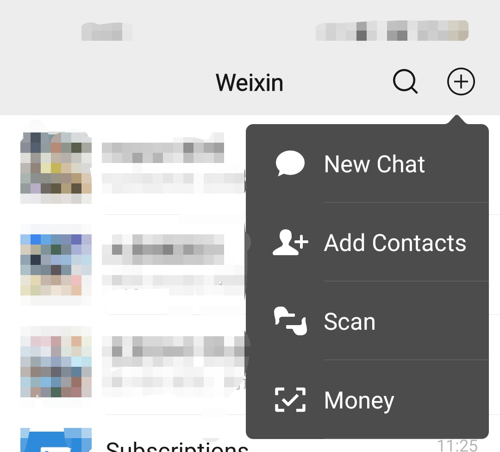

啰里啰唆是一份针对互联网和生活爱好者的数字杂志，旨在发现和分享一切有趣的东西。部分内容来自互联网采编，也有一些是编者本人的思考和短文，话题不固定，每期大约十五分钟阅读量，暂定每周四发布。

免责声明：部分内容可能会引起内心冲突或愤怒等不适症状。

第8期：微信的中文情感倾向现象-张小龙的小癖好

# 科技日常

## 1. ReadEra，可能是安卓最好的电子书阅读软件
用过很多款电子书阅读软件，可能ReadEra是最好的电子书软件了。比静读天下界面更现代化功能更多，比多看阅读无广告，比Librera Reader 速度快。

之前一直用开源免费的Librera Reader ，但Librera Reader 虽然也无广告，支持格式丰富，但是操作逻辑不是很顺手，这可以忍可以习惯，最无法容忍的是打开文档速度特别慢，打开5M以上的epub需要十几秒，打开30M以上或一万页的epub需要一分钟，甚至直接崩溃。一万页以上的小说是很常见的。毕竟开源软件搭积木式的开发，质量和用户体验难以保证。

另外，比较遗憾的是，Librera发布了停更公告，“The development and support of Librera is frozen for an unpredictable time, there is a big war in my country. Russian invasion of Ukraine”

**优点**：
1.支持多种文档格式：PDF、EPUB、 WORD、MOBI、FB2、DJVU、TXT、CHM、ODT、RTF、AZW等电子书格式
2.免费、无广告、无需注册
3.软件启动快，翻页快，几乎是最快的阅读软件，基本都是秒开。虽然ReadEra不是开源软件，但是这是我最终选择它的原因
4.不会复制文档到软件目录（Librera和欧陆词典都有这个毛病，导致手机上存在多份文档）。
5.阅读界面设置功能简洁且完善，常用功能齐全
6.支持儿童模式。

**缺点**：
1.对PDF阅读缩放支持不佳，如果你的书籍主要是PDF格式，这个软件不是最佳选择，不过手机本来就不是阅读PDF的首选。
2.不支持在线书库，纯离线模式
3.云同步功能需要使用高级收费版
4.排版比不上多看这种国内软件精美，但是也算不上粗糙。

https://readera.org/en/book-reader

此软件在国内安卓仅华为市场有下载，建议使用9Apps市场下载，9Apps 是阿里巴巴集团移动事业群旗下的移动应用分发平台。

国内应用市场和谐了很多 APP，且提供了特色化定制，想要下载纯净版或一些国内市场无法搜索到的 APP，需要用到谷歌市场，有一定门槛，这里可用 9Apps 安卓第三方应用市场替代。

9Apps 官网 9apps.com 国内无法访问，但 app 国内目前是可以正常搜索下载 app 的，由于针对的用户群体并非国人，app 不支持中文，市场搜索下载国内体验不错。

如果有看在线书籍，尤其是网络小说的需求，建议使用“阅读”。“阅读”可以算是安卓最强的免费追书神器，添加书源地址可以实现长久免费阅读全网小说。下载地址：https://www.coolapk.com/apk/256030

## 2. Aplayer-可能是安卓上最好用的离线音乐播放器
Aplayer，仅支持离线音乐播放，体积小（3M左右），支持在线歌词匹配和封面下载，支持编辑音乐标签。

相比其它小而美的离线播放器（比如 椒盐音乐 https://www.coolapk.com/apk/284064），其最大的特色就是支持编辑音乐标签，其它应用大多还需要一个插件或者是打开第三方编辑器。

目前仅在酷安应用商店提供下载,也可到github下载：https://github.com/rRemix/APlayer

缺点：
1.无在线音乐播放功能，不适合喜欢在线听歌的群体。
2.不支持某些小众格式，比如通话录音.amr格式。

# 读书分享

## 1. 轨道三部曲
交通工具的演进，折射着国家的变化，再造了技术和社会版图，也重塑了人们的思想观念。韩松将其长篇小说代表作《地铁》《高铁》《轨道》修订再版为“轨道三部曲”，隐含了丰富复杂的生存体验，以寓言式的文本预警宇宙文明，重现一位中国观察者与思考者的反乌托邦力作。

韩松与刘慈欣、王晋康、何夕一起，被列入当代中国科幻“四大天王”之一。他的《红色海洋》，轨道三部曲《地铁》《高铁》《轨道》，医院三部曲《医院》《亡灵》《驱魔》等，在读者中享有口碑。

三部曲是三个互有关联的故事，但皆可归入“反乌托邦”，即对可怕未来的想象。最早的《地铁》中，高速发展的地铁化身为“永远行驶在黑暗之中、过站不停的地铁列车”。起初乘客们愤怒、迷惑、恐惧，但逐渐适应了新环境。列车朝着未知的未来继续狂奔，进化开始将他们转变为逐渐退去人性的五花八门非人物种。

《高铁》的灵感可能源于2011年7月的动车重大事故。小说中高铁列车在事故后仍高速行驶，与正常时空割裂并转变为封闭空间的高铁文明。一派和谐社会的田园景象，随着列车提速似乎仍不断发展——高铁演变为承载拥有高技术但民风淳朴的农业文明的移动基地，重新蛮荒化的大地上则残存破败城市的遗民，他们依然能制作奢侈品与高铁文明交换农产品。

《轨道》的背景则转到了亲切的上海：人民广场站、在交通大学做研究……文中称其为S市。这故事基本是关于“失败的末日”：反复倒计时，总也毁灭不掉——死不成成了比死亡本身还要糟心的事。各种“真相”被一个个揭示，每个好像都能自圆其说。据说地上世界早已灭亡，这其实是个地铁世界；而最终是为了向下穿越地心、到达M国。

## 2. 标准电子书

上一期谈到的是古登堡计划，这一期是“Standard Ebooks”计划。Standard Ebooks可以理解为精品版古登堡计划，排版更加精美，比如引号等标点使用更考究甚至做了错别字校订，同时章节也做了修缮，选配了精致的封面图片，适合电纸书软件阅读。

该网站目前有近670本图书。

https://standardebooks.org/

## 3. 《阅微草堂笔记》
《阅微草堂笔记》原名《阅微笔记》，是清朝翰林院庶吉士出身的纪昀于乾隆五十四年（公元1789年）至嘉庆三年（公元1798年）间以笔记形式所编写成的文言短篇志怪小说。

在时间上，《阅微草堂笔记》主要搜辑各种狐鬼神仙、因果报应、劝善惩恶等当时代前后的流传的乡野怪谈，或亲身所听闻的奇情轶事；在空间地域上，其涵盖的范围则遍及全中国，远至乌鲁木齐、伊宁、滇黔等地。

同时《阅微草堂笔记》有意模仿宋代笔记小说质朴简淡的文风，曾在历史上一时享有同《红楼梦》、《聊斋志异》并行海内的盛誉。

鲁迅先生在《中国小说史略》中，对《阅微草堂笔记》有过高度的评价：“惟纪昀本长文笔，多见秘书，又襟怀夷旷，故凡测鬼神之情状，发人间之幽微，托狐鬼以抒己见者，隽思妙语，时足解颐；间杂考辨，亦有灼见。叙述复雍容淡雅，天趣盎然，故后来无人能夺其席，固非仅借位高望重以传者矣。”

## 4.博看书苑：免费正版电子图书、期刊、报纸

博看书苑，收录优质大刊、名刊4000余种，畅销热门图书50000余册，使用授权码可以免费阅读正版电子图书、期刊、报纸
共38万余册，总存储量21TB，资源还在不断增加中，每年可以增加20000本以上。新刊上线时间基本上与纸版期刊上市时间同步。所有的过刊也仍然都保存在网站上，可以采取与现刊同样的方式阅读。

如何使用:

首先访问博看书苑官网，下载安装iOS、安卓app。

http://new.bookan.com.cn/page/down.html

第一次注册，APP会要求用户填写机构授权码，每个机构码内包含的书籍略有不同，推荐使用华中科技大学的授权码（主要好记），输入：lib 就会提示已经绑定到了华中科技大学图书馆，此时就可以开始正版阅读之旅。

点击我的，点击所属机构 可以绑定新的机构，这里可以参考下方最新可用机构码:
浙江图书馆：zjlib
上海图书馆：shlib
武汉大学图书馆：whu
吉林大学图书馆：jlulib
四川大学图书馆：scu
河南大学图书馆：hndx
华中科技大学图书馆：lib

注：该APP支持下载图书，但是下载的书籍带有DRM，需要移除DRM才能使用通用阅读软件打开。

移除DRM在技术上是很容易的，但是在法律方面，大多数时候，在美国和英国，从电子书中移除数字版权保护是非法的，即使你购买了此书。
实际上，从 epub 文件中移除 DRM 不太可能会遇到麻烦。如果你自己买了这本电子书，你不太可能因此被起诉，但你仍需要承担(较小的)风险。

# 图论

## 1.以“巨物恐怖”为主题，用数字艺术勾勒出了令人惊叹的奇幻场景

来自阿拉伯的艺术家(ins：crazy7edits)
擅长创作气势磅礴
宏大而朦胧的末世场景
林中遨游的金鱼、云层之上的蓝鲸
化为熔岩的月球、潜入人间的明月
巍峨的峭壁等，画面充满奇幻的想象

Merwan.B的作品都是用Photoshop制作的数字艺术。天马行空的超现实主义的笔触刻画勾勒出一个惊艳世俗的异世界，美得让人惊叹而神往。

source:https://mp.weixin.qq.com/s/8r542Qq-yGgdgsd4-LmSwQ

## 2.boy ws wrong

## 3.The Duck Tape

# 谈天说地

## 1.机械降神
机械降神（deus exmachina），是一种戏剧手法。指的是在文学作品陷入胶着，出现难以解决是问题的剧情时，突然出‌​‌‌​‌‌​‌‌​‌​​‌​​‌现的解围角色。常用于营造出乎意料的剧情发展。
  名称由来：机械降神最早出现于希腊戏剧，因为当时经常要用机械设备（起重机，起升机等）把角色从天而降，所以称为机械降神。
  现代很多砖家专家认为机械降神是一种不高明的手段，因为他破坏了故事的逻辑性。但毫无疑问，它仍出现在各种文学作品之中，如我们耳熟能详的《愚公移山》，“帝感其诚,命夸娥氏二子负二山”，愚公移山在现代人看来是个长远的历史工程，近乎无解，但是突然出现的天帝把情结圆上去了，给愚公家族一个得偿所愿的结局，是典型的中国古代文学的“机械降神”。再比如水浒传里的宋江遇九天玄女，说岳全传里的泥马渡康王，就是主角遇到了难以解决的问题，结果突然就有神相助，摆脱困境。中国古代文学里的机械降神是比较常见的手法。

同理，《天龙八部》中的扫地僧，也属于这类角色。

## 2. 地涌金莲
地涌金莲，拉丁学名原产中国云南，四川也有少许分布，为中国特产花卉。在民间也叫地金莲。叶子像芭蕉叶，开金黄色的花。

外形上，地涌金莲最独特的地方在于，所见皆表象，其真正的花朵，隐藏在假茎的叶腋处，黄绿相间、清香扑鼻，植株随便一开，少则半年、多则大半年，花期不是一般的长。

地涌金莲被佛教寺院定为“五树六花”之一，也是傣族文学作品中善良的化身和惩恶的象征。云南民间还利用其茎汁解酒、解毒，制作止血药物，现北京植物园热带温室已引种栽培这一美丽的植物。当然，在北方，因为气候原因，其体积比较小巧，地涌金莲只能作为一种观赏植物。而在温暖的云南，地涌金莲是一种食物，其体积和花朵更大，大一些的花朵能有脸盆大。

地涌金莲的花很像莲花和竹笋的合体，对中国人而言，最关注的一个问题是，这花能吃吗？不仅能，而且味道很好，熬汤和小炒均可。一般在云南，都是把地涌金莲视为一种特殊的竹笋，口味和做法也很相似，当然味道比竹笋更容易被人接受，口感也更好。

## 3. 微信的中文情感倾向现象-张小龙的小癖好
有很多谈英文和互联网的文章，都会提到，“朋友圈”的正确翻译方式是Moment，而不是Friend circle这种中式英语。这些文章说的对不对？

确实，英文版微信的“朋友圈”对应的翻译就是“Moment”，然而，这里的问题是，这不是英文翻译的问题，而是中文的问题。英文没有问题，类似的功能叫“Feed”也好，“Moment”也好，都能体现出它的场景和含义，错的是中文。

因为它根本不应该叫“朋友圈”。朋友的定义是什么？微信的应用场景是什么？虽然微信张小龙一直暗示或明示微信是一个熟人和朋友间的应用，但实际上呢？微信诞生的第一天，就是靠漂流瓶和摇一摇吸引用户，是一个彻头彻底的约炮软件，主打的是陌生人社交。虽然现在有了各种支付和小程序场景，也洗白成国民社交软件，但本质上来说微信从来就不是一个熟人社交软件。

无论是小而美，还是绝不监听用户对话内容，张小龙从来就不是一个诚实的人。

同理，中文版微信，添加联系人功能叫“添加朋友”，而英文版微信中，择交“Add Contacts”。

是微信翻译的信雅达吗？不是，这其实是微信的中文情感化及不客观现象。微信一直声称自己是熟人社交软件，想把线下线上的真实社交关系绑定在微信这个软件上，在用词上一再强调“朋友”，使用带有感情色彩和暗示性的用词，这才是它的意图。

而英文版，就叫Contacts，这才是正确的是中性用词。并不是微信的朋友应该翻译为Contacts，而是根本不应该叫朋友。

## 4.所谓勇敢
一个婴儿需要母亲的时候，他会哭，过了一会母亲还没来，他会越哭越大声，哭到上气不接下气，可是如果母亲一直未出现，他会渐渐止住哭声，陷入安静。
在这个过程中，这个孩子经历[反抗]、[绝望]、[疏离]这三个阶段。
反抗体现的是分离焦虑，绝望反映的是哀痛，而疏离代表的是防御。
昨天看到一个视频里2岁的儿童因为🐏性被从父母身边带走，治疗结束后安静地坐在车里，旁边一个大人说“一会我坐你旁边"时，她没回应，眼神不安。
这个不幸的儿童被夸"真勇敢"。
这群SB，SB，大SB

source：基督山女伯爵@豆瓣
# 一句话快讯

1.搜狐等 12 家中国公司被美国证监会（SEC）列入退市风险名单，它们需要在 5 月 3 日前提交证据，以证明被认定错误。新增的 12 家公司包括：微宏、中汽系统、大全新能源、康乃德生物、金融壹账通、绿图生物科技、传奇生物、搜狐、新濠影汇、新濠博亚娱乐、Logiq 和诺亚控股。退市风险名单除了这 12 家还有新浪微博、富途证券、Nocera、爱奇艺、百度和 CASI Pharmaceuticals，其中新浪微博需要在美国时间 4 月 13 日递交文件

2.戴尔荷兰高管证实从4月开始试验四天工作制。

3.Insider Intelligence 估计 TikTok 的广告收入在 2022 年将增至三倍，达到 110 亿美元以上，超过竞争对手 Twitter 和 Snapchat 之和。

4.阿里技术副总裁贾扬清4月14日在脸书上用英语发文称自己已从上海乘坐航班抵达美国。网传截图显示，贾扬清在18天的隔离之后，找到“Someone  with connection”获得了“a pass”，然后在凌晨四点，坐在一辆面包车的后座前往上海机场，最终搭上前往美国的航班。随后，贾扬清用中文进行辟谣。

# 订阅方式

竹白：https://luoliluosuo.zhubai.love/
语雀：https://www.yuque.com/baicaibushicai/zk/

有些读者希望通过 RSS 订阅本周刊，这里介绍两个可以用 RSS 订阅周刊的方法。

方法一：

语雀可以使用rsshub进行rss订阅，比如本周刊rss地址为 (https://rsshub.uneasy.win/yuque/doc/25632997，25632997为语雀id，需要有一定编程经验才能找到，如果使用语雀rss，请使用此固定id)。

或者使用 RSSHub 提供的路由，获得竹白周刊 RSS 源地址。

举例: https://rsshub.uneasy.win/zhubai/luoliluosuo

路由: /zhubai/:name

参数:
name, 必选 - name 为竹白主页 url 中的三级域名，如 luoliluosuo.zhubai.love 的 name 为 luoliluosuo

> 提示：
> 在路由末尾处加上 ?limit=限制获取数目 来限制获取条目数量，默认值为 20
> 这个 RSS 源不支持全文输出。

方法 2：使用 Kill the Newsletter! 服务，把竹白 newsletter 转成 RSS。

1. 打开 https://kill-the-newsletter.com/ ，输入 Newsletter 的名字(任意起个名字即可，比如：啰里啰唆)，然后点击 Create Inbox
2. 然后你会看到它提供给你的用来订阅的邮箱地址和 RSS 订阅源地址
3. 将邮箱地址输入到你要订阅的 newsletter 网站（[啰里啰唆](https://luoliluosuo.zhubai.love/)）里
4. 将 RSS 订阅源地址添加到你的 RSS 阅读器里
5. 一般情况下，RSS 阅读器里收到的第一个订阅消息是叫你确认订阅或验证邮箱的内容，点击确认地址即可。**下一期内容**开始会出现在 RSS feed 里。

使用方法建议或素材提供

邮件：bairadish@gmail.com
频道：notonlyshare