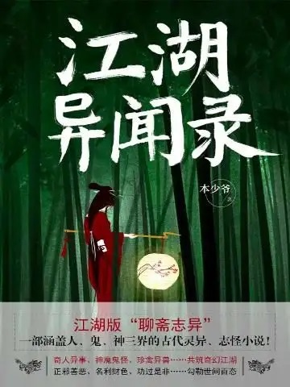
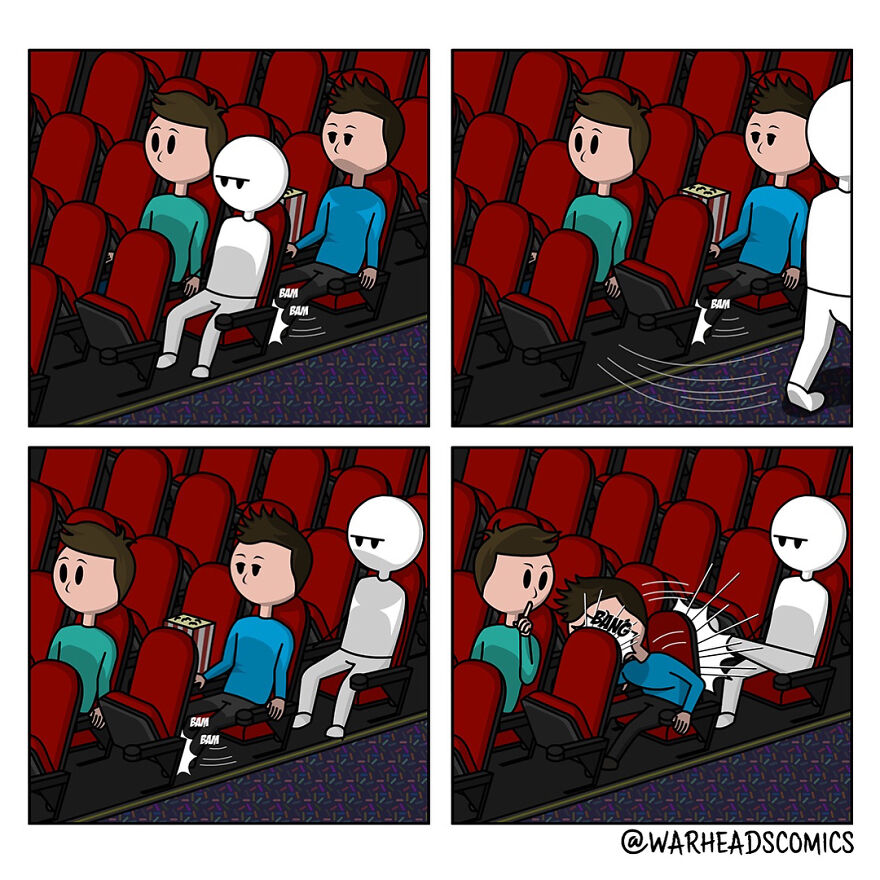
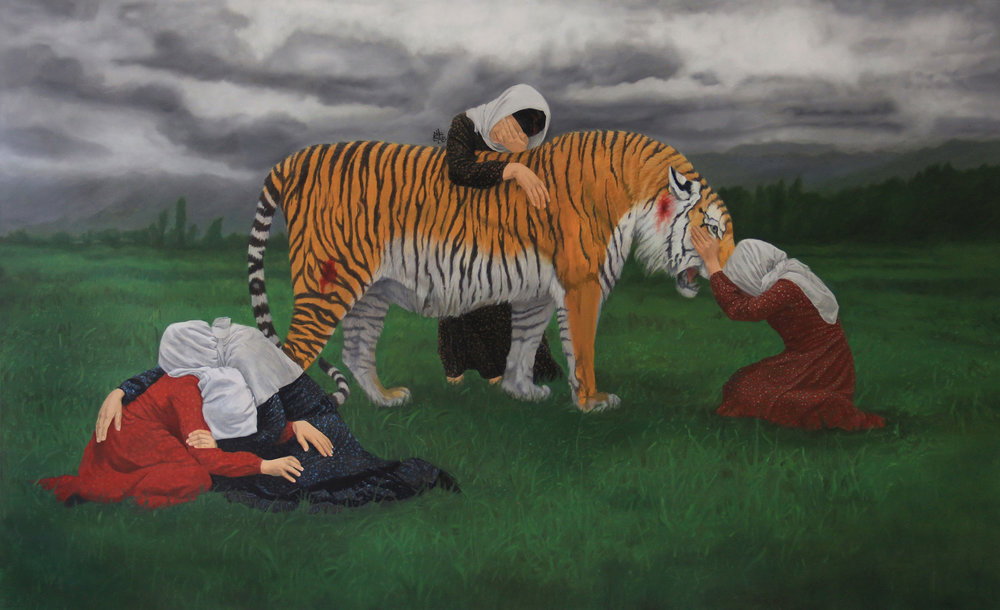
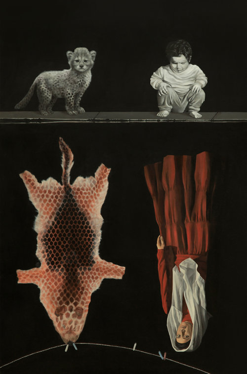
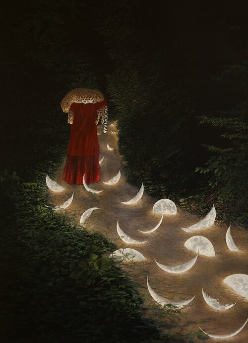
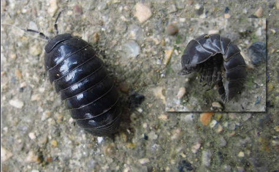

啰里啰唆是一份针对互联网和生活爱好者的数字杂志，旨在发现和分享一切有趣的东西。部分内容来自互联网采编，也有一些是编者本人的思考和短文，话题不固定，每期大约十五分钟阅读量，暂定每周四发布。

免责声明：部分内容可能会引起内心冲突或愤怒等不适症状。

第9期：月落千次

# 科技日常

## 1. ProtonMail和Tutanota

ProtonMail（又称质子邮箱）和Tutanota是两个安全的电子邮件提供商，一个在瑞士，一个在德国，两者都强调安全性和隐私性。这包括支持端到端加密以使几乎不可能进行拦截，通过不保留日志或在注册时不需要大量个人信息来保护您的身份，以及提供与使用“常规”电子邮件提供商之类的人进行通信的安全方法。 

收件箱中的内容在服务器上是端对端加密的，这意味着您是唯一可以阅读它们的人，并且两者都允许与“常规”电子邮件提供商进行安全消息传递。

其实技术不是重要的，重要的是隐私和政府监管要求。虽然法律上也存在德国或瑞士当局要求其这两个服务商提供数据的可能性，但理论上服务商向政府移交的数据不包括邮件正文。

比如在2021年，法国警方在调查有关巴黎发生的“Youth for Climate（青年气候行动）”事件时，为获取相关人员的身份，法国警方通过欧洲刑警组织向瑞士警方发出请求，迫使 ProtonMail 向欧洲刑警组织提供了有关“Youth for Climate”组织成员的登录 IP 和设备类型信息。对此 ProtonMail 创始人兼CEO Andy Yen 发布推文称：“Proton 必须遵守瑞士法律。 一旦发生犯罪行为，隐私保护就可以暂停，而且瑞士法律要求我们必须回应瑞士当局的请求。”据 Protonmail 提供的 Privacy Policy（隐私政策，更新于2021年9月6日），当 Protonmail 接收到瑞士当局提出的法律义务要求时，Protonmail 会提供所拥有的用户数据（如此次 Youth for Climate 事件），可能包含的用户数据包括：电子邮件元数据（包括发件人和收件人电子邮件地址、传入邮件的发送 IP 地址、消息主题、发送和接收时间）、邮箱帐户的登录 IP 地址、发送邮件数量、已使用存储空间数量、邮件总数、最后登录时间等。
但同时隐私政策也强调，Protonmail 并不能访问和破解已加密的电子邮件内容，因此无法提供有关电子邮件内容的信息。

注意：
1.超过三个月不登陆邮箱，Tutanota可能会关闭你的账号。
2.二者的免费版只能使用web端或专用App，ProtonMail收费版支持SMTP/IMAP协议。
3.虽然ProtonMail的CEO是华人，但应该认为是可靠的。相比而言Tutanota更激进一些，对隐私更看重。
4.ProtonMail提供pm.me的短域名，使用上更友好。
5.二者的免费账户均只有500M空间。

## 2. Bing 每日壁纸

“最开始做 Bing 壁纸的目的很纯粹，就是看到必应搜索 cn.bing.com 官网的壁纸很赞，但是想找到之前的壁纸就有点困难，然后就自己开发了一个，每天同步cn.bing.com 官网的壁纸，同步抓取每日故事，存在自己的数据库里。”

https://bing.ioliu.cn/

# 读书分享

## 1.《江湖异闻录》
《江湖异闻录》是一部具有独特结构的奇幻小说，作者以其天马行空的想象力勾勒出了一个涵盖人、鬼、神三界的江湖，上演了一出出炫美的活剧。其间有特立独行的异世高人，也有至情至性的鬼魅妖精；有豪迈飒爽的侠气，也有百转千回的情思，读来让人感慨唏嘘、不忍释卷。

文字风格有模仿白话唐传奇+聊斋的感觉，文笔粗浅直白，逸趣横生，可归类于仙侠类小说。通过一个个短篇构建出一个仙侠世界，故事之间可独立成篇，又有藕断丝连的联系。

> 豆瓣评论：
> 这书结构颇为奇特，前边有26个每篇不过二三千字的短篇，分别以游侠列传的形式讲述一个人的故事，以故事之间互相交织构成一整段玄幻世界的短短历史。最后又以一个接近中短篇的篇幅专门写了葛生的故事，笔法又完全不同，故事风格不似封神榜，倒更似还珠楼主的蜀山剑侠，以及可以前推到西游记之类的志怪小说。最有特点的事，书中各类人物性格迥异，且完全不同于时下流行的奇幻小说，人物风骨近于汉唐侠客，或重情重义，或从心所欲，虽有不同，总有一个共同的特点：“不假”，在属于自己的路上走下去，以戴着假面过活的现代人读来，确实别有一番风味。 
>

## 2.Hulu 新剧《成瘾剂量》
Hulu 最新推出的 8集限定剧《成瘾剂量》(Dopesick)讲述了老派医生塞缪尔·芬尼克斯（Dr. Samuel Finnix），一向以仁慈和同情心对待自己的工作和病患，还很细心地去日常的提醒和照顾那些人。但很快，他发现自己陷入了大制药公司致命的秘密之中、成为了资本家拿底层人民试药的帮凶。

> 评论之一：
> 讲述一个止痛药制药公司如何为了牟利而毁掉无数普通人家庭和人生的故事，我看完感觉一个比较精彩的地方是，导演告诉你，这个公司之所以会走这一步棋，不是作为整体考虑后高瞻远瞩、反复权衡的决定，而是内部各方势力在争夺控制权，不断博弈的结果。我相信导演是有意识的，镜头上一分钟是股东大会上的暗流涌动、勾心斗角，下一分钟就对准了受害者们不堪一击的家庭日常生活。从这种镜头语言里，我后知后觉地理解了中国人常说的“棋子”究竟是什么意思。我在读书的时候，在社会上，都反复见证过这样一种“不平等”，但我到现在才真正明白，它的本质是，在你这样一个平凡人的人生里，那些最为沉重的羁绊，生死，工作，爱的人，最终都只是成为了一些更高等的人在谈判桌上互相辩论要挟的筹码。而在一些时候，他们甚至都不是要从你这里拿到利润，而是为了一些更加可笑的事情，比如，脸面。 

## 3.【电影】卡桑德拉大桥
 《卡桑德拉大桥》是一部由英国、意大利和前西德联合制作的灾难片，于1976年12月8日上映，导演是乔治·P·科斯马图斯。

影片假想在冷战时期，两名恐怖分子袭击位于日内瓦的世界卫生组织总部，其中一人当场丧生，一人感染鼠疫后逃进了一列开往斯德哥尔摩的火车，导致鼠疫病毒在车内蔓延开来。美国驻世卫组织的代表、陆军情报部“麦肯齐”上校负责处理此事。

火车原计划由瑞士日内瓦始发，经法国巴黎，西德波恩，比利时布鲁塞尔等北约国首都和其它主要城市，最后抵达瑞典斯德哥尔摩。一路上北约各成员国均对病毒避之不及，最后麦肯齐上校说服华约成员国波兰接收受感染的整列火车，并宣称在波兰为乘客提供隔离点和治疗区。

虽然发现氧气可以有效遏制病毒的传染，但是国际警察组织为了阻止病毒传播和掩盖真相，对火车加以控制，使其在德国境内改道波兰，于纽伦堡由士兵接管，提供了部分援助；并为整列火车安装了临时供氧设备，后发现可能可抑制病毒。火车随即驶往华约国波兰，途中需通过波兰境内年久失修的“卡桑德拉大桥”，以图通过火车事故消灭感染乘客，阻止病毒蔓延。最后乘客切断火车连接部分，二等车厢在大桥前停止，乘客幸存下来；前部感染较重并由士兵把控的一等车厢大桥无法承受，士兵随车厢坠桥身亡。

# 图论

## 1. 活该

下次遇到这种人知道该怎么做了吧

## 2.死神也没那么可怕

关于死神，这里还有一部短片《Final Deathtination》（https://www.therookies.co/entries/10676），作者是Marika Tamura，来自美国的玲玲艺术与设计学院（Ringling College of Art and Design）。

The film is about a suicidal man who is about to hang himself but then encounters Death who is a "travel agent". Death tries to find the best place to die and together they go on a world tour.

这也是 11th Annual Rookie Awards的参赛作品。

## 3.Naeemeh Naeemaei
当地球上的其他物种灭绝时，
整个生态系统的家庭成员又少了。
可曾有谁为他们悲鸣？
伊朗画家、雕塑家奈梅·奈玛依(Naeemeh Naeemaei)
用她直白而真挚的情感表达
融合伊朗文化元素与现代表现手法
希望引起大众对濒危动物的重视。

——2011,《里海虎》

帆布丙烯油画，117 x 190 cm

在里海虎的栖息地，它们被称为“红狮”。最后一只里海虎于1959年被杀害。作者向这个被灭绝的物种表达了悲恸与哀悼。

——《玩伴》

这是幅心酸又讽刺的画作。

My playmate and myself as a child crouch by the edge of a pool, the edge of old and new time. 

Each one is looking down into its future. When I  painted this work, I didn’t know that type of animal. I painted the  young animal using a picture of a cheetah cub. I searched for pictures  of the adult and found nothing. Then I found the animal skin in my  friend’s home. He told me it was a cheetah’s skin. Later I learned that  it was a wolf’s skin painted to look like cheetah! 

At first I thought I  would have to change the skin in my painting if I wanted to have it in  this series. But now I realize that the wolf’s skin was painted that way because the cheetahs are almost extinct and their skins are very hard  to find.。

——2019, 《月落千次》

这幅作品源自2019年画家的新系列**“土地之下，月光之上”**。画作源于伊朗Kandelous小村的一个百年真实故事改编。遥远村落中，米娜的歌声吸引了豹子，豹子和少女成了和谐相处的好朋友，但少女的追求者却将豹子认作危险，射杀了它。

这个故事背后折射了人类社会对自身生存权利的认知与其它物种生存权利之间的矛盾.

奈梅·奈玛依，生于1984年，伊朗德黑兰人，就读于德黑兰美术大学雕塑专业，2006年获得美术学士学位。2017年移居美国。

https://www.naeemaei.com/

# 谈天说地

## 1. Say goodbye to your cheque!

Short and sweet - I was waiting in line at the bank. They have you line up outside, not a problem. This particular day it was a bit windy, again not a problem... for me.

A guy gets out of his car, cheque in hand. You know where this is going, ha. The wind whips the cheque from his hands and somehow I managed to step on it as it scooted by me.

I wasn't really expecting a thank you to be honest, but what I definitely wasn't expecting was the guy to chew me out for dirtying up his cheque. "Thanks for stepping on my cheque, the bank probably won't accept it now"

Call me an asshole but I lifted my foot up and let it blow away in the wind down the street and said "well they definitely won't accept it now."

The guy flipped his s**t as he was chasing it down the street and I got called up as next in line. Sorry not sorry.

一些关于报复的故事。这些故事都来自于 Reddit的一个板块 https://www.reddit.com/r/pettyrevenge/，在那里，people have a place to celebrate small victories over those who made their lives miserable. 

## 2.鼠妇

鼠妇又名鼠负、负蟠、鼠姑、鼠黏、地虱、地鸡等，是甲壳纲(Crustacea)等足目(Isopoda)潮虫亚目(Oniscoidea)潮虫科(Oniscidae)鼠妇属(Porcellio)动物的俗称，全世界有150种以上，多为广布的世界性种。它们身体大多呈长卵形，从海边一直到海拔5000米左右的高地都有它们的分布。中国常见种有鼠妇、光滑鼠妇等。通常生活于潮湿、腐殖质丰富的地方，如潮湿处的石块下、腐烂的木料下、树洞中、潮湿的草丛和苔藓丛中、庭院的水缸下、花盆下以至室内的阴湿处。杂食性，食枯叶、枯草、绿色植物、菌孢子等。

就这种小虫，民间也叫它“草鞋虫”、“西瓜虫”等。

作为一种潮虫，鼠妇也继承了潮虫家族的生活习性，它们就爱呆在潮湿且隐蔽的环境之中，如果不小心触碰或者惊吓到鼠妇的话，它们就会立刻躺平假死，这也是鼠妇对于自己的保护机制，等到危险走远的话，鼠妇就会偷偷地溜走。由于鼠妇的外壳上分布着一层油脂，所以它们也不太容易会被蜘蛛网给粘住。

可能在农村长大的小伙伴对鼠妇会有一个更加直观的了解，去一个阴暗的角落中，翻开地面上的零散的砖块之时，就能发现下面其实生活着好多小虫子，其中有一种呈长卵形的虫子，它们就是鼠妇。

在《搜神记》中也存在着描写鼠妇的内容，“豫章有一家，婢在灶下，忽有人长数寸，来灶间壁，婢误以履践之，杀一人……就视之，皆是鼠妇。婢作汤灌杀，遂绝。”，这个故事大概是这样的在豫章（古代地名）有一户大户人家，有一天一位婢女在干活的时候看到灶台旁有一个数寸长的小人，但是一不注意就将其踩死了。这一脚下去可是发生了祸端，只见数百个同样身高的小人出现在灶台旁边，而且身披麻布，似乎在为那个死去的小人送葬。

此时的婢女丝毫没有感到害怕，她甚至还跟在队伍后面仔细观察，只见那群送葬队伍走入了一艘腐朽破旧的船舱后就再没出现了，而婢女当时手中拎着一壶刚烧开的开水，当她走近船舱一瞧，发现这些小人其实都是鼠妇变幻而成，于是她就把滚烫的开水往下浇，所有的鼠妇都被烫死了，无一幸免。

鼠负在古代也被用来“相貌歧视”。南朝梁人刘思真在《丑妇赋》中就写：“朱脣如踏血，画眉如鼠负。”《丑妇赋》是一篇古文。此赋纵笔恣肆地描写丑妇从头到脚的丑陋，极尽嘲弄戏谑之能事，在中国文学史上显得非常特殊。

附：《丑妇赋》

人皆得令室，我命独何[咎]（吝）（从安刻本改）。
不遇姜任德，正值丑恶妇。
才质陋且俭，姿容剧嫫母。
鹿头猕猴面，推额复出口。
折頞靥楼鼻，两眼{幽页}（一交切）如臼。
肤如老桑皮，耳如侧两手。
头如研米槌，发如掘扫帚。
恶观丑仪容，不媚似铺首。
闇钝拙梳髻，刻画又更丑。
妆颊如狗舐，额上独偏厚。
朱唇如踏血，画眉如鼠负。
傅粉堆颐下，面中不遍有。
领如盐豉囊，袖如常拭釜。
履中如和泥，爪甲长有垢。
脚皲可容箸，熟视今人呕。
（《初学记》卷十九）

## 3.德慎斋扶乩
德慎斋扶乩，其仙降坛，不作诗，自署名曰刘仲甫，众不知为谁。有一国手在侧曰：是南宋国手，著有棋诀四篇者也。固请对弈，乩判曰：弈则我必负。固请，乃许，乩果负半子。众曰：大仙谦挹，欲奖成后进之名耶？乩判曰：不然，后人事事不及古，惟推步与奕棋，则皆胜古。或谓因古人所及，更复精思，故已到竿头，又能进步，是为推步言，非为弈棋言也。盖风气日薄，人情日巧，其倾轧攻取之术，两机激薄，变幻万端，砃诡出奇，不留余地。古人不肯为之事，往往肯为；古人不敢冒之险，往往敢冒；古人不忍出之策，往往忍出。故一切世事心计，皆出古人上。弈棋亦心计之一，故宋元国手，至明已差一路，今则差一路半矣。然古之国手，极败不过一路，今之国手，或败至两路三路，是则踏实蹈虚之辨也。问弈竟无常胜法乎？又判曰：无常胜法，而有常不负法，不弈则常不负矣。仆猥以夙慧，得作鬼仙，世外闲身，名心都尽，逢场作戏，胜败何关。若当局者，角争得失，尚慎旃哉。四座有经历世故者，多喟然太息。

-《阅微草堂笔记》

## 4.包税制与罗马共和国的崩溃 

［罗马］共和国由选举产生的官员统治，任期很短，主管官员之间有强制［任期］间隔。正如James Tan 所言，当共和国开始从其不断扩张的海外领地收税时，盈余成为精英阶层垄断政治权力的潜在威胁。如果允许新的资源流入国库，国家本可以成为公共产品的提供者，从而成为贵族精英的对手。看似矛盾却有其道理的是，削减国家财政收入符合统治贵族的利益。执政官的短任期加上残酷的政治竞争进一步抑制了官员们最大限度地增加国家收入的积极性。次年新当选的官员将控制国库，而使国库更丰实则有可能给政敌带来优势。

其结果是一种财政制度，即地方税的征收被分包出去，将国家的收入限制在固定数额内，而罗马公民则可以免税。正如James Tan 所解释的，这个系统有许多相互关联的后果。首先，国家不能在提供公共产品方面增加影响力，因此罗马公民仍然被锁定在既有的与贵族精英的［庇护］关系中。其次，精英阶层成为Roving Bandit方式的典型代表，他们把海外的地方官职视为谋私利的事业。被征服的外省人无法抵抗，而免税的罗马公民则失去了抗议的权利。少数人的个人致富过程和多数人被锁死的社会经济状态因此得以继续。最终，当共和国垮台时，税收制度发生了变化，将罗马国家变成了—个名副其实的君主政体，并导致财政需求的放松。

——特尔普斯特拉，《古代地中海的贸易》，p.116 

## 5.shanghai

熟悉英语文化的应该都知道，shanghai其实是个英文单词。
在英语中，首字母小写的“shanghai”是一个动词，意思为“诓骗; 强迫“，与首字母大写的“Shanghai”（上海市）不同。 

一个人若被以欺骗、胁迫、暴力相向而到船上做工则称为被shanghai了（即be shanghaied）。

在美国一经典喜剧歌舞电影《爱乐之城》中，男主人公塞巴和姐姐在公寓就有这样的一场戏：当姐姐再次指责塞巴总做些没有未来的工作时，塞巴怼道：
I had a very serious plan for my future. It's not my fault that I got shanghaied！
我对自己的未来有认真的规划，这不是我的错，我是被欺骗了！

对于那些哄骗他人者，可以称为“shanghaier”——诱骗者。

很多人接触这个词都是从美剧开始的，就以为shanghai这个词是网络新词，其实这个词有一百多年历史了，在七十年代的汉英词典中就存在了。据考证来源是这样的：
早些年人们从欧洲来上海做生意，水手们一般不愿意这样远渡重洋，船长都是先把他们骗上来，等开船后水手们才发现要去的是上海，就说We are shanghaied. （我们被骗了！）

# 一句话快讯

1.4 月 23 日消息，有传言称，微信在写新代码做网络分割，让外地看不到上海的朋友圈。目前，该传言截图已被公开辟谣为不实消息。
据凤凰网科技报道，在微信中转发该传言截图，会收到微信的弹窗提醒：该消息被投诉为不实消息，建议核实情况后再转发。

2.教育部近日印发了《义务教育课程方案和课程标准（2022 年版）》（以下简称《课程标准 2022》），新课程、课标将于 2022 年秋季学期开始执行。这其中，" 体育与健康 " 课占总课时比例 10%-11%，超越外语成为小、初阶段第三大主科。在部分省份（如云南2023年中考），体育中考占比已经和语文数学并列第一。

3.近日，央行和银保监会联合召开金融支持实体经济座谈会，座谈会上着重强调了对房地产的金融政策。央行在实体经济座谈会上明确谈及房地产，“房地产是实体经济”和“要采取更大程度的政策举措，推动释放内需潜力”这两个积极的信号被放出了。央行把房地产划归为了实体经济，与此前“金融、房地产与实体经济”的表述出现明显变化，反映了央行态度的巨大转变。

4. 4月26日，在巴基斯坦袭击事件中三位中国公民遇害，中国受害者为孔子学院院长黄x平和讲师丁x芳。第三位名叫陈x的中国人与面包车巴基斯坦司机一起被杀。

5.中国第一家、也是迄今为止中国唯一一家中外合资新闻出版企业，中国计算机世界出版服务公司因持续严重亏损、现金流断绝，4月27日宣布停工停业。

6.4月27日，王思聪微博，微信账号继临时限制发言后被彻底封禁炸号。
# 订阅方式

竹白：https://luoliluosuo.zhubai.love/
语雀：https://www.yuque.com/baicaibushicai/zk/

有些读者希望通过 RSS 订阅本周刊，这里介绍两个可以用 RSS 订阅周刊的方法。

方法一：

语雀可以使用rsshub进行rss订阅，比如本周刊rss地址为 (https://rsshub.uneasy.win/yuque/doc/25632997，25632997为语雀id，需要有一定编程经验才能找到，如果使用语雀rss，请使用此固定id)。

或者使用 RSSHub 提供的路由，获得竹白周刊 RSS 源地址。

举例: https://rsshub.uneasy.win/zhubai/luoliluosuo

路由: /zhubai/:name

参数:
name, 必选 - name 为竹白主页 url 中的三级域名，如 luoliluosuo.zhubai.love 的 name 为 luoliluosuo

> 提示：
> 在路由末尾处加上 ?limit=限制获取数目 来限制获取条目数量，默认值为 20
> 这个 RSS 源不支持全文输出。

方法 2：使用 Kill the Newsletter! 服务，把竹白 newsletter 转成 RSS。

1. 打开 https://kill-the-newsletter.com/ ，输入 Newsletter 的名字(任意起个名字即可，比如：啰里啰唆)，然后点击 Create Inbox
2. 然后你会看到它提供给你的用来订阅的邮箱地址和 RSS 订阅源地址
3. 将邮箱地址输入到你要订阅的 newsletter 网站（[啰里啰唆](https://luoliluosuo.zhubai.love/)）里
4. 将 RSS 订阅源地址添加到你的 RSS 阅读器里
5. 一般情况下，RSS 阅读器里收到的第一个订阅消息是叫你确认订阅或验证邮箱的内容，点击确认地址即可。**下一期内容**开始会出现在 RSS feed 里。

使用方法建议或素材提供

邮件：bairadish@gmail.com
纸飞机频道：notonlyshare