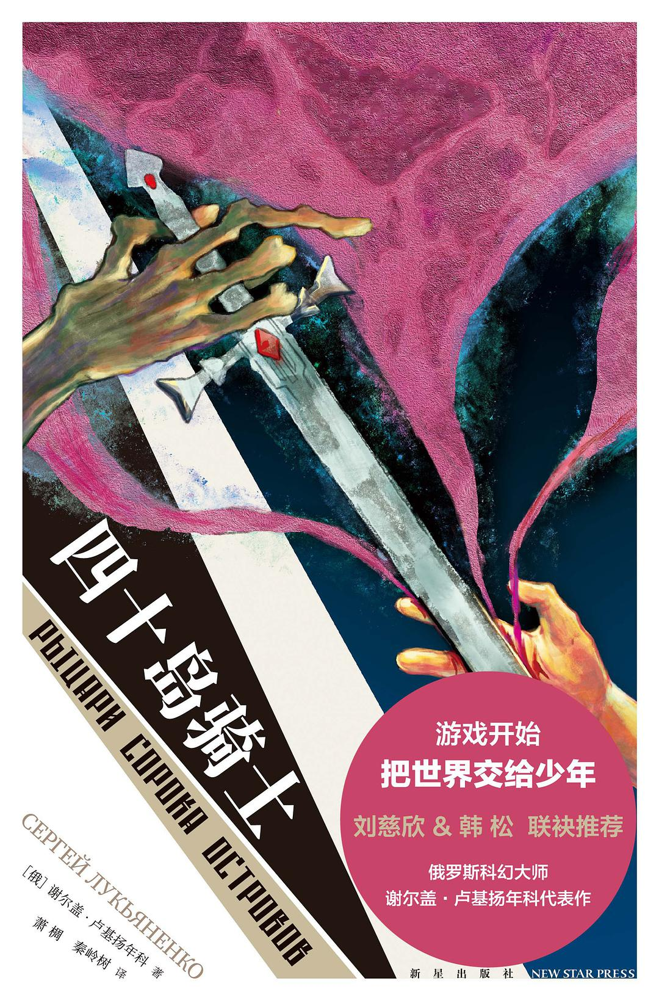
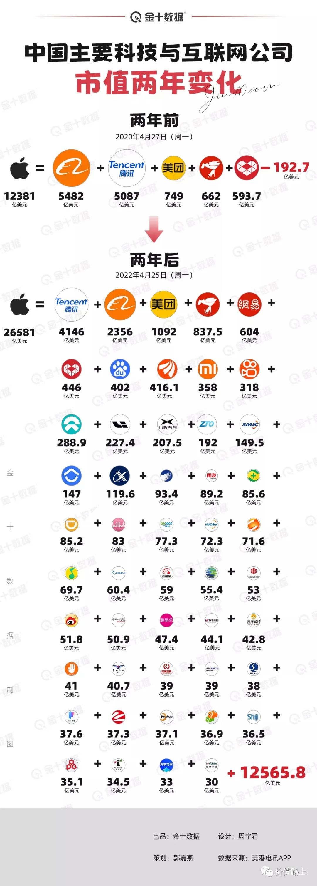

啰里啰唆是一份针对互联网和生活爱好者的数字杂志，旨在发现和分享一切有趣的东西。部分内容来自互联网采编，也有一些是编者本人的思考和短文，话题不固定，每期大约十五分钟阅读量，暂定每周四发布。

免责声明：部分内容可能会引起内心冲突或愤怒等不适症状。

第10期：四十岛骑士

# 科技日常

## 1. jellyfin 私人影视网

经常会在网上看到各种私人搭建的视频网站，UI和交互还都差不多，其实有很多用的就是jellyfin这套系统。

点播、直播一条龙，跨平台、免费家庭媒体中心，说的就是jellyfin。

官方介绍“Jellyfin is the volunteer-built media solution that puts you in control of your media. Stream to any device from your own server, with no strings attached. Your media, your server, your way.”

有NAS设备，存了大量电影和音乐，想与家人、朋友共享，或者低成本搭建一套自己的视频网站，都可以考虑使用jellyfin。

下载地址：https://jellyfin.org/downloads/

如果你的主要文件是音乐文件，也可以使用Navidrome Music Server这个开源服务，开源的音乐流媒体服务器，提供 Web 管理界面，可以用来管理自己的音乐文件。

下载地址：https://github.com/navidrome/navidrome/

## 2. 李跳跳：安卓跳过开屏广告

很多app开屏广告有5秒或以上，人生有多少个5秒？安卓李跳跳app可以让你，节省更多时间去用于学习及探索人生的意义！

使用方法：
李跳跳依赖系统的「辅助功能」，即「无障碍服务」，为了保证功能正常，请固定这类App将app锁住，防止内存自动清理，并去设置页面打开此App的自启动权限，并将App的省电策略设置为无限制

跳过开屏广告app对其他app广告收益，造成很大影响，目前各大市场都是下架处理。

安装包获取方式：关注李跳跳官方公众号，或到可以信赖的第三方下载。

第三方下载：https://musetransfer.com/s/kppm1mnme，源自https://iao.su/3193/，是否值得信赖可自行判别。

## 3.LineageOS 19 释出
曾被称为 Cyanogen 的 Android 社区发行版 LineageOS 释出了 LineageOS 19。LineageOS 19 是基于 Android 12，安全补丁更新到 2022 年 4 月，默认启用了深色模式。开发者表示，由于 Android 开源项目 AOSP 用 eBPF 取代了 iptables，而设备的内核版本需要高于或等于 Linux kernel 4.9 才能利用 eBPF，使用 4.4 kernel 的设备有向后移植的版本，使用 kernel v 3.18 或更低版本的设备则将停止支持，这意味着 LineageOS 19 将不支持较旧的设备。

https://lineageos.org/Changelog-26/

## 4.TradingSystem
基于.NET的开源交易管理系统。包含了服务器端、PC 客户端、手机客户端的源码，支持中文界面、交易管理、打印小票、会员管理、统计报表等功能，适用于餐厅、超市、酒店等领域。使用和二次开发前请认真阅读开源协议

https://github.com/oybab/TradingSystem
# 读书分享

## 1. 《月亮宝石》

小学时候读过的一本书，还和《月亮与六便士》搞混了。这本外国名著没《月亮与六便士》出名，阅读难度也低了很多，可以作为一本侦探小说来看。至于背后更深层次的解读，那就见仁见智了。

《月亮宝石》是英国维多利亚时期小说家威尔基·柯林斯创作的长篇小说。
该作写一颗钻石（月亮宝石）神秘失踪，后为探长克夫所侦破。作品情节惊险曲折，结局出人意外。

小说主要讲的是一颗神秘的黄色宝石，相传是印度月亮神上面的宝石，一直世代相传，英国殖民者在侵略印度的时候，一个英国军官约翰·亨卡什看上了它的巨大财富把它掠走并带到了英国，而这颗神秘的月亮宝石被施了魔法，谁拥有这颗月亮宝石谁就会失去性命。与世代相传的月亮宝石有密切关系的还有三个保护它的印度婆罗门教徒，他们从印度远赴英国决心夺回被夺走的月亮宝石。约翰·亨卡什在临死前立了遗嘱，把施了魔咒的宝石赠予他的外甥女雷切尔作为生日礼物。雷切尔在得到宝石后，原本平静的生活被打破，宝石在她生日当天不翼而飞。在寻找偷盗宝石的凶手的过程中，一系列匪夷所思的事情接连发生。

注：该小说有同名改编电影。

## 2. 《四十岛骑士》
《四十岛骑士》是俄罗斯科幻小说第一人谢尔盖·卢基扬年科所著的一部科幻小说。

生存游戏开始，活到最后才能回家。谁有资格逃出迷宫，拯救地球？

作为未来的人类领袖，懵懂的少年们沦为星际殖民计划的试验品，迷失在诡异的四十群岛。十八岁即是死期。倒数计时开始，要想获得自由 ，必须成为战士，做最后的胜者。

外星人之眼高悬穹顶，伙伴转眼变成敌人，阴谋就在眼前。或许，比四十群岛更可怕的，是诡谲的人心……

三，二，一，游戏开始！

【名家推荐】

《四十岛骑士》构建了一个神奇的群岛世界，这是人类世界的一个简洁而生动的缩影，这个世界中所发生的曲折惊险、高潮迭起的故事，在生存的搏杀中充满了人性的碰撞和升华，给我们带来了科幻小说中最独特的感受。

——中国科幻领军人物 刘慈欣

《四十岛骑士》把少年冒险科幻题材发挥得淋漓尽致。俄式大逃杀的存亡困境，在这里变成了少年成长的破茧之痛。

——中国著名科幻作家 韩松

我认为，谢尔盖·卢基扬年科理应是当代俄罗斯最受欢迎的科幻作家。

——俄罗斯著名科幻作家 鲍里斯·斯特鲁伽茨基

## 3.《子不语》
《子不语》是清代文学家袁枚撰写的一部文言短篇小说集。《子不语》的正集大约成书于乾隆五十三年（1788年）前，后来又有些陆陆续续的篇章，汇为续集。

《子不语》的书名本于《论语·述而》：“子不语怪力乱神”，后来作者发现元人说部有同名者，遂改为《新齐谐》，本于《庄子·逍遥游》：“齐谐者，志怪者也”。元人说部之同名书早已失传，故后人仍多沿用《子不语》之名。它仿照六朝志怪小说及《聊斋志异》而写，文章大都言鬼神，谈怪异，其中因果报应、荒诞迷信成分较多，部分篇章从偶然、猎奇的角度写不怕鬼的故事。全书文字简练、语言自然、亦庄亦谐，展现了光怪陆离的世间百态，用极尽幽默且晦涩的方式揭示了当时社会的诸多恶弊，体现了袁枚对理学思想的批判和对封建迷信的怀疑。

《子不语》二十四卷，《续子不语》十卷，共三十四卷，收集短篇故事一千二百余则，袁枚在《子不语·序》中的第一句话就是：“怪、力、乱、神，子所不语也。”这实际上是对书名的一个注释，也就是作者谈论的是“怪异、勇力、悖乱、鬼神”之事。

注：
1.这本书是国内很多网络小说和电视剧的灵感来源，很多传奇故事的源头都来自这。

2.有一本国产漫画，也叫《子不语》，作者夏达。

# 图论

## 1.Mindlessness

## 2.Why have you exclude me

## 3.中美主要科技公司市值两年变化

# 谈天说地

## 1. 第一个“复活节彩蛋”是员工的反叛行为

1980年8月，雅达利公司的消费者关系部门收到了一封来自一个15岁男孩的手写信件，这个男孩的热情几乎从纸上一跃而下。

注：源于一位25岁青年白手创业的“雅达利”，1972年推出首款街机Pong，最初仅生产12部，以简单点线接口仿真打乒乓球的游戏，奠定街机始祖地位。1974年当时年仅19岁的前苹果总裁乔布斯加入雅达利，负责开发电子游戏

“I’M SO EXCITED ABOUT YOUR COMPUTER”他写道，整个信息都是大写的。
这位年轻的粉丝名叫亚当 · 克莱顿。他喜欢雅达利，希望这家流行的视频游戏公司给他寄一本介绍软件选项的小册子来备份他的雅达利系统。(“请快点,”他说。)

克莱顿还加了一段附言。

当时他正在玩“冒险”(Adventure)——1980年的一款游戏，在这款游戏中，玩家穿梭于各个房间，寻找一只金色圣杯——这时他发现了一些奇怪的东西。

source：https://thehustle.co/the-first-easter-eggs-were-an-act-of-corporate-rebellion/

## 2.公鸡没有丁丁，但鸭子有
公鸡是没有突出体外的生殖器官的，它和鸟纲的其他生物一样，输精管和尿道都开口在泄殖腔中。当然，母鸡也是，所以鸡蛋上经常会沾上鸡屎，这就是因为输卵管和消化排泄道是同一根管子，这就是泄殖腔的来源。

大多数成年哺乳动物具有两个排泄孔通体外：泄殖孔和肛门。

而爬行类和鸟类，唯一的泄殖腔则包含三个部分：即粪道、泄殖道和肛道。粪道是直肠的延续，泄殖道位于粪道之后，输卵管或输精管和尿道都开口于此，肛道是泄殖腔的最后部分。  
  交配的时候，公鸡和母鸡的泄殖腔孔的口对着，有时候公鸡的泄殖腔会整体外翻深入到母鸡的泄殖腔内，公鸡把精液排到母体体内。这整个过程，是真的“蹭蹭不进去”而且速度极快，只是一眨眼功夫，你就会错过它们交配的全过程。

但是，并不是所有鸟类都没有丁丁的，没有丁丁的鸟类，大概占据了全体鸟类的97%，也有例外，比如鸭子、鹅等雁形目鸟类。一般来说，大部分鸡形目（陆禽）都缺乏具有插入能力的丁丁，而雁形目（水禽）则相反。

据说在胚胎发育的早期，鸟类都会长出生殖结节，但是由于基因表达的差异，这些生殖结节就有了不同的命运：在雄性鸭子、鹅身上继续发育成了丁丁，而在鸡身上却萎缩掉了。

鸭子的丁丁和人的还是有很多不同的，比如其中充盈的是淋巴液而非血液，而且呈螺旋状，虽然挺长但平时不交配时是瞧不出来的。有记录显示，尺寸最逆天的南美硬尾鸭中可达42.5厘米，这比它本身的体长还要长。而且其完成“勃起”的速度极快，不到一秒。

参考:https://zhuanlan.zhihu.com/p/60917540
## 3.没有中间派
当胖虎正在抽大雄的时候，你只有 2 种选择：1. 帮大雄、2. 帮胖虎、3. 装看不见、4. 呼吁理性沟通。之所以说 2 种选择而非 4 种，是因为后 3 种都是帮胖虎

@祝佳音

## 4.龙葵

今天介绍的是一种全国都很常见，但是很多人不知道叫什么，见了果实也不敢吃的植物。

龙葵（学名：Solanum nigrum L. ，方言又叫野辣虎、野茄秧、天茄菜、野龙果，黑天天等）是茄科、茄属一年生草本植物，全草高30-120厘米；茎直立，多分枝；卵形或心型叶子互生，近全缘；夏季开白色小花，4-10朵成聚伞花序；球形浆果，成熟后为黑紫色。浆果和叶子均可食用，但叶子含有大量生物碱，须经煮熟后方可解毒。

几乎全中国有分布。喜欢在田边生长，荒地及村庄附近。广泛分布在欧、亚、美洲的温带至热带地区。

注：其实龙葵的果实也是有毒的，但是龙葵素、茄碱等等的有毒物质含量很少，吃几颗达不到中毒剂量。

# 一句话快讯

1.近日，各大互联网平台相继上线“网络用户IP地址显示功能”，境外显示国家，境内显示到省市，且该功能无法由用户主动关闭，IP地址为强制显示项目。

2.北京时间 4 月 28 日消息，《阿凡达 2》正式名称为《阿凡达：水之道 (Avatar: The Way of Water)》，影片预计于今年 12 月 16 日北美上映。

3.中国大规模基于BMI指标的样本显示 80岁以上的人群肥胖者寿命更长。

4.据5月3日报道，2022年4月25日，杭州市国家安全局依法对勾结境外反华敌对势力，涉嫌从事煽动分裂国家、煽动颠覆国家政权等危害国家安全活动的马某某采取刑事强制措施，目前此案正在深入调查中。此前各大媒体新闻稿不知何意图将马某某写成马某，后经环球时报前总编证实，是马某某不是马某。

5.19年演了7000多场，《云南映象》突然停演，杨丽萍含泪宣布解散团队。

6.柳传志及女儿柳青相继清空微博内容

# 订阅方式

竹白：https://luoliluosuo.zhubai.love/
语雀：https://www.yuque.com/baicaibushicai/zk/

有些读者希望通过 RSS 订阅本周刊，这里介绍两个可以用 RSS 订阅周刊的方法。

方法一：

语雀可以使用rsshub进行rss订阅，比如本周刊rss地址为 (https://rsshub.uneasy.win/yuque/doc/25632997，25632997为语雀id，需要有一定编程经验才能找到，如果使用语雀rss，请使用此固定id)。

或者使用 RSSHub 提供的路由，获得竹白周刊 RSS 源地址。

举例: https://rsshub.uneasy.win/zhubai/luoliluosuo

路由: /zhubai/:name

参数:
name, 必选 - name 为竹白主页 url 中的三级域名，如 luoliluosuo.zhubai.love 的 name 为 luoliluosuo

> 提示：
> 在路由末尾处加上 ?limit=限制获取数目 来限制获取条目数量，默认值为 20
> 这个 RSS 源不支持全文输出。

方法 2：使用 Kill the Newsletter! 服务，把竹白 newsletter 转成 RSS。

1. 打开 https://kill-the-newsletter.com/ ，输入 Newsletter 的名字(任意起个名字即可，比如：啰里啰唆)，然后点击 Create Inbox
2. 然后你会看到它提供给你的用来订阅的邮箱地址和 RSS 订阅源地址
3. 将邮箱地址输入到你要订阅的 newsletter 网站（[啰里啰唆](https://luoliluosuo.zhubai.love/)）里
4. 将 RSS 订阅源地址添加到你的 RSS 阅读器里
5. 一般情况下，RSS 阅读器里收到的第一个订阅消息是叫你确认订阅或验证邮箱的内容，点击确认地址即可。**下一期内容**开始会出现在 RSS feed 里。

使用方法建议或素材提供

邮件：bairadish@gmail.com
频道：notonlyshare
