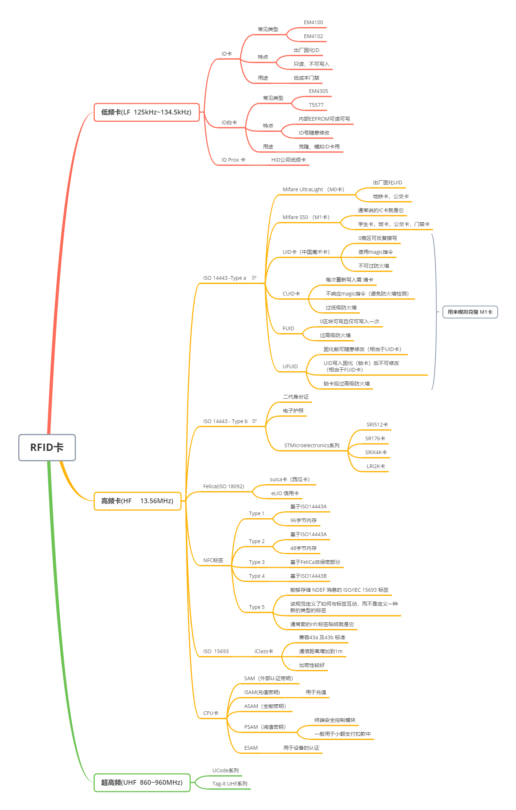
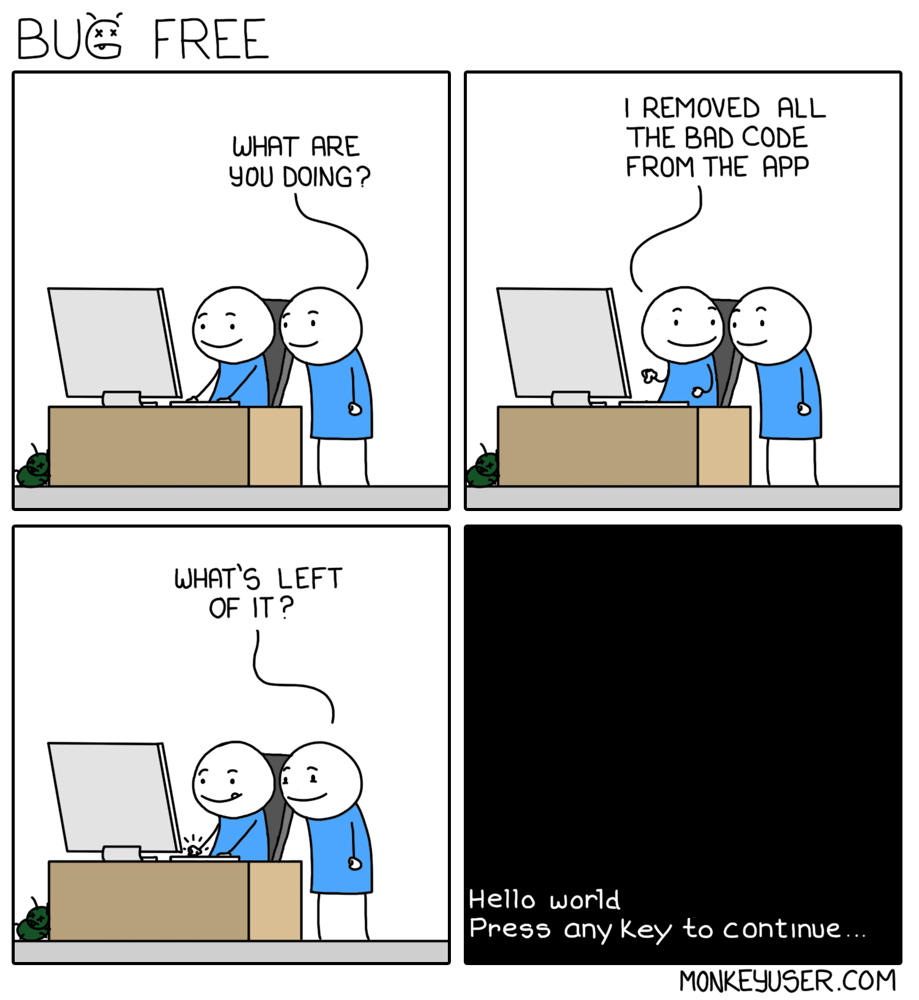
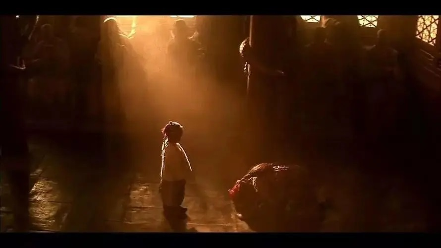
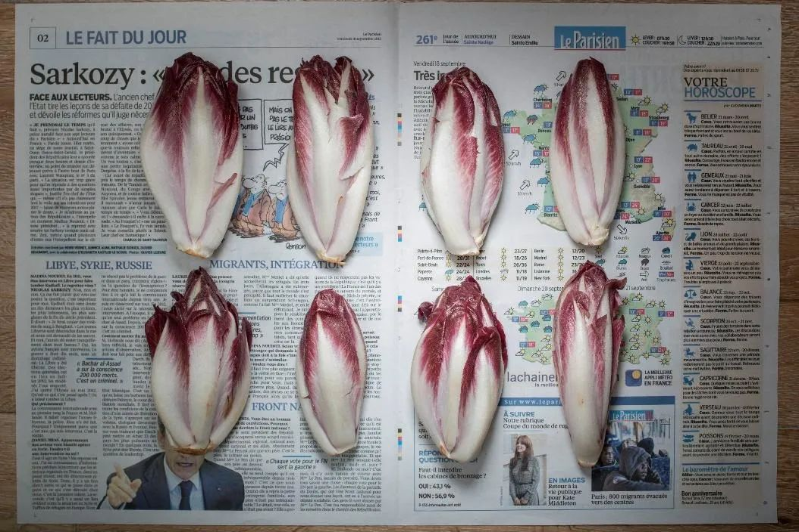

啰里啰唆是一份针对互联网和生活爱好者的数字杂志，旨在发现和分享一切有趣的东西。部分内容来自互联网采编，也有一些是编者本人的思考和短文，话题不固定，每期大约十五分钟阅读量，暂定每周四发布。

免责声明：部分内容可能会引起内心冲突或愤怒等不适症状。

啰里啰唆周刊第11期：不被大风吹倒

# 科技日常

## 1. Cytopia
免费开源的像素风模拟城市建设游戏 

游戏使用C++开发，跨平台，单机。

https://github.com/CytopiaTeam/Cytopia
## 2. stendhal
一款免费、开源的多人在线冒险（MMORPG）游戏。项目采用 Java 语言编写，虽然游戏画面复古还是 2D 但拥有数百种物品、怪物、NPC、任务和自由交易组成的丰富世界。玩家可以通过完成任务得到经验和金钱，更新装备逐渐变强探索更多新的地图。该游戏从 2005 年开源持续维护至今，最新版本1.40.

地址：https://github.com/arianne/stendhal

支持在线试玩：https://stendhalgame.org/client/stendhal.html

## 3. WantWords 反向词典

WantWords（原：万词王）是唯一支持中文及中英跨语言查询的反向词典系统，可以通过描述意思来查找词语。WantWords基于最先进的人工智能和自然语言处理算法实现，由清华大学自然语言处理实验室出品。

https://wantwords.net/

# 读书分享

## 1. 《不可不知的36种电子元器件》

《不可不知的36种电子元器件》是“科技制作小达人”丛书中的一本，介绍了36种常用电子元器件的基本知识和识别方法等，让读者尽快掌握开展电子小制作所必备的“基本功”。

《不可不知的36种电子元器件》在内容上精心编排，每种元器件的介绍均从“外形和种类”、“结构及特点”、“主要参数”、“型号命名”、“产品标识”和“电路符号”等几个方面详细讲解，除配合有大量实物照片外，还包含了作者搜集、整理的常用元器件性能参数列表以及在长期实践中归纳、总结出的一些经验性文字内容，真正让读者“看得懂、记得住、用得上”，并具备方便查找常用元器件参数的功能。这些是本书有别于同类其他图书的最大特点。

非常适合对硬件制作感兴趣的入门者阅读，如果是对电路维修感兴趣的话，可以阅读《全彩图解电工技术与技能》这本书。

介绍的元器件包括：阻抗元件、半导体二极管、半导体三极管、集成电路、耦合与显示元器件、敏感元器件、电声换能器件、电控制器件、开关与保护器件等几类元器件。

## 2. 《八恶人》

又称美国版《龙门客栈》。

《八恶人》是由韦恩斯坦国际影业公司出品的西部动作片，由昆汀·塔伦蒂诺自编自导，库尔特·拉塞尔、塞缪尔·杰克逊、詹妮弗·杰森·李、蒂姆·罗斯、布鲁斯·邓恩等联合主演。
该片讲述了美国南北战争数年后，八名身份各异的人阴差阳错地来到怀俄明州的一座山口的马车驿站，却被暴风雪困在了山坡上，恶人相遇展开一场混杂着暴力与生死之战的故事。

在美国内战结束后，一辆驿站马车疾驰在怀俄明州的冻土之上，车上坐着赏金猎人约翰·鲁斯和他抓获的逃犯黛西·多摩格，他们将前往红石镇，鲁斯将在那里处决黛西·多摩格。半路遇到想要搭顺风车的赏金猎人、以畏战罪名被骑士军赶出的昔日少校马奎斯·沃伦和所谓叛军的儿子红岩镇新上任的地方官克里斯·马尼克斯，经过身份验证排除嫌疑和威胁后，四人加上车夫一路同行。
由于在暴风雪中迷失方向，四人来到山口的一个小驿站休息，而驿站早就已经被几位不速之客占据，这四人分别是临时看管驿站的鲍勃、红石镇的处刑人奥斯瓦尔多·莫布雷、淡定自若的神秘牛仔乔-盖奇和寻找儿子垂垂老矣的南军将军斯坦福-斯密瑟，一杯有毒的咖啡将导致八人产生纷争，事态将向不可预料的方向发展，而这种局面最终可能会要了所有人的命。

影评：
《八恶人》这部影片是导演最任性恣意的作品，70MM巨幅宽银幕及三个小时的片长，全方位呈现出半密闭空间里的角力，让观众在血浆与子弹齐飞中达到高潮，像昆汀对电影的一次总结，是他以往在银幕塑造的恶人形象的大集合，也延续了昆汀以往作品中的政治观点，种族矛盾问题始终贯穿，西部英雄们看似规矩实际上没有逻辑的行事理论，都得到了全面呈现，昆汀用一种以旧做旧的方式，为西部片找到了一个新的重生方式。

## 3.《胭脂债》 （小说 && 电视剧）

《胭脂债》是由北京华谊兄弟聚星文化有限公司2021年出品，张瀚文执导、于文文、杨业明、戚砚笛、姚望、王珮寒、汪卓成、黄千硕、孙启恒等主演的古代传奇剧。

该剧改编自网络作家一度君华同名小说，讲述了囚禁江家地牢三十年的“杀人魔头”薄野景行意外成为胭脂女，与不慎走火入魔内力尽失的新任武林盟主江清流在追求自己想要得到的真相和打破武林阴谋过程中逐渐产生感情的故事。

原著和改编剧我都看过，相比而言，原小说设定略雷人，改编剧比较让人容易接受些。整体而言，不算一部很出彩的作品但也算不上烂，感情这块的处理还是比较好的，服化道和演技尚可，没有如今的仙侠剧雷人。

# 图论

## 1. RFID射频卡分类与总结
对RFID和NFC感兴趣，想折腾的可以参考这张图

## 2. 常见车辆的英语表达

## 3.bug free

## 4.中国历史时空示意图

来源在图片右下角
# 谈天说地

## 1. 纽约市郊的鹿9年内增长了9000% 【英文】

十年前，鹿在斯塔顿岛是一种罕见的景象。人们认为，在人类发展的推动下，白尾鹿在19世纪晚期放弃了这个岛屿，在附近的新泽西开辟了土地。2008年，这个60平方英里的纽约市行政区估计只有24头鹿。

然后鹿回来了，从新泽西州游过亚瑟基尔河和力登海湾寻找新的栖息地。它们繁殖了。2014年的一项调查显示，鹿的数量为793头。到2017年，新的估计数字在1918到2188之间，在短短9年内增长了9000% 。

但这也带来了包括交通事故在内的各种风险，当地政府正在考虑射杀和绝育等措施减少鹿群数量

https://getpocket.com/explore/item/the-deer-in-your-yard-are-here-to-stay?utm_source=pocket_discover

## 2.什么是荷兰角镜头？
在镜头语言的使用中，镜头角度常常被用来传达影片所要表现的各种情绪，而在所有镜头角度中，荷兰角绝对是最特殊，也是最能表达电影格调的镜头角度。
常用的拍摄镜头有平拍、仰拍和俯拍，荷兰角。

平拍是影视中常用的拍摄角度，以演员为中心，摄影机和演员的头部处于同一水平线上。这种拍摄角度使摄影机和镜头与被摄主体的眼睛处在同一水平线上，能让观众平等地和角色建立起关系。

仰角度镜头通常被赋予了一定的含义。透过这种角度，电影中的人物会显得不同凡响、具威胁性、富征服感、令人恐怖、信心十足或者对事件具掌控力，这取决于其戏剧性的环境。

与仰角度镜头相反，俯角度镜头是从高处俯视被摄物，因而让被摄物看上去比较低微、陷入困境、容易上当受骗或者软弱无力。导演常用俯角度镜头拍摄受害者，同样，他们也喜欢用这种角度拍摄懦弱的人和失败者。

而荷兰角镜头，又称斜角主观镜头，指的是摄影机倾斜或不与水平线平行的镜头。通常被用来表现镜头画面场景的黑暗。倾斜的角度可以强调画面的疯狂和不安感，所以诞生了这样一种拍摄手法。

在电影史早期，荷兰角用来代表诡异的、不安的电影氛围，深受恐怖片大师和黑色电影导演的喜爱。

荷兰角的使用最早出现在1920年电影《卡里加博士的小屋》中，而紧随其后的《诺斯费拉图》《大都会》以及希区柯克的电影《群鸟》《火车怪客》也都有所体现。时至今日，随着电影的发展，荷兰角镜头有了更为深刻丰富的含义。这种角度会让画面失去平衡感，通常在表现暴力、惊险、醉酒等情境，也能在表达癫狂、丧失方向感、药物对精神的影响或气氛改变时采用。

## 3.林惠义：当时中国贫困线标准是一人一天3.28元，我想看这些钱在北京能买到什么

艺术家组合赵与林（Chow and Lin）成员，研究员

> 穷在哪里比较好，或者在哪里比较苦。

2013年，华裔艺术家组合赵与林(Chow and Lin)从加尔各答辗转纽约，两座发展程度不同的城市里的穷人给他们留下了深刻印象。

对不同国家的穷人而言，他们的生活有什么区别？不同的社会又是如何定义贫困的？按照政府制定的贫困线标准，穷人有多少选择？

赵与林决定从食物入手。他们根据不同国家定义的贫困线标准算出每日可供采购食物的预算，然后从当地菜市场购买食材，并为它们郑重地拍下一张张照片。

▲中国｜北京｜2016｜8.22元

▲法国｜巴黎｜2015｜5.99欧元

▲美国｜纽约｜2019｜5.46美元

https://www.ximalaya.com/sound/523469812

# 一句话快讯

1.4月29日，湖南长沙望城区一栋建筑楼发生坍塌，事故致53人遇难，10人获救。

2.亚洲奥林匹克理事会总干事6日宣布，原定于2022年9月10日至25日在中国杭州举办的第19届亚洲运动会将延期举行，具体日期择期宣布。

3.5月4日，据外媒报道，特斯拉正计划通过建设新工厂的方式，将上海工厂的产能提升至100万辆，从而将其打造为特斯拉全球最大的汽车出口中心。

4.中国人民大学、南京大学和兰州大学退出世界大学排名，实现文化自信。

5.5月9日，孙春兰：大城市建立步行15分钟核酸“采样圈”，拓宽监测范围和渠道

# 订阅方式

竹白：https://luoliluosuo.zhubai.love/

有些读者希望通过 RSS 订阅本周刊，这里介绍两个可以用 RSS 订阅周刊的方法。

方法一：

使用 RSSHub 提供的路由，获得竹白周刊 RSS 源地址。

举例: https://rsshub.uneasy.win/zhubai/luoliluosuo

路由: /zhubai/:name

参数:
name, 必选 - name 为竹白主页 url 中的三级域名，如 luoliluosuo.zhubai.love 的 name 为 luoliluosuo

> 提示：
> 在路由末尾处加上 ?limit=限制获取数目 来限制获取条目数量，默认值为 20
> 这个 RSS 源不支持全文输出。

方法 2：使用 Kill the Newsletter! 服务，把竹白 newsletter 转成 RSS。

1. 打开 https://kill-the-newsletter.com/ ，输入 Newsletter 的名字(任意起个名字即可，比如：啰里啰唆)，然后点击 Create Inbox
2. 然后你会看到它提供给你的用来订阅的邮箱地址和 RSS 订阅源地址
3. 将邮箱地址输入到你要订阅的 newsletter 网站（[啰里啰唆](https://luoliluosuo.zhubai.love/)）里
4. 将 RSS 订阅源地址添加到你的 RSS 阅读器里
5. 一般情况下，RSS 阅读器里收到的第一个订阅消息是叫你确认订阅或验证邮箱的内容，点击确认地址即可。**下一期内容**开始会出现在 RSS feed 里。

使用方法建议或素材提供

邮件：bairadish@gmail.com
频道：notonlyshare