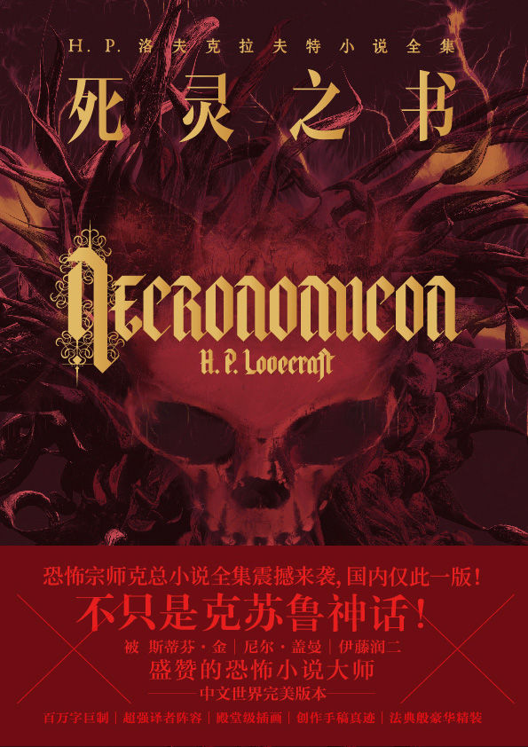
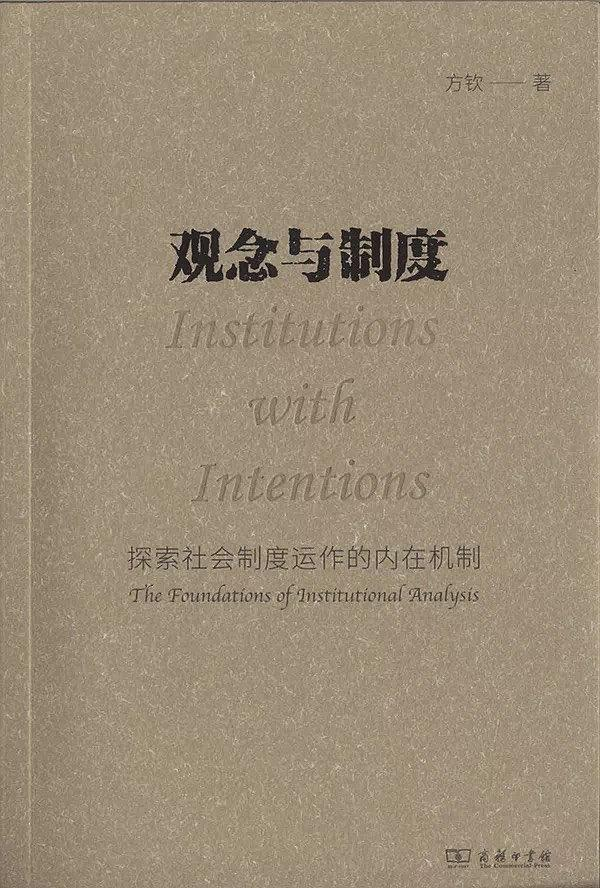

啰里啰唆是一份针对互联网和生活爱好者的数字杂志，旨在发现和分享一切有趣的东西。部分内容来自互联网采编，也有一些是编者本人的思考和短文，话题不固定，每期大约十五分钟阅读量，暂定每周四发布。

免责声明：部分内容可能会引起内心冲突或愤怒等不适症状。

啰里啰唆周刊第12期：中国式父母

# 科技分享

## 1. 如何在中国使用 Netflix｜Netflix 入门指南

Netflix 是世界上最大的流媒体，在全球除了中国大陆、克里米亚、伊朗、朝鲜、叙利亚外的所有国家地区都有提供服务。我个人从 2017  年就一直有订阅 Netflix，Netflix  有很全的中文字幕，在内容、画质、以及使用体验也都远超国内平台。希望你能认真看完这篇文章，应该能帮助你进入 Netflix 的世界。

https://qust.me/post/netflix2021/

## 2. 全历史

上一期分享过一张中国历史时空示意图，这里有个网站，能以时间轴的形式展示主要文明国家的全历史

https://www.allhistory.com/

除了展示全历史外，还能展示不同历史时期的画作、古籍等。

## 3.Fedora 36 正式发布

Fedora 36 原定于 4 月发布，如今推迟了半个多月时间，该版本终于正式发布了。

**桌面改进**

Fedora Workstation 采用了最新的 GNOME 版本 —— GNOME 42。GNOME 42 带来了很多改进，许多应用程序都被移植到了 GTK 4，以改善样式和性能；包括一个全局黑暗风格的 UI 设置；一个重新设计的屏幕截图工具；GNOME 42 中还有两个新的应用程序：Text Editor 和 Console。Text Editor 是新的默认文本编辑器，而 Console 则在软件仓库中可用。

如果你使用 NVIDIA 的专有图形驱动，你的桌面会话现在将默认使用 Wayland。

https://fedoramagazine.org/announcing-fedora-36/

## 4.Evolution

Linux上接受Exchange Web Server 邮件的客户端很少，最常用的一种解决方案是Thunderbird + ExQuilla，但是ExQuilla是收费插件，只能试用7天。

Evolution 是可以支持 EWS的, 而且支持的很好。

使用文档参考：https://help.gnome.org/users/evolution/stable/

# 读书分享

## 1. 《死灵之书》

当你打开这本《死灵之书》的时候，一个异世界扑面而来，旧日支配者、邪神、自焚、活死人、复活者、杂交人鱼、外星生物、灵魂互换、食尸鬼……近80篇作品包含了洛夫克拉夫特所有的奇思妙想！其中最令人叹服的是洛夫克拉夫特开创的“克苏鲁神话”体系，几十篇小说一脉相承，营造出了一个宏大、神秘、诡谲的架空世界。

在那个世界里，精神脆弱的人都在做怪梦，梦里高达数英里的巨物拖着沉重的步伐在四处游荡；美国考古学会议上出现的一尊奇怪雕像，引起了一位考古学家经历恶魔崇拜的恐怖回忆；勒格拉斯探长在沼泽森林中抓获了一群进行渎神祭祀的巫毒教教徒……这些毫无关联的事件，被一只巨兽般的手牵引着，难以言明的恐怖与怪异伸向黑夜的海边，海底那古老神秘的强大力量蠢蠢欲动，妄想再度觉醒，支配一切。“在拉莱耶的宅邸中，死去的克苏鲁等待入梦”，远古的旧日支配者克苏鲁发出沉睡的怒吼，那模糊不清的碎片进入了每个人的梦境，呼唤着它的追随者……

译者序：

> 最近十几年以来，与“克苏鲁神话”相关的作品及概念在中国迅速传播。不要误以为洛夫克拉夫特拥有一个病态的精神世界，甚至像某些介绍文章中所讲的那样，有意无意地把他想象为巫师一样的人物。那些作品完全是这个世界的产物，正如他本人所说：“从八岁以后，我就完全不信宗教或任何超自然事物了。”终其一生，洛夫克拉夫特一直嘲笑神秘学，并坚定地反对伪科学。就算作品中必须出现涉及魔法和巫术的部分，他也毫不关心，甚至可以说是漫不经心，他的那些关于“魔法理论”的段落几乎全都摘自其他恐怖小说，甚至包括《不列颠百科全书》中的相关条目。
>
> 洛夫克拉夫特的宇宙是一个机械唯物主义的冰冷宇宙，它辽阔而深邃，人类的感官根本无法认知，理性根本无法理解；洛夫克拉夫特所做的，仅仅是向主人公——向读者——揭示出这一点。在他笔下，那些神话中的专有名词、怪物，甚至旧日支配者，并不是吓唬人的道具，而是类似某种论据——它们的出现只有一个目的，便是让主人公彻底明白，在这黑暗而虚无的宇宙中，人类文明只是一种转瞬即逝的假象，日常生活只是一种自欺欺人的幻觉。

## 2.《苔》

《苔》是一部讲述晚清四川嘉定（乐山）的长篇小说，煌煌三十余万言，你很难相信这出自一个90后的作家。这与时下当红的一些年轻作家所展现出来的时代风格、题材迥异。它既不是对世事浮光掠影的描摹，也不是个人情绪的宣泄；这是一次回归，是回归到历史深处、回归到语言现场的一次写作，生猛沉郁，野心勃勃。

《苔》身上集结着很多特性，最显眼的便是乐山方言，方言写作，最知名者莫过于《海上花列传》《繁花》，这是自明清以来的一种写作传统，特别是在方言表达发达、丰富且自成系统的文化区。与其如时下常说的，方言是一种对语言大一统的反抗，不如简单地说，它是一种写作的必然，因为语言即是思维，语言即是写作，作者心曲，往往非方言不足以道尽。再者，这本小说文字间潜藏着一种悲天悯人的气息，它不是抒情的，而是自然主义的，是基于对故事现场的精确呈现，对细节的雕刻，如此，人物则自有其命运。(止戈隹武)

## 3.《观念与制度：探索社会制度运作的内在机制》

社会科学研究“制度”已近三百年，经济学是其中的后来者，仅有一百年左右的时间。20世纪90年代，经济学出现了制度转向，从言不及制度，到言必及制度。“制度”成为经济学最为重要的的研究对象之一，制度分析也成为主流的经济研究方法之一。然而，即便在经济学内部，对于何谓制度、如何研究制度等基础性的问题，仍然莫衷一是，存在大量相互矛盾的观点和理论。《观念与制度》一书的特色在于，作者独辟蹊径，将分析哲学界的制度研究传统和韦伯的文化研究理论结合在一起，并且运用标准的经济学方法，重新阐释科斯曾经说的“真实世界的经济分析”。

作者认为：人类社会制度最重要的特征在于其主观性，即观念的影响，如果无法厘清观念和制度之间的影响机制，那么经济学制度分析就是有欠缺的。复旦大学韦森教授评价认为：“这种研究到目前基本上还是一片空白。”而用作者自己的话来说，他只是在效仿人类学家格尔兹的方式，做一点“深描”的经济研究。（谷雨）

# 图论

## 1. 中国式父母

## 2.研究证明，英语的序顺并不定一能影阅响读

汉语的语序打乱之后，一定程度上不影响理解，但是英语似乎不行，英语只能打乱一个单词内部字母的顺序，不能打乱单词的顺序，而且也不能有大的语法错误。

英国人和中国人在阅读的时候都是直接识认整个“字形”的。正如中国人在阅读的时候不会把一个汉字拆成横竖撇捺一样，英国人也不会在阅读的时候把一个单词拆成几个字母再拼起来。这种“据形辨义”和“自动整合”的功能，也算是人类的天赋了。

# 谈天说地

## 1. 对话上海“电话亭女士”：我这个人活得很简单

5月1日，某媒体的一篇报道《被赶走前，她在红色电话亭住了一个月》引发社会关注。报道中的这名女士被网友称为“电话亭女士”。该报道以旁观者的视角，记录了一名暂住在电话亭的女士，4月份在上海的经历。

 4月1日，这名女性被附近居民发现入住电话亭，4月29日凌晨，她带着她的狗，在雨夜光着脚离开了，不知所踪。

 5月3日，中青报·中青网记者在上海市黄浦区找到了“电话亭女士”和她的狗。

https://baijiahao.baidu.com/s?id=1731874310247173691

## 2. RSS订阅的那些事

为了推动开放 Web 生态的发展，建议大家都给自己的网站添加RSS/Atom订阅，也就是我们常说的Feed订阅。

> 可能是十年前，有一个极其感召着我的词，叫做互联网精神，已经无从得知它起源于哪里，但大家都普遍认同互联网精神应该是开放、平等、协作、分享。它像花一样美好，这让年少的我感动不已，憧憬着互联网带着这些特质迈向光明的未来 
>
> 但今天，它正慢慢被遗忘
>
> 内容平台掌握着用户传播、分发、获取内容的权利。平台们筑起了高高的围墙，把用户创作内容关在里面，视为自己的财宝。用户主动或被迫放弃自己的权利，交给平台包办，甚至让微信微博这种垃圾平台横行霸道，实在令人匪夷所思。当信息失去了互联的能力，“互联” 网也名存实亡

互联网不再互联，也不再开放，也就是最近十多年的事，但是真正被意识到，似乎并不长，也就三五年。就如企鹅家垄断了社交一样，企鹅的性质也由一家互联网增值服务提供商转为一家基础通讯服务提供商。国内如此，国外那些不存在的网站亦如是，人们逐渐发现它们有着垄断且不可反抗的权力。增值服务是可选的，而通讯似乎是天生俱来不可或缺，避无可避的一项需求。互联网领域“赢家通吃”的局面凸显，大树底下，寸草不生。

而RSS的逐渐消亡，只是小的不能再小的一个缩影。rss带不来各网站那么丰富的内容，也带不来丰富的广告和内容收入，自然让绝大多数网站所厌恶。别说网站不喜欢RSS，绝大多数的用户也不喜欢RSS，不及时，不丰富，不有趣。V站那篇帖子提及RSS3的构思，虽好，但注定只是互联网土著的一种自我感动。

之前的几期，我也推荐过Feed订阅软件，如今使用Feed订阅来阅读已经成为了一种习惯。

虽然互联网不再互联，还是希望我们能从自己做起，让互联网更开放。

添加RSS订阅在技术上是个比较简单的事。

另外，Feed 类型分为 [RSS](https://en.wikipedia.org/wiki/RSS) 和 [Atom](https://en.wikipedia.org/wiki/Atom_(Web_standard))，虽然 RSS 历史更久远，兼容性更好，我还是建议大家选用 Atom 格式。这是因为在 RSS 规范里面，每一个 `<item>` 只有一个 `<description>` 字段。有的站长用它输出摘要，有的站长用它输出全文。局面比较混乱。而 Atom 规范则分别定义了 `
` 和 `<content>`，在语义上更加清晰，客户端在解析的时候也更加简单。

- RSS 标准 https://validator.w3.org/feed/docs/rss2.html
- Atom 标准 https://validator.w3.org/feed/docs/atom.html

## 3.盲文与近代化
全世界通用的视障者文字系统是布莱叶点字法，这是一种阅读者通过用手指触摸突起的点组成的文字来进行阅读的方法。传入中国以后，经来华传教士威廉·穆瑞的改良，参考了康熙辞典音韵，变成了中国历史上第一套盲文“康熙盲字”，随后在中国盲文的不断发展中又诞生了基于南方官话系统的“心目克明”。
1920年以后，中国的盲文发展在分散和统一之间不断地循环。可以说，盲文的发展历史中也暗含了中国近代化的过程。

https://www.xiaoyuzhoufm.com/episode/62791ac74af32f2190f66cca

## 4.这些植物朋友陪我们长大
今年三月，我们更新了一期名为《请查收这份春日赏花攻略》 的节目，与听众们一同漫游了草长莺飞的美妙春天。如今夏季将至，草木更盛，新朋也变成了旧友。本期节目，天冬老师和信浮沉再次做客，与花木、与童年、与自然，重建亲密的联结。

你是否有过“吃花”的经历？儿时的李叔如何利用南瓜花捕捉长喙天蛾？什么样的地黄才是中药材的上乘之选？如何区分国槐和洋槐？根植一代人童年回忆的榆钱儿饭是何种滋味？所谓的“假杨梅”究竟指的哪种植物？那些带苦味的野菜要如何处理方可食用？我们也同样畅聊了那些“好玩又好看”的花花草草：怎样拥有天然环保的凤仙花“指甲油”？平平无奇的野茉莉竟在《红楼梦》中闪亮登场？它的果实引发了怎样的惊险事件？孩提时代如何想方设法保存鲜花的美丽？在今天的节目中，天冬老师将为我们一一道来。

居住在现代化城市中的我们，仍需要偶尔行走到自然中去，获得片刻的安宁与自在。正如汪曾祺先生所说：坐卧其中，有浮生半日之乐，得淡泊宁静之怀。愿我们都能做回自然的孩子，潇潇洒洒，从从容容。

欢迎大家收听本期节目，并在评论区和我们分享你记忆中那些好吃、好玩、好看的植物们。也推荐大家阅读天冬老师已出版的书籍：《七十二番花信风》、《北京自然观察手册》、《野草离离》、《桃之夭夭》……在文字中感受和体悟自然的风味～

https://www.ximalaya.com/sound/529884328

## 5.“境外势力收购青储小麦”这种阴谋论，显得特别愚蠢

 【“境外势力收购青储小麦”这种阴谋论，显得特别愚蠢】
刚才看到[@侯宁](https://weibo.com/n/%E4%BE%AF%E5%AE%81?from=feed&loc=at)发的一位主播讨论青储小麦、谴责阴谋论的视频，评论区脑残依然不少，质疑视频是合成的，不是现场拍的。
我从某音上找到了该主播账号，发现她讨论青储小麦的视频有两个，于是下载下来拼在一起，加上字幕，调快速度，以供大家思考。
她说的主要内容是：
❶这些小麦种植的时候就决定了做青储饲料，卖给牛场的；收割完了，就会种植大聪明们指点的青储玉米。
❷因为无脑的炒作和愚昧的指控，牛场不敢收购了，种这些小麦的农民不敢割了，已经遭受损失。
❸“境外势力”的指控是扣屎盆子，如果发现了请严查严惩。（有谁找到了证据了吗？[允悲]）
❹不懂的人不要乱炒作瞎指挥。
我看了觉得她讲得非常好。
现在决定人民生活质量、营养水平的海量蛋奶肉怎么来的？是很多大规模的养殖场生产出来的，这些养殖场都需要海量青储饲料。玉米青储饲料的生产未必足够。思考问题，先要认清这个事实。
遇事不要轻易相信阴谋论，在煽动阴谋论之前，最好先动动脑子。特别是像“境外势力收购青储小麦”这种阴谋论，显得特别愚蠢。收购青储小麦，要和农民打交道，这也太容易查清了，要组织多大规模的收购行动，才能威胁到中国粮食安全？

另外，不要总认为让农民付出代价理所当然。某些卑劣群体一直认为农民承受代价理所当然，有时候还假惺惺歌颂几句，请问农民愿意吗？ 

https://weibo.com/xiaohua1980?refer_flag=0000015010_&from=feed&loc=nickname

## 6.尾号限行，永不取消的临时制度

北京的限行源于奥运会，赛事期间单双号限行，结束之后大家以为可以恢复了，结果交通委出了一个试行措施，实行尾号限行，又限了一年。到了09年，大家以为结束了，交通委说效果不错，于是又续了一年，到期后又续了一年，然后又续了一年，一直到今天。
很多人都以为限行是一项固定的法规，实际上它是一项有效期为一年的临时措施，只不过续了十几年，大家已经习惯了。 

国内其他城市借鉴了北京的做法。

地铁安检，出行绿码，核算检查，类似。

# 一句话快讯

1. 当地时间5月11日，美国佛罗里达州迈阿密-戴德县公寓大楼倒塌事件的受害者已与保险公司、相邻建筑开发商等多名被告达成9.97亿美元（约合人民币67.13亿元）和解协议，目前正在等待正式批准。

2. 央行银保监会祭出“大招”：房贷利率可低至4.4%，带来多方面重大利好 。

3. 北京大学原子核物理女博士王梦珍成功竟聘酒仙桥街道的城市管理执法岗。

4. 俄罗斯宣布退出俄日和平条约谈判，邀请中国开发南千岛群岛。 

5. 微软 Edge 浏览器于2022年5月16日在微博宣布了 IE 退役 30 天倒计时。

6. 根据国家统计局5月16日发布的数据，4月全国城镇调查失业率上升0.3个百分点至6.1%，创2020年3月以来新高。分不同年龄就业人群看，4月25—59岁人口调查失业率录得5.3%，高于上月0.1个百分点，为2020年6月以来最高水平。年轻人就业承压突出，16—24岁人口调查失业率明显高于总体6.1%的水平，4月录得18.2%，较上月上升2.2个百分点，创有历史数据以来最高。

7. 美国加利福尼亚州南部一座教堂在当地时间昨天发生枪击事件，共造成一死五伤，死伤者全为台湾侨民，开枪者为一名68岁的不满两岸政策的台湾移民。 

8. 1990年5月17日，世界卫生组织 (WHO)正式将同性恋从精神病名册中除名。 

9. 天津市春季高考网5月18日晚发布公告，天津春季高考将延期至6月12日进行。其中规定，考生若为新冠肺炎阳性感染者及其密切接触者、密接的密接，或为天津健康码“红码”，或处于集中隔离、居家隔离状态，或处于天津市封控区内，亦不得参加考试。
5月19日凌晨，人民日报健康客户端记者发现，天津考试院对事项7作出修改，调整为：考生若为新冠肺炎阳性感染者及其密切接触者、密接的密接，或为天津健康码“红码”，或处于集中隔离、居家隔离状态，或处于天津市封控区内，不在常规考点参加考试。

# 订阅方式

竹白：https://luoliluosuo.zhubai.love/
语雀：https://www.yuque.com/baicaibushicai/zk/

有些读者希望通过 RSS 订阅本周刊，这里介绍两个可以用 RSS 订阅周刊的方法。

方法一：

语雀可以使用rsshub进行rss订阅，比如本周刊rss地址为 (https://rsshub.uneasy.win/yuque/doc/25632997，25632997为语雀id，需要有一定编程经验才能找到，如果使用语雀rss，请使用此固定id)。

或者使用 RSSHub 提供的路由，获得竹白周刊 RSS 源地址。

举例: https://rsshub.uneasy.win/zhubai/luoliluosuo

路由: /zhubai/:name

参数:
name, 必选 - name 为竹白主页 url 中的三级域名，如 luoliluosuo.zhubai.love 的 name 为 luoliluosuo

> 提示：
> 在路由末尾处加上 ?limit=限制获取数目 来限制获取条目数量，默认值为 20
> 这个 RSS 源不支持全文输出。

方法 2：使用 Kill the Newsletter! 服务，把竹白 newsletter 转成 RSS。

1. 打开 https://kill-the-newsletter.com/ ，输入 Newsletter 的名字(任意起个名字即可，比如：啰里啰唆)，然后点击 Create Inbox
2. 然后你会看到它提供给你的用来订阅的邮箱地址和 RSS 订阅源地址
3. 将邮箱地址输入到你要订阅的 newsletter 网站（[啰里啰唆](https://luoliluosuo.zhubai.love/)）里
4. 将 RSS 订阅源地址添加到你的 RSS 阅读器里
5. 一般情况下，RSS 阅读器里收到的第一个订阅消息是叫你确认订阅或验证邮箱的内容，点击确认地址即可。**下一期内容**开始会出现在 RSS feed 里。

使用方法建议或素材提供

邮件：bairadish@gmail.com
频道：notonlyshare