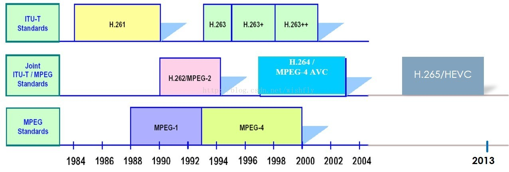
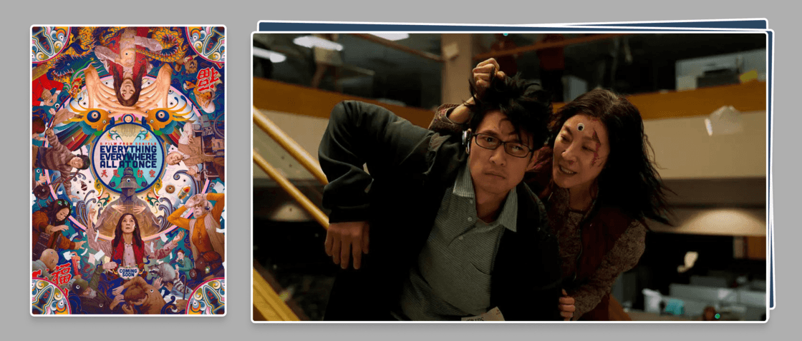
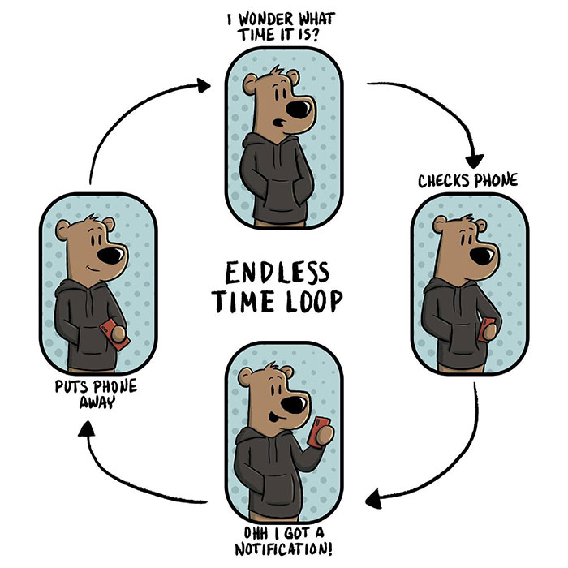
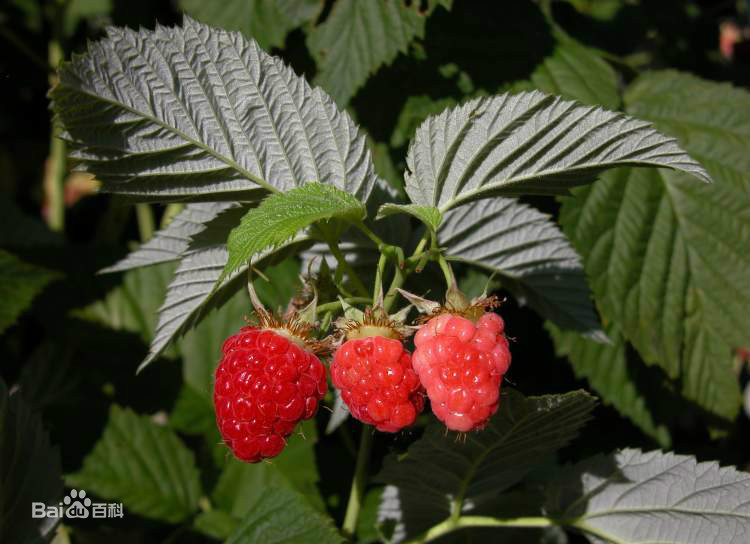
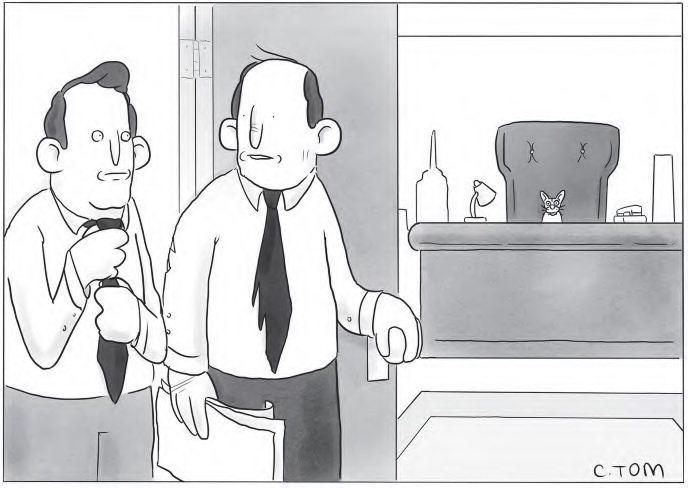
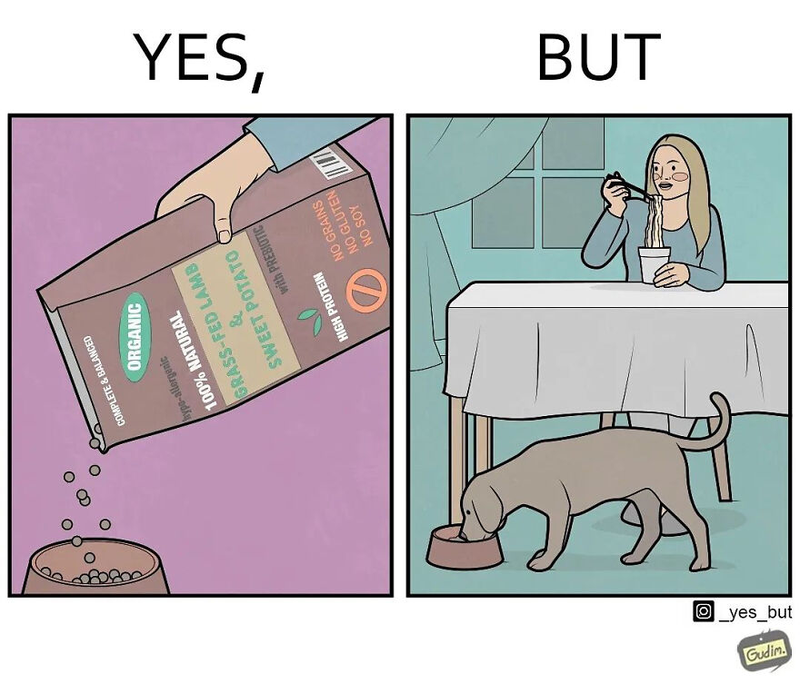

啰里啰唆是一份针对互联网和生活爱好者的数字杂志，旨在发现和分享一切有趣的东西。部分内容来自互联网采编，也有一些是编者本人的思考和短文，话题不固定，每期大约十五分钟阅读量，暂定每周四发布。

免责声明：部分内容可能会引起内心冲突或愤怒等不适症状。

啰里啰唆周刊第13期：GIF和MP4谁更适合网站动图展示

# 科技日常

## 1. 一日一技 | 用 Pandoc 和 Sigil，将 Markdown 文档做成电子书

少数派的一篇文章，挺简洁易懂，喜欢阅读和整理的读者可以参考下。

Sigil也是我常用的一个电子书编辑软件，比如删除空白页，调整目录，修改封面，删除文内广告等。

https://sspai.com/post/72536

如果你手里有很多txt（网络小说一般都是txt格式），需要转成epub格式，那可以使用calibre。因为txt格式是不支持目录的，有很多看书软件有根据标题生成目录的功能，但只能用于阅读模式，转成其它格式后就没有目录了。所以，可以用calibre给来生成目录，转成其他格式。

官网下载地址：https://calibre-ebook.com/download
github源代码地址：https://github.com/kovidgoyal/calibre

使用也很简单，将电子书txt拖入calibre，找到转换书籍
在结构检测的xpath表达式中粘贴代码，点击转换即可。
```bash
//*[re:test(., "^\s*[第卷][0123456789一二三四五六七八九十零〇百千两]*[章回部节集卷].*", "i")]
```

## 2.Kindle 电子书格式的发展史
亚马逊的 Send to Kindle 服务最近加入了对开放电子书格式 EPUB 的支持，但 Kindle 电子书阅读器至今仍然没有原生支持 EPUB。EPUB 的历史可追溯到 1999 年，最新版本 [3.2 在 2019 年](https://www.w3.org/publishing/epub3/)发布。EPUB 允许 DRM 但标准本身不包含，而是交给供应商自己实现，绝大部分人使用 EPUB 是因为它是 DRM-free。Kindle 支持的电子书格式同样历尽了[逾二十年的发展](https://hackaday.com/2022/05/17/kindle-epub-and-amazons-love-of-reinventing-wheels/)。它最早支持的 MOBI 格式可追溯到 1996 年的 PalmDOC 格式，电子书应用开发商 MobiPocket 在 2000 年扩展了 PalmDOC 将更新后的版本命名为 MOBI。2005 年亚马逊收购了 MobiPocket 获得了 MOBI 版权，加入了 DRM 将其命名为 AZW。亚马逊之后发展了多代，如支持平板电脑的 KF8/AZW3 格式组合使用了 EPUB 和 MOBI 的功能，最新格式 KFX/AZW8 是在 2015 年发布的。 

https://hackaday.com/2022/05/17/kindle-epub-and-amazons-love-of-reinventing-wheels/

## 3. 系統中的大多数文件有多大？

这是一个很有意思的问题，你可以试着先猜一下。

基于对系统中保存文件的了解，可能有这样的思考过程：
 我收藏了好多照片，每个有 2~5MiB 吧。
 我下载了好多漫画，每个 100KiB 左右，这些大概佔了不少比例。
 我还收藏了不少动画电影电视剧，虽然这些文件总数量可能不多？
 我下载了 Linux 的源码，那里面每个 C 代码文件都几千行，每行 100 字宽，平均也得有 30KiB 吧，有几万个源码文件呢，佔比应该挺大的……

问题中「大多数」其实是个挺不精確的称呼，换个精確点的问法：你觉得你的系统中 文件大小的中位数 大概在什么范围內？或者说，文件系统中 文件大小的分佈情况 一般是怎样的曲线？

这个问题其实还有多种別的问法，比如：一个常见的桌面或者服务器系统中，多大的文件算大文件， 多小的文件算小文件，什么范围內的大小算是普通呢？

https://farseerfc.me/file-size-histogram.html

## 4. GIF和MP4，你应该选哪个作为网站动图展示

可能有人看到这个标题，会觉得牛头不对马嘴，一个是图片格式，一个是视频格式，怎么对比？

本质上，视频就是动图+声音，那么无声的MP4不就是动图嘛。回到这个层次上来说，MP4和GIF是完全有可比性的。现在的一些软件，已经不再使用GIF做动图了，转而使用MP4（比如telegram的表情包都是MP4视频）。

基于H264格式的MP4比GIF在色彩和体积上有更大的优势。

GIF的文件头就是GIF89a，这也是GIF的版本信息，标志着它是1989年推出的版本，该版本允许一个文件存储多个图像，可实现动画功能，允许某些像素透明。

而H264是在2003年左右推出，尽管10年后才普及的格式，其算法更优，压缩率也更大。

一般来说，同样的内容，在清晰度和体积上，GIF和MP4相比均无优势。

一些讨论和对比可以参考下面的文章：
https://news.ycombinator.com/item?id=8981518
https://web.dev/replace-gifs-with-videos/

附视频编码格式发展简史：



## 5.小米向 AOSP 提交代码：禁止通过 shell 直接导出 APK

小米工程师在向 AOSP (Android Open Source Project) 提交的一个 commit 中[指出](https://android-review.googlesource.com/c/platform/system/sepolicy/+/2101015)，应禁止通过 shell 获取已安装的 APK，理由是某些 APK 可能包含私有资源或内容，因此**不应该被允许直接从系统中拉取**。

从 commit 的投票情况来看，只有作者自己投了一票赞成票，其余两名参与投票的工程师均是投反对票。所以目前该 commit 已被标记为「Abandoned」状态，意味着不能被合并到 AOSP。

投反对票的工程师认为，小米通过修改权限并非保护 APK 提供的 IP（知识产权）或服务的首选方案。即使禁用了 shell 这个 CL 工具，也还有多种方法可以获得 APK。而且 APK 本身也不是私密文件，如果 APK 包含需要保密的内容，应该通过其他方式 —— 如 DRM（数字版权管理）进行保护。

拉取出来，那么就可以被反编译，这对 apk 会有一些安全风险。所以，他认为应该尽可能地确保数据分区的数据安全。

**虽然AOSP拒绝了小米的COMMIT，但不代表小米不会在自己的系统中实现这个“Feature”。**


# 读书分享

## 1. 《双鸟渡》
《双鸟渡》出版于1939年，是爱尔兰作家弗兰·奥布莱恩的代表作。在这部天才般的元小说作品中，奇思妙想、神话传说、讽刺闹剧和胡言乱语交织在一起，令人眼花缭乱、目不暇接。 

小说讲述了一个生性懒散的都柏林年轻大学生，和他严厉古板的叔叔住在一起。他嗜酒成癖，喜欢长时间赖在床上，没事就搞搞创作，编一堆天花乱坠的故事。这学生塑造了一个二流作家的形象，作家拙劣的创作引起了笔下人物的不满，这些桀骜不驯的角色群起反叛，倒霉的作者为此吃尽了苦头。

古人和今人在书中次第登场，人类和精灵在这里穿梭翱翔，传说和现实以一种匪夷所思的方式交缠碰撞，成就了一场后现代主义的狂欢——《双鸟渡》既是对爱尔兰文学宝藏的一次谐趣模仿，也是对现代都柏林社会的一番精彩描摹，足以同乔伊斯的《尤利西斯》相提并论。


## 2. 《上海生死劫》
《上海生死劫》（Life and Death in Shanghai）是1988年浙江文艺出版社出版的图书，作者是郑念。该书为英文自传性作品，被译为多种文字在各国出版。在书中郑念记述了从十年浩劫开始到八十年代初出国这段时间的个人经历。

郑念本名姚念谖，原籍湖北，一九一五年生于北京，父亲是日本留学生，曾任北洋政府高官。郑念早年毕业于燕京大学，上世纪三十年代留学英国，就学于伦敦政经学院，师从著名的左翼政治学教授拉斯基（Harold J. Laski），和本报创办人余纪忠先生同学。余先生生前说，当时在伦敦政经学院的中国女留学生只有两人，郑念是漂亮的那位。郑念不仅漂亮，气质尤其好，一直到逝世前，始终保持美好的容颜和仪态。

> 书评：
> 印象中最深刻的三个片段 
>
> 一是郑念弟弟来探访 劝她承认莫须有的罪名 郑念写“弟弟应该对我很失望 因为我至死也学不会中国人逆来顺受的精明”
>
> 二是某次折磨毒打后 她写墙角开了一株小花 是春天来了 生命还在延续  
>
> 三是铐刑期间 郑念十指指甲几乎脱落 但每次方便都要用左手拉开西裤拉链 以至于右手被铐的更严重 平反后朋友问 为什么不干脆敞开拉链呢 反正当时牢房连窗户都没有 她说“这样不体面”郑念几乎没有在牢房中哭出声过 同样是觉得“不体面” 哪怕是猜测女儿已死的时候
>
> 我粗粗翻完这本书 感到真正的贵族 一直抱有一种孩童般的天真和乐观 这样带着岁月流逝的文字 没有抱怨 没有辱骂  有种哀而不伤的温情  只因当现实变成传记 所有的回忆都自带柔光 我们能做的只不过从文字中体味只言片语罢了

## 3.[电影] 瞬息全宇宙



关键词：喜剧 / 奇幻 / 冒险

片长：139 分钟；[豆瓣链接](https://movie.douban.com/subject/30314848/)

@潘誉晗：杨紫琼饰演的伊芙琳和丈夫苦心经营着一家自动洗衣店，可生活和事业的不顺并没有像衣服上的污垢那般容易被清洗。远道而来的父亲需要轮椅和她的照顾，丈夫提出了离婚申请，出柜的女儿也和她存在隔阂。就在她决定举办派对的这天，一向柔弱的丈夫突然化身成了另一个人，声称自己来自另一个宇宙，并且正在寻找可以拯救多元宇宙的人，而看似一无是处的伊芙琳，就是那个能够阻止邪恶的关键人物。

不愧是《瑞士军刀男》导演的作品，故事的无限脑洞加上酷炫特效使得观影过程很爽，电影最后回归到移民家庭的核心问题上也令人既意外又觉得合理。看之前觉得《瞬息全宇宙》这个名字真是浪漫至极，可看完后才明白台版的译名《妈的多重宇宙》才真正地表达了精髓。这一段天马行空的多元宇宙的想象，不仅让人忍不住想说「国粹」，更是独属于伊芙琳这位普通移民亚裔的，她是一位母亲，也是一位令人称奇的女性。


# 图论

## 1.辛勤的啄木鸟


树：放过我吧！
鸟：绝对清零！


## 2.Where is my phone



# 谈天说地

## 1. 覆盆子和黄松咩
很多人接触“覆盆子”这个词，应该是从鲁迅的《三味书屋》开始的。

> 不必说碧绿的菜畦，光滑的石井栏，高大的皂荚树，紫红的桑椹;也不必说鸣蝉在树叶里长吟，肥胖的黄蜂伏在菜花上，轻捷的叫天子(云雀)忽然从草间直窜向云霄里去了。单是周围的短短的泥墙根一带，就有无限趣味。油蛉在这里低唱，蟋蟀们在这里弹琴。翻开断砖来，有时会遇见蜈蚣;还有斑蝥，倘若用手指按住它的脊梁，便会拍的一声，从后窍喷出一阵烟雾。何首乌藤和木莲藤缠络着，木莲有莲房一般的果实，何首乌有拥肿的根。有人说，何首乌根是有像人形的，吃了便可以成仙，我于是常常拔它起来，牵连不断地拔起来，也曾因此弄坏了泥墙，却从来没有见过有一块根像人样。如果不怕刺，还可以摘到覆盆子，像小珊瑚珠攒成的小球，又酸又甜，色味都比桑椹要好得远。

很多长江以南或者东北的读者可能很小的时候就见过或吃过，但并不知道它就是覆盆子。

覆盆子（学名：Rubus idaeus L.）是一种蔷薇科悬钩子属的木本植物，是一种水果，果实味道酸甜，植株的枝干上长有倒钩刺。覆盆子有很多别名，例如：悬钩子、坨盘、覆盆、覆盆莓、树梅、树莓、野莓、木莓、乌藨子。

覆盆子生山地杂木林边、灌丛或荒野，海拔500-2000米。在山坡、路边阳处或阴处灌木丛中常见。通常生于山区、半山区的溪旁、山坡灌丛、林边及乱石堆中

覆盆子的果实是一种聚合果，有红色，金色和黑色，在欧美作为水果，在中国大量分布但少为人知，市场上比较少见。覆盆子油属于不饱和脂肪酸，可促进前列腺分泌荷尔蒙。



金色的覆盆子比较少见，但在云南分布比较多，通常被叫做黄松咩。也有把它叫做黄刺果的，但黄刺果其实是另外一种植物。


## 2. 成都来信

《纽约客》5月第二期杂志发表的一篇评论，作者何伟。



“He just kept sitting on keyboards until he made partner.”

https://www.newyorker.com/magazine/2022/05/16/a-teacher-in-china-learns-the-limits-of-free-expression

## 3. 狗吃的都比我好


http://vox.com/23035725/pet-dog-cat-food-treats-expensive

宠物口粮越来越贵，除了其本身营养丰富，对保质保鲜有一定要求外，最主要的原因还是爱心税了吧。
## 4.毕竟东流去

 1988年5月12日晚上，上海市计委、经委、建委、外经贸委的四位副主任，被召集到朱镕基市长位于康平路的办公室，朱镕基告诉他们，将以他们几人为班底，组建：

上海市外资委。

后来有人说过，上海外资委的成立，让上海历史从此要分成两部分。但如此重要的一个部门的预备会议，其实就那样匆匆开完了。 

来源：https://mp.weixin.qq.com/s?__biz=MzU3MzQ2MDEwNQ==&mid=2247487383&idx=1&sn=55bf94d4df682ae0d15e00e3e44d7028

## 5.云南发现中国最高树木
中科院植物研究所研究员郭柯团队在西藏察隅县考察时，在云南黄果冷杉原始森林发现我国迄今为止最高树木。经无人机吊绳多次测量，该树木高度 83.2 米、胸径 207 厘米，高度超过了此前报道的位于西藏的不丹松（76.8米)和位于中国台湾的台湾杉（81-82米），刷新了中国最高树纪录。研究人员表示，该区域之所以能够保留如此高大完好的原始森林，得益于优越的气候和地形条件，以及极少的人类活动干扰。此处的大量高大树木及所在群落和生态系统具有重要的科研价值和保护意义。

来源：https://news.sciencenet.cn/htmlnews/2022/5/479225.shtm

## 6.谁拥有爱因斯坦的肖像权？

2003 年 7月，物理学家和普利策奖提名作家 Tony Rothman 博士收到了编辑的坏消息邮件。Rothman  的新书距离出版还有几周时间。书名《一切都是相对的》致敬了爱因斯坦（Albert Einstein）的相对论。Rothman 要求出版商  Wiley 在封面上放一张这位史上最著名科学家的照片。 

 电邮写道：“刚刚出现了一个问题。”Rothman 的编辑被警告，爱因斯坦遗产管理机构“极具侵略性和诉讼性”。[除非出版商为使用爱因斯坦的形象支付高额费用](https://www.theguardian.com/media/2022/may/17/who-owns-einstein-the-battle-for-the-worlds-most-famous-face)，否则可能面临起诉。Rothman  很沮丧。他在邮件中回复道：“这很荒谬。”“如果遗产管理机构盯着所有使用（爱因斯坦形象）的人，他们没时间做其他事了。你确定他们甚至拥有它吗？”Rothman 的编辑不愿意去调查这些法律技术细节。这不是出版商第一次遇到继承人与他们作对了。

http://theguardian.com/media/2022/may/17/who-owns-einstein-the-battle-for-the-worlds-most-famous-face

# 一句话快讯

1.5 月 18 日，国内云端软件开发协作平台 Gitee 官方回应称，Gitee 即日起执行开源仓库审核后上线的措施，所有新上线的开源仓库需要进行人工审核后可正式公开。已开源部分仓库暂时关闭，审核通过后再次公开

2.5月21日，河南省疫情防控指挥部下发通知，明确河南省常态化核酸检测工作服务指导意见，要求开展常态化核酸检测，全省居民及其他在豫人员原则上每48小时应完成至少一次核酸采样（间隔一天采样一次）

# 订阅方式

竹白：https://luoliluosuo.zhubai.love/

有些读者希望通过 RSS 订阅本周刊，这里介绍两个可以用 RSS 订阅周刊的方法。

方法一：
使用 RSSHub 提供的路由，获得竹白周刊 RSS 源地址。
举例: https://rsshub.uneasy.win/zhubai/luoliluosuo
路由: /zhubai/:name

参数:
name, 必选 - name 为竹白主页 url 中的三级域名，如 luoliluosuo.zhubai.love 的 name 为 luoliluosuo

> 提示：
> 在路由末尾处加上 ?limit=限制获取数目 来限制获取条目数量，默认值为 20
> 这个 RSS 源不支持全文输出。

方法 2：使用 Kill the Newsletter! 服务，把竹白 newsletter 转成 RSS。

1. 打开 https://kill-the-newsletter.com/ ，输入 Newsletter 的名字(任意起个名字即可，比如：啰里啰唆)，然后点击 Create Inbox
2. 然后你会看到它提供给你的用来订阅的邮箱地址和 RSS 订阅源地址
3. 将邮箱地址输入到你要订阅的 newsletter 网站（[啰里啰唆](https://luoliluosuo.zhubai.love/)）里
4. 将 RSS 订阅源地址添加到你的 RSS 阅读器里
5. 一般情况下，RSS 阅读器里收到的第一个订阅消息是叫你确认订阅或验证邮箱的内容，点击确认地址即可。**下一期内容**开始会出现在 RSS feed 里。

使用方法建议或素材提供

邮件：bairadish@gmail.com
频道：notonlyshare