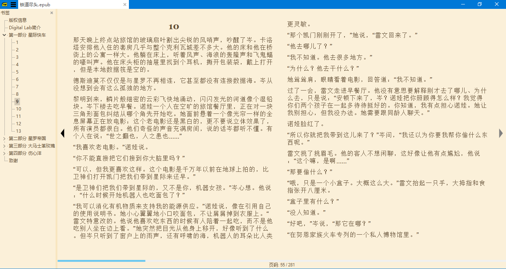
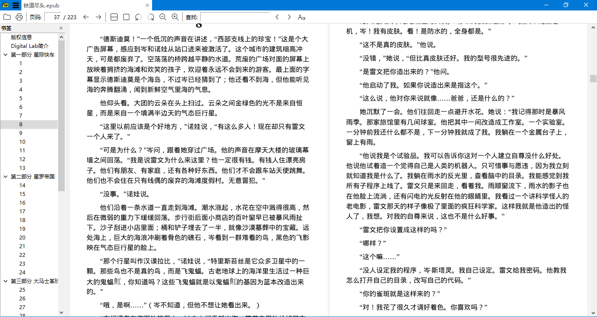
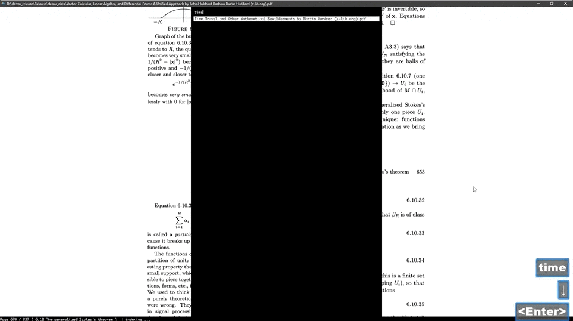
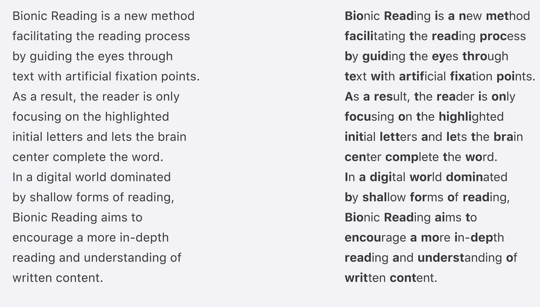

啰里啰唆是一份针对互联网和生活爱好者的数字杂志，旨在发现和分享一切有趣的东西。部分内容来自互联网采编，也有一些是编者本人的思考和短文，话题不固定，每期大约十五分钟阅读量，暂定每周四发布。

免责声明：部分内容可能会引起内心冲突或愤怒等不适症状。

啰里啰唆周刊第14期：甲马

# 科技日常

## 1. 安卓的传感器

只是在QQ浏览器中打开网页，vivo NEX的前置摄像头竟自动弹出，看了你一眼后又默默缩回去……明明不使用相机功能，摄像头却被“召唤”，这就是vivo NEX和OPPO Find X的升降式摄像头功能。本来作为一个设计亮点的功能，居然成为了隐私检测神器。

这其实是2018年的新闻了。升降式摄像头由于设计难度较大，故障率高，并没有流行起来。

升降式摄像头能探知APP是否有滥用隐私之嫌，要想避免APP滥用权限，还有一个大杀器，就是安卓的传感器功能。

一旦关闭这个传感器，摄像头就变得不可用，像您手机的内置摄像头客户端这样的应用程序尝试访问这些传感器组件中的任何一个，它将返回错误或拒绝工作，彻底杜绝了偷窥隐患。

当然，关闭传感器也会让你的拍照、扫码功能不可用。

注：
1.Android 平台支持五大类传感器，包括动态传感器（加速度计、重力传感器、陀螺仪和旋转矢量传感器）、环境传感器（气压计、光度计和温度计）和位置传感器（屏幕方向传感器和磁力计）以及摄像头、麦克风。

2.Android关闭传感器功能需要安卓10以上版本支持，通常需要在开发者选项中开启快捷开关。

3.关闭传感器不会影响Wi-Fi，蓝牙，GPS，指纹识别，但是会影响依靠陀螺仪来计步的某些健身应用。

## 2. IzzyOnDroid Android App Repository

又一个FOSS(**Free and Open Source Software**) 安卓App仓库，类似之前提到的F-Droid，大约有860个app。

它不是F-Droid的镜像，作者提到过它的APP来源：
“From time to time, I check on Github, GitLab and Codeberg for repositories featuring Android apps which are not part of the main F-Droid repository, ”

对大多数人来说，里面的app都不是很实用，因为[F-Droid](https://f-droid.org/en/)已经收录了大部分FOSS软件。不过这个仓库居然收录了Legado (阅读)这个中文世界的app，只能说这个app太出名了。

地址：https://apt.izzysoft.de/fdroid/

## 3.polybar 

超酷的 Linux 桌面状态栏工具。使用时无需精通 shell 就能上手，轻松完成高度自定义的状态栏。还有更多现成的主题，拿来即用[点击查看](https://github.com/adi1090x/polybar-themes)                     

## 4.Sumatra PDF 3.4 版本发布

Sumatra 应该是地表最强阅读器了，可惜仅支持windows平台。它是有着 16 年历史的电子书阅读器，支持 PDF, eBook (epub, mobi), comic book (cbz/cbr), DjVu, XPS, CHM 等格式，甚至支持图片浏览。

前几天刚发布了3.4版本，新增功能
 命令行面板（Ctrl + K 调出，可访问包括打开最近文档、高级选项、更高语言等所有功能）
 可定制的键盘快捷方式
 使用 mupdf 的 epub 引擎更好地支持epub文件。
 在电子书文件中增加了文本选择和搜索功能
 使用网络服务搜索/翻译所选文本，如 DeepL
 i 键盘快捷键翻转文档颜色（黑变白，白变黑）
 支持打开.heic图像文件（如果Windows heic编解码器已安装）

更详细的更新日志[见这里](https://www.sumatrapdfreader.org/docs/Version-history)。

最主要的一条更新就是使用 mupdf 的 epub 引擎了，支持在epub里选择文字和查找了。

更新前老版本：

更新后：

感觉更新后默认字体看起来更糊了（或许能调？）。

其实之前的老版本也是支持在epub里选择文本的，但是需要更改一个配置

文件→设置→高级选项，将会打开一个配置文件，默认的设置中EbookUI的UseFixedPageUI的值是false,我们修改为true。

如果你不习惯新版本，也可以继续使用老版本，修改配置文件，就能实现在epub里选择文本的功能了。

https://www.sumatrapdfreader.org/free-pdf-reader

## 5.sioyek pdf阅读器

免费开源的 PDF 阅读器。键盘流操作，支持交互式快速搜索文档，而且就算文档中的引用没有链接也可以直接跳转，特别适合 PC 端阅读和研究论文、技术文档等                     
                

[                      ](https://hellogithub.com/periodical/volume/74/#open-gpu-kernel-modules)

# 读书分享

## 1. 电影《我心雀跃》

高二女生刘唯唯（孙伊涵 饰）在学校结识了美术老师邹野（宋宁 饰），邹野独特的气质和举止让她第一次有了怦然心动的感觉，纵使这份藏不住的懵懂情愫无法抑制，青春期少女特有的大胆和自以为是让刘唯唯沉浸在自己想象中的感情互动里无法自拔……在那一年夏天，她就像一个闪亮的发光体，无所顾忌地去做自己喜欢的事，去爱自己喜欢的人。 

没有打胎和狗血的一部青春片，也算难得。

制片国家/地区：中国大陆
上映日期: 2016-06-14(上海国际电影节)
豆瓣评分：6.7

## 2. 《地狱公寓》

二刷过的一本网络小说了，解密+恐怖。前几章写得很精彩，构思可以说是让人拍案叫绝，中间略显邋遢，逻辑有瑕疵，结尾的升华又把小说档次提上来了。

《地狱公寓》由起点中文网连载的小说，作者是黑色火种。
在这公寓内，如果住户房间的墙壁上出现了血字，住户就必须完成血字任务，一旦违背就会死亡。

进入这座公寓，就等于踏上了一条不归路。
只有被它选中的人，才能看到它，才能进入它。而一旦被选择成为了公寓的住户，便再也没有选择了。非血字任务期间如果离开公寓超过四十八小时，就会被它诅咒而被自己的影子杀死。
在这公寓内，一旦住户房间的墙壁上出现了血字，住户就必须去完成，一旦违背也一样会死。而血字期间会面临无尽的灵异恐怖现象，无数梦魇深处的幽魂鬼魅，将无处不在，索取你的性命。
即使能够活下来，回到公寓，也要面对下一次，那雪白的墙壁上出现血字的恐惧。
而可以离开这座公寓的方法，只有一个……
死亡并不可怕，可怕的是生不如死的恐惧折磨；
死亡并不绝望，绝望的是明知徒劳的奋力挣扎；
对生的渴望并不可耻，可耻的是要用别人的死亡来换取自己的苟延残喘；
母女、兄弟、夫妻、恋人，人性善恶在这里被彻底颠覆……
是像人一样死去，还是像鬼魅一样苟活，到哪里寻找生命与人性的救赎？
五十年一现的地狱契约即将出现。
这是除了完成十次血字以外，逃离地狱公寓的唯一途径。
为了活下去！
承受着良心的啃噬、恐惧的侵袭，在无边无际的黑暗中，夺命狂奔……

# 图论

## 1.困惑了很久的疑问

Dimitri stands out with his strange sense of dark humor mixed with  unexpectedness and a little bit of sarcasm. 

## 2.甲马

这几张图（纸）叫做甲马，是云南的一种民俗文化。

甲马，又名纸马或甲马纸，它是一种民俗版画，一般用于祈福、消灾、解厄等祭祀活动时粘贴、焚烧。甲马上印刷的内容也是名目繁多，神祇鬼灵、飞禽走兽、自然山川等各类图形都有。

**“纸马，即俗所称之甲马也。唐明皇渎于鬼神，王玙以纸为币。用纸马以祀鬼神，即禺马遗意。后世刻板以五色纸印神佛像出售，焚之神前者，名曰纸马。或谓昔时画神于纸，皆画马其上，以为乘骑之用，故称纸马。**《清稗类钞·物品类》”

云南有关民间美术研究的人士多称其为“甲马纸”，这是根据最初收集这种民间版画的保山、腾冲、大理等部分滇西地区的民间称呼而来，于是沿袭成俗。

《水浒传》中的神行太保戴宗，日行八百里，就是靠的腿上绑的两个甲马。

甲马并非云南独有文化，只不过如今在云南比较盛行，尤其是大理地区。无论是节日祈福，祭祀亡人，还是日常出行（云南很多车辆，不论是机动车还是人力三轮车，都会贴一张保出行平安的甲马），甲马都是必备物品。基于甲马文化，有一本小说，叫《甲马》，作者默音。

默音，1980年代生于云南，14岁后迁居上海，已出版小说《月光花》、《人字旁》、《姨婆的春夏秋冬》。写作《甲马》，历时八年之久。“写了八年，修改了四稿，从一个简单的故事渐渐写成了三代人两地的变迁和家族史。它是我的生命之光，也是烦恼之源，”默音感慨。

# 谈天说地

## 1.十三煞风景与十大雅
晏殊《煮茶》诗云：

稽山新茗绿如烟，静挈都蓝煮惠泉。
未向人间杀风景，更持醪醑醉花前。

花前煮茶，被认为是煞风景之事。这个词最早出自于唐朝诗人李商隐的《李义山杂纂》，李商隐总结了13种煞风景之事：
    “煞风景，松下喝道。看花泪下。苔上铺席。斫却垂杨。花下晒裩。游春重载。石笋系马。月下把火。行将军。背山起高楼。果园种莱。花架下养鸡鸭。妓筵说俗事。”

比如松下喝道，松下是风雅之地，隐者怡然自得之时，来了一个马夫喝令行人让路以显威风，当然大煞风景。

王安石有一首诗《戏示蒋颖叔》，写“松下喝道”：

扶衰南陌望长楸，灯火如星满地流。但怪传呼杀风景，岂知禅客夜相投。

既然有煞风景，那自然就有雅事。

古人有十大雅事：焚香、品茗、听雨、抚琴、对弈、酌酒、 莳花、读书、候月、寻幽。

譬如焚香，雅事之首。中国人从古至今，从宫廷到民间，都有焚香的习俗。古人雅致，品茗、读书、抚琴、静坐之时，必会焚香净手，沐浴更衣，以示虔诚和郑重。

焚香，自古有“沉檀龙麝”之说。所谓“沉”，便是沉香，沉香自古就是众香之首。

沉香香韵清雅，清凉甘甜，香中有花香或果香，穿透力强，闻之令人纳气静心、心情舒缓。

注：
1.很多人引用了《西清诗话》记载李商隐的煞风景。这个版本有些不同，“《义山杂纂》品目数十，盖以文滑稽者。其一日杀风景，谓清泉濯足，花上晒裈，背山起楼。烧琴煮鹤，对花啜茶，松下喝道。”

2.关于《杂纂》作者,鲁迅怀疑为诗人李商隐作。《直斋书录解题》评其内容为“里俗常谈鄙事,可资戏笑,以类相从。今世所称‘杀风景’,盖出于此”。共四十一类,分别用“必不来”、“不相称”、“羞不出”、“怕人知”、“不嫌”等作标题,每题下所记皆社会知识与人生经验之谈。风格类似冯梦龙之《警世通言》中的各种俗语、顺口溜、对仗句的记载。

## 2.Bionic Reading，传说中可以显著提高英语阅读效率的技巧
前端时间微博上有个科学方法提高英语阅读效率帖子很火。核心内容就是所谓的Bionic Reading。
这一概念似出现于2019年前后，知乎上有人把它翻译为仿生阅读。

> Bionic Reading is a new method facilitating the reading process by guiding the eyes through text with artificial fixation points. As a result, the reader is only focusing on the highlighted initial letters and lets the brain center complete the word. In a digital world dominated by shallow forms of reading, Bionic Reading aims to encourage a more in-depth reading and understanding of written content.
>

> 仿生阅读是一种通过人工注视点引导眼睛通过文本，促进阅读过程的新方法。因此，读者只关注突出的首字母，让大脑中心完成单词。在以浅显形式阅读为主的数字世界中，仿生阅读旨在鼓励人们更深入地阅读和理解书面内容。
>

大致原理是，在英语文本里，给每个单词的前几个字母加粗，就可以引导人眼迅速识别出单词——因为实际上，绝大多数场合没有必要把完整单词“读入”人眼，只需要一个单词的部分结构就足以让我们辨认出是哪个单词。略类似于汉语里的“打乱一句话的文字，我们仍然能一眼理解那句话的语义，甚至没有发现语序是乱的"这一现象。只不过正常印刷排布的文字，缺少视觉中心，现在利用特殊字体制造关注点，强行激活大脑的自动补全功能。减少扫描频次，变相提高录入速度。

效果如图所示：

很多人认为这一方法有效。个人认为效果不明显。

关于这技术的主页→https://bionic-reading.com/。后面列举了一些手机上的 app 可以自动把文本变成强化关注形态，包括可能很多人都有在用的。每个单词的前半部分加粗，可以在 calibre 编辑器中编写一个正则表达式函数来执行此操作。

## 3.柬埔寨政府：山里的猪笼草你不要采

最近柬埔寨政府要求人们停止采摘一种稀有的食肉植物，这种植物从特定角度看起来就像是人类男性的生殖器。

柬埔寨环保部在脸书上分享了几张图片，图片上有三名女性正在摘取该植物，并拿着它们摆pose。根据柬埔寨新闻网站Khmer Times的报道，环保部官员要求大众不要去打扰这些植物。

"If people are interested, even in a funny way, to pose, to make selfies with the plants, it's fine," he said. "Just do not pick the pitchers  because it weakens the plant, because the plant needs these pitchers to  feed."

https://www.livescience.com/carnivorous-penis-pitcher-plant-picked

# 一句话快讯

1.5月26 日，阿里巴巴发布 2022 财年第四财季及全年财报。财报显示，今年的前三个月，淘宝成立 19 年来首次季度 GMV（成交额）下滑。

2.6月1日起，郑州成为核酸常态化后最严核酸城市，需凭48小时核酸证明生活。

# 订阅方式

竹白：https://luoliluosuo.zhubai.love/

有些读者希望通过 RSS 订阅本周刊，这里介绍两个可以用 RSS 订阅周刊的方法。

方法一：使用 RSSHub 提供的路由，获得竹白周刊 RSS 源地址。

举例: https://rsshub.uneasy.win/zhubai/luoliluosuo

路由: /zhubai/:name

参数:
name, 必选 - name 为竹白主页 url 中的三级域名，如 luoliluosuo.zhubai.love 的 name 为 luoliluosuo

> 提示：
> 在路由末尾处加上 ?limit=限制获取数目 来限制获取条目数量，默认值为 20
> 这个 RSS 源不支持全文输出。

方法 2：使用 Kill the Newsletter! 服务，把竹白 newsletter 转成 RSS。

1. 打开 https://kill-the-newsletter.com/ ，输入 Newsletter 的名字(任意起个名字即可，比如：啰里啰唆)，然后点击 Create Inbox
2. 然后你会看到它提供给你的用来订阅的邮箱地址和 RSS 订阅源地址
3. 将邮箱地址输入到你要订阅的 newsletter 网站（[啰里啰唆](https://luoliluosuo.zhubai.love/)）里
4. 将 RSS 订阅源地址添加到你的 RSS 阅读器里
5. 一般情况下，RSS 阅读器里收到的第一个订阅消息是叫你确认订阅或验证邮箱的内容，点击确认地址即可。**下一期内容**开始会出现在 RSS feed 里。

使用方法建议或素材提供

邮件：bairadish@gmail.com
频道：notonlyshare