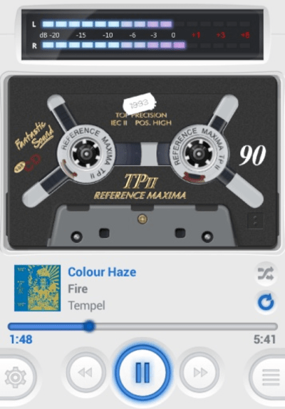
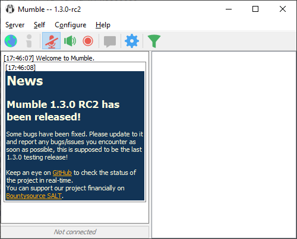
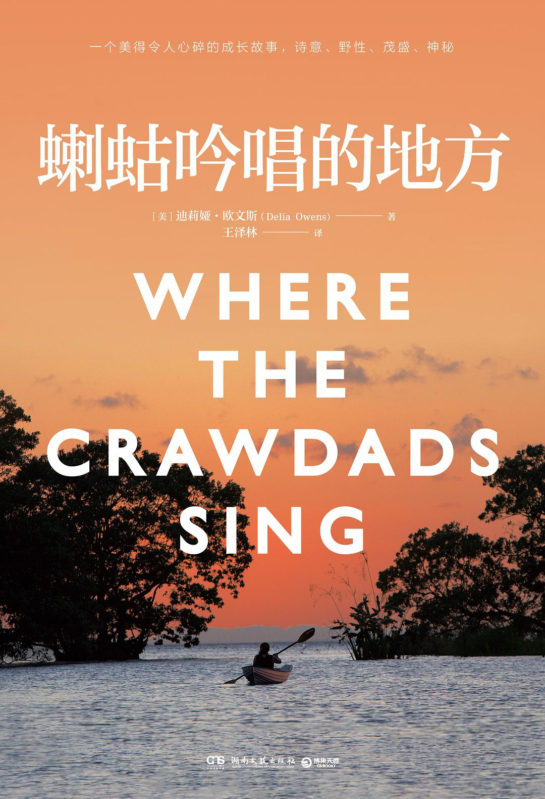
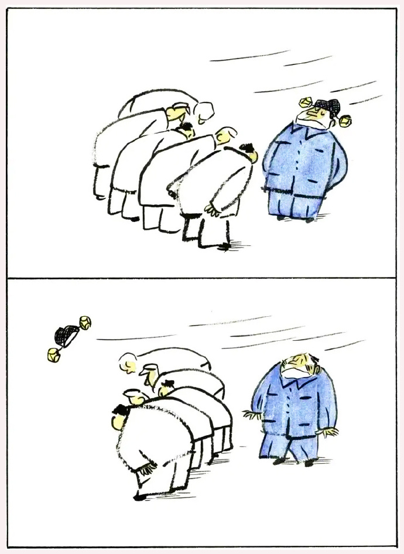

啰里啰唆是一份针对互联网和生活爱好者的数字杂志，旨在发现和分享一切有趣的东西。部分内容来自互联网采编，也有一些是编者本人的思考和短文，话题不固定，每期大约十五分钟阅读量，暂定每周四发布。

免责声明：部分内容可能会引起内心冲突或愤怒等不适症状。

啰里啰唆周刊第15期：长江图

# 科技日常

## 1. Git的patch应用场景
在一些内外网隔离的工厂，经常有这种场景，研发在物理隔离的内网进行，然后后续交付和定制需要在外网进行，如果发现了bug内网改好测试确认后，需要同步到外网。由于内外网物理隔离，无法使用同一个vcs进行管理。

这个时候，通常的做法就是在内网把改动的文件拷贝出来，然后再逐个传到外网对应位置，这样比较繁琐。其实，还有更简单的做法。
git中重用提交的方式有两种, 一种是cherry-pick, 另一种便是patch.
```bash
#生成A-B之间的patch，A是外网旧代码，B是内网最新代码
git format-patch <old-commit-sha>...<new-commit-sha> -o <patch-file>

#切换到外网
#检查patch文件
git apply --stat ~/temp_patch/0001-add-content-to-bb.c.patch
#查看是否能应用成功
git apply --check ~/temp_patch/0001-add-content-to-bb.c.patch
#应用patch文件
git am -s ./0001-add-content-to-bb.c.patch
```
apply patch成功后会自动commit，并且保留原来commit的comments，submittor等信息。

## 2. 中国广电发布三大品牌并启动 192 号码预约活动
中国广电于 6 月 6 日在北京举办品牌发布会，宣布推出「中国广电」「广电 5G」「广电慧家」三大品牌，同步各地广电网络公司营业厅门头同步换标。同步正式开启了友好用户 192 号码预约活动，每个友好用户可选择一个心仪的号码，活动截止 6 月 20 日。预约页面显示有最低消费、最低在网时长、预存等限制，最低月消费根据号码不同分为 69 元/月、99 元/月、159 元/月等。

## 3.Campact Cassette Player

Casse-o-player播放器是一款界面设计十分独特的手机音乐播放器，模仿了老式磁带播放器效果，并包含丰富的界面可供选择，让用户能感受复古的音乐体验。



https://apkpure.com/casse-o-player/com.hornwerk.compactcassetteplayer

## 4.Service Name and Transport Protocol Port Number Registry

服务器上常用的端口有哪些？
如果我们设计一个服务，需要避开已经被广泛公开使用的端口，对于端口的管理和注册，IANA实际上是有一个规范的。

下面的文档列出了在IANA注册的服务和其对应的端口。

https://www.iana.org/assignments/service-names-port-numbers/service-names-port-numbers.txt

## 5.Mumble
Open Source, Low Latency, High Quality Voice Chat



胜在开源，还有手机客户端。

## 6.Apple 服务和 Google 服务的数据上传

用户没登录的状态下 Apple 服务和 Google 服务回传了什么数据给自家服务器。Apple 甚至会回传 IP。

https://www.scss.tcd.ie/doug.leith/apple_google.pdf
文章里还有很多有趣的细节。


# 读书分享

## 1.电影《长江图》

《长江图》是杨超自编自导的魔幻现实主义爱情电影，由秦昊、辛芷蕾、谭凯、邬立朋、江化霖、王宏伟等主演。
该片讲述了发生在长江上两个时空交错的魔幻爱情故事，于2016年2月15日在第66届柏林电影节首映，是该届柏林电影节唯一入围的华语片 。
2016年2月21日，该片获cjt.jpg得第66届柏林国际电影节“杰出艺术贡献银熊奖（摄影）。

当代，长江沿岸。船长高淳在驾驶货船沿长江送货的途中，不断上岸寻找艳遇。但他逐渐发现，这些在不同的码头遇到的女人，好像是同一个人———安陆。只是随着航程的上溯，安陆时而温柔，时而疯狂，但是变得越来越年轻。高淳迷上了安陆，不断停船与她相会，也渐渐发现安陆出现的地点，都与一本手写诗集有关。但是船过三峡之后，安陆不再出现了。高淳疯狂地寻找安陆，在诗集和航线图中，发现了安陆出现的规律。船上发生变故，但他不顾一切地独自一人驾驶货船，继续上溯长江，直到源头的雪山，终于发现了安陆的起源，和长江的秘密。

这是一部文艺片，坦诚地说，很难懂，画面也很灰暗，压抑。

初次看时，你会感到非常困惑，根本不明白这两个人是什么关系，又因何总是相遇。

导演杨超在剧情上做了大量的留白，只留下一些细微的线索，需要用心体会，才能发现其中的秘密。

原来，“高淳在江上航行的时间”和“安陆在岸上行走的时间”是不同的。

**高淳这30多天的逆流航行，实际上是以倒序的方式，重历了安陆20多年的人生历程。**

他们在两条“密度不同且截然相反”的时间线上，进行着各自的追逐。

《长江图》中的长江，不见奔流，不见壮阔，唯有静谧。它被镜头赋予了一种“时间感”，神秘，隽永，无声无息，不停流逝。

就像是没有人注视时，长江露出了本来面目。

影片中有大量横摇的镜头，缓慢地扫过一整片江面，那零星的船只仿似静止，又始终在走，像极了人与时间永恒的拉扯。

## 2. 《蝲蛄呤唱的地方 Where the Crawdads Sing》
又名《沼泽深处的女孩》
故事梗概：

家人一个接一个离开。从十岁起，她就独自生活在北卡罗来纳州海滨荒凉的湿地中，驾着小船，靠猎捕和收集野物卖给码头的人维生。她只上过一天学，是小镇居民口中的“湿地女孩”，文明社会之外的野姑娘。当镇上最受欢迎的花花公子被发现死在湿地中时，人们立刻将怀疑的目光投向她。

作为天生的 湿地生物学家，她从土地中汲取生活的教训，从萤火虫不诚实的信号中学习世界真正的运行方式。到了渴望触摸和爱的年纪，受到两个来自小镇的年轻人的吸引，她向一种全新的生活开启了心扉……

若干年后，她成了当地的传奇，小镇旅游业的名片。但这本书要讲的并不是一个女孩冲破重重阻碍走向光明的励志故事。荒凉的湿地养育了女孩，也塑造了她。她关于爱情和生活的选择听从的是荒野的召唤，而非文明社会的教导……



媒体评论：

一部美得令人心痛的小说处女作，同时也是一桩未破解的谋杀案，一个成长故事，一场大自然的庆典……在与世隔绝的生活中，这个孩子让我们窥见了她私人世界中隐藏的奇迹和危险。——《纽约时报书评》

这本凶猛的、美得令人难忘的小说，讲述了女主角基娅学会信任人与人之间联系的令人心碎的故事，交织着一个扣人心弦的谋杀谜团，揭示了野蛮的真相。——《人物》杂志

茂盛、神秘，喜欢芭芭拉•金索沃的读者一定也会喜欢这本书。—— Bustle

从一个年轻女孩的视角讲述了一个成长故事和一桩神秘谋杀的调查过程……通过基娅的故事，欧文斯探索了离群索居如何影响人类行为，以及被抛弃留给我们生活的深刻印记。——《名利场》

注：改编电影今年暑假7月15日有望在美国上映，预告片：https://www.bilibili.com/video/BV1nZ4y1B782

## 3.《办公室之王》
讽刺某些办公室的工作效率！意大利这部喜剧动画短片《办公室之王》也太有意思了！想象力爆棚，批评方式精彩绝伦，尤其是结尾的处理，可以说将故事又上升到了一个高度！原来不管在哪儿，总有些办公效率低下的机构让人忍不住吐槽！

ytb地址：https://www.youtube.com/watch?v=q1qB-dlC8XQ
大陆转载：https://www.bilibili.com/video/BV1RS4y1X7eX

# 图论

## 1.It's there!


## 2.《敬畏》徐鹏飞 1984年



## 3.想象出的朋友


# 谈天说地

## 1. 众说纷纭的 MBTI，你真的看懂了吗 
简单的说，MBTI 是一项针对人格类型进行测量的测验，最终经由问卷答案形成一个匹配你人格类型的答案，并给出解释。而测验的意义在于，是理解和欣赏人与人之间的差异。由于所有类型都是平等的，因此没有最好的类型。

最近 MBTI 可谓是火出天际,但是MBIT准确吗，科学吗？是否有必要当真？

https://sspai.com/post/73511

## 2. 野生菌食用手册
又到了野生菌旺季，这是一本几年前自行整理的野生菌食用手册，因没有时间和精力继续更新，故放出未完全版，大约整理了六七十种常见野生菌，不具有权威性，仅供参考。

注意：
1.即使是同一种野生菌，不同的产地食用性不完全相同，换一种说法，A地可食用，不代表B地也可食用。野生菌以云南所产品种最多，食用性最佳。
2.作者本人有多年野生菌采集和食用经验，但仅供参考，如遇不决，可咨询权威专家或当地人。
3.书中提到的部分野生菌城市地区或公园也有分布，但考虑到环境污染问题，不建议采食。
4.颜色鲜艳的不一定有毒，但是五颜六色的一般都有毒，被虫子咬过的跟有毒无毒无任何关系。
5.大蒜，银器对鉴别生物毒性无任何作用，炒熟对含毒野生菌不完全有用。

因国内无较好的共享网盘，下载地址：https://t.me/notonlyshare_discuss/467

# 一句话快讯

1.6月2日下午，亚马逊Kindle服务号发布公告称，亚马逊将于一年后即2023年6月30日，在中国停止Kindle电子书店的运营。这意味着在此之后，Kindle用户将不能购买新的电子书。迁移指南可参考少数派文章：https://sspai.com/prime/story/kindle-migration-guide

2.Apple 推出 iOS 16、iPadOS 16、watchOS 9 和 macOS Ventura，还正式宣布了 M2 芯片，以及首款搭载 M2 芯片的全新设计 MacBook Air。

3.6月3日李佳琦直播间“零食特卖专场”因敏感问题突然中断，无法进入，此后微博再无更新。

4.郑州120延误救治致河南大学生死亡事件接线员被开除 。

5.据中指院数据显示，5月全国300城各类用地成交规划建筑面积5.1亿平方米，同比下降32.1%；总出让金达2284.95亿元，环比下降21.86%，同比下降70.77%；成交楼面均价为2134元/平方米，环比下跌18.21%，同比下跌52.6%。

6.近日，水泊梁山景区里梁山好汉的旗帜被悄悄改了，由“替天行道”改为“义薄云天”。

# 订阅方式

竹白：https://luoliluosuo.zhubai.love/

有些读者希望通过 RSS 订阅本周刊，这里介绍两个可以用 RSS 订阅周刊的方法。

方法一：使用 RSSHub 提供的路由，获得竹白周刊 RSS 源地址。

举例: https://rsshub.uneasy.win/zhubai/luoliluosuo

路由: /zhubai/:name

参数:
name, 必选 - name 为竹白主页 url 中的三级域名，如 luoliluosuo.zhubai.love 的 name 为 luoliluosuo

> 提示：
> 在路由末尾处加上 ?limit=限制获取数目 来限制获取条目数量，默认值为 20
> 这个 RSS 源不支持全文输出。

方法 2：使用 Kill the Newsletter! 服务，把竹白 newsletter 转成 RSS。

1. 打开 https://kill-the-newsletter.com/ ，输入 Newsletter 的名字(任意起个名字即可，比如：啰里啰唆)，然后点击 Create Inbox
2. 然后你会看到它提供给你的用来订阅的邮箱地址和 RSS 订阅源地址
3. 将邮箱地址输入到你要订阅的 newsletter 网站（[啰里啰唆](https://luoliluosuo.zhubai.love/)）里
4. 将 RSS 订阅源地址添加到你的 RSS 阅读器里
5. 一般情况下，RSS 阅读器里收到的第一个订阅消息是叫你确认订阅或验证邮箱的内容，点击确认地址即可。**下一期内容**开始会出现在 RSS feed 里。

使用方法建议或素材提供

邮件：bairadish@gmail.com
频道：notonlyshare
