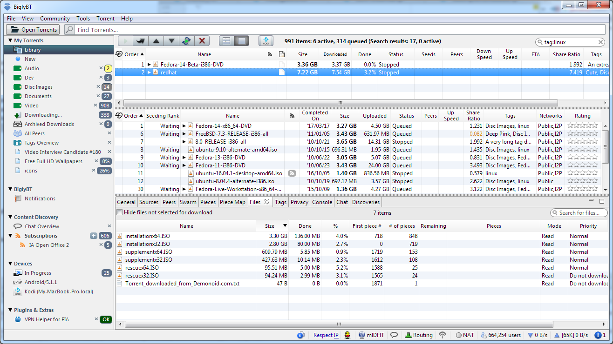
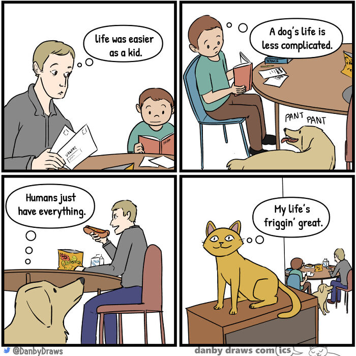
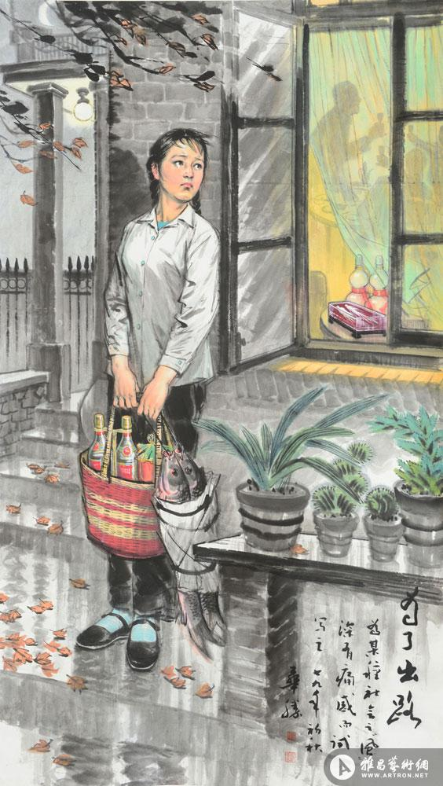
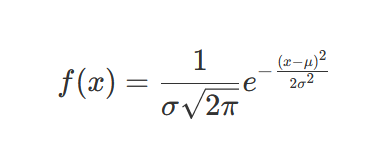

啰里啰唆是一份针对互联网和生活爱好者的数字杂志，旨在发现和分享一切有趣的东西。部分内容来自互联网采编，话题不固定，每期大约十五分钟阅读量，暂定每周四发布。

这是一个关注人文和科技的newsletter。

啰里啰唆周刊第16期：紫茉莉

# 科技日常

## 1. hosted.weblate
一个多语言志愿者翻译项目，众多软件的中文语言包即出于此地
Copylefted libre software, used by over 2,500 libre software projects and companies in over 165 countries.

同理，如果自己有多语言软件翻译的需求，也可以把项目放weblate上。

https://hosted.weblate.org/

## 2. BiglyBT

BiglyBT is a feature filled, open source, ad-free, bittorrent client.

Since 2003, BiglyBT's team has worked hard to bring you the best open source torrent product in the market. Unlike our competitors, our client is ad-free and our installer contains no third party offers.

We provide migration tools for several popular bittorent clients. Switching to BiglyBT from projects using the same source is simple and requires no interactions beyond the initial migration approval. Your settings, downloads, and plugins will all be there and ready to use.

Java开发，体积小（安装包12M），跨平台(支持Windows/Linux/MacOS/Android)，支持I18N，可支持插件。

## 3.冷知识：Windows 剪切板无最大数据容量限制
有没有向 Windows 剪切板拷贝数据时遇到问题？据微软资深程序员、《Old New Thing》作者 Raymond Chen 的解释，问题通常与剪切板本身无关。剪切板没有对数据预设容量上限，唯一的限制是可用内存和地址空间。他说，系统给剪切板数据复制的时间限制是 30 秒，超过 30 秒后会返回 NULL 错误。 

https://devblogs.microsoft.com/oldnewthing/20220608-00/?p=106727

### 4.可牛多标签文件管理器

文件管理器多标签页是不少人需要的功能，在最近 Win11 爆出即将支持多标签页功能，不过微软说了这个功能还在开发中，以微软的尿性，以后有可能会被砍掉。

目前有这个标签页需求的用户，可以通过插件的方式给系统文件管理器添加个标签页功能，例如：QTTabBar、Clover、Groupy、ExTab、TidyTabs、Shrestha Files Pro X。不过一年前用最新版的Clover，发现兼容性不是太好就忍了，居然耍流氓了搞弹窗广告。

今天提的这款「可牛文件管理」同样支持多标签页功能、兼容 Win11 系统。目前没有广告和弹窗等流氓行为。

在安装「可牛文件管理」的界面上你可以勾选设置为默认文件管理器，然后选择安装位置即可

「可牛文件管理」界面的设计风格和图标元素类似于 Win11，不过它不支持亚克力透明效果，目前也没有暗黑模式，和 Win11 一样采用了新的右键菜单，一些旧菜单项还得点击 **"查看全部菜单"** 切换到传统右键菜单。

当然，**国产软件很难做到百分百纯净**，可牛文件管理里面还有一个百宝箱功能，里面都是这个公司旗下的实用小工具，点击后才会安装，所以用户可以考虑下是否接受。

另外，该软件定制性也比较差，可配置项几乎没有。

https://file.keniu.com/

# 读书与影视分享

## 1.《我是路人甲》

《我是路人甲》讲述的是漂泊并奋斗在横店追寻影视梦的“横漂”一族的故事。一群年轻人，怀揣着各种不同的梦想来到了横店电影城，去追寻自己的演艺梦想。杨光、晓帆素不相识，但却坐着同一辆大巴带着各自的理想和信念来到了横店，这个被称为“中国好莱坞”的最大影视基地。失恋的晓帆碰到了横店的老群众演员“李钊”，在李钊的帮助下慢慢融入横店的各个剧组。来自各地的他们，在横店开始了自己的演员“寻梦”。

该片于2013年3月开机，已于2015年7月3日在全国上映。

这样一部小制作电影可能并不会引起太多人的注意，没有什么明星大腕、没有跌宕起伏的故事情节、没有美轮美奂的精彩场面。很多观众是因明星的推荐才去看这部电影的，对一向是追星的影迷来说，这部电影有点另他们失望，故事冗长，镜头普通。我也是关注到网上的推荐才来看这部电影的，看完之后觉得电影确实很不错，同时也带来很多的思考关于梦想、关于爱情、关于奋斗。

也有人反映鸡汤味比较浓，可能我看这部电影的时候还是单身，比较落魄，所以印象很深吧。

## 2.《我是谁，或什么》
我是谁，或什么》是一部由[美] 侯世达 / [美] 丹尼尔·丹尼特所著书籍。英文名《The Mind's I: Fantasies And Reflections On Self & Soul》

**注：此书不是鸡汤。**

“心灵/心智（mind）是什么？我是谁？纯粹的物质能思考或感受吗？灵魂（soul）在哪里？面对这些问题时，人人都会陷入困惑之中。我们编纂此书，为的是尝试展示这些困惑，让它们变得生动鲜明。我们的目的不是要直接回答这些大问题，而是要动摇世人的思维：既包括那些有着严肃坚定的科学世界观的人，也包括那些对人类灵魂怀有宗教或者灵性主义想象的人。我们认为，目前要想回答这些问题并不容易，我们首先要对问题进行根本反思，然后才能期望人们在‘我’这个字究竟是什么意思上达成共识。因此，本书旨在刺激、扰乱和迷惑读者，让显而易见的东西变得奇异起来，也许还会让奇异的东西变得显而易见。”

出于上述动机，二位主编为本书选文27篇，包含了从科幻小说、戏剧对话到哲学论文多种文体，除两位编者的作品外，更有图灵、博尔赫斯、道金斯、内格尔等重要人物的代表作。各篇文章围绕自我感、精神是否存在及有否特性、身心关系、自由意志、自我意识和“自我”特性等经典问题分类编排，每篇结尾均附主编者的评论反思。选文、反思及二者间的隔空对话，各有精彩与妙趣，对理解相关哲学认知问题、生物问题、人工智能问题等应大有助益。

书评节选：

> 这本书是一本老书。
> 该书是一部涉及认知学、哲学、心理学和人工智能的书。书的前两章读起来有点让人发晕，这让我一度有放弃继续阅读的想法。不过，继续读下去发现后面的内容还是比较精彩的，更像在读一本科幻小说。作者通过精彩、奇幻的故事以及哲学上的思辨，让你对什么是灵魂、人类思维和意识的本质是什么、人工智能的本质是什么、以及机器与大脑的区别到底在哪里这些问题有了更加深刻的认识。
> 不过感觉要想真的研究这些东西真的需要十分强的逻辑思维。以前觉得哲学比较无聊，但读完这本书后觉的在科学研究中十分需要哲学的那种逻辑与思辨能力。不过感觉逻辑这东西搞不好就会走火入魔，最后就像书中第十七章的宇宙之谜及其谜解的情况一样了。      

## 3.58 New Sci-Fi, Fantasy, and Horror Books

58本科幻、奇幻、恐怖小说，均为外文版，这是由一个外国网站评选出来的一个书单。

https://gizmodo.com/58-brand-new-sci-fi-fantasy-and-horror-book-releases-fo-1848916743

说到国外科幻，我最早读的一篇是2000年左右国内《科幻世界》刊登的美国作家雷·布雷德伯里的一中篇《雨一直下》，金星的雨一直下，一组四人小队绝望的寻找太阳穹炉，不断有人忍受不了大雨发狂死去。

# 图论

## 1.Your life

## 2.前后端的区别

## 3.为了出路

1979年，上海。辽宁画院的院长赵华胜的作品《为了出路》，一个女青年为了得到工作岗位，他提着烟酒和两条鱼，在落叶冷风中，站在厂长家门口等着送礼。厂长家中正在推杯换盏，觥筹交错。

# 谈天说地

## 1.How Harmful Is Social Media?
这是一篇来自纽约客的评论。社交媒体对认知的影响在国内已经是个成熟的话题了，民间不乏各种长篇累牍的批判（虽然来自官方的批判很少，但是也对社交媒体做了使用时间的限制）。国内有着最庞大的上网群体和用户数量最多的社交媒体用户，尤其是国内媒体信源更单一，所以在社交之害方面的研究和感悟也是最深的。

同样，在国外，人们也逐渐认识到Social Media的Harm，这是一个温水煮青蛙的过程，就如同“全球化”一样，在提高分工合作产出效率的同时，极大地改变了全球的产业布局，从而间接影响了国家地区之间的经济、政治依赖。

纽约时报常常会被人嘲笑被事实打脸，但纽约客相对而言没有时报那么左，因此文章的观点倾向性不会那么明显。说到这一点，就不得不提哪些英文媒体可以看，哪些慎看了。可以参看这篇文章 [英美主流媒体盘点：为什么我不建议你看 VOA，CNN](https://blog.shuziyimin.org/587)

这篇文章不仅有批判，也有思考。当今20年内发生的事，是从未遇到过的，也很难用之前几百年的经验来解释的。Something is changing.

文章中也提到了回声室效应。

回声室效应由心理学家凯斯·桑斯坦（Cass R.Sustein）提出。在一个相对封闭的环境上，一些意见相近的声音不断重复，并以夸张或其他扭曲形式重复，令处于相对封闭环境中的大多数人认为这些扭曲的故事就是事实的全部。

“回声室效应”更侧重在网络技术带来便捷的同时，也在无形中给人们打造出一个封闭的、高度同质化的“回声室”，也有人把这一现象叫做“同温层效应”。

但是过多地关注我们对社交媒体回音室效应的直觉，可能会掩盖相关的反事实 “Stepping outside your echo chamber is supposed to make you moderate, but maybe it makes you more extreme” 

文章中也提到了算法兔子洞的概念，“proverbial rabbit hole, the path to algorithmic radicalization, ”，虽然文章中是以Youtube举例，实际上TikTok才是最明显的兔子洞，越刷越上头，碎片化地消耗你的生命。

https://www.newyorker.com/culture/annals-of-inquiry/we-know-less-about-social-media-than-we-think
## 2. 紫茉莉

紫茉莉不是茉莉。

这种花路边很多，分布很广泛，小时候墙角到处都是，小的时候或许是听父母说的是丁香花，但长大后总感觉哪里不对。因为高中时学过一篇戴望舒的《雨巷》，总觉得它没有丁香姑娘的气质，而且丁香是一种乔木，没有它这么矮。

今天又想起来百度知乎了很久，搜索“花朵像牵牛花但不爬藤不匍匐”的植物，结果一直没答案，不是网上说的矮牵牛，也不是五爪金龙，也不是篱栏网，也不是打碗花，也不是田旋花。有App可以拍照识花，但手里没有照片，也没有植株。前年留了几颗种子，今年5月末种下的才刚发芽。

不死心，返回去搜“俗名 野丁香”，结果没多久找到了，原来它还真有“野丁香”这个俗名。
紫茉莉不是土生土长的植物，而是来自遥远的拉丁美洲也有些地方叫它粉豆花或者地雷花。

紫茉莉属于紫茉莉科（Nyctaginaceae），与华南地区常见的叶子花（三角梅）是同科姐妹。它所在的紫茉莉属（*Mirabilis*）包括了大概50个物种，**以南美洲热带为分布中心**。作为本属最为常见的一种，紫茉莉在很早以前就被土著人作为药用植物栽培和利用。

即使在同一植株上，也能见到紫茉莉多样的花色，黄色，蓝色，紫色，白色，红色，粉色，还有镶嵌色、条纹色和洒锦色等非纯色。

紫茉莉传入我国后，在大江南北得到广泛种植，各地的人们也给它取了**各式各样的俗名**，比如晚饭花、洗澡花、夜娇娇、野茉莉、野丁香、指甲花、胭脂花、地雷花、粉豆花等等，真是一个比一个接地气。

紫茉莉的花也比较不一般，看起来就像瘦身后的牵牛花，但两者仍有区别。牵牛的花冠由5个花瓣愈合而来，基部有5个绿色的萼片包裹，花冠和花萼区分明显；紫茉莉的花虽然也是类似的深漏斗状，基部也有5裂的绿色萼片状结构，但那并不是真的花萼，而是萼状总苞。（花萼与花瓣（准确用语是花冠）统称为花被，是组成一朵完整花必须的结构，另外还包括花梗、花托、雄蕊群和雌蕊群。总苞由靠近花序下面的叶片特化而来，与花萼在起源上完全不同。）

成熟后的紫茉莉果实，深黑的果皮会变得坚硬，表面的纹路让它看起来像**缩小版的地雷**，打在人身上也不疼。因此这种果实经常被80后用于追逐嬉戏所用。

## 3. qian麻疹还是xún麻疹疹

关于“荨”的读音，有人认为xún（寻）音是“认半边”导致的以讹传讹，约定俗成，也有人认为就应该读xun。例如，在电脑的众多输入法里面，输入xún都能找到“荨”字，输入xmz找到词组“荨麻疹”，用搜狗输入qmz，能够找到“荨麻疹”这个词，但后面的括号里面专门标注了“荨（xún）麻疹”。

也有人认为历史上这个字应该就没读过qian2，搞成这个样子学界争议也很大，主要原因应该是某个学界泰斗搞错了。2016年教育部就1985年的《异读词审音表》发布过一个修订稿征求意见的公告。这一修订稿里，粳米不读粳（jing）米，读粳（geng）米。荨麻也读荨(xun)麻了，心宽体胖（pan）直接改成心宽体胖（pang）了。

到底哪些是约定俗成，哪些是拨乱反正呢？

https://user.guancha.cn/wap/content?id=372398
https://baijiahao.baidu.com/s?id=1729362480957498500

## 4.写写高斯模糊——从 CSS 模糊滤镜的白边说起

高斯模糊看一下[维基百科](https://zh.wikipedia.org/wiki/高斯模糊)便能了解个一二。不过中文维基百科相比英文百科漏了几条简介。

高斯（Carl Friedrich Gauss），没错，就是我们平常知道的那位高斯，是历史上最为知名、最为重要的数学家之一。而高斯模糊本身并非由它提出，而是这个算法本身使用了高斯分布（也就是概率论中的[正态分布](https://zh.wikipedia.org/wiki/正态分布)）。

看到公式不要怕，我们只要会用它。

https://www.yunyoujun.cn/posts/gaussian-blur-for-image/

# 一句话快讯

1.据国外媒体报道，近期抖音国际版 TikTok 的中国管理团队与伦敦员工之间的「文化冲突」引发离职潮，TikTok Shop 英国站数十名员工因工作条件恶劣而集体辞职。

2.6月13日，前往郑州沟通村镇银行“取款难”的储户被赋“红码”。

# 关于付费订阅

目前所使用的发布平台——[竹白](https://luoliluosuo.zhubai.love/)推出了付费订阅模式，这是一次测试。本篇文章被设置成付费才能阅读的文章，但实际上你还是可以浏览全文，只是想看看这个付费按钮的效果，当然想付费的读者们，可以当这个是打赏按钮。

日后的文章类似，可能被设置成付费，但依然可以浏览全文。

主要是目前还没想好收费计划（主要是也不知道自己能提供什么附加的文章，以及对付费用户需要付出的收益比不确定），所以大家可以把付费订阅当成打赏。总之，从长计议，且行且看。

# 订阅方式

竹白：https://luoliluosuo.zhubai.love/

有些读者希望通过 RSS 订阅本周刊，这里介绍两个可以用 RSS 订阅周刊的方法。

方法一：使用 RSSHub 提供的路由，获得竹白周刊 RSS 源地址。

举例: https://rsshub.uneasy.win/zhubai/luoliluosuo

路由: /zhubai/:name

参数:
name, 必选 - name 为竹白主页 url 中的三级域名，如 luoliluosuo.zhubai.love 的 name 为 luoliluosuo

> 提示：
> 在路由末尾处加上 ?limit=限制获取数目 来限制获取条目数量，默认值为 20
> 这个 RSS 源不支持全文输出。

方法 2：使用 Kill the Newsletter! 服务，把竹白 newsletter 转成 RSS。

1. 打开 https://kill-the-newsletter.com/ ，输入 Newsletter 的名字(任意起个名字即可，比如：啰里啰唆)，然后点击 Create Inbox
2. 然后你会看到它提供给你的用来订阅的邮箱地址和 RSS 订阅源地址
3. 将邮箱地址输入到你要订阅的 newsletter 网站（[啰里啰唆](https://luoliluosuo.zhubai.love/)）里
4. 将 RSS 订阅源地址添加到你的 RSS 阅读器里
5. 一般情况下，RSS 阅读器里收到的第一个订阅消息是叫你确认订阅或验证邮箱的内容，点击确认地址即可。**下一期内容**开始会出现在 RSS feed 里。

使用方法建议或素材提供

邮件：bairadish@gmail.com
频道：notonlyshare