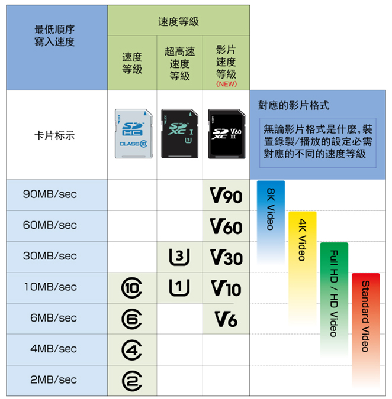
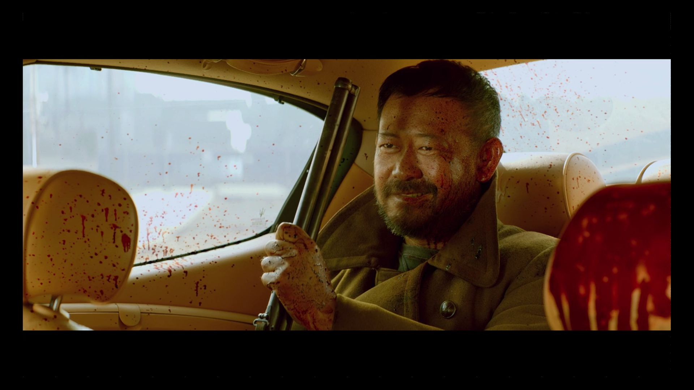
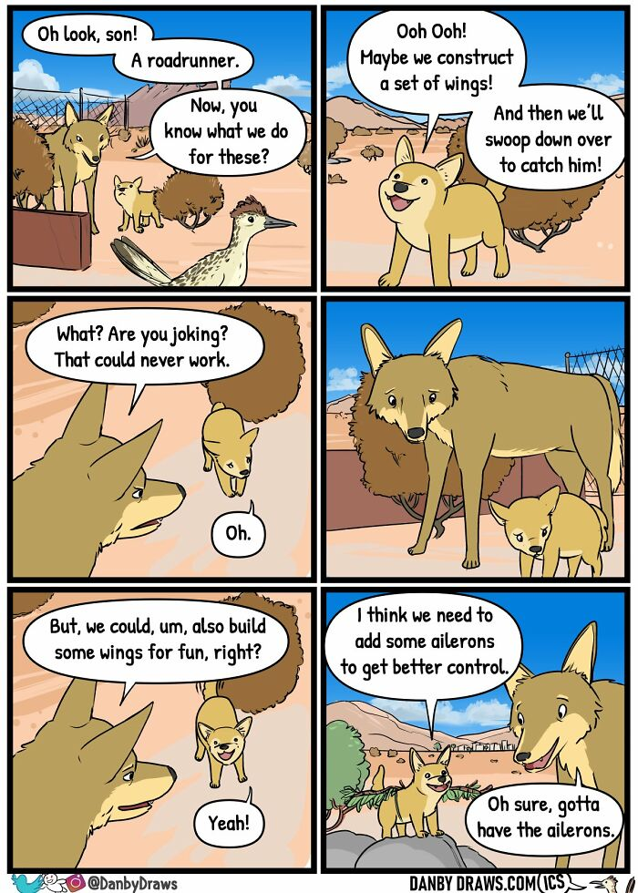
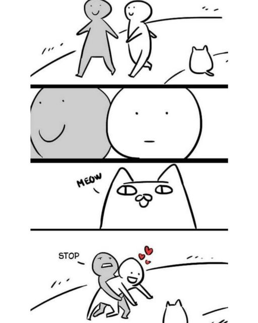
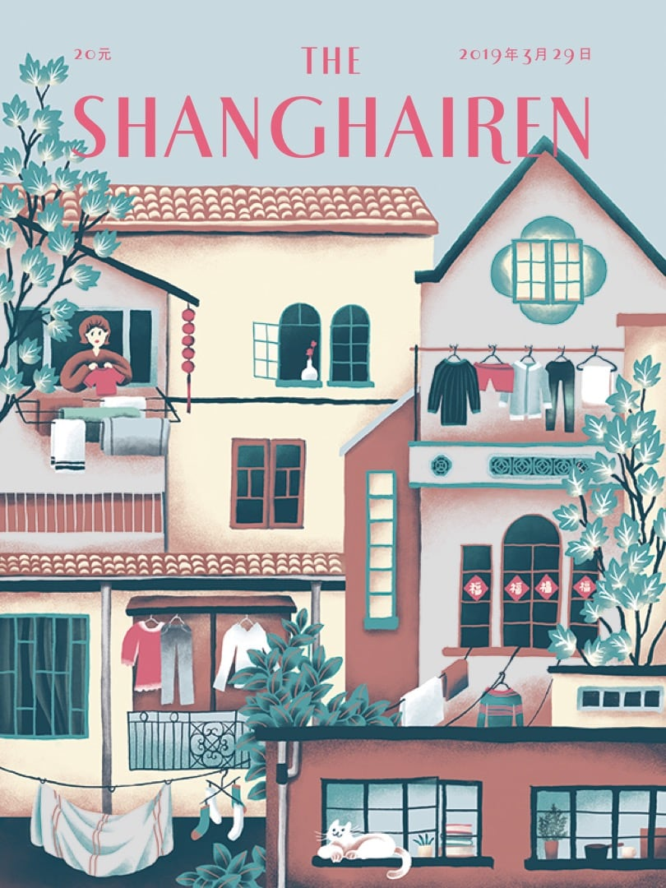
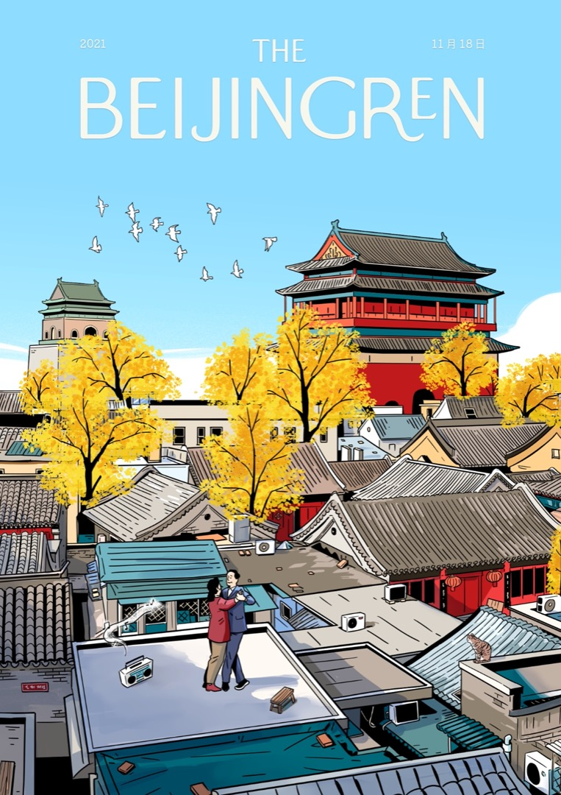
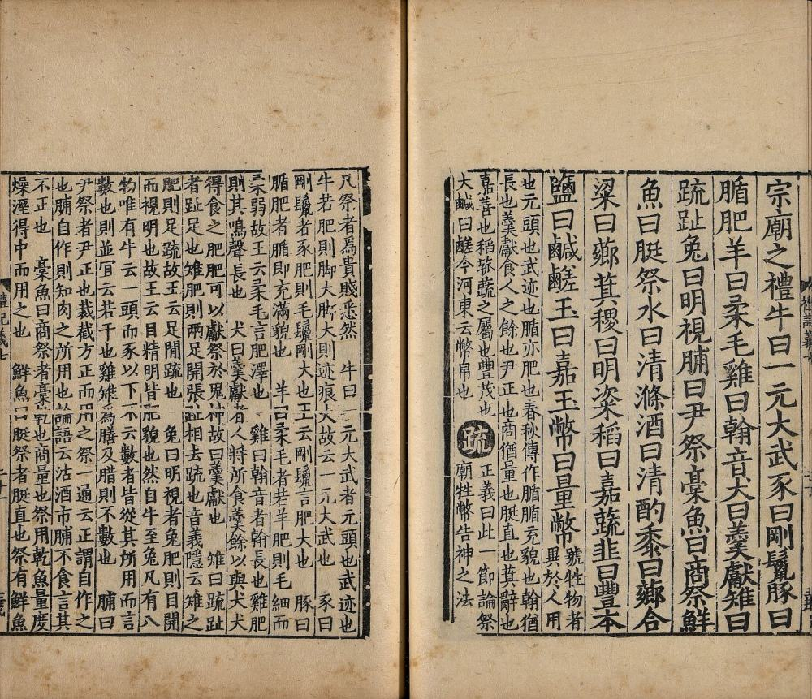

啰里啰唆是一份针对互联网和生活爱好者的数字杂志，旨在发现和分享一切有趣的东西。话题不固定，每期大约十五分钟阅读量，暂定每周四发布。部分内容来自互联网采编，如果为有来源的转载，均会注明转载地址或保留水印。

这是一个关注人文和科技的newsletter。

啰里啰唆周刊第17期：产品经理你妈妈喊你回家吃饭

# 科技日常

## 1. 猫啃网
无版权可商用免费中英文字体下载大全,已搜集493款免费中文字体。
一键检查字体版权能否免费商用。

官网：https://www.maoken.com

字体大全表可参看： https://www.maoken.com/all-fonts

## 2. SD 卡的C10，U1等级都是什么

SD卡的说明上总是说**读取速度 100MB/s**，这是商家用来忽悠客户的手段。买SD最主要看写入速度，如果写入速度达不到要求会出问题，比如摄像机可能会卡顿、丢帧，相机的话连拍可能会丢照片。

所以SD卡协会制定了各种等级标准来标定该SD卡的**最低写入速度**，注意是最低写入速度，（商家写的最大读取速度，看都不用看）。为了应对不同的SD卡使用场景，SD 协会将等级分为3类，分别是：

- Class
- UHS Speed Class
- Video Speed Class

缩写就是C，U，V。不同等级之间是有重叠的，换言之，C10的最低写入速度和U1是一样的，各等级之间的关系如下图：

图片来源: [https://www.sdcard.org/developers/sd-standard-overview/speed-class/](https://www.sdcard.org/developers/sd-standard-overview/speed-class/)

购买SD卡的时候对照这个表格选购即可，不要看**读取速度**，没有什么意义。

# 影视分享

## 1.电影《天注定》-贾樟柯

《天注定》（A Touch Of Sin）是由贾樟柯2013年编剧并执导，张嘉译、姜武、王宝强、赵涛、李梦、罗蓝山主演的剧情片。在66届的戛纳电影节上，贾樟柯的电影《天注定》获得了最佳编剧奖。

**此片未在中国大陆地区上映。**

《天注定》以四个取材于真实事件的悲剧为之展开，山西的胡大海怀疑官商勾结因而举起了枪，重庆的三儿走向抢劫杀人的不归之路，湖北的小玉一面要面对自己成为小三的事实，另一面在洗浴中心工作的她捅死了侮辱自己的客人，而在东莞打工的小辉，色情行业与血汗工厂，成为了其生命的最后一站，在冰冷绝望的以暴制暴中电影以此所呼之欲出的是一个真正属于底层百姓的中国，这样的电影诚然注定无法在国内公映。

就是这么四个普通人，在这个看起来安逸和平的时代，悲剧性的活不下去，转不了头，于是，选择了暴力这一最古老的武器去反抗，或者杀死了别人，或者杀死了自己。 

动物隐喻随处可见，鞭打的马，宰杀的鸭，公路边待宰的牛，被放生的鱼，最终，马累死，鸭果脯，牛被收回笼子，鱼窒息。动物如此，人亦然，十三亿人里的四个甚至更多的普通人，命运真是天注定？ 

## 2.微电影《百花深处》-陈凯歌

**2002年**，**戛纳国际电影节**为展示当代世界电影的最高艺术水准，特邀15位世界大师级导演**围绕“时光流逝”的主题**，亲自操刀，各拍**10分钟微电影**，共同串成一部150分钟的电影作为开幕影片。这期间，英国“10分钟，年华老去”有限公司斥资上亿元人民币供导演们自由拍摄。**陈凯歌**作为制作方唯一邀请的中国导演，其**微电影《百花深处》**（英译：100 FLOWERS HIDDEN DEEP）的表现着实亮眼，令人惊喜。

**影片讲述了一位老北京冯先生请搬家工人帮忙“搬家”的故事。**纵观全片，电影的核心情节并不复杂，却十分耐人寻味，因为冯先生所要搬的那个“家”——百花深处胡同里那两进的四合院——在实际生活中并不存在。一个是疯癫的坚持搬家，一群是“只要给钱啥都干”的做戏配合，两相所需，一出模拟搬家的荒诞喜剧就此上演。

他通过一种极具个人化的思维表达，在短短十分钟里表现了**虚与实的交错**、**历史与现实的传承**，以及**对于过往细腻而繁杂的怀恋**，向观众讲述了**一个疯人不疯的怀旧故事**。

# 图论

## 1.wing

## 2.**ailurophile**

## 3.一场从巴黎、东京、上海到北京的“杂志封面接力赛”

> 再一次，《纽约客》仅用一张封面就为我们**展示了一个充满吸引力的城市生活侧面**。从 1925 年发行第一期开始，封面虽然在不同编辑手下有过风格和取向的变换，但它想要向人们展示纽约生活的初心，却始终没有变过。
>
> 无论是幽默、讽刺、抒情还是描绘，《纽约客》观察下的纽约，是一座永远会令人向往的城市。你可以读出纽约、甚至整个美国的发展历史，也可以瞥见普通纽约客的琐碎日常。那些没有、也无需文字说明的封面，**记录下这座城市的自由与野心，和生活在其中的无奈与珍贵。**

从纽约、巴黎、东京、上海再到北京，一幅幅插画不再只是插画，也不只是一张虚构杂志的封面，而是**一个个或真实或奇幻的城市生活碎片**。

看着这些“假封面”，仿佛走进了城市里最隐秘的街巷，仿佛与形形色色的本地人擦身而过，仿佛正在不起眼的小饭馆门口，犹豫着要不要进行一次味觉冒险。

那些并不生活在这些城市的人们，也能因此**完成一次对陌生地点的探索**——这也许就是杂志封面永远具备吸引力的原因之一。

https://mp.weixin.qq.com/s/x-Z4-TMPJc2EYKF_PKEzow

# 谈天说地

## 1.直呼行家

> 注：这是一篇2019年的旧文，实际上更早应该是在2017年成稿。现在不时被脑残产品气的头疼，再次想起此文。
>
> 去年的时候，买过一个婴幼儿马桶，然后发现马桶外壳内侧有一个集水槽，每次洗的时候，都会留下很多水，根本倒不出来，甩都很难甩出来。。。直呼行家！
>
> 网购过好几双鞋，然后鞋带是圆的。。。鞋带是圆的。。。可以看看自己的鞋带，然后思考五秒钟。。。⚪且硬的鞋带意味着根本系不紧，非常容易打滑，走不了一百步就得重新系鞋带。尽管上班途中都是公交加地铁，但是加上中午下来吃饭，一天下来我依然系了七八次鞋带。。。气得直呼行家！有一款鞋甚至还是Adidas这种知名品牌。
>

钉钉(DingTalk)是一款由阿里巴巴集团开发的用于商务沟通和工作协同的IM，其和企业版微信占据了中国的大部分企业IM市场。阿里并不是一个擅长做社交的公司，钉钉也是一款命途多舛的产品。2014年左右阿里在内部强行推广来往，一款承载了阿里社交梦的产品，花了巨额的研发和营销费用后，依然是折戟沉沙。后来，来往的团队保留了部分下来，做起了钉钉，针对办公社交，居然做成功了。

在办公社交上，钉钉的崛起甚至早于以社交闻名的腾讯，在社交上扳回了一局，甚至可以说是唯一的一局。微信和QQ在钉钉后也快速推出了办公社交QQ和企业微信等功能，但是在它们推出后，钉钉在很多城市使用的频率已经很高了。

我用的是linux操作系统，钉钉并没有官方linux版本，所以有时候我会使用手机钉钉和网页版钉钉凑合。但是某一次打开钉钉设置的时候，发现了一个问题。

不知大家注意到没有，网页版钉钉的设置使用了流行的switch开关，但是用了红色和绿色的搭配。可能钉钉的设计和开发者觉得“红灯停，绿灯行”的概念已经深入人心，但是他们是否想到了一个事实：中国存在近亿的色盲和色弱用户，这其中又以红绿色盲色弱最多！

红色和绿色，是两个对比度比较接近的颜色，也是最难辨识的两个颜色，别说对色盲和色弱用户来说，即使是对于普通人来说，在某些光线条件下，红绿色也是很难于辨识的。实际上在打开这个页面的时候，我也愣了一会，才辨清了这两个颜色状态。

正因为红绿色是很难于辨识的两种颜色，**其实现在城市里的红绿灯，并不是真的红绿灯，大部分都是掺了蓝色的**，所以大家看到的绿灯，都是泛蓝的，而不是单纯的绿色。还有的城市，绿灯不仅掺了蓝色，还会使用动画或声音提示行人车辆，目的就是为了减少了特殊用户甚至是正常用户的困扰。

阿里一直宣传产品的人文关怀，比如雇佣残疾人客服，支付宝支持语音支付等，但是可曾想到，他们另外一款最流行的企业IM软件，却忽略了上亿人！

产品的设计开发中，有许多细节，只有真正用心的人才会注意到，并设计出用户友好的软件，减少用户的困扰。

作者使用了钉钉很久了，最早的APP版设置页面就是使用红色和绿色来作为swith开关的，作者曾经在微博等多个渠道向阿里反馈，可惜一直没有收到阿里的回复，直到一年后的某天，钉钉悄悄地改了这个细节，也不知道是无意中修改还是真的收到了用户的反馈。遗憾的是，网页版钉钉至今没有修改这个细节（截止2019年5月）。

## 2.为什么人们相信麦田怪圈？

在互联网和社交媒体诞生之前，[全世界的人们曾为麦田怪圈而疯狂](https://www.nytimes.com/2022/06/12/style/crop-circles.html)。

是指在谷物地里留下的巨大神秘图案，它引发了全世界人的兴趣，助长了外星人访问地球等诸多阴谋论相关的猜测。这种现象提醒人们对阴谋论的狂热，在缺乏证据或者存在相反证据的情况下信徒们仍然深信不疑。麦田怪圈的一对著名恶作剧者是英国南安普顿的 Doug Bower 和 Dave Chorley，他们从 1970 年代开始秘密制作了 200  多个麦田怪圈图案，使用木板和绳索在麦田里印上圆形图案。

英国布里斯托尔大学的一位心理学教授解释了信徒对阴谋论的热衷：他们不相信我们生活在一个无法控制的世界，而是认为一切事情都有人在背后指使。一位麦田怪圈的信徒虽然现在相信它们都是人为的，但仍然认为这些人的行为受到了非人思维的操纵。 	

https://www.nytimes.com/2022/06/12/style/crop-circles.html			                

## 3.读书的人
 网上都说他卖菜卖的好，其实我是被他卖书的语言吸引的。
一本《月亮与六便士》，在图书行业呆了几年，任何一个直播间卖这本书我都不会停留，因为太熟悉了。
但董老师卖的时候压根没提书里的营销用语，直接说了自己经历的故事。
他说自己碰到过一个出租车司机，不修边幅，看起来有点落魄。
但车里放的竟然是拉德斯基进行曲，他跟司机聊天，忘却了司机的形象和身份，聊梦想聊音乐聊人生，不亦乐乎。
走的时候董老师要多给司机师傅十块钱，司机师傅惊恐问你想干什么，然后扬长而去。
八年老师生涯，练就的语言感染力和节奏感无与伦比，一个简单的故事说的直播间的听众如痴如醉。主要是他呼应了书里的内容，他是真的看过书并且有自己理解的。也让看客们很快就理解了买这本书的理由。
他说这本书的营销用语不一定是对的，但他被这本书打动了，且刻进自己的人生。
他鼓励大家都这样读书，把每一本书都读到自己的人生里去。
然后20分钟刷刷卖了2万本。（这个战绩在卖书领域绝对是天花板级别）
他卖大米时说的是：
“我没有带你去看过长白山皑皑的白雪，我没有带你去感受过十月田间吹过的微风，我没有带你去看过沉甸甸地弯下腰，犹如智者一般的谷穗，我没有带你去见证过这一切，但是，亲爱的，我可以让你品尝这样的大米。”
讲地理是：
“一万年前在两河流域和埃及，幼发拉底河-底格里斯河，人类驯化了小麦。”
介绍博物百科书的时候：
“从岩石到细菌，从植物到动物，完整地给我们分享了这个星球上这些丰富的生命，我们无法真正去踏上每一片土地，我们也没有办法牵孩子的手，去看每一处风景，我们没有办法去听每一个诗人，讲他们的故事和诗谣，我们也没有办法去看每一个科学家的发现研究他的手稿.....
但请记得，你一定可以找到一个无所事事的下午，就像你好多年前放学后无所事事的下午一样，陪着孩子翻一本书，聊一些童年成长的故事，让他感受到在当年的那个情况下，他的妈妈他的爸爸也是一个喜欢山水、寄情于自然的人。”
其中有一页是蝙蝠，他说：
“万物皆有他的审美，听所有人的意见，保留自己的判断。
如果世界上只有了一种审美，那世界上便没有了美。如果世界上只有一种成功，那便没有了成功。”
说到读书的意义：
“我可以给你讲山川湖泊天体行星，你会从这些中感受到浪漫，我也可以给你讲人情世故，讲诗人酸腐的诗和科学家们惊喜的发现，那些会让你感受到幸福与美好，我们都是大自然的孩子，我们终将在大自然中找到自己，他会抚平我的内心，同时可以让我从比较焦躁的生活中，释放我的压力，书不能让你解决现实生活中的问题，但书总能让你想清楚现实中的一些问题，书不能帮你解决它，但看完书你会发现，你不必再焦虑它，这就是看书的作用......”
……
看惯了太多直播间的吆喝，才发现原来带货也可以带得这么浪漫。
他的文学功底和节奏感让我几乎无法质疑。
想起很多年前听到的这段话，当时就觉得很美：
当你背单词时，阿拉斯加的鳕鱼正跃出水面；
当你算数学时，南太平洋的海鸥正掠过海岸；
当你晚自习时，地球的极圈正五彩斑斓；
但少年，梦要你亲自实现，世界你要亲自去看。
——原来也是出自于他。
这么多年过去，他还是这样的他。只是现在有更多人看见了他。
想起刚入行的时候我就可笑地说我没有职业规划和目标，就是想提高国民阅读率。看完他的直播后，突然被惊醒了一下，好像忘掉了这个梦想很久很久。 

ref:https://weibo.com/guomaimaiya

## 4.韭曰丰本

《礼记》曲礼篇：稷曰明粢，稻曰嘉蔬，韭曰豐本，鹽曰鹹鹺……

> 凡祭宗庙之礼，各种祭品皆有美号。牛称为 “一元大武”，猪称为 “刚鬣”，小猪称为 “腯肥”，羊称为 “柔毛”，鸡称为 “翰音”，犬称为 “羹献”，雉称为 “疏趾”，兔称为  “明视”；干肉称为 “尹祭”，干鱼称为 “商祭”，鲜鱼称为 “脡祭”；水称为 “清涤”，酒称为 “清酌”；黍称为 “芗合”，粱称为  “芗萁”，稷称为 “明粢”，稻称为 “嘉蔬”；**韭菜称为 “丰本”**，盐称为 “咸鹾”；玉称为 “嘉玉”，帛称为 “量币”。

《说文》中解释：韭，菜名，一种而久者，故谓之韭。一直以来，韭菜本是一种兼具神性与普世性，而且健康美味的植物。然而，这个词逐渐被贬义化，成为被收割的代名词。

# 一句话快讯

1.TikTok 完成了将所有美国用户数据转至甲骨文服务器的工作。此举旨在解决美国监管机构对该应用数据完整性的担忧。TikTok 是北京字节跳动旗下的短视频应用，美国前总统特朗普曾要求字节跳动出售 TikTok，字节跳动的最终决定是与甲骨文合作，将美国用户数据转移到甲骨文服务器，由甲骨文承担 TikTok 美国用户数据的管理工作。

2.

3.

# 订阅方式

竹白：https://luoliluosuo.zhubai.love/

使用方法建议或素材提供

邮件：bairadish@gmail.com
频道：notonlyshare