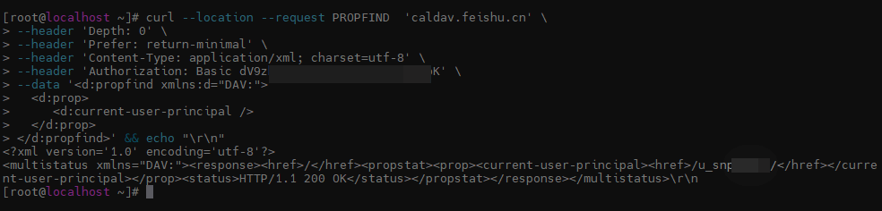
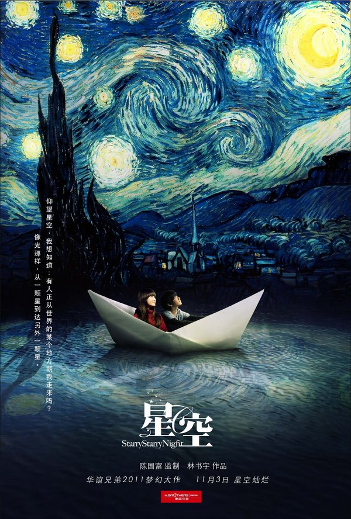
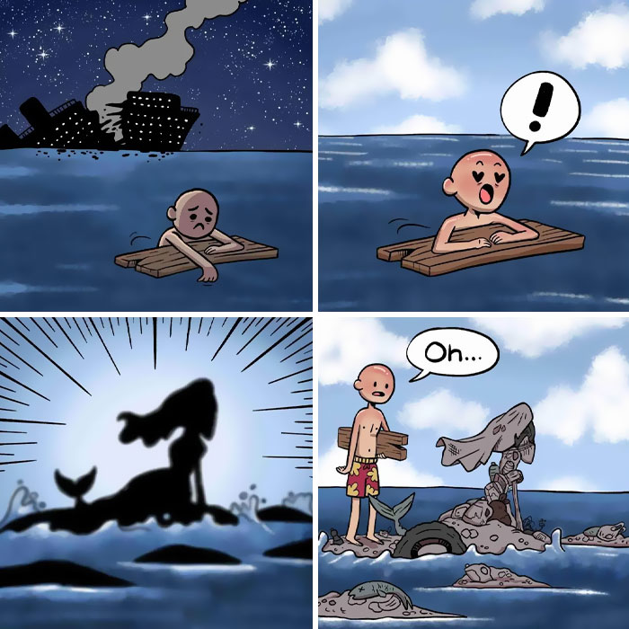
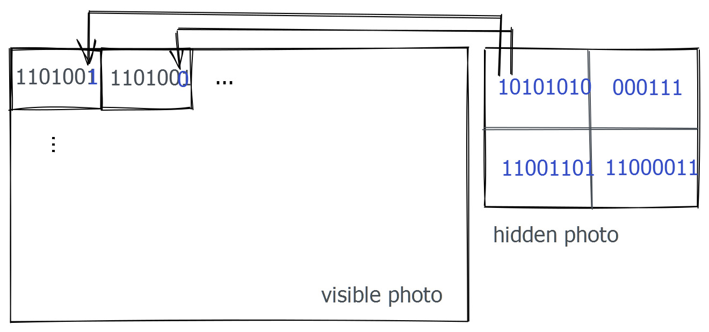

啰里啰唆是一份针对互联网和生活爱好者的数字杂志，旨在发现和分享一切有趣的东西。话题不固定，每期大约十五分钟阅读量，暂定每周四发布。部分内容来自互联网采编，如果为有来源的转载，均会注明转载地址或保留水印。

这是一个关注人文和科技的newsletter。

啰里啰唆周刊第19期：为你，千千万万遍 

# 科技日常

## 1. Earth.fm
We’re building a non-profit, free repository of pure, immersive natural soundscapes as a fundraising platform for local, grassroots charities that support the restoration of our natural world.

https://earth.fm/
## 2. Chrome 网上应用商店大陆镜像站
针对无法使用科学上网的用户，安全性需要用户自行验证。

https://www.gugeapps.net/

## 3.Etar-Android open source calendar 
一个FOSS的安卓日历，material designed，支持Caldav。但由于本身不包含Caldav client，所以要同步到自定义Caldav-server，还需要安装一个类似DAVx⁵的App支持。
不支持中国农历显示。

https://github.com/Etar-Group/Etar-Calendar

如果需要搭建私有Caldav-server，可以使用Radicale（https://radicale.org/v3.html），也可以下载飞书桌面端，注册飞书用户，使用飞书提供的Caldav服务。

DAVx⁵在Google Play是收费软件，在Fdroid可以免费下载使用，下载地址：https://f-droid.org/zh_Hans/packages/at.bitfire.davdroid/ （该软件无法通过名字搜索到，F-droid的搜索比较差劲）。

Caldav是一个基于webdav的协议，而webdav又是一个基于HTTP的协议，使用XML作为信息载体，HTTP Authorization作为认证机制，可以使用curl工具进行调试和查看。

提供一个调试截图，供有兴趣的读者自行研究

# 读书与影视分享

## 1.电影-爱情、奇幻-《星空》

星空（Starry Starry Night）是一部由林书宇执导，由徐娇、刘若英、庾澄庆、林晖闵主演的成长爱情奇幻电影，影片改编自台湾插画家几米同名绘本《星空》。

影片描述一个不爱说话的少女，认识了一个不爱说话的少年，他们都不是最快乐的孩子，有一天，他们逃离城市，翻山越岭，来到少女的爷爷曾经住过的山中小屋，在山里的夜晚，他们看到了最美丽的星空的故事。《星空》以一种年龄的视角，描绘了一类无法和世界沟通的孩子，从对社会的恐慌、逃避到逐步认识自我的过程。

影评：
影片讲述了13岁少女小美的成长故事，片中充满了奇思妙想的镜头，将少女心事用大胆的意象进行展示：火车飞进梵高星空、折纸动物飞翔跳跃……让观众在梦幻的影像中感受青春的温柔与哀伤。

电影本身略显薄弱，但表达的味道基本符合几米风格，春风拂面的感觉，没有期待所以有惊喜。片尾曲是五月天的《星空》，配上几米绘本的画面，美不胜收，一定要看完再出影院。“虽然一切都会过去，但是在放手之前，想要抓多紧就抓多紧”《星空》的出现基本上填补了内地近些年以来儿童电影，以及疑似纯爱电影方面的巨大空白。色彩斑斓、感情纯粹而又带点淡淡的小忧伤的电影基调，非常成功的继承了原作者几米绘本中的精髓。充满想象力的几个童年幻想照进现实的段落，通过更富有想象力的执行手段和影像风格，成为华语电影中不可多得的华彩部分。

## 2. 《追风筝的人》
《追风筝的人》是美籍阿富汗作家卡勒德·胡赛尼（Khaled Hosseini）的第一部长篇小说，译者李继宏，上海人民出版社于2003年出版，是美国2005年的排名第三的畅销书。卡勒德三部曲《灿烂千阳》,《群山回唱》,《追风筝的人》

“为你，千千万万遍。”哈桑的一句话令多少人感动。然而我是在2021年才读到此书的，自小学毕业近30年来都很少读文学和社科类书籍。上了中学读通俗流行小说看读者故事会😓，上了大学读技术类书籍。

12岁的阿富汗富家少爷阿米尔与仆人哈桑情同手足。然而，在一场风筝比赛后，发生了一件悲惨不堪的事，阿米尔为自己的懦弱感到自责和痛苦，逼走了哈桑，不久，自己也跟随父亲逃往美国。

成年后的阿米尔始终无法原谅自己当年对哈桑的背叛。为了赎罪，阿米尔再度踏上暌违二十多年的故乡，希望能为不幸的好友尽最后一点心力，却发现一个惊天谎言，儿时的噩梦再度重演，阿米尔该如何抉择？

故事如此残忍而又美丽，作者以温暖细腻的笔法勾勒人性的本质与救赎，读来令人荡气回肠。

## 3.高教书苑

高等教育出版社的线上图书，可以免费浏览，但不能下载。需要登陆方能使用。

https://ebook.hep.com.cn/ebooks/

## 4.[纪录片] 大象出没的地方
600 小时跟踪记录，历时两年拍摄和制作，纪录片《大象出没的地方》走进河南省儿童医院，将镜头对准一群生病的孩子，以及这些孩子背后的家庭，呈现儿童医院里的爱与成长。

作为一部儿童医疗题材的纪录片，《大象出没的地方》分别以白血病、留守儿童、自闭症、隔代养育、早产儿、儿科医生为议题，聚焦儿童医疗现状，既没有刻意卖惨，也没有放大苦难，纪录片通过对儿童常见病症的真实记录，折射出儿童医疗背后更深层次的议题——中国当代的家庭观和育儿观。例如第二集中，一个 12 岁的小女孩因缺少父亲的陪伴而患上中度焦虑和重度抑郁，以此来突显父母的陪伴对于孩子成长的重要性，第三集聚焦一个孤独症（即自闭症）的孩子，片中不仅有对病症的专业解读，也有对于相关知识的科普，第四集则通过老人带娃的故事，关注到了家庭教育、隔代养育等热点话题。大象出没的地方，关于医疗现状，关于亲子关系，关于家庭教育，更关于爱与成长。

片长：25 分钟（单集）× 6 集
观看渠道：腾讯视频 https://v.qq.com/x/cover/mzc002007jdbhwf/i0043ecq2oh.html
# 图论

## 1.wrong spider

来源：Zayatoon

More info: [Instagram](https://www.instagram.com/zayatoon/) | [youtube.com](https://www.youtube.com/c/zayatoon) | [zayatoon.com](https://www.zayatoon.com/) | [twitter.com](https://twitter.com/zayatoons)

## 2.Oh

来源：Canadian Artist Blanche 

More info: [Instagram](https://www.instagram.com/blanche.draw/) | [blanchedraws.bigcartel.com](https://blanchedraws.bigcartel.com/)

# 谈天说地

## 1.The Math Trick Behind MP3s, JPEGs, and Homer Simpson’s Face

https://getpocket.com/explore/item/the-math-trick-behind-mp3s-jpegs-and-homer-simpson-s-face

讲傅里叶变换的，大众科普性质，如果想看更专业一点的，可以看知乎版本

https://zhuanlan.zhihu.com/p/19759362
https://zhuanlan.zhihu.com/p/19763358

## 2.镜里人心
扬州兴教寺，寓一摇虎撑者，自名磨镜叟。腰间悬一古镜，似千百年物。诘其所用，曰：“凡人心有七窍，少智慧者，必填塞其孔。吾以古镜照之，知其受病之处，投以妙药，通其窍而益其智。”于是，愚钝者争投之，颇著奇效。

富商某生一子，年十六，不能辨菽麦。延叟于家，长跽请治。叟取镜细照，摇首而起曰：“受病太深，仆不能为也。”某询其故。叟曰：“仆能治后天，不能治先天。令郎之心，外裹酒肉气，此病在后天，犹可除也，内裹金银气，此病在先天，不可瘳也。”某固求方略。叟曰：“姑妄治之。”令其子闭置一室，饥则食以腐渣，渴则饮以苦水。如是者半载，翁取镜再照曰：“酒肉气尽除矣！但金银气从先天闭塞，奈何?”某曰：“何谓先天？”叟曰：“尊夫人受胎时，金银堆积内房，令郎适感其气，以至迷塞七窍。外似金光，而内实铜臭。欲求克治之法，急向文昌殿惜字库，取纸灰两斛，拌墨汁数斗，丸作桐子大，朝夕煎益智汤送下，尽此或可有济。”

某悉遵其法。不三月，翁取镜又照，见六窍玲珑，惟一窍钝塞如故。某再求医治。叟笑曰：“此名文字窍。君富翁，不宜有读书种子，开之，恐遭造物之忌。且留此一窍，以还君家故物。否则刬削太甚，于君亦何利焉?”某不敢再请，叟亦辞去。

后其子周旋应对，聪慧胜于曩日，惟读书不能成诵。某为纳资捐职，以布政司理问终。

铎曰：“《地境图》云：‘钱铜之气，望之知青云。’此子出身铜窟，而不能翔步青云之上者，何欤?良以生当光天化日时，其气有不旺耳！文窍闭塞，或非其咎。”

《谐铎》-清-沈起凤

## 3.图片隐写
某网看到推荐的一篇英文文章
https://avestura.dev/blog/hide-a-photo-inside-another-photo

其实思路也没啥特别之处，就是在RGB最后一位做文章。

类似这样的算法，通常被称为LSB 隐写算法。LSB隐写. LSB全称leastsignificant bit，最低有效位的意思。

图像像素一般是由RGB三原色（红绿蓝）组成，每一种颜色占用8位，取值范围为0x00~0xFF，即有256种颜色，一共包含了256的3次方的颜色，即16777216种颜色，而人类的眼睛理论上只可以区分约1000万种不同的颜色，我感觉实际上顶多几万种。。。

LSB隐写就是修改RGB颜色分量的最低二进制位也就是最低有效位（LSB），而人类的眼睛不会注意到这前后的变化，每个像素可以携带3比特的信息。

比如我现在有一个字符串，其二进制是0110xxxx，

现在有一张图片，第一个像素的颜色，表示为RGB=(253,17,25),253的二进制是1111 1101，如果我们把该数据的最后一位替换为0的话，其对应的十进制数据就是252（1111 1100）
，然后G的值是17，对应二进制是0001 0001，我们要写入的信息是0110，第二个BIT是1，而17的二进制最后一位也是1，因此不需要做修改。依次类推，就这样，一个像素就携带了3Bit的信息。

由于人眼的视觉冗余，这种轻微的修改肉眼是无法察觉的。我们就可以修改最低位中的信息，实现信息的隐写。对于LSB，可以使用StegSolve进行辅助检测和提取。

需要注意的是，LSB仅对PNG和BMP这种无损压缩或无压缩的图片格式有效，对于JPG这种有损格式，一旦你写入了，再保存后会进行再次有损压缩，信息就被破坏了。这里说的写入并不是你直接读写图片文件二进制进行修改，而是利用对应的API对图片的数据区进行修改。所以再写入的时候，是有一个再编码的过程的。

## 4.长期的意义或不复存在
 2022的上半年彻底改变了我的人生观，以前我都是得过且过摸一段时间鱼稍微挣扎起来努力一下子，现在已经想通了，人生就是八个字：浮生若梦，及时行乐。以前对这些感受不深，最多就是生年不满百常怀千岁忧，昼短苦夜长何不秉烛游。

可是现在我完全理解了，就是一定要在该快乐的时候抓住转瞬即逝的快乐。因为所有的延时满足都可能再也不会到来，你以为的期待，可能再也不会出现。所有的忍耐、卑微的心酸的屈辱的等待，都可能毫无价值。没错，就是毫无价值。经历的这一切的苦难可能都是毫无价值的。这对我来说是最崩溃的。

我经历了近20年的考学，一路上多少失败多少心酸自己都数不清楚，因为我一直坚信这些与命运的搏斗是有价值的，是有回馈的。青年人想向前走，无所依凭，只有一口不服输不甘心的心气。一直以来我活的就是这口心气。现在我没有认输，但是已经想退出这场比赛了。我厌倦了。

你不知道关着的这两个多月对我的人生造成了多么大的摧残。我曾经珍视如生命的尊严，在这种随机的惩罚、随机的禁闭、随机的命令、随机的暴力、随机的折磨中完全损耗掉了。因为这种摧残完全就是不讲道理的。不因为你是否遵纪守法是否按时交税是否一门技能学满一万个小时拥有从业资格。这些都在某个时刻不再重要了。一个人的拼搏努力对庞大机器来说，一文不值。你二十年三十年奋斗而来的家，你可以用你的生命守护的家人所居住的地方，不管是租的房还是买的房，是学区房还是内环线大三居，在随机的暴力面前一律平等，全部都是可以被随时闯入随时毁掉的存在。而这种摧毁是不可被追究的。你求不到正义。因为连正义也是有限分配的公共资源。你的信念怎么可能不动摇。所有人都知道，一切私有制的基础建立在可信的承诺（credible commitment）上。如果这种信念被摧毁了，那么什么奋斗都不再有意义。

我读过的所有的书经历过的所有的磨难，心理安慰，或者午夜梦回，什么都不能帮助我，什么也都没有办法说服我，什么叫天降横灾，什么叫不由分说。一切都是那么荒谬，开始的荒谬，结束也结束地那么荒谬。所有事情犹如一团线头，揪不出个因果。命运劈头盖脸地降临，我只能接受。我终于开始明白，我们都在一条河上，有人乘舢板有人伐舟有人坐豪华轮船，人人都要渡河，公竟渡河，其奈公何？不。我就是要渡河，渡河 

ref:https://weibo.com/u/5997605338

# 一句话快讯

1.近日，成都一货车运送绿色蔬菜“线椒“途经青海前往拉萨，在经过京藏高速格尔木收费站时，工作人员以车上的线椒不在鲜活农产品运输“绿色通道”目录内为由，不予免除通行费。货车司机震惊：线椒不属于辣椒？思忖良久，满怀疑惑与工作人员据理力争。工作人员称：这是按照国家规定办事。

2.作家倪匡去世享年 87 岁。倪匡 1935 年出生于上海，祖籍宁波镇海，1957 年离开大陆移居香港，他与金庸、黄霑、蔡澜并称为“香港四大才子”，曾参与《精武门》编剧工作，为李小龙塑造“陈真”这一形象，其作品包括《卫斯理系列》 、《原振侠系列》、《女黑侠木兰花系列》等。倪匡还参与创作了超过三百多个电影剧本。

3.浪姐王心凌组《星星点灯》改歌词，郑智化发声：震惊、愤怒和遗憾。原歌词“现在的一片天，是肮脏的一片天，星星在文明的天空里，再也看不见”被改为了“现在的一片天，是晴朗的一片天，星星在文明的天空里，总是看得见”。

4.7月2日18时28分，因突发极端大风暴雨天气，石家庄市鹿泉区上庄镇台头村村北牌楼顶冠（钢筋水泥砖瓦混合材质）从十二米处发生坠落，造成正在避雨的9名群众被压。18时35分,石家庄市鹿泉区消防救援大队指挥中心接报后，于18时38分到达现场开展救援。鹿泉区迅速组织公安、应急、卫健等有关部门和镇村干部同时开展救援。石家庄市和鹿泉区相关领导立即赶赴现场指挥救援。至搜救结束，共搜救出9人，其中8人遇难，1人正在医院治疗，生命体征平稳。

5.迪士尼的米老鼠版权即将到期。迪士尼的米老鼠将在 2024 年进入公有领域，届时它的版权保护期达到了 95 年。米老鼠（Mickey Mouse）诞生于 1928 年，当时的版权保护期是 56 年。1978 年的版权法将保护期延长到了 75 年。1998 年迪士尼游说推动通过了《著作权年限延长法案》（又名米老鼠保护法案），将版权保护期延长到了 95 年。如果版权法不再有变动，或者迪士尼没有在 2023 年前采取新的行动，到 2024 年任何人都可以免费和自由的使用米老鼠了。米老鼠仍然属于迪士尼的商标，而商标是不会过期的。

6.7月4日，“福景001”沉船事故搜救第三天，船只遇险当晚的无线电求救录音曝光。7月2日5时42分，“福景001”向南海救113的求援：“你现在努力一下过来，你是我们唯一的希望。”6时30分 “福景001”向中国海军求援：“我们现在已经倾斜21度，船正在进水。我们在（海上）风（电）场里面。”7月2日11时20分，“福景001”的信号从船舶自动识别系统中消失。截至7月4日15时30人，“福景001”上30人中，有4人获救，救援力量发现并打捞起12具疑似落水遇难者遗体，搜救行动仍在继续开展。

# 订阅方式

竹白：https://luoliluosuo.zhubai.love/

有些读者希望通过 RSS 订阅本周刊，这里介绍两个可以用 RSS 订阅周刊的方法。

方法一：使用 RSSHub 提供的路由，获得竹白周刊 RSS 源地址。

举例: https://rsshub.uneasy.win/zhubai/luoliluosuo

路由: /zhubai/:name

参数:
name, 必选 - name 为竹白主页 url 中的三级域名，如 luoliluosuo.zhubai.love 的 name 为 luoliluosuo

> 提示：
> 在路由末尾处加上 ?limit=限制获取数目 来限制获取条目数量，默认值为 20
> 这个 RSS 源不支持全文输出。

方法 2：使用 Kill the Newsletter! 服务，把竹白 newsletter 转成 RSS。

1. 打开 https://kill-the-newsletter.com/ ，输入 Newsletter 的名字(任意起个名字即可，比如：啰里啰唆)，然后点击 Create Inbox
2. 然后你会看到它提供给你的用来订阅的邮箱地址和 RSS 订阅源地址
3. 将邮箱地址输入到你要订阅的 newsletter 网站（[啰里啰唆](https://luoliluosuo.zhubai.love/)）里
4. 将 RSS 订阅源地址添加到你的 RSS 阅读器里
5. 一般情况下，RSS 阅读器里收到的第一个订阅消息是叫你确认订阅或验证邮箱的内容，点击确认地址即可。**下一期内容**开始会出现在 RSS feed 里。

使用方法建议或素材提供

邮件：bairadish@gmail.com
频道：notonlyshare