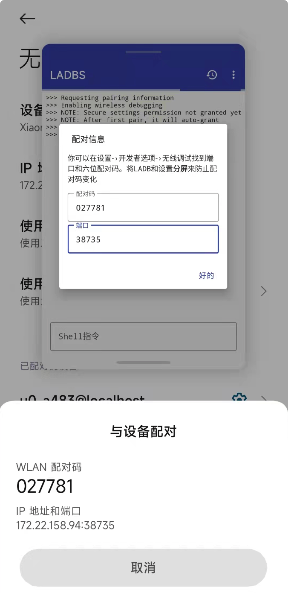
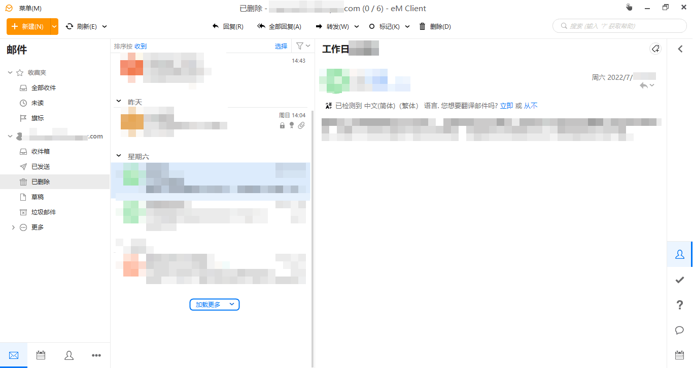
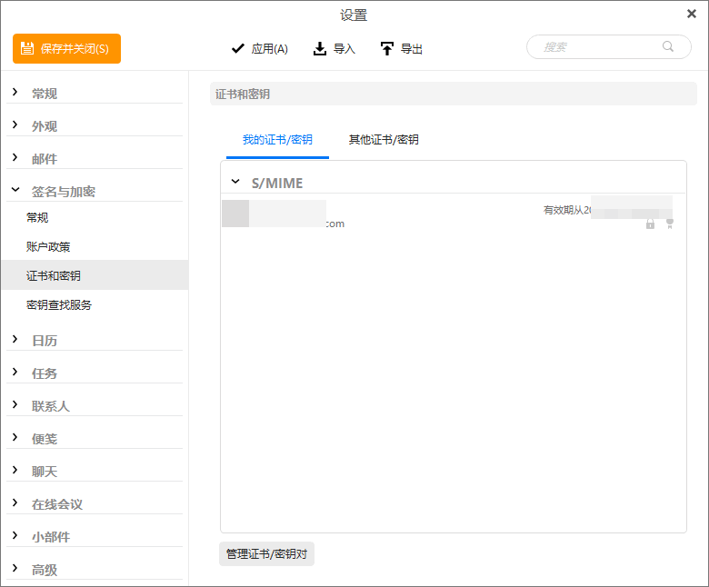

啰里啰唆是一份针对互联网和生活爱好者的数字杂志，旨在发现和分享一切有趣的东西。话题不固定，每期大约十五分钟阅读量，暂定每周四发布。部分内容来自互联网采编，如果为有来源的转载，均会注明转载地址或保留水印。

这是一个关注人文和科技的newsletter。

啰里啰唆周刊第20期：蛤蟆夜哭

# 科技日常

## 1. How to downgrade an app using Android’s hidden rollback feature

通常安卓系统只能对App进行升级而不能降级（系统应用除外，系统应用可以用“移除更新”的方式进行降级），对于常规应用，想要降级就只能卸载重新安装旧版本，但是如何做到保留数据降级呢？

为什么会有降级这种需求呢？很可能是不喜欢新版本的功能或广告，也可能是是新版本有无法规避的bug，也有可能是被意外或非自愿升级了。

https://blog.esper.io/adb-29-how-to-downgrade-rollback-app/

## 2.LADB 无需电脑执行 adb shell 命令

ADB（[Android Debug Bridge](https://developer.android.com/studio/command-line/adb)）是用于调试 Android 设备的命令行工具，对开发者来说，ADB 自然是日常工作的得力助手，而对我们业余玩家来说，它也可以用来调校一些默认情况下接触不到的功能和设置。

在早期的 Android 平台上，我们只能通过 USB 数据线连接电脑和手机，然后再在电脑上使用 ADB 工具（前提是已经在开发者选项中开启了 USB  调试开关）；从 Android 10 开始，Google 眼看大家那可怜的 USB  接口数量和满桌的数据线，无奈之下推出了一个无线调试功能，只需要电脑和手机连接到同一个 Wi-Fi（即在同一局域网下）就可以进行调试。

虽然简化如此，但用户还是需要一台电脑才可以执行 ADB 的相关命令。比如说我想随时随地「冻结」某个应用1，或是通过 Shizuku 使用 App Ops 进行更全面的权限管理，用小黑屋、黑阈、绿色守护等工具优化后台和续航，身边似乎总得准备一台配置了 Android 开发工具或 ADB 环境的电脑，挺麻烦的。

[LADB](https://github.com/tytydraco/LADB)，顾名思义即 Local ADB，运行在本地的 ADB，把手机本身当作电脑，让它自己连接自己。换句话说，手机本身既是 ADB Server 也是 Client，自然也满足在同一局域网的条件。



### 使用方法

1.先连接任意一个 Wi-Fi，就算没有接入互联网都可以；
2.然后打开 LADB，将它调整为小窗模式（或分屏模式）——因为无线调试的配对码等信息每次点击或切换任务都会动态生成，所以才需要小窗模式同时打开本应用和开发者选项；
3.进入开发者选项，开启无线调试，首次使用需要配对设备，将配对码和端口填入本应用即可；

### 限制
1.LADB 只向用户开放了 adb shell 输入，所以在没有 root 的前提下也只能执行 adb shell xxx 这样的命令
2.手机必须支持分屏或小窗模式，因为无线调试的配对码信息每次切换任务都会动态生成，必须让两个App在同一个桌面才能获取到正确的配对码。

下载：https://github.com/ysy950803/LADBS/raw/ladbs/app/release/app-release.apk

## 3. Mastodon长毛象
Mastodon 是开源的社交网络服务器，任何人都可以基于它创建类似推特 / 微博的产品。

作为Twitter的开源替代方案，Mastodon 与常见的社交网络不一样，其定位是去中心化的社交平台——可作为商业平台的
替代方案，避免了单一公司垄断沟通的风险。基于 Mastodon 搭建的站点被称为 “实例(instance)”，这些 “实例” 既相互独立，又彼此关联（因为不同站点的用户可以毫无阻碍地交流）。用户可以选择自己信任的实例，无论选择的是哪个，都可以与其他人进行互动。任何人都可以运行自己的 Mastodon 实例，并无缝地参与到社交网络中。

作为一款开源软件，Mastodon与生俱来的自由气质吸引了众多开发者之外的群体，也让更多人认识了拥有不同兴趣爱好、来自于世界各地的新朋友。

注：中国大陆地区几乎没有可以访问的Mastodon实例，可至 https://instances.social/ 搜索喜欢的实例 ，这个网站列出了Mastodon里所有的实例，可以用语言和兴趣筛选。

## 4.纯纯写作 Android/Windows/Mac/Linux
一个令人感到安心、拥有历史记录、段间距、多重防止文章丢失功能，和许多写作辅助的编辑器。

纯纯写作是一款致力于提供 绝不丢失内容、快速、优秀写作体验 的 App。在源于全世界用户对于纯纯写作的评论中，有许多用户对纯纯写作给予了夸张的赞赏，比如「没用过这么好用的 App」、「这真的是我用过最舒服的写作 App 了」、「很好用，彻底改变我用纸笔写作的习惯」、「忍不住想夸你，这个应用真的好棒，正因为你们这样的开发者在，Android 才会这么精彩」...

它在 Android 上实现了完美的行间距和段间距，令你的写作内容更加赏心悦目，同时，它提供了多重防止丢失保障措施，最大程度上给用户营造安心、随时随地的写作体验。

此外，纯纯写作还支持「快捷输入栏」和「格式化工具」，快捷输入栏能够让用户自定义快捷词语和短语；格式化面板则能够帮助用户快速调整文章格式，比如在中英文之间自动插入空格，或者自动进行缩进调整等等。

在实现了这些显著功能以外，纯纯写作还在流畅体验上下了很多功夫，它拥有 完美的键盘响应逻辑。使用纯纯写作时，你能够往下快速滑动页面或快捷输入栏来收起软键盘；能够点击文章某一行后，动态获得合适的光标焦点定位；能够在收起软键盘时，文章位置保持不动 ... 许多这样的细节内容，当你对比使用其他编辑器项目时，你才会发现纯纯写作做得更加出色、流畅，细致入微。

至于一个编辑器该有的功能，纯纯写作也都没有落下，比如 WebDAV 云备份、段首缩进、生成长图片、悬浮字数统计、撤销、Markdown、更换信纸、指纹加锁、夜间模式、单词联想输入、打字机模式 等等。

---------以上简介来自官网------------

纯纯写作目前有Android和桌面版,但主打安卓版，**桌面版尚属初级**，只提供了双向实时同步编辑当前文章这个功能，甚至它可能对您来说完全不能用。

注意：**此软件基础功能免费，高级功能收费，支持终生买断制。**


下载地址：
酷安市场或其它App商店
作者官网：https://writer.drakeet.com/

## 5.网文作者投诉 WPS 锁定本地文稿

一位网文作者在龙的天空论坛[发帖](https://www.lkong.com/thread/3035107)，称其写的网文文稿被金山办公软件 WPS 锁定。作者自称是 WPS 的会员，WPS 是免费软件但会展示广告且很多功能需要开通会员付费使用。作者称尝试用 WPS  打开本地的稿子结果显示文件含有违禁内容禁止访问，作者称自己的稿子不涉黄不涉政怀疑未发布的稿子被 WPS  内部人员擅自窥探。人工审核不太可能，很有可能都是程序根据关键词自动搜索然后标记。作者在后续评论中称稿子在申述之后[解除了锁定](https://www.lkong.com/thread/3035107?page=11)。

编者评论：建议使用微软自家Office 软件，如果因为费用和版权问题无法使用Microsoft Office的条件下，建议使用开源免费的Libre Office。但是需要注意的是，如果你本机装有Microsoft Office的情况下，安装Libre Office是没问题的，但是卸载Libre Office的时候可能会导致Microsoft Office文件损坏不可用（LibreOffice_7.3.4复现）。

附：金山软件 WPS 官方微博（https://weibo.com/1595145397/LBN7b7P9j）发表声明，“近期一位用户分享的在线文档链接，涉嫌违规，我们依法禁止了他人访问该链接。此事被讹传为#WPS# 删除用户本地文件。为此，我们特地声明：WPS作为一个发展了30多年的办公软件，始终把用户体验和保护用户隐私放在第一位。关于删除用户本地文件的说法纯属误导，我们将保留通过法律途径维护合法利益的权利。”

网文作者也发表声明，“我本地文件可以打开，但是打开版本不是最新保存的，它给我自动同步，检测错文件，原文件没有问题...” 

## 6.唯一一款完美支持MS Exchange的免费邮件客户端
windows下的邮件客户端，不胜枚举，但是除了微软官方的Outlook外，支持MS Exchange的少之又少，这对于很多使用企业邮箱的社畜来说，是必不可少的。

首先排除Foxmail这种打情怀牌的、中国互联网公司开发的软件，Foxmail虽然号称支持MS Exchange，但是根本无法用，因为它万年不更新，缺乏最重要的证书加密功能（这是MS Exchange邮箱必须的一个功能），即S/MIME模块。

其次排除网易邮箱大师，虽然界面和易用性比Foxmail上了好几个档次，也号称支持MS Exchange，但同样不支持S/MIME。

然后排除Thunderbird，虽然Thunderbird本身不支持exchange，可以通过ExQuilla for Exchange这个收费扩展来实现，但是这个扩展对exchange支持不佳，对较新版的exchange邮箱，存在无法配置账号的情况。后来ExQuilla for Exchange扩展的作者又搞了个Owl for Exchange扩展，不过依然不能完美支持MS Exchange，具体表现为Owl需要使用Open login web page的验证方式，这一步会打开一个网页登陆，在这步会遇到莫名其妙的一些问题，比如token无效。

最后排除Windows 10自带的邮件客户端，同样是个残疾。

还有支持exchange的客户端吗？

经历了各种尝试，最终找到了一个，叫eM Client。

支持exchange，30天全功能试用期，30天后可申请一个免费license，可用于配置两个邮箱账号，这对社畜来说足够用了，
更重要的是颜值高！



其加密证书配置界面如下



官网地址：https://www.emclient.com/?lang=en

注意：eM Client的feee license是不支持Commercial use的。

eM Client仅支持windows和Mac系统，估计Linux上是不存在真正完美支持MS Exchange的邮箱客户端了。

还有一款免费软件Claws Mail也曾经支持过MS Exchange，但是仅限于MS Exchange 2007 （https://www.claws-mail.org/faq/index.php/Connecting_to_MS_Exchange）及之前的版本，也就不再详细介绍了。

可以说，eM Client扫除了对Office全家桶去依赖的最后一步，也是最难的一步。唯一的遗憾就是Linux下要想支持MS Exchange，是不可能的了。另外，Android手机上几乎也不存在支持MS Exchange的邮件客户端，所以如果你使用Linux+Android，是无法完美使用MS Exchange邮箱的。

其实，非要在Linux下使用MS Exchange也不是不可能，当然Thunderbird是排除了，但是一些客户端或安卓手机端还是能登陆邮箱并下载到加密邮件的，加密邮件后缀是.7pm，p7m文件是安全电子邮件的标准，这个文件包含了加密的邮件正文和附件


下载.p7m格式的文件，利用你的证书解密即可，解密p7m文件的程序相对来说旧比较容易找了，甚至可以自己写代码或者用openssl实现。

全程不建议在Windows上操作

```bash
#如果加密和签名证书是pfx格式，需要先转成pem格式，这一步需要在linux上执行，win上执行会因为输入密码卡住
[root@localhost tmp]# openssl pkcs12 -in zz.pfx -out file.pem -nodes
Enter Import Password:
MAC verified OK
#使用此证书解密p7m文件，这一步也需要在linux上执行，否则会因换行问题导致打开失败
[root@localhost tmp]# openssl smime -decrypt -inform DER -in smime.p7m -inkey file.pem -out email.eml
[root@localhost tmp]#

```

注：如果第二步是在win上操作的，需要删除所有换行符，然后转换为linux下的换行格式，这样的eml才能被解析。

得到eml文件就比较好办了，很多邮箱客户端都支持打开eml文件。Windows上方法很多，Linux系统下可以用evolution打开.eml文件。


# 读书与影视分享

## 1. 《黄衣之王》The King in yellow
"Ne raillons pas les fous; leur folie dure plus longtemps que la nôtre.... Voila toute la différence."

《黄衣之王》原名《The King in Yellow》，是美国小说家罗伯特·W·钱伯斯所创造的短篇小说集中一本虚构的受诅咒剧本。

这本不明作者的剧本最初于1895年现于法国，出版后立即被法兰西第三共和国政府查禁并销毁。全剧共分两幕，第一幕较温和，而第二幕对读者的冲击甚大。此书也已译成英语，这个版本很容易找到；英译本的内容不那么直接。这个译本是薄薄的黑皮八开本，在封面上印着“黄衣之印”，所有初次见到此符记、并了解此符记意义的人都会丧失理智值。书中记载着一出出暧昧不明、如梦似幻的剧目，无论是读者、演员还是观众都会渐渐地被哈斯塔送来的梦支配。

这本书是一本早期的怪奇小说，启发了克苏鲁神话系列的创造者，美国小说作家霍华德·菲利普·洛夫克拉夫特（Howard Phillips Lovecraft，1890—1937，中文圈内常称爱手艺）。黄衣之王被归类为旧日支配者。

这本书的文学水平不算出众，可以作为了解克苏鲁的一部作品进行阅读。

由于这是一本19世纪末出版的书籍，所以版权开放，已经成为了公版书，可以公开下载。
古登堡下载地址：https://www.gutenberg.org/ebooks/8492

## 2.国漫《镇魂街》真人电影正式启动
《镇魂街》真人电影由曾执导过《缉魂》《目击者之追凶》等影片的导演程伟豪执导。影片继承原著故事基础，以热血少年曹焱兵的羁绊情感为核心，打造一场动人心魄异世奇幻的镇魂之旅。


电影暂时还没有，可以看看原著漫画和改编电视剧。

## 3.心灵捕手-1997年美国电影
心灵捕手》（Good Will Hunting）是一部励志剧情电影。影片由格斯·范·桑特执导，罗宾·威廉姆斯，马特·达蒙等主演。影片讲述了一个名叫威尔（Will Hunting）的麻省理工学院的清洁工的故事。威尔在数学方面有着过人天赋，却是个叛逆的问题少年，在教授蓝勃、心理学家桑恩和朋友查克的帮助下，威尔最终把心灵打开，消除了人际隔阂，并找回了自我和爱情。

豆瓣评分 8.9

剧情：
一个麻省理工学院的数学教授，在他系上的公布栏写下一道他觉得十分困难的题目，希望他那些杰出的学生能解开答案，可是却无人能解。结果一个年轻的清洁工威尔在下课打扫时，发现了这道数学题并轻易的解开这个难题。 

威尔聪明绝顶却叛逆不羁，甚至到处打架滋事，并被少年法庭宣判送进少年观护所。数学教授有心提拔这个性不羁自我的天才，要他定期研究数学和接受心理辅导。数学难题难不倒他，但却对于心理辅导，威尔却特别抗拒，直至遇到一位事业不太成功的心理辅导专家桑恩教授。在桑恩的努力下，两人由最初的对峙转化成互相启发的友谊，从而使威尔打开心扉，走出了孤独的阴影，实现自我。

影评：
1.《心灵捕手》是好莱坞一缕少见的清新空气，这部电影有着智慧、诚恳和正确的目标。

2.有人认为影片《心灵捕手》是肖恩对威尔心灵救赎的一部好电影，当然这个结论并没有错，可是在我看来，这部电影是每个人内心的一面镜子，既有普遍性，又意蕴着深层次的内心世界。尽管我们没有威尔身上的数学天赋，然而在他身上，我们也看到一已悲欢。
# 图论

## 1.Life Is Like A Jenga Game Sometimes


sourece: https://www.instagram.com/li_lili_world/


## 2.机械表原理
一篇关于机械表原理的英文文章，解释了机械表的内部构造和工作原理，全文有多张使用webgl实现的可交互动图，内容详实。


https://ciechanow.ski/mechanical-watch/

此博主的其它几篇文章也写的特别好，图文俱备，内容详尽，比如写GPS这篇，https://ciechanow.ski/gps/

# 谈天说地

## 1.蛤蟆夜哭
艾子浮于海，夜泊岛峙中。
夜闻水下有人哭声，复若人言。
遂听之，其言曰："昨日龙王有令：'一应水族有尾者斩。'吾鼍也，故惧诛而哭。汝蛤蟆无尾，何哭？"
复闻有言曰："吾今幸无尾，但恐更理会蝌蚪时事也。"
苏轼-《艾子杂说》

《艾子杂说》，传宋苏轼撰。共三十九则，据明《顾氏文房小说》本全录。与一般的笑话集或寓言集不同，集中既有寓言，也有幽默。不过，寓言也好，幽默也好，都属“借古讽今”之作。再比如公孙龙辩屈一则：

公孙龙见赵文王，将以夸事眩之。因为王陈大鹏九万里，钓连鳌之说。

文王曰：“南海之鳌吾所未见也，独以吾赵地所有之事报子，寡人之镇阳，有二小儿，曰东里，曰左伯，共戏于渤海之上，须臾有所谓鹏者，群翔于水上，东里遽入海以捕之，一攫而得，渤海之深才及东里之胫，顾何以贮也，于是挽左伯之巾以囊焉，左伯怒，相与斗，久之不已，东里之母乃拽东里回，左伯举太行山掷之，误中东里之母，一目眯焉，母以爪剔出，向西北弹之，故太行中断而所弹之石今为恒山也，子亦见之乎？”

公孙龙逡延丧气，揖而退，弟子曰：“嘻！先生持大说以夸炫人，宜其困也。”

公孙龙，真·知乎大V也！

## 2.为什么硅谷巨头，都想弄一个「微信」出来？ 

「微信非常厉害，什么都能在里面做。」

不久前，马斯克在给推特员工「上课」的时候，再一次表扬了中国的国民级应用，并且暗示 Twitter 也应该朝这个方向发展。

言犹在耳，最新的消息是，马斯克又决定不收购 Twitter 了。

不过，硅谷钢铁侠对「微信」的执念，其实早已经是硅谷巨头的一个「新共识」——必须打造一个像「微信」那样的「超级应用」（Super App）。

从今年 3 月份开始，「超级应用」已经被一众硅谷大佬和媒体捧为热词。不仅言语热切，硅谷公司也早已在行动上，向中国互联网大厂看齐：Facebook 做起了约会、招聘；Snap 在应用里加入了「小程序」；Uber 不满足于外卖，甚至像美团一样，开始一小时「送药」。

一切都表明，硅谷互联网公司正在抛弃过去「专一」的标签，并且开始迅速「无序扩张」。

问题是，中国的「国民应用」已经发展了十多年，为什么硅谷现在才开始山寨自己的「超级应用」？

http://www.geekpark.net/news/305036


# 一句话快讯

1.7月6日晚，诗人余秀华在微博发声，结束与杨槠策半年的恋情。其中提到被对方家暴，“他抽了我上百个耳光。”

2.7月8日10时许，日本前首相安倍晋三在奈良市进行演讲时，被一男子从背后枪杀，18时宣告抢救无效死亡。

3.7 月 9 日，在宣布「搁置」以 440 亿美元收购推特的交易近两个月后，特斯拉 CEO 马斯克宣布寻求终止这项收购。[来源](https://www.wsj.com/articles/musk-says-he-is-terminating-twitter-deal-11657315905?mod=article_inline)

4.7月13日，微博宣布，将对站内利用谐音字、变体字等“错别字”发布、传播不良信息的违规行为开展集中整治。

# 联系方式

新建微信群：如果不能加群，可加编者微信 blueradish拉入群


Tg频道：notonlyshare