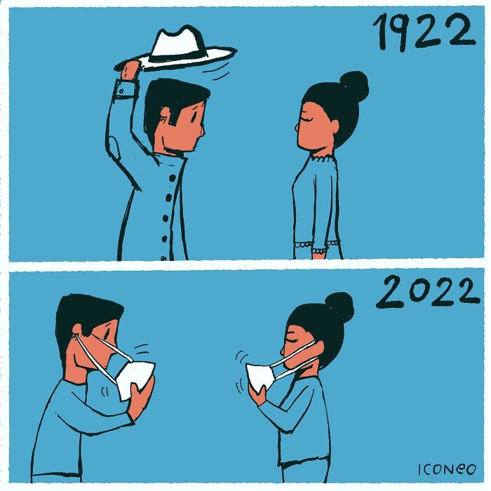
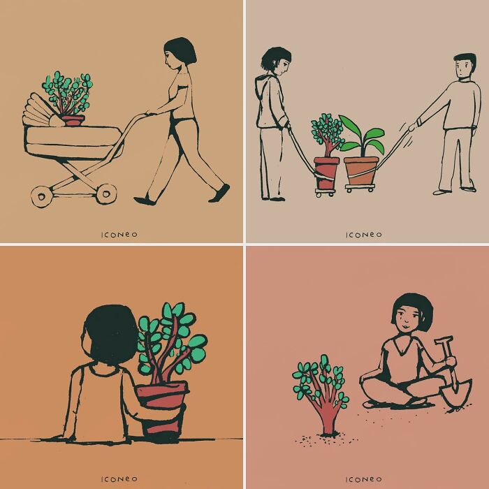
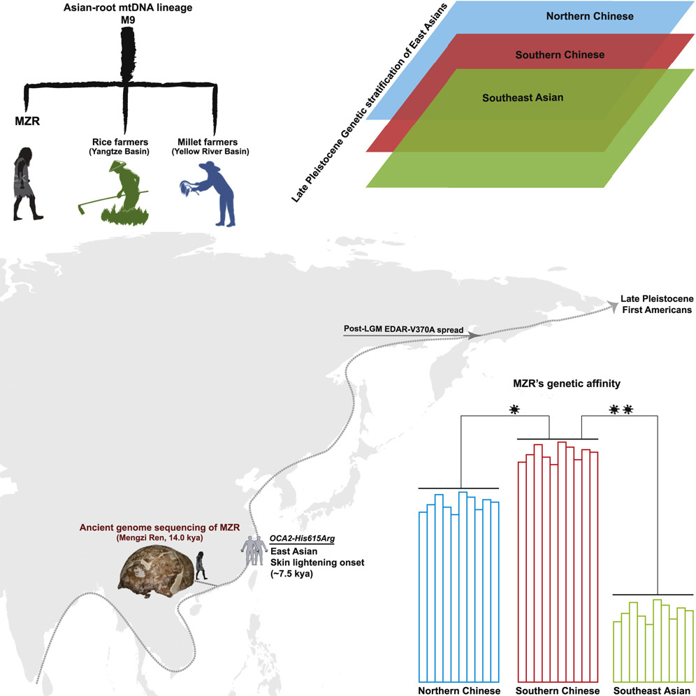

啰里啰唆是一份针对互联网和生活爱好者的数字杂志，旨在发现和分享一切有趣的东西。话题不固定，每期大约十五分钟阅读量，暂定每周四发布。部分内容来自互联网采编，如果为有来源的转载，均会注明转载地址或保留水印。

这是一个关注人文和科技的newsletter。

啰里啰唆周刊第21期：

# 科技日常

## 1. Fossil
轻量级，又功能全备的版本控制系统。

Git虽然好，但缺乏一些功能，比如issue管理，wiki等，这些功能要么通过git的插件或二次开发实现，要么通过github或者gitea这样的git管理平台来实现。


而Fossil，git和github需要的功能，它都具备了。官方定义里，Fossil 是一个集版本控制系统、bug 追踪、维基、论坛以及文档解决方案于一体的系统。免费开源跨平台体积小，不到3M的安装包。

Fossil 源码管理系统是由著名的 SQLite 数据库的作者开发的一个软件，所以Fossil自然也就使用SQLite来存放和管理数据，然而这个软件也并不是Only for SQLite。

虽然使用的SQLite，对于超大型的项目和提交较大二进制文件可能并不适合，但比较适合于几个人的小项目或快速开发，尤其是纯代码类的项目。

https://fossil-scm.org/

## 2. Asar文件查看工具
现在的很多程序，不管有没有跨平台的需求，都使用electron进行开发，造成软件体积大，运行缓慢，到处释放垃圾文件。

这是一个难于改变的趋势。不过electron软件也有一个额外的好处 ，便于修改和二次分发。
在electron软件中，通常都有一个体积很大的asar文件，asar包里面包含了程序猿编写的代码逻辑。默认情况下，这些代码逻辑，是放置在resource/app目录下面的，明文可见，这样的话，也就有了代码加密（asar打包）的需求，也就是说只要我们能操作asar，就能获知electron更多的细节，甚至进行修改。

要提取asar其实很简单，利用npx即可，如下所示
```
 npx  asar extract .\electron.asar ./
```
其实就是调用npm安装了一个工具包。

你甚至还能用7z来压缩和解压缩asar文件，但是需要装一个插件Asar7z，地址：https://www.tc4shell.com/en/7zip/asar/

有了这些工具，想比对这些软件的理解和使用就更深一步了。

## 3.Android 移除大部分 Fuchsia 相关代码
过去几年，Google 投入数以十亿美元计的资金开发名为 Fuchsia 的全新操作系统，但至今为止其成果寥寥无几。Fuchsia 唯一的成果是作为 Nest 设备的底层操作系统使用，Google 曾尝试让 Fuchsia 能运行 Android 应用，为此它在 Android Open Source Project(AOSP) 创建了一个项目 device/google/fuchsia，设计为 Fuchsia 设备构建 Android 运行时。但本周该项目下的所有代码都被删除，取而代之的是一条 TODO 信息，Google 可能会用其它项目取代它。负责该变更的开发者来自 Fuchsia 的 Starnix 项目。Starnix 于 2021 年创建，旨在让 Fuchsia 能原生运行为 Linux 或 Android 构建的应用或库。

ref:https://9to5google.com/2022/07/15/android-removes-fuchsia-code-starnix/

## 4.Unciv - FOSS Civ V for Android+Desktop
开源的，用户友好的 Civilization V的Android游戏。

If you're in the market for high-res graphics, amazing soundtracks, animations etc, I highly recommend Firaxis's Civ-V-like game, "Civilization V".

If you want a small, fast, moddable, FOSS, in-depth 4X that can still run on a potato, you've come to the right place :)


官网：https://github.com/yairm210/Unciv
下载地址：https://f-droid.org/en/packages/com.unciv.app/

如果你需要Windows and Linux，可以到此下载 https://yairm210.itch.io/unciv
当然，由于使用了Java技术，也可以跨平台在Mac OS上运行。

## 5. unvcode 反和谐工具
在unicode中，有很多字，它们看起来长得很像，但是它们的ord不一样。

这个项目看了下源码，貌似是通过字形反查字体文件，找出比较像的字。

https://github.com/RimoChan/unvcode

这是一个python项目，项目名起的虽然有点恶俗，但也不是不能用。如果你不喜欢这个项目或者python语言，也可以用中间码表的形式来实现，中间码表见Js版实现源码 https://unvcode.librian.net/html/main.html

unvcode还有一个安卓app，下载地址：https://f-droid.org/zh_Hans/packages/moe.lz233.unvcode/

## 6.Proton Mail服务在大陆地区被封锁

Proton Mail服务在大陆地区被全面封锁，具体封锁时间不明。

# 读书与影视分享

## 1.张宏杰《中国国民性演变历程》
国民性并非一成不变的，从春秋到唐宋，再到明清，中国人的性格如同瀑布一样，飞流直下，越来越恶化。春秋时代中国人单纯淳朴；唐代人雄健阳光，有尚武精神；进入明清之后，流氓气越来越重。而此流变与专制制度的发展有着密不可分的关系。

通过世界视野中对中国国民性的观察和历史视角下对中国国民性演变过程的剖析，作者认为是落后的制度造成了中国人的劣根性。近代以来，从梁启超、鲁迅到蒋介石、毛**，为改造国民性都付出了艰辛的努力，但收效甚微，其根源在于制度建设与国民性改造之不同步。中国人身上并没有“过滤性病菌”，要改造国民性，必须从制度方面去努力。

豆瓣主页：https://book.douban.com/subject/24371383/

“贫困对人的尊严和人性的堕落所造成的后果的无法衡量的，贫穷使人的行为被现实利益完全控制，不再有想象力，不再有风度，不再有超越性。贫困文化的进一步就是沉沦，就是流氓精神，就是好死不如赖活着，就是为了一口吃的，什么都干得出来。”

“贵族精神和流氓精神斗争的结果，是贵族精神失败了。贵族太好面子，太讲规则，而流氓则更厚黑。在一个恶化的生存环境中，后者当然更有竞争力”

“不过、如果仔细推敲，我们发现，“梭伦式的平等”和“商鞅式的平等”有着本质上的不同。在梭伦的改革方案中，决定一个人社会地位的唯一标准是财产。而追逐财富，是每个经济人的本能。也就是说，梭伦改革是承认和解放人的自然属性的。而商鞅的标准，则是一个人对国家目标或者说对“集体”的贡献度。因此，梭伦的改革是从个人主义出发，是个人本位的。而商鞅的改革是从集体主义出发，是国家本位的。和重农抑商一样，他的出发点不是为了给人民提供平等的政治权利，而是为了把人们的生、晋升途径牢牢控制在国家手中，达到“利出一孔” ”
## 2.电影《浊水漂流》
《浊水漂流》是由李骏硕执导，吴镇宇、谢君豪、李丽珍主演的剧情片，于2021年6月3日在香港上映。此片在大陆地区无法上映，暂无大陆内合法观看途径。

　千言万语，世道如此，约定桥底见。刚出狱的辉哥回到深水埗露宿，遭食环署扫荡清场，家当尽失。他与街友另觅居所，于桥底搭建小木屋相依为命。初出茅庐的社工替街友入禀索偿，但在公义与赔偿来临之前，他们能否挨过寒冬？齐集几代实力演员，改编自真人真事，描述深水埗露宿者如何在狭缝中生存，并为自己争取一丝尊严。 

越南难民辉哥少时亲历战乱，投奔怒海寻觅庇护，晚年流落香港街头。一群中年人各自有不堪回首的过去，被区内居民视为眼中钉，而重建工程箭在弦上，他们不断被驱赶，最后索性围起木板建屋。新旧遗民在木屋内相儒以沫，无分国界种族，成了辉哥一生最自由的日子。冬天时留下一人看管财物。最冷的那夜，辉哥独自在街头，终于等到孩子从外国回来见他 。


或许《浊水漂流》最后那根点燃的烟头是如何把房子给烧起来的我们不得而知，但这样的结局也不让人意外，因为人想死的时候谁也救不了，辉哥最终也明白，即便自己可能会像那些行经车辆选择视而不见一样，仍然不会受到太多关注，但唯有在冲天的熊熊烈火中，他不管怎么看都是一片漆黑的生命，才能有一丝丝得以点亮黑夜的光彩。

附：2022年7月18日第40届香港电影金像奖获奖名单出炉，《怒火·重案》获得包括最佳影片、最佳导演在内4项大奖，《梅艳芳》收获最佳新演员、最佳女配角等5各奖项，85岁谢贤夺金像奖影帝，刘雅瑟成为第九位金像奖内地影后。

最佳影片：《怒火·重案》
最佳导演：陈木胜《怒火·重案》
最佳男主角：谢贤《杀出个黄昏》
最佳女主角：刘雅瑟《智齿》
最佳编剧：欧健儿、岑君茜《智齿》
最佳新演员：王丹妮《梅艳芳》
新晋导演：陈健朗《手卷烟》
最佳摄影：郑兆强《智齿》
最佳男配角：冯皓扬《妈妈的神奇小子》
最佳女配角：廖子妤《梅艳芳》
最佳电影歌曲：时间的初衷《一秒拳王》
最佳原创电影音乐：坂本龙一《第一炉香》
最佳美术执导：麦国强、王慧茵《智齿》
最佳服装造型设计：吴里璐、叶嘉茵《梅艳芳》
最佳剪接：彭正熙《怒火·重案》
最佳动作设计：甄子丹、谷轩昭、谷垣健治、李忠志《怒火·重案》
最佳视觉效果：余国亮、林嘉乐、梁伟民、洪敏诗《梅艳芳》
最佳音响效果：杜笃之、吴书瑶《梅艳芳》
最佳亚洲华语电影：《美国女孩》
# 图论

## 1.Artist Highlights The Problems Of Our Society Through 25 New Illustrations







艺术家主页：https://www.iconeo.de/

## 2.If You’re Feeling Depressed 


艺术家主页：https://www.instagram.com/depression_chicken/


# 谈天说地

## 1.盲苦
有盲子道涸溪，桥上失坠，两手攀楯，兢兢握固，自分失手必堕深渊矣。过者告曰：“毋怖，第放下，即实地也。”盲人不信，握楯长号，久之，力惫，失手坠地。乃自哂曰：“嘻！早知即实地，何久自苦耶！”夫大道甚夷。沉空守寂，执一隅以自矜严者，视此省哉！

明-刘元卿-《应谐录》

## 2. 人民网-慈禧统治时期允许私人办报

中国民间大量办报是在戊戌变法时期，那时候中国形成了办报高潮，一共办了大约100多份报纸，其中有70多家是改良派或改革派的报纸。无论哪一派，都不会按朝廷旨意和指示办报。这个时期的报纸普遍开始议论时政，从甲午战后至戊戌政变，以变法、介绍西学、探索国家富强之道为主题。在国耻刺激下，士人群起议政，报纸成为探讨国家富强之道的公共论坛。《字林沪报》的议政热情高涨，《时务报》是改良变法派的喉舌，1896年创刊于上海，由梁启超主笔。这家报纸系统全面地宣传变法维新的主张和要求。公开谴责政府压制民权，主张报纸的作用就是要监督政府，梁启超名篇《变法通议》在报上连载，风行一时，梁亦因此成为名重一时的政论家。长沙的《湘学报》和《湘报》更是公开抨击封建君主专制。翻译《天演论》，达尔文的《进化论》的翻译者严复更是在报上撰文痛斥封建君主是大盗窃国，坏民之才，散民之力，漓民之德。疾呼国家真正的主人不是皇帝而是人民。统治者害怕国家的真正的主人，必然使之弱而愚，使人民无所知觉，以便自己得以长期窃国。

...

别看清代大臣们称老佛爷慈禧万寿无疆，万岁万岁万万岁，可那时期的报纸，不管这些，慈禧太后七十大寿时，有一位叫林白水的记者，写了一幅对联刊登在《警钟日报》上，公开讥讽慈禧太后穷奢极欲丧权辱国，全国报纸竟然争相转载。对联曰：“今日幸西苑，明日幸颐和，何日再幸圆明园，四百兆骨髓全枯，只剩一人何有幸；五十失琉球，六十失台海，七十又失东三省！五万里版图弥蹙，每逢万寿必无疆！”在皇权专制制度下，在报纸上对慈禧“老佛爷”如此大胆辛辣嘲讽，老佛爷并没有查封报馆，也没有砍林记者的头。

...

http://history.sina.com.cn/bk/jds/2014-05-25/222691726.shtml?from=wap

## 3.蒙自不光有过桥米线，还有印地安人
马鹿洞人，又称为蒙自人，是现今发现的生存年代距今最近而特征与现代人明显不同的史前人类。马鹿洞人身上保存着距今十万年前早期智人的特征，属于晚期智人时代的古人类，是当时人群中的少数民族。


但是，最近中国科学院的研究人员分析了从14000年前的头骨中提取的细胞核和线粒体序列，发现这位女性属于一个古老的人种——被称为马鹿洞人或蒙自人Mengzi ren(因蒙自县得名)，且与已知最早踏足美洲大陆的人种有非常紧密的联系。

仔细观察核DNA，证实Megzi Ren与解剖学现代人类的紧密联系，几乎所有这些都排除了她属于更古老分支的可能性。

中国科学院的考古学家Bing Su说：“DNA技术是非常强大的工具。它非常明确地告诉我们，尽管它们具有异常的形态特征，马鹿洞人是现代人类，而不是更古老的人种。后者如尼安德特人或丹尼索瓦人，


https://www.sciencealert.com/dna-from-a-strange-fossil-in-south-china-reveals-ancient-link-with-the-first-americans
https://www.cell.com/current-biology/fulltext/S0960-9822(22)00928-9
# 一句话快讯

1.2022年7月17日，中国艺人易烊千玺回应了早前引发的考取编制岗位争议，他否认以“走捷径”的方式获取名额，并决定放弃入职中国国家话剧院。

2.7 月 18 日消息，好莱坞科幻巨制《沙丘》续作——《沙丘 2》正式宣布开机，提莫西·查拉梅、赞达亚、丽贝卡·弗格森等演员回归。影片已定于 2023 年 11 月 17 日北美上映。

3.

# 联系方式

使用方法建议或素材提供

邮件：bairadish@gmail.com
频道：notonlyshare