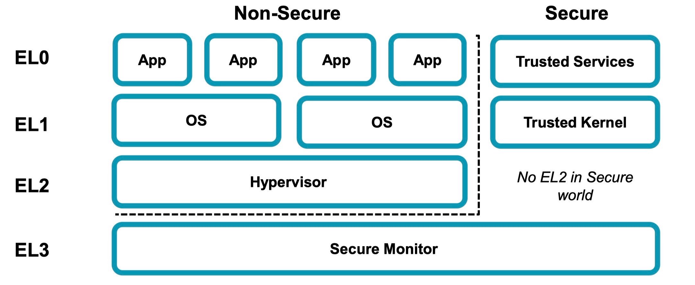
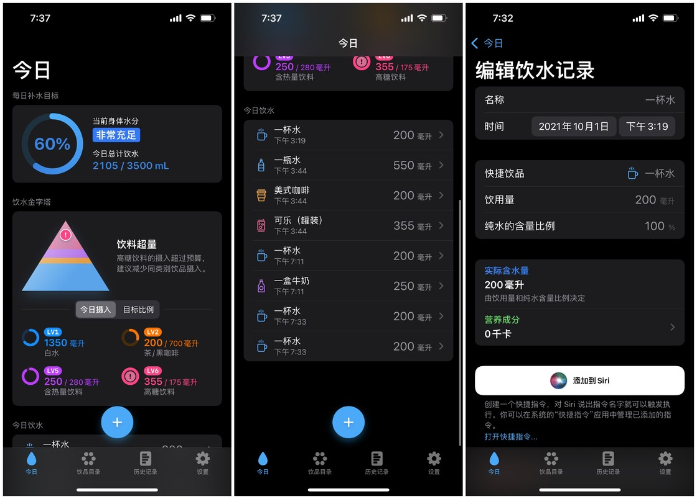
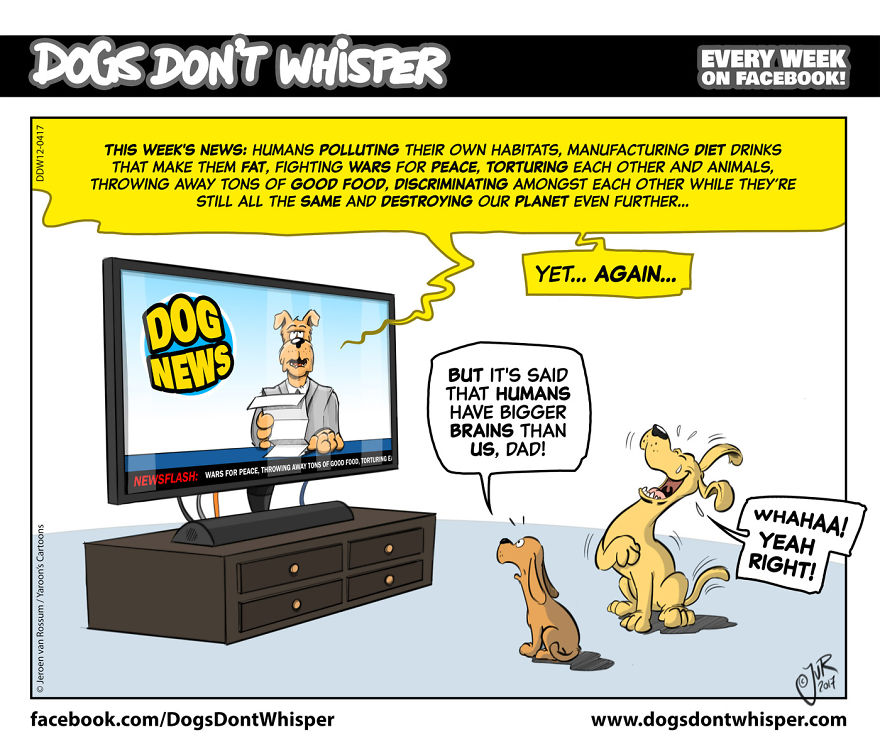
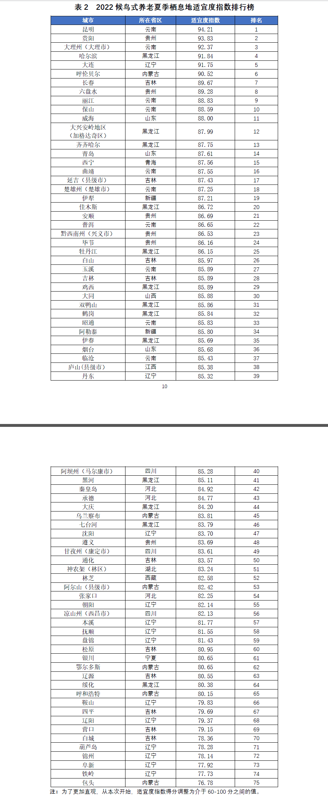
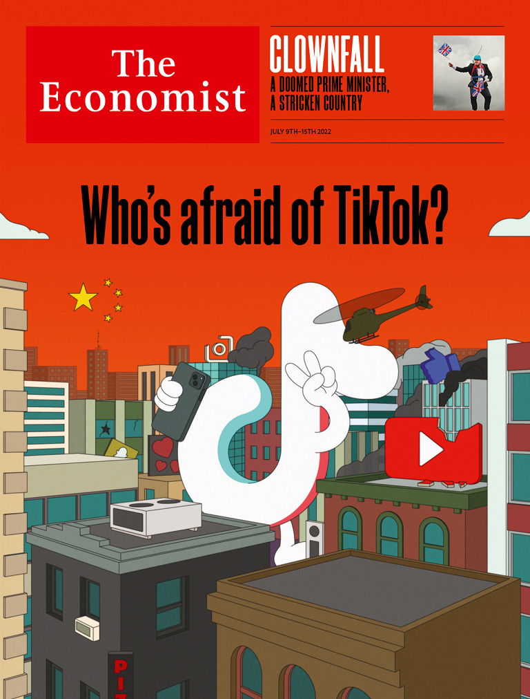

啰里啰唆是一份针对互联网和生活爱好者的数字杂志，旨在发现和分享一切有趣的东西。话题不固定，每期大约十五分钟阅读量，暂定每周四发布。部分内容来自互联网采编，如果为有来源的转载，均会注明转载地址或保留水印。

这是一个关注人文和科技的newsletter。

啰里啰唆周刊第22期：

# 科技日常

## 1. 合同示范文本库

12315官方合同示范文本库收集了市场监管部门制定发布的合同示范文本，供社会公众查阅下载。
当事人可以参照各类合同示范文本订立合同。

https://cont.12315.cn/
## 2. 想要上网体验有保障，如何设置一个更安全的 DNS？
因为传统的 DNS 请求并不会加密，DoH (DNS over HTTPS)、DoT (DNS over TLS) 等 DNS 加密技术近几年开始流行起来，它们不仅能为经常被运营商和第三方劫持 DNS 的朋友提供安全可靠的 DNS 解析结果，还能给极为看重隐私人群补上隐私保护的最后一块短板。

Android 系统这边，Google 在 Android 9.0 中引入了对 DoT 的支持，尚未推送正式版的 Android 13 则在测试 DoH。更值得称道的是，就在最近 Google 又宣布将通过 Mainline 系统更新的方式为 Android 11 及以上系统版本设备推送 DNS-over-HTTP/3 (DoH3) 支持——相比 DoT，DoH3 在 DNS 查询响应时间上的表现更加优异，特定网络环境下的查询速度甚至要比不带任何加密的传统 DNS 查询方式更快，更适合同时追求速度和抗污染能力的用户部署。

Android 9-12 以上的版本，你可以前往无线和网络，选择指定加密 DNS 服务(部分设备上可能被命名为：私人 DNS），输入 DNS over TLS 的地址即可。

对于 Android 9 以下的版本，或者没有指定加密 DNS 服务，你可以前往各大应用市场下载 Intra 应用，进行配置。前往 Intra 的设置，选择 DNS over HTTPS 服务器，输入或者选择 DNS over HTTPS 服务器即可。

对于完全不熟悉终端命令的用户来说，现在想在 macOS 或者 Windows 上得到安全可靠的解析，那么 Firefox 浏览器是目前最佳的选择，前往 Firefox 的设置，常规-网络设置-设置，选择启用基于 HTTPS 的 DNS，这样就打开了 Firefox 上的 DoH 服务了。

如果是Chrome用户，打开你的 Chrome，在地址栏中输入 chrome://flags/#dns-over-https，回车，在右侧下拉箭头中选择 Enable。这样就打开了 Chrome上的 DoH 服务了。

如果你自己有的代码基础，也可以选择 DNScrypt（https://dnscrypt.info/implementations） 作为本地的 DNS 客户端，提供安全可靠的 DNS 解析。

大陆地区推荐使用rubyfish的服务：https://www.rubyfish.cn/

注：大陆地区可用性无法保证.

## 3.何为 root
对于搞机党或者开发人员来说，root 一定是一个不陌生的名词。在 [[当我们谈论解锁 BootLoader 时，我们在谈论什么？](https://weishu.me/2021/07/24/what-is-bootloader-unlock/)] 一文中我们了解到，解锁 Bootloader 实际上能做到的是让手机可以运行第三方的操作系统，而通常来说，我们给手机解锁 Bootloader 就是为了获取 Root 权限。那么，何为 root?，解锁 Bootloader 和 root 到底有什么联系和区别？

对于 CPU 来说，现在的 CPU 芯片一般都有不同的特权等级，这些不同的等级可以执行不同的指令。就拿 AArch64 构架来说，CPU 有四个特权等级，EL0 ~ EL3：



在不考虑 Secure World 的情况下（感兴趣的可以 google  TrustZone)，EL0 就是通常所谓的用户空间，应用程序一般运行在 EL0 级别，操作系统（Linux 内核及驱动）运行在 EL1，EL2 上运行的则是虚拟化相关程序，EL3 则运行管理 Secure World 和 Normal Wrold 的 Secure Monitor。 

从严格意义上来说，既然 root 权限意味着最高权限，这应该代表着它可以在 EL0 ~ EL3 中的任意 level 上执行任意的 CPU 指令。然而，当前的各种 root 实现并非如此，它们一般能在 EL0 上执行任意指令，在某些情况下可以在 EL1  上执行任意指令；更高的特权等级就不行了。因为 root 用户是操作系统的概念，因此 root 权限顶多是操作系统中的最高权限；在我们的类  Unix 系统中，它仅能触及 EL1 也就不算奇怪了。

直接把最高权限暴露给用户并不明智；本着**把权力关进笼子里**的原则，root 用户所拥有的 root 权限逐渐被加上了各种限制；从此以后，root 权限并不能为所欲为了。

https://weishu.me/2021/09/13/what-is-root/

## 4.Hiwater 健康喝饮料-IOS专属应用
担心喝了太多的饮料吗？

保持良好的饮水习惯对健康至关重要。HiWater 可帮你追踪每天的白水和饮料的摄入情况，助你养成更加健康的饮水习惯。HiWater 可记录白水、代糖饮料、可乐、汽水、奶茶、咖啡等常见种类的饮品，并根据“饮水金字塔”模型来控制不同健康级别的饮料摄入量，为你提供针对性的补水建议。



HiWater是通过扫描饮料瓶上的营养标签来录入和采集饮料的营养数据的，比较有创意。类似的App还有个HiCoffee

## 5.B站在b23.tv短链里添加用户追踪标识符，建议用户谨慎分享 
哔哩哔哩自2022年7月16日左右对短链功能进行升级，升级后如果用户通过APP分享内容的话，则他人可以根据分享链接找到具体的分享者。此升级在Android/IOS版本上均生效，不论是国内版或国际版均不可避免。

比如，测试视频的生成的分享短链接为：hxxp://b23.tv/aQO02Mr 该链接通过浏览器正常加载后会转到如下链接：

```bash
hxxp://m.bilibili.com/video/BV1tV411H7fA?mid=21766632&p=1&share_from=ugc&share_medium=iphone&share_plat=ios&share_session_id=F1F97BE0-C42A-4E28-BBB7-BE9DE&share_source=COPY&share_tag=s_i&timestamp=1658747563&unique_k=OCI87Fh&share_times=1
#MID=xxx 就是UID 21766632是分享者B站的UID
#share_from=ugc指的是分享的是用户上传的内容
#share_medium=iphone 指的是用户使用的是iPhone以及后面的iOS平台
#share_session_id 应该是B站生成特定的会话ID，也支持追踪
#timestamp=1658747674 是Unix时间戳，转换后是2022-07-25 19:14:34
```
明明参数名是UID，非要掩耳盗铃写成MID，可见这个改动背后是见不得人的。

建议 **不要分享或者手动删除标识符**
如果你在哔哩哔哩APP里分享建议不要点分享给微信好友、朋友圈、微博之类的，而是选择复制链接再改造。
复制的链接是b23.tv短链，你需要在浏览器里粘贴短链打开，然后只复制BV号和前面的部分删除对应标识符。

类似的事件，国内最大的职场社交（爆料）App 脉脉 也发生过。

# 读书与影视分享

## 1.网易公版影像典藏计划

收录了一些上世纪的老电影，动画片,截止到现在已收录613条影像内容，比如上世纪30年代的老电影，以及一些纪录片、史料等。

https://public.163.com

## 2.电影《不能说的秘密》
《不能说的秘密》是周杰伦导演，杜致朗、周杰伦编剧，周杰伦、桂纶镁、黄秋生、曾恺玹等主演，于2007年7月31日在中国大陆上映。该片是周杰伦自导自演的电影处女作。

豆瓣评分：8.1

影片以周杰伦自己的高中生活为背景，讲述了转学到一所艺术学校的钢琴天才小伦在一间古老的钢琴练习室里见到演奏神秘钢琴乐的路小雨进而展开的一段奇幻爱情故事。

叶湘伦（周杰伦饰）与父亲（黄秋生饰）相依为命，他的父亲是淡江艺术中学的训导主任。叶湘伦自小在他的培养下，拥有非凡的音乐才华。这天是叶湘伦转读淡江艺术中学的第一天，当他跟着同学晴依（曾恺玹饰）参观校园时，突被一段神秘的钢琴乐曲吸引。湘伦随着琴音引领，走进一间旧琴房，发现弹琴的是一位清秀脱俗的女生路小雨（桂纶镁饰），两人虽然没有交谈，但在四目交投之间，双方都泛起微妙的感觉。就这样，美丽的爱情故事开始了。

而当湘伦问及他们第一次见面在百年琴室所听到的神秘乐曲时，小雨却回答：“这是一个不能说的秘密。”之后，二人陷入热恋，但叶湘伦觉得小雨充满了神秘，却无法进一步了解她。某天，叶湘伦约小雨到琴房见面，叶湘伦以为晴依是小雨，跟晴依接吻时被小雨看到，之后叶湘伦就没有再看到小雨。于是，叶湘伦到处寻找小雨，终于发现了那个小雨所说“不能说的秘密”的全部真相


影评：
1.被很多人诟病成“烂片”的电影，多年前初次看时也只是抱着随便看看的心态，加上也只是因喜欢桂纶镁，权当捧场，所以初次观影并无什么心得。没想到这部电影之后竟无意又看了三四遍（都是CCTV6放时看的），入戏之后细细体味，竟每次都哭到结束。真的是一部相当感人的真性情作品，值得反复观看。

2.全篇没提到金钱和性，就这一点就已经吊打如今的九成青春片了。可惜太超前了，若放在现在，估计是另一番景象

## 3.动画电影《千年女优》
《千年女优》是由MADHOUSE出品，今敏执导，小山茉美、饭冢昭三、折笠富美子、庄司美代子等配音的动画电影。影片于2002年9月14日在日本上映。
影片讲述风靡日本的女明星藤原千代子收到立花源也送回的神秘钥匙后回忆过去的故事 。
该片于2001年获加拿大奇幻电影节最佳动画大奖，2002年获第31届安妮奖最佳动画成就奖，也是台北电影节唯一获邀的动画作品 。

风靡日本的女明星藤原千代子，三十年前当红之际，突然从银幕消声匿迹。
三十年后，千代子的影迷费尽千辛万苦，终于在人烟稀少的寂静山庄中，找到了隐居数十年的她，并献上了一把千代子当年不慎遗失的神秘钥匙。
神秘钥匙宛若开启了记忆之门，引领千代子划入回忆的大海，挖掘出一段她从不为人知的爱情故事。那故事像是从千代子辉煌年代的河流溢出，一路流向她无数的电影与映像汇集而成的海洋；也像从遥远的战国时代奔驰而来，再闯进无边无际的时空未来。
而倾听入神的影迷，则随着千代子在记忆的逆流波谷间摆荡，体验她那令人怜惜的悲欢爱情；更在波涛汹涌的时空浪潮中，猛然惊觉到那股横亘千年的浓绵相思，神秘钥匙开启被千代子封锁隐藏了的记忆，解开了她的重要秘密。那正是在无情的时间洪流里，当记忆与爱情最灿烂交会时，所浮现出最真实且永恒的一代巨星千代子。

# 图论

## 1.I’m A Dog Behaviour Therapist
 I know everything about you!

Brain size. If people were more like dogs the world would be a so much better place.


艺术家主页：http://www.facebook.com/DogsDontWhisper

## 2.烂尾楼里的微光


拍摄于西安市灞桥区易合坊（烂尾8年）


拍摄于西安市长安区锦岭公寓（烂尾5年）

https://weibo.com/thomaskksj


## 3.2022中国候鸟式养老夏季栖息地适宜度指数

上海交通大学安泰经济与管理学院2022年7月14日发布



评价体系可参考原文

https://www.iir.sjtu.edu.cn/report/70679.html

# 谈天说地

## 1.TikTok 在壮大，各国政府对它的警惕也在增长 

近日，围绕短视频平台 TikTok 的数据安全争议再起，多名美国议员公开表示担心 TikTok 影响国家安全。7 月 9 日，《经济学人》刊发封面报道《谁在害怕 TikTok？》，回顾 TikTok 发展壮大并在全世界流行的过程，及其在商业竞争和地缘政治的围剿中遭遇的种种困境。十年前，《经济学人》曾刊发封面报道《谁在害怕华为？》。在某种程度上，TikTok 当前困境与曾经的华为相似。

《经济学人》报道提及，TikTok 正受到日趋严厉的监管压力，各国政府出于不同的原因而对 TikTok 保持担忧警惕，「他们担心，用户的数据可能会落入不当的控制之中，或者用户们观看的内容可能被中国所左右。TikTok 在印度已经被禁，那里曾是其最大的市场。而包括美国在内的其他国家正在考虑他们下一步该如何行动。」



中文编译版：http://www.geekpark.net/news/305410
原文：https://godfreytimes.com/2022/07/07/whos-afraid-of-tiktok/

注：编译即编+译，和原文不一定完全对应，只是为了让读者便于理解，加入了更多背景信息等。
## 2.为何良善的人会遭遇不幸
为何良善的人会遭遇不幸？仅答以“上帝以神秘的方式行事”是缺乏说服力的。更智慧的回答是，上帝以此来避免“善有善报、恶有恶报”的信仰功利主义 

https://weibo.com/yesan

## 3.回村三天，二舅治好了我的精神内耗
贫寒的二舅，却有最丰富的内心

“二舅是村里第二快乐的人，第一快乐的人是村里的树先生。你看这个世界上第一快乐的人，是不需要对别人负责的人；第二快乐的人，是从不往后看的人”

https://www.bilibili.com/video/BV1MN4y177PB


# 一句话快讯

1.7月21日，国家互联网信息办公室依据《网络安全法》《数据安全法》《个人信息保护法》《行政处罚法》等法律法规，对滴滴全球股份有限公司处人民币80.26亿元罚款，对滴滴全球股份有限公司董事长兼CEO程维、总裁柳青各处人民币100万元罚款。

2.国际自然与自然资源保护联盟([IUCN](https://www.iucn.org/))发布最新版全球濒危物种红色名录，宣布长江鲟(Acipenser dabryanus)由极危转为[野生灭绝](https://news.sciencenet.cn/htmlnews/2022/7/483111.shtm)，并证实白鲟(Psephurus gladius)灭绝。 白鲟是世界上最大的淡水鱼之一，被列为我国国家一级保护野生动物，曾被 IUCN 列为“极危”物种。2020年 初，中国水产科学研究院首席科学家危起伟团队发表了关于白鲟灭绝的论文。 根据 IUCN 官网消息，全球现存的26种鲟鱼均面临着灭绝风险

3.去年9月，维基媒体基金会移除了封锁了一批维基百科用户，他们多为“中国大陆维基人用户组”成员，该组织“联络人”闫恩铭（用户名: Techyan）曾向BBC表示他们会创立一个“中国版”维基，使用中文维基百科的内容，接受中国政府审查。该网站之前一直在内测状态，任何条目都在登陆墙内，而最近其开放了条目的访问。网址是 www.qiuwenbaike.cn 或者 www.qiuwen.wiki 。从首页条目数量上可以看到创立者从维基百科导入后移除了大约十分之一的条目。

4.7月23日，国家卫生健康委副主任曾益新在国务院联防联控机制新闻发布会上表示，我国现职党和国家领导人都已完成了新冠疫苗接种，而且接种的都是我国国产疫苗。
# 联系方式

使用方法建议或素材提供

邮件：bairadish@gmail.com
频道：notonlyshare