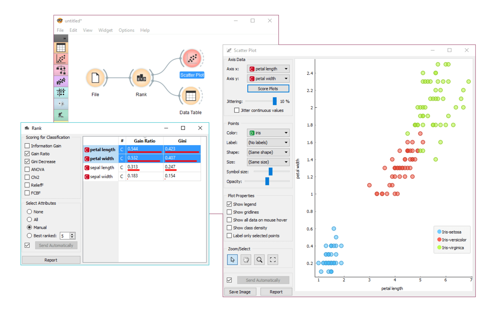
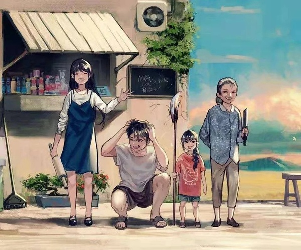
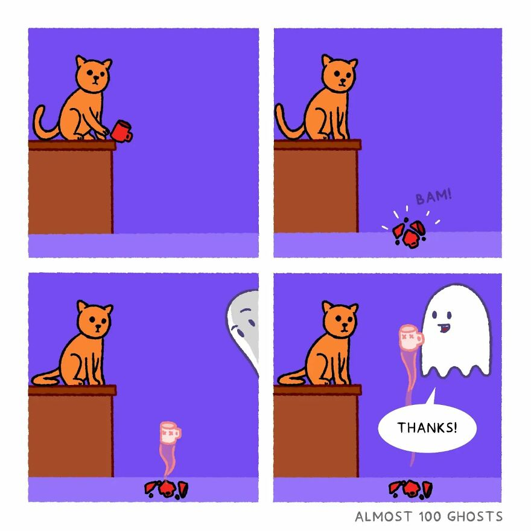
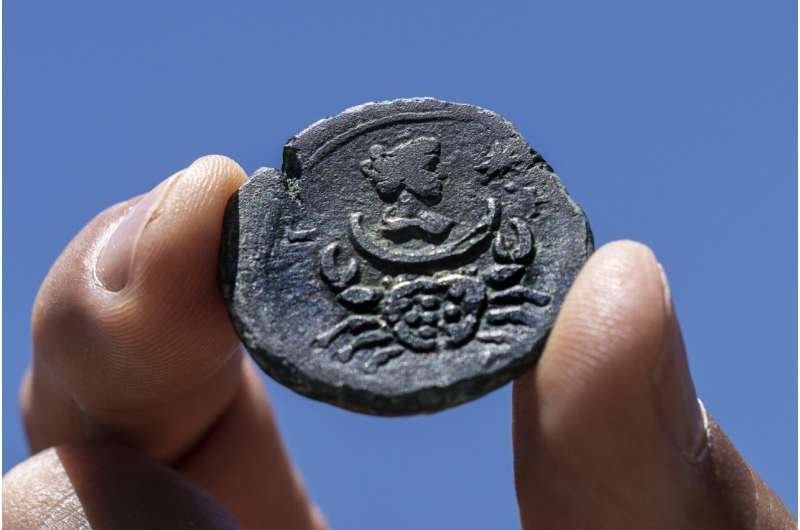
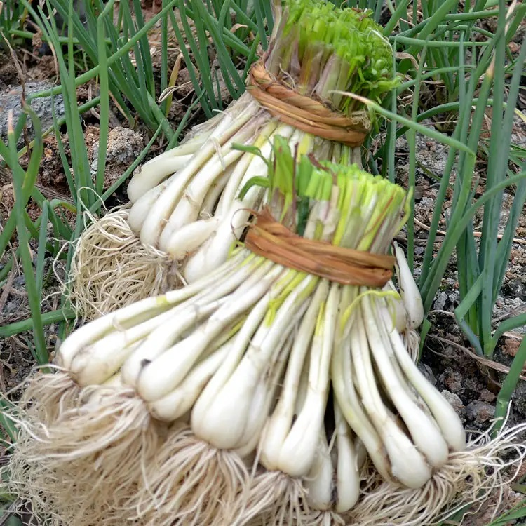
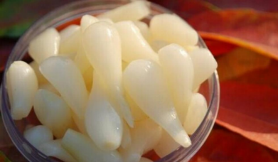

啰里啰唆是一份针对互联网和生活爱好者的数字杂志，旨在发现和分享一切有趣的东西。话题不固定，每期大约十五分钟阅读量，暂定每周四发布。部分内容来自互联网采编，如果为有来源的转载，均会注明转载地址或保留水印。

这是一个关注人文和科技的newsletter。

啰里啰唆周刊第23期：人生处处微生物

# 科技日常

## 1. gb-studio

简单好玩的 Game Boy 游戏制作工具。这是一款可视化游戏构建工具。无需编程基础即可通过拖拽的方式，快速制作出复古风格的 Game Boy 游戏。不仅支持导出游戏 ROM，还可以直接构建成在线游戏。    

使用NodeJS和C开发。                 

https://github.com/chrismaltby/gb-studio

## 2.  wechat-backup

本地备份微信聊天记录的工具。它能够将手机上的微信聊天记录，解密后保存在电脑上，支持查看、搜索、恢复微信聊天记录。

仅限Android手机，不论root与否均可食用，未root依赖手机自带的备份功能。

                     

https://github.com/greycodee/wechat-backup

## 3.orange3-基于python的数据分析工具

互动式数据分析桌面工具。一款面向不会编程人群的数据挖掘和数据可视化工具箱。内置多种图表类型、支持可视化编程，无需写代码即可做出简单、实用的数据分析软件，多用于教学和实验室等场景。

https://github.com/biolab/orange3

还有一个类似的GUI软件叫weka（基于Java），这是10年前大数据兴起的时候第一波软件了（其实其最早是2000年就开发了，只不过我了解大数据的时候是2011年），通常用来做数据挖掘，不知道现在还有没有人用。

## 4.LXGW WenKai-霞鹜文楷字体

2020 年 12 月，日本著名字体厂商 FONTWORKS 在 GitHub 上释出了 [7 款开源日文字体](https://github.com/fontworks-fonts)，分别为 **Train、Klee、Stick、Rock-n-Roll、Reggae、Rampart 和 DotGothic16。** 7 款开源日文字体各有各的特点，而这七款字体中，字符数量最多的是 [Klee](https://github.com/fontworks-fonts/Klee)。

这是一款有着日本教科书体风格的字体，兼有仿宋和楷体的特点，可读性高。一些 DIY 字体爱好者曾先后用仿宋等字体补全这款字体，作为手机系统的美化字体移植在 iOS、Android 等手机系统中，受到很多机友的欢迎。不过这样补全的字体有一些不足之处。 **第一**，原有字体和后补字体之间有着一定的差异，致使一些不同的文字（如 Klee 原有汉字与后补简体字）混排之后会有违和感。 **第二**，由于补字所用的字体为商业版权字体，补全之后不可用于商业用途，还会有侵权的风险。此外，目前现有的开源中文字库里，楷体类寥寥无几，仿宋类则几乎没有。

鉴于此，也为了丰富开源中文字体中的楷体门类，2021 年 1 月 20 日起，本人开始了为 Klee 这一高质量的日文字体补全简繁常用字的尝试。因该字体非常适合正文阅读，命名 **「霞鹜文楷」**。由于 Klee 字体的 Regular 字重太细不太适合阅读，选取原字体 SemiBold 字重作为 Regular 字重。经过长时间的积累，目前已发展成简繁日韩均支持的 3 字重字体家族 ~~（虽然拙劣粗糙了点）~~ 。

有关补字过程的更多信息，请参阅本人 GitHub.io 博客里的文章：[《为 Klee 试制简化字》](https://lxgw.github.io/2021/01/28/Klee-Simpchin/)。

https://github.com/lxgw/LxgwWenKai

## 5.华硕发布 Zenfone 9 小屏旗舰手机
7 月 28 日，华硕发布了 Zenfone 9 小屏旗舰手机，该手机搭载了高通骁龙 8 + Gen1 处理器，采用了 5.9 英寸 120Hz AMOLED 屏幕，重量仅为 169g。影像方面，后置采用了 50MP 索尼 IMX766 主摄和 2MP IMX363 超广角组合，前置采用了 12MP IMX663 左上角打孔镜头。续航方面，内置了 4300mAh 电池，并配有 30W 快充。该机保留了3.5mm耳机口。

本次共提供 8/128GB、8/256GB 和 16/256GB 三种配置方案，拥有午夜黑、月光白、夕阳红、星空蓝四种配色，售价 800 欧元起。

https://www.asus.com/Mobile/Phones/ZenFone/Zenfone-9/

价格有点小贵，大概为了情怀，还是得付出点超额价值。

## 6.TreeSheets
TreeSheets 是一款跨平台，体积小（仅3M）的开源分层电子表格工具，官方的讲法是「自由格式数据整理器」，它可以是电子表格、思维导图器、大纲器、PIM、文本编辑器和小型数据库的替代品。可以用来待办事项清单、日历、项目管理、头脑风暴、组织想法、计划、需求收集、信息展示等。

这个软件界面虽然比较复古，但是功能强大，比较考验动手能力。

官方对它的定义：
- 它就像电子表格一样，马上就能熟悉，但更适合复杂的数据，因为它是分层的。
- 它就像一个思维导图，但更有条理，更紧凑。
- 它就像一个纲要，但不止一个维度。
- 它就像一个文本编辑器，但有结构。

https://strlen.com/treesheets/

## 7.Winamp 5.9 释出首个 RC 版本
曾经的装机音乐播放器 Winamp 在四年开发之后释出了 [Winamp 5.9 RC1 Build 9999](http://forums.winamp.com/showthread.php?t=458120)。Radionomy 公司在 2014 年从 AOL 手中收购 Winamp，之后在 2018 年释出了新版本 Winamp 5.8，该版本主要是改进了兼容性，能在现代操作系统如 Windows 10 上运行。开发者称，对终端用户来说，Winamp 5.9 RC1 可能变化不大，但底层代码库有了巨大变化，从 Visual Studio 2008 升级到了 Visual Studio 2019。在基础工作完成之后他们将可以开始给软件修复和增添功能。用户报告新版本因为 msvcr90.dll 依赖而导致插件不工作。

# 读书与影视分享

## 1. 《喜：一个秦吏和他的世界 》
作者鲁西奇，武汉大学历史学院教授。

以细节讲清秦制，解剖大秦帝国的统治基础刻画庞大国家机器在基层的实际运作在历史中发现人，勾勒卑微个体生命的若干面相 描绘普通人而非秦始皇的世界。

喜，睡虎地十一号秦墓的主人。他生在秦始皇时代，比秦始皇嬴政大三岁，死于始皇帝完成统一中国大业之后四年，比秦始皇早死七年。他和秦始皇是同代人，从人到民，继而成为楚国故地的基层小吏。他有父母兄弟、妻子儿女。他的家族平稳地延续到了汉朝，社会地位和生活条件还略有提高。

作者把零星的材料串连起来，试图拼接出一个作为人的喜，并在遥远、陌生的世界里找到喜。想象自己站在喜的位置上，凭借他的眼睛去看他所处的世界，并描述一个普通人或者说被统治对象直接面对的帝国统治机器：通过户籍制度、军功爵制、邻里的军事化编排，以及军政一体化的行政体系，将每一个黔首都固定在国家控制体系的特定位置上，使之从军应役、立功受爵、交纳租赋、互相伺察，有必要或有利时举报同伍、同里的邻居，但也在战场上生死与共，构成一种生存共同体。

 > 在秦代，所谓“家人”或“室人”，就是指同居在一个房屋之下的人，并无论其成员之间是否都存在血缘或婚姻关系。 同居，是居住在同一个门的房屋里；室人，就是指居住在同一栋房屋里的人，他们有义务共同承担法律责任。 如果隶有罪，则同居者皆须负有连带责任；然若主人有罪，隶却不须负有连带责任。这就是‘户’的含义。”这也说明，隶（以及臣、妾）也包括在“同居”与“一户”“室人”的范畴里，只是其法律责任有所不同

1975年12月，湖北云梦县睡虎地十一号秦墓发掘，墓主即喜，出土一千一百五十五枚秦简，乃喜以墨书篾黄，或也两面书。凡军国大事，郡守文告实录，法律条文及解释，治狱案例，论为吏之道，卜筮日课等，皆录之。

这本书的创意和史料即来自于此。

## 2.《云边有个小卖部》
《云边有个小卖部》是中国当代作家张嘉佳创作的长篇小说，首次出版于2018年7月。

该小说讲述小镇青年刘十三回到表面平静却暗潮涌动的小镇，与外婆和几位发小所发生的一连串悲欢离合的故事。该小说表达了对故乡、对亲情的衷心倾诉。外婆王莺莺的乐观坚韧和无限包容，程霜像一道光一样短暂又永恒，刘十三的奋斗与卑微，云边镇迷人的自然风景、悠然的生活节奏，共同构成了云边故乡的美好意境。

书评：
1.云边镇是作者虚拟的一个场所，构成一切人物活动的背景。云边镇虽为虚构，但并非全是虚空，这里既有打动人心的自然风景，也有真实生活底蕴的社会场景，做到了艺术创作的虚构性与真实性的融合。“满镇开着桔梗，蒲公英飞得比石榴树还高，一直飘进山脚的稻海。”小说开篇就用简洁的语言勾勒出小镇之美：“桔梗”“蒲公英”“石榴树”“稻海”，有花，有草，有树，有庄稼；有绿色，有白色，有红色，有金色。植物多样，颜色丰富。简短几句，眼前就是一幅大自然的美景。“柳树枝条挂得很低，满眼翠绿，不时有自行车骑过去。风和鸟反复经过这条小路，多少年也不停歇，枝叶婆娑摇摆，光影交错，远处的山峰沉默不语。”“一切景语皆情语”，用词简单，妙在留白，传达了程霜理解刘十三自幼孤苦的切肤之痛。

2.从我的全世界路过的你到了云边的小卖部，不知从什么时候起，开始流行一种“张嘉佳式”写作风格，字里行间透露出一种“善良，”也有人标榜是：**张嘉佳式的爱情，带着一种小清新，小瘙痒，又给人感觉似乎想要抓住一些什么，却总是错过。**也可能像他自己所说：**这世界大部分的抒情，都会被认为是无病呻吟。**人如果可以轻易的回到过去，那我还是选择在未来等你。

文字本就是一个作者的内心映照，喜欢没有在一起的缺憾美，爱情经历了生离死别，才会发出，肉体虽亡，爱情永不死的呐喊；生命就是一场孤单的旅程，你以为会陪你很久的人，无声无息之间，已经消失了很久了；一厢情愿自以为是的付出，也许别人根本就看不上；面对工作的挫折，别人并不看好你，只有证明自己，才能让别人闭嘴。有人曾经问过我：你为什么喜欢张嘉佳？我说：因为矫情，无病呻吟本就是常态，文艺青年强说愁。

天很蓝，云很慢，日子很长，小伙伴还没有长大，我还是在这方寸之间挣扎，从未放弃去看看世界的决心。我一直觉得自己或许是个粗鄙的人，大城市里的纸醉金迷让我没有归属感，只有回到小镇上，看到熟悉的一草一木，我仿佛才可以找到我自己。

3.终是过了看张嘉佳的年纪。

# 图论

## 1.ghost

艺术家主页：https://www.instagram.com/almost100ghosts/
作品集：https://www.webtoons.com/en/challenge/almost-100-ghosts/list?title_no=743723

## 2.stop do

艺术家主页：
https://www.instagram.com/scarecrowbar/
https://twitter.com/scarecrowbar

## 3.1850前的巨蟹座青铜币

以色列古物管理局表示，在沿海城市海法Haifa附近做水下调查时，发现了一枚罕见的1850前的十二星座主题青铜硬币。

硬币背面刻有巨蟹座的形象，和月亮女神露娜的徽记。这枚硬币是在公元138年至161年间在位的罗马皇帝安东尼·皮乌斯(Antoninus Pius)统治下的埃及亚历山大港铸造的。它是13枚黄道十二星座系列币中的一枚。

关于黄道十二星座的历史。

早在公元前14世纪，拉美西斯二世的神庙里的占星术纪念碑就收入了最早的两个黄道星座。

巴比伦的青铜时代(巴比伦第一王朝)，当时就有名为“双胞胎”的双子座和叫“龙虾”的巨蟹座。

大约在公元前5世纪末，巴比伦天文学家将黄道划分出12个相等的区段，代表12个月份，每个月30天。每个星座都包含30°的天经，因此创建了第一个已知的天体坐标系。根据现代天体物理学的计算，黄道带是在公元前409年到 398年之间，在波斯统治期间引入的，可能是在公元前401年之后的几年内。

大约宋朝的时候，十二星座传入中国。

https://phys.org/news/2022-07-coin-zodiac-israel-coast.html

# 谈天说地

## 1.藠头

大概率北方人和中原人可能不认识这种食物，也有很多新生代南方人会把它跟大蒜误认了。

藠（jiào）头是百合科葱属多年生宿根性草本植物，小根蒜或薤的地下干燥鳞茎，是很受欢迎的一种蔬菜类植物。

藠头又名茭头、小蒜、薤白头、野韭、薤（xiè）根、大头菜子、野蒜、小独蒜、野葱等。

藠头原产于中国，但最常见于中国的长江流域和以南各省区，中国的邻国，日本、越南、老挝、柬埔寨和美国也有栽培。中国南方人民爱种且爱食薤，但北方人极少食薤。

**正宗剁椒，就是红辣椒+藠头，形成了又酸又辣又甜的独特味道。咸豆腐脑里，藠头也是必不可少的一道调料**。

藠头通常喜欢成片地簇拥在坡地河畔，或是成丛地散落在田间地头，成为在春风中摇曳的那一抹特别的绿意。实际上除了野蒜，一些地方所说的野葱指的也是它。

这是它的花：

这是它的植株：

做成菜的藠头长这样

成熟的藠头个大肥厚，洁白晶莹，辛香嫩糯，含糖、蛋白质、钙、磷、铁、胡萝卜素、维生素C等多种营养物质，是烹调佐料和佐餐佳品。

## 2.一钱落职
> 南昌某，父为国子助教，随任在京。偶过延寿字街，见书肆中一少年数钱买《吕氏春秋》，适堕一钱于地。某暗以足践之，俟其去而俯拾焉。旁坐一翁，凝视良久，怒起，叩某姓氏，冷笑而去。
>
> 后某以上舍生入誊录馆，谒选，得江苏常熟县尉。束装赴任，投刺谒上台。时潜庵汤公，巡抚江苏，十谒不得一见。巡捕传汤公命，令某不必赴任，名已挂弹章矣。问所劾何事？曰：“贪。”某自念尚未履任，何得有赃款？必有舛错。急欲面陈。巡捕入禀，复传汤公命曰：“汝不记昔年书肆中事耶？为秀才时，尚且一钱如命；今侥幸作地方官，能不探囊胠箧，为纱帽下之劫贼乎？请即解组去。”
>
> 某始悟日前叩姓氏者，即潜庵汤公，遂惭愧罢官而去。
>

有人可能小时候就听过或者在书上看到过这个故事，这个故事出自清朝沈起凤的《谐铎》一书“卷三-一钱落职”。书名《谐铎》意思就是寓劝诫于嬉笑言谈之中。一百二十篇文言短作以诙谐幽默、寓庄于谐、寓教于乐、讽谏劝善的方式描绘了人间百态，把社会的腐败、人世的险恶展现地淋漓尽致。

## 3.人生处处微生物

老生常谈的一个话题，很多城市/农村新阶层，认为“咸菜和有发酵的食品是很不卫生的，里面含了太多微生物和细菌”，只有新鲜蔬菜和水果才是健康的。

但是，Ta们又往往接受不了清淡的饮食，做菜时喜欢加点酱油、食醋、或者味精等等。其实，酱油、食醋、味精等都是玉米，大豆等粮食在微生物发酵下的产物。哪怕是馒头，在制作过程中也需要酵母菌的参与，除非你用死面（未经发酵的面为死面）。很多面食地区至今还流传着手工培养天然酵母而不是使用市售袋装酵母菌或小苏打的流程。手工培养天然酵母也是高档面包必不可少的一道流程。

我一个“南方人”怎么就懂酵母制作了，实际上，跟一般人常识相悖的，小麦并不是北方和中原特产，西南一带传统上也产小麦，只是因为物产多，所以导致面食不占主流。四川和云南的小麦、玉米等被认为是北方主产的粮食，实际上产量超过了北方一些省份。小的时候，我一个别人眼中的南方人，吃面食吃到吐。

除了各种调味品和面食，所有酒类都是微生物参与的产物，各种野生菌则是真菌的产物，小清新喜欢吃的酸奶也是充满了乳酸菌。

微生物，是人类饮食中最大的鲜味来源。因纽特人吃腌海雀（将生海雀塞进生海豹肚子里埋野外发酵半年制成），也是为了通过发酵获取维生素。

说起微生物，顺便提下臭豆腐。可能很多人在影视或旅游中，能接触到的臭豆腐就是老北京臭豆腐和长沙臭豆腐了。对于这这两者，我都不是很喜欢，主要是闻起来太臭。我更喜欢吃西南（云贵桂）一带的毛豆腐，毛豆腐其实就是低级别的臭豆腐，但是没有臭豆腐发酵的厉害，所以闻起来不臭，吃起来当然也不臭，很香。烧烤和油炸后更是如此。市场上能看到的豆腐乳通常也是用的毛豆腐制作而成。毫无疑问，这个香味也是拜微生物所赐。

不可否认的是，咸菜也可能存在卫生问题的，比如食用和保管不当（过分暴露于空气中），会导致被其它杂菌污染而发霉。手工培养酵母也是，技艺不熟也会引入杂菌。亚硝酸盐也是一个槽点，但抛开剂量谈毒性是没有道理的。

中国十大优质苹果产地，唯一一个在长江以南的就是云南昭通苹果，因为光照充足温差大，糖分积累足，十大产地之一的新疆阿克苏苹果也是高原地区，吃起来要比中原一带的更甜。大米同样如此，东北和西南的大米，虽然隔着几千公里，一个是低温，一个是高海拔，都是慢熟产物，口感也更好。

同理，不同的地区，微生物菌群也不一样，制作出来的食物也会有微妙的口感。茅台镇的茅台就是跟其它地方的酒口感不一样，这并非玄学，当然，茅台的炒作导致溢价太多是另一个问题了。

像咸菜这种充满微生物的食品是在正常情况下没必要放在冰箱里的，因为放冰箱的本意是抑制微生物生长，而咸菜吃的就是微生物。但是，中原地区除外，比如河南，陕西一带。中原一带的饮食通常很少涉及咸菜，本来常温下（30℃以内）可以保存很长时间（约半年）的咸菜，在燥热和高温（40℃）的中原地区，保存时间就变短了。

最后解释一个知识点，也可能是很多人的疑点，空气中那么多微生物，难道手工制作酵母就不会引入其它杂菌吗？答案是，会。天然酵母就存在于空气中，但空气中微生物很多，用来做面包的微生物只是其中的一种，在发酵初期，多种微生物会一起繁殖，那个时候味道会很复杂，经过刻意识的喂养，到了后期，酵母菌占优，打败其它微生物。如果你闻到了比较明显的酸臭的异味或者看到霉菌，大概率是培养坏了，引入太多杂物。经验不足的话，不建议手工培养酵母。

# 一句话快讯

1.沙特王储 Mohammed bin Salman 表示该国计划最早在 2024 年对超级城市项目 Neom 启动 IPO。Neom 意思是新未来城市，沙特计划斥资 5000 亿美元，沙特主权财富基金将提供所需的一半资金，另一半则从其它国家的主权财富基金、国内外私人投资者以及 IPO 中筹集。王储雄心勃勃的想要建成自己的金字塔，而 Neom 的设计极具乌托邦或未来色彩。Neom 位于沙特西北部的 Tabuk，总面积 26500 平方公里，其核心组成部分是名叫 The Line 的线条城市（CG 动画），高 500 米，长 170 公里，能容纳 900 万居民，城市被封闭在两座距离约 200 米的平行高墙之内，表面覆盖镜子。

2.7月28日，有传闻称每日优鲜将「解散」。每日优鲜 App 已经无法下单，虽然仍有商品展示、可加入购物车，但是在结账页面显示「本单购买的商品在当前地址下无货」。

3.国家集成电路产业投资基金(大基金)前后两任负责人被调查：7 月 17 日国家芯片大基金管理公司原总裁路军涉嫌严重违纪违法，目前已正在接受调查；7 月 28 日大基金总裁丁文武被有关部门调查。大基金是为促进集成电路产业发展于 2014 年 9 月设立的，由国开金融、中国烟草、亦庄国投、中国移动、上海国盛、中国电科、紫光通信、华芯投资等企业于发起，基金规模约为 1200 亿元。基金重点投资集成电路芯片制造业，兼顾芯片设计、封装测试、设备和材料等产业，实施市场化运作、专业化管理。

4.7月28日，有腾讯员工在脉脉同事圈爆料称，腾讯云数据库负责人林晓斌借钱一亿元用于炒股。

# 联系方式

使用方法建议或素材提供

邮件：bairadish@gmail.com
频道：notonlyshare