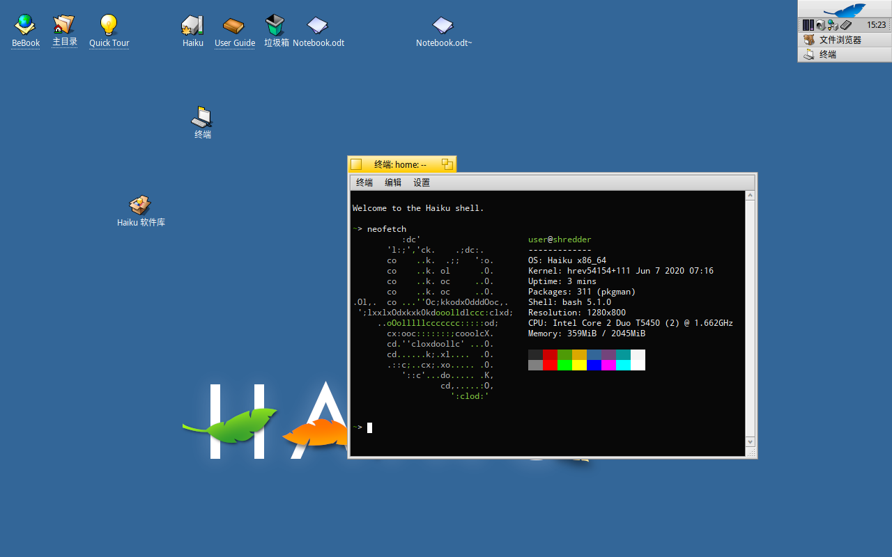
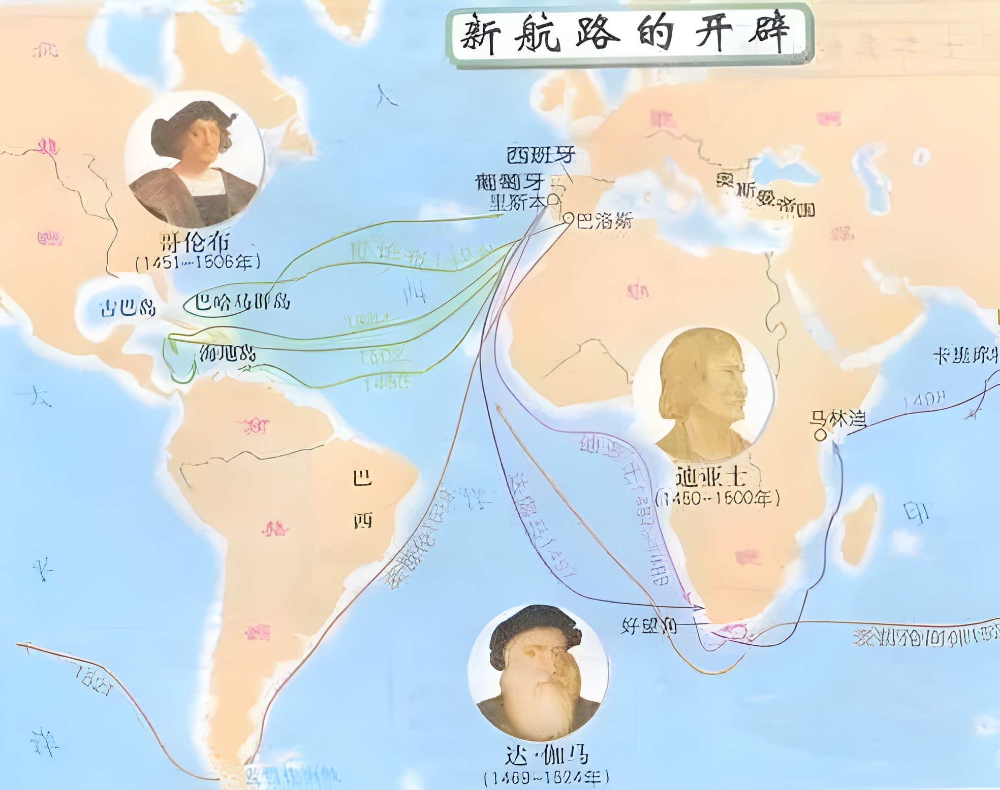
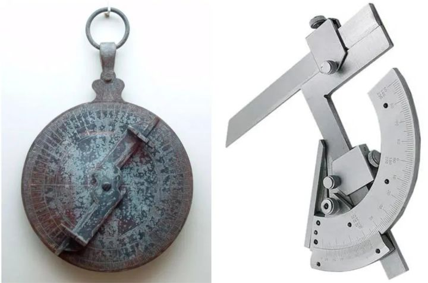
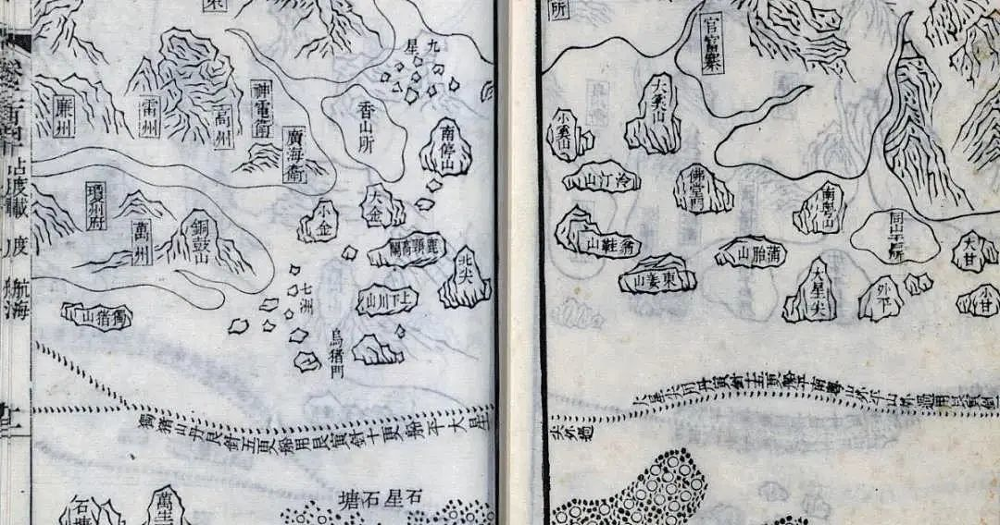
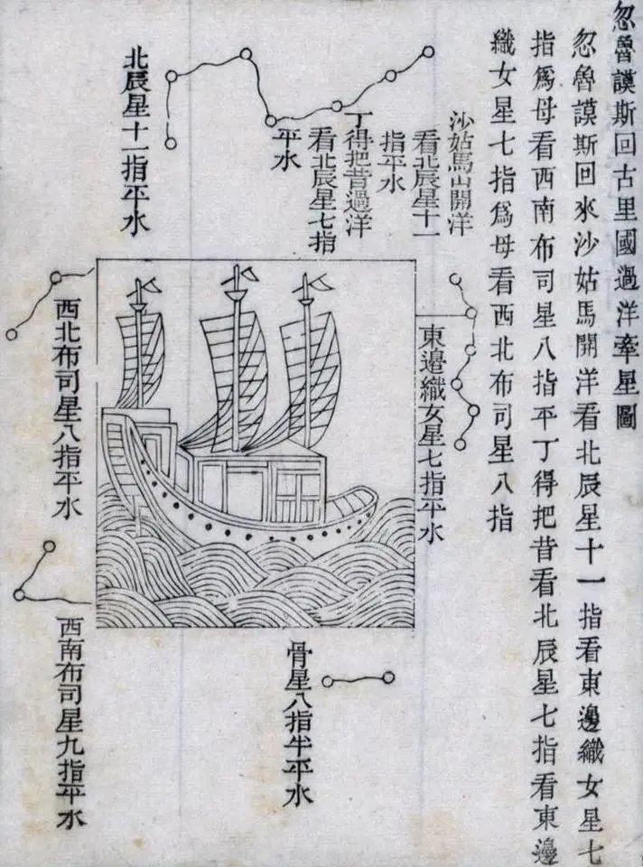
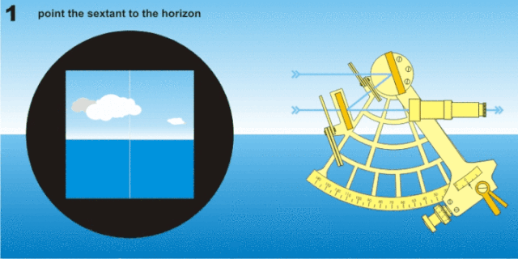

啰里啰唆是一份针对互联网和生活爱好者的数字杂志，旨在发现和分享一切有趣的东西。话题不固定，每期大约十五分钟阅读量，暂定每周四发布。部分内容来自互联网采编，如果为有来源的转载，均会注明转载地址或保留水印。

这是一个关注人文和科技的newsletter。

啰里啰唆周刊第24期：大比武

# 科技日常

## 1. 记账软件从入门到抛弃

一个好的记账软件应该支持哪些特性呢？我觉得是

1.无（频繁）广告，无权限勒索，不偷数据，不偷内存。
2.支持离线使用，也支持账号系统登陆
3.可选支持云同步，接受一定的费用，但会员收费要合理。
4.必须支持数据导入导出
5.支持多账本
6.易用，跨平台，支持Android/IOS

这几个条件，足以排除所有国内互联网大厂的产品了。其实对于支持离线和云同步的记账应用来说，完全不需要迷信国内互联网大厂，所以首先排除挖财和随手记。另外，对于需要自己部署，没有app端的记账应用，则违背了易用的准则，而记账对易用快捷的需求还是比较高的。基于此，我觉得以下几款App还是值得一试的

1.钱迹 4分
特性：界面简洁无广告，支持数据导入导出（需登陆后才能使用），收费开通多账本。
官网：https://www.qianjiapp.com/

2.薄荷记账 5分
特性：无广告，支持数据导入导出，支持云同步，支持离线使用，有收费功能。
官网：无。可在各大应用市场下载

3.开支助手 5分
特性：无广告，支持数据导入导出，支持离线使用，收费开通云同步，开源软件，仅支持Android。
官网：https://www.myexpenses.mobi

4.MoneyWallet  5分
特性：无广告，支持数据导入导出，支持离线使用，免费开源软件，仅支持Android。
官网：https://github.com/AndreAle94/moneywallet

我保持了十几年的记账习惯，从读书时的纸笔、excel到后面的挖财，随手记，钱迹等，记录了上百万的收支，然后成家了，就再也没条件记账了（因为多了个人，也就多了很多不可控开支，没法精准记账，失去了记账的意义）。。。

如果是单身的话或者家庭双方有这个意识，我觉得记账是个不错的习惯。但，如果记账对你来说只是一种形式（即不能开源，也无法节流），或者一旦你觉得厌烦了，那就可以抛弃记账软件了。因为记账的本质不是记，是为了通过数据定制开源节流计划，顺便做下日志。

## 2. Haiku：现代化的旧 BeOS

Haiku 是 BeOS 的开源实现，最新版本是2021年7月发布的R1/beta3版本。Haiku不是Linux，也不是基于Linux内核的系统，它就是一个基于BeOS独立内核的操作系统。

BeOS是由Be公司1991年开发的一种多媒体操作系统，曾经这是一款差点被苹果收购的操作系统，奈何最终苹果没有选择BeOS。2001年第四季度被Palm公司以等价于1100万美元的股票收购后，BeOS终止开发。PalmOS 6 在 BeOS 的基础上建立起来，不过没有一台 Palm 设备使用这个系统。

当年的BeOS再被Palm公司收购后停止了开发。随后有了兼容BeOS的OpenBeOS，2004年改名为Haiku。

现在的Haiku支持中文，软件不多，但都很有用。像是Minetest 这种游戏外，还有Telegram、SuperTuxKart（游戏）、Calligra（KDE 的 Office 套件）、LibreOffice、Blender、ImageMagick等都能直接从软件源里安装。预装了 WebPositive 浏览器，可以上网，但是WIFI的话，新电脑估计大多不行。

当作主力操作系统肯定是不行了，但是把玩一下，回味下90年代的操作系统，也蛮有意思的。

官网主页：https://www.haiku-os.org/

参考：https://bbs.letitfly.me/d/1159

## 3.超越亚马逊，SHEIN 二季度美国下载量创新高
Sensor Tower 数据显示，2022 年第二季度，在线购物平台 Shein 的美国移动安装量超过亚马逊。Shein 的下载量约为 680 万次，环比增长 13%；亚马逊下载量则为 630 万次，下降 7%。

报告指出，尽管亚马逊 App 在美国的普及速度可能有所放缓，但其 2022 年第二季度的平均月活跃用户（MAU）是 Shein 的三倍。不过，Shein 正在增加美国用户并在逐年缩小差距。2020 年第二季度，亚马逊的月活跃用户数接近 Shein 的 9 倍，这一比例在 2021 年第二季度下降至四倍。

数据显示，过去三年，Shein 实现了持续的季度环比增长。与 2019 年第二季度相比，Shein 上个季度在美国的平均活跃安装量增长了 436%。

## 4.《独行月球》顶级特效：金刚鼠 5000 万根毛让人头秃
上映第 10 天，沈腾、马丽领衔主演的开心麻花科幻喜剧电影《独行月球》，票房超过 20 亿元。电影里金刚鼠的角色获得了无数观众的喜爱。为了让「金刚鼠」更逼真，整个视效团队花费了大量心血，影片中呈现的金刚鼠，是以演员郝瀚的动捕表演为基础，然后由动画师参考其表演及节奏，一帧一帧调出来的。

金刚鼠是国内制作难度最高的数字生物形象，做袋鼠的毛发，1 帧最长需要渲染 27 个小时，观众看到的一秒最长需要渲染 648 小时。

一个人的头发大概是 10 万根，但是「金刚鼠」的毛发多达 5000 万根，是人类发量的至少 500 倍，毛发的走向会根据肌肉纹理在不同部位呈现不同的变化，与此同时，还有很多剧情细节需要通过特效展示，比如袋鼠嘴角吃剩的残渣、被独孤月踹完后留下的脚印、打斗时掉落的飘在空中的毛发等，都需要做到足够真实。
# 读书与影视分享

## 1. 外婆的道歉信
*上一期推荐过张嘉佳的《云边有个小卖部》，有人说它是中国版的《外婆的道歉信》，但又稍欠火候，那这期就推一下这本书吧。*

2016年瑞典年度作家、 美国亚马逊作家排名No.1

七岁的爱莎有个古怪又疯狂的外婆，会埋伏在雪堆里吓唬邻居，半夜从医院溜出来带着爱莎翻进动物园，在阳台上用彩弹枪射击推销员，基本上想干什么就干什么。这个四处惹麻烦的外婆却是爱莎唯一的朋友，也是她心中的超级英雄。不管什么情况下，外婆都会站在爱莎这一边，为了她去跟全世界拼命。

就算是超级英雄，也有失去超能力的一天。外婆不幸得了癌症去世，留给爱莎一项艰巨的任务——将外婆的道歉信送给她得罪过的九个邻居。收信人包括一只爱吃糖果的大狗，一个总在不停洗手的怪物，一个管东管西的烦人精和一个酗酒的心理医生。这一趟送信之旅让爱莎渐渐发现：外婆和邻居们的故事，比她听过的所有童话都更加精彩。

这是一个关于爱、原谅和守护的故事，在合上书之后很久都难以忘记。

书评：
1.很有野心的作品。人该如何选择自己的生活，又该如何面对他人，最重要的是如何去爱，去给你所爱的最好的东西，虽然外婆不靠谱，但是她的答案，几近完美。

2.看了那么多刻薄的评价，我觉得以后看豆瓣评价都快变成是一件浪费时间的事情了。好了我们说回正题，我觉得这是一本适合父母看的小书，富有想象力，告诉大人不用去试图理解你的孩子，他们没有你想的幼稚。最后的确不是所有人都有幽默感，必须原谅蠢人……

3.读了1/3觉得不太对劲，我已经读不进故事了。情节拖沓

国外的小说，不是剧情很激烈（科幻，战争）的话，叙述风格通常会有很多心理描写和场景、旁白，读起来确实费劲。

## 2.霹雳游侠-或许是80后的第一部美剧
《霹雳游侠》（Knight Rider）是由美国格伦·A·拉森出品公司、MCA电视公司（现环球电视公司）出品的科幻电视连续剧。自1982年9月26日在美国NBC电视台首播，全剧共4季90集。

故事讲述了Michael Knight驾驶着具有高度人工智能的跑车KITT，在罪犯横行于法律之上的世界里支持那些无辜及无助的人。

这算不上一部很出色的美剧，但这可能是很多80/90后印象中看的第一部美剧了，美国特工驾驶一辆会说话，能下水甚至能发射武器的高度智能，全方位防护，除了不会飞几乎是万能的汽车。小的时候，全家人一起把这部电视剧当爽剧看，至今想起来记忆尤甚。

这部美剧在08年似乎还有新作《霹雳游侠2008》，不过我没看过，可能很多人的记忆还停留在82年的老剧。

## 3.分手的决心
《分手的决心》是由朴赞郁执导的电影，由汤唯、朴海日、高庚杓、李贞贤 、朴埇佑、郑伊书主演 。该片讲述刑警海俊在山上调查死亡事件的过程中，与死者的妻子徐婡见面后发生的一系列故事 

在山区调查一起谋杀案的海俊（朴海日 饰）遇到了死者的妻子瑞莱（汤唯 饰）。“我担心他没有从山上回来，以为他最终可能会死。”瑞莱对丈夫的死没有表现出任何激动的迹象，并且她的行为与悲伤的亲戚大相径庭，警方认为她就是嫌疑人。当海俊审问和监视瑞莱时，他意识到他正在逐渐对她产生兴 趣。与此同时，尽管被指控犯罪，但瑞莱开始对海俊采取大胆的行动。一个隐瞒真相的嫌疑人。同时想要怀疑嫌疑人的侦探。他们有了分手的决定。

影评：
1.看完几个国产片再看《分手的决心》，只觉得跟人家的差距是越来越远了。不只是题材受限的问题，连对视听语言的追求也放弃了。 

2.它是一部承载黑色浪漫的悲剧爱情电影，观感其实挺复杂，以至于不知道该如何定义这部电影，这或许就是朴赞郁的魅力所在，他的艺术本身其实并没有那么大的艺术能量，但是他让电影中故事和人物与众不同的方式拓宽了我们认知故事和人物的可能。
拆解来看，我觉得这个剧本写的有些过分复杂，这或许因为女性编剧的原因，而导演去表达这个剧本的过程中其实也是在上个世纪（黑色、悬疑）电影艺术的基础上增添了朴赞郁自己的导演艺术风格，而这种风格某种程度上也是他一个新鲜的尝试，所以电影的整体基调才会融合神秘、俏皮、浪漫、悬疑又悲剧的色彩，正是它们难以融合的元素融合在一起反而让电影难以归类。

# 图论

## 1.Yes, But

艺术家主页： [Instagram](https://www.instagram.com/_yes_but/) | [patreon.com](https://www.patreon.com/gudim) | [gudim.threadless.com](https://gudim.threadless.com/)

## 2.time to rest

艺术家主页：[Instagram](https://www.instagram.com/sayheysimon/) | [twitter.com](https://twitter.com/sayheysimon)

# 谈天说地

## 1.古人怎么航海
随着科学技术的不断进步，人们在海上航行时已经拥有了众多导助航设备。然而，在没有现代导助航设备，甚至没有准确海图的古代，古人靠什么在茫茫大海上远航呢？

**1.沿岸航行+地文导航**
一直到中世纪鼎盛时期，地中海的商船大多还是沿岸航行。来自西北欧的商船在通过直布罗陀海峡后，不会向东直航，而是沿着西班牙、法国、意大利等地中海海岸迂回航行。因为在望不见陆地的海面上，尤其是在天气情况不良时，人们很难确定船位及方向。

迪亚士、达伽马等航海家在探索新航路时也往往选择沿着岸边航行以保证船队安全并相对准确地记录航线。

**2.观天体+指南针**

北极星是北天极附近的一颗亮星，差不多正对着地轴，从地球北半球上看，它的位置几乎不变。因此在气象条件良好的条件下，早期的航海者们可以通过白天观测太阳、夜晚观测北极星位置来判断方向。

同时，通过长期的经验积累，航海者们逐渐发现可以通过白天观测太阳的高度角、夜间观测北极星的高度角来确定自身纬度。比如，可以在夜间观测海平面与北极星的夹角，当角度保持不变时就能大致确定本船是在同一纬度航行。

在此基础上，雅各杆、航海星盘、十字测角器等天体角度观测工具也逐渐在航海导航中得到广泛应用。哥伦布在横跨大西洋探索前往印度的新航线时也是南下到自认为与印度相同的纬度然后向西航行，当然，他最终到达了中美洲，而非印度。由于存在无法准确测量角度、无法准确知道时间等因素，此类“纬度航行法”往往存在着较大误差。

**3.针路图+牵星术**
迪亚士在1487年从葡萄牙里斯本出发前往探索非洲南岸时仅率领了2条双桅帆船，麦哲伦在1519年从西班牙塞维利亚出发开始环球航行时也只组织了仅有5艘帆船的船队。

然而，在半个世纪前，郑和下西洋时每次都会带着2.7万多人的明朝军队以及200多艘船舶，无论是船舶大小还是船队规模都远超同时代的西方。7次航行中，郑和的船队到达了东南亚多国，并通过马六甲海峡到达了印度、中东、非洲东海岸等地。航行过程中，有相当一部分航程是要横跨印度洋的。能够完成这样的壮举，离不开“针路图”与“牵星术”的应用。

**针路图**，相当于古代版的海图与航路指南，在元末宋初时就已出现。通过记录航行的时间里程（更数）、特定船位时指南针的罗盘方向、特定物标等信息来进行导航。

《顺风相送》等海道针经中还详细记载了行船更数法、观星法、日月出入位宫、水势深浅、泥沙礁石等信息，以用来判断航行的时间与距离、北辰（勾陈一）及灯笼骨（南十字座α）等重要星体的位置和不同月份日月的出没方向。

**牵星术**是以牵星板为观测工具，通过观测北辰（北极星）、灯笼骨（由于岁差，北半球大部分地区现已无法观测到）、华盖星（五帝内座与仙后座W形五星之间）、织女星（天琴座α）等星体的高度来推断纬度并进行导航。

**牵星板**由12块不同大小的正方形木板和一个小方块组成，观测者伸直手臂，将木板的下边缘与海平面齐平，不断叠加木板使上边缘与被测星体重合，然后得出星体高度的“指数”。

4.**航海钟+航海历+六分仪**

长期以来，人们通过上述工具与方法，可以较为便捷的判断大致方向与纬度，然而，仅知道纬度是远远不够的。如何测量、测准经度才是真正的难题。
动图封面

为了解决这一难题，16世纪初期出现了“**钟表法**”，“**月距法**”等确定船位经度的思路。其原理基本一致：即在已知某地经度（如格林威治）与其准确时间的前提下，通过某种方法测量本船所在位置的当地时间，并通过时间差来计算出经度。

1766年，英国出版了第一本**《航海天文历和天文星历表》**，其中以3小时为间隔，给出全年月亮相对于太阳和主要恒星的位置。航海者查阅航海历对照头顶的星空图像就可以确定自己所在地的当地时间。

此后，航海天文历不断发展，列出了整小时世界时所对应的太阳、月亮、四颗航用行星、春分点的格林时角与赤纬，以及晨光始和昏影终时刻、日月出没时刻等，此外还包括了北极星高度求纬度表、北极星方位角表、时角赤纬内插表、星图等内容。航海者通过观测特定天体，再对照航海天文历和航海钟，就可以方便的计算出本船所在经度。

在星盘、四分仪、八分仪的基础上，18世纪中期，一种轻便易用、观测准确的“六分仪”终于出现。六分仪的本质即是测量两个目标间夹角的“量角器”。

来源 | 崇明海事发布

## 2.法治的细节︱在法大七十周年校庆，重读穆勒《论自由》-罗翔

1999年，我在法大读研，第一次读穆勒的《论自由》。至今还能回忆起初次阅读的震撼，已经发黄的旧书上密密麻麻地写着很多读后感，书本中有三分之一的篇幅被划线标注。对于当时的我，书中很多观点如同惊雷。

穆勒是边沁的学生，他批判性地发展了老师的功利主义。边沁认为人类由痛苦和快乐主宰，道德的最高原则就是使幸福最大化。法律的根本目的在于追求“最大多数人的最大幸福”。功利主义最大的问题是会导致多数对少数的不宽容，也就是多数的暴政。而且多数往往只是名义上的，组成多数的个体大多沉默与盲从。

为了解决这个问题，穆勒将人的尊严引入到功利主义。穆勒认为，从长远来看，尊重个体自由会导向最大的人类幸福。从长远来看，尊重每个个体的自由，会让个人的能力得到最大的发挥，增进社会福祉。穆勒《论自由》一书开篇即引用冯堡的名言：“人类最为丰富的多样性发展，有着绝对而根本的重要性”。只有在自由的环境中，才能诞生天才，天才在一般人看来是怪异的，也不太能够循规蹈矩，但是天才会极大地促进社会福利。

...
穆勒给出了一个简明的原则，若社会以强迫和控制的方式干预个人事务，不论是采用法律惩罚的有形暴力还是利用公众舆论的道德压力，都要绝对遵守这条原则——该原则就是人们若要干涉群体中任何个体的行动自由，无论干涉出自个人，还是出自集体，其唯一正当的目的乃是保障自我不受伤害……仅仅是防止其伤害他人……不能因为这样做对他更好，或能让他更为幸福，或依他人之见这样做更明智或更正确，就自认正当地强迫他做某事或禁止他做某事。

...

原文：https://www.thepaper.cn/newsDetail_forward_18111499

# 一句话快讯

1.8月6日晚，全国重点文物保护单位、国内现存最长木拱廊桥——福建宁德屏南万安桥突发大火，火情于当日晚上10时45分被扑灭，桥体已烧毁坍塌，无人员伤亡。

2.山东一幼儿园被曝给学生吃霉烂生蛆食物，教体局：园长已被控制。

3.8月9日，科普“网红”丁香园微博矩阵“丁香园” “丁香医生” “丁香妈妈” “丁香生活研究所” “丁香园用药助手”等账号，目前全部处于禁言状态，理由是“内容导向问题”，其公众号也同日停更。

4.苏炳添祖籍中山市古镇镇古一村苏氏祖祠回应：苏炳添是苏东坡第29代孙。

5.根据《新英格兰医学》期刊上发表的一篇论文，中国和新加坡研究人员报告发现一种新病毒“琅琊”，可透过动物传染给人类，并诱发致死性疾病。研究人员在山东和河南两地发现了一种可感染人类的新的动物源性亨尼帕病毒（henipavirus）。作者将其命名为琅琊病毒（Langya henipavirus，LayV）。

6.山东临沭开展全员核酸检测大比武，活动内容为：全县全员核酸、随机抽取1个社区和1个村庄设定为中风险地区。

# 读者反馈

上一期有读者反馈，“藠头在东北地区叫做小根蒜，作为一种普遍存在的野菜食用，和柳蒿芽以及芨芨菜一样的地位，所以北方人不是极少食用而是较少食用。”

在大部分人认知里，东北和西南在地理位置上是两个低端，但是又有很多相似之处，之前几期也有提过，感兴趣的可以多多了解。

西南地区还有一种菜，小时候经常吃，我在网上和外地菜市场都未见到。西南地区方言叫“高粱粉”、“小米菜”，成年植株可以长到1.5M高，直径3-5CM粗，小的时候植株可以直接当青菜吃，成熟后会结穗，产出小米一样的籽粒，这种籽粒通常会被炒熟后跟糖浆一起做成“小米糖”。很显然，这不是小米，因为它的叶子像普通的卵圆形树叶一样，而不是小米那样（类似玉米叶），当然也不是高粱（高粱和小米植株比较接近，西南地区也有高粱种植历史，但较少种植小米）。但是穗籽跟小米和高粱却很像。

如果非要找一种和它比较像的植物的话，可能就是苋菜了，形状和刚发育的“高粱粉”很相似。不过我在北方吃到的苋菜，无论是口感还是做法，跟其都相差很多。

但苋科又是个很广的科，可能真是其中一种也不得知。

使用方法建议或素材提供

邮件：bairadish@gmail.com
频道：notonlyshare