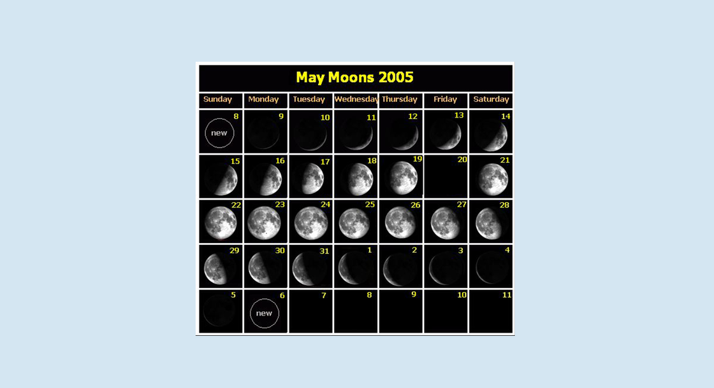

啰里啰唆是一份针对互联网和生活爱好者的数字杂志，旨在发现和分享一切有趣的东西。话题不固定，每期大约十五分钟阅读量，暂定每周四发布。部分内容来自互联网采编，如果为有来源的转载，均会注明转载地址或保留水印。

这是一个关注人文和科技的newsletter。

啰里啰唆周刊第25期：鸟鸣嘤嘤

# 科技日常

## 1. urbandictionary
Urban Dictionary（意为“市井词典”或“城市词典”）是一个解释英语俚语词汇的在线词典，由Aaron Peckham于1999年创立。截至2010年4月，这个网站拥有486万个词汇的定义。词汇数量每天都在不断增加。这些词汇定义由志愿者通过注册该网站后编辑提交，网站访问者可以对这些定义做出评定。

内容涵盖俚语、流行词汇、亚文化词汇或者某种现象的定义，有些定义在标准词典中无法找到，该网站上大多数的词汇都有多重定义，还附有例句和网络标签。 

这是我使用了很久的一个工具，英语俚语网，收录了常见常用的口语、俚语。比如第3期提到的Bakkushan，第1期的Yoga Pants都有收录。

这里的俚语都是用户提交的，并且不同的用户可以提交不同的释义。如果一个俚语没有被广泛使用或者有比较权威、受众面广的出处（比如出现在热门电影和其它文字作品中），这样的俚语认可度是很低的。所以也不能随意引用urban的俚语，导致除你外的其他人都看不懂。

https://www.urbandictionary.com/，当然这个网站被墙了。

附：国内的流行语、俚语词典叫“小鸡词典”，https://jikipedia.com/ 
## 2. 文石发布 BOOX Tab8 平板

8 月 16 日，文石发布 BOOX Tab8 快刷阅读平板，该平板搭载 7.8 英寸、300PPI、1872x1404 分辨率墨水屏，采用高通骁龙八核 2.0GHz 处理器，配备独立的快刷显卡芯片和自研 BSR 快刷算法，内置 5000mAh 电池。文石 BOOX Tab8 目前已开启预约，首发价格 2680 元。

https://zh.boox.com/tab8

# 读书与影视分享

## 1.奈保尔《米格尔街》 

> 诗人离开了世界，智者被生活打败了，小丑绽放了光芒，弱者始终软弱无力。生活如此绝望，每个人都兴高采烈地活着。在这真实得令人毛骨悚然的世界，却住着一群可爱、可悲、可笑的人类。

《米格尔街》是英国作家V.S.奈保尔的作品，获得2001年的诺贝尔文学奖。

《米格尔大街》是关于20世纪30、40年代英属殖民地特立尼达首府西班牙港的米格尔街上普通居民的故事。米格尔街上的人，生活在自我构建的孤立空间里，精神恍惚、人格扭曲。他们的人生旅程，充斥着麻木的苦痛。每一天都没什么新鲜事发生，生命就消耗在这种无休止的重复中，所有人都忍受着苦闷和乏味的煎熬。尽管他们也想出了种种方式来解脱喝酒、骂街、甚至打架、找女人，甚至有时也写写诗、读读书，可所有这些不过只是为了麻醉自己，借以排解心中的无聊与空虚，对他们来说生活似乎已经没有任何意义，活着就只是为了生存。

《米格尔街》以一个生活在米格尔街的孩子及一个成人作为双重叙述者——字里行间透露出被殖民者的忧郁、幽默、伤感、无奈的情调。  “米格尔街”成为殖民社会的象征和缩影——它所反映的下层人们的生活也是当时殖民地下层人生活的真实写照。

书评：
1.“你要学会听Lou Reed，他的专辑卖了5000张，那5000个人后来都有了自己的乐队。”

2.每个孩子的童年都有一条《米格尔街》

3.《米格尔街》是一部带着冷笑写就的小说，奈保尔冷眼旁观式的写作风格在这部小说中体现的淋漓尽致奈保尔在这部小说中记录了一条街上各式人物的生活姿态，间杂了“我”在这条独一无二的街上的成长历程。对街上人物所具有的小市民劣根性进行了深刻的揭露与批评，但同时对每个人都寄寓了深切的人文关怀。奈保尔可能是想借此书表现在一定特殊历史空间背景下人们的生存状态

## 2. 《鸟鸣嘤嘤》

**此片自2020年提交后，未能通过大陆电影审查，无观看渠道**

《鸟鸣嘤嘤》是由田壮壮执导，章宇、周奇、李宛妲、岳骁恪主演的剧情片。该片片名出自《诗经·小雅·伐木》的“伐木丁丁，鸟鸣嘤嘤。出自幽谷，迁于乔木。嘤其鸣矣，求其友声。”这句诗歌颂了友情，把鸟与鸟的相求比作人和人的交友。

该片改编自作家阿城的小说《树王》，讲述在20世纪60年代，农民“树王”肖疙瘩和以李立为代表的知青进行斗争，最后失败导致巨树被砍，而肖疙瘩也抑郁而终的故事。

20世纪60年代末，知识青年胸怀人定胜天的理想来到云南。为了种植“有用”的橡胶树，他们开始大肆砍伐“没用的”原始森林。当山上的树已倒了大片，人们继而向村民们世代敬畏的“树王”举起了砍刀。当地农民“肖疙瘩”（章宇饰），一个懂山、懂森林的伙夫，以命相抵，双方展开了一场较量。

由于此片未能通过审核，也无观看渠道，有感兴趣的可以阅读原著,阿城小说《树王》选自小说集《树王棋王孩子王》。

> “电影拍完了两年了，送到电影局里到现在没有任何审查意见，作为同行的尊重来讲，我能接受任何的一个审查的结果。但是我确实不能接受一个我送给你两年多，你连一句话都没跟我说的结果，这个确实让我，再一次对电影，失望。我也不知道，应该怎么样才能够到找到一个结果。”

田壮壮1980年代开始就陆续拍摄出《红象》《猎场扎撒》《盗马贼》等具有深远时代影响的电影,《鸟鸣嘤嘤》是田壮壮阔别十年的导演新作，从2009年的《狼灾记》后，他已经十年没有担任导演。

最近几年，享受如此待遇的又岂止《鸟鸣嘤嘤》，还有一个长长的名单：《英格力士》、《坚如磐石》、《749局》、《封神三部曲（一）》、《枪炮腰花》、《东北往事之二十年》、《我的少年时代》（尘埃里开花）、《涉过愤怒的海》、《她杀》、《不止不休》、《平原上的火焰》、《冰之下》、《刀尖》、《中邪》、《恋曲1980》......

## 3. 电影《印度合伙人》 (2018) 

结合最近的一则新闻“[苏格兰成为世界上首个向所有人免费提供经期用品的政治体](https://www.nytimes.com/2022/08/15/world/europe/scotland-free-period-products.html)”，更能加深对这步电影的理解。

电影曾译名《护垫侠》，根据印度草根企业家Muruganantham真实事迹改编。因为卫生巾关税高昂，在2012年印度仍有80%以上的女性在生理期无法使用卫生用品，初中文化程度的主人公拉克希米（阿克谢·库玛尔 饰）为了妻子（拉迪卡·艾普特 饰）的健康，寻找低成本的卫生巾的生产方法，却被全村人视为变态、疯子；最后他远走大城市德里，遇到了生命中最重要的美女合伙人帕里（索娜姆·卡普尔 饰），最终发明了低成本卫生巾生产机器，并开放专利，为印度全国对于女性经期卫生观念带来变革，2018年7月印度取消卫生巾进口关税。“权势之人、强壮之人不会让国家变强，女性强大、母亲强大、姐妹们强大后，国家才会强盛。” 

# 图论

## 1.I'm dead

艺术家主页: [Instagram](https://www.instagram.com/asliceofalan/) | [asliceofalan.com](https://asliceofalan.com/) | 
[twitter.com](https://twitter.com/ASliceofAlan) | [patreon.com](https://www.patreon.com/asliceofalan) | [ko-fi.com](https://ko-fi.com/asliceofalan)

## 2.磨刀师傅

19世纪，法国梯也尔地区的磨刀师傅因为不堪忍受长时间弯腰驼背工作，所以他们集体改成趴着磨制道具。但冬天温度太低，趴久了腿脚会冷，所以几乎每个人又都养了一条狗用来腿部取暖。

# 谈天说地

## 1.聊聊日历中的阳历与阴历 

阳历，也称为太阳历。它的身影最早可以追溯到古埃及。严格意义上的阳历分为回归阳历和恒星阳历两种。二者的区别就是前者采用的历年方式是回归年，而后者采用的则是恒星年。在归类上，我们目前使用的阳历（格里高利历）就是一种回归历。

**农历本质上是一种阴阳合历。民间误称阴历，是因为农历日期基本对应月圆月缺，阴历性质显而易见，因历史原因错误称呼之。**

概括地说，二十四节气属阳，月相属阴。

实际上，二十四节气是一个统称。它包括「中气」和「节气」各十二个。以春分为第一个中气（春分对于格里高利历的前身儒略历也有重要意义，因为它是计算复活节日期的基础），然后节气、中气相间排列，终于惊蛰。

农历以回归年进行历年，二十四节气的制定也与回归年有着莫大的关系。当太阳直射在北回归线的时候，此时北半球的日照时间达到最长；而当太阳直射在南回归线的时候，北半球的日照时间达到最短。据此分别定出了夏至与冬至。相应地，在太阳直射赤道之时，昼夜平分，以此确定了春分与秋分。

四个关键节点确定之后，接下来就是确定剩下的二十个节气与中气了。然而在这个问题之上，国人却经历了一个历法史上重要的变革，即「平气」改「定气」。这一变革影响之大甚至影响到了闰月的置闰问题。在西汉武帝时期的《太初历》中，以冬至为岁首，这种方法被称为「平气」或「恒气」。而在 1645 年《时宪历》正式颁行后，采取了以春分为岁首的策略，这方法被称为「定气」。因为地球围绕太阳的公转并不是一个匀速运动，在近日点时移动最快，在远日点时移动最慢，所以相比之下「定气」法要更贴近实际的情况。

在我们语境当中，阳往往会指代太阳；而阴则常常会指代月亮。在这里就是如此，这里的阴就是与月亮相关。作为阴阳合历的农历其「阴」指的就是根据月球运行的朔望月来历日。

这当中的朔是指每月的初一，望是指十五或者十六。朔望月出现的主要原因是月亮绕地球运行一周时间，一个朔望月即月亮绕地球公转一周的时间，平均为29.530588天。在阴历的日历中体现为大月 30 天，小月 29 天。12 个朔望月下来约合 354.36 天。这样就和一个回归年365.2422 天之间产生了 11 天的差值。自然地，月相和潮汐也扯上了关系，不过抄袭和月相的关系是牛顿发现了万有引力后才搞清楚的事情。

为了解决或者说协调这个问题，农历采用了设置闰月的方式。这就是有名的「十九年七闰法」，即十九年中设置七个闰年，这个七个闰年中每年增加一个闰月。这样，农历和阳历在 19 年的时间段上实现了天数对齐。而与前文提到的定气的情况，闰月的设置主要以夏季居多，极少设置在冬季。

有人说现行的农历是清初西方传教士汤若望1645年左右编著和改进的，注意，这里说的是编著，而不是发明，这种说法是没有大问题的。汤若望为什么能获得清廷的信任，就是因为他对天文活动的预言比当时的历法更准确，明末时候官方历法在预测天文现象时已经出现了不小误差。

**也有人会说，我国现行的农历是1929年修订的《紫金历》，而并不是汤若望修订的《时宪历》。这种说法是非常不客观的，属于典型的历史虚无主义。**常识告诉我们，《紫金历》不可能是凭空产生的，就编历原则来看，延续了从明末编订的《崇祯历书》，清代的《时宪历》等历书思想，但天文模型以及预测手段变为现代天文学手段。就制历思想来看，诸如冬至在十一月，使用定气法决定节气，置闰规则等，都延续了明末以来的几部历书。

希伯来历和伊斯兰历就是纯「阴历」,纯阴历的历年就比阴阳合历的农历简化的多，12 个朔望月为一年。由于12 个朔望月比一回归年要差 11 天，所以随着时间的推移，纯阴历和实际的物候之间差距会变的越来越大。除了上面提到的这些日历之外，广泛使用的还有波斯历。波斯历也称为伊朗历，它是回归历的一种。

参考：https://sspai.com/post/75137

## 2. 欧姆定律
欧姆定律中，U/R=I，电流和电压成正比，和电阻成反比。说直白点，就是电流总是挑选电阻最小的路走。当电阻趋近于0时，这个时候就是短路了。

当然，这种说法是不准确的，颠倒因果了。更准确的应该叙述如下，在相同电压下，电阻小的电路电流更大。

但回到现实问题中，改革总是顺着阻力小的方向前进，这样就能解释很多事情了，譬如教育为何会跟房价扯上关系。
## 3.90后不该叫90后，但00后可以叫00后
我曾经提过一个观点，2017年的小蓝单车事件和2022年的李嘉琪直播事故，直接原因是互联网年轻化导致的。这里说的是直接原因，而不是根本原因。

年轻化导致大量的90后，00后涌入职场，他们是策划和运营的主力军（根据我的从业观察，运营这种岗位同样容不下大龄从业者，或许更甚），这些人出生在90年代，但成长在00年代，当下的互联网和出版物、新闻管理环境下，很难有“正确”的政治意识呢，怎么可能不出事呢？

我一直的一个观点就是，90后不应该叫90后，因为90后，官方定义也好，直观理解也好，就是1990年后-2000年前出身的人，但是，他们虽然出生在90年代，但是成长却是00年代甚至10年代。他们接受的教育是00年代，三观成型是00年代，甚至10年代。

我们说90年代，通常不止说的是个时间概念，还拥有文化属性，时代烙印。这就很好地解释了，“为什么我觉得90后比80后还要极端，封建，他们不应该更开放吗”这个问题。很多写90后的文章，总喜欢提90年代的改革开放和社会环境，可是这跟90后有多大关系呢？不能否定，90年代对90后或多或少也会有一定影响，但比例有多少呢？

但是，另一个方面，教育和文化有一定滞后性，比如我在90年代，看的最多是70年代和80年代的书。我记得我初中的时候，中学流行补课，暑假期间会补课半个月，提前把下一新学年（9月份）的课程学习了，那就需要向上一级学生借书，当然，我不认识比我大的学生，自然借不到书了，拿的是我爸的化学课本，通篇打开就是语录和批刘。《六十一个阶级兄弟》的语文课本也是我在90年代看的。

不过随着舆论和文化的全方位加速，现在的10后和10年代的关系又变得紧密了。所以这个话题，也没那么简单和绝对。90后是特定年代背景下，稍有不同的一代。

00以后，时代如算数结果一样，未有变局。

# 一句话快讯

1.四川彭州龙门山镇龙槽沟某未开放景区“813”突发山洪灾害，共造成7人死亡、8人轻伤，死伤者多为城里游客。

2.8月12日，一份名为《关于请求维护营商环境、增强房企投资信心的纾困解难报告》的文件在网络流传，落款处清晰地盖着保利、华润、绿城、龙湖、旭辉和葛洲坝等17家品牌房企的印章。文件称，合肥市房屋交付中，普遍有不合理、不合规的客户诉求问题，因房屋质量瑕疵问题，不接受维修，无故拒收且拒交维修期间的物业费，索取巨额赔偿。客户诉求高度一致，背后可能有专业房闹机构推波助澜，并形成产业化趋势。因此，恳请合肥市政府坚决遏制专业房闹及“恶意维权”行为。

3.消息称，据知情人士透露，腾讯近几个月一直在与财务顾问接触，以研究如何执行可能大规模出售美团股份的计划。目前腾讯拥有美团17%的股份。据美团目前市值计算，腾讯持有的股份价值243亿美元（约合1650亿人民币）。消息人士称，如果市场条件有利，腾讯正寻求在今年内开始出售。对此腾讯集团市场与公关部总经理张军予以否认，截至发稿美团未有回应。

4.马斯克在中央网信办主办的《中国网信》杂志上刊发了《相信科技创造美好未来》一文。

5.俄罗斯防务展上大火的M-81战斗机器狗，被挖出就是中国产“宇树Go1”加上火箭筒。
# 联系方式

使用方法建议或素材提供

邮件：bairadish@gmail.com
频道：notonlyshare