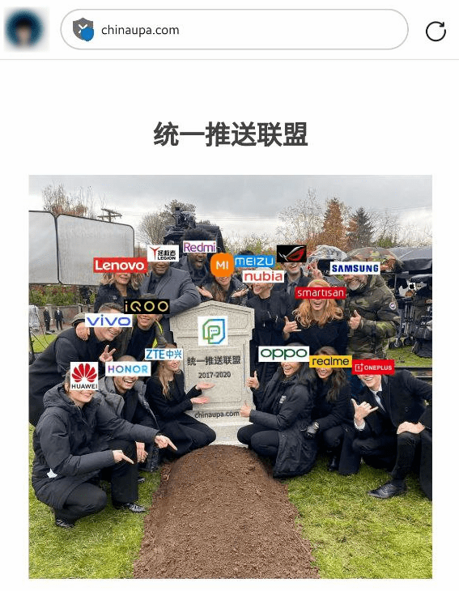
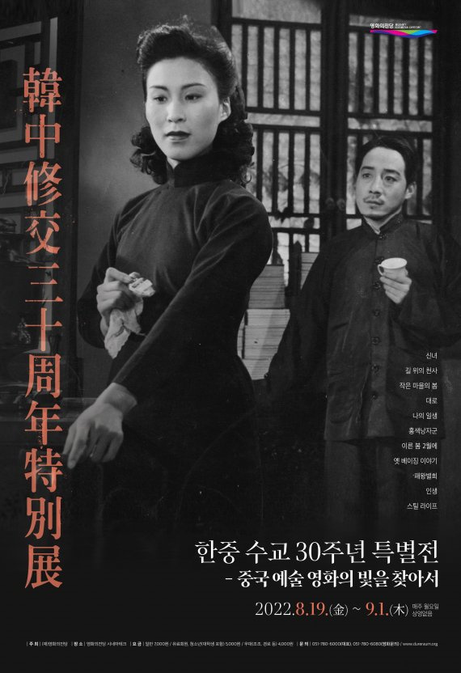
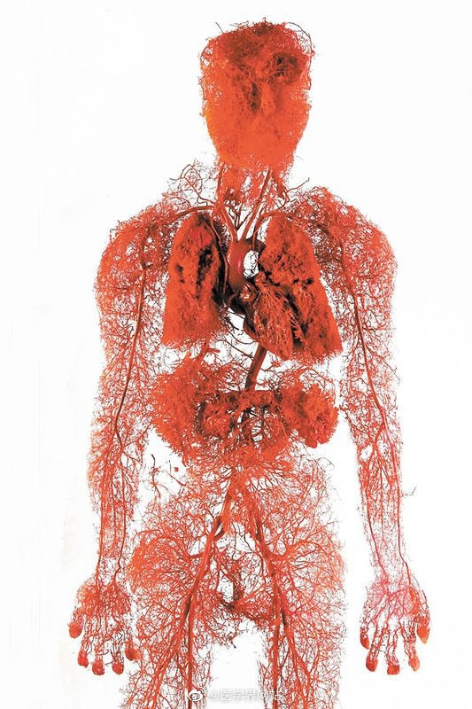

啰里啰唆是一份针对互联网和生活爱好者的数字杂志，旨在发现和分享一切有趣的东西。话题不固定，每期大约十五分钟阅读量，暂定每周四发布。部分内容来自互联网采编，如果为有来源的转载，均会注明转载地址或保留水印。

这是一个关注人文和科技的newsletter。

啰里啰唆周刊第26期：能保留人味就不错了

# 科技日常

## 1. 旧笔电硬盘播放《节奏国度》会崩溃

微软资深软件工程师、《The Old New Thing》作者 Raymond Chen [证实](https://devblogs.microsoft.com/oldnewthing/20220816-00/?p=106994)，一家未披露名字的 PC 制造商发现某型号的笔记本电脑在播放珍妮·杰克逊的 1989 年热门音乐视频《节奏国度(Rhythm  Nation)》时会崩溃。调查发现播放音乐视频还会崩溃竞争对手的一款笔电，更离奇的是相邻的一台未播放音乐的笔电也崩溃了。原因被发现是《节奏国度》含有某款 5400 RPM 笔电硬盘的自然谐振频率，会干扰其运行。该 bug [被赋予了](https://arstechnica.com/gadgets/2022/08/janet-jacksons-rhythm-nation-is-officially-a-security-threat-for-some-old-laptops/)正式的 CVE 编号 CVE-2022-38392，影响到 2005 年上市的笔记本电脑，此类电脑基本上应该都被淘汰了。	

让人想起此文 https://www.zhihu.com/question/21747929/answer/310031007

> 听一个希捷的朋友说的。
>
> 有用户反映每次用笔记本播放李娜的青藏高原时，电脑就会死机。经测试发现，唱到最后的“那就是青藏高...”时，硬盘产生了共振，振幅过大，读写头读不出数据了。
>
> 为了抓住这个bug，朋友听了一个月的青藏高原...				                

嗯，**知乎诚不我欺也**！

## 2. 工信部统一推送联盟疑似解散

有网民发现，工信部统一推送联盟官网已被出售，且被挂上了嘲讽图

2017年左右，工信部旗下的信通院下属泰尔实验室看不下去安卓推送的混乱，联合了几家手机厂商以及行业里的公司，宣布成立了统一推送联盟。虽然在这五年时间里，不断有厂商宣布加入到统一推送联盟当中，联盟的成员名单越来越长。但是统一推送联盟一直号称要自建的、用来终结安卓推送服务乱象的 " 推必达 "，却迟迟没冒出个泡来。 

当然，也不能说统一推送联盟一事无成，其最大的成就应该是2019 年发起的 《 中国绿色 App 公约 》（标准参考了绿色守护发起的 Android 绿色公约），形成了对违规App的界定标准。

参考：https://www.sohu.com/a/578253227_355019

## 3.应用内浏览器的安全隐患

研究[发现](https://krausefx.com/blog/announcing-inappbrowsercom-see-what-javascript-commands-get-executed-in-an-in-app-browser)，流行 iOS 应用如 TikTok、Instagram、FB Messenger 和 Facebook  都支持用户在应用内打开浏览器访问第三方网站，期间会植入跟踪代码。以 TikTok  为例，它会记录用户的所有键盘输入，包括密码信用卡信息等敏感数据，以及屏幕上的每一次点击。从技术上说这相当于安装了一个键盘记录器。在这一报道发表之后，TikTok 发表[声明](https://www.forbes.com/sites/richardnieva/2022/08/18/tiktok-in-app-browser-research/)，证实该功能存在，但 TikTok 并没有利用这些代码。TikTok 表示应用内浏览器旨在提供更好的用户体验，它植入第三方网站的 JS 代码是为了调试、排错和性能监视。

## 4.Chrome 桌面版加入 RSS 阅读器功能

Chrome 94 的 Android 版本去年[推出了](https://www.solidot.org/story?sid=69194)名为“关注（Follow）”的类 RSS 阅读器功能。用户可以添加对网站的关注，浏览器的新标签页变成了简化版的 RSS 阅读器，以时间顺序展示所关注网站的更新。现在该功能[开始进入到](https://www.ghacks.net/2022/08/22/google-chrome-is-getting-an-rss-feed-reader-on-desktop/)桌面版本和 ChromeOS 上。该功能被称为 Web Feed，Google Chrome 工程师 Adriana Porter Felt  证实它能从没有 RSS feed 的网站拉取内容。她表示功能还在开发之中，需要改进。它有可能在 9 月底随 Chrome 106  提供给用户使用。不同于 Android 版本在新标签页展示 RSS feed，桌面版本将通过侧边栏显示相应内容。

# 读书与影视分享

## 1.《软体动物》

本书从中国魏晋时的何晏、潘岳到明清之际的钱谦益、阮大铖，所涉笔的数十位中国古代文人，虽然不是令人发指的B面人物全部，但绝对可以说是其中的代表。作者化笔为刀，刻画了这些中国古代文人不大为人所知的“软体动物”的一面。精神、气质的“软”是他们的共性，但就其“软”的程度、质地、方式则各有不同。王小波说，知识分子最怕生活在不理智的年代。换句话说，不理智的年代也才会大批量产生够“软”的知识分子。这似乎可以解释这些人形“软体动物”的成因。才华不足以构成钙质，知识未必能确保良善，在万古长如夜的极权社会，有硬度的文人是稀缺产品，而盛产的多是左右逢源的冯道和沦为弄臣和文宠的潘安，等等，等等。

大抵如此。

作者阿丁，真名王谨，男，70后，河北保定人。曾为麻醉医师。曾在多家媒体任副刊、文娱记者、编辑。

书评：
1.最近这种书蛮多。臧否历史本来就是容易的事。批评已经没有回嘴能力的人，显然爽快。所以本来也没抱什么高期待。不过倒还是比预料的好看。至少有趣。人非圣贤，至少不是每个上了书本的人都真的是圣贤。所以我最腻味当老师的地方就在于此。明明是人，却要神化，何苦来哉。吾自认不堪如此。

2.有时候觉得吧，软体动物才是正常的，铮铮铁骨才是奇行种。所以我很高兴，丁哥没有以一副政治委员的形象站在高处来批评这个软体动物，只是像说自己孩子小时候的糗事那样的语气来写俺们古代文人的B面。看的你觉得又好笑又恶心还有一种隐隐的侥幸——还好上台的不是我。
## 2. 清·《梦中缘》
《梦中缘》是清代李修行创作白话长篇才子佳人小说。又名《梦中五美缘》。四卷十五回。成书于清雍正、乾隆年间。

小说意在宜扬“一娶数美”，追求娇妻美妾，落入常套，格调不高。惟书中写盗贼，写恶少，间及明季社会现实生活，或有可取。莲溪氏对其艺术描写，颇为赞赏，曰：“至其写才子，写佳人，写缙绅孤介，以及瑞生一世之离合悲欢，直觉优盂复出，亦不能装点得如此生动也。”

不得不说，明清的确是小说发展的高峰期，这种小说放在现在就是起点爽文。马伯庸在一个知乎问题《在中国古代写小说是否能盈利？相关出版机制是怎样的？》下有一个回答，讲的主要就是明清的小说生态。

>明代书商们无所不印，经史子集、医书农书，道藏佛典等等，时人诗文乃至高考作文精选，每年刊行数量巨大。但他们很快发现，明代的老百姓、尤其是城市里的老百姓——所谓初步形成的市民阶层和市井文化——最喜闻乐见的是各种通俗小说。书坊里卖的最好的，永远都是三国演义、水浒传之类的畅销书。清人金缨《格言联璧》：“卖古书不如卖时文，印时文不如印小说”，正是书商经营的诀窍。康有为亦有诗为证诗证：“我游上海考书肆，群书何者销流多，经史不如八股盛，八股无奈小说何。”
>
>书商们看到这种巨大利益，自然不会不心动，决定要把这个市场做大做深。当时的情形是：“宋元旧种, 亦被搜括殆尽, 肆中人见其行世颇捷, 意当别有秘本图书而衡之”

>写新鲜东西？没问题，但作者得有才气、有学识。古代识字率低，有文化的人都得从士林里找，可偏偏当时士林风气视小说为小道，都不愿意写，愿意写的也不敢露名。

>杨涌泉当时在印一本书，记录岳飞事迹的《精忠录》。印完了审校，他突然脑子一激灵：《精忠录》是史书，没什么意思，但如果把它写成三国那样的小说呢？关于岳爷爷的通俗演义，那得多牛逼啊！杨涌泉想到这儿，赶紧去找他的亲戚，也是个书商、忠正堂主。
>
>熊大木认识字，可实在没什么写作天分。罗贯中是七实三虚，他是十实无虚，就是把史书拿大白话讲了一遍，还舍不得删，把岳飞的所有奏章、题记、檄文、书信全扔进去了，文学效果惨不忍睹。熊大木自己也觉得太枯燥，脑子一转，往岳飞传里硬夹了一段路遇关胜的故事，还得意洋洋地加注释说这个关胜是梁山的人曾经征讨方腊云云，借来水浒传的大皮给自己宣传。
>
>别看这书写得糟糕，当时销量却十分惊人。现在能查到的版本，就有七种，也就是说至少先后被七家出版商翻刻过，甚至其中一个版本还是内府本。换句话说，嘉靖修道有暇，还让经厂刻成御本来欣赏。

最近上映的国漫《新神榜：杨戬》，沉香救母，宝莲灯等素材，皆是来自明清时候的创作。

参考：https://www.zhihu.com/question/22001726/answer/20027386

## 3.寻找中国艺术电影的光芒
 据釜山电影殿堂方透露，为迎接中韩建交30周年，8月19日起将在釜山电影殿堂举行电影特别展映活动，主题为「寻找中国艺术电影的光芒」，届时将展映多部中国艺术电影代表作品。

展映片单：
《神女》（1934）
《马路天使》（1937）
《小城之春》（1948）
《大路》（1935）
《我这一辈子》（1950）
《红色娘子军》（1961）
《早春二月》（1963）
《城南旧事》（1983）
《霸王别姬》（1993）
《活着》（1994）
《三峡好人》（2006） 

# 图论

## 1.When your brain is not yet awake

艺术家：More info: [Instagram](https://www.instagram.com/doodleysquatcomics/) | [Facebook](https://www.facebook.com/doodleysquats/) | [doodleysquats.wordpress.com](https://doodleysquats.wordpress.com/)

## 2.人体血管分布图

## 3.小时候

# 谈天说地

## 1.枪炮 细菌 钢铁

这两天，我在微博上被人骂惨了，只是因为我发了这么一条微博：
有人说欧洲人几乎杀光了美洲印第安人，稍微有点脑子的人都不会这样想。哥伦布发现美洲的时候，美洲大约有5000万土著，欧洲前前后后才有几千人登录美洲，双方比例是10000：1，一万人放个屁，都能熏死这一个欧洲人。大量印第安人不是死于屠杀，而是死于带去的天花。美洲人的体内没有天花免疫，所以大量死亡。
我写的都是事实。
因为我看过一本叫做《枪炮 细菌 钢铁》的书，这本书已经出版20多年，获得了普利策奖，在全世界一直畅销不衰。
骂我的人，肯定没有读过这本书。甚至还有人问我：普利策奖怎么了？普利策奖就权威了。
普利策奖当然是全球公认得权威奖项，和诺贝尔奖相提并论。
为了能够说服他们，我不得不把这本书的内容介绍给他们。

这本书写到了这么一件事——
1519 年，科尔特斯率领 600 名西班牙随从登陆墨西哥海岸，企图征服有数百万人的阿兹特克帝国。第一战斗失败。然而，科尔特斯再次发动攻击时，发现已无人抵抗。西班牙人凭什么获胜？答案就是天花。 1520 年，有个奴隶在古巴感染了天花后来到墨西哥。结果这场流行病杀死了半个阿兹特克帝国的人，连皇帝奎特拉瓦克也难逃一劫。这种神秘的疾病专挑印第安人而放过了所有的西班牙人。墨西哥人口本有 2000 万，到了 1618 年陡降至160 万。
还有这么一件事——
皮萨罗在 1531 年登陆秘鲁时，他只带了 168 个人就征服了几百万人的印加帝国。 天花早他一步在1526年左右来到秘鲁，带走了不少印加帝国的子民，连皇帝卡帕克和他指定的继承人都魂归西天……
还有这样一件事——
伊斯帕尼奥拉岛，现在叫海地岛。在 1492 年哥伦布发现这个新大陆时，约有800万人，然而，到了 1535 年，这 800 万人全成了白骨，无一幸存。
作者因而得出了这样的结论——
人类历史上致命病菌的重要性，可以从欧洲人征服新大陆并使那里人口减少这件事得到很好的例证。印第安人在病床上死于欧亚大陆的病菌的，要比在战场上死于欧洲人的枪炮和刀剑下的多得多。这些病菌杀死了大多数印第安人和他们的酋长……

为了取得更多的证据，我查阅了别的资料。
在一本《瘟疫与人》的书中，有这样的文字——
整體而言，美洲印第安族群所遭到的慘難，規模之大，我們很難想像，因為在我們生活的時代，流行病已經不算一回事了。美洲印第安的人口曲線，在前哥倫布時代和最低點的比率為20：1，或甚至是25：1，雖說地域差異很大，但大致錯不了。在這個令人悚然的統計數目背後，潛藏著極大的、反覆的人類苦難。
这本书写的是瘟疫对人类的伤害。

我有用英文查找，结果查找到了当时的原始记录——
当年欧洲人中，有个叫托马斯·哈钦斯的人，他在 1762 年 8 月20日日记中写道：20 日，上述印第安人会面，维塔农酋长代表他和基考普国家发言如下："兄弟，我们非常感谢威廉·约翰逊爵士派你去调查印第安人的状况。我们向你保证由于一场严重的疾病夺走了我们几乎所有的人民，其中许多人最近已经死亡……"

而最权威的医学杂志《柳叶刀》，在2002年第4期刊登论文《天花和美国原住民》，文章写道——
随着欧洲人到达西半球，美洲原住民人群暴露于新的传染病，即他们缺乏免疫力的疾病。这些传染病，包括天花和麻疹，摧毁了整个土著人口。在欧洲人带来的“新”传染病中，天花是最令人恐惧的疾病之一，因为受感染的美洲原住民死亡率很高。
通过上面的种种资料，足以证明当时的美洲土著，确实大规模死于天花等传染病。

有人问：为什么天花只盯着美洲土著，不盯着欧洲人？
这是因为，美州这片地方从来天花等传染病，身体里没有抗体，有没有防疫知识，所以，天花一来，立即成片倒下。而天花已经在欧亚大陆肆虐很多年，连顺治皇帝都死于天花，欧亚人在于天花不断的抗争中，体力逐渐有了抗体。
天花最早出现于3000年前，而1979年才终结。
1979年12月9日，多名在各国考察的美国科学家证实天花已经绝迹，世界卫生大会亦于翌年5月8日通过此提议。
此后，人类再没见过天花。

ref:https://weibo.com/u/6027879764

## 2.没有坏人

据[国内](https://www.163.com/dy/article/HFFAQN4V0552RN94.html)和[国外](https://www.reuters.com/world/china/chinese-censors-change-ending-latest-minions-movie-2022-08-22/)媒体报道，《小黄人大眼萌：神偷奶爸前传》中国院线版本比原版多了一分钟。在新结局中，抢劫首领“威酷魔王”被警察抓住，被判处 20 年监禁，而主角格鲁则重新回到家庭的怀抱。在原版中威酷魔王以装死逃过了监禁的命运，而主角格鲁则率领小黄人们继续他成为最“坏”坏蛋的使命。

这就是中国大陆影视剧的一个铁律，不能把人物“弄脏”，不能把背景“弄脏”，不能把情节“弄脏”。“正义”一定要得到声张，“恶人”一定要被惩处。

“所谓一个人的品质，不过是瓷器一次又一次被烧成灰烬后，留下来的那一点赤金。你不舍得烧它，只敢端端正正地供着它，那它就只是无趣的摆件，而已。”

## 3.还想要年味呢。能保留人味就不错了

根据国务院《全国年节及纪念日放假办法》的规定，我国全年全体公民放假的法定节假日共11天，分别是：新年（元旦），放假1天；春节，放假3天；清明节，放假1天；劳动节，放假1天；端午节，放假1天；中秋节，放假1天；国庆节，放假3天。 法条链接：国务院《全国年节及纪念日放假办法》，自2014年1月1日起施行。

我说实话，其他假期我都觉得还可以忍耐吧，就春节，放三天这个事情，是多年以来我怎么想怎么都觉得真的太离谱了。
春节，中国人最重要的节日。年年有春运专题。年年都要讨论今年的年味浓不浓。结果放假就三天。为了凑所谓的七天还是拼命调休。大概率年前连着上六七天班。非要到除夕当天才放假，双社畜小家庭连采买年货的时间都没有。

就这媒体还好意思年年发二十三糖瓜粘，二十四扫房子。事实上大家只有二十三去上班，二十四还上班。

现在就明显搞得春节还不如国庆。国庆吧最多是带着全家出去人挤人，花了很多钱过一个不愉快的假期罢了。宅男宅女们总可以连着睡上七天懒觉，多少也能回回血。

春节呢，你还得抢票，回家，拜年，被各路亲戚念叨。总共就七天，也玩不好也休息不好。

说穿了现在的春节假期就是一群可怜的年轻人，被资本主义和封建势力来回反复拉扯碾压。

还想要年味呢。能保留人味就不错了。 

ref:https://weibo.com/donghaiyangchen
# 一句话快讯

1.根据教育部统计，2022 届高校毕业生预计 1076 万人，同比增加 167 万人，规模和增幅均创新高。8 月 17 日封面新闻报道，数据显示，有 46.37% 的 2022 年本科应届生将公务员、事业单位等体制内工作视为好的工作机会，比例远高于互联网大厂（19.78%）、世界五百强企业（9.89%）、金融机构&咨询公司（7.69%）。

2.长江流域发生了1961年以来最严重的气象干旱，洞庭湖鄱阳湖面积缩小3/4。论北方，河南更是成了全国唯一一个40度大满贯城市（所有现实最高温均超过40度）。

3.北京9月1日起医保个人账户定向使用 参保人员不可自由支取。

4.国务委员兼外长王毅18日在北京以视频方式主持中非合作论坛第八届部长级会议成果落实协调人会议。王毅表示，中国言出必行，愿继续将非方的需求作为对非合作出发点，同非方一道全力落实好“九项工程”，继续高质量推进“一带一路”合作。中方将免除非洲17国截至2021年年底对华到期无息贷款债务23笔。

5.微博管理员宣布，微博将在近期上线个人主页展示公开评论的功能，且不可关闭，以倡导用户更友善的参与内容创作与互动。

# 联系方式

使用方法建议或素材提供

邮件：bairadish@gmail.com
频道：notonlyshare