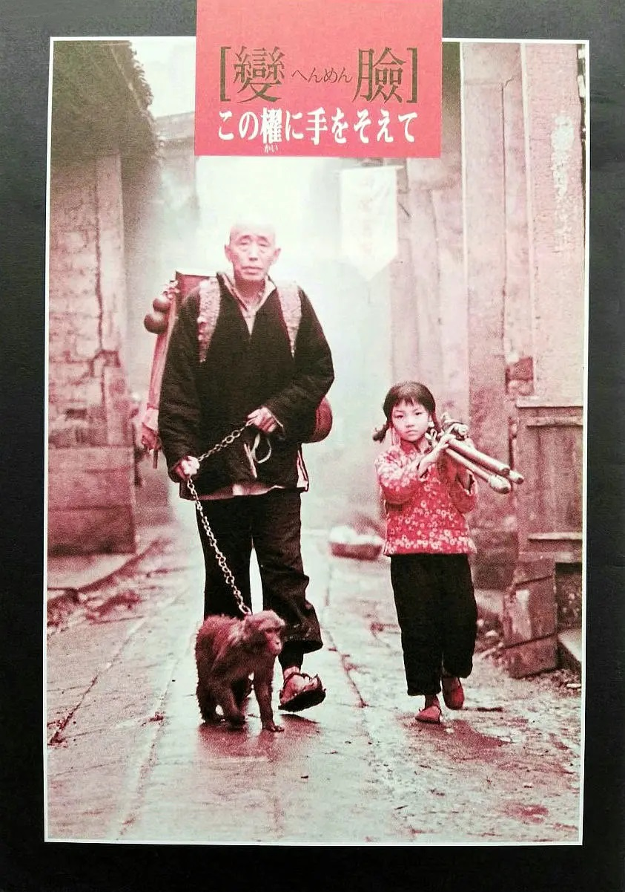
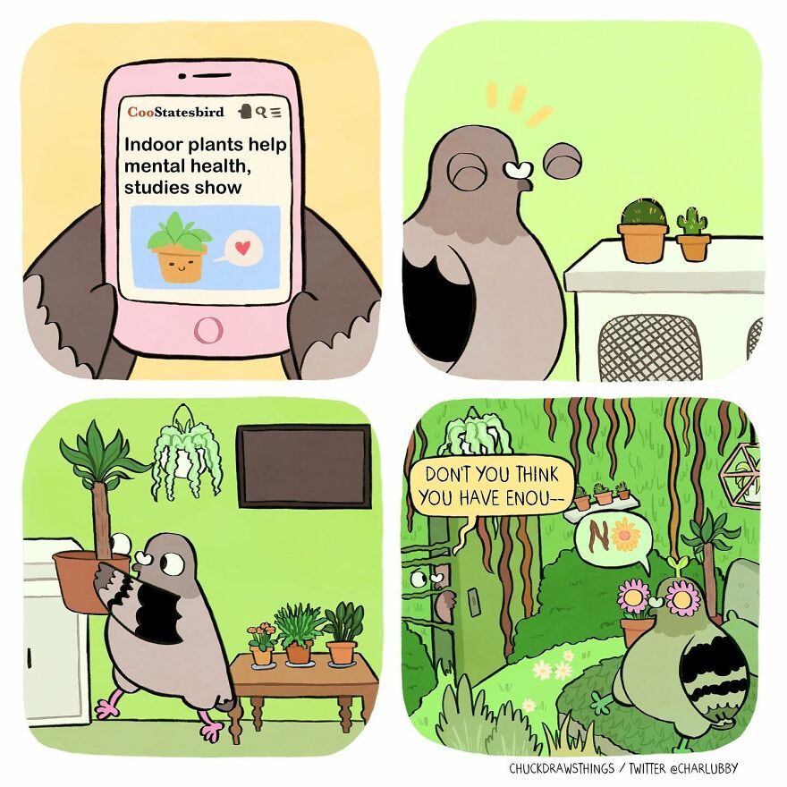

啰里啰唆是一份针对互联网和生活爱好者的数字杂志，旨在发现和分享一切有趣的东西。话题不固定，每期大约十五分钟阅读量，暂定每周四发布。部分内容来自互联网采编，如果为有来源的转载，均会注明转载地址或保留水印。

这是一个关注人文和科技的newsletter。

啰里啰唆周刊第27期：凤凰生孔雀，大鹏

# 科技日常

## 1. Codeberg
Codeberg由一个来自德国的非营利性的非政府组织所创建的。它致力于为开源社区提供全新的安全产品。因此，Codeberg声称：为了保持代码的安全，他们不会跟踪或出售用户的数据。目前，它已拥有31,000多名用户。

在创建帐户并成功登录之后，您将获得登录GitHub的镜像、以及免费的私有和公共存储库。在此基础上，您可以创建问题、拉取式请求、以及Wiki等。为了方便协作，Codeberg允许用户对项目进行注释，甚至添加表情符号等。

由于是一个小众的平台，因此其用户群远不及GitHub.

https://codeberg.org/

如果只是想解决github大陆访问不稳定的问题，也可以考虑gitlab.com和BitBucket。国内代码托管平台不建议使用。

## 2. xbmc

强大自由的媒体中心软件。这是一个媒体播放器软件，但折腾一下就是家庭媒体娱乐中心。它不仅支持播放本地视频，还能够安装各种插件以及播放网络存储设备(NAS)、投屏、直播、电视、播客等源。能够运行在 Linux、macOS、Windows、Android、iOS 等设备，界面支持中文更多功能等待你的挖掘。

https://github.com/xbmc/xbmc

类似的软件还有[CasaOS](https://github.com/IceWhaleTech/CasaOS)，更倾向于家庭云系统，管理文件和设备。只需一键即可安装在 NAS、树莓派等各种家庭智能设备上，让你可以随时随地管理个人数据和设备。

## 3.koodo-reader

基于electron的跨平台电子书阅读工具。该阅读器支持Txt、 EPUB、Kindle、PDF、漫画等多种常见格式，界面清爽功能丰富，拥有自定义字体、添加笔记、书签、划词翻译、导入图书、数据同步等功能。

提供了 Windows、macOS 和 Linux 客户端，还支持网页版可在线使用。

https://github.com/troyeguo/koodo-reader            

# 读书与影视分享

## 1.阁楼里的女孩

故事发生在宾州格拉斯通的梦幻家庭。
在中产家庭幻象破灭后，妈妈柯琳带兄妹四人，投奔在南方弗沃斯庄园的外祖父母。
然而，外祖母却将四个孩子关进了暗无天日的阁楼，并诅咒他们是“恶魔之子”。
为了活下去，他们经历了憎恨、欺骗、绝望和成长，也终于发现了妈妈内心深处最黑暗的秘密……
一部恐怖与罗曼史结合的经典小说。以少女的口吻诉说成长过程中的恐怖世界。

作者 弗吉尼亚·安德鲁斯1923年出生于美国维吉尼亚州。美国史上最畅销的作家之一，擅长以禁忌恋情、血亲纠葛等元素创造脍炙人口的小说，征服一代又一代的读者。其独具风格的创作与惊人的销售成就令同时期作家皆难望其项背，堪称“歌德罗曼史”“家族传奇”类型女王。

书评：
1.刚刚读完就来豆瓣，原本是希望得到一些共鸣的。只是看起来评分不高的它引发更多的是不屑和质疑。但说真的，我看进去了。被作者细腻的文笔，阐述的深刻情感，人物的形象和其传递出来的意味与画面都深深打动。

如果你只是想找谜底和真相，那么这部小说也许不那么适合你。因为那只会引着你快快翻篇，根本没有耐心读那些细节。但若是，你热爱文字给你带来的动心动情，这部小说足可以做到了。

2.说白了这就是一部描写少女内心成长史和和母亲之间爱和欺骗的伤心故事。从女性描写的角度来说，卡西的内心活动让我感觉非常真实，非常有女孩青春期的那种感觉。这是本书我觉得算比较大的一个优点。本书缺点我也觉得很明显，有点故意营造悬念之感，感觉外祖母和外祖父的形象很苍白。。母亲的形象很虚假

3.《阁楼里的女孩》是一个童话，一个黑暗的、扭曲的童话。就像所有童话一样，故事发生在离我们遥远的国土上，却几乎反映了我们的现实世界，好像又不完全是。

## 2.1995年电影《变脸》

江湖艺人变脸王孑然一身，以船为家，只影孤舟漂荡于川江两岸，沿途卖艺。几十年的卖艺生涯让他的变脸技艺如火纯青，天下一绝。

这天他来到一个小镇卖艺，高高在上的活观音梁老板透过人山人海看到了变脸王，被他的绝技深深折服。第二天，梁老板在茶楼约见了变脸王。他甚是赞赏变脸王的高超技艺，想邀他加入自己的班子，但变脸王单枪匹马惯了，且又担忧绝学流入他人之手，婉拒了他。梁老板没有强人所难，在告别前提点他，他该接续个香火，别让绝技失传了。于是，他来到了贩卖市场，准备买个男孩当孙子。

正当他要败兴而走时，一声爷爷叫住了他。他回头一看，一个面容清秀的男孩站在那里。虽然人贩子漫天要价，但他最终买下了他。

# 图论

## 1.mental health

More info: [Instagram](https://www.instagram.com/chuckdrawsthings/) | [bookdepository.com](https://www.bookdepository.com/Bird-Brain-Chuck-Mullin/9781783527854#) | [linktr.ee](https://linktr.ee/birdbrain)

## 2.Adorable Animals 

More info: [buddygator.com](https://www.buddygator.com/) | [Instagram](https://www.instagram.com/buddygatorcomics/) | [twitter.com](https://twitter.com/buddygatorcomic) 

## 3.大连708公交

大连决定：暂定从8月29日零时起至8月31日24时止，对全市公共交通进行适当管控。早晚高峰时段，每30分钟双向对方一趟车。运力减少到原来的十分之一。

# 谈天说地

## 1.互联网翻译家

> 注：这是一篇2008年左右的文章，文章中提到的网站和组织如今已大都已不存在。对这段历史感兴趣的读者可以了解下译言网的前世今生。
>

一群“网络翻译家”出现了，有单枪匹马在博客上翻译自己喜欢的作家的，也有几十、成百甚至数千人规模的志愿者团队，他们将目标指向“中文互联网之外的一切精华”。

2002年，20岁的韩斌第一次从书店买到一本中文版的《哈利·波特与魔法石》，从此对那个魔法世界迷恋得如痴如醉。与英国的“哈迷”相比，他与哈利·波特的第一次亲密接触晚了5年。2007年7月21日，作为资深“哈迷”的他参与了中国网络上最张扬的一次民间翻译行动，在《哈利·波特与死亡圣器》(简称“哈7”)英文版全球同步发行后的9天内，他所在的“霍格沃茨翻译学校”就将700多页的“哈7”翻译成了中文，而人民文学出版社的官方中文版要在3个月后才推出。

2007年，《哈利·波特和凤凰令》在德国卖出50万册，成为首部登上全德畅销书排行榜的英语情节类著作，就是靠1000位平均年龄16岁的哈利·波特迷，在自己的德文网站“哈利·波特行会”上通力合作翻译的结果，按照网站发起人、柏林电脑程序员博尔德·科曼的话说，就是:“我们这样做并不仅仅是尽可能早地让德国的‘哈迷’看到原作，而是将翻译转换成一种每个网民都能参与的生活方式。”

“霍格沃茨翻译学校”成立于2005年，是一个独立的“哈迷”组织，5位院长都是在校大学生，他们当年组织过一次“哈6”的网译，但并没有产生大的影响力。“哈7”的翻译者都是从哈利·波特的“粉丝”中招募的，主力是大学生，还有不少高中生。一个15岁的男生叫德里克(Derek)，他虽然顺利通过了考核，但因为词汇量少，翻译起来很吃力，但他不肯放弃，白天在家念书，晚上溜到网吧赶进度，熬夜翻译到凌晨4点。

翻译和讨论完全在网络上进行，QQ、MSN闪成一片，韩斌这样回忆他们翻译“哈7”时的情景，“好像哪儿的人都有，瑞典的、加拿大的，因为有时差，经常有人干到大半夜，就看到另一批人上来，等这批人都去睡觉的时候，大洋彼岸新一轮的翻译者又起床了，24小时都有人在说话，QQ群里的聊天记录每天刷新数千条，还不包括独立的讨论组。跟一大群与你志同道合的人一起努力，非常默契地讨论一些问题，那种归属感，被认同的感觉，非常美妙”。

他们的翻译工具和资源也主要来自网络，除金山词霸外，还有维基百科上的哈利·波特词汇翻译表，“哈迷”们在各大论坛上总结出来的魔法对照表、魔法用具对照表、人名对照表等。至于“哈7”中出现的新名词，他们都是经过反复推敲，并在全书逐字逐句统一。前6部人民文学出版社的中文版《哈利·波特》也是他们的案头必备，不仅为了在语言风格上保持一致，也是对翻译者马氏姐妹的尊重。

近两年，很多中国人恐怕都发现了，由于信息流通速度的加快和语言障碍的降低，我们在网络上的文化和娱乐生活前所未有地与世界同步。

凡有热门美剧，12小时内就能在网上下到内嵌中文字幕的片子，而当年《加里森敢死队》隔了13年才被引进到中国。作为一种相对隐秘的网络组织，字幕组在极短的时间内建立起自己的生产与传播渠道，几乎影响到每个中国网民的文化生活，有时候连美国人下载的美剧都是带中文字幕的。

任天堂的NDS从未在中国正式发行过游戏，但在各种各样的游戏社区里，从《塞尔达传说:幻影沙漏》、《昆虫大战》到《索尼克大冒险》，都有人为你免费破解并翻译成中文。其中不乏一些起初不懂日文的人，只因为喜欢这些游戏而自学成才，成为民间翻译大军中的一员。

理论上，今天世界上任何一个人在任何一个角落，都可以登录互联网，面对同样丰富的资讯和娱乐，但实际获益最多的，仍然是以英语为母语的人。因为英语是世界上最强势的语言，几乎任何一个领域最先进的研究成果都要用英文书写，新科技词汇从英文开始，软件编程的基础是英语，互联网上绝大部分创造与发明都先出自英语国家。数据统计显示，互联网上流传的信息80%是英语，在剩下的20%中，法语占其中的大约5%。另一组数据显示说，在全球网民中，有31.2%的人说英语，而15.7%的人说中文。

中文是互联网上的第二大语种，但中文互联网上的优秀内容太少，是中国网民的普遍感觉。虽然不少受过高等教育的中国人都懂英文，但毕竟无法像中文那样无障碍地阅读和吸收。在这样的背景下，一群“网络翻译家”出现了，有单枪匹马在博客上翻译自己喜欢的作家的，也有几十、成百甚至数千人规模的志愿者团队，他们将目标指向“中文互联网之外的一切精华”，从欧美的流行文化产品，西方精英媒体、著名博客的文章，到哈佛大学的开放课程，试图以愚公移山的精神，通过翻译填平这些因语言而生的数字鸿沟。

以前，去大学图书馆才能看到英文版的《经济学家》，很多时候还是过期的，但现在，网络上有一群人每隔两周定期将《经济学家》翻译成中文，供人免费下载和订阅。这个翻译小组有100多名译者，一个很松散的组织，基本上没有新闻经验，但他们有严格的选拔制度，定期开选题会，翻译、校对、排版、发布都有专人负责，连买服务器的钱都是大家一起凑份子出的。他们所做的一切，只因为倾慕这本杂志的见解与格调，这本杂志让他们从一个不同的角度看中国。用发起人施轶的说法，“乐趣都在翻译之外，在思想的启发和交流”。

杨浩，白天做保险经纪，晚上活跃于专业体育论坛。身为艾弗森的球迷，他热衷于翻译费城“76人队”和丹佛“掘金队”的八卦、内部消息和球评。一般赛季期间翻译战术评论，赛季结束后翻译球队八卦。他经常上的网站是hoopchina.com，门户网站的翻译文章经常被他们鄙视，“因为那些编辑经常理解错误或抓不到原文核心，就知道起一个悚动的标题”。

Pop!Tech(美国流行科技年会)是全球顶尖技术与创意人士之间的年度聚会。去年，他们第一次与dotSub合作，推出了8种语言版的Pop!Tech视频播客(视频分享)。这样Pop!Tech的内容就可以跨过语言障碍，传播到全世界。Dotsub的口号是“任何影片，任何语言”。它的创意很简单:你只要上传一部视频、影片，或者电视节目到Dotsub网站，Dotsub就会把它的字幕自动按时间表生成文字，然后由另一部分人，也许是志愿者、朋友，或者“粉丝”——网络社区里任何一个懂得多国语言的人，把它翻译成另外一种语言，并自动拍到屏幕上。《商业周刊》称这个网站是Wikipedia＋YouTube。《维基经济学》的作者唐·塔普斯科特(Don  Tapscott)对这个网站的评价是，“网络正在从一个社交网络平台转变成一个社会生产平台。这样一个自我组织和共同创造知识的模式用于翻译，再自然不过了”。

或许，在互联网时代，最伟大的力量不是贪欲、爱情，或者暴力，而是对某种兴趣或者爱好的执著。只要你有一种兴趣，网络就会将你与志同道合的人连接在一起，释放出不可思议的能量。目前，全球最大的在线翻译站WorldPoint，汇聚了大约6000名来自世界各地的网络自由翻译家，号称能提供75种不同语言之间的互译。

从每一个参与者的角度来说，他们的价值观可以用“译言”网站上一篇翻译文章来说明，那就是“免费为别人工作”，“别再把注意力全放在赚钱上，而是集中在传递价值上。创造一部作品或学到一种技能，都不能给别人带来价值，自然产生不了收入。然而，跟别人分享你的创意或技能，却正是传递价值的过程。这里正蕴含着从你的工作中获得收入的潜在可能”。从更大的层面，OOPS计划的主持人朱学恒说，现在网络上的志愿翻译者多是大学生或年轻人，他们能够懂得分享和传递，如果他们将这种价值观保持下去，直到他们在社会上占据更重要的位置，发挥更重要的作用，那么这个社会也会随之改变。

## 2.聆听有 3400 年历史的音乐

没有 Hurrian Hymn No. 6 更古老的音乐了。它是于 1950 年代在叙利亚港口城市 Ugarit 的一块泥板上发现的，至今有逾 3400 年历史。比它古老约 600 年的音乐来自伊辛第一王朝第五位国王 Lipit-Ishtar 的一首赞美诗，但只留下简单的调音指令，Hurrian Hymn No. 6 留下更多的内容，保存良好，允许考古学家重建歌曲。加州大学亚述学教授 Anne Kilmer 花了 15 年时间研究石板，将其翻译成现代音乐符号。这首歌缺乏调音或音符多长时间的信息，给现代的编曲者留下了创造性的空间

https://www.openculture.com/2022/08/hear-the-worlds-oldest-known-song-hurrian-hymn-no-6-written-3400-years-ago.html

## 3.90年代被罚款的那些往事
售出4板过期4天的酸奶退货后被罚2万元，卖出5斤超标芹菜收入20元被罚6.6万元……处罚过当，这些事情发生在2022年的中国陕西。

有大快人心者，有痛心疾首者，有倾家荡产者。

1994年的时候，改革的春风吹了十几年，如果有70，80后读者应该知道，93年左右，国内有一场严重的通货膨胀，多膨胀呢，93年的大米卖到了3元一公斤，08年的时候，大米也是3元一公斤，听到我说公斤，你应该知道是我说的是什么地方了。再前推两年，91年，是长江大洪水，百度上叫“华东水灾”，其实范围远远不止华东地区，而且那时候也没有互联网，传播远远比不上98年。

那时候家里靠做各种小生意维生，贩卖花生，麻子，核桃，水果，大米，还卖过煎饼油条。贩卖大米是较简单的，在路口摆杆称，就有进城的农民来找你，有的农民大老远来，不想在集市上晒半天太阳，愿意于低于市场价1毛到1毛五的价格卖给我们这种米贩子。当然，我们有时候也主动出击，在集市里寻找比较好的大米，买过来加价1-2毛钱自己卖。市场总是变化的，不是每次都能加价卖出，折自己手里就只能原价或亏本卖了。

其实我们家自己也种大米，当然，不到一亩田的产量，仅够自己吃的。

米贩子不是个好的称呼，市场上也常被指指点点，“那家人是米贩子”。那时候米价很贵，一口袋大米大概是30公斤，贩卖一袋大米大概能赚2-5块钱，但也不尽然。那时候，市场上，买卖双方是彼此不信任的，怕你在称上做文章。那时候的称都是杆秤，一支杆秤能称30-50公斤，但通常不用。更多的时候，都是去所谓的公平秤上称重。所谓公平秤，就是市场上专门摆个地秤，收费5毛或1块钱一袋，你要买的多，三五袋，那就是交费3、5块。自然，公平秤的摊主是给工商局打过招呼的，不是谁都能来摆公平秤。

有的米贩子和公平秤摊主之间，也会达成屁眼协议，当然那时候我凭着良心贩米，没做过这种事。我记得有次贩米，明明贩了六七口袋大米，最后卖完一结算，一分钱没赚，才明白是我这米贩子被米贩子玩了。所以呢，做米贩子也要有火眼金睛，你以为的农民，可能是米贩子。你在路口收米，人家在路口一公里外收米，最后还在公平秤上做文章。

既然叫公平秤，那自然是垄断的，公平只能有一份，如果谁都能定义公平，公平还有什么意义呢。后来总结了教训，一次买的大米不要太多，不然被公平秤偷了几十斤的，也不容易感觉出来。

那时候，除了在县城贩米，有时候也去乡镇贩米，每个乡都有自己的赶集日，所以星期里每一天都有不同的集要赶。那时候，我爸用自行车载着我，有时候是载着我妈，骑15公里去隔壁乡镇贩米，有时候直接当地买当地卖，也有时候带一口袋米回县城卖。一口袋米赚2-5块钱，两个人中午还得各吃一碗3块钱的米线，忙活一天，也就赚个三五块。如果本钱多，一天赚个20，30也是可能的，然后就出事了。要是一天能赚20，可比种地强多了。

很多人不知道，贩卖粮食在中国是违法的，就如同盐铁官营一样，哪怕是现在，2022年。78年改革开放，但文件上承认私有经济的合法性，我记得是92年的十四大。即使承认私有经济，贩卖粮食至今依然是违法，就看执法者想不想抓你了。如果你不能理解，想要举出反例，那么可以告诉你，你能在超市买到大米，是因为超市的上一级是合法的粮食销售商，另外，粮食的定义也有一个严格的范畴。

夜路走多了，难免撞鬼。米贩子当久了，难免被工商局盯上。就这样，准备干一票大的时候，卖完了贩卖的所有大米后，终于被抓了，带到所里，没收身上现金，大约是600块钱，全部家当。600块钱够干嘛，在那个年代，够买200公斤大米，似乎不算多，但够一个小学生3年的学杂费，工人3个月的工资，农民一年的收入。那时候3块钱一公斤的大米舍不得吃，那时主要吃小麦，土豆。每顿饭就是全家人六七个水煮土豆，管饱，蒸笼上蒸的都是小麦面和玉米面做的面疙瘩。顺便提一下，西南地区也是小麦和玉米产区，西南不是南方，种稻谷，也种小麦，高粱，那时还种过荞麦。

虽然世世代代为农，但西南地区及其有限的土地面积，粮食基本只够自用，农民不打工的话，很难有收入。我也不知为啥那时候那么辛苦，为什么还是没钱，还是为每学期几十块的学费头疼。

嗯，罚款的理由是“扰乱市场秩序”，让人摸不着头脑又觉得很厉害的一句话，就跟投机倒把，寻衅滋事一样。

我记得那时吃了大半年的青菜，然后为了赚钱，我爸去做包工头，后来老板破产跑路，被人砸了家，放学回来看见一屋破烂。记忆中的90年代，就是被联防队满大街追着跑，一跑好多年，直到后面专门做小菜生意到了固定摊位才稳定了一些。

 > 随着市场经济体制的确立，在1997年取消“投机倒把罪”，投机倒把条例也于2008年1月撤销。

然而，投机倒把罪没有死也不会死，只是换了个叫法。就如同流氓罪一样。

## 4.羊奶果

羊奶果，原产亚洲热带，越南、马来亚、印度及中国云南、广西南部均广泛分布，是西南地区的特产。贵州，四川和湖北地区也有少量分布。

羊奶果因为形状像羊的奶房而得名，为胡颓子科植物密花胡颓子 的成熟果实。多年生常绿攀援灌木，成熟果实鲜红色至紫红色，鲜果生食，可食部占91 %，甜酸，适度可口，水分充足，颜色鲜艳，可做果汁、罐头、蜜饯。

羊奶果一般用于水果食，有两个品种，一个味甜些，另一个果型小一点，小果型的现在山上还有野生的。
羊奶果酸甜味，一般吃法除生吃外，放上盐巴、辣椒腌吃。如用糖制成果丹，就好吃了。羊奶果现已有人栽培的，过去大部分是野生的。羊奶果栽培可撒籽或扦插，比较容易种植。

大胆推测这百度百科编辑很大可能是云南人，因为云南有新鲜水果拌辣椒面吃的传统，严格来说，是拌蘸水吃。小时候村里头就有，经常吃的不亦乐乎。云南农村里的野果野菜，可谓数不胜数。

# 一句话快讯

1.当地时间8月25日，美国交通部发布通告，由于美国航司多个赴华航班被取消，计划自九月起取消26个由中国航司（国航、南航、东航、厦航）承运的美国赴华航班。

2.中国排球协会26日就中国女排佩戴口罩参加亚洲杯一事致歉。中国排协表示，因工作不够细致给社会公众带来困扰诚恳道歉。

3.据12306查询，明日新疆和田-上海将会开行K4918/5次列车。这趟列车仅明日开行一次，后面不再开行。这趟列车全程长达5790公里，运行时间是恐怖的86小时19分钟，也就是3天零14小时!比先前的K4932次列车的72小时多了十几个小时。

# 联系方式

使用方法建议或素材提供

邮件：bairadish@gmail.com
频道：notonlyshare
