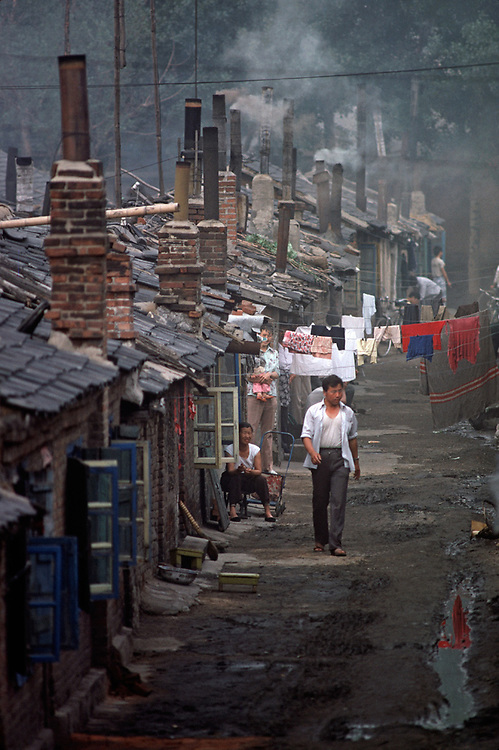
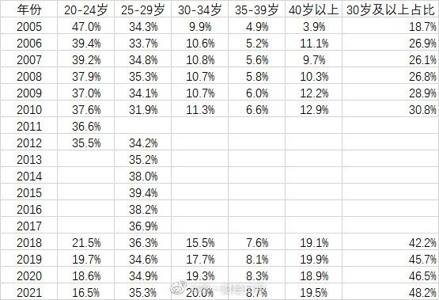

啰里啰唆是一份针对互联网和生活爱好者的数字杂志，旨在发现和分享一切有趣的东西。话题不固定，每期大约十五分钟阅读量，暂定每周四发布。部分内容来自互联网采编，如果为有来源的转载，均会注明转载地址或保留水印。

这是一个关注人文和科技的newsletter。

啰里啰唆周刊第28期：从迷信到不信，从不信到相信

# 科技日常

## 1. 电子包浆，图片做旧
支持 图片绿化、虚拟水印、虚拟传播年份、高效率模糊、浮雕锐化、噪点颗粒、像素不对齐、作假多次包浆绿化 和 基础 对比度、亮度调整 以及 波普重复功能😈

效果如下

为什么要包浆？一方面是为了规避比较简单的大言论监控和图片识别，另一方面是出于隐私和版权等原因不想给对方高清图。

https://magiconch.com/patina/

作者还有另外一个项目，https://lab.magiconch.com/vaporwave/，用途相似。

我记得两三年前（2020前后），苹果手机发送微信表情，转发几次也有自动包浆效果，不知道苹果优化了没。

## 2. LUKS
之前在群里，听到大佬说放公司的树莓派被公司运维给拆了，然后改了/etc/shadow文件，绕过了root密码校验，登录上去窥视一番。对于这种能接触到物理硬件的条件下，操作系统层面上的用户权限是没有任何用的。

但是，如果是Windows操作系统的话，开启BitLocker，直接对磁盘加密，是可以做到防止别人拆了你的硬盘或者用live cd的方式直接读取硬盘数据的。BitLocker可以对操作系统所在的分区进行加密，从某些角度来说，Windows的安全性是胜过Linux的，比如Windows上的无限数量不占用空间的还原点创建和秒还原技术。BitLocker为啥可以加密Windows所在的分区？这是因为Windows Boot Manager可以在Windows启动前“独立”解密BitLocker分区。

Windows Boot Manager先把内核和各种驱动（包括BitLocker、磁盘有关的驱动）解密出来，然后就把控制权转交给Windows。借助BitLocker驱动（fvevol.sys），Windows也可以自由读写被加密的分区了，然后可以继续照常启动。你可以简单地这么理解，windows系统，其实不止一个操作系统系统，一个面向底层的Windows Boot Manager，一个面向用户的Windows Desktop Operation。

其实安卓也是类似，存在两个操作系统，一个可信系统，一个用户系统。

Linux还没有能达到BitLocker这种级别的加密技术。虽然Linux上确实有些类似BitLocker的技术，但是无论是功能和易用性都差BitLocker一截，很多也不再更新维护了。如果非要挑一个的话，那就是LUKS了。

LUKS （Linux Unified Key Setup）是 Linux 硬盘加密的标准。 通过提供标准的磁盘格式，它不仅可以促进发行版之间的兼容性，还可以提供对多个用户密码的安全管理。LUKS的主要工具就是cryptsetup了。

网上文章提到LUKS，基本都只谈加密分区，但闭口不谈加密操作系统，原因就是cryptsetup最大的问题是难于对根分区进行加密。如果只是加密一块新加的硬盘和非根分区，那也算简单。但是加密之前需要是新硬盘或umount，对于/根分区，不可能umount后还执能执行cryptsetup命令，这是鸡生蛋，蛋生鸡的问题。

如果非要用cryptsetup加密根分区，实现Windows那种对操作系统所在分区进行加密的效果，也是可以的，但需要绕一下，可以用U盘上的live cd启动一个U盘系统来运行cryptsetup来加密硬盘上的操作系统，可以参考此文：https://opencraft.com/blog/tutorial-encrypting-an-existing-root-partition-in-ubuntu-with-dm-crypt-and-luks/

## 3.Facebook 加密了 URL 的查询字符串
有一些 URL 的查询字符串用来追踪用户，Firefox 现在可以自动剥离这些查询字符串。结果，Facebook 居然修改了自己的 URL，把查询字符串加密了，让你无法剥离，真是叹为观止。

https://www.ghacks.net/2022/07/17/facebook-has-started-to-encrypt-links-to-counter-privacy-improving-url-stripping/

小扎这个家伙呀，真是坏得透顶。从2012年起宣扬中国女婿，几次进军中国大陆市场失败又公开反华，言行不一反复摇摆，就已经看出他是个唯利是图的商人，为了利益可以出卖一切。

## 4.Github将下线trending模块

GitHub Trending 页面突然挂上了一则宣布 “即将下架” 的通知：

> 
Heads up! This Trending tab is being deprecated. Due to low usage of Trending Repositories and Trending Developers, this tab will no longer be available beginning September 30, 2022. For questions and feedback, please visit GitHub Community.

有用户认为无论 GitHub Trending 页面的使用率低或高，它产生的噪音远大于价值，这只是一个廉价的营销工具，支持 GitHub 的做法，并表示此举对打造健康和诚信的社区环境是一件好事。

 GitHub Trending长期被一些中文垃圾项目霸榜也是一个被吐槽了好几年的问题，比如 https://www.oschina.net/news/108334/chinese-repos-are-ruining-the-github-trending-page

看了下中文圈评论，支持砍掉的开发者比较多，中文圈苦github trending营销久矣。有个小技巧，在查看trending的时候，可以根据Spoken language进行筛选（默认会根据你的系统语言设置显示中文trending）

## 5.知乎在移动和桌面嵌入盲水印

在豆瓣添加盲水印（2022年3月）之后，另一个社交平台知乎被发现在移动端和 Web 版本嵌入了难以察觉的水印，这意味着如果用户在登陆状态下截图，知乎可以通过水印查出截图者的身份。Web 端隐写的内容分两部分，第一部分是用户的 ID，第二部分是打开网页时候的 Unix 时间戳（毫秒）。

水印使用JavaScript和CSS实现，用户在桌面端可以使用 Greasy Fork 脚本，或者把截图二值化处理来避免暴露隐私。

### Web 端复现方法

1. 在知乎 Web 端登录知乎账号。
2. 在主页或各回答页面截图。
3. 通过 [图片盲水印在线工具](https://stegonline.iculture.cc/) 的 Random Color Map 模式辨别水印。 

### 可能造成的影响

1. 如果用户在登录知乎的情况下进行截图，并且分享截图，其他人得到截图后**有很大可能将可以获知截图者所登录的账号**。
2. 如果用户在登录知乎的情况下进行截图，并且分享截图，其他人将可能可以获得截图者所登录账号的唯一标识码。**恶意者将可能可以通过将这个标识符附加在其他截图上，伪造标识符泄露者用户的截图行为**。

据网友反应，海外IP暂未复现，但也需要注意。

# 读书与影视分享

## 1.奥尔加ㆍ格鲁辛小说《排队》
USSR时期，排队是人们习以为常的事。无论是买肥皂、买肉、买面包，都需要排队。
有一个笑话是这么讲的

> “What is something that is green, long and smells of sausage? A tram from Moscow.”

（注：看懂这个笑话需要一点历史背景，The shops in Moscow were better-stocked with meat and other goods, and thus attracted provincial shoppers from as far as 100 miles away.）

还有一则是这样的

> There is a 10-year wait to get your own car, and you have to put up the money in advance. One man laid down the money, and the fellow in charge says to him: “Come back in 10 years and get your car.”
>
> The man asks: “Morning or afternoon?”
>
> “Ten years from now, what difference does it make?”
>
> The man replies: “Well, the plumber is coming in the morning.”
>

排队导致了一个额外的效应，就是 The USSR patted itself on the back for being the world’s “most well-read country”. A 1966 study found that Soviet citizens spent roughly 11 hours a week reading books.

奥尔加·格鲁辛的小说《排队》灵感源自USSR一次长达一年的排队事件。

大变化三十七周年纪念日那天，安娜下班回家，走了一条不同往常的路。这个选择让她毫无征兆地卷入了一次长达一年的排队，而她渐渐发现，疏离自己的母亲、貌合神离的丈夫、青春叛逆的儿子也身陷其中。一家四口的生活完全被这次排队打乱，而这一切都源自一位流亡音乐家即将归国演出的传言……

>  那天下午，回家的路上，她发觉自己在一个拐角停下，然后觉得有些窘迫，便继续直走。然而，那天夜里，天亮前湿濡的朦胧时分，风吹得他们六楼的窗玻璃当啷作响，世界笼罩在铅色之下，她梦见自己转向左边，走到摆着售货亭的那条路。梦里那条路不似现实中的，在暗淡的事后回想里，她记得那条小路的一端是一座废弃的老教堂，另一端尽头是一道篱笆，犹如一张绽开笑容的嘴，露出稀疏的牙齿，道旁阴森森地立着一排六层楼。

> 不时有谣言传开。人们传说是进口水晶或绝妙的玩具，或者独家书籍订购，或者政府发售的新彩票，有机会赢一部轿车或者海滨度假。有个富有生意头脑的男子最近开了赌注，打赌那个神秘之物最后开售的日期和确切时刻。当然也有怀疑者——“冷漠、干枯的灵魂”，安娜身后一个男子嘟哝道——他预测最后卖的会是一些可怜又可笑的东西，比如听装汤或者火柴。他经常走到队伍这边，奚落这些笃信的蠢人，嘲笑他们不惜冻僵自己各个身体部位。但住在附近的很多人都养成了习惯，每周来这个售货亭前排一两小时的队，以防万一。更有些人乘电车老远赶来，除了家庭主妇和领抚恤金的之外，还有其他不少人每天来排队。听到越多，安娜就越发有一种生活要起变化的预感，尽管她不知道是小变化还是无限的大变化。不过，无论如何，她想着，总归是会让她和家人更快乐的东西，或者给她的日常生活增添一点简单的美感，甚或注入她的整个存在，渗进这个存在的裂缝和空虚里，将其编织得更紧密、更灿烂、更饱满。

小的时候，看到一篇90年代的中学语文课外读本，上面有一篇文章，提到俄语没有“插队”这个单词。

> 1994年，国内一个代表团到俄罗斯考察交流。这天晚宴，宾主气氛融洽，大家畅所欲言，为了说明俄国文化在中国如何受欢迎，中方一人提到了在中国热映的电影《莫斯科不相信眼泪》，大谈当年人们抢购电影票时排长龙、加塞儿等热闹场面。在一旁口译的随团翻译忽然为难了，因为他搜肠刮肚，也没有找到和“加塞儿”相对应的俄语单词，于是他只好将“加塞儿”的情景描述出来，然后问俄国人这种情况在俄语里应该怎样表述。“流氓！这完全是一种缺乏道德和修养的流氓行为！在俄语里还有别的单词表述这种行为吗？没有，只有流氓！”俄国人的回答被翻译成中文后，中国代表团的每一个成员都被深深地刺痛了！

原文大致如此，但是没有《莫斯科不相信眼泪》这样的桥段，显然是在互联网传播后二次修改的。这种说法，真实性未知，但结合当时历史，插队估计要被毒打的，另外有权人根本不需要插队。**没有插队，很多时候是因为不需要插这一队而已。**

计划经济时代，路不拾遗，可能不是风气好，而是没有遗可以拾，是同一个道理。当然，那个年代，所谓路不拾遗也只是90后的无知幻想。

## 2.电影《健忘村》

《健忘村》是由北京影行天下文化传播有限公司出品的喜剧片，由陈玉勋执导，舒淇、王千源、张孝全领衔主演。影片于2017年1月27日晚20:00在中国大陆上映。

《健忘村》的故事发生在一片世外桃源般的村落里，传说此地风水有帝王之相，石员外（曾志伟 饰）觊觎村中龙脉，企图与土匪联合屠村。有一天，一声惨叫打破了裕旺村的宁静，村民朱大饼意外中毒身亡，大饼的妻子秋蓉（舒淇 饰）成为了最大嫌疑人，这时“天虹真人”田贵（王千源 饰）手持神秘宝器“忘忧”路过村子。据说“忘忧”可以洗去人的记忆，控制人格。从此裕旺村变成了健忘村。荒诞爆笑，阴谋不断，其乐融融的世外桃源背后隐藏着一场血雨腥风。
   这是一部非常残忍冷酷的电影，即使导演用美术和音乐包上了一层美味的糖衣。音乐和剧情反差极大，人物和行为反差也极大。看起来醇厚的村民，凶残狡诈，最后大家欢乐地抢钱让人想到《香水》中最后大家被欲望驱使的一幕；可爱的邮差们，你几乎不能相信他们真的是杀人的土匪，可是刀刀见血，而且充满残忍的快乐；但很快他们又被村民和傻子绞杀。没有人是好人，也没有人不残忍。

影评：
1.很像动物庄园，循环往复，迎来的却还是同样的剥削者。

2.与奥威尔的冷峻思辨不同，影片导演在极力的遮掩并包装这种关于意识形态的讽刺。影片借用一个虚构的故事背景（虽然说是民国，但完全跳脱于书本中的民国），将一些看似深沉的话题包裹在故事当中，表面戏谑着嘲弄着一切洗脑式的文化枷锁，其实内核里则完全是创作者关于现实社会的隐喻与反思。

3.以桃花源始，以桃花源终。

# 图论

## 1.外國攝影師鏡頭下的中國1985

作者：Alain Le Garsmeur

https://alainlegarsmeur.photoshelter.com/gallery-collection/China-1985/C0000zW7zrZb4rNY

## 2.中国结婚年龄越来越迟
民政部最新公布的《2021年民政事业发展统计公报》（下称“公报”），第一财经记者根据公报公布的2021年结婚登记人口年龄分布数据计算，总体看，30-34岁和35-39岁这两个年龄段的占比都创下了近年来的新高。若以30岁为界来看，30岁以及以上人群占比合计达到了48.2%，比上一年度提高了1.7个百分点，创下了新高。整体而言，中国结婚年龄越来越迟。 

## 3.Graphic Novels For Visual Readers 

图片源自网络，多人创作。其中The Nice House On The Lake是来自DC公司的官方漫画创造。

# 谈天说地

## 1.番荔枝和鸡嗉子果
番荔枝（学名：Annona squamosa Linn.，又号 佛头果，赖球果）番荔枝科、番荔枝属落叶小乔木；树皮薄，灰白色，多分枝。叶薄纸质，椭圆状披针形，叶背苍白绿色；侧脉上面扁平，下面凸起。花单生或2-4朵聚生于枝顶或与叶对生，青黄色；花蕾披针形；萼片三角形，被微毛；外轮花瓣狭而厚，长圆形；雄蕊长圆形，药隔宽；心皮无毛，每心皮有胚珠1颗。果实由多数圆形或椭圆形的成熟心皮微相连易于分开而成的聚合浆果圆球状或心状圆锥形，无毛，黄绿色，外面被白色粉霜。花期5-6月，果期6-11月。

中国浙江、台湾、福建、广东、广西、海南和云南等省区均有栽培。原产热带美洲；现全球热带地区有栽培。果食用，外形酷似荔枝，故名“番荔枝”，为热带地区著名水果。

释迦果和番荔枝其实是同一种水果，只不过叫法区别而已。番荔枝可不大像荔枝，但是有一种果实，非常像荔枝，那就是鸡嗉子果，也叫山荔枝。

鸡嗉子果，为山茱萸科山茱萸属植物，常绿小乔木，高3-15m，果序扁球形，成熟时紫红色；总果柄粗壮，长4-7cm。花期5-6月，果期9-10月。分布于西南及浙江、湖北、广西等地，尤于云南产最多。

虽然外貌像荔枝，但是口味差很多了，鸡嗉子果没有荔枝那样的甜味，而且里面有很多小籽，但是有一股独特的味道，怎么描述呢，就是略涩，但又带点甜，吃多了会醉那种味道，所以果实也被拿来酿酒。

## 2.傈僳文与佤文

> 中国的文字发展历史，尤其是西南少数民族文字，传教士发挥了很大的作用。除了传教士外，也有少数民族借用汉字，按汉字“六书”造字法创造一些新字。

傈僳族主要聚居在云南省西北部怒江傈僳族自治州以及四川省的凉山彝族自治州和攀枝花市，全国其他地区也有零星分布。傈僳族既是他称也是自称。这一名称最早见于唐朝时期的著述。时人樊绰在《蛮书》中称之为“栗粟”，认为是当时“乌蛮”的一个组成部分。到明代仍把傈僳看作是“罗罗”（彝族）的一个分支，明《景泰云南图经志书》说：“栗粟者，亦罗罗之别种也。”傈僳这一名称，除有关史籍用字稍有不同外，1000多年来沿用至今。

　　历史上傈僳族没有创立文字，只能口耳相传、刻木记事。20世纪初，维西县傈僳族青年汪忍波创制了共有1030个字的象形文字，这是傈僳族历史上的第一种文字；20世纪20年代初，英国人傅利叶和克伦族青年巴东以英文字母为基础创制出第二种文字，即老傈僳文；1913年，英国传教士王慧仁根据云南省武定、禄劝两县自称傈坡、他称傈僳人的语言，以武定县滔谷村语音为基础创制出了一种“格框式”的拼音文字；第四种文字是20世纪50年代由中央民族学院和中国社会科学院语言研究所以汉语拼音字母为基础创制、并经国务院批准使用的新傈僳文。目前，怒江傈僳族自治州境内各民族通用傈僳语和老傈僳文。

**佤文**

　　佤族主要居住在云南西南部的西盟和沧源两个佤族自治县，另外在孟连、澜沧、双江、耿马、镇康、永德等县也有分布。

　　20世纪30年代，英国传教士永文森到我国西南少数民族地区传播基督教时，曾以澜沧、沧源两县之间的安康、岩帅一带的佤语为基础，设计了一套拉丁字母形式的拼音文字，当地群众称之为“撒喇文”（撒喇为佤语“牧师”之意）。永文森等人使用这种文字翻译出版了《圣经》、《经文问答》、《赞美诗》等书，这些书发行量很小。

　　除此之外，佤族没有通用文字，人们用实物、木刻记事、计数或传递消息。木刻一般用0.5寸至1寸宽的竹片，长度不等，一边或两边刻口，以示意或记事。实物则表达特定的意思，如甘蔗、芭蕉、盐巴表示友好，辣椒表示气愤，鸡毛表示事情紧急，火药、子弹表示要械斗等等。

　　1956年派出少数民族语言工作者对佤族语言进行全面、深入的调查，并着手佤文的设计工作。1957年在昆明市召开了云南少数民族语文科学讨论会，正式通过了佤文方案（草案），创制了拉丁字母拼写的佤文字。1958年，云南省少数民族语言指导工作委员会和中国科学院少数民族语言工作者对佤文方案（草案）进行了修改完善。

refer:http://www.nlc.cn/cmptest/wmdwz/index.htm

## 3.中产不是社会的稳定器
人拥有的是有限理性，我们只能认识阶段性真理，无法认识终极真理。我们今天所坚信的，正是明天要推倒的，我们今天梦想的，正是明天苦难的源头。人类的认识永远无法到达绝对正确，所谓“天经地义”“从来如此”，都是狂妄的误会。生而为人，没有人有义务为谬误而牺牲。

通往地狱的路，也可能是动辄以“人民”自称，看上去勤劳、温和、朴实、智慧的人们铺就的，只是苦难之后，少有人反省。

https://mp.weixin.qq.com/s/KC-zFkPd0P4DoHnkt0xWBQ

## 4.从迷信到不信，从不信到相信
最近几天，柳智宇还俗，月薪两万加入心理咨询公司的新闻火了。对此，世说纷纭，有人说他是缺钱了，也有人说他这个级别根本不缺钱，是普渡众生。谈金钱太俗，谈普渡太虚。

关于柳智宇的简介，我觉得这里就不必赘述了，网上文章很多，也有很多有深度的文章，比如这篇（https://zhuanlan.zhihu.com/p/52755525）

如果你能理解柳的出家，就能理解他的还俗。

我的家族是一个百年佛教世家，父辈和奶奶辈均循遗嘱投身佛教近三十年，故而从小耳濡目染。家父对佛教极度笃诚，任寺庙主持多年，自学了数百本佛教典籍和磁带，能掌多种法器，带领一众徒弟们高声唱诵。

家父最得意的就是自己的法器和唱功皆佳（佛门典籍，有咒有经有忏，有独白的有集体唱诵的，法器和唱诵是较难的），常去省城跟大和尚斗法，自诩方圆百里最精学之人。

这么讲，你也许觉得家父是得道高人，当宽厚仁慈；家族当和睦相处，谦和有礼。然而并非如此。

除去佛教这身外衣，家父还是出家的那个家父，几十年没变。自负，好夸夸其谈，从不认错，苛刻而又不自知。家父二十几年前开始收徒，从二十多岁的小伙子，到六十多岁的老太太，从同村到几十里外的乡镇，这么多年收了几十个徒弟，一路走来，终于还是没留下一个徒弟，常常落到做法事凑不够人，不得不找老对手帮忙，甚至把我弟，我叔等闲人叫上。

我有时常想，家父的确好学，虽有一些天赋但又不足。几十年来，身边学佛的人十几个，有出有进，但是有谁真的达到了无所欲，存善念的境界了呢，依我的浅薄所知来看，一个都没。

修行是一种自律行为。如果勘不破这一层，必将陷入自责与苛责的漩涡。我所认识的学佛之人，往往不是变得更宽厚，而是更极端。学佛之人，学了再久，也不一定入了行。

《天道》这部电视剧中，有一段丁元英去五台山拜访智玄大师时谈佛论道的台词，说的还不错。

> 智玄大师说：“敢问施主什么是真经？修行不取真经又修什么呢？
>
> 丁元英说：所谓真经，就是能够达到寂空涅槃的究竟法门，可悟不可修。修为成佛，在求；悟为明性，在知。修行以行制性；悟道以性施行。觉者由心生律；修者以律制心。有信无证者虽不落恶果，却住因住果，住念住心，如是生灭，不得涅槃。
>
> 智玄大师含笑而问：“不为成佛，那什么是佛教呢？
>
> 丁元英说：佛乃觉性，非人。人人都有觉性不等于觉性就是人。人相可坏，觉性无生无灭。即觉即显，即障即尘蔽。无障不显，了障涅槃。觉行圆满之佛，乃佛教人相之佛。圆满即止，即非无量，若佛有量，即非阿弥陀佛。佛法无量即觉行无量。无圆无不圆，无满无不满。亦无是名，究竟圆满。
>
> 佛教若以次第而分，从精深处说是得到天成的道法。道法如来不可思议，即非文化。从浅义处说是导人向善的教义。善恶本有人相、我相、众生相，即是文化。从众生处说是以贪制贪，以幻制幻的善巧。虽不灭败坏下流，却无碍抚慰灵魂的慈悲。
>
> 智玄大师说：“以施主之文笔言辞断不是佛门中人，施主参意不拘经文，自悟能达到这种境界已属难能可贵。以贫僧看来，施主已经踩到得道的门槛了，离得道只差一步，进则净土，退则凡尘，只是这一步难如登天。
>
> 丁元英说：“承蒙大师开示，惭愧！惭愧！佛门讲一个‘缘’字，我与佛的缘站到门槛就算缘尽了，不进不出，亦邪亦正。与基督而言我进不得窄门，与佛而言我不可得道。我是几等的货色大师已从那首词里看得明白，装了斯文，露了痞性，满纸一个‘嗔’字。今天来到佛门净地拜见大师，只为讨得一个心安。
>

龙泉寺并非一片净土，理想化的柳智宇在一个封闭化的寺庙，遭遇着世俗化的浸染，还俗是难免的。这也是他从迷信到不信的一个变化。从迷信到不信难，从不信到相信更难。

得道之人并非没有，但修行之路颇为艰难，如果没有异乎常人的坚韧内心和极好的机缘（师父，环境），是很难成功的。而龙泉寺和学诚法师，并不是柳智宇的好机缘。有人为柳智宇的还俗感到遗憾，我觉得这倒挺好，回归了真实，做回真实的自己。小隐于野，大隐于市，修行不一定要出家，出家对修行也未必有那么大裨益。

有文章说柳智宇不是真正的出家人，佛学功夫不够，或许是这样，但还俗对他而言，反正不是坏事吧。

我觉得他要是能大嘴吃肉，大口喝酒，养好身体，这就挺好。

# 一句话快讯

1.英伟达（Nvidia）通过 SEC 发表[公告](https://www.sec.gov/ix?doc=/Archives/edgar/data/1045810/000104581022000146/nvda-20220826.htm)，美国政府在 8 月 26 日通知它实施新的许可要求，即时生效。新要求限制向中俄出口 Nvidia A100 和 H100 GPU，以及未来性能强于或类似 A100 的新 GPU。

2.北京时间9月5日12时52分，四川甘孜藏族自治州泸定县发生6.8级地震，震源深度16公里。截至5日20时30分，地震已造成72人死亡（其中甘孜州38人、雅安市34人）。

3.教育部教师工作司司长任友群在6日召开的新闻发布会上表示，十年来，教师资格考试和定期注册制度全面实行， 教师资格考试报名人数由最初的17.2万人次跃升至今年的1144.2万人次。

# 联系方式

使用方法建议或素材提供

邮件：bairadish@gmail.com
频道：notonlyshare