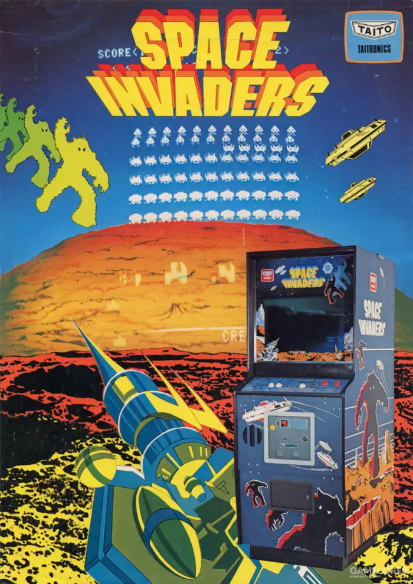

啰里啰唆周刊第29期：人间师格

# 科技日常

## 1.  USB4 v2 支持最高 80 Gbps 的数据传输

   USB 的命名方案日益令人感到糊涂。USB Promoter Group [宣布](https://arstechnica.com/gadgets/2022/09/usb-c-naming-to-somehow-get-worse-with-usb4-version-2-0/)了 USB4 v2 标准，其数据传输率最高能达到 80 Gbps ，两倍于现有的 USB4 v1 标准——但有的 USB4 v1 只支持最高  20Gbps 而不是 40Gbps。原因是 USB Type-C 连接线与 USB  协议的其它规格是分开的，连接线可以相同，但支持的传输率并不相同。

USB Type-C 支持的 USB 规格包括了 USB4 2.0、USB4  1.0、USB 3.2 Gen 2x2、USB 3.2 Gen 2、USB 3.2 Gen 1 或 USB 2.0，以及英特尔的  Thunderbolt 协议。英特尔在 2017 年宣布免除 Thunderbolt 3 的版税，将其捐给 USB Promoter  Group，USB4 就是基于 Thunderbolt 3 协议。                


## 2. Fcitx5 Android输入法
Fcitx5的安卓实现。

优点：开源，无广告，不偷隐私，不要求联网权限，支持CJK扩展区输入，开箱即用
缺点：中文输入不支持九宫格

由于不联网，故不支持国产输入法的云联想功能，输入效率略低，但支持本地联想功能，所以输入效率不会太差。

可能有读者会提到，不偷隐私的中文输入法还有一款Rime输入法，在手机端称“同文输入法”。该输入法通过插件和修改配置可支持九宫格，但配置和使用极其困难，无法开箱即用，通常需要导入其他人的配置文件。

虽然Rime可以通过一些配置和脚本实现九宫格，但是我在配置的时候，界面上实现了九宫格，但是功能使用有问题。因此不推荐Rime，除非你有特殊需求，比如粤语输入，方言输入，Rime最大的用途还是扩展输入法，作为输入法框架来使用，而不是作为日常输入法。

https://github.com/fcitx5-android/fcitx5-android

但是国内手机有个很不舒服的地方，你可以新增一个输入法，但原厂输入法不可卸载，让洁癖患者很是不舒服。

## 3.giffgaff电话卡使用指南
前几日买了张英国的giffgaff电话卡，使用下来体验不错，供有需求的参考。

giffgaff是英国的一家移动网络运营商，也是最受中国留学生欢迎的电话卡之一。Giffgaff属于虚拟运营商，隶属 O2 UK 旗下子公司，但其提供的号码不属于虚拟号。

giffgaff卡在官网可以申请免费邮寄，但是由于众所周知的疫情和各种管控的原因，海外平邮想要到达中国是极其困难的，因此不建议对海外邮寄报多大期望（至少需要一个月）。如果你没有平信地址，就没必要申请了，因为收不到，丢信率在 75%（官方会将电话卡通过平信方式寄到你的地址）。

> 一个小常识，平邮不是快递，是不会送货上门的，一般是送达收发室或至当地邮局自行领取。收发室和邮寄也不会通知你本人的，需要自行去查询、领取。一般而言，普遍家庭地址是不可以收取平信的。
>

建议在淘宝和京东，或者亚马逊花十几块购买。收到 Giffgaff 电话卡后，直接插卡是无法激活的，用户需要到 Giffgaff 官网电话卡激活页面输入电话卡上卡板的 6 位 Activation Code，这个时候就会跳转电话卡充值页面。充值需要支持英镑的信用卡或海外版paypal，中国特供版paypal并不支持。没有上述渠道的可以找人代充或者直接购买充值激活过的SIM卡。

在国内，插卡后显示中国移动或联通4G信号，信号还是比较理想的，号码是+44区号+10位手机号。此卡不支持中国电信漫游。

这个卡在欧洲资费是非常便宜的，但是在欧洲以外地区属于漫游，费用就比较贵了。

具体资费如下：
0月租
收短信免费
发短信0.3英镑/条
接打电话0.2英镑/分钟
数据 0.2英镑/M

所以不要在大陆用它上网或接打电话。在大陆漫游时，有来电响铃也不要拒接，拒接也会收取漫游费用，直接等响铃停止就可以。

另外，这个卡需要每半年使用一次扣费服务（收短信不保活），即保活。相比Google Voice号码，giffgaff的获取更容易，而且由于不是GV那样的众所周知的虚拟号，注册国外服务的限制更少。

> 不建议将微信号转移到WeChat 账号，会导致用户在内地无法使用某些服务（如人脸识别），尤其是你在办理政务服务的时候，所以我个人建议是使用 Giffgaff 电话卡注册个新的 WeChat 账号


官网：https://www.giffgaff.com/
详细攻略：https://tsb2blog.com/giffgaff-sim-card

## 4.Facebook 登陆按钮逐渐从各大网站上消失

作为美国最大的社交平台，Facebook 登陆按钮曾经无处不在，用户可以使用自己的 Facebook 账号登陆不同网站，无需创建新的用户名和密码。但今天愈来愈多的网站移除了 Facebook 登陆按钮。戴尔、百思买、福特、Pottery Barn、耐克、Patagonia、Match 和亚马逊旗下的 Twitch 都取消了 Facebook 登录功能。戴尔高管 Jen Felch 解释说，安全、隐私和数据共享等方面的担忧促使人们不再使用社交网站登陆。Facebook 登录功能的消失也是社交巨人影响力减弱的最新迹象。过去一年，Facebook 的广告业务受制于苹果加强对隐私的保护，本身的增长面临来自字节跳动短视频应用 TikTok 的激烈竞争。 

https://www.cnbc.com/2022/09/08/facebook-login-button-disappearing-from-websites-on-privacy-concerns.html

## 5.《塞尔达传说王国之泪》将于明年五月上市

在 9 月 13 日举行的任天堂直面会上，备受期待的《塞尔达传说旷野之息》的续篇《王国之泪》[宣布](https://youtu.be/2SNF4M_v7wc)于 2023 年 5 月 12 日发售。《[王国之泪](https://en.wikipedia.org/wiki/The_Legend_of_Zelda:_Tears_of_the_Kingdom)》的开发始于 2017 年《旷野之息》完成之后，首部预告片于 2019 年 E3 展会上公布，在 E3 2021 上任天堂宣布游戏将在 2022 年上市，2022 年 3 月游戏宣布延期一年发售。《旷野之息》是任天堂最畅销的游戏之一，至今销量超过 2700 万。


## 6.Img2img 图像合成算法AI把老游戏的图形优化成细节丰富的样子

大上周，Reddit上名为 frigis9 的用户发布了6张图片，其中包含对经典 MS-DOS  计算机游戏的图形优化，有《Commander Keen  6》和《猴岛的秘密》中的画面。最有趣的部分是他是如何做到的：使用被称为“img2img”(图像到图像)的图像合成技术。该技术先获取输入图像，应用书面文本提示，生成类似的输出图像作为结果。


这是稳定扩散图像合成模型(Stable Diffusion image synthesis model )新发布的功能。Stable Diffusion 的一大优势是能运行在单张显卡上，包括苹果的 M1 Mac GPU，因此用户可在本地运行。

在和其他用户交流时，frigis9 提供了更多关于如何使用名为 Visions of Chaos  的前端程序制作图像的详细信息，后者是多功能应用程序，可以生成许多不同风格的计算机合成艺术品：“像这样的简单肖像，将初始图像强度设置为0.25。对于较暗、细节较少的图像，可能必须将其提高到 0.35 或  0.4。只需要摆弄图像强度值，一旦你找对路子了(即你的输出图像多少看起来像初始输入图像了)，在提示下添加或删除细节。调整，冲洗并重复大约一百次，直到你得到完美的(嗯，足够好)图像。

图像合成结果的质量，目前需要大量的试验和精心的挑选，才能实现frigis9发布的效果——可能需要数小时的工作。但是随着图像合成技术和GPU能力的进步，我们可以预期，未来的图形优化技术可以把老像素游戏的画面变得更加丰富细腻。

https://arstechnica.com/gaming/2022/09/pixel-art-comes-to-life-fan-upgrades-classic-ms-dos-games-with-ai/

就如正文所说，新发布的Stable Diffusion可以在本地运行。

微博用户@分形_噪波 制作的[简易教程](https://www.bilibili.com/read/cv18495050)，以及提供的 [本地网盘版下载链接](https://pan.baidu.com/s/1pB9iwdD43DyL-phYUJqBHQ?pwd=qh42)。文件有8G。

如果需要原汁原味的官方版，可以从[GitHub下载](https://github.com/sd-webui/stable-diffusion-webui)。但原版需要配置环境变量。

网盘版把模型和环境文件都配置好了，只需要安装miniconda然后把相应文件夹按照步骤放置到相应位置就可以较简单地配置完环境使用。

详细步骤：
```bash
1.安装miniconda3，安装中勾选为所有用户安装，建议装在默认路径不要改
2.把ldo文件复制到安装目录的envs文件夹中，默认路径是C:ProgramDataMiniconda3envs
3.在一个空间富裕的盘新建一个文件夹，将stable-diffusion文件夹复制进去
4.找到文件夹中的webui.cmd文件，右键编辑，将第四行的set cutom_conda_path=后面改成minicoda的安装目录，默认是cutom_conda_path=C:ProgramDataMiniconda3，保存
5.运行webui.cmd文件 耐心等待 中间报错的话尝试关闭梯子或打开梯子，反复尝试
6.最终命令行中会出现一个地址，复制到浏览器中就可以使用了
```


# 读书与影视分享

## 1.豆瓣9分电影《超脱》（美国2011年托尼·凯耶执导）
 又名《人间师格》。

《超脱》是2011年4月于美国上映的剧情类电影，由托尼·凯耶执导，艾德里安·布洛迪、克里斯蒂娜·亨德里克斯主演。

亨利•巴赫特来到社区学校担任代课老师。学校因学生反叛、经营不善而濒临绝境，多丽丝（刘玉玲 饰）为首的一批教师备受煎熬。亨利的第一堂课就遭遇了顽劣学生的挑衅，但是被他巧妙地化解。他赢得了女教师萨沙的好感。同时，他的教学方式引起了同学们的兴趣，其中就包括因肥胖而苦闷的梅丽迪斯。她一直默默地承受着因体重带来的各种责骂与嘲笑。但是因为老师，她似乎又找到了一切的理由……

但是，亨利其实内心也有很大的压力，他的爷爷处于弥留之际，他的母亲自杀阴影始终在脑海中萦绕。某天夜里，他在公车上黯然神伤，独自流泪。这情形被一个刚受到嫖客凌辱的雏妓艾瑞卡看到了。她尾随他，希望获得他的帮助。他起初拒绝了她的要求，后来他还是把她带回了单身公寓……


影评：
1.这是一部不推荐看的好电影。没病的都要看出病的。好的作品分两种，一是发现世界的极美，二是挖掘人间的极苦。这部就是后者。

2.“我的灵魂与我之间的距离如此遥远，而我的存在却如此真实。”——加缪

3.勿被片名误导。此片充满无处不在的郁抑及沉重。所有人对自己都毫无办法。指望他者解救自己的苦难永远只是一时，因他自顾尚且不暇。即使慈悲到收留你，也有天要离开。总之，就像那位代课教师一样，此片只是给了一个若即若离的拥抱，并未试图解决片中人物或观众的任何麻烦，但无助的人，会被无情击中。

## 2.小说/电影《浪潮》
> 世界离独裁只有五天。

《浪潮》讲述的是发生在美国高中校园里的一个真实故事。教师本·罗斯本想通过一堂实验课使学生切身明白什么叫德国纳粹。为了实验他成立了 “浪潮”组织，提出一系列铿锵有力的组织口号，要求学生们必须遵守组织里的纪律，还专门规定了打招呼的手势，学生因游戏的心态而都自觉、绝对地服从着这些命令，而到了后来这些学生就习惯的会想象出来的一些“命令”，暴力威胁他人加入“浪潮”，并且互相监视和揭发，每个人却都没有意识到他们在不知不觉中滑向了“独裁”与“纳粹”的深渊……连组织者罗斯老师也迷失其中，沉浸在权力欲望和他人的崇拜中。直到外界施以压力，罗斯老师才意识到事态的失控，马上果断结束了这短短5天的实验。

该小说被改编成同名电影，豆瓣评分8.7分。


# 图论

## 1.以其人之道


作者: [Instagram](https://www.instagram.com/needle.wig/)

## 2.The Power Of Music


More info: [Instagram](https://www.instagram.com/admiralwonderboat/) | [Facebook](https://www.facebook.com/admiralwonderboat/)

# 谈天说地

## 1.电报与小马快递
1838年左右，莫尔斯发明了莫尔斯电码，同时研制出点线发报机。这个装置颇为巧妙，在当发报人将电路短暂接通后（也就是发出一个“滴”），接收装置上的纸带就往前挪一小格，同时有油墨的滚筒就在纸带上印出一个点，当电路接通较长时间后，接收装置上的纸带就往前挪一大段，同时油墨印出一个较长的线。接收人根据接收纸带上的油墨印迹，对应莫尔斯电码，就可以转译成文字。

莫尔斯的这套电报装置获得了美国专利，这堪称是人类历史上最重要的专利之一，因此该专利说明书被“供”在华盛顿的美国历史博物馆里。

电报的发明不仅在通信史上具有划时代的意义，也是人类文明史上的一件大事，从此人类进入了即时通信的时代。但是在电报发明之初，并非所有人都理解它的重大意义。由于当时的电报是有线电报，需要铺设电线（当时还没有输电线），而且在线路上还要安装和替换电池，因此成本较高，一开始并未得到快速普及。美国第一条城际电报线是从巴尔的摩到首都华盛顿，总长约64公里（40英里），于1844年建成。

到了1850年，美国东海岸（大西洋沿岸）的主要城市之间都能互通电报了。但是，西部加利福尼亚州的电报业务那时才刚刚起步，而连通美国更是遥不可及的事情。直到1860年，美国国会才授权给美国邮局每年六万美元的经费，用于电报线的建设，而穿越北美大陆的电报，则要等到1869年，这时距离莫尔斯发明电报已经过去了30多年。但是电报一旦开始普及，它带来的巨大社会效应便逐渐显现出来。以前通过快马邮车将消息从美国东海岸传递到西海岸需要20天时间，而通过电报则几乎瞬间便可完成。很快，当时最大的快马邮递公司——小马快递（Pony Express）就因为电报的出现而关门了。美国人画了下面这幅油画，一个穿着红色制服的小马快递员穿过正在架设的电报杆。


## 2.译介丨岩田聪1999年开发者访谈

**——请告诉我们您是何时进入电子游戏行业的。**

**岩田聪：**1978年，位于池袋的西武百货开设了日本第一家个人电脑展示角。我经常去摆弄那里用于展示的电脑，在上面运行自己写的程序，还在那里交到不少朋友，其中一个人刚投资了一家新公司，这就是后来的HAL实验室（HAL Laboratory）。当时我还在上大学，于是就在那里兼职。

《太空侵略者》（*Space Invader*）一炮而红之后，HAL决定尝试开发电子游戏，但当时的个人电脑配置还不够强大。我和朋友们创造了一种名为PCG（Peripheral Clock Generator）的硬件外设。老计算机爱好者可能听说过这种外设——它可以让没有图形显示能力的计算机显示出图像。有了它之后，我们便开始着手创造游戏：直接照搬南梦宫的《迷魂车》（*Rally-X*），《小蜜蜂》（*Galaxian*），以及其他南梦宫早期游戏。（笑）我们从来没问南梦宫要过授权——那还是行业初期，版权不像现在这样明确。

[](https://image.gcores.com/c839e367-4df9-4fcf-9c39-c44aac705d17.jpg?x-oss-process=image/quality,q_90/format,webp/watermark,image_d2F0ZXJtYXJrLnBuZw,g_se,x_10,y_10)

《太空侵略者》

不过请各位不要误解，我必须要指出，HAL也是第一家从南梦宫处获得电子游戏开发许可的公司。我听说南梦宫还曾拿这份合同作为与其他公司谈判的基础。

我就是这样通过HAL进入游戏开发（硬件开发）行业的。1982年我大学毕业后，全职加入公司，次年红白机和MSX几乎同时发售。公司在这两个平台上的游戏开发投入也大幅增加。

https://www.gcores.com/articles/156245


## 3.拐枣

拐枣，学名枳椇，又名万寿果、鸡爪连、金钩梨、拐枣儿、鸡爪子、龙爪等。因果实形态似万字符，故称其树为万寿果树。高大乔木，高可达10-25米,果实熟透可生吃，果肉多浆，无果核，种子裸露在果肉之外，味浆甜略有甘涩，亦可做汤，汤味独特醇香。果柄含多量葡萄糖和苹果酸钾，经霜后甜，可生食或酿酒，木材硬度适中，纹理美，供建筑及制家具和美术工艺品等的用材。

枳椇生于海拔2100米以下的开旷地、山坡林缘或疏林中；庭院宅旁常有栽培。分布于中国甘肃、陕西、河南、安徽、江苏、浙江、江西、福建、广东、广西、湖南、湖北、四川、云南、贵州，印度、尼泊尔、不丹和缅甸北部也有分布。。


拐枣有一变种，叫俅江枳椇，产中国云南西北部至南部（俅江、贡山、景洪、勐海、西畴、富宁、屏边）、西藏东南部（察隅）。

再过一个多月，就到了拐枣的食用季节了，不过可惜的是，这种水果目前市场上基本没有售卖。主要原因是分布地区不广，一般多为野生，果实可食用部分也不多，吃起来比较麻烦。

> 苏东坡集》中记载了这样一则故事：苏东坡的一个同乡揭颖臣得了一种饮食倍增、小便频数的病，许多人说是“消渴”。揭颖臣听从了一些医生的意见，服了很多治消渴的药，病非但不见好转，反而日渐加重。后来苏东坡向他推荐了一个名叫张肱的医生，张肱诊后认为此病不是消渴，而是慢性酒精中毒。酒性辛热，因此病人喜饮水，饮水多，故小便亦多，症状极似消渴却不是消渴。于是张肱用醒酒药为他治疗，多年痼疾就此痊愈。张肱所用的一味主药就是“枳椇子”。苏东坡不仅记录了这个小医案，还常以枳椇子作为醒酒良药向友人推荐。

解酒有没有用不知道，不过农村用拐枣泡酒的倒是挺多。

# 一句话快讯

1.当地时间9月8日，英国女王伊丽莎白二世在苏格兰巴尔莫勒尔城堡去世，享年96岁。查尔斯成为英国国王。

2.近日，安徽芜湖，网友发帖称芜湖一中组织高三学生进行跑操，导致十余名同学因肌溶解受到伤害。7日，芜湖一中发布通报，表示8月28日某班进行高强度下蹲和跑步训练，第二天部分女生感觉不适。经医院诊断，至9月4日，该班共有13位同学住院观察治疗，部分学生肌酸激酶指标为正常值1000多倍。

3.泽连斯基称解放6000多平方公里领土，美军官持谨慎乐观态度。

4.法国自由报消息：法国导演让-吕克·戈达尔去世，享年91岁。代表作有《筋疲力竭》《狂人皮尔洛》《轻蔑》《阿尔法城》《芳名卡门》《影像之书》等。

# 联系方式
啰里啰唆是一份针对互联网和生活爱好者的数字杂志，旨在发现和分享一切有趣的东西。话题不固定，每期大约十五分钟阅读量，暂定每周四发布。部分内容来自互联网采编，如果为有来源的转载，均会注明转载地址或保留水印。

这是一个关注人文和科技的newsletter。

使用方法建议或素材提供：

频道：notonlyshare

github地址：[https://github.com/iminto/luoliluosuo-weekly](https://github.com/iminto/luoliluosuo-weekly)