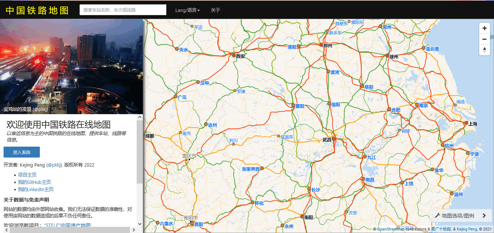
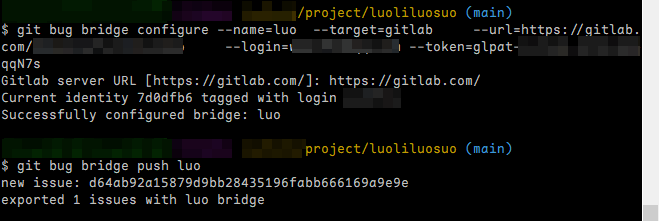
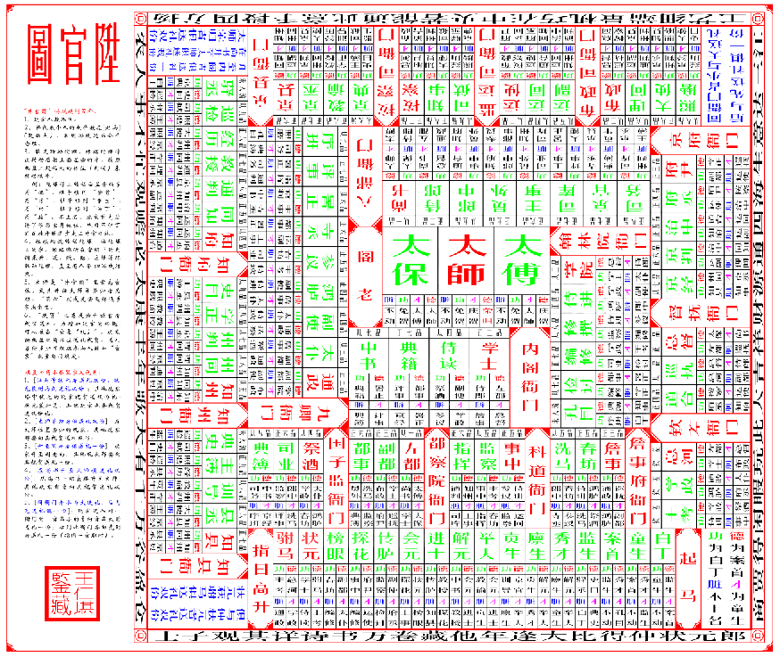
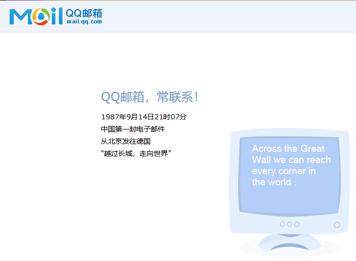

啰里啰唆周刊第30期：醉后不知天在水，满船清梦压星河。

# 科技日常

## 1. eCapture: 基于eBPF技术实现TLS加密的明文捕获，无需CA证书

eCapture的中文名字为旁观者，基于eBPF Uprobe/Traffic Control实现的各种用户空间/内核空间的数据捕获，无需改动原程序。

功能如下：
SSL/HTTPS数据导出功能，针对HTTPS的数据包抓取，不需要导入CA证书。
bash的命令捕获，HIDS的bash命令监控解决方案。
mysql query等数据库的数据库审计解决方案。

据作者介绍，主要原理是hook了/lib/x86_64-linux-gnu/libssl.so.1.1的SSL_write、SSL_read函数的返回值，拿到明文信息，通过ebpf map传递给用户进程。 而tcpdump(libpcap)是在数据包接收到，XDP处理后，进行clone packet，进行包的复制，发送给用户态进程。二者工作的所在层不一样。

官方网站： https://ecapture.cc
## 2. 百度的自然语言图像合成模型有敏感词限制

百度发布了自己的自然语言图像合成模型 ERNIE-ViLG，有中国视频主播[对比](https://www.bilibili.com/video/BV1Ug411U7VL/)了用 ERNIE-ViLG、DALL-E 2 和 Stable Diffusion 等不同模型生成的图像，认为 ERNIE-ViLG 产生了更精确的图像。

百度在 Hugging Face 上发布了 ERNIE-ViLG 的 [DEMO](https://huggingface.co/spaces/PaddlePaddle/ERNIE-ViLG)，用户很快注意到与 DALL-E 2 和 Stable Diffusion 等 AI 模型的区别：**有敏感词限制**。输入某些词语会返回“存在敏感词，请重新输入”或者“输入内容不符合相关规则，请调整后再试！”	

https://www.technologyreview.com/2022/09/14/1059481/

## 3.中国铁路地图
这个网站可以查看全国铁路的路线图。
但是需要注意的是，因法律原因地图显示功能在中国大陆区域不可用，需要承诺自己不在大陆境内方能查看大陆地图。

http://cnrail.geogv.org/zhcn/about

## 4.市值2000亿美元以太坊切换到权益证明，矿工涌向 ETC	      

第二大加密货币以太坊[完成了](https://www.coindesk.com/tech/2022/09/15/the-ethereum-merge-is-done-did-it-work/)从工作量证明（POW）到权益证明(POS)的切换，此举让以太坊消耗的能量减少了 99.9%。以太坊是次于比特币的第二大加密货币，市值接近 2000 亿美元。

这次合并始于美国东部时间 2:43 AM，逾 4.1 万人在  YouTube 上观看了“Ethereum Mainnet Merge Viewing Party”的直播，大约 15  分钟后合并完成。在合并前以太坊能使用显卡挖掘，需要消耗大量能量，合并之后矿工们是不是关掉了矿机？答案是否定的，对以太坊分支以太坊经典（Ethereum Classic 或 ETC）[网络哈希率](https://2miners.com/etc-network-hashrate)的跟踪显示，它从 9 月 14 日的 60 TH/s 增加到了 15 日的 140 TH/s，翻了一倍以上，目前还在快速增长，显然矿工转移了阵地，耗电量未必能下降多少。					                          
## 5. git-bug
轻量级的，基于git的简单bug跟踪管理系统，单文件、跨平台，支持命令行和web ui，不依赖其他组件。

原理是将bug数据存放于.git目录下，使得bug track data集成到git中。当然，git-bug往.git下存放的文件，虽然是按照.git的存储格式来的，但**它并不属于git的一部分，git是不认识这些文件的**。

要想让其成为一个可交互的，多人使用的系统，需要配合git bug bridge来使用，即将其导入和导出到gthub/gitlab等集成平台。

如图所示：

这软件有个小bug，git bug bridge configure这一步，必须一次指定全部参数，不能使用其提示功能，step by step来配置，会报token格式不符的错。

这样就能在gitlab的issue看板看到bug列表了。按照这个操作逻辑，多人协作似乎还是很别扭，可以理解为依赖gitlab/github的API对issue进行管理。不过想一想，又不是不能用，毕竟不依赖数据库，不需要独立起服务。

https://github.com/MichaelMure/git-bug

## 6.Unicode 15.0 标准已发布，新增鹅、姜、驴、wifi等 emoji
Unicode 标准 15.0 版现已推出，包括核心规范、附件和数据文件。这个版本增加了 4489 个字符，使总数达到 149186 个字符。这些新增内容包括两个新脚本，总共 161 个脚本。此外，该版本还有 20 个新的表情符号字符和 4193 个 CJK（中文、日文和韩文）表意文字。

15.0 版中的新脚本和字符增加了对现代语言组的支持，包括：
 - Nag Mundari，一种用于书写 Mundari 的现代文字，Mundari 是一种在印度使用的语言。
 - 一个卡纳达语字符，用于在印度书写 Konkani、Awadhi 和 Havyaka Kannada 。
 - 卡克托维克数字，由阿拉斯加卡克托维克的伊努皮亚克人设计，用于因纽特语和尤皮克语的计数系统

新增的 21 个新的表情符号（emoji），包括 鹅、长笛、折扇、姜、豌豆、粉色爱心、驴、水母、wifi等等。

有关新 emoji 字符的完整列表，请参阅 [Unicode 15.0 的表情符号](https://unicode.org/emoji/charts-15.0/emoji-released.html) 。

Unicode 15的emoji已经达到了1874个。。。加上各种变体（颜色、形状、组合），上万了。

## 7.鱼了个鱼
羊了个羊纯前端实现版【鱼了个鱼】，自定义关卡+图案+无限道具。

在线体验：https://yulegeyu.cn
源码：https://github.com/liyupi/yulegeyu

# 读书与影视分享

## 1.科幻电影《维斯珀》(VESPER)

9月30日流媒体和影院同步上映，大陆地区大概率只能线上观看。

末日废土，巨大沉默机械，莫名生物。。。

在这个令人着迷的科幻反乌托邦中，一个13岁具有生物黑客才华的主角在未来的世界中生活，遗传生物实验已经消除了地球上所有可食用的植物及其大部分人类，地球生态已崩溃。但也留下了一些幸运的精英，在气候被控制的城堡和饥饿的食客中，在行星沼泽中陷入困境。13岁的Vesper与父亲一起生存，是否有能力改变这种状态？

预告片地址：https://www.bilibili.com/video/BV1TG4y1a7G6

因该片未上映，暂无更多细节和影评。

## 2.《回忆、悲伤与荆棘》三部曲
作者泰德·威廉姆斯，1957年生于加利福尼亚州圣何塞，美国著名幻想大师，漫画家和广播节目主持人。其代表作《回忆、悲伤与荆棘》三部曲正是受《魔戒》启发而来，更是乔治·马丁的启发者。马丁承认，正是读了威廉姆斯的书，他才顿悟奇幻文学“竟有这么多可能性”，并将创作重心转移到史诗奇幻上。

该系列一共有三卷，分别是《回忆、悲伤与荆棘 卷一：龙骨椅》、《回忆、悲伤与荆棘 卷二：诀别石》,《回忆、悲伤与荆棘 卷三：天使塔》。

本书建立在一个名为奥斯坦·亚德的大陆上，在这里居住着包括希瑟 （像精灵一样长生不老），坎努克人（像矮人一样的雪山居民）和其他种族，也有各具特色的人类民族。
几十年前，年轻的征服者约翰，亦称圣王约翰统一了大多数的人类王国，建立了一个统一的王国。但在故事一开始是，之前的圣王约翰已是老态龙钟，生命垂危。他死后，无法制止他的儿子们的争斗......
年轻的城堡小厮西蒙，整天幻想着他的骑士美梦，却无意间撞破真相，踏上了真正的冒险......

书评：
1.如同网上评论所说的确是魔戒过渡到冰火的作品。

2.马丁借鉴了若干元素，但人物和风格还是跟《冰火》相差很大。前面节奏太慢了，到了全卷3/4时才有类似魔戒《昔日阴影》的章节。还有主角光环太亮了，完全接受不能。当然亮点还是有的，三把剑的来历，精灵（希瑟）的设定。

3.传说引发了冰火的灵感，但可读性较差，多线叙事和POV视角，以及三把剑对应三条龙的设定，总体来说，精灵希瑟部分比人类好，可以说是得了托尔金面对逝去古典文明感伤的精髓，人物也是希瑟比人类更好，更偏激，更奋进，更悲伤，更目眦欲裂，西蒙则更像郭靖，像雪诺（应该说雪诺更像他），有超越了“麦考白”之处。

# 图论

## 1.AI绘图无处不在

国科罗拉多州上月举办艺术博览会， 夺得头奖的《太空歌剧院》是39岁游戏设计师Jason Allen的作品，该幅画作是Allen使用AI绘图工具Midjourney完成的。

虽然奖金只有区区几百美元，但对于真正「作画」的参赛者来说，没有生命的 AI，创作的作品超过了作为人类的自己，确实「伤害不大，侮辱极强」。但其实，随着 DALL-E、Imagen、Stable Diffusion 等开源 AI 模型的出现，任何人，只要会打字，简单的输入几个单词，就能生成各种风格的绘图画面——而不是简单的线条，而是真正的「作品」级别的画面。

**AI艺术创作最大的优势就是大规模训练加持下的，胜于人类千万倍的大开脑洞的创意，经过筛选，必然能出精品。**

AI既然能用来绘图，那么，食色性也，必然会点燃性这条技术路线。

最近，一个名为 [pornpen.ai](pornpen.ai) 的工具在 Reddit 上走红。嗯，顾名思义，它真的是一个「涩图」界的「神笔马良」——用户都不需要输入单词，只需要选择几个标签，就可以出现一张「大尺度裸露图片」。pornpen 的诞生，Stable Diffusion(Stability AI 最近发布的文字转图片生成模型) 模型功不可没。Stable Diffusion 训练数据，来自大规模 AI 开放网络项目 LAION 旗下的一个注重「美感」的数据子集 LAION-Aesthetics。

这是一个开源的 250TB 数据集，其中包含从互联网上抓取的近 59 亿张图像。这些图像中有相对较少的"NSFW"(Not Safe For Work) 图像。

## 2.Knock

More info: [Instagram](https://www.instagram.com/chezcuckoo/) | [twitter.com](https://twitter.com/Lienslasken) | [patreon.com](https://www.patreon.com/tlien) | [chezcuckoo.com](https://chezcuckoo.com/)

# 谈天说地

## 1.10 of the most legendary rulers from ancient history
A lot of people can be rather dismissive of ancient history, even using the term to refer to past events so remote as to be irrelevant. Nothing could be further from the truth, as the events and decisions made in antiquity continue to influence us to this day. To explore this, we’ll look at 10 of the most legendary rulers of ancient history, what they did, and why their decisions still matter.

For our purposes, “legendary” means “awesome” rather than “potentially not real.” A few kings and queens of old who may not have been real people, such as Gilgamesh, The Yellow Emperor, and the Queen of Sheba, are not included.

Additionally, what passes for “ancient” varies based on what area you’re talking about, so while all of the people on our list are long dead, a few of them were on the scene much more recently than others.

全文：https://bigthink.com/the-past/great-ancient-rulers/

## 2.中国媒体人往事（上）
1984，反乌托邦作家乔治·奥威尔笔下的著作，但这个数字在广州 289 大院，它建立起了众多媒体人的记忆，这一年，左方和关振东两人在这里创办了《南方周末》。

左方本名黄克骥，年幼时，左方的父亲死于战场，其母亲便极力反对左方参军，但 15 岁那年，左方执意要参军，便与母亲关系闹僵并断绝关系，后更名为“左方”，左字取自左联（即中国左翼作家联盟）的“左”字，方字取自《南方日报》的“方”字。

> 与此同时，公安部（因《南周》发表《袭警案》一文）和国安部（因《南周》发表《白领阶层的黑色行动》一文）也分别向中央政法委告状，中央政法委传话给中宣部，要求严肃处理《南周》，最后在时任中宣部部长丁关根的指示下，下令对《南周》的停刊整顿通知。

> 当时，社委会恰逢年庆，前任省委书记、时任广东省人大主任林若参加年庆（林若也是南方日报的领导人员），了解该情况后，联系时任广东省委副书记、秘书长黄华华给中共中央政治局委员、广东省委员会书记谢非，谢非让其秘书当天返回广州回应同意《南周》不用停刊，并传话给中宣部，但中宣部拒绝这种“口头传令”，要求有书面的公函。

> 谢非最后建议《南周》主动刊登检讨文章，同时指示于幼军和《南方日报》分管的副总编辑李孟昱和《南周》的主编游雁凌一起赴京向丁关根承认错误。之后在徐惟诚的指示下，改由于幼军一个人向丁关根汇报，最终丁关根同意谢非的意见不用停刊，但对《南方周末》编辑部必须严肃整顿、严肃处理。

> 2005 年，孙志刚案发生后的翌年，中共中央办公厅和中宣部分別引发了《关于进一步加强和改进舆论监督工作的意见》和《加强和改进舆论监督工作的实施办法》，正式阻止了新闻行业的监督权。但记者们并未因此止步，此后，新闻禁令的引发愈发频繁。

2021 年 11 月，南方报业发布《讣告》，《南周》创始人左方于 2021 年 11 月 3 日下午 4 时 30 分因病在广州逝世，享年 86 岁。左方的逝世，媒体人感概《南周》也将彻底死亡，但早在 2013 年，《南周》就已经被赋予“死亡”的定义。

https://tsb2blog.com/the-story-of-chinese-journalist
## 3.书空
> 娃上小学了，老师布置的作业，好多都看不懂，比如说每天都要求把新字“书空”，什么叫书空？就是用手指在空中书写文字，就跟张三丰写丧乱帖似的。但问题来了，虽然书空也有助于掌握书写要诀，但对要学会写字的小朋友来说，不是用铅笔在田字本上一行行练字更有效率吗？又不缺买笔和纸的钱。别的家长提醒，才知道，原来有规定，小学低年级不让布置书面作业，只能“书空”。那你家长是真的去让他“书空”，还是自己买本子让小孩练习，你看着办呗。同样微言大义，别有玄机的地方还有不少，比如说数学不给布置作业，但让孩子“熟练掌握阿拉伯数字的书写要点”，试问怎么“熟练掌握书写要点”？只能用那句老话说：你品，你细品……

又学了一个新词，查了下，书空并不是一个当代人造新词，古已有之。

> 唐·李公佐《谢小娥传》：“余遂请齐公书於纸。乃凭槛书空，凝思默虑。”
> 清·黄遵宪《续怀人》诗：“只恨书空作唐字，独无炼石补天词。”

新时代，总是让人学到不少新词旧词。

## 4.升官图

升官图是古代的一种棋类游戏，乃至博弈品种，玩法类似大富翁，两人以上，轮流掷骰子，决定前进或者后退，最终先走到正中心太师位者为胜。可以称之为中国最早桌游了。

升官图。顾名思义，游戏以不断升官为目的，只是将异常复杂的晋升之路交由掷出骰子的大小决定。升官图用的骰子刻的分别是德、才、功、赃四个品名。德，代表好品行；才，代表好能力；功，代表建功劳；赃，就是贪赃枉法！

升官图据考证，汉唐时即已出现，但以明、清为盛，现在的版本一般都是明清版本。

结构是这样的，起首是科举之路，从白丁、童生、案首、监生、秀才、廪生、贡生、举人、解元、进士、会元、传胪、探花、榜眼最后到状元，共十五个递进。

有了功名就该入仕，先是知县衙门，再知州衙门、知府衙门、京县衙门、按察司衙门、监运司衙门、布政司衙门、京府衙门、督府衙门、钦差衙门、詹事府衙门、科道衙门、都察院衙门、国子监衙门、九卿衙门、六部衙门、翰林院衙门、内阁衙门、最后是太傅、太师、太保，共十九个官府机构，但并不都是官阶的递进，是衙门口递进。

每个衙门都有由低到高的官职，最高职位的品级决定衙门的大小，就像现在的机构有处级、局级、部级……。比如最小的是知县衙门，知县是正七品；九卿衙门的通政是正三品；太傅、太师、太保是政治局常委，正一品。

古印度也有一种类似游戏，叫蛇梯棋。

规则也很简单，遇梯则升至目标格，遇蛇则降至目标格。先到终点则获胜。蛇梯棋的盘面虽然某些研究资料里有讲究，但并没有硬性规定，蛇梯设置位置随盘面制作者改变。

在日本，这类游戏叫做“双六”。日本人把双六（Sugoroku）分成“盘双六”和“绘双六”，“盘双六”和中文中的“双陆棋”同意，虽然掷骰子，却是双人对弈类。而日语中双六更多指“绘双六”。

来到现代，美国孩之宝旗下有两个影响力极大的游戏：一个是《人生游戏》，一个是《地产大亨》。

《人生游戏》是1960年Milton Bradley Company（妙极百利公司，现已并入孩之宝）开发的版图游戏《The Game of Life》。上个世纪60年代被日本玩具厂商TAKARA引入到日本后，到80年代进行了彻底日本本土化的改造。本土化的《人生游戏》在日本大受欢迎，现在已成为日本国民级版图游戏。

孩之宝旗下另一大版图游戏，发源于上个世纪30年代的《Monopoly》，字面意思是“垄断”，在主机游戏版的ROM中经常会见到这个名字；而孩之宝给它在中国大陆的官方中文名定为《地产大亨》

这两游戏被日本引进，然后逐步传播到港台和大陆地区。至于更广为80、90后所知的“大富翁”，则是John Waddington Limited（后并入孩之宝）在1965年进入香港后，注册得最早的Monopoly的中文名。

虽然升官图在中国有几百年历史，但大陆地区的80、90玩的各类电子以及纸板双六游戏，大部分是Monopoly的翻版。

参考：https://www.gcores.com/articles/20057

## 5.港大病毒学教授的采访
奥米克戎自然感染不但激起机体免疫还可以激发黏膜免疫，效果比疫苗还要好。

抗原检测（自测快筛盒）又准又快又便宜还不会群聚感染，根本不应该搞大规模核酸检测。

走出大流行要靠大规模高效疫苗和大规模自然感染来形成免疫；除了北韩是完全靠奥米克戎自然感染度过的，大多数国家是混合方式；现在世界上唯一一个几乎没有免疫力的国家是中国，上海只有5%左右感染率。现行政策的结果就是早晚大爆发，这是无法改变的科学现实。放开是必须要迈出的一步，应该依据科学、学习他国经验、做好准备、主动迎击。只要方法科学，曲线很快就会降下来。

奥米克戎传染性高但毒性已经非常轻，在很多国家死亡率都低于流感。世界放开不是因为没办法了，而是因为有科学依据。不要再危言耸听、妖魔化别的国家和这个病毒了。

https://www.bumingbai.net/2022/09/ep-017-jin-dongyan/

## 6.第一封电子邮件

1987年9月20日，钱天白向西德卡尔斯鲁厄大学发出了中国第一封电子邮件(Email)“穿越长城，走向世界”，从而在中国首次实现与Internet的联接，使中国成为国际互联网络大家庭的一员。

虽然QQ邮箱首页说第一封邮件是9月14日发送的，不过该邮件其实是9月14日起草，因网络故障9月20日才真正送达。

近几年来，由于计算机网络通讯日趋重要，探讨中国网络通讯如何起步的文章越来越多。在中国许多报刊、文坛与网上文章中，关于中国第一封电子邮件的记载，有许多误传。比较普遍的说法是，由北京应用技术研究所，于1987年9月14日经由意大利ITAPAC发往德国的内容为“越过长城，走向世界”、通讯速率为300 bps的电子邮件，是中国第一封电子邮件。

这是比较统一的官方说法，但是随着历史备份数据的恢复，现在认为1986年8月25日，瑞士日内瓦时间4点11分，北京时间11点11分，由当时任高能物理所ALEPH组(ALEPH是在西欧核子中心高能电子对撞机LEP上进行高能物理实验的一个国际合作组，我国科学家参加了ALEPH组，高能物理所是该国际合作组的成员单位。)组长的吴为民，从北京发给ALEPH的领导——位于瑞士日内瓦西欧核子中心的诺贝尔奖获得者斯坦伯格(Jack Steinberger)的电子邮件(E-mail)是中国第一封国际电子邮件。

> 值此中国第一封电子邮件开创20周年之际，我在西欧核子研究中心的同事帕拉齐(Palazzi)博士的协助下，找到了20年前西欧核子研究中心计算机部的VAX计算机的备份数据磁带，并请专门的技术员帮助解读。同时，在ALEPH有关行政人员的协助下，查阅了许多历史档案，整理出一批原始资料。这里，我谨为纪念中国第一封电子邮件诞生20周年写下这篇文章，为中国计算机网络通讯的真实历史上的重要一页，作一个论述与澄清。 

> 在高能物理所三号厅二楼的电磁屏蔽隔离的一间小房间里，有一个分时终端，由普通电话线与设在高能物理所主楼屋顶上的天线相连。再经由一台特高频的通讯机，与水电科学院的另一台高频通讯机相连，然后再与M-160计算机接通。尽管微波通讯机由于发热而不能持续工作太长时间，每次启动还须电话联系，加上许多人为操作，甚至还要事先向公安部门通报批准，毕竟，这远程计算机终端的目标还是达到了。遗憾的是，肖先生在这远程终端正式开通前已经过世了。我想，他的这一贡献，是永远值得我们怀念的。正是这一条远程终端线，为后来的高能物理所连通ALEPH国际网络打下了基础。关于这一远程终端的建成，当时由我起草了一份“情况简报”，经叶铭汉所长采纳上报。时间是1984年7月25日。可是，要实现国际间的计算机网络通讯，难度就更大了。 

> 在ALEPH的档案材料中，记载着从1986年8月到1986年年底，北京—ALEPH之间总的通讯时间是1821分钟，传输数据80567单元，通信费用总计7732.29元。

这里说的单元，不是Byte，应该是MTU，默认一个单元是1500Byte左右。80567单元那就是115M。

我只能说，真贵。

参考：https://www.cas.cn/xw/cmsm/200602/t20060220_2695840.shtml

# 一句话快讯

1.9 月 15 日，Adobe 宣布，已与初创公司 Figma 签署最终的收购协议，将以约 200 亿美元的现金和股票收购 Figma，后者是一家开发「在线设计协作工具」的初创企业。

2.918当日，贵阳政府征用一辆车牌号贵A75868客运大巴转移涉疫人员，车上载有47名人员，其中驾驶员1名，随车工作人员1名，其余45人均为云岩区涉疫居民。凌晨2:40许，车辆行驶至黔南州三都至荔波高速32公里处发生侧翻，坠入路旁深沟。截至9月18日21时，事故共造成27人不幸遇难。

3.第三方微博客户端 VVebo 开发者表示遭到微博方面以「不正当竞争」为由发起的诉讼，VVebo 即日起停止后续维护和支持，并已从 App Store 下架。

4.对于“浙江义乌要求商家下架槟榔”一事，义乌市市场监督管理局食品监管科相关人士表示：“我们没有接到在全市下架槟榔的说法，而是要把槟榔当做‘槟榔制品’来销售，不得按照食品来销售。且要分区域售卖，槟榔不能跟食品混在一起售卖。”

5.中国移动公告称，2022年8月，移动业务客户总数累计到达9.73亿户，5G套餐客户数累计达5.39亿户。

6.“元宇宙大梦”让Meta股价一路暴跌，扎克伯格财富缩水710亿美元，目前，扎克伯格的财富规模是559亿美元，在全球富豪榜中排名20位，这是他从2014年以来的最低排名。

# 联系方式

啰里啰唆是一份针对互联网和生活爱好者的数字杂志，旨在发现和分享一切有趣的东西。话题不固定，每期大约十五分钟阅读量，暂定每周四发布。部分内容来自互联网采编，如果为有来源的转载，均会注明转载地址或保留水印。

这是一个关注人文和科技的newsletter。

使用方法建议或素材提供

频道：notonlyshare

github地址：[https://github.com/iminto/luoliluosuo-weekly](https://github.com/iminto/luoliluosuo-weekly)