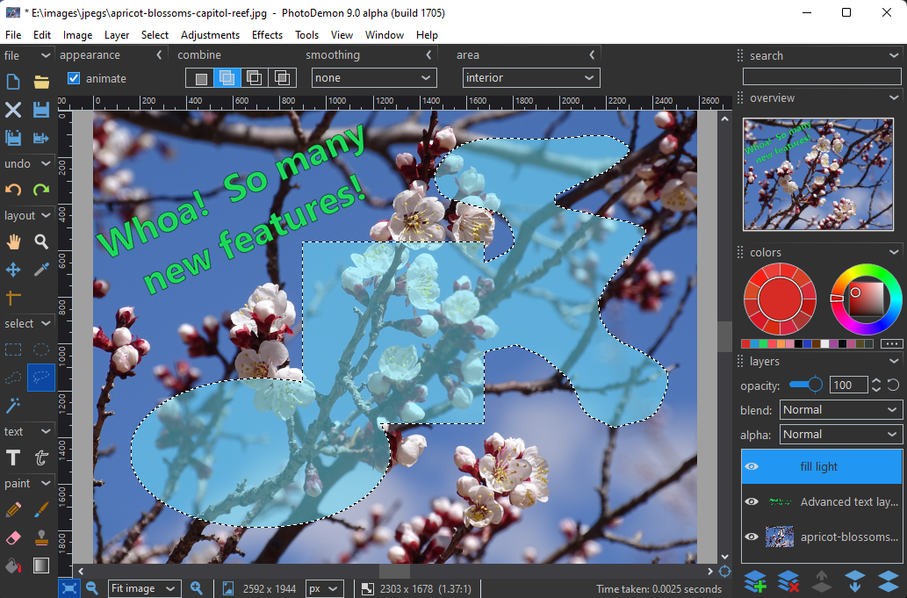
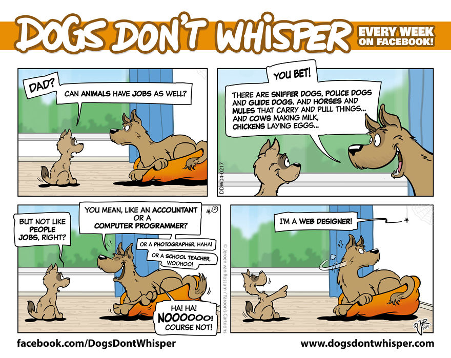
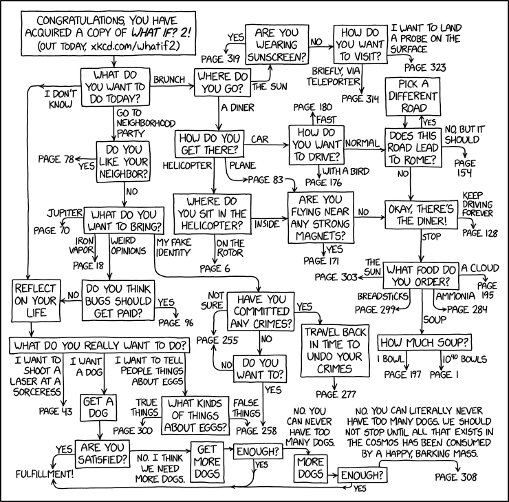
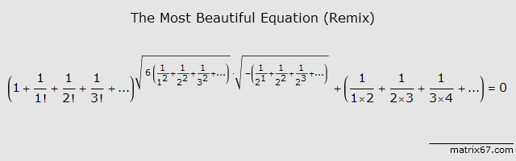
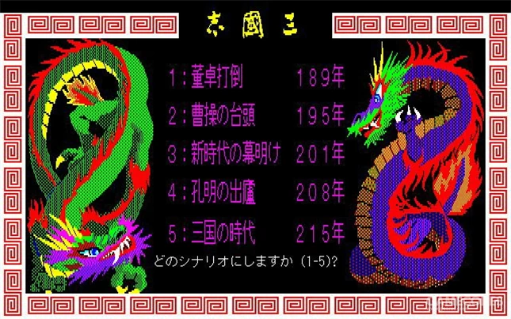

啰里啰唆周刊第31期：河水洋洋，北流活活

注：因下周是十一假期，暂停一期。
# 科技日常

## 1. Foliate书籍阅读器
A simple and modern eBook viewer for Linux desktops。

支持epub， kindle，cbz等格式，其实它就是个基于epub.js的网页，但是它基于linux内置浏览器组件，体积小，完全感觉不出是个网页，不是electron类软件可以比的。

https://johnfactotum.github.io/foliate/

## 2. photopea 和 photodemon

在线版photoshop，尤其适合Linux或者不想安装体积庞大photoshop的场景，比GIMP顺手。

最后一次用的photoshop 版本是CS6（2012年上市），已经非常非常非常强大了，后面更新的版本我也说不上到底多了啥功能。我对PS不是专业的，但是这个photopea应该是能赶上CS6的水平了。

https://www.photopea.com/

如果你是windows用户，且不是专业美工，而且亲睐本地客户端,毕竟能离线使用的软件才是自己的东西，那么可以尝试PhotoDemon这个软件，十几M体积，能替代PS的大部份功能。这个软件比较神奇的一个地方是基于VB写的。。。虽然VB是20年前的古董语言了，但是又不是不能用，况且界面也不丑，紧跟时代，不说是VB写的谁也看不出来。

https://photodemon.org/

## 3.报道否认 TikTok 与母公司保持距离
TikTok 高管最近接受美国议员询问时表示它与字节跳动保持着一定的距离，并且由它自己的高管负责。但报道援引知情人士的消息称，有关 TikTok 的决策人都是由字节跳动创始人张一鸣、字节跳动一名高级战略高管和 TikTok 研发团队负责人共同做出的，这包括强化 TikTok 的直播和购物功能的举措。TikTok 的发展和战略由字节跳动的团队领导，不向 TikTok CEO 周受资汇报，而是向字节跳动在北京的办公室汇报。周受资主要活跃在 TikTok 的财务和运营方面。

https://cn.nytimes.com/technology/20220920/tiktok-ceo-shou-zi-chew/

## 4.大树日记
Git 这么棒的东西，只用来放代码，会不会觉得有点可惜，所以我折腾了这么一个基于 Git 的日记 App - 大树日记

> 数据安全且可控
> 没有服务端的 App ，虽然提供备份功能，但备份的数据只能由其解析，万一哪天 App 不运营了，备份的数据也就再也无法读取。有服务端的日记 App ，天知道哪天就跑路了，还需要担心数据合规问题，封号就没得玩，且不知道他们会怎么处理你的私密数据。

> 作为程序员，我能想到的方案就是Git+Markdown，毕竟天天用 Git ，日记数据，可不就跟我的代码一样？

ios下载地址：https://apps.apple.com/cn/app/id1643140633?platform=iphone

Android下载地址：https://www.pgyer.com/pKRR （安卓软著还在申请中，随后会上架各大应用分发平台）

注：安卓版体积较大，有90多M，功能基本够用，也可养肥了再用。类似软件一般没有互联网公司愿意开发，多为个人作品，如果你信任开发者可放心使用。

refer:https://www.v2ex.com/t/881442

## 5.CPU-X
一款显示电脑 CPU、主板等信息的免费工具。能够显示设备的 CPU、主板、内存、显卡、操作系统等信息，支持 GUI 和命令行两种启动方式，适用于 Linux 和 FreeBSD 操作系统。 

https://x0rg.github.io/CPU-X/
# 读书与影视分享

## 1.苏联长篇小说《十二把椅子》

《十二把椅子》是苏联的文学家伊里夫、彼得罗夫1928年写的一部长篇小说。

在革命风暴到来之际，贵族夫人别图霍娃将自己一生积蓄的珍宝秘藏在十二把一套的椅子中的一把，直至弥留之际，才将此事吐露给为其作临终忏悔的神父费多尔及其女婿沃洛比亚尼诺夫。于是，以神父为一方，以女婿为另一方，便展开了一场寻觅与夺取财富的争斗。

寻宝的历程遍及俄罗斯大地的各个角落，涉及各式各样的人物；情节跌宕起伏，曲折离奇，读来荒唐可笑，但又真实可信。然而小说的主旨并不在于向读者提供一个滑稽幽默，妙趣横生的冒险故事，而是借助这一故事的巧妙结构，以辛辣讽刺的笔触在读者面前展现一个市侩、庸人和形形色色的社会蛀虫的“小世界”，（其中既包括在社会急剧变革的背景下沉滓泛起，蠢蠢而动的没落贵族、旧官吏、旧商人、旧神职员，也包括“新经济政策”时期见机而动的新生资产阶级分子，以及无视百信冷暖的官僚主义者，损公肥私者和以艺术创新为名粗制滥造，甚至诲淫海盗的所谓作家与诗人），将戟刺的锋芒直指他们的共同特质——贪婪、自私、惟利是图与拜金主义。

这部作品讽刺性很强，在苏联曾经被禁，整体比较轻快，不像国外名著大块头，读起来没有压力。

## 2.[英剧] 万物生灵 第三季 All Creatures Great and Small 
《万物生灵第一季》是一部改编自同名小说的田园剧，由Brian Percival、Andy Hay、Metin Hüseyin联合执导，Nicholas Ralph、安娜·玛德蕾、萨缪尔·韦斯特等主演，于2020年9月1日在英国Channel 5首播。

该剧讲述了1937年，年轻的兽医吉米·哈利心怀兽医梦想，但是毕业之后却鲜有工作机会。在梦想破灭之际，他接到了来自约克郡达罗比乡间兽医诊所的面试邀约。在风景如画的达罗比，他遇到了刀子嘴豆腐心的雇主法南医生、做事不靠谱的小弟崔斯汀、善良聪慧的管家霍尔太太。他们四人组成的兽医诊所，在达罗比乡间行医救世，一系列欢乐、温馨、可爱的故事也就此轮番上演。

第三季故事从1939年春季讲起，第二次世界大战即将到来，镇上的居民都将面临各种变化，特别是对James和Helen而言。两人的生活步入了新阶段，而他们周围的世界正走向一个充满不确定性的时期。 

> 高口碑英剧《万物生灵》第三季一回归就立刻拿下了绝赞的好评，而这一季开启的故事，也再一次让我们把目光投向了那个风景秀丽的约克郡。

> 首集吉米和海伦有情人终成眷属的片段着实撒了一把好糖，只可惜这次的时间线安排在了二战时期，明媚又温暖的剧情因为即将到来的战争而让人变得紧张和担忧，哪怕法农先生制止了吉米想要参军的念想，可还是担心这场战争会给这个平静的镇子和美好的人，带来不可磨灭的创伤。

> 法农先生的话很动人：「你会一直留在这里，这就是你人生的重点。」这位乡村绅士一定没想到，当年来到异乡工作的自己有一天会对这片土地如此重要，就好像很多观众也没有想到，这样一部刻画平凡人，记录普通小动物，描绘寻常乡村生活的剧集，可以带给我们如此丰沛的感动。

# 图论

## 1.I’m A Dog Behaviour Therapist And I Draw Comic Strips About Dogs 
> I have been crazy about dogs since the day I first saw one and I like to draw since the day I can hold a pencil.
>
> About 17 years ago I became an instructor in a dog school and a few years later, after obtaining the required diplomas, I upgraded myself to Dog Behavior Therapist.
>
> Over the years I’ve seen hundreds of dogs with all kinds of behavior(al problems), in the dog schools where I worked and at their homes.
>
> Nowadays I don’t teach anymore but still help an occasional problem dog with the behaviors of its people. ;-)
>

来源及更多漫画见水印

## 2.What If? 2 Flowchart

https://xkcd.com/2672/

## 3.漂亮的公式

# 谈天说地

## 1.攀枝花

攀枝花真的是一种花。攀枝花，又名木棉花。

木棉（学名：*Bombax ceiba* L.）是木棉科、木棉属落叶大乔木，高可达25米，树皮灰白色，幼树的树干通常有圆锥状的**粗刺**；分枝平展。掌状复叶，小叶5-7片，长圆形至长圆状披针形，花单生枝顶叶腋，通常红色，有时橙红色，直径约10厘米；萼杯状，长2-3厘米

木棉开的花叫红棉花，别名攀枝花、英雄花、烽火花、木棉花。据历史考证，木棉原产于印度、缅甸等地，在南亚和东南亚有着悠久的栽培历史。在中国分布于云南、四川、贵州、广西、江西、广东、福建、台湾等亚热带省区，它还是广州和攀枝花市的市花。

西南地区有食用木棉花的传统，鸡肉味，厚道有嚼头。木棉树干有刺，采摘比较困难，但是还是抵挡不住西南地区对美味的执着。

追溯我国对木棉树的最早记录，则是西汉时南粤王赵佗向汉武帝的一次朝贡。东晋文人葛洪在《西京杂记》中对这次朝贡有明确记载：**“高一丈二尺，一本三柯，至夜光景欲燃。”**高大的木棉树开花时就像燃烧的烈火，**当时南粤国从广州运送至长安的木棉树虽仅仅一丈二尺高，尚且能让古人有“至夜光景欲燃”的感叹，可见它的魅力非同一般。**

传说在海南岛，有位部落领袖叫吉贝，他多次率黎族人民抗御外敌屡立战功，深得民众爱戴。后因叛徒出卖被敌人围困在大山，他身中数箭仍屹立山巅，身躯化为一株木棉树，箭翎变为树枝，鲜血化成殷红的花朵。后人为了纪念他，尊称木棉为英雄树、把木棉花称作英雄花。

四川和云南交界处，有个城市叫攀枝花，得名就是来自攀枝花。很多人从小学地理课本知道攀枝花是一座城市，却不知道攀枝花是一种花。攀枝花，面积7440.4平方千米的地级市，位于川南、滇北交界处，东部和北部被同属四川的凉山彝族自治州牢牢包围，西部和南部与云南丽江、楚雄紧密相拥。攀枝花位于四川最南端，北距成都614公里，南至昆明273公里。攀枝花市不是一个历史上存在的的城市，而是和深圳一样，由空白建设成为特区，然后才发展为市。

1965年3月，因为矿产资源和三线建设的需要，经周恩来批示，仿大庆，在攀枝花地区成立“**攀枝花特区**”，实行**政企合一**，以原云南楚雄、丽江地区为主，加上四川西昌、会理的一部分，划归特区管理。1987年之前，出于保密需要，这里对外称渡口市。随着1987年1月正式挂牌，“攀枝花市”正式诞生。 从1965年算起，她比深圳年长15岁；从1987年算起，她比深圳还要年轻7岁。

附：汉语中的花名挺有意思。在第16期的时候，提到过一种像牵牛花和紫蔷薇的花，叫五爪金龙，名字够霸气。然后前几天，看到一味中药，叫八爪金龙，我。。。
## 2.英文梗
Big Spoon

Spooning就是情侣之间搂着睡觉的姿势，两人都侧卧时，搂着对方的那个叫big spoon，被搂着的那个叫little spoon。

> Today, I realized people think my boyfriend is gay because he loves romantic movies, gardening, shoe shopping, reading magazines, and bathing by himself in candlelight. After him asking me to cuddle and me to be the "big spoon," I'm starting to question it too. FML

stood up
stand up 的意思确实是起立，如果加上宾语的话，这个短语的意思就完全变了。 stand someone up 表示放某人鸽子，形容了一种失约的行为。

> Today, after being stood up at a diner, I called the girl who was supposed to have met me. Turns out, she thought I was kidding when I asked her out. FML

## 3.光荣的三国情结：从37年前的《三国志》到《卧龙：苍天陨落》

无论你是否读过《三国志》《三国演义》原著，对于刘关张桃园结义、吕布白门楼、诸葛亮病死五丈原等等传奇故事肯定不会陌生。三国文化不仅在国内耳熟能详有着举足轻重影响力，实际它早已走出国门为世界了解中国贡献着自己的力量。

邻国日本就有这样一家电子游戏公司，他们似乎对三国文化有着特殊情结，自上世纪八十年代开始就不遗余力推出三国题材的作品。嗯，光荣特库摩。历史进程、公司结构与人员更迭似乎没有影响初心，1985 年光荣与特库摩还没合并之时，他们就带来了自家第一款三国题材游戏《三国志》，如今尚未发售已然万众期待的《卧龙：苍天陨落》同样出自他们之手。今天我们就回顾一下光荣特库摩旗下几个三国系列作品，看看这群日本开发者究竟对三国题材深耕到何种程度。

时间回溯到上世纪八十年代，彼时的光荣刚刚从染料批发转型至电子游戏行业。1983 年发售的《信长之野望》大获成功，坚定了他们继续开发历史模拟类游戏的计划。几经调研，他们发现中国的三国历史文化经由《三国演义》传播，在日本普及程度相当之高，并且民众对其塑造的战争场面与人物形象也十分追捧。于是新作的历史舞台搬到了东汉末年的中国，1985 年 12 月 10 日《三国志》系列也就应运而生。

初代《三国志》创作思路大致延续了《信长之野望》的策略战棋玩法，玩家要在多个色块构成的地图上控制三国时期的各个势力，最终实现结束战乱统一天下的目标。以如今的眼光审视，本作制作水平可说相当简陋，队伍现状和规模基本都由数字呈现，战斗效果也仅仅是色块闪烁。不过考虑到时代因素，当时严谨的历史模拟游戏并不多见，搭配中国历史题材的神秘色彩加持，本作一经问世就在日本国内引发广泛好评， 1988 年更是获得 LOGiN 杂志读者票选年度最佳游戏第一名的好成绩。

后续发展不用我说各位也猜得到，彼时光荣作为刚刚涉足电子游戏产业不久的小公司，拥有玩家喜爱的作品属实是难能可贵，为《三国志》推出续作扩大自身影响力自然是第一要务。于是1989年12月《三国志2》问世，本作仍采用《三国演义》小说内容作为背景设定，画质、音乐、玩法方面都有了长足进步，登场人物也更为丰富。此外，1992 年本作发行了官方中文版，相信很多老玩家也是由此首次接触到了该系列。

一年后的 1992 年，大幅改良的《三国志3》正式发售，本作可以说是该系列初期进步最明显的作品。《三国志3》的画面质量终于从 4 色增加到 16 色，对于三国时期地图的还原以及多样地形的呈现效果进化不少。这一代还强化了内政和战争系统的玩法，使其成为《三国志》系列后续作品的传统与特色。

《三国志3》是该系列逐渐走向成熟的标志，商业表现和玩家口碑也没有让光荣失望。于是在 3 代推出后不久，光荣决定趁热打铁续作《三国志4》于 1994 年问世，1995 年又推出了《三国志5》，这两部作品都保持了极高制作水平，并且又加入了诸多细节和玩法。至此该系列的游戏构架已经非常成熟，无论画面还是可玩性都达到了当时的最高水平。

全文：https://www.gcores.com/articles/156602

## 4.有人说，国家都没说这种孩子必须上幼儿园，你们为什么自讨苦吃？
郑州管城区奇色花福利幼儿园创办人

> 有人说，国家都没说这种孩子必须上幼儿园，你们为什么自讨苦吃？

奇色花是一个融合教育幼儿园，在普通教学班里按7:1的比例接收特殊需要的孩子，让两类孩子在一起生活、学习。

现在的奇色花有12个教学班、356名小朋友，其中特殊需要的小朋友有50名，主要是残障的孩子，包括自闭症、发育迟缓、唐氏综合征、脑损伤等等。

扶着碗拿勺子吃饭、自己上厕所、系纽扣、跟人打招呼……对特殊儿童来说，这些看似简单的事也非常困难。

特殊儿童和普通儿童如何在同一个班里学习？他们能和谐相处吗？闹矛盾了怎么办？从26年前第一次把7个有身心障碍的孩子接进幼儿园起，蔡蕾和同事们从零开始摸索如何为他们提供教育。

融合教育最大的阻力是残障平等意识不够普及。残障平等意识决定了我们对残障者的教育安置模式。

ref: https://music.163.com/#/program?id=2510920686

## 5.渔夫买马
二渔夫居海滨久矣，欲上岸而从商。
既从商，需马也。
然二人不知马之贵贱优劣，请于乡间布衣，布衣言“困马之黑屋三日，断水粮，肆出，
泥水干草饲之。”言已毕，布衣急远矣。
二渔夫依之，然两马待出，一马立食之，一不食，再困三日，仍不食，非净水精粮不食之。
二惑。
一言“前食者，乃能屈能伸，耐劳吃苦可活于困境，从商路途艰险，此乃好马也”。
一言“非净水精粮不食着，血统贵也，有原则而守，忠烈之性，从商路途艰险，此乃好马也”
问何马可为良驹也？
问于伯乐，伯乐曰“马如人也”，遂止。
今世，能抉之者难也。

## 6.欧游漫录
1925年3月，徐志摩去欧洲游历，第一站就是苏俄。

在当时的中国，国民党已经接受苏俄的资助，因而开始在苏联顾问的指导下致力于完成苏共领导人多年之前就为中国规定的革命任务——“反帝反封建”。与知识分子的个人言说相比，政党的力量是巨大的，短短几年中，五四新文化就似乎已经过时，成为“落后的”或“反动的”，一些学者与一代年轮人一样，不知不觉中就学会了把政府称为“北洋军阀政府”，学会了高喊“打倒封建势力”“打倒帝国主义”等新口号。与此同时，中国文化的发展方向也发生了新变：由向西方学习转向苏俄学习；由“西化”转向“苏化”。在这个背景上，苏俄成了一些人想象中的圣地，纷纷前去学习取经。

苏俄是如此诱人，徐志摩也决定前去看看。所以，他的欧洲之旅就有了游苏的日程。《欧游漫录》记载的就是他对苏俄的观感。

终于到了莫斯科，这是徐志摩初到科里姆林宫时的感受：

> 这里没有光荣的古迹，有的是血污的近迹；这里没有繁华的幻景，有的是斑驳的寺院；这里没有和暖的阳光，有的是泥泞的市街；这里没有人道的喜色，有的是伟大的恐怖和黑暗，惨酷，虚无的暗示。暗森森的雀山，你站着，半冻的莫斯科河，你流着；在前途二十世纪的漫游中，莫斯科，是领路的南针，在未来文明变化的经程中，莫斯科是时代的象征。古罗马的牌坊是在残阙的简页中，是在破碎的乱石间；未来莫斯科的牌坊是在文明的骸骨间，是在人类鲜艳的血肉间。莫斯科，集中你那伟大的破坏的天才，一手拿着火种，一手拿着杀人的刀，趁早完成你的工作，好叫千百年后奴性的人类的子孙，多多的来，不断的来，像他们现在去罗马一样，到这暗森森的雀山的边沿，朝拜你的牌坊，纪念你的劳工，讴歌你的不朽！

俄罗斯悠久的文化已被摧毁，但徐志摩知道，自己到莫斯科“当然不是看旧文化来的”。那么，莫斯科的新景观如何呢？徐志摩首先看到的仍然是贫穷和萧条：大街两旁古老的店铺大都倒闭，漂亮的店铺是见不到的，最多也最热闹的是食品店，是政府开的，物资却奇缺而且昂贵。俄罗斯人曾有的贵族气彻底不见了，街上走过一群群男人，却见不到一件白色的衬衣，更不用说礼服和鲜艳的领结。徐志摩写道：“我碰着一位大学教授，他的衬衣大概就是他的寝衣，他的外套，像是一个癞毛黑狗皮统，大概就是他的被窝，头发是一团茅草，再也看不出曾经爬梳过的痕迹……”徐志摩还拜访了另一位教授：“我打门进去的时候他躲在他的类似‘行军床’上看书或编讲义，他见有客人连忙跳了起来，他只是穿着一件毛绒衫，肘子胸部都快烂了，满头的乱发，一脸斑驳的胡须。他的房间像一条丝瓜，长方的，家具有一张小木桌，一张椅子，墙壁上几个挂衣服的钩子，他自己的床是顶着窗的，斜对面另一张床，那是他哥哥或弟弟的……墙角里有一只酒精炉，在那里出气，大约是他的饭菜……”

有了这样的感受，徐志摩对于国内的苏化浪潮产生了深深的忧虑。他深知中国的现实所孕育的不满，也深知中国历史形成的文化土壤，知道国人的反抗激情是多么容易被调动。他开始对国内的青年说话：

> 莫斯科是似乎做定了运命的代理人了，只要世界上，不论哪一处，多翻一阵血浪，他们便自以为离他们的理想近一步，你站在他们的地位看，这并不背谬，十分的合理。

> 为什么我们就这样的贫，理想是得向人家借的，方法又得向人家借的？不错，他们不说莫斯科，他们口口声声说国际，因此他们的就是我们的。那是骗人，我说：讲和平，讲人道主义，许可以加上国际的字样，那也待考，至于杀人流血有什么国际？你们要是躲懒，不去自己发明流自己血的方法，却只贪图现成，听人家的话，我说你们就不配，你们辜负你们骨里的髓，辜负你们管里的血！

> 我不是主张国家主义的人，但讲到革命，便不得不讲国家主义。为什么自己革命自己做不了军师，还得运外国主意来筹划流血？那也是一种可耻的堕落。

> 革英国命的是克郎威尔；革法国命的是卢骚、丹当、罗佩士披亚、罗兰夫人；革意大利命的是马志尼、加利包尔提；革俄国命的是列宁——你们要记着，假如革中国命的是孙中山，你们要小心了，不要让外国来的野鬼钻进了中山先生的棺材里去！

几代人的苦难过去之后，我们知道，当时的人们没有听从徐志摩的劝告。但是，历史不应忘记，在那个路口上，有人这样提醒过。它至少证明，当时的知识界并非全都犯糊涂。

接下来的问题是：在那样一个知识界大面积狂热的背景上，徐志摩何以能够独醒而不迷？**众所周知，像鲁迅那样目光锐利的人，几年之后都没有看透那层伪装，自己被欺骗，却写了《我们再也不受骗了》那样的文章**；像胡适那样头脑冷静的知识界领袖，也赞美过那“伟大的试验”，而没有意识到它将给人类文明带来的后果；徐志摩平时对政治并不怎么关心，凭什么有这样的目光？

不过，徐志摩对苏俄的认识，也与知识有关。这得益于他的两个老师：一个是罗素，一个是韦尔斯。

https://www.jiemian.com/article/3039502.html

# 一句话快讯

1.9月20日，李佳琦淘宝复播，截至9月20日晚8时30分，李佳琦直播间粉丝量达6445.6万，共计3727.5万观看，点赞量达1.17亿；上架的15款商品中，已有12款售罄。但微博热度和相关主题依旧被降权、屏蔽。

2.根据美国海军第七舰队在官网发布的声明，美国海军阿利·伯克级驱逐舰“希金斯号”（USS Higgins）和加拿大皇家海军哈利法克斯级巡防舰“温哥华号”（HMCS Vancouver），在星期二共同航经台湾海峡，执行例行性任务。第七舰队强调，两艘军舰航经台湾海峡水域符合国际法的公海航行和飞行自由的适用范围，且不在任何沿海国家的领海范围内。 

3.9月21日俄罗斯总统普京在刚刚发布的视频讲话中宣布进行部分动员。根据俄罗斯此前出台的法律解释，目前在预备役中的公民，首先是那些曾在武装部队中服役、有一定军事专业和相关经验的人将被征召服兵役；被征召服兵役的人在被部署到部队之前必须接受额外的军事训练。 

4.上周 22 岁的 Mahsa Amini 因为头巾没达到政府的标准而被道德警察拘捕被殴打致死，这起事件在伊朗各地引发了大规模抗议。反政府抗议蔓延至数十个城市。在 Amini 的家乡库尔德斯坦省，至少有七人丧生。妇女冒着被逮捕的危险在公共场合摘下并焚烧她们的头巾。抗议者高喊“独裁者去死”、“生命、自由和妇女”等口号，呼吁结束伊朗伊斯兰共和国。政府则派出防暴警察和便衣民兵等安全部队镇压抗议者。在有抗议活动的社区，互联网和手机服务已被中断。 

5.9月25日，古巴新版家庭法公投。新版《家庭法》增加了承认同性婚姻合法化、承认不收取酬劳的代孕合法化、允许同性伴侣家庭合法收养孩子的内容。结果。赞成：66.9%，反对33.1%，投票率74.0%。 老版家庭法生效于1975年。 

# 联系方式

啰里啰唆是一份针对互联网和生活爱好者的数字杂志，旨在发现和分享一切有趣的东西。话题不固定，每期大约十五分钟阅读量，暂定每周四发布。部分内容来自互联网采编，如果为有来源的转载，均会注明转载地址或保留水印。

这是一个关注人文和科技的newsletter。

使用方法建议或素材提供

频道：notonlyshare

github地址：[https://github.com/iminto/luoliluosuo-weekly](https://github.com/iminto/luoliluosuo-weekly)