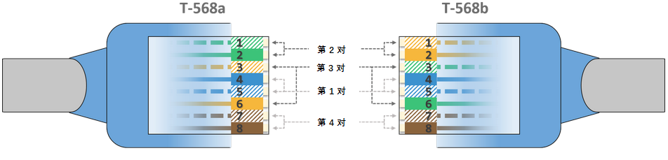
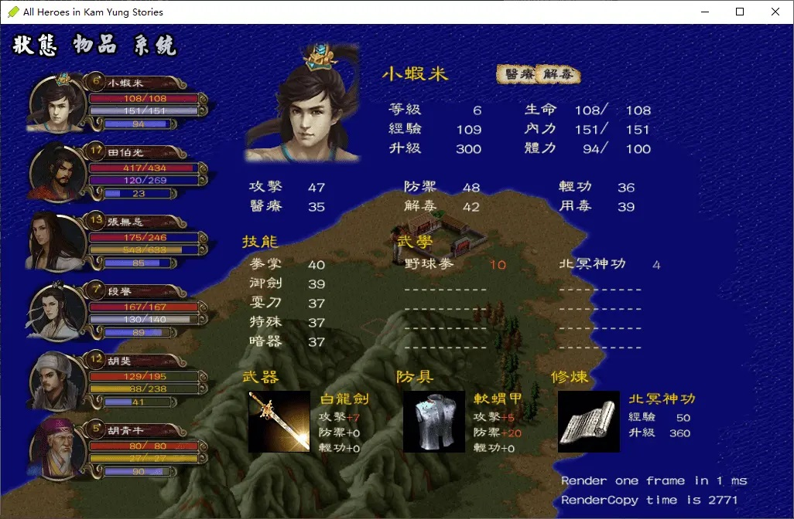
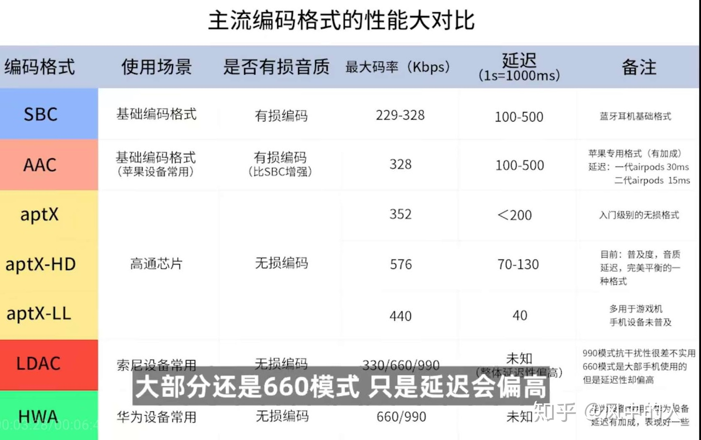
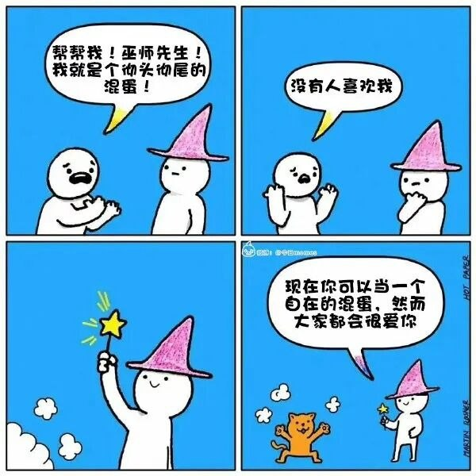
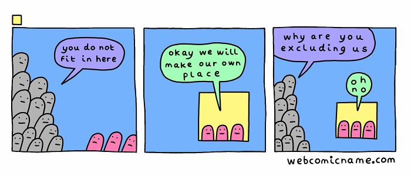
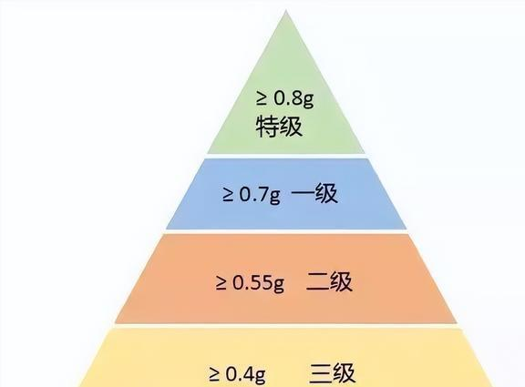

啰里啰唆周刊第32期：云来翻作嶂，阶漫忽成池

# 科技日常

## 1. 深入理解以太网网线原理
译者按：大部分人都知道，百兆以太网只用了 RJ45 端口中的 2 对 4 根线，分别为 TX、RX 的差分信号。
千兆以太网用了 RJ45 端口中的全部 4 对 8 根线，但是这 4 对 8 根线是怎么定义的？哪些属于 TX，哪些属于 RX？
我也不知道，而且以前居然没有认真去了解过，所以我决定找一篇与此相关的文章翻译一下，分享给大家。

*这篇文章图文详实，是一篇很好的科普文*

https://blog.vvzero.com/2022/09/18/Ethernet-Wiring/

英文原文：https://www.practicalnetworking.net/stand-alone/ethernet-wiring/

## 2. 开源古战争策略游戏 0 A.D 发布庄子版

开源自由软件历史策略游戏 0 A.D 发布了 Alpha 26 庄子版。0 A.D 风格类似于帝国时代，包含了建设基地、训练军队、战斗和研发科技等要素。游戏的阵营包含多个文明，而每个文明都有自己独特的军队和建筑。Alpha 26 以著名道教哲学家庄子命名，新增加了汉文明，新增了战役地图塔里木盆地和长江，单位现在能加速，等等。

0 A.D. 是一款跨平台的游戏，支持windows和Linux。

https://play0ad.com/new-release-0-a-d-alpha-26-zhuangzi/

## 3.Aseprite像素画编辑软件
开源、专业的像素画编辑软件。一款主要用于像素画和 Sprite 动画的图像编辑软件，它拥有图层、自由手绘模式、阴影墨水、自定义笔刷、轮廓线、宽像素、命令行界面、Lua 脚本等特色功能。该软件虽然专业版收费但并不贵(20美元)。

免费版无法保存作品。 但是Aseprite的源代码都开源发布在GitHub上，用户可以免费下载，然后**手动编译**成可运行的软件即可，编译方法在搜索引擎中很容易找到，GitHub上也有具体的编译方式，缺点就是比较麻烦，无法实时更新。

https://www.aseprite.org/

## 4.游戏《金庸群侠传》的 C++ 复刻版

游戏《金庸群侠传》的 C++ 复刻版。基于 SDL2 开发的《金庸群侠传》游戏，资源大部分来自 DOS 版本，目前已完工可以正常运行。

https://github.com/scarsty/kys-cpp

## 5.简单谈谈蓝牙耳机的音频参数
蓝牙耳机的音频解码主要分为sbc、aac、aptx、ldac等几种。

**SBC**:
支持44khz/16bit的音频，最高码率是328kbps，延时大约220ms。

这是最早的蓝牙音频编码，是A2DP（Advanced Audio Distribution Profile，蓝牙音频传输协议）强制规定的编码格式，所有的蓝牙设备都会支持这个格式。
SBC这个编码格式最主要的问题就在于比特率较低、压缩率较高，因为蓝牙传输中间设备是需要转码，以MP3文件为例，转码过程为 MP3->PCM->SBC->PCM, 每次转码都会损失细节，导致SBC的听感会比原始的MP3要差。这些传输过程中的损失细节，会让音乐听感变差。

四五十元以下蓝牙耳机一般在这个阶段。

**AAC**:
支持44khz/16bit的音频，最高码率512kbps，延时大约100ms。
AAC是1997年，由Fraunhofer IIS、杜比实验室、AT&T、Sony等公司共同开发的，是一种高压缩比的编码算法。AAC有着不错的音质表现，音质略好于sbc。

百元左右耳机通常在这个阶段。

**APTX**:
支持48khz/16bit的音频，最高码率352kbps，延时约40ms。

aptX是一种基于子带ADPCM（SB-ADPCM）技术的数字音频压缩算法。
而在aptX家族里面，还有着更进一步的细分。aptX分为三种：aptX，aptX HD和aptX Low Latency，根据名字可以认为，分别是传统aptX，高品质aptX（提高码率）和低延迟aptX（这个对玩游戏、看视频很重要）。

aptX的传输码率也不高，但是编码更为高效，使得声音保留的细节更多，实际听感好于前面两者，aptX的宣传也是称其可以达到CD级别的听感。

**LDAC**:
支持96khz/24bit的音频，最高码率达990kbps，接近无损解码。

LDAC是由索尼推出的无线音频编码技术，在2015年的CES展上亮相，索尼很简单粗暴的提高了信道，在支持LDAC的设备上面，蓝牙的通信码率接近1M。相比SBC编码高出三倍多，可以说是目前无线传输中最接近无损编码的方式。

千元耳机一般在这个阶段，也有三四百块拼性价比的。

LDAC技术最初被索尼独占，只能在索尼自己的产品上才可以使用，不过在2017年，索尼正式将LDAC技术开发给了Android 8.0系统 ，LDAC成为了安卓开放源代码计划中的一部分，这使得每个OEM（设备制造商）都可以自由地将这个标准集成到他们自己的Android设备中。

**HWA/L2HC**:
HWA（HiRes Wireless Audio）是华为在P20系列发布会上发布的，这是继aptX 、LDAC之后，业界的第三个蓝牙高音质协定。支持96khz/24bit的音频，最高码率900kbps，可以媲美ldac。
目前，华为已停止了HWA的支持。

协议上看aptx>aac>sbc,这3种音质差距不明显，音质上看：LDAC>HWA>APTXHD。

**需要注意的是，即使你有LDAC蓝牙耳机，还需要你的手机硬件和软件能支持LDAC协议，才能实现LDAC的音质。**

**自然地，同理，你下载个flac格式的无损音乐，然后配个1000块的Airpods，自然是享受不到无损音乐听感的。**

至于经常提的TWS蓝牙耳机，TWS是英文True Wireless Stereo的缩写，即真正无线立体声的意思。 **目前TWS的定义和音频解码协议是两码事**，并不是说只有支持LDAC协议的才能叫TWS技术，TWS主要指的是左右声道立体声，左右耳可单独使用的一种耳机类型。

那么问题来了，type-C接口的耳机和传统3.5接口的耳机音质又如何呢？其实TYPE-C耳机和3.5mm耳机的区别不在于耳机本身，而是解码器。传统的手机都是自带解码器的，在内部就可以完成数字信号向模拟信号的转换，然后在通过3.5mm的传统耳机孔把模拟信号发送给耳机，耳机只需要做好把模拟信号转成声音的工作就可以了。

可以这么理解：3.5mm耳机孔传输的是模拟信号，“音质”靠的是手机内置的DAC解码芯片。而Type-C接口传输的是数字信号，本身没有“音质”可言，靠的都是外接设备的音频解码能力。 

而TYPE-C接口的手机输出的则是纯数字信号，这就需要耳机必须自带解码器，然后将数字信号转成模拟信号，最后再转成声音放出来。所以带解码器的TYPE-C耳机比不带解码器的3.5mm耳机成本更高一些，如果两款耳机的价格相同的话，那么TYPE-C耳机的音质部分肯定会有所缩水。反过来相同的音质效果下，TYPE-C耳机的价格会更高一些。

但是由于TYPE-C耳机的解码器都是外置的，即使体积大一点也无所谓，通常来说解码器越大，会导致音质的效果越好。而3.5mm耳机的解码器在手机内部，狭小的空间无法容纳太大的解码器。所以如果自己不会考虑价格的话，TYPE-C耳机的音质上限要比3.5mm耳机更高。

那有线和无线到底哪个音质好呢？这么说吧，早期的有线耳机音质通常比上千元的TWS耳机要好。苹果首款真无线蓝牙耳机 AirPods，首发标价 1288 元，音质不如2000多元安卓机上的一百多的耳机。

5000元苹果+1280 AirPods  < 2000元安卓+100元有线耳机。

即使到了现在，受限于蓝牙的传输速率，很多上千元的蓝牙耳机，音质也就那样吧。当然，想要听高音质，你拿个手机在那倒腾啥呢。

## 6.VirtualBox 7.0.0 释出支持完全加密
虚拟机软件 VirtualBox 释出了 7.0.0 版本。主要新特性包括：支持完全加密，包括虚拟机配置日志和保存状态（CLI only）；云端虚拟机能被加入到 Virtual Machine Manager，像本地虚拟机那样控制；DirectX 11 3D 加速支持；Secure Boot 支持；通过 Network Manager 工具配置云端网络；等等。

https://www.virtualbox.org/wiki/Changelog-7.0

# 读书与影视分享

## 1.电视剧/小说 《唐朝诡事录》

《唐朝诡事录》是由长信传媒、爱奇艺联合出品的志怪单元探案剧，该剧于2022年9月27日在爱奇艺独播 。

该剧改编自作家魏风华同名原著，讲述了在繁华的大唐盛世之下发生的一系列奇闻异事，长安金吾卫中郎将卢凌风将与狄公亲传弟子苏无名携手共破诡案，守护苍生，担负起挽救社稷于危急的使命故事 。

暗夜邪仙从天而降，鬼市地宫露出冰山一角，而风靡长安的诡异红茶究竟是养生之药还是害人之物。长安城里新娘失踪案接连发生，似乎与红茶有着千丝万缕的联系。案件扑朔迷离，人心玄妙难鉴。金吾卫中郎将卢凌风奉命查案，遭遇平生最强对手狄仁杰关门弟子苏无名，双强携手共破长安奇案。八个不同风格的诡异案件，《长安红茶》《石桥图》《众生堂》《黄梅杀》《甘棠驿怪谈》《鼍神》《人面花》《参天楼》，一一为您揭晓大唐夜色笼罩之下的奇闻异录。见证唐诗之外，被湮没千年的奇诡想象。千年前的唐朝，万邦来朝，是当之无愧的世界中心。优越的物质生活，多样的文化融合，催生了唐朝人极致的想象力。除了李白、杜甫、白居易等一代传奇诗人，用唐诗描绘出的华丽的大唐美卷；市井间的贩夫走卒，更用他们更加不羁的想象力，在唐朝的夜幕中 勾勒出神魔鬼怪的憧憧魅影：仙魔精妖、奇闻怪谈、幻术道法、异域传说、珍禽异兽、宫廷轶事。

此剧有原版小说，小说我没看过，看了第一个故事，剧情还算紧凑，演技不好说，作为下饭菜未尝不可。
## 2.狼厅-英国版韦小宝

《狼厅》是英国女作家希拉里·曼特尔的历史小说，摘得2009年布克奖。2022年9月，据英国媒体报道，英国女作家希拉里·曼特尔去世，享年70岁。   

广阔瑰丽的都铎王朝，暗潮汹涌的宫廷斗争，风雨欲来的宗教改革……在这个黑暗的历史舞台上，人人自危，一步之差便有杀身之祸。不过，托马斯·克伦威尔是个例外——他冷酷理性、心思缜密，在君主、教会、贵族之间，纵横捭阖，游刃有余；他善解人意、舐犊情深，对待爱人、亲人、朋友，细心周到，无微不至。    

《狼厅》以亨利八世与凯瑟琳王后的离婚案为切入点，伴随着红衣大主教的失势，凯瑟琳王后遭废黜，亨利八世迎娶安妮·博林等一系列事件……宫廷内外，风起云涌，终以托马斯·莫尔之死收场；克伦威尔处心积虑、步步为营，终于位极人臣。小说以克伦威尔的生平与亨利八世的宫廷为主线，两线交织，编织了一张反映16世纪初英格兰政治、宗教及经济图景的巨网。    

> 英国历史对我来说，蛮陌生的，虽然有听过都铎王朝，但要说历史上发生的事，我一概不知，所以在阅读这本书时，除了新鲜外，还有种开扩视野的感觉，而前面的序有助于像我这种不了解的人，更快速进入到故事里，当我读完整本书后，特地去找了相关资料，发现有关亨利八世身边的弄臣克伦威尔的介绍，少之又少，但作者希拉蕊．曼尔特却赋予克伦威尔新的生命，活出了书本，让人对他有了更多想象的空间。

# 图论

## 1.这很合理 

## 2. Oh No

艺术家: [Tumblr](https://webcomicname.com/) | [Facebook](https://www.facebook.com/webcomicname/) | [Twitter](https://twitter.com/dorrismccomics) | [Instagram](https://www.instagram.com/webcomic_name/?hl=en)

# 谈天说地

## 1.为什么成年了还会梦到学校生活

我都毕业十几年了，快20年了，犹会梦到大学，刚毕业的七八年内，甚至会梦见大学考试，紧张的一无所措。最近也会梦见回到早已被开发商拆除的老宅里，人的梦，似乎经常会滞后现实好多年。
是因为选择性记忆吗？

浏览网站时，刚好看到一篇[文章](https://www.theatlantic.com/family/archive/2022/09/why-school-haunts-our-dreams-long-after-graduation/671506/)

> I have a recurring dream. Actually, I have a few—one is about dismembering a body (I’d rather not get into it), but the more pertinent one is about college. It’s the end of the semester, and I suddenly realize that there is a class I forgot to attend, ever, and now I have to sit for the final exam. I wake up panicked, my GPA in peril. How could I have done this? Why do I so consistently self-sabota—oh. Then I remember I haven’t been in college in more than a decade.

很可能是
> What might be behind “that dream scenario that you’ve picked out, being back at school and having to take this final,” she told me, is “feeling tested in life, feeling that you have to respond to other people’s expectations,” and feeling that I’m not meeting those expectations. “So you think back to school.”

ref: https://www.theatlantic.com/family/archive/2022/09/why-school-haunts-our-dreams-long-after-graduation/671506/

日有所思，也有所梦，但所梦并不一定是所思，两者之间的关联，只有非常熟悉心理学才能窥探一二，或许在《梦的解析》一书中可以寻找到答案。

《梦的解析》是弗洛伊德最为重要、知名的作品之一，书中弗洛伊德对“梦”进行了大量的研究与实验，分析了梦的凝缩、梦的转移和梦的二重加工，讨论了梦的隐意内容，解析了愿望满足的原理，描述了俄狄浦斯情结，阐述了幼儿生活对成人性格的影响。本书不仅为人类潜意识学说奠定了稳固的基础，而且为人类认识自己确立了里程碑，标志着精神分析体系的正式建立。同时，书中还包含了许多对文学、哲学、教育等领域具有启示性的观点。 **这是一部与达尔文的《物种起源论》及哥白尼的《天体运行论》并列为“导致人类产生三大思想革命的书”**。

弗洛伊德认为，梦是欲望的幻想满足。也有人说，说自己的梦里并没有满足愿望后的愉快，反而会感到恐惧或者羞愧，还有人觉得梦里满足的好像并不是自己的欲望。对此弗洛伊德怎么解释的呢？他认为出现这些情况，是因为我们并不真正了解自己的欲望，或者更准确地说，是没有意识到自己的欲望。所以，他把这种能够影响我们的行为、但是又意识不到的本能欲望，命名为“无意识”。这可以说是弗洛伊德最重要的心理学概念之一。

**为什么我们没有办法意识到无意识的欲望呢？因为我们的精神中还有一个强力的“审查者”，它代表的是社会规范**，很多时候是父母从小灌输给我们的原则在心中的内化。孩子为了得到父母的爱和赞许，避免被父母惩罚，就会压抑那些和规范相抵触的本能欲望，所以这些欲望就沉入了无意识中，平时我们察觉不了，但是它们还是存在的，于是在我们睡觉的时候，也就是意识中的审查者弱化的时候，这些无意识本能的欲望就会浮现出来，这就是我们所说的梦。

比如，弗洛伊德是这么解释关于裸体的梦的。很多人在梦中能感到自己赤身裸体没穿衣服，他认为这是因为小孩子其实对赤裸身体并没有羞耻感，相反还会很高兴，也就是说小孩子都有点暴露癖，只是因为父母的训斥，才慢慢压抑了这种习惯。但是在梦里，这种冲动得到了满足，虽然做梦者本人还是会觉得很窘迫很尴尬，但是在梦里，碰到他的人往往很冷漠，好像他穿衣服不穿衣服都一样，于是他心底的暴露癖就暗爽了一把，这就是欲望的满足。

但是这种满足方式还是有点直接，让我们睡着了也觉得尴尬，这说明 **即使睡着了，意识中的审查者还是存在的** 。弗洛伊德就认为，梦会通过象征手法来对自己进行包装和扭曲，从而逃过审查机制的检查。基于这一点，他把梦分成了“显梦”和“隐梦”。显梦就是我们实际上梦到的，可以讲出来的内容；而隐梦是隐藏在表面梦境后面的真实欲望体现。

弗洛伊德举了个例子。他有一个女病人，姐姐有两个儿子，但是很不幸，大儿子早年夭折了，这位女病人也因此悲痛欲绝。可是有一天晚上，她却梦见姐姐的小儿子也死了。在生活里，她绝不会希望这样的事情发生。所以她并不同意弗洛伊德“梦是欲望的满足”这个观点。

可是根据弗洛伊德的了解和剖析，这位女病人有一位前男友是一个文学家，可是姐姐却不同意这桩婚事，他俩分手。她心里一直放不下对方，但自尊心和家庭观念又压抑了她的欲望，这种想见不能见的矛盾，促使她抓住一切可能的机会，几乎每一次前男友的演讲她都在场，只是为了远远地看一眼。

她大外甥死的时候，很久没露面的意中人来参加过丧礼。所以，梦见小外甥死亡，其实满足了女病人想再次见到意中人的愿望。按照理智、自尊心和道德约束，女病人是不应该见这个人的。所以为了掩盖她的欲望，她在梦里选择了一个丧葬的场合，在这种极端痛苦的环境下，不会有人联想到爱情，人为制造的痛苦，其实是用来掩盖真实愿望的。内容痛苦的梦，仍然可以解释为欲望的满足。

当然，也有人认为弗洛伊德的那套解梦理论过于狭隘，什么都要和性沾边的泛性论，后面又发展了很多学派和新的理论。所以，如果你不太认同弗洛伊德的理论，也可以看看其他派别，比如荣格，弗洛姆，埃里克森，华生，斯金纳，维果斯基，班图拉和皮亚杰。

忘掉《周公解梦》吧，😄

ref:https://zhuanlan.zhihu.com/p/60958735
## 2.19 of the Best JRPGs You Can Play on Modern Consoles
Working on my book Fight, Magic, Items: The History of Final Fantasy, Dragon Quest, and the rise of Japanese RPGs in the West took me back through the annals of JRPG history. Along the way, I was reintroduced to many of the classic titles that defined the genre—from its earliest days on the NES, to the golden age heights of Chrono Trigger and Final Fantasy VII. It was a joy growing up alongside the genre as it found its footing and took off to meteoric heights in the ‘90s. It’s a genre about epic journeys, and it’s a genre that’s taken its own epic journey.

But the best time to get into classic Japanese RPGs? Not the ‘90s when the Super Nintendo reigned supreme, or a decade later, during the height of the PS2 era, when Final Fantasy X and Kingdom Hearts were all the rage. The best time to be a JRPG fan is right now. Thanks to the rising popularity of official remasters, the launch of FPGA devices like Analogue’s Pocket and the MiSTer, and a bevy of options for emulation, it’s never been easier to play most of the game’s most revered classics.

What follows are 19 classic Japanese RPGs that you can play on modern hardware. No fuss, just fun.

https://lifehacker.com/19-of-the-best-jrpgs-you-can-play-on-modern-consoles-1849371946

## 3.流石滩
五千万年前的一次撞击，在中国西南挤出几道巨大的皱纹——横断山脉。隆起的大地被风雪摧毁成碎石，我们徒步爬过滑梯一样的雪坡，去到比云彩还要高几千米地方，终于看到了那片传说中的绝美花园.

https://h5.video.weibo.com/show/1034:4819694612578338

## 4.什么样的酱油是好酱油
这几天，因为一条爆红 “勾兑酱油” 视频，让海天酱油冲上了热搜。
主要的讨论点之一，是网友说海天酱油 “双标”，只给国内酱油添加，国外酱油没有添加。

> 酱油里有添加剂正常吗？正常。
> 酱油里有添加剂的不是好酱油吗？对，有添加剂的不是好酱油。
> 酱油里有添加剂比没有添加剂的便宜吗？对的，所以说离开价格来讨论，有失公允。

一个品牌的酱油产品线有便宜有贵，便宜基础款（10 元左右）的浓度往往不够高，需要添加防腐剂（很多日本酱油也会添加食用酒精来防腐）；也需要添加鲜味物质、甜味剂来提鲜增味。

买酱油，先看一个指标 —— **氨基酸态氮**。

但是氨基酸含量这个指标，很容易 “**作弊**”。

许多酿造时间短的酱油，只要通过添加味精，就能轻松提高氨基酸态氮含量（≥0.8g/100mL 就是特级酱油了）。嗯，这是合法且常见的操作。

这样的酱油吃起来会非常 “鲜”，但缺少酱香豆香的支撑，鲜得单薄，突兀，通常还会有防腐剂和其他添加剂，用来做菜可能感觉不到，但蘸食时尤其有种 “假鲜” 的回味。

更值得关注的其实是：**酿造时长**。这是最实打实的硬指标啦！

便宜的酱油，很多都只酿了 90-120 天。但市场内卷严重，越来越多品牌都会酿足 180 天，相比于不少市面大品牌，一些传统老字号比较降维打击，酿造时长都是一年起步。

**酱油的原料**，也会影响品质和价格。对酱油来说，风味影响最大的两个核心原料，一个是豆子，一个是小麦的添加。

我们先来说豆子。酱油酿造豆子的选择也就两种，黑豆与黄豆。纯黑豆与纯黄豆酿造的酱油，区别大到靠闻就知道！黑豆酱油酿的酱油，往往更香甜鲜美，底色有种近似洋葱焦化，甚至微弱的水果甜香，酱香浓度与咸度也更低。

而黑豆的成本，价格几乎是黄豆的两倍，除了大豆品种，豆麦的比例也极重要。绝大多数酿造酱油的核心原料，就是大豆、小麦。大豆负责鲜（大豆蛋白转化为氨基酸），小麦负责甜（富含淀粉，会转化为糖）。黄豆价格大概是小麦的两倍，所以原料中大豆比例越高，酱油也越贵。

另外几个影响酱油品质的就是 手工vs工业酿造、双璜工艺（用酱油酿造酱油）、减盐，但这几个因素对口感影响不大，主要是对价格影响较大。

来源：企鹅吃喝指南

注：有些场景下，工业酿造的口感会不如手工酿造，这也不是玄学，比如可以参考这篇论文：https://www.sciencealert.com/scientists-just-figured-out-a-way-to-make-beer-taste-even-better ，提到了啤酒酿造的一些问题

> These tall tanks can produce more beer for less money – they're easier to fill, empty and clean – but their widespread adoption also means excess pressure from the carbon dioxide produced during fermentation, and that affects flavor.

> The researchers began by identifying strains of the Saccharomyces cerevisiae yeast that were particularly CO2-resistant, focusing on the production of isoamyl acetate that gives beer its fruity, banana-like flavor.

说到底，还是菌群的问题。

# 一句话快讯

1.原定于10月3日开审的刘强东明州案提前迎来大结局。北美时间10月1日晚，双方律师团队发表联合声明，称双方已经达成和解。声明称，刘强东先生和刘婧尧女士于2018年在美国明尼苏达的一次偶然事件所造成的误会（分歧），占用了大量的社会资源，也给彼此的家庭造成了深重的困扰。今天，为了避免进一步的诉讼伤害，双方决定消除误会（分歧），达成和解，为这次事件画上句号。

2.卡巴斯基安全研究人员发现通过[流行YouTube中文频道传播的恶意 Tor 浏览器](https://securelist.com/onionpoison-infected-tor-browser-installer-youtube/107627/)。视频是在 2022 年 1 月上传的，卡巴斯基的调查显示最早的受害者是在 2022 年 3 月出现的。安全研究人员将此次攻击命名为 OnionPoison，恶意版本的 Tor 浏览器为 torbrowser-install-win64-11.0.3_zh-cn.exe，没有数字签名，捆绑了恶意组件 freebl3.dll，freebl3.dll 会向 C2 服务器发送请求，C2 会判断 IP 地址位置，如果在中国大陆地区则会下载后续恶意负荷 cloud.dll 去收集更多信息。收集的信息包括安装软件、运行进程、Tor 浏览器历史、Google Chrome 和 Edge 浏览器历史，微信和 QQ ID，Wi-Fi 网络的 SSID 和 MAC，等等。

3.2022国庆档总票房报收14.9亿。总放映场次比去年多了25万场的情况下，票房暴跌66%。总观影人次3600万人退步到2014年水平，比19年顶峰时期下跌70%。

# 联系方式

啰里啰唆是一份针对互联网和生活爱好者的数字杂志，旨在发现和分享一切有趣的东西。话题不固定，每期大约十五分钟阅读量，暂定每周四发布。部分内容来自互联网采编，如果为有来源的转载，均会注明转载地址或保留水印。

这是一个关注人文和科技的newsletter。

使用方法建议或素材提供

频道：notonlyshare

github地址：[https://github.com/iminto/luoliluosuo-weekly](https://github.com/iminto/luoliluosuo-weekly)