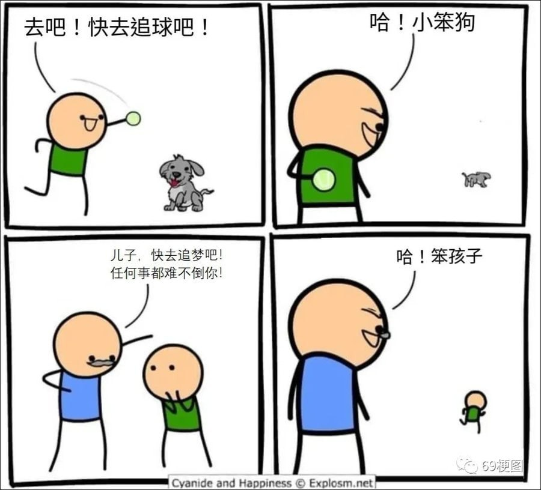
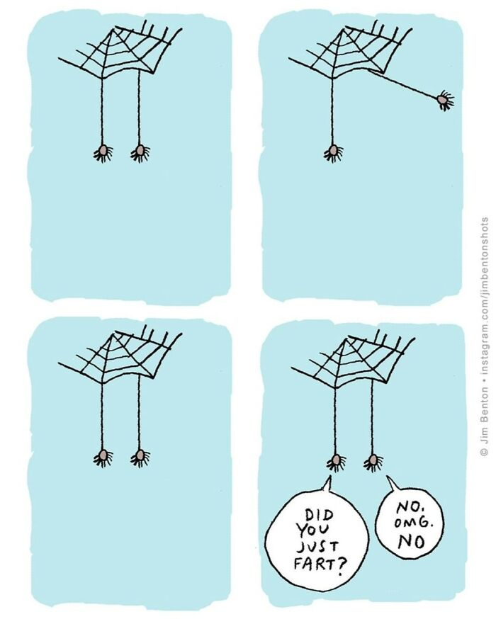
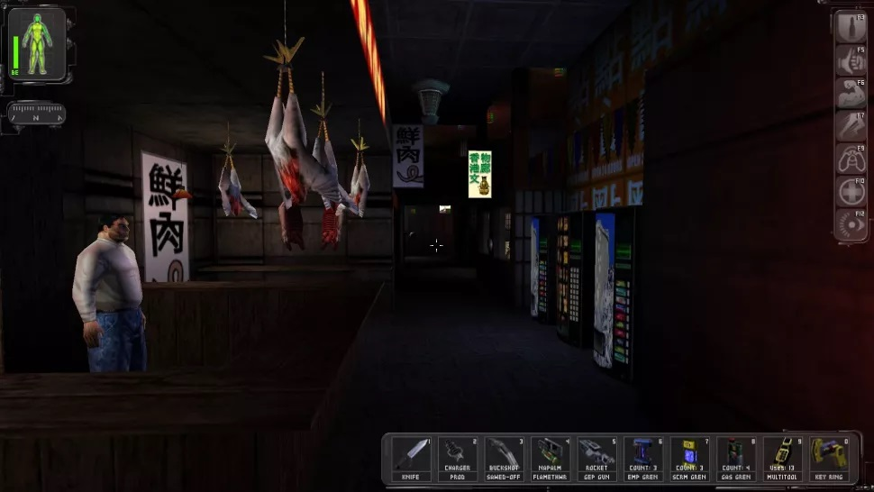
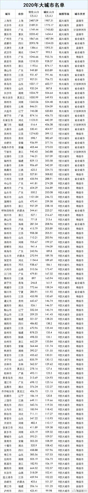

啰里啰唆周刊第33期：成年人不能被改变，只能被筛选

# 科技日常

## 1. 轻量级搜索方案ZincSearch

ZincSearch是一个基于golang的跨平台轻量级搜索解决方案，对标Elasticsearch，兼容Elasticsearch常用API，自带Web UI查看界面（轻量级Kibanna）,支持中文，目前还处在Alpha阶段，不适宜用于生产环境。

当然，目前ZincSearch仅支持单机方案，不支持HA和集群部署。

功能：

1. Provides full text indexing capability
2. Single binary for installation and running. 
3. Embedded Web UI for querying data written in Vue.
4. Full Compatibility with Elasticsearch APIs for ingestion of data (single record and bulk API)
5. Compatibility with Elasticsearch DSL for querying data.
6. Out of the box authentication
7. Schema less - No need to define schema upfront and different documents in the same index can have different fields.
8. Aggregation support and Highlight support.

https://github.com/zinclabs/zinc/

注：关于中文搜索的支持，可以看github上相关issue

## 2. MTU导致SSH登陆失败的问题

前几天，刚买的HK VPS老是ssh登陆不了，频繁重试很多次才能成功，刚一开始也没太当回事，感觉是网络不稳定被方教授墙了，但80端口还能访问，心想单独针对SSH墙不大可能，于是又一次SSH登录失败的时候，加了-vvv选项看了下，发现卡在了这里

```bash
debug2: mac_setup: found hmac-md5
debug1: kex: server->client aes128-ctr hmac-md5 none
debug2: mac_setup: found hmac-md5
debug1: kex: client->server aes128-ctr hmac-md5 none
debug1: sending SSH2_MSG_KEX_ECDH_INIT
debug1: expecting SSH2_MSG_KEX_ECDH_REPLY
```

就是这一行debug1: expecting SSH2_MSG_KEX_ECDH_REPLY,其实这就是MTU导致的。

除了修改MTU外，也可以让操作系统根据网络状况自动的调节 MTU。

参考：
http://www.snailbook.com/faq/mtu-mismatch.auto.html
https://wiki.archlinux.org/title/Sysctl#Enable_MTU_probing
https://blog.cloudflare.com/path-mtu-discovery-in-practice/

补充：SSH频繁掉线还跟客户端有问题，需要调整sshd配置，并且打开客户端keep alive机制。

## 3.国内免费云上数据库MemFireDB

MemFire Cloud是一个便捷、灵活、高效的数据库服务平台，依托于分布式数据库MemFireDB的云原生和线性扩展能力，为互联网用户提供一站式数据库自助服务。

说人话，就是提供免费的MemFireDB（其实就是基于PostgreSQL）数据库申请使用,可外网连接。
MemFireDB支持符合ANSI标准的结构化查询语言，兼容PostgreSQL 11.2版本。

目前公测区间，可创建数据库个数和容量不明（目测暂无限制），查询次数限额，SQL读操作次数：100 万次/月，SQL写操作次数：10 万次/月，每个数据库账号可用连接数为10个。

显然，不适合生产使用，但作为应急和测试，个人原型开发还是可以的。

https://www.memfiredb.com/

## 4.TikTok 从难民的乞求捐款中抽取七成

BBC 调查发现，叙利亚难民营中的难民在 TikTok 上乞求捐款，而 TikTok 公司从中抽取多达七成捐款。TikTok 表示将采取合适的行动打击“剥削乞讨”，称它从数字礼物中的抽成远低于七成，但拒绝透露具体数字。

今年早些时候，TikTok 用户注意到内容源出现了来自叙利亚难民营家庭的直播，部分用户担心有诈。BBC 在难民营的实地调查发现，这一趋势是由“TikTok 中间人”推动的，这些中间人向难民营家庭提供了智能手机和设备进行直播。中间人的工作机构隶属于 TikTok 中国和中东，是 TikTok 招募主播的全球策略的一部分，旨在鼓励用户在应用中投入更多时间。TikTok 的算法推荐是基于用户手机号码所在的地理位置，中间人偏爱使用英国 SIM 卡，称英国人最慷慨。

BBC 跟踪了 30 个账号 5 个月，发现难民账号直播一个小时能收到多达 1 千美元捐款。但难民表示他们只收到捐款总额的很小一部分。BBC 做了个实验：一名记者联络中间人称在难民营，获得账号后 BBC 在英国伦敦的工作人员从另一个账号向其发送了 106 美元的礼物。但这个测试账号最后只收到 33 美元，也就是 TikTok 抽走了 69% 的捐款。其他捐款者在得知这一抽走比例后认为这太荒诞了。这 33 美元事实上还无法全部拿到，中间人还要抽取 35%，从本地转账商店提取现金还要被拿走 10%，最后只剩下 19 美元。一名中间人表示他要抽成是因为需要支付手机、无线网络和 SIM 卡的费用。

咦，水滴筹文化输出了？

ref: https://www.bbc.com/news/world-63213567

## 5.谷歌正式推出 “密钥登录”，逐步取代传统密码登录

10 月 12 日，谷歌宣布在 Android 和 Chrome 中正式[推行](https://android-developers.googleblog.com/2022/10/bringing-passkeys-to-android-and-chrome.html)密钥登录 “PassKey”，以逐步替代长期使用的密码登录 “PassWord”。

密钥登录可以认为是 “生物密码” 和 “授权登录” 的结合。用户可以在 Android 手机上创建一个基于公钥加密的密钥凭据，创建密钥的时候需要对本人进行生物特征识别，比如 “指纹” 或者 “面部识别” 等。

创建完毕后，这个密钥凭据可用于解锁所有在线帐户 —— 既可以解锁 Android 手机上的帐户，也可以解锁附近所有设备的帐户。这个 FIDO（Fast IDentity Online） 密匙登录功能由 微软/苹果/谷歌 联合出品，属于行业标准。因此它是跨平台的，包括 Windows、macOS 和 iOS 以及 ChromeOS。换而言之，你可以用 Android 手机的密钥凭据解锁上述所有系统的帐户和网站。

当然，这也需要APP和网站去适配。比如GitHub 是最早改用网络认证(WebAuthn)进行双因素认证的安全密钥的公司之一，并且是 FIDO 通用第二因素(U2F)开放认证标准的早期采用者。

ref:https://fidoalliance.org/

## 6.PostgreSQL 15 释出

数据库管理系统 PostgreSQL 发布了 v15 版本。新版本进一步改进了性能，主要新特性包括：支持 SQL MERGE 命令；改进内存中和磁盘上的排序性能；Zstandard（zstd）压缩支持，支持 pg_basebackup 期间执行服务器端压缩；等等

https://www.postgresql.org/docs/15/release-15.html

## 7.Generated Humans – 100,000 张不存在的人类全身照片，免费、无肖像权

Generated Humans 发布了 100,000 张通过 AI 生成的，不存在的人类全身照片，免费、无肖像权，可在个人非商业项目中随意使用。

Generated Humans 发布的这一大组 10 万张虚拟人物照，已经进化为全身照片了，包括身体、衣物、鞋子等内容。这些图片以压缩包的形式提供。

整个包超过 1GB，解压缩后是整整 100,000 张照片，虽然尺寸都不大，清晰度也不高（256 × 512），但在一些展示页面使用，也足够了。另外还符合 GDPR、CCPA 和类似法规的要求。

而如果是商业项目，也只需要 $19.99/mo 就能获得商业授权和高清大图。

https://generated.photos/humans

类似的网站可以在线使用的人脸：https://thispersondoesnotexist.com/

## 8.超过九成韩国人使用 韩Kakao数据中心失火

韩国“国民聊天工具”的Kakao Talk、召车服务平台Kakao T、网银Kakao 
Pay等服务全部瘫痪，尤其给出租车司机和个体户的生意带来严重影响。总统尹锡悦指示科技部等政府相关部门彻查事故原因，并要求相关单位采取设立备用数据库等应急方案，完善事故汇报和应对系统。

# 读书与影视分享

## 1.豆瓣7.5分日本科幻小说《热带》

小说家森见登美彦为新作的构思而苦恼时，想起在大学时买过一本叫《热带》的小说，作者是佐山尚一。可他读到一半却发现这本书不见了，此后遍寻各大图书馆和书店都没有找到这本书。一次偶然的机会，他参加了“沉默读书会”，并见到了一位名叫白石珠子的女性，她手上就拿着一本《热带》。

各种各样的人因为相似的经历聚集在了一起，他们都读过《热带》，可惜没有读完书就离奇消失，大家纷纷讲出自己的回忆，试图拼凑出关于这本书结局的线索，然而，这些线索却引发了一场奇异的大冒险……

关于《热带》的故事，永远都不会结束。

作者是日本的森见登美彦，擅长魔幻现实主义风格。

> 前三章是层层扩展的套嵌，后三章的“解谜”篇章像是突然开始的折回跑，奇想与隐喻铺展开来的岛上故事，整体结构是个三角形。 看得见才能存在的不可视群岛；用佐山躯体构建而成的万物；化为山月记猛虎的学团佐山；缺少叙述者便无法再继续存在的岛屿；沙漠宫殿中无数尝试寻找女巫的石化人；想要直接对抗魔王抢夺魔法的海盗创造出毫无根基（非佐山躯体构成）的虚幻岛屿，这些统统像是创作时在混乱中不断崩塌重建的头脑风暴，最后败给了盒中世界与现实的鸿沟，通过魔法本质“回忆”创造的旧日景象，才是完成手记的关键。最终诞生的故事又化为谜之书，“世界就像深不可测的密林一般不断增殖”，千辛万苦渡过“无风带”的角色们传递创造着一个个崭新的世界，放下本书的读者也会在“还没完结的故事”中继续着围绕《热带》的大冒险吧。

>   前半部非常引人入胜，一直在跟随小说中的主人公追踪一本神奇的号称永远读不完的小说《热带》（读着读着几乎怀疑作者是在模仿村上春树，因为村上惯用的各种情节梗在此书中一一完美复现）。然后在页数正好达到全书一半之处进入后半部，画风突变，小说情节变得离奇而无聊，阅读体验仿佛陷入了泥沼。

嗯，读起来有难度。

## 2. 电影 《龙虾 The Lobster》 (2015)

2011年，希腊导演欧格斯·兰斯莫斯凭借电影《狗牙》（Dogtooth, 2009）获得奥斯卡最佳外语片提名。在《狗牙》中，导演建立了一个与外界彻底隔绝的极端集权家庭，一对父母通过绝对的权威和对语言的颠覆彻底控制着他们三个孩子的思想。在兰斯莫斯2015年的新片《龙虾》中，他又将另一个“主义”推至极致——乌托邦。

故事背景设定在一个虚构的近未来社会，居民的婚恋受到严格控制管理。根据规定，单身者要被集中移送到一个酒店里，他们必须要在45天之内找到一个匹配的伴侣，失败者会被转化为一种自选的动物，并被流放到森林中。为了延长45天的期限，酒店里的单身者们还会到森林里狩猎其他逃亡的单身者。

本片的主人公大卫（柯林·法瑞尔 Colin Farrell 饰）与一批单身者一同被送到酒店，他忍受着这里的各种严苛规定，同时也积极在酒店提供的各式各样的相亲场合中寻找伴侣。眼看期限将至，大卫还没有找到合适的伴侣。尝试和一个女人配对失败后，他逃到了酒店外面的森林，逃亡的单身者居住的地方。然而，在这个单身者反抗酒店制度的栖息地里，又有着另一套截然不同的制度……

> 前一个小时准四星，后一个小时直接掉到两星半。构建一套自己的世界观，然后照着这个高概念的规则来玩，单身狗有罪的部分不断有新规则可以有效的刺激观众，规则解释的差不多了，后面部分也就没什么趣味和刺激了，本该有的社会属性的反讽反而变得很肤浅，并没有什么力度可言，远不如前作

> 电影龙虾刚放映十分钟，荧幕前的我就已忍不住再一次掐腿暗叹：反乌托邦的精神内核和黑色喜剧的形式外壳实在是天造地设的一对。

> 该片每一帧画面都很冷静和酷，酒店内景和外部围绕的森林充满了梦境氛围。这部是一部前所未见并且值得反复观看的电影

# 图论

## 1. fool dog



## 2.fart



艺术家：More info: [Instagram](https://www.instagram.com/jimbentonshots/) | [jimbenton.com](http://www.jimbenton.com/)  | [twitter.com](https://twitter.com/JimBenton)

# 谈天说地

## 1.Secret


In 1982, Byron Peiss wrote a book called the Secret. In it, there are clues to 12 treasure boxes hidden in various places all around the US and Canada. As of 2022, only 3 of the 12 boxes have ever been found. If a box is discovered, you can exchange it for bragging rights and a precious gem.

The Secret: A Treasure Hunt! first set its hooks in me when I was eight years old. My mother had taken me to the little library in Bedford, outside Cleveland, and in the stacks there, I discovered this small bound book with a strange painting on the cover that hinted at some fantastic mystery. I took the book home with me and read about the twelve keys Byron Preiss had buried in cities across North America. I tried to decode the paintings and poems that held the locations of these keys. And I fretted that, by the time I was sixteen and had the freedom a driver's license could afford, all the keys would be found.

For his book, Preiss commissioned a young artist named John Jude Palencar (who went on to design the covers for the Eragon series) to create a dozen paintings. Each painting was paired with a poem. Used together, they pointed an armchair sleuth to a specific location. There, three feet underground, one could find a buried casque. Inside the casque was a ceramic key. And each key could be turned into the publisher, who would hand over a gem worth around $1,000.

ref:https://boingboing.net/2014/07/15/the-quest-to-find-12-hidden-tr.html

## 2.最佳100款PC游戏

当然，“this is our subjective list”，而且来自国外社区的测评和推荐。

多图长文。

https://www.pcgamer.com/the-top-100-pc-games-2022/

## 3.怎样证明你知道一个秘密

所谓的零知识证明，网络安全必修课。

零知识证明(Zero—Knowledge Proof)，是由S.Goldwasser、S.Micali及C.Rackoff在20世纪80年代初提出的。它指的是证明者能够在不向验证者提供任何有用的信息的情况下，使验证者相信某个论断是正确的。零知识证明实质上是一种涉及两方或更多方的协议，即两方或更多方完成一项任务所需采取的一系列步骤。证明者向验证者证明并使其相信自己知道或拥有某一消息，但证明过程不能向验证者泄漏任何关于被证明消息的信息。大量事实证明，零知识证明在密码学中非常有用。如果能够将零知识证明用于验证，将可以有效解决许多问题。

https://www.quantamagazine.org/how-to-prove-you-know-a-secret-without-giving-it-away-20221011/

## 4. 4个县级市获明确为大城市

近日，国务院第七次全国人口普查领导小组办公室编制的《2020中国人口普查分县资料》显示，目前我国共有105个大城市，包括7个超大城市、14个特大城市、14个Ⅰ型大城市以及70个Ⅱ型大城市。其中，683个城市（包括直辖市、计划单列市、省会城市、普通地级市及县级市）的城区人口数据也对外公开。根据城区常住人口数量，将城市分为五类七档：城区常住人口1000万以上城市为超大城市，500万~1000万为特大城市，而300万~500万的I型大城市和100万~300万的Ⅱ型大城市并称为大城市。超大城市包括：上海、北京、深圳、重庆、广州、成都、天津。特大城市包括：武汉、东莞、西安、杭州、佛山、南京、沈阳、青岛、济南、长沙、哈尔滨、郑州、昆明、大连。值得注意的是，在这105个大城市中，包括了4个县级市，分别是江苏昆山、浙江义乌、浙江慈溪和福建晋江，均为Ⅱ型大城市。（澎湃新闻）



# 一句话快讯

1.NASA 执行双小行星重定向测试(DART)任务的飞船于 9 月 26日成功撞击了名为 Dimorphos 的小行星。这是世界首次行星防御技术演示，测试撞击是否可能偏转小行星轨道。本周二 NASA 宣布 DART 成功偏转小行星轨道。Dimorphos 是一颗直径不到 200 米的小行星，DART 设计正面撞击，减速降低其轨道。现在地面观测确认其轨道缩短了。在撞击前 Dimorphos 完成一周轨道需要 11 小时 55 分钟，撞击后缩短到 11 小时 23 分钟，即减少了 32 分钟。NASA 的雷达观测确认 Dimorphos 与双小行星系统中的另一颗 Didymos 的距离减少了，缩短了几十米。

2.据九寨沟门票预订系统，九寨沟在国庆期间订票量在200张左右。国庆结束以来预订状况持续惨淡，10月8日至10日期间仅64人订票。而九寨沟此前规划的国庆期间单日限量接待人数上限为4.1万人。

3.据Choice数据显示，2022年三季度中国企业500强总市值约为63.27万亿元，贵州茅台超过腾讯控股成为三季度市值最高的企业，总市值2.35万亿元，阿里巴巴仍旧位列第三。

# 联系方式

啰里啰唆是一份针对互联网和生活爱好者的数字杂志，旨在发现和分享一切有趣的东西。话题不固定，每期大约十五分钟阅读量，暂定每周四发布。部分内容来自互联网采编，如果为有来源的转载，均会注明转载地址或保留水印。

这是一个关注人文和科技的newsletter。

使用方法建议或素材提供

频道：notonlyshare

github地址：[https://github.com/iminto/luoliluosuo-weekly](https://github.com/iminto/luoliluosuo-weekly)
