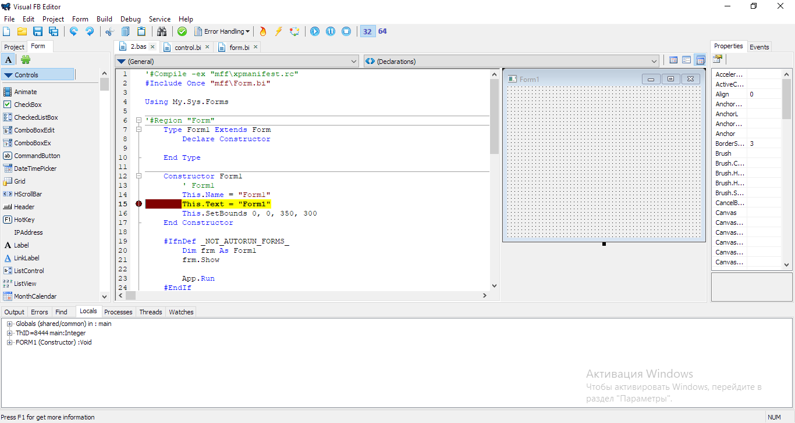
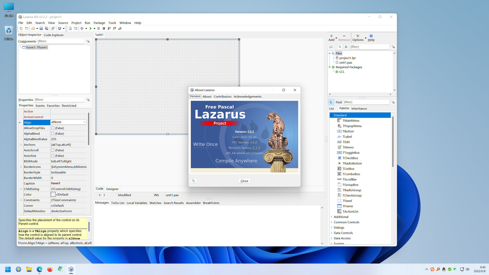
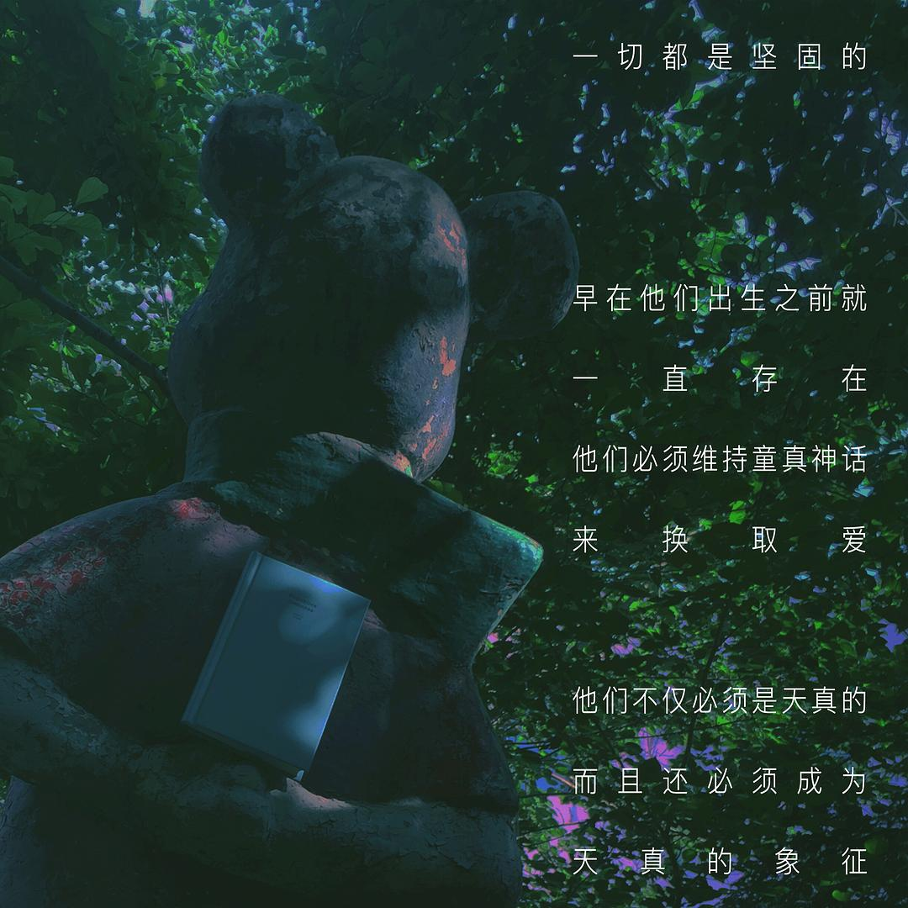
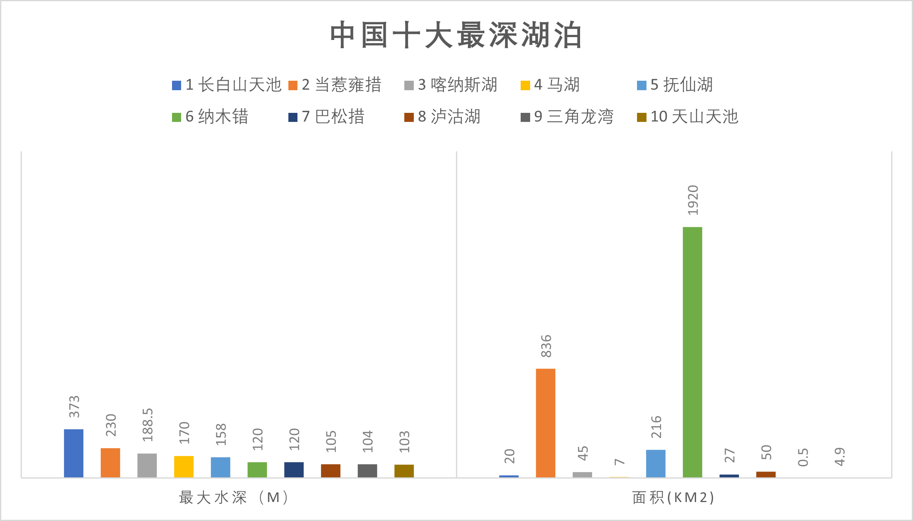
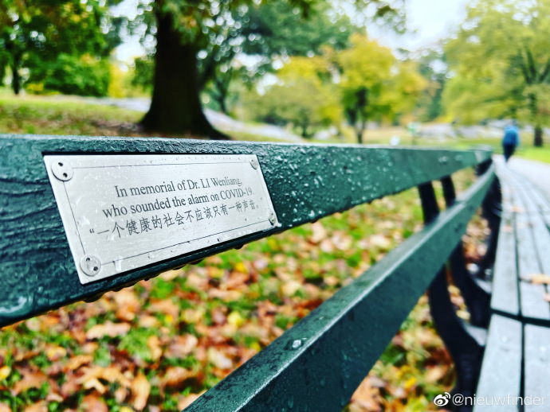

啰里啰唆周刊第34期：充实，而不是困苦

# 科技日常

## 1.MarkText 另一款MarkDown编辑器

前几天，Windows上用了很久的Typora老版本不让用了（要不是居家办公专有软件必须Windows，其实我日常基本不用Windows），直接弹窗版本太低。其实半年前就不断听到周边的和网上有谈到类似情况，Typora收费是一年多前的事了，但是悄悄撤下之前的旧版链接，弹窗让旧版无法使用的做法，我不知道是否合理。虽然试用版是可以设置试用期限的，但是对于非收费之前的版本，如果没有明确的约定，是否应该远程收回试用呢。

之前推荐过[Zettlr](https://www.zettlr.com/)这款跨平台开源免费编辑器，今天试了下MarkText也不错，图片插入功能一样好用（可插入网络图片），也支持PDF导出，但是对TOC支持有点弱（[issue 3357](https://github.com/marktext/marktext/issues/3357)），书签功能暂不支持。毕竟导出带书签的PDF不是每日刚需。

说实话，颜值还不错，但它的图片插入功能我居然找了半天没找到，居然是在format菜单里（也能用快捷键插入）。它有个  @ 的快捷插入功能，但还不支持插入图片。

另外，它的插入超链接功能太自动化了，直接把链接的title带上了。。。而很多时候是不需要的。

https://github.com/marktext/marktext/

综合比较下，还是Zettlr好用些。

## 2.Visual FB Editor 即古老又现代的GUI编程IDE

Visual FreeBasic Editor可以生成在Windows,Linux, Dos，Android下使用的32位及64位绿色免安装程序，语言风格类似VB.NET的Basic语言。

Visual FreeBasic Editor使用[MyFbFramework](https://github.com/XusinboyBekchanov/MyFbFramework)框架，MyFbFramework框架是类C语言的Basic语系的freeBASIC编程语言编写的公用，基本控件库，目前共有83个公用类，控件。语法在本质上类似于编程语言vb.net， 使用这些类即可快速、轻松地创建类型安全软件产品。

该IDE需要另外下载FreeBASIC编译器，FreeBASIC编译器官方地址: [http://www.freebasic.net](http://www.freebasic.net)，FreeBASIC编译器其他下载地址[https://users.freebasic-portal.de/stw/builds/](https://users.freebasic-portal.de/stw/builds/)

ref: [https://github.com/XusinboyBekchanov/VisualFBEditor/](https://github.com/XusinboyBekchanov/VisualFBEditor/)

毕竟有时候要搞个GUI，现在还真没啥特别好的语言和IDE，2012年的时候我一搞航天的老同学还在用死了10多年的foxpro做自己工作中需要使用的GUI软件。

我试了下，这是一款国内个人作品，完成质量还不是很高。。新建项目都报错了，提示找不到模板。。不过freeBasic是一个成熟的国外项目，可以玩玩

## 3.Lazarus 开源Delphi继承者

Lazarus is a Delphi compatible cross-platform IDE for Rapid Application Development. It has variety of components ready for use and a graphical form designer to easily create complex graphical user interfaces.

相比上面提到的Visual FreeBasic Editor，Lazarus是一款更成熟的，社区驱动的GUI IDE。文档丰富，有成熟的作品。**Cheat Engine**，**Beyond Compare**，**Pea Zip**，**CudaText** 等软件都是使用Lazarus开发的。

免费开源，跨平台，支持：Windows, Linux, macOS, FreeBSD。体积大约200M。

Lazarus 使用 Free Pascal 和 Free VCL (LCL) 基本做到和 Delphi 项目源代码级别的兼容了，喜欢 Delphi 开发的，迁移 Lazarus 基本上都很容易。

https://www.lazarus-ide.org/

Lazarus还有一个fork叫[CodeTyphon](https://www.pilotlogic.com/sitejoom/)，预先打包了很多组件，这个体积就大了，快1.2G了。

有一款活跃了17年的软件，[AAuto Quicker](https://www.aardio.com/)，又叫“快手”，这个才是Windows下的GUI神器，不到6M的体积，无所不能，能调用各种主流语言API，能开发GUI，能搞汇编底层，也能搞网站。我也用其开发过几个安全相关的软件。这个软件不开源，全凭作者一人之力开发，作者是个身怀绝技，个性鲜明的一刀斩侠客，因其个性太鲜明（或许是爱骂战，或许是言辞激烈），加上和各种商业软件有利益冲突，并且主要面向群体为小白（这就很难搞），导致推广一直不利，仅流行在小众群体。

## 4.OpenBSD 7.2 发布

OpenBSD 发行版的第 53 个版本 [v7.2](https://www.openbsd.org/72.html) 释出。主要新变化包括：支持新平台如 Ampere Altra、苹果 M2，联想 ThinkPad x13s 和其它使用高通 Snapdragon 8cx Gen 3 (SC8280XP)SoC 的设备；多项内核改进，SMP 改进，更新 drm(4) 到 Linux 5.15.69，等等，更多可浏览发布公告。

BSD首页有句名言,足见其对安全的自信。

> Only two remote holes in the default install, in a heck of a long time! 

小的时候，03年那时候，BSD另一个版本FreeBSD还挺流行的，现在很少听说有人在用了，不过据说一些嵌入式还有在用的。

## 5.Tessercube 加密输入法

Tessercube是一款拥有加密功能的输入法。这款输入法和浏览器插件一样，非常巧妙地利用了一个现成的入口：输入法天然覆盖了大多数场景，它是很多人每天都要使用到的高频工具。如果能在这个入口上提供方便可用的加密工具，就能在使用许多产品的同时，自由地加解密所发送的消息和内容。

比如，你在whatsApp上聊天时可以通过 Tessercube 输入法，把要发送的消息先加密成乱码，然后通过whatsApp发送给对方，对方复制加密后的消息，会触发输入法自动完成解密，然后展示出正确的信息。这套交互方案使用到了 Android 一个原生的 API，让输入法一直置于浮层，能随时随地检测剪贴板中复制的加密消息。

需要注意的是，Tessercube使用的PGP加密，一个简短的句子会变成很长的加密串，这在中国大陆地区是不适用的，因为特征明显，如果在微信中使用很容易触发张小龙的怒火。

目前Tessercube正在开发的2.0版本还没释出，早先的版本可以在应用市场轻易下载到。

需要提示的是，Tessercube不是国外产品，是由中国**上海**的一个团队开发的，宣传的也是web 3.0，因此我对其持续发展并不看好，并且也两年多没更新了。虽然如此，还是推荐下这种思路。

官网：[https://tessercube.com/](https://tessercube.com/)

还是老观点，**我对web 3.0充满偏见**，坑蒙拐骗少不了。

其实吧，一个轻度混淆的输入法会更有存在价值，比如基于rime的“方言”输入法。

## 6.卡塔尔世界杯官方应用被指是间谍软件

卡塔尔世界杯将于 2022 年 11 月 20 日至 12 月 19 日举行，期间前往卡塔尔的人都需要下载安装两个应用—— Ehteraz 和  Hayya，Ehteraz 是 covid-19 追踪应用，Hayya 是世界杯官方应用，用于跟踪比赛门票和访问免费地铁。Ehteraz 和  Hayya 都被指存在安全隐私问题，[被认为是间谍软件](https://yro.slashdot.org/story/22/10/18/225221/visitors-of-qatar-world-cup-need-to-install-spyware-on-their-phone)。Ehteraz 要求访问读取、删除或更改手机所有内容的权限，连接 WiFi 和蓝牙、覆盖其他应用和防止手机进入睡眠模式的权限。Hayya 索要的权限没有那么多，但也要求几乎不受限制的分享个人信息，以及定位和防止睡眠等权限。

## 7.Win11 推出 “Moment 1” 更新下载：带来文件管理器标签页等新功能

微软最近向 Windows 11 2022 (22H2) 推送了一个功能更新补丁，被称为「Moment 1」更新。微软这个更新补丁的最大亮点在于，为 Windows 11 文件资源管理器开启“多标签页”模式。

这次 Windows 11 Moment 1 升级补丁的是一个可选的更新，目前用户要在 Windows 更新中手动搜索才可以下载它。据称微软将会在 2022 年 11 月的 “补丁星期二” 提供给所有 Win11 22H2 的用户。

# 读书与影视分享

## 1.1998年贾樟柯执导电影《小武》

《小武》是贾樟柯编剧并执导的独立制片剧情电影，由王宏伟、郝鸿建、左雯璐等主演，于1998年2月18日在德国上映。该片讲述了生活在中部某小县城的梁小武在接连失去友情、爱情和亲情后最终失去自由，成为囚徒的过程。

 **贾导出品，必属禁(精)片**。

1997年的山西汾阳，自称是干手艺活的扒手小武整天戴着粗黑框眼镜，不笑也不怎么说话，歪斜着头，用舌头顶着腮帮子，四处游荡。小武感觉无法适应社会的变化，很清楚自己必然要被淘汰。以前的“战友”，现在成为县里著名企业家、纳税大户的小勇,结婚给所有人发了请帖，唯独没有发给小武。两人在屋里坐了半天，却觉得无话可说。在小勇结婚时，小武遵照以前的誓言送钱给他，小勇觉得钱脏而将其退回。在被朋友拒绝后，小武便经常去唱歌，结识了歌女胡梅梅。

小武一有空便陪胡梅梅逛街，时常给她打电话，但没过多久胡梅梅便将小武无情抛弃。小武回到家中，家里却没有人肯接受他。小武最终被父亲赶出了家门。最后，小武在一次例行“工作”时，被公安干警抓获并铐在了电线杆上。街上的行人冷漠地看着他，他冷漠地看着街上的行人

> 送不出去的礼金，是找不回来的情分，就算天天去看喋血双雄，也抓不住纯真。唱不出口的心雨，是说不清楚的孤独，就算天天守着呼机发呆，也留不住旧人。谁说盗贼不讲仁义，谁说欢场没有真情，只是这天色变得太快，小武还来不及驻足，却已经到了黄昏。贾樟柯用粗粝的影像，却清晰的勾勒出一个被遗忘的人。

> 旧的已经拆了，新的在哪里呢？时代转型变革时期的困窘，有人搭上了顺风车，有人追不上步伐显得很狼狈，亦有人无所适从眷恋过去。小武的念念不忘、耿耿于怀，这是深情的一桩悲剧。结尾的群众围观长镜头十分震撼，几乎让我都感受到了被窥视和围观的困窘和不适。影片里屡见的“烟雾”意象也十分动人。

## 2. 小说《光明共和国》

安德烈斯·巴尔瓦（AndrésBarba，1975— ），西语界当红小说家，2010年，巴尔瓦被《格兰塔》杂志评选为二十二个最杰出的西语青年作家之一。曾于1997年和2006年两获托伦特·巴列斯特尔叙事文学奖，2007年获阿纳格拉玛散文奖，2011年获胡安·马奇叙事文学奖，2017年获赫拉尔德小说奖。

> “世界失败的那天清晨，人们正忙着搜捕几个流浪的孩子。”

《黑暗之心》+《蝇王》，一部虚构的美洲编年史，一部寓言式的现代启示录。

虚构的中美洲城市圣克里斯托瓦尔，曾经与周边任何一座大城市一般无二，地区的经济中心，种植茶叶和柑橘。随着小企业的繁荣发展、水电站的建造与河道的修葺，整座城市开始加入到现代文明的行列。人们如此沉浸在繁荣中，却不知他们身处的世界早已全然失效，变成了一个粗陋的、没有意义的构造，官僚机构像沾了胶水的网一般笼罩着所有人，生活像节拍器一样呆板而乏味，有的房子把它的住户变成了爬行动物，有的把他们变成了人，也有的，把他们变成了昆虫。
有一天，圣克里斯托瓦尔的街头突然出现了一群来路不明的孩子，衣衫褴褛，面黄肌瘦，说着无人能懂的语言。起先他们靠沿街乞讨过活，随即开展了一系列破坏活动。更令人心惊的是，本地的孩子似乎也被这种暴乱的气息感染了，有人声称能听到他们的心声，有人在暗夜里加入了他们的行列。在政府的搜捕之下，孩子们先是躲进大森林，后来又藏进下水道，在那里，建立起了一个名为“光明共和国”的法外之地……
“世界就是这样告终，不是嘭的一响，而是嘘的一声。”孩子们是新世界的美梦，旧世界的遗民，他们的出现，恰如一声轻轻的叹息，宣告了古老美洲文明的终结；如下水道中精心搭建的光之殿堂，破开了目之所及的一切迷雾。

> 儿童不是自动变成大人的——人在一系列破碎、断裂、堕落、告别、妥协和重建中成长为社会人，遵循条框规约礼俗理法，反过来，成年人也更难以循着一条清晰可辨的路径识认自己的童年。

# 图论

## 1.Fruit Gone Bad

Meet the artist John King who is behind the comic series "Fruit gone bad". The NY cartoonist’s 80k+ 
followers on Instagram absolutely love the jokes and sense of humor the 
artist has! In a world where broccoli can cuss and chilis are up to no 
good in your intestines, just what kind of personalities do they have? 
Well, it's up to you to find out!

艺术家: [Instagram](https://www.instagram.com/fruitgonebad/)

## 2.中国十大最深天然湖泊

以上数据不包括人工水库。

## 3.在这个长椅上坐了良久，忍不住泪奔了

美国中央公园西96街入口处不远

ref:[https://weibo.com/nieuwfinder](https://weibo.com/nieuwfinder)

# 谈天说地

## 1.义和拳梦呓

抖音有个视频在朋友圈里疯传。说中国研制出一种核弹，像同步卫星，在地球上空轨道上运行，覆盖地球每个角落。如果发生世界大战，中国就会对上空运行的核弹，发出打击地球上的目标指令，核弹就会以第二宇宙速度弹出轨道，直击目标。敌方无任何还手之力。  
百年前的义和拳梦呓，还在延续。部分中国人的精神萎缩症，百年未见好转。  
但这样的愚民谣言，不见被删除。  
前几天，也是从强化意识形态宣传的需要，说欧洲因缺少俄罗斯煤气，冬天难熬。中国电热毯，热销欧洲。这样的谣言不仅鼓舞了国人从俄乌冲突中获利的沾沾自喜，有人利用这则谣言，收割了A股里韭菜。相关行业的股票，连续八个涨停。实际情况是，该企业从欧洲获得的电热毯订单，微乎其微，同比营业收入下降了百分之十几，根本无法支撑目前股价。  
这些事例说明，纵容乃至鼓励造一些“世界皆遭，风景这边独好”的谣言，貌似能鼓舞人心和士气。一个谣言满天飞的社会，首先从道德上就败坏下来了。  
相反，一些有价值的提醒乃至建议，常遭秒删。  
我们不能以“安全”的名义，阻止信息的自然流通；不能以“自信”拒绝有益的参考与建议；不能以“伟大”忽视接地气的卑贱。  
我们曾经吃过空洞无物的大亏。 anyway 不至于两次掉到阴沟里吧？

ref: [钱言](https://weibo.com/2re90)

## 2.《星球大战》的一些琐事

一个喜欢淘旧书的朋友，弄到了一套80年湖南人民出版社的《星球大战》中译本小说，应该算是国内最早的译本之一，比我年纪还大。其中有一个出版细节很有意思：

1980年6月出版了第一部《新希望》小说，印数三十万册；1981年3月出版了第二部《帝国反击战》，印数十五万一千册；然后在1986年10月出版了第三部《绝地归来》，印数是……四千七百册。  
可见星战从一开始进入中国，就是个冷圈……  
但这里有一个好玩的细节。  
如果大家仔细看第二部的出版页，会发现这里的出版日期写的是1980年3月。这是个很低级的编辑错误，因为《帝国反击战》电影在美国首映是80年5月，小说版上市是80年4月。湖南人民出版社的编辑除非手眼通天，才能跨越万里重洋，从美国印厂拿到样稿，然后光速翻译完，赶在3月出版。  
事实上，这本书的编辑前言，落款明确是80年10月写成，那么81年3月出版，符合当时中国的出版节奏。  
为什么湖南人民出版社要翻译这么一套书呢？有一个可能的原因。1980年5月，时任中华人民共和国副总理耿飚访美，卡特总统邀请他在白宫观看了《帝国反击战》。（同行的还有刘华清将军，并在小鹰号航母上留下一张著名照片）不知是不是编辑看到这条新闻，受到了启发，才决定引进。  
湖南社对这部书的重视程度很高，第一部首印三十万印量，第二部首印十五万印量，在当时可是大手笔。而且责任编辑和译者都是当时的精兵强将。  
比如第二部《帝国反击战》的责任编辑，是译文编辑室主任唐荫荪。这是一位资深翻译家，译过马克吐温、王尔德、奥斯丁、毛姆、爱伦坡，还有各种诗论、诗选。尤其是他翻译的《鲁滨逊漂流记》版本，在当时中国流行颇广。  
不知道老先生接手负责《星球大战》这么一个新生事物，是什么心情。  
我猜，肯定心情不太好……  
从印数就能看出来，从三十万到十五万，到1986年出版第三部时，只有几千册，可谓惨遭滑铁卢。可以想象前两部亏得有多惨。  
恰好就在这一年，湖南人民出版社遭遇了经营困境，估计跟他们在星战小说上的血本无归，不无关系。  
就在此时，唐荫荪无意中获得了一本1936年出版的《查泰莱夫人的情人》中译本，译者很神秘，署名饶述一，但真身不明。唐荫荪建议再版此书，以《查》的题材和内容，市场反响会很好，可以弥补出版社的亏空。（很大部分是星战三部曲的亏空）  
1987年初，湖南人民出版社终于推出了《查泰莱夫人的情人》再版。这次他们谨慎多了，首印只有九万册。但……市场直接爆了，追加订单迅速攀升到三十六万册。然后，就没有然后了。一个书店经理因为订不到货，直接举报此书为淫秽书籍。虽然出版社辩解说这是世界名著，但迫于出版局的压力，到底还是把这些书回收销毁，负责人还挨了处分。

source:马伯庸

## 3. 国家兴亡肉食者谋之，天下兴亡匹夫有责

魏明帝殂，少帝即位，改元正始，凡九年。其十年，则太傅司马懿杀大将军曹爽，而魏之大权移矣。三国鼎立，至此垂三十年，一时名士风流，盛于洛下。乃其弃经典而尚老庄，蔑礼法而崇放达，视其主之颠危若路人然，即此诸贤为之倡也。自此以后，竞相祖述。如《晋书》言王敦见卫玠，谓长史谢鲲曰：“不意永嘉之末，复闻正始之音。”沙门支遁以清谈著名于时，莫不崇敬，以为“造微之功，足参诸正始。”

《宋书》言羊玄保二子，太祖赐名曰咸、曰粲，谓玄保曰：“欲令卿二子有林下正始余风。”王微《与何偃书》曰：“卿少陶玄风，淹雅修畅，自是正始中人。”《南齐书》言袁粲言于帝曰：“臣观张绪有正始遗风。”《南史》言何尚之谓王球“正始之风尚在”。其为后人企羡如此。

然而《晋书·儒林传序》云：“摒阙里之典经，习正始之余论，指礼法为流俗，目纵诞以清高。”此则虚名虽被于时流，笃论未忘乎学者。是以讲明六艺，郑、王为集汉之终；演说老庄，王、何为开晋之始。以至国亡于上，教沦于下，羌胡互僭，君臣屡易，非林下诸贤之咎而谁咎哉！

有亡国，有亡天下。亡国与亡天下奚辨？曰：易姓改号，谓之亡国；仁义充塞，而至于率兽食人，人将相食，谓之亡天下。魏、晋人之清谈，何以亡天下？是《孟子》所谓杨、墨之言，至于使天下无父无君而入于禽兽者也。昔者嵇绍之父康被杀于晋文王，至武帝革命之时，而山涛荐之入仕。绍时屏居私门，欲辞不就。涛谓之曰：“为君思之久矣，天地四时犹有消息，而况于人乎？”一时传诵，以为名言，而不知其败义伤教，至于率天下而无父者也。夫绍之于晋，非其君也，忘其父而事非其君，当其未死三十余年之间，为无父之人亦以久矣，而荡阴之死，何足以赎其罪乎！且其入仕之初，岂知必有乘舆败绩之事而可树其忠名以盖于晚也？

自正始以来，而大义之不明，遍于天下，如山涛者既为邪说之魁，遂使嵇绍之贤，且犯天下之不韪而不顾。夫邪正之说，不容两立，使谓绍为忠，则必谓王裒为不忠而后可也。何怪其相率臣于刘聪、石勒，观其故主青衣行酒而不以动其心者乎？是故知保天下，然后知保其国。保国者，其君其臣肉食者谋之；保天下者，匹夫之贱与有责焉耳矣。

作者：顾炎武 《日知录·卷十三·正始》

## 4.赛博朋克风再起时，香港霓虹正在消失

今年，赛博朋克的风又刮了起来。一部《赛博朋克：边缘行者》的热播动画，不仅让游戏《赛博朋克 2077》的玩家数量暴涨近 400%，也让赛博朋克风再度成为亚文化讨论焦点。而说起赛博朋克美学，则绕不开一座城——香港。

香港街头琳琅满目的霓虹灯招牌，曾是赛博朋克视觉想象的灵感之源，但时至今日，这些霓虹魅影正在被拆除、消亡、遗忘。

Cyberpunk 一词源自 1983 年美国作家 Bruce Bethke 创作的短篇小说，是 Cybernetics 与 Punk 的结合词。Cybernetics 是一种「关于在动物和机器中控制和通信」的科学研究，又称模控学，Punk 则是由 1960 年代摇滚乐流派延伸出来的词，指涉那些对主流社会充满反叛精神的边缘人群。

赛博朋克作品一般设定在科技高度发达的近未来，模控化的义体人或仿生人被大量应用，同时，这样的社会又往往被极权政府、跨国财团或秘密组织所掌控，导致贫富差距严重，恶劣的生存环境刺激底层 punk 们进行反叛。因此，高科技、低生活的反乌托邦景象成为赛博朋克作品的鲜明特征。

而赛博朋克的视觉化构建，是早于这个词诞生的。1982年的电影《银翼杀手》，可以说是奠定了赛博朋克视觉美学的基础。片中总是雨水潮湿的街道、鱼龙混杂的路边摊、荧光闪烁的立面装饰、英文与亚洲文字混杂的霓虹灯招牌……成为众多观众心目中对于赛博朋克的经典印象，导演雷德利·斯科特曾经表示，这些布景的感觉是参考了「天气很差时的香港街道」。

[https://sspai.com/post/76030](https://sspai.com/post/76030)

## 5.商陆-山萝卜

商陆（Phytolacca acinosa Roxb），商陆科、商陆属多年生粗壮草本植物。广布于长江以南红壤低丘陵地区，在中国现有分布的品种中主要有商陆（野萝卜）和垂序商陆（美商陆、美洲商陆、十蕊商陆）。各地根据其形态称其为大苋菜、山萝卜、花商陆、胭脂等。因为形态极似马齿苋科的栌兰（俗称土高丽参或土人参）而被各地误当作土人参栽种。根肥厚，肉质，圆锥形。叶卵圆形，全缘。夏秋开花，花白色，总状花序。心皮八个，离生。浆果扁球形，紫黑色。果序直立。

药用商陆的干燥根。秋季至次春采挖，除去须根和泥沙，切成块或片，晒干或阴干。根入药，以白色肥大者为佳，**红根有剧毒**，仅供外用。

商陆果实可以用作染料，过去用来染土布。

小时候某个见过世面的大佬，自称是人参，带回来一包商陆，在院子里种了一地，最后问大佬能不能吃，大佬不敢肯定，就让刨了。。其实商陆也不全有毒，商陆有两种，茎紫红者有毒，不能食用，而绿茎商陆苗是一种优质野生森林菜蔬。

## 6.古尔德告诉我们：美学的本质就是孤独

在多伦多安乐山公墓

一块钢琴图案的花岗岩墓碑上刻着

**格伦·古尔德**

1932-1982

就在这行小字的下方

刻着一行高音谱表

是《哥德堡变奏曲》的开头部分

此地，此曲，便是古尔德永远的归宿

隔着屏幕，真想问一下那些忠实的巴赫粉丝，是否对古尔德矢志不渝相伴的那把吱吱作响的破椅子好奇？是否为古尔德弹奏时陶醉的哼唱诧异过？每每我一个人在家，万籁俱静的孤夜听巴赫，总是会不经意被古尔德的这般鬼魂哼唱吓到毛骨悚然。

尽管知道不少古尔德的怪癖以及无数关于他的辉煌传奇，但当第一次看他弹《哥德堡变奏曲》，猫着腰，耸着肩，蜷缩在钢琴前的姿势时，一下子颠覆了我观念中钢琴弹奏者高贵的模样。他像雨果名著《巴黎圣母院》里的钟楼怪人卡西莫多，像不死胡杨林般孤独，一阵心酸，为之流下泪水！他只沉浸在自己的世界里，不轻易让人打扰他的清梦，天才到自虐的古尔德只在音乐的世界里肆意挥洒着他的天资聪颖。

ref:[https://mp.weixin.qq.com/s/ZBqoE11QUD7_w7pnWZW02A](https://mp.weixin.qq.com/s/ZBqoE11QUD7_w7pnWZW02A)

# 一句话快讯

1.好莱坞第一位亚裔电影明星黄柳霜[将成为首位印在美元上的亚裔美国人](https://cn.nytimes.com/usa/20221019/anna-may-wong-quarter/)。美国造币厂于周一开始生产有黄柳霜形象的 25 美分硬币，上面是她的面部特写，纤纤玉手托着她的脸庞，该设计属于一个钱币新版系列的一部分，其他新面孔还包括作家玛雅·安吉洛和宇航员萨莉·莱德。美国造币厂预计将铸造超过3 亿枚黄柳霜 25 美分硬币。黄柳霜于 1905 年出生在洛杉矶的唐人街，她的父母开了一家洗衣店。大约在那个时候，电影业进驻洛杉矶，越来越多作品在黄柳霜家附近的街区拍摄。黄柳霜决心成为演员，并开始跑龙套，直到她17 岁时在《海逝》(The Toll of the Sea, 1922)中首次担任主角。黄柳霜是一位有争议的女演员，因为她扮演的华裔形象被部分华人认为辱华。

2.当地时间10月20日，英国首相特拉斯在英国首相府唐宁街十号发表演说，宣布辞职。英国前财政大臣,80后印度裔里希·苏纳克即将接任。

3.10月24日，有网友反映，cnBeta网站无法登录，同时有站长在v2ex社区爆料称，cnBeta因接入的广告涉政导致国内备案被取消，停止了国内解析。查询发现，cnbeta在国内的备案已经注销。cnbeta成立于2003年，是国内即时科技资讯站点和网友交流平台，在IT业界拥有独特的影响力。cnBeta的站长为张越，来自浙江台州。

4.财政部、海关总署、税务总局发布关于[#对电子烟征收消费税#](https://s.weibo.com/weibo?q=%23%E5%AF%B9%E7%94%B5%E5%AD%90%E7%83%9F%E5%BE%81%E6%94%B6%E6%B6%88%E8%B4%B9%E7%A8%8E%23)的公告。将电子烟纳入消费税征收范围，在烟税目下增设电子烟子目。电子烟实行从价定率的办法计算纳税。生产（进口）环节的税率为36%，批发环节的税率为11%。 

5.国家统计局和相关报道，中国有注册外卖骑手1300万，出租车和网约车司机700万，保险业务员500万。

# 联系方式

啰里啰唆是一份针对互联网和生活爱好者的数字杂志，旨在发现和分享一切有趣的东西。话题不固定，每期大约十五分钟阅读量，暂定每周四发布。部分内容来自互联网采编，如果为有来源的转载，均会注明转载地址或保留水印。

这是一个关注人文和科技的newsletter。

使用方法建议或素材提供

频道：notonlyshare

github地址：[https://github.com/iminto/luoliluosuo-weekly](https://github.com/iminto/luoliluosuo-weekly)
