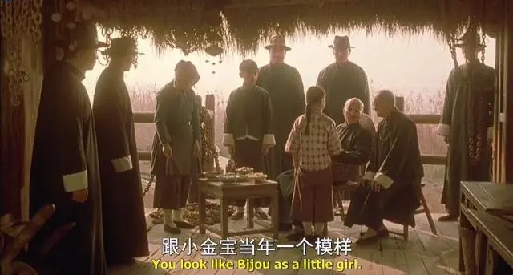
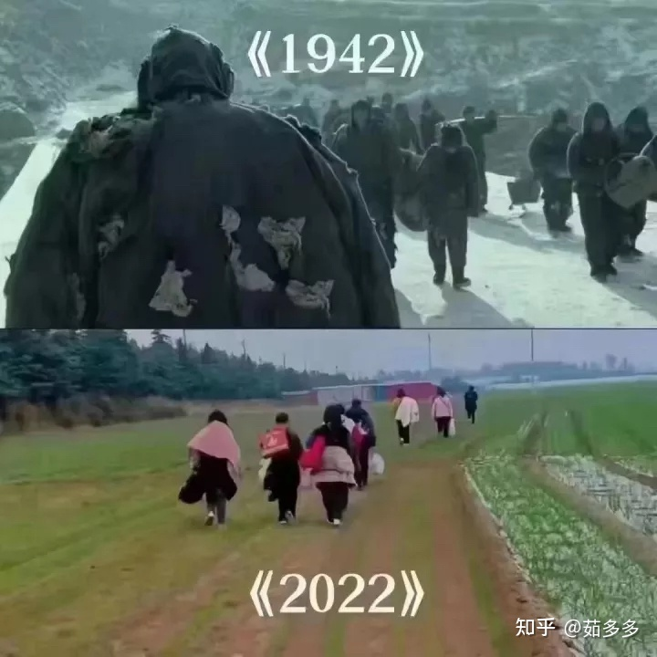
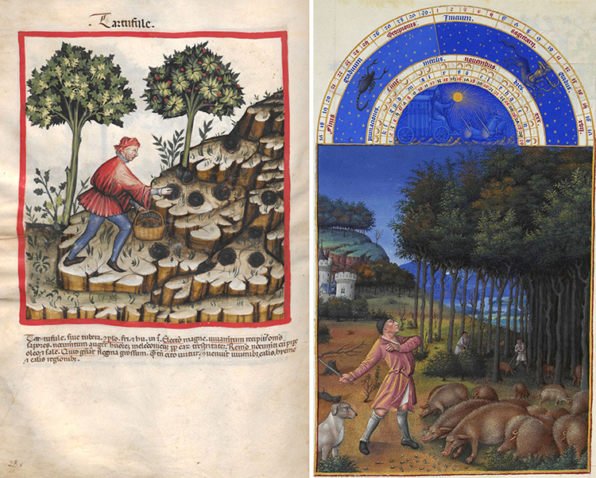

啰里啰唆周刊第35期：西郊有密林，助君出重围

# 科技日常

## 1.多功能跨平台下载软件-文件蜈蚣filexx 2.7

文件蜈蚣是一个全能网络文件上传/下载器, BitTorrent客户端, WebDAV客户端, FTP客户端, 和SSH客户端.  
它快速, 可定制, 用户友好, 多协议支持, 同时也包含了很多有用的辅助工具如: HTTP请求器, 文件合并工具, 编码/解码工具等.  
和网页浏览器进行集成, 你可以从网页上下载音频和视频, 甚至是加密视频.

文件蜈蚣有免费版和高级版，高级版多了ssh和WebDAV、FTP等功能。

高级版售价28美元（可支付宝支付），但是你也可以免费兑换激活码使用。每个激活码可以使用两天，网站上每天都会放出激活码。你如果不愿意兑换激活码的话，测试到期后也是可以使用的，只是打开软件会多个提示（下载过程中也会弹窗），也算厚道。软件作者不明，似乎是新加坡籍华人。

当然，实在烦弹窗的话，又不想花钱，免费版够用了。虽然ssh和WebDAV是挺香的。

该软件跨平台，支持Win/Mac/Linux。

[文件蜈蚣 官方网站](http://www.filecxx.com/zh_CN/index.html)

## 2.Tixati-可能是最酷的BT下载软件

Tixati is a peer-to-peer file sharing program that uses the popular BitTorrent protocol.  This protocol allows many peers to form a cooperative swarm and download very large files with great efficiency.

跨平台，体积小，没广告，免费。最新版3.1.2，体积仅16M。

功能很齐全，甚至还内置支持聊天室和论坛功能。就是支持群组分享文件，让一群拥有同样爱好的用户可以在同一个频道（Channels）下聊天、发帖、分享文件、播放流媒体视频等功能。

可惜在中国大陆地区，常规BT软件都不如迅雷快，这也没办法。

## 3. Mauth - Material You风格的2FA App

Mauth (pronounced Moth) is a Two-Factor Authentication app with support for TOTP and HOTP (coming soon) and compatibility with Google Authenticator.

当然，这款软件还在早期开发中，还很不成熟，只有添加和浏览功能，还没有导入导出等复杂的设置。建议养肥了再用。

如果你需要一个成熟的2FA App，可以使用 [andOTP](https://github.com/andOTP/andOTP) 这个软件（仅限安卓）。

[X1nto/Mauth: A Material You Two-factor Authentication app](https://github.com/X1nto/Mauth)

## 4. 曾经 Mesos 背后的公司，如今在干嘛?

Kubernetes 最有力的竞争者 Mesos 以及其背后的公司在15年左右曾风光无限，不仅是资本的宠儿，也是被众人看好的明日之星。好景不长，短短三年便改天换地，胜者 Kubernetes 自不必说，Docker 虽败，但开发者依然离不开他。Fleet 背后的 CoreOS，Cattle 背后的 Rancher 也都一直不断创新，备受瞩目。唯独 Mesos 似乎很惨，是早已沉寂，被人淡忘？还是已低调转型，等待厚积薄发？也不知道还有多少人会关心：之前 Mesos 背后的公司是谁？如今尚且安好？

我是16年听说的服务编排软件Mesos但从未深入了解过，19年玩的K8S，英雄命短也。

https://2d2d.io/s1/mesos/

## 5.Allen Explorer，Windows下的多标签页文件管理器

Allen Explorer 是一款能够替代“我的电脑”的文件管理软件，类 Chrome 界面设计，简洁美观，支持多标签页、收藏夹、双窗口等功能，可对文件项目进行 置顶、标记颜色、添加备注等操作，极大优化文件操作体验。安装包大小：32.4 M

不想或不能升级到win11的可以体验下，另外，曾经有一款多标签文件管理器叫clover，已经变流氓了，不建议使用。

Allen Explorer无缝集成了【压缩/解压软件 Bandizip】、【文本编辑软件 Notepad++】、【图片查看软件Honeyview】、【文件名搜索软件 Everything】及【文件内容搜索软件 AnyTXT Searcher】。但是可以选择不启用，而使用自行安装的同类型软件。

试用中，暂未发现流氓行为。通过固定系统菜单的按钮，可以兼容原有的集成到资源管理器的菜单。

https://www.allenxiang.com/

# 读书与影视分享

## 1.小说《布拉格公墓》

作者 Umberto Eco翁贝托•埃科（1932-2016）

欧洲重要的公共知识分子,小说家、符号学家、美学家、史学家、哲学家。出生于意大利亚历山德里亚，博洛尼亚大学教授。著有大量小说和随笔作品，如《玫瑰的名字》《傅科摆》《昨日之岛》《波多里诺》《洛阿娜女王的神秘火焰》《布拉格公墓》《试刊号》和《密涅瓦火柴盒》等。

《布拉格公墓》被誉为埃科继《玫瑰的名字》之后最精彩的小说。故事发生在十九世纪下半叶的欧洲，主人公西莫尼尼一觉醒来，发现忘了自己是谁，失忆的恐慌与不安让他决定仿效弗洛伊德，对自己进行精神治疗。他通过写日记的方式，逐步从记忆的迷雾中寻回那个孤独的童年，被生活抽打的青年，以及在成为秘密警察的眼线以后，如何一步步成为一个背信弃义、随意出卖朋友、没有任何道德底线的人。他为各方所用，周旋于秘密警察、教会、阴谋家、革命者和御用文人之间，在半个欧洲从事间谍活动，策划暗杀，伪造反对犹太人和共济会的文书，谋取钱财。但正是他这样一个不起眼的小人物，居然成为十九世纪后半叶整个欧洲政治和历史发展的导向。

> 有敌人才能给人民希望，有人说爱国主义是流氓无赖最后的避难所，丧失道徳㡳线的人总是往身上披一面旗帜，杂种总会宣称自己的种族纯正，民族身份是穷人最后的资源，这种身份认同是建立在仇恨之上的，对那些非我族类的仇恨。

> 恨是真正的原始情㥻，爱则是一种反常的状态。

此书阅读门槛比较高，如果一时看不懂，看不下去，建议过一段时间再看。

## 2.张艺谋电影《摇啊摇，摇到外婆桥》

这么经典的电影，可能有人没看过呢，那就不妨再推荐一次。

《摇啊摇，摇到外婆桥》是由上海电影制片厂出品的剧情片，由张艺谋执导，巩俐、李保田、孙淳、李雪健、王啸晓主演，于1995年9月14日在中国内地上映。该片改编自李晓的小说《门规》，讲述了20世纪30年代的上海滩，乡村少年水生来到上海滩投奔六叔，被安排伺候歌舞皇后小金宝所引出的黑帮悲情故事。

1930年的上海，乡村少年水生（王啸晓饰）*来到上海滩投奔六叔*（李雪健饰）*，六叔将水生带到大上海的歌舞皇后小金宝*（巩俐饰）*跟前伺候小金宝。小金宝是上海滩一霸唐老爷*（李保田饰）*的女人，但却与唐老爷的手下宋二爷*（孙淳饰）有奸情，而宋二爷一直想成为老大。六叔死了，老爷告诉水生是另一个黑帮头目干的，随后带着小金宝、水生等人到一个小岛避难，岛上只有寡妇和她一双儿女。老爷下令无论谁随便上岛，格杀无论，不久后，和寡妇相好的男人的尸体便出现在芦苇丛中，小金宝知道是老爷做的，对老爷的残忍非常不满，而孤苦无依的水生也令同样内心凄凉的小金宝升出了怜惜之情。水生无意中得知二爷要杀小金宝，将此事迅速通知了小金宝和老爷，小金宝悲痛欲绝。二爷被老爷活埋，小金宝因奸情暴露也被杀死在小岛上，水生愤怒地向老爷扑去。老爷将翠花嫂的女儿带走，准备培养成另一个小金宝。

这部影片以乡村少年水生为视角，看待了当时发生的一切。这种视角让人代入感更强，情感渲染更到位。

也有人评价这部电影乃张艺谋失手之作，硬痕累累

> 上海黑帮与少年的性启蒙 最后是用腻了的轮回手法 结局草草、乏力 
> 很多点没有展开——铺线能力有余，人物众多，可惜展线能力不足，人物处理流于片断，相对于较为宏大的人物和背景设定，片长也较短。逃荒上岛情节，似曾相似。至于技术方面，很多半遮半掩的镜头，挑起观众的偷窥欲，倒是做得相当漂亮。

但这部影片的少妇+黑帮元素，对于当时青春期的我，依然是吸引力十足。

> 这是水生从未见过的世界，没吃过的冰激凌，没睡过的女人。熏人的暖风里，一个少年看得见白花花的大腿，也看得见跫跫留门的夜。听得见靡靡的花好月圆，也听得见摇到外婆桥的乡谣。日后或许会梦到披着村妇衣裳的小金宝，在牌桌前笑啊笑，笑着笑着滑下了泪。七天一觉噩梦，听那鼙鼓遍地擂来，惊溃了少年。

# 图论

## 1.动物看的恐怖电影

While for each person, the month of October means different things, I believe that for the majority, it's the time for spookiness and, of course, Halloween. And this celebration simply wouldn't be as fun without the movies that go along with it. But before you rush to watch Hocus Pocus, The Addams Family, Beetlejuice and whatnot, we advise you to have a look at these one-panel comics!

For this article, we've selected the funniest works depicting horror movies in a parallel universe by Mark Parisi. In the series, the artist  skillfully reveals what a scary film for animals and things would be like. So, scroll down for some Halloweeny entertainment!

ref:[Instagram](https://www.instagram.com/mark_parisi_otm/) | [offthemark.com](https://www.offthemark.com/) | [patreon.com](https://www.patreon.com/MarkParisi)

## 2.镇定与逃离

南京，测核酸的人们，远处一家商场正燃起熊熊大火……

河南郑州，因“疫情”在田野间徒步逃难的打工者……

# 谈天说地

## 1.How truffles took root around the world

> For centuries, the wild delicacy grew only in Europe. But improved cultivation techniques have enabled the pricey, odorous fungus to be farmed in new landscapes.

Every morning for three months of the year, Lola wakes at 8 and goes hunting. She races past oak trees, running at full speed through a 50-hectare field set in the southern end of the province of Buenos Aires, Argentina. The daily challenge — to find her elusive prey — never fails to excite Lola. She darts from place to place until faltering at last: 40 minutes into her day, she gets distracted or simply gives in to exhaustion.

Lola is a Brittany spaniel, and beneath her orange-spotted white coat is the agile body of a hunter. But her most important tool is her sense of smell. “Through training, dogs learn to 
recognize substances in their long-term memory — in this case, the smell of truffles,” says dog trainer Germán Escobar.

[https://knowablemagazine.org/article/food-environment/2022/how-truffles-took-root-around-world](https://knowablemagazine.org/article/food-environment/2022/how-truffles-took-root-around-world)

## 2.我祈祷

一个人住在河边。他听到广播说河水即将泛滥冲走城市，每个市民都必须尽快躲避。  
这个人不走，他说：「我祈祷，上帝爱我，上帝会拯救我的。」  
水涨起来了。一个人划着小艇过来冲他喊：「喂，城里已经开始发大水了，让我把你带到安全的地方去。」  
可是这个人大声回答说：「我祈祷，上帝爱我，上帝会拯救我的。」  
一架直升飞机在上空盘旋，飞机上一个人用扩音器对他喊：「喂，城里已经开始发大水了，让我给你扔个梯子下去，然后我把你带到安全的地方去。」  
可是这个人大声回答说：「我祈祷，上帝爱我，上帝会拯救我的。」  
最后他淹死了。  
死后他站在天堂的大门口要求见到上帝：「上帝啊，我祈祷，我相信您爱我，为什么我还会被淹死呢？」  
上帝说：「我让你听到了广播，给你派去了直升飞机和划艇，你怎么还是到这儿来了？」

## 3.人类从何时开始使用道路

人类何时开始使用道路？ “一般而诚实的答案是，我们很难知道。”Kalayci 说。“首先，我们必须非常清楚我们所说的‘道路’是什么意思——我们谈论的是一条工程道路，还是一条由人和/或动物不断沿着同一条线路自然形成的简单泥土路？ "

在后者的情况下，人们可以相当哲学地争辩说，一旦人类学会走路并开始从非洲家园向外扩散，道路就形成了。

但 Kalayci 告诉我们，可能是古埃及人特意建造了第一条铺砌路，当时他们正忙于建造金字塔和其他奇观，时间在公元前 2600 年至 2200 年之间，在古王国时期。 “他们基本上想要在纪念碑遗址和采石场之间建立一条漂亮、简单、笔直的路线，这样可以快速有效地运运送物料。”他解释道。

ref:[When did humans start using roads?](https://phys.org/news/2022-10-humans-roads.html)

## 4.火棘树-救救粮

火棘，又称“救救粮”，“红军粮” ，是蔷薇科的一种常绿灌木，茎秆有刺，分布于中国黄河以南及广大西南地区，全属10种，中国原产有7种，树高可达3米。火棘喜强光，耐贫瘠，抗干旱，不畏寒，对土壤要求不严，其顽强的生命力可见一斑。

火棘果味甜，部分略酸，粉质口感，要大把咀嚼才会有满足感，吃太多有轻微的酸涩。

结果

> 1935年红四方面军撤离川陕苏区后,留下了“巴山游击队”共1200余人继续作战。弹缺粮尽时，战士们只好找些野果来充饥。不知名的野果不敢吃，经当地一位老人指引，部队首先下令上山采野果，其中最好吃的就是火棘树结出的豆粒般大小的红色小野果。此后，巴山游击队在南江光雾山的丛林之中,每过一座山都要找这种红色小野果，和着麦麸、苕皮研磨后煮成“红果麦糊”来充饥，才使游击队在这荒山野岭之中坚持奋战达五年之久。当时，战士们给火棘红果取了一个非常动听的名字——“红军粮”。

火棘救军的故事，在我国古代也有流传，据四川《巴中县志》《南江县志》记载，清末王聪儿领导的白莲教在汉水流域和巴山南麓，每遇缺粮时，便以火棘的红果充饥，得以坚持斗争数年。所以火棘也称“救军粮”。

在云贵川地区，农村小孩经常用火棘果充饥，所以又有了“救救粮”的外号，反正外号离不开一个“救”字。小的时候，每次出去干农活的间隙，或者去山里游玩，一定要吃个够，然后折下一截带果的树枝带回来，最大的愿望就是把火棘移植到自家院中，奈何一直未成功，家长也不支持。那时候有农妇采集火棘果去市场售卖，每公斤5块钱（之前几期曾经说过，90年代通货膨胀物价较高），其实采摘火棘果也挺难，茎秆有刺，而且90年代毛毛虫很多，黑色带毒的毛毛虫也很喜欢集聚在火棘树上，被蛰也是难免。

## 5.几本杂志的故事

小时候看故事会，从74年的版本买到了95的版本，最初的故事会只有64页，后来变成铜版纸封面的96页，当然，都是从废品收购站买的，5毛一本。那时候去淘旧书，总想买96页的新版本，奈何不是总有，但忍不住想看，遇到64页的也忍痛买下。累计买了上百本吧。

不太清楚从何时开始，大概是80年代末期到整个2000年初期，那时候故事会里总有几页是小广告，广告里总有一个“有奖答题”，大致模式就是出一些简单智力题或者字谜，你把答案和1-10元钱放信封里邮寄过去，就会给你奖品，奖品从最初的收音机到相机，再到后面的手提电脑，应有尽有，自称中奖率很高，而且基本都有参与奖，参与就有礼物。当然一元钱活动的礼物便宜点，十元的礼物最贵，而且人人有奖。

起初我不太信，后来我爸住院的时候，听人说有人收到过这种礼物，就回来怂恿我积极参与了很多次活动，跑去邮局寄信，信封里塞个一块五块的，累计花了三十多块钱后，一无所获。
最后总结了一下，真的是骗子。

现在回想起来，如果不做骗子，这或许就是早期的一元购雏形。无论做不做骗子，这都是一本万利的生意头脑，商家都足够聪明。90年代，真是遍布商机和骗子的年代。

另外一本书，是《少年科学》。我看的大多数都是80年代的版本，累计看了十多本吧。这本书有科幻，也有科学，比如做一些物理化学实验，一些智能门铃电路，甚至还刊登了奥林匹克物理竞赛题，这些对还是小学生的我来说，超纲了。这本书最糟糕的地方，就是混淆了科学和科幻的界限。

记忆尤深的是，80年代就研发出塑料磁铁，铝燃料电池，一公斤铝能跑一千公里，各种胡编乱造言之凿凿。当然80年代还没有互联网，那些各种国外科技新闻，可想而知有多少是真实的，多少是自己编的。有一点现在自媒体的味道了。

80，90年代，这20年里，是书刊的黄金期，也是商机无限的年代，那时候敢想敢做敢吹，就能有很多的机会在等你。各种书刊杂志，充满胡编乱造。比如《故事会》里的故事，宋代人巧妙地把“不”字改成了“还”字，逃避了厄运。然而宋代并没有简体字，“不”还是“不”，“还”写作“還”。比如之前的某期提到的《读者》里撒尿的故事。再比如那些年的各种神秘学。

还有一本杂志，叫《少男少女》，创刊于87年，谈暗恋情愫，晒俊男靓女头像，是当年少男少女之间互相传阅的宝贝。穿着裙子的青春期少女照片，在当时保守的小县城中学，属实惊艳绝伦。99年的时候，学校组织世纪末青年节晚会，一身白色连衣裙亮相唱歌的女生，成了整个晚会的焦点。那时候，穿裙子的只有小学生和大妈，中学6年都没见过女生穿裙子。

这本杂志，现在记忆尤深的，每页边缘都有几行竖版交友广告，青春期少男少女笔友这个玩法，大多数是从这本杂志起源的。

当时班级里总有几个男男女女交了笔友，当然我没玩过，因为这本杂志在视野里出现的时候，是高中了，那时候经济更加拮据了，邮票钱也舍不得掏，另外一个是离邮局有点远，而且家务活太重。所以班级里住校的外乡镇学生，玩的比较多。那时的笔友，是面临高考的学子心中的一丝白月光。那时候笔友只在少部分学生中流行，如果别人不说，或者你不仔细观察，你并不知道谁有笔友。不过两年后，网友就在小县城取代了笔友的存在。

小县城就这样，跳跃式发展，随身CD昙花一现，就被装电池的MP3播放器取代了。笔友也是，青春亦如此。

# 一句话快讯

1.韩国首尔龙山区黎泰院洞一带 29 日晚有数万人为庆祝万圣节而聚集并发生大规模踩踏事故。目前有至少 151 人死亡，82 人受伤。

2.伊朗女孩马赫萨·阿米尼（Mahsa Amini）死去的第40天，超过20万人冲破伊朗当局重重阻挠，前往其下葬地参加纪念活动。

3.随着 Meta Platforms CEO 扎克伯格个人资产缩水 1000 亿美元，Meta Platforms 也遭受了巨大打击。消息称，2022 年该公司估值已暴跌 6770 亿美元，目前已经退出了全球 20 大公司行列。2022 年初按市值计算的美国第六大公司，市值达到 1 万亿美元，但现在已经跌至 2580 亿美元，排名第 26 位，落后于雪佛龙、礼来、宝洁、腾讯等公司。此外，摩根士丹利、科文和 KeyBanc Capital Markets 此前也都已经下调了对 Meta Platforms 股票的评级。

# 联系方式

啰里啰唆是一份针对互联网和生活爱好者的数字杂志，旨在发现和分享一切有趣的东西。话题不固定，每期大约十五分钟阅读量，暂定每周四发布。部分内容来自互联网采编，如果为有来源的转载，均会注明转载地址或保留水印。

这是一个关注人文和科技的newsletter。

使用方法建议或素材提供

频道：notonlyshare

github地址：[https://github.com/iminto/luoliluosuo-weekly](https://github.com/iminto/luoliluosuo-weekly)