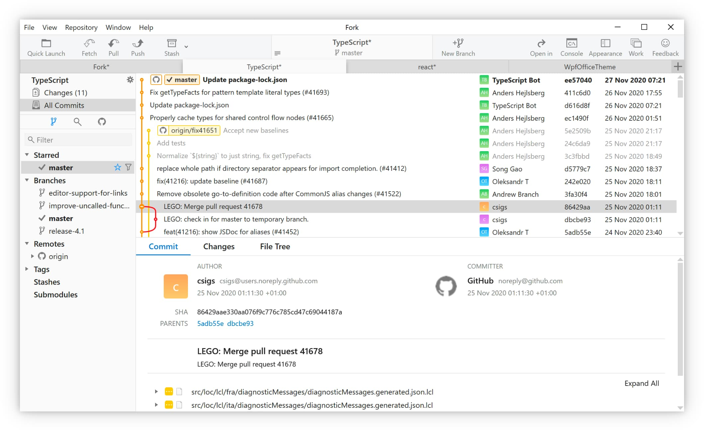
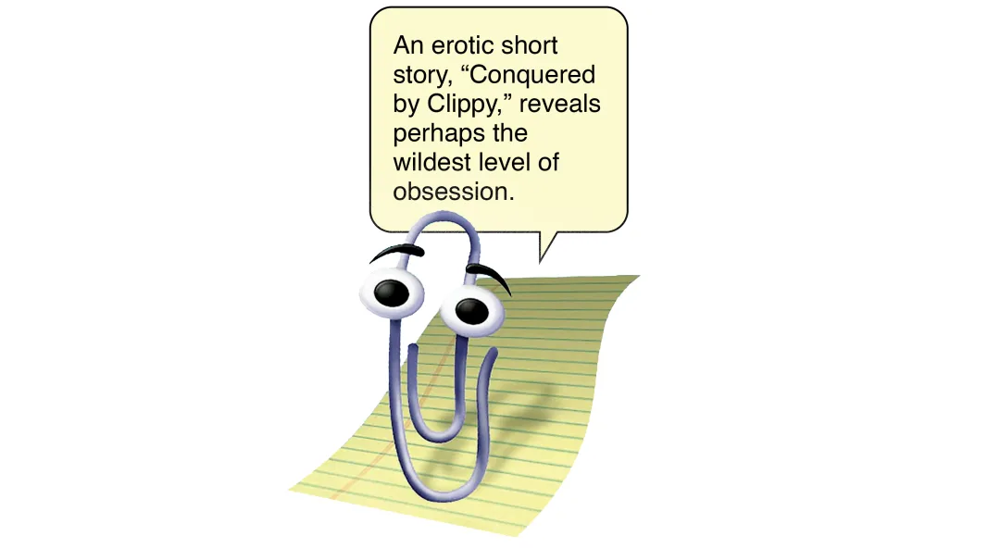
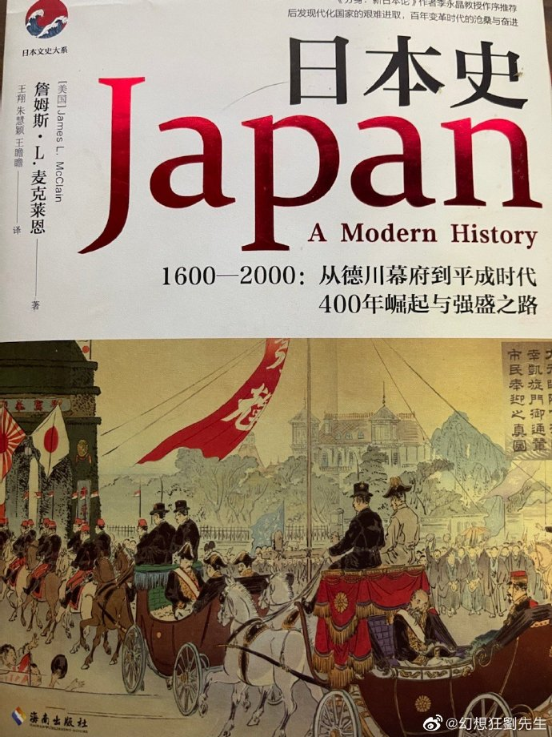

啰里啰唆周刊第36期：妈妈，我的玫瑰花要死了

# 科技日常

## 1.Win和Mac下的git GUI软件Fork

这几天看到Fork又更新了，界面更好看了。

Windows/macOS 可用，功能是真的非常全，性能也还挺好的。

商用付费软件，license上可以免费使用，没有任何功能限制。偶尔弹窗提示付费，但不影响使用。

[https://git-fork.com/](https://git-fork.com/)

如果介意的话，[这里](https://git-scm.com/downloads/guis/)有几十种选择。

## 2.Qubes OS-号称世界上最安全的操作系统

Quebes OS是由著名的波兰黑客Joanna Rutkowska发布的一个基于Xen和Linux的开源操作系统，默认采用的基础系统是Fedora 。Qubes充分利用了虚拟化技术（基于安全虚拟机Xen），所有用户应用程序都运行在AppVM（基于Linux的轻量级虚拟机）中，彼此隔离。而联网代码使用 IOMMU/VT-d放在一个非特权虚拟机中，在特权域 (dom0) 中没有任何联网代码。许多系统级组件放在沙盒中，以避免互相影响。

看起来似乎比 openBSD还要安全，但毕竟openBSD是通用系统。Qubes用起来就很不方便了，供对安全有特殊需求的人考虑。

https://www.qubes-os.org/intro/

## 3.OpenTTD 基于运输大亨豪华版的开源版游戏

OpenTTD is an open source simulation game based upon the popular Microprose game "Transport Tycoon Deluxe", written by Chris Sawyer. It attempts to mimic the original game as closely as possible while extending it with new features.

运输大亨又是啥呢？

《运输大亨》（英文：Transport Tycoon，缩写：TT）与运输大亨豪华版（英文：Transport Tycoon Deluxe，缩写：TTD）是于1994年至1995年由克里斯·索耶开发并由MicroProse发布的一款电子经营模拟游戏。游戏中，玩家拥有一家运输公司，并要与其他运输公司竞争，经海、陆空运载乘客及货物以获取利润，并建立自己的运输帝国。豪华版则对游戏内容进行扩充及改进。运输大亨是90年代模拟经营类游戏的经典巅峰之作。

OpenTTD就是由运输大亨**衍生**的开源版本，让你在27年后还能玩耍一把远古游戏。2005年，来自世界各地的游戏同好组织起来，对TTD进行了开源编写，Open TTD便就此诞生了。另外，TDD还有其他复刻版，这里就不介绍了。

OpenTTD与运输大亨的区别可以看[这里](https://wiki.openttd.org/zh/Archive/OpenTTD/OpenTTD%E4%B8%8E%E8%BF%90%E8%BE%93%E5%A4%A7%E4%BA%A8%E7%9A%84%E5%8C%BA%E5%88%AB).简单总结几条

> - 多版本 - OpenTTD有Linux，Windows，Mac OS X，OS/2等多个操作系统下的版本，目前甚至提供Android版.
> - [铁轨自动建造工具](https://wiki.openttd.org/en/Archive/Manual/Autorail) - 你可以在任何方向上拖动鼠标从而建造铁轨，电脑会帮你在所选定的方向上建造。
> - 地图更大, 最大可达 4096x4096.
> - 基于从谷歌地球上下载的地形高度数据制作出的高度图，提供了更为真实的场景。
> - [运河/船闸](https://wiki.openttd.org/en/Manual/Water%20Transport%20Tiles) - 允许玩家在陆地上建造运河，从而使船舶在其上航行。
> - 车站更大 - 车站可以制作的更长，并能容纳更多的月台.
> - [站台分离](https://wiki.openttd.org/en/Archive/Manual/Settings/Nonuniform%20stations) - 同一个站点的不同站台之间可以有短距离间隔。
> - 更好的操作性和更多的设置项，以及图形界面改进。

画质还是那么的古早，颜值党慎入。如果你对画质有要求或者只是想体验一下。。。也有国内的安卓复刻版，画质精美，广告和收费也少不了。

[https://www.openttd.org](https://www.openttd.org/)

至于怎么玩，新手可以参考百度贴吧的帖子，比如 [https://tieba.baidu.com/p/6555260614](https://tieba.baidu.com/p/6555260614)

## 4.AList网盘聚合

前几年有一款可以把网盘整变成硬盘的工具-CloudDrive，可以直接挂载网盘，网速过得去的话，使用文件就像是在使用本地内容一样方便，但CloudDrive从出场以来就有不少争议，比如软件不开源、占用过高、以及网盘授权失败等问题。

现在又出了一款类似的软件AList，同样支持多种存储的目录文件列表程序，支持 web 浏览与 webdav、FTP、SFTP，后端基于gin，前端使用react 。支持国内常用的阿里云盘，189和139云盘，夸克盘和onedrive等

虽然AList不是客户端程序，不过由于支持webdav，主流操作系统都可以轻松把webdav映射成本地硬盘。或者用第三方软件RaiDrive挂载到本地。当然，它的功能和RaiDrive有部分是重合的。不过Alist的优点在于跨平台，RaiDrive仅支持Windows.

https://alist.nn.ci/

## 5.RSS与ATOM的区别

在订阅RSS时，我们会发现，有的订阅是RSS规范，有的是ATOM规范，虽然都能用，但是之前也没想过它们间的区别，于是上网找了一下。

rss 和 atom是两种不同的信息聚合规范，它们具有相似的基于 XML 的格式。它们的基本结构是相同的，只在节点的表达式上有一点区别。

主要区别如下表所示：

| 不同点           | RSS 2.0                                             | Atom 1.0                                                                                         |
| ------------- | --------------------------------------------------- | ------------------------------------------------------------------------------------------------ |
| 规范            | 哈佛大学拥有版权并冻结了 RSS 2.0 规范。                            | Atompub 工作组（属于 IETF）就 Atom 1.0 规范达成一致意见，并在将来有可能重新修订。                                             |
| 所需内容          | RSS 2.0 包含所需的摘要级别的标题、链接和描述。它不需要在摘要中出现的任何单独项的字段。     | Atom 1.0 包含摘要和条目所需的标题（可以为空）、唯一标识和最后更新的时间戳。                                                       |
| 有效负载（payload） | RSS 2.0 可以包含普通文本或者转义 HTML，但是不能分辨所提供的是两个中的哪一个。       | Atom 1.0 包含有效负载容器。                                                                               |
| 全部或者部分内容      | RSS 2.0 有一个  元素，可以包含条目的全部文本或者大纲。它没有用于标识内容是否完全的内置方法。 | Atom 1.0 提供单独的  和  元素。如果它是非文本的或者非本地的内容，出于可访问性的原因摘要将很好用。                                          |
| 自动发现          | RSS 2.0 用不同的方法实现自动发现。                               | Atom 1.0 标准化自动发现。                                                                                |
| 提取和聚合         | RSS 2.0 只有一个可识别的形式：一个 文档。                           | Atom 1.0 允许独立的 Atom Entry 文档，可以使用任何网络协议传输；例如，XMPP。Atom 也支持聚合摘要，其中，条目指向它们来自的摘要，前提是如果它们将被包含到其他摘要中。 |

rss和atom都得到了广泛的应用，很多网站同时提供rss格式和atom的聚合订阅。鉴于rss2.0的版权问题和长久以来的未更新，通常建议采用atom。

RSS的更多介绍请参考维基百科：[http://en.wikipedia.org/wiki/RSS](http://en.wikipedia.org/wiki/RSS)

Atom Publishing Protocol则是基于HTTP协议格式（[RFC 5023](http://tools.ietf.org/html/rfc5023)）

目前RSS协议仅限于RSS2，RSS3协议官方没有发布，仅限于民间发明，比如 [https://rss3.io/](https://rss3.io/) 和 [https://github.com/dumpmemory/RSS3](https://github.com/dumpmemory/RSS3)。

## 6.You Can Access A User’s Camera with Just HTML

手机浏览器的网页输入框（input 元素）可以用`capture`属性，直接获取摄像头的数据，不需要 JS 代码。

https://austingil.com/html-capture-attribute/

## 7.最大电子书下载网z-library被美国封杀

z-library 表网 z-lib.org 下线，镜像域名也全都被美国FBI回收。

z-library是最大的书籍下载网站，内容偏文学期刊等通俗读物，当然也包含了很多不符合版权规定的盗版书籍。如果你需要公版书籍，前面几期已经介绍过[Gutenberg](https://www.gutenberg.org/)这个项目，但这个项目仅有6W本公版电子书。相对比，z-library有1000W本书和8400W篇文章。

Z-Library上的书籍主要来自各个出版商，很多都是各种畅销书，格式有epub和kindle格式等等，书籍都没有DRM加密，可以下载到任何电子阅读器或平板电脑上。

普通用户每天可以下载10本书，如果需要每天下载更多书籍，需要每月缴纳几美元的订阅费。不过，Z-Library的使命一直是非商业性的，旨在为所有人提供无限制的免费访问。

如果你需要的论文，那么可以去[sci-hub](https://sci-hub.st/)。sci-hub虽然也有合法性争议，但它是一个偏科学论文的网站，在一些国家被认为可以免除法律责任。

如果你确实有绝版书籍的需求，可以使用洋葱访问。目前，其官方tbot已恢复使用。

## 8.开源 Linux 平板电脑，预装 FydeOS 出货

Fydetab Duo ([https://fydetabduo.com](https://fydetabduo.com)) 是一款比较不一样的平板二合一电脑，由中国的操作系统厂商燧炻创新倾力打造。

众筹定价599英镑，约合4900RMB。

Fydetab Duo 由瑞芯微新一代旗舰级高端处理器 RK3588S 强力驱动：采用 8nm 工艺设计，搭载四核 A76 + 四核 A55 的八核 CPU 和 ARM 高性能 GPU：外接扩展显示器最高支持 4k@60Hz。内置 6T 算力的 NPU；是目前首款携带 RK3588 芯片的消费级平板电脑。设备的屏幕是一块 12.35 英寸的 QHD 16:10 IPS 面板，分辨率为 2560*1600，500nit亮度、DCI-P3 广色域覆盖。这块屏幕不仅支持触控，还配备手写电容笔，基于 Wacom 技术实现。

Fydetab Duo 默认携带由燧炻创新发行维护的 FydeOS 操作系统。FydeOS 基于 Chromium OS 二次开发，融合自主创新技术，在使用体验上无限接近于 Google Chrome OS 但可以不依赖于 Google 服务；为用户提供更多选项的同时也给企业客户提供更灵活的部署方案。FydeOS 使用容器技术兼容**安卓**运行环境，所以在 Fydetab Duo 上运行安卓程序和游戏的体验是很不错的。FydeOS 还通过虚拟机和容器混合的技术支持加载「Linux 子系统」，可以启动一个纯净的 Debian 11 环境，并且兼容在主系统内以窗口模式加载子系统内的应用程序，包括带有 GUI 的 Linux 程序。

Fydetab Duo 将以开源硬件的形式发售，所有设计稿件、工程图纸、厂商驱动程序源码及固件和启动加载器（bootloader）均会开放。这意味着用户可以在该设备上启动其它开源操作系统，比如 openFyde（FydeOS 的开源版本）、Debian、Ubuntu 或者 AOSP。

Fydetab Duo 是目前市面上为数不多的专门为 Linux 和开放生态打造的高端硬件产品，也是全球唯一一款专门为第三方 Chromium OS 发行版打造的的消费级电子产品。

## 9. .NET 7 正式发布

 微软宣布正式推出 .NET 7 ，使用 .NET 7 可以轻松地将 .NET 7 项目容器化，在 GitHub 操作中设置 CI/CD 工作流，并实现云原生可观察性。

.NET 7 是标准期限支持 (STS) 版本，将支持 18 个月。在整个 .NET 7 版本中，超过 8900 名贡献者做出了 28k 代码贡献。

一块发布的还有 C# 11 ，F# 7 ，Visual Studio 17.4 ，MAUI

[https://devblogs.microsoft.com/dotnet/announcing-dotnet-7/](https://devblogs.microsoft.com/dotnet/announcing-dotnet-7/)

# 读书与影视分享

## 1.《海贝与贝币》

> 关于殷商时期的海贝，古人和现当代学者持有相同或相近的观点，那就是：认为海贝的性质是货币，认为海贝来自南海或者中国的南方。这两个结论，都经不起推敲

栖息在马尔代夫群岛周边海域的软体生物——海贝，从史前时期开始，就被货贸至亚非欧大陆的各个区域，并逐渐转变为人类历史上最早的一种货币。作者从这一微小的海洋生物着手，把从考古时期到二十世纪初的历史碎片拼凑起来，以全球史的视野，对亚非欧大陆内外的贝币进行了考察，描绘了一个奇妙且引人入胜的贝币世界，展现了一部鲜为人知的全球史。

《海贝与贝币》描绘了在两千年时间里，以贝币为媒介的市场是如何将语言复杂、文化多元的印度洋世界整合为一体的，而全球资本主义又是如何终结这个世界的。全书按区域展开分析，同时又超越区域的界限，结合了中国史和世界史两种叙事体系。海贝文化体现出了一种“全球在地性”，即它既是地方性的，也是全球性的；而将陆地世界和海洋世界联系起来的贝币世界，则为全球史提供了一个全新的视角。

作者杨斌，澳门大学历史系教授，西泠印社社员，曾任新加坡国立大学历史系副教授，对中国史、全球史、科技医疗史及海洋史颇有兴趣。

不确定是否感兴趣的读者，可以先听一下这期播客对货贝的介绍[JustPod-206期-西非的衰落与周天子的礼物](https://justpodmedia.com/shows/left-right/leftright-ep206-20221025?key=2152)

## 2.电影《林中漫步》

《林中漫步》 ，又名《别跟山过不去》，是由肯·卡皮斯执导，罗伯特·雷德福、尼克·诺特、艾玛·汤普森主演的冒险电影，于2015年9月2日在美国上映。

该片改编自美国小说家比尔·布莱森（Bill Bryson）的同名旅行游记，讲述了老人在英国旅居了20年后，想要通过重返美国徒步旅行全长2100英里的阿巴拉契亚山小径、从佐治亚绵延到缅因的阿巴拉契亚山间小道（Appalachian Trail），以此重新认识一下他的祖国。他伙同失散多年的儿时好伙伴斯蒂芬·卡茨，一起踏上去往阿巴拉契亚山的旅途，在艰难刺激的旅途中观察世界，重新认识美国。

两个老年人参加长达3500公里的徒步，比起徒步的终点，观众更担心他们是否会先到达人生的终点。沿途的风景很美，夜幕降临、星空璀璨，伴随着舒缓的音乐，两个经历过人生起起伏伏的老人平静的交谈。但当你以为这是老年人克服身体局限性，征服大自然的励志影片时，结尾又峰回路转，颇具代表性。

旅行的目的不是到达终点，而是在旅途中找回自我，沿途所见，皆是美景。

> 终于等来了这部电影，林中漫步。今年年初在美国上线，改编于比尔布莱森的同名游记，作为他的脑残粉，没有理由不看。虽然评分很糟糕，但在意料之中，要拍出他的风格实在太难。

> 躁动的夏天代表着欢乐、玩闹与放纵，就连老年人也忍不住要任性放纵一回，这才是真正的男人至死是少年。

# 图论

## 1.仙女环

纳米布沙漠Namib Desert。在如此恶劣的环境中生长出如此多的草，依靠微薄的降雨勉强维持着一片草原。令人印象深刻，但也很神秘。草原上点缀着数百万个奇怪的圆圈，每个圆圈里都没有草或其他植被，共同构成了整个景观中的“仙女环”。

[https://www.sciencealert.com/the-surreal-mystery-of-namibias-fairy-circles-may-finally-be-solved](https://www.sciencealert.com/the-surreal-mystery-of-namibias-fairy-circles-may-finally-be-solved)

## 2.I Drew One Object From The Nineties Every Day

I grew up in the nineties and I love to draw. The combination of those two led me to draw all my favorite childhood objects. From a Gameboy to a Casio watch.

I drew one object every single day for 29 days straight. On average it took me 4 hours per drawing counting up to an average total of 116 hours to create all these artworks.

All these images are made in Adobe Illustrator, making them 100% vector.

More info: [Instagram](https://www.instagram.com/musketon/) | [shop.musketon.com](https://shop.musketon.com/) | [twitter.com](https://twitter.com/musketon)

# 谈天说地

## 1.我欲成仙快乐齐天？浅谈修仙题材

一篇关于修仙文化的好文。因原文禁止转载，此处仅给出链接。

原文：[我欲成仙快乐齐天？浅谈修仙题材 | 机核 GCORES](https://www.gcores.com/articles/158122)

## 2.The Twisted Life of Clippy

The blank screen was already intimidating enough. Then, out of nowhere, an incorporeal know-it-all popped up to make us feel even worse about the novel notion of word processing in the mid-’90s. “It looks like you’re writing a letter,” a googly-eyed, caterpillar-browed paperclip in Microsoft Word observed when we may or may not have been trying to write a letter. The metallic office supply bounced around the margins of documents and never stopped looking over our shoulders, even as it blinked back at us impatiently. “Would you like help?”

Nerd culture’s attachment to Clippy is even stronger, manifesting most frequently on social media and dark corners of the internet. An erotic short story, “Conquered by Clippy,” reveals perhaps the wildest level of obsession (“‘assist me deeper’”). Viral fan art renders the sentient silver fastener as everything from mildly impressed to pregnant. The assistant’s once-grating command bubble and syntax is basically Mad Libs for passive aggressive memes, including those aimed at the sort of existential conundrums posed by tech today. “It looks like you’re writing unsubstantiated nonsense,” a popular one begins. “Would you like to turn on all-caps?”

ref:[https://www.seattlemet.com/news-and-city-life/2022/08/origin-story-of-clippy-the-microsoft-office-assistant](https://www.seattlemet.com/news-and-city-life/2022/08/origin-story-of-clippy-the-microsoft-office-assistant)

## 3.一只小鸟打破不间断飞行纪录：11天零1小时，13500公里

据英国《泰晤士报》网站10月28日报道，一只刚刚脱离父母保护的阿拉斯加西部冻原上5个月大的小鸟，从世界的一端直飞另一端，打破了世界纪录。 科学家使用了超轻卫星跟踪技术，监测报告显示，卫星记录标号为234684斑尾塍鹬少年 Limosa lapponica，于10月13日从阿拉斯加出发，不间断地飞行了11天零1小时，至少 13560 公里(8435 英里)，然后降落在塔斯马尼亚州东北部的安森斯湾。即使在艰难的飞越太平洋的过程中，它也没有中途停下来休息。

之前的记录由同一物种的成年雄性4BBRW所有——去年飞了 13000 公里，打破了他自己前一年 12000 公里的记录。

根据新西兰 Pūkorokoro Miranda Shorebird Center发布在Facebook上的措辞，4BBRW 的记录被“blown out of the water by this young upstart”。

[https://www.theguardian.com/environment/2022/oct/27/bar-tailed-godwit-sets-world-record-with-13560km-continuous-flight-from-alaska-to-southern-australia](https://www.theguardian.com/environment/2022/oct/27/bar-tailed-godwit-sets-world-record-with-13560km-continuous-flight-from-alaska-to-southern-australia)

## 4.中央党校周为民：计划经济不可行性早已证明 大数据也弥补不了

计划经济的实质不在于有计划，不在于讲计划，而在于它是一种管制经济，命令经济，是一种类似战争体制、战时管制体制的那种一种组织方式。和市场经济以人们的自主活动为基础根本不同，计划经济的实质是对个人、对个人之间的组织也就是企业的独立性、自主性的否定。

这是计划经济的要害，也是它的根本缺陷。

这是中央党校原马克思主义理论部主任周为民在第二届野三坡中国经济论坛上的演讲。

一、大数据弥补不了计划经济的根本缺陷

1.大数据技术仍然不能帮助国家计划当局获得充分的、无限的信息，特别是知识。也就是说计划经济不能集中收集、集中控制、集中使用在分散的市场决策中为个人所独有的那些信息和知识。尤其是作为独立的利益主体的个人所独有的那种直觉、灵感、想象力、决断力和冒险精神，是不可能由计划当局靠大数据技术就能集中起来使用的。

2.大数据同样不能帮助计划经济解决内在动力机制问题，也就是说它不能帮助计划经济形成对个人和企业的符合经济效率目标的有效激励。

3.计划经济由于它的性质，由于它否定个人和企业的自主性，所以即便有了大数据，它仍然一定会压抑企业家的作用，而且甚至可能因为有了大数据而更加压抑企业家的作用。

4.大数据技术不能使计划经济保证它的集中决策总能按照符合社会利益的方向来配置资源。这是因为，计划经济的集中决策可能有特殊的偏好，有特殊的目标，而这样的偏好、目标可能不是符合社会利益和经济效率标准的。

5.高度集中的计划经济需要高度集权的政治、社会、文化方面的直接控制的体制来和它配合。

二、我们中国人为什么难以理解市场经济

中国人对市场的作用天然地充满疑虑，充满不信任，总觉得把事情交给市场就会乱。相反，人们习惯了过多地迷信权力的力量，崇拜权力的力量，以至把凡是关系到国计民生的重要产品必须由国家垄断，各种利源必须由政府控制当成了不需要任何证明的公理，以至无论官民，全社会普遍地缺乏权利观念，而充斥着浓重的权势意识。

全文可参考：[https://www.sohu.com/a/200859103_619327](https://www.sohu.com/a/200859103_619327)

## 5.上海彩虹合唱团《妈妈，我的玫瑰花要死了》

《妈妈，我的玫瑰花要死了》是一首描写人与人之间关系的作品。

歌曲标题取自作者朋友朽葱的小说《黄金骑士的布拉什金币》中的一句话，原文为：“妈妈，我的玫瑰花要死了，我不同意。” 
作者曾于音乐会现场对歌词“我内心有宝藏，爱人将它收藏，用破铜烂铁换一顿街巷炊烟”有一段简单的论述：每个人的心里都有属于ta自己的绮丽与真相，过路的行人或许漠不关心，但真正的玩伴与爱人会视若珍宝。

> 妈妈 我的玫瑰花要死了  
> 我不同意  
> 那朵玫瑰花 种在名为倔强的田地  
> 不管我 同不同意  
> 用箴言  用咒言  用戏言  用谎言  
> 尝吃醉  醉月光  
> 
> 常游戏  戏边界  
> 我内心有宝藏  
> 爱人将它收藏  
> 用破铜烂铁  
> 换一顿街巷炊烟  
> 我在看着你  
> 你在看着我 是吗  
> 摩洛哥王国  
> 眺望世界尽头的日落  
> 茉莉花  百合花  玫瑰花？  玫瑰花。  
> 
> 要出发  便出发  要相聚  别走啦  
> 让想象发生  
> 想象多天真  
> 回望索多玛  
> 住在第二组往事的清晨  
> 你在测试我  
> 我在测试你 是吗  
> 大人谈感情  
> 聪明的人喜欢摆棋局  
> 玫瑰花  玫瑰花  
> 走到哪里  就醉倒哪里  
> 妈妈  
> 我的玫瑰花要死了  
> 我们  
> 不同意

视频地址：[https://weibo.com/tv/show/1034:4831794001018929](https://weibo.com/tv/show/1034:4831794001018929?from=old_pc_videoshow)

> 歌词用了一个典故：索多玛是圣经里的一个城市，因为罪孽深重神要毁灭这座城，派遣天使营救在索多玛的罗德一家，并告诉他们一家要赶紧逃跑并且逃跑时不可回头看，然而罗德之妻眷恋索多玛往后望了一眼，就变成了盐柱。

## 6.一直到这架狂飙的战车耗尽了所有耐性和力气

詹姆斯·麦克莱恩的《日本史》认为日本人民已经厌倦了战争的情况下，日本高层执意继续战争，导致日本进行了长达数个月损失巨大的无意义战争。

我个人认为这是作者作为西方人看到的一种表象。
利用有害心智的教育和宣传将国民培养成“群氓”这种玩法，在体量越小、越封闭的环境下越可控，当国家的体量越大，使用这种方法的统治者越容易遭到群氓的反噬和裹挟，从而使自己陷入危险的境地。
当一架以群氓组成的战争机器在必胜宣传下奋战了数年，这时候战争的始作俑者却贸然宣布战争无法胜利，需要及时止损，必然立即遭到反噬。唯一的方法就是硬着头皮把战争打下去，把愿意继续战争的耗材不断的送上战场消耗，一直到这架狂飙的战车耗尽了所有耐性和力气，在整个国家和全社会耗出了“不能再打了”这种共识，才有可能停下来。
试想如果上百万受到军国主义教育，狂热到觉得自己根本没有输的日本兵活着回到日本国内，会怎么对付那些“过早叫停”的“卖国贼”呢？
日本在1945年1月以后进行的一系列毫无意义的军事行动，在西方人看来不可理喻的，形同自杀的军事行动，本质上都是在以这种方式“凝聚停战共识”。
西方人写日本，在深度上还是差点意思。
[https://weibo.com/derletztekampfer](https://weibo.com/derletztekampfer)

## 7.慎用XX标签打印机

> 2021 年 3 月购入一台入门款XX标签打印机，配合官方 app 使用一切正常，而且该官方 app 是使用该打印机的唯一途径
> 
> 2022 年 11 月，某一次 app 更新后，打印便签需要登录 app 才可以。否则就无法打印
> 
> 与客服协商，客服表示，这是必须的，不能更改，为了方便用户保存历史记录
> 
> 一个打印机要我注册账号、登录才能用
> 
> 现在是，我不注册，不登陆，这个打印机就不能用了
> 
> 像卖家所在地的工商部门投诉了，目前等反馈

[https://v2ex.com/t/893260](https://v2ex.com/t/893260)

  快进到打印机需要注册登录了。

# 一句话快讯

1.已被全球首富马斯克收购的推特公司将开始裁员，约50%员工被裁。法新社报道，推特公司在向全体员工发出的一封电邮中说，裁员行动将在加利福尼亚州星期五（11月4日）的上班时间启动。

2.《隐入尘烟》10月3日正式在英国公映。

3.11月4日晚6时左右，内蒙古自治区呼和浩特市新城区北垣东街兴光A9小区一位女士跳楼，根据网传视频，该女士的女儿在业主群里哭求，让物业将已焊上的铁皮门打开。一位案件经办民警对于记者关于“为何物业几十分钟内才将铁皮门打开”的回复是：无可奉告。

4.数学家张益唐在预印本平台 arXiv 上发表了备受瞩目的朗道-西格尔零点猜想论文。他并没有说自己证明了这一猜想，而是类似他在 2013 年发表的孪生素数猜想论文，改进了下界，并使用了一个数字 2022。有人开玩笑说这是他为什么在 2022 年发表的原因。他长达 111 页的论文也为后续改进提供了有用的具。

# 联系方式

啰里啰唆是一份针对互联网和生活爱好者的数字杂志，旨在发现和分享一切有趣的东西。话题不固定，每期大约十五分钟阅读量，暂定每周四发布。部分内容来自互联网采编，如果为有来源的转载，均会注明转载地址或保留水印。

这是一个关注人文和科技的newsletter。

使用方法建议或素材提供

频道：notonlyshare

github地址：[https://github.com/iminto/luoliluosuo-weekly](https://github.com/iminto/luoliluosuo-weekly)