啰里啰唆周刊第37期：沽酒人家柳岸傍，棠梨花白菜花黄

# 科技日常

## 1.AIMP Windows/Android下一款很好用的音频播放器

AIMP 是来自俄罗斯的一款高级多媒体播放器（非开源软件），除了播放器基本的音频播放之外它还包含了音频转换、录制、ID3 标签编辑等功能。界面相当友好易用，占用系统资源较少且安装包也不是很大，不到20M，且支持自定义换肤，官网有几百款皮肤。用了十多年的必备软件了。

除了播放音频外，还支持播放播客和私有云，支持**webdav**，以及OneDrive和Google Drive等主流网盘。

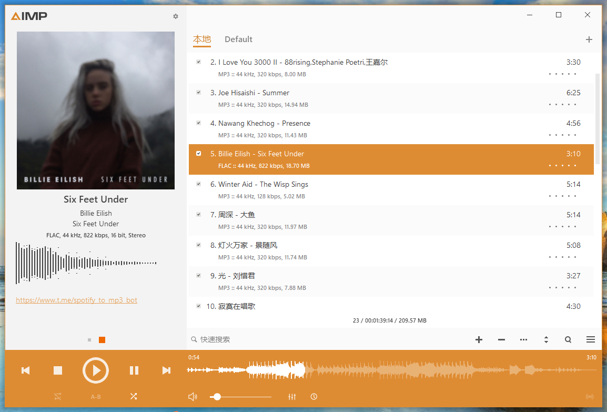

Pc版用户体验很好，不过安卓版我没体验过。

官网地址：[http://www.aimp.ru/](http://www.aimp.ru/)

## 2.Dino-Linux下的xmpp客户端

相较于封闭的微信、QQ而言，XMPP协议的设计与邮箱相似，是一种联邦式的、开放的IM协议，任何人都能搭建自己的服务器，也能和来自其他服务器的用户聊天。

Linux下的客户端不多，Dino的优点就是界面清爽，使用简单，支持常用的文字聊天，发图，语音和视频通话，[OMEMO](https://conversations.im/omemo/) or OpenPGP的加密支持也是必须的。


当然缺点也明显，那就是太简洁了，配置项很少，比如不支持主动创建聊天室等功能。

有时候Linux和Android之间要传输点文字和文件也挺麻烦的，不至于折腾个微信，所以要么开蓝牙，要么开局域网通讯的软件，这些都不如xmpp来的爽，跨客户端，有网就行。很多基于局域网的文件和文字共享软件不支持这种场景：手机开热点，Linux连接热点实现上网功能。

https://dino.im/

Linux客户端有了，安卓端的话，选Conversations就错不了，界面最友好，功能最强。

https://conversations.im/

## 3.Umi-OCR 离线文字识别

基于 PaddleOCR 的 OCR 图片转文字识别软件。完全免费、可离线使用的开源软件，支持截屏识别文字、批量导入图片、横/竖排文字，还可以自动忽略水印区域，适用于 Win10 操作系统。

体积仅80M，扩展语言包40M。

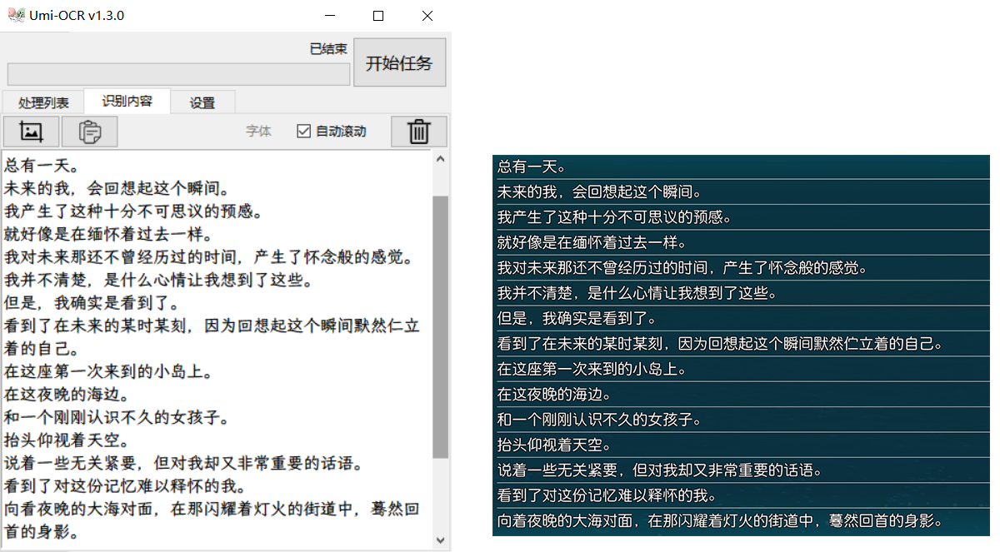

https://github.com/hiroi-sora/Umi-OCR

## 4.无线网络和有线网络，谁优先级最高

用一根RJ45网线与笔记本电脑有线网卡连接，并同时开启无线网络，那么默认情况下，谁的优先级最高呢？
其实这个问题很多朋友都会想到，只是不愿意细想。

答案是：Windows下，默认情况下是无线网络优先于有线网络。

那我们如何修改两者的优先级呢？是否需要对路由器设置呢？答案是不需要，其实我们只需要修改TCP/IP跃点数即可完成优先级问题。跃点数越小，则优先级越高。这个跃点数，即包括网关的，也包括接口的。
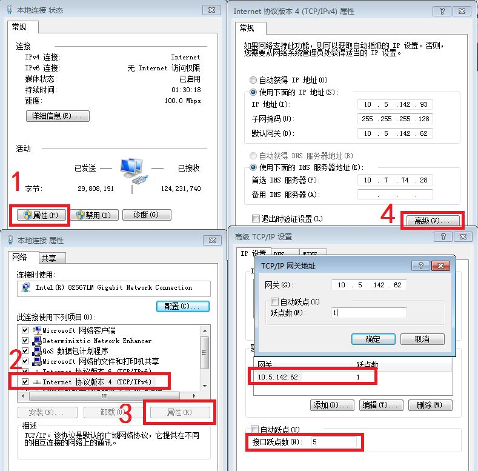
实际上，还是看的路由表，只不过是主机路由表，而不是路由器的路由表，但是道理是一样的。使用如下命令即可查看主机路由。

```bash
C:\>route print
```

或者打开“更改适配器设置”选项。 点击“高级”选项，并选择“高级设置”。 在“适配器和绑定”菜单下,选择网络并点击右边的绿色箭头设置优先级，再点击“确定”保存设置。

那什么是不默认情况呢，就是手动添加了明确路由的情况。

如果是Linux呢？可以用如下命令

```shell
ip route show
```

default开头的就是默认网关，如果既有有线，也有无线，就会有两个default路由。下图因为只有无线，所以只有一条路由。
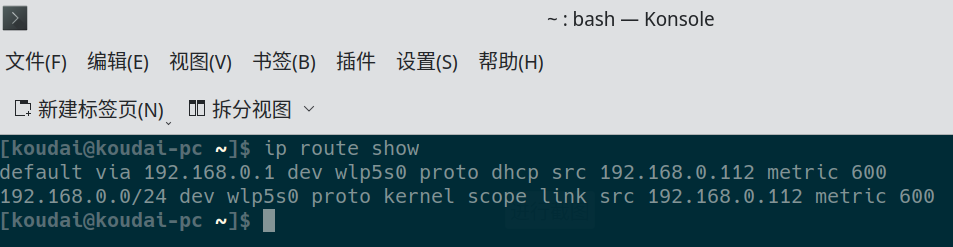

上图中的metric就是跃点，修改此值即可，但是metric值不能简单地直接修改，于是就有了下面这种操作，就是先删除gateway，然后重新添加的时候设置metric，需要优先使用哪个，就把它的值设为最小。

```shell
sudo route del default gw 192.168.0.1
sudo route add default gw 192.168.0.1 dev wlp5s0 metric 99
sudo route del default gw 172.18.0.1
sudo route add default gw 172.18.0.1 dev enp0 metric 100
```

当然，也可以通过修改ifcfg-ethX配置文件的方式来修改metric值。

## 5.iOS国行版紧急更新，限制AirDrop使用

苹果最新测试版iOS 16.2 (20C5043e)中，移除了"对所有人AirDrop"选项，目前仅有:

关闭/仅联系人/对所有人开放10分钟 三个选项。实测需要手动开启“对所有人开放10分钟”，默认选项为“仅联系人能够AirDrop”。

该功能为国行限定功能。iPad蜂窝板亦更新该功能，无线版暂无变化。

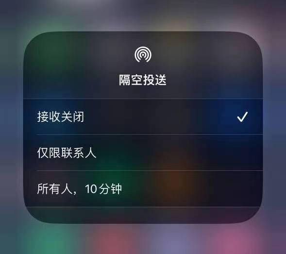

## 6.Android 设备可能存在通用的免密解锁 Bug

Android爆最新漏洞，允许使用自己的SIM解锁别人的（捡到的/抢到的）Android设备。这个漏洞最早是在Google Pixel手机上被发现的。

所需工具：启用 PIN Lock 的 SIM 卡（需要知道 PUK ） 复现方法：

    插入自己的SIM 卡（不要重启）
    故意输错 3 次 PIN 导致 SIM 卡被锁定
    输入 PUK 解锁被锁定的 SIM 卡并重置 PIN ，会发现 SIM 卡锁和锁屏同时被解除了。

漏洞原因： Android SIM 锁和普通锁屏使用同一个 class ，解锁成功时.dismiss()会被调用，用于消除锁屏 UI 。 解锁 PUK 时.dismiss()被错误用在所有当前锁屏 UI 上了。

2022-10 补丁和更早的的 Pixel 全系可复现，2022-11 补丁修复。 漏洞在 AOSP 上，理论上影响所有厂商的 Android 手机。

根据 Hacker News 的评论，该漏洞需要 Android 12+，可以在非 Pixel 机型复现。  也就是 Android 版本>=12 且安全补丁<=2022-10 的所有 Android 手机。

参考：[https://bugs.xdavidhu.me/google/2022/11/10/accidental-70k-google-pixel-lock-screen-bypass/](https://bugs.xdavidhu.me/google/2022/11/10/accidental-70k-google-pixel-lock-screen-bypass/)
[https://news.ycombinator.com/item?id=33544883](https://news.ycombinator.com/item?id=33544883)

# 读书与影视分享

## 1.《莫须有》

上海人民出版社 2022-5月出版，作者倪湛舸。

围绕南宋“莫须有”冤案，以岳云、赵构、秦桧、岳雷的第一人称视角来进入同一段历史的六篇小说，作者将史料化为清晰可感的叙事，在既定的历史框架下再现了不同人物的幽微心理。这一系列小说的核心人物是死于二十三岁的岳飞之子岳云。在少年的目光中，脸谱化的悲剧英雄还魂为尘世中人，注定被碾碎的蝼蚁拥有了最珍贵的羁绊。

岳云是《莫须有》的第一主角，倪湛舸在小说前三章构筑了三个处于不同年龄和心智水平的岳云，一遍遍地在战场上出生入死，亦一遍遍地思忖官家与父亲之间究竟从何时起心生芥蒂，乃至反目。倪湛舸笔下的岳云不是传统意义上的忠臣孝子，他在追随父亲的同时又无时无刻地不在质疑父亲的信念，反思“尽忠报国”的意义，在他看来，“生比死更残忍，而比毁灭更为无情的，是建造。为了建造他的国，官家，不，不只是官家，而是任何讲究成效的建造者，都可以贪得无厌地索取，理直气壮地毁灭，索取我们，毁灭我们。”倪湛舸表示，《莫须有》重新讲述岳飞故事的核心主旨，在于揭示帝制国家制度性的、不可避免的暴力，以及与这种暴力相对抗的普通人的情义。

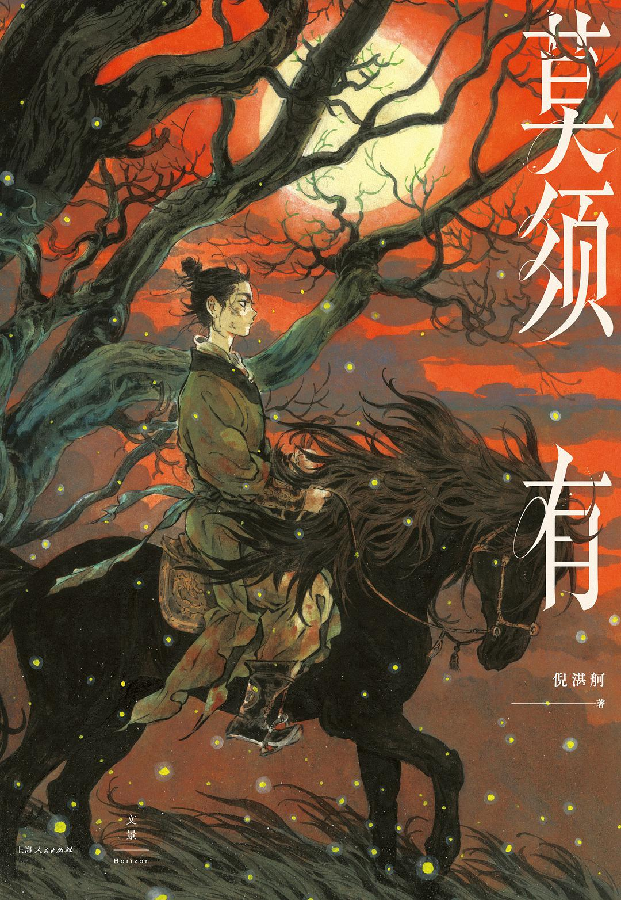

> 岳飞的故事早被评书打成了铁，可倪湛舸偏偏能另起炉灶把它化掉，让尘归尘、土归土，把脸谱化的悲剧英雄还魂为尘世中人。她能始终含住那口最初活泼渐次低迴沉郁的气，让它升起、贯通，再滑落心底，最后化作一泓深冬清水——生命旺盛，难免徒劳，英雄也是玩偶，不朽盛名，抵不了悲哀半分。——赵松

有一篇界面新闻对作者的专访：[【专访】《莫须有》作者倪湛舸：宋朝引人遐想，因为它既是盛世又是历史创伤](https://www.jiemian.com/article/7564732.html)

## 2.电影《莫娣》

《莫娣》是由艾斯林·沃尔什执导，莎莉·霍金斯、伊桑·霍克主演的爱情传记电影，于2016年9月2日在美国上映。

根据真人真事改编的电影，讲述了加拿大民间艺术家莫娣对艺术绘画的追求，并且邂逅了丈夫，两人相依为命以画作为生，喜欢艺术和绘画的朋友千万不要错过。  

整体色彩搭配流畅鲜活，加上莫娣的画作，让人觉得时间也停下了脚步，被眼前安静美丽的景色所震撼


灰绿色的基调预示着夏天的尾巴即将溜走，影片在纽芬兰取景，独特的地貌呈现出鲜明的残夏景色，随处可见的蓝天白云、海浪、树林、渔船和乡间的小路。莫娣与丈夫两个社会边缘化的人互相磨合，互相依靠，在他们相处的每一个平凡的日子里，让我们感受到了温暖和色彩。 

> “我们像两只 落单的袜子…”
> “我是被拉长、变形了的那只，上头好多洞，灰土土硬邦邦。”
> “我像单调的白色棉袜子…”
> “不，你是宝蓝色的，明黄色，像金丝雀那样…”

# 图论

## 1.辐射剂量描述表

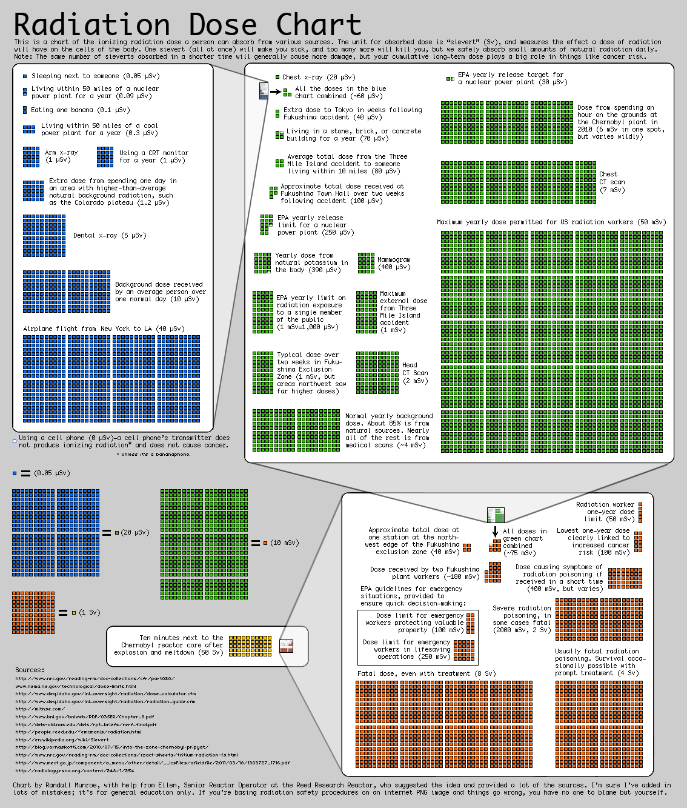

https://xkcd.com/radiation/

## 2.How Dragons Get Their Gold

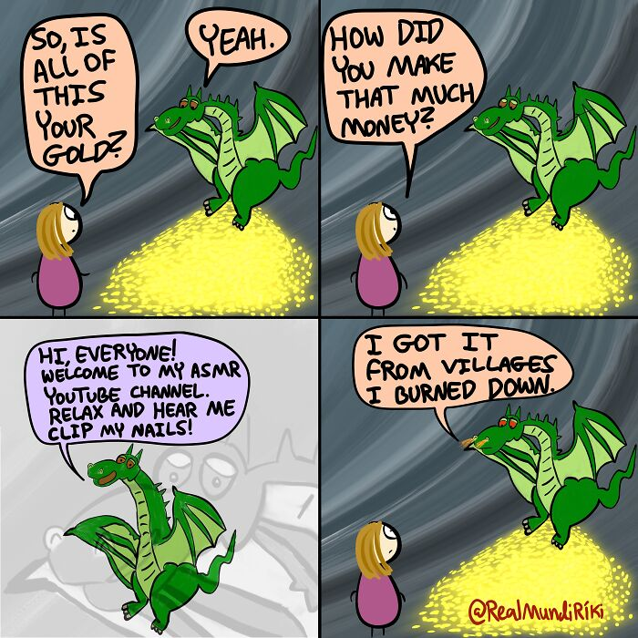

More info: [Instagram](https://www.instagram.com/realmundiriki/)  | [twitter.com](https://twitter.com/RealMundiRiki) 

# 谈天说地

## 1.How People Voted in Ancient Elections

Citizens of modern democracies have used a variety of methods and technologies to cast their votes on election day, but how did people participate in elections in ancient times? Historians have pieced together some intriguing details from Athens, the first and only direct democracy, and the Roman Republic, a quasi-democracy where the wealthiest classes wielded more influence than the workers.

In both Athens and Rome, participation in the democratic process (The Greek word dēmokratia means “people power”) was limited to the dēmos, which were free, male citizens. Women and enslaved people did not have a vote. 

[https://www.history.com/news/ancient-elections-voting](https://www.history.com/news/ancient-elections-voting)

## 2.LCD和OLED技术等显示技术的区别

**LCD原理**

光是一种波，让一束光穿过一个垂直偏振片，透过光只在垂直方向有分量。如果再加一层，在正常情况下光能正常通过，如果旋转90度，则光无法通过。若想让光通过，可以在两层偏振片中加液晶层，让光偏转一定角度通过再加个彩色滤光片并分别控制每个子像素的亮度，就能混合出各种个样的颜色了。

无论是哪种类型的 LCD，它的发光基础就是背光光源，我们可以简单地把背光理解成手电筒。背光决定了一个显示器能有多亮，以及能显示多少色彩，所以背光的种类也一直随着科技技术的发展在不断地变化。LED背光从很早以前的冷阴极荧光灯管（CCFL）逐渐变为了更常用的发光二极管（LED）。

**LCD缺点**

所有像素共享一块背光，即使显示黑色，背光也不关闭，并不是透彻的纯黑。这样会导致在显示画面时动态范围不够高，画面亮度层次感低。

**VA IPS TN**

都属于LCD屏幕的液晶技术，区别是液晶分子排列和偏转的方式，同时显示效果不同。大部分人选择IPS即可

**QLED**

用蓝光照射不同粒径的量子点材料，会发出颜色不同的光，那么就在基板上涂上不同颜色的量子点材料，加上蓝色背光，使得亮度更高，色域覆盖更广。

**注意：QLED和还是属于LCD范畴，和OLED有本质区别，同时与IPS、TN等概念不属于一个层级**

**mini-LED**

mini LED属于LCD，但它通过把背光分成500-1000个分区来实现局部亮度控制。在显示局部暗色和黑色时，可以单独控制那块区域的背光变暗或关闭，这样实现了更高对比度，黑色更黑更纯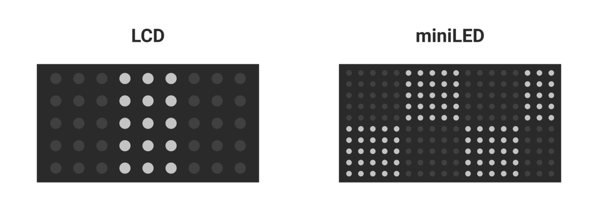

缺点：mini LED在显示小范围的高亮度时，会将那一整块区域的背光都调亮，这样这个区域如果还有黑色部分，就会出现光晕现象。

**micro-LED**

使用无机材料，灯泡的尺寸缩小到像素级别，而且每个颜色的子像素都能独立控制，长时间使用以后不会像 OLED 一样出现有机物衰减的情况，缺点是成本高。

**OLED**

给某些荧光材料通电后，它们自己会发出红绿蓝各种颜色的光线。我们让红绿蓝的荧光材料附着在薄膜电路上，就能控制每个子像素发光。这样每个像素能单独控制亮度，对比度非常高，也没有光晕问题。这样，不仅色域高，动态范围广，相应速度快，薄膜电路和荧光材料也可以弯曲，实现曲面屏、折叠屏，功耗更低

OLED的缺点是它的有机物发光材料寿命短易老化，而且老化速度还不一样，长时间显示同一画面会烧屏。

**W-OLED**

不直接用荧光材料发出三色光，而是搞成白的，然后像LCD一样整仨滤光片，这样老化均匀，并增加了白色子像素解决滤光片导致的亮度不足

缺点是显示高亮画面下白色子像素会对红绿蓝子像素产生光线串扰，显示效果降低。

QD-OLED解决了W-OLED的问题，蓝色有机发光材料激发量子材料，缺点是外界光线射向屏幕会干扰

ref:[https://sspai.com/post/76509](https://sspai.com/post/76509)

https://www.bilibili.com/video/BV1Me4y1k72b/

另外，对于手机屏幕、电脑显示器、电视屏幕，则有不同的选择方案。

## 3.金庸新

90年代，金庸是小说畅销的金字招牌，很多书商就盯上了金庸，冒名顶替，鱼目混珠，通过冒牌金庸小说来赚取武侠迷的银子。很多书商把港台冷门武侠小说拿过来，改个书名，改个封面，然后堂而皇之盖上金庸的大名，就算是金庸小说了，让不少武侠迷上了当。再比如，有的书商推出了“金庸巨著”、“金庸大作”，看上去这些小说是“金庸”写的，结果是“金庸巨”、“金庸大”写的。

而以影响力而论，名气最大、读者最多的冒牌金庸作者是“金庸新”，特别是金庸新的《九阴九阳》，销量十分高，读者众多，堪称这类冒牌小说中的王牌小说。

金庸新，本名杨明刚，笔名阳朔，又名“金庸新”。1964年出生于吉林，毕业于吉林大学中文系。活跃于90年代初期的大陆，与令狐庸、龙骧子合称“三剑客”。代表作《九阴九阳》、《大侠风清扬》，近作《十万雄狮斩阎罗》刊于《今古传奇·武侠版》2004年第3期。

1995年出版的《大侠风清扬》和1997年的《剑圣风清扬》，该作是金庸的众多模仿者中，较为出色的作品，均创当时武侠小说销售之最，发行量超30万。

当然，既然金庸新可以蹭金庸的热度，那么其他书商也可以蹭金庸新的热度。所以世面上许多金庸新著，也不一定就是金庸新写的。

《九阴九阳》是《倚天屠龙记》的续集，写的是大理段氏后人段子羽对付明教张无忌及手下的故事。

这本书非常夸张，首先是感情戏上的夸张，段子羽的老婆非常多，有天师教教主的女儿张宇真、丐帮帮主的女儿史青，还有明教教主杨逍的弟子司徒明月，简直是享尽艳福。其次，这本小说在武功方面也特别夸张。段子羽不但把九阴真经和九阳神功学到了，他会的武功还有许多许多，比如大理段家的一阳指、六脉神剑，比如独孤九剑、天雷剑法、弹指神功、兰花拂穴手、七伤拳、两仪刀法、反两仪刀法、降龙十八掌，简直是武学大师，各项全能。

其实就是现在的的网络同人爽文写法，主角光环+神功收集+美女收集。

这种假冒金庸的现象，只有当年版权不规范的时候才会发生，如今的金庸新已经歇笔十几年，江湖再未有他的传说，也许起点网某个不知名作家背后就是金庸新本人也难说。

另外一个作家令狐庸，代表作《风流老顽童》、《剑血情花》，令狐庸其实就是著名导演冷杉，他导演的《昭君出塞》、《北魏传奇之胡笳汉月》等都在央视播出了。当然上面这两位其实写的还是可以的，算是二流作家，还有一个是“金庸巨”，这个人模仿金庸名字，写的书就非常垃圾了。

三剑客最后一位龙骧子，代表作是逍遥浪子三部曲，相比之下，龙骧子的小说没有金庸新和令狐庸那么大的名气，整个故事和金庸武侠江湖并没有太明显的关联。

## 4.沽酒人家柳岸傍，棠梨花白菜花黄
棠梨花，即棠梨的花。

棠梨并不是特指的某种植物，而是一种俗称。那么，棠梨究竟是哪一种植物呢，其实由于我国传统文化中，对植物花卉经常出现“同名异株”和“同株异名”现象，因而不能说就是某一种，就拿棠梨来说，也是一种统称，包含很多种植物。

古人对棠梨认识很早，早在先秦时期就已经有记载，如《诗经•小雅•鹿鸣之什》的《棠棣》篇：“棠棣之华，鄂不韡(wěi)韡，凡今之人，莫如兄弟。”，其中棠棣就是指的郁李或棠梨，郁李和棠梨都属于蔷薇科植物，然而种属不同，郁李属于樱属落叶灌木，棠梨则属于蔷薇科梨属，梨属分为两组，一种是果实大形的真正梨组，包括梨、白梨、沙梨、秋子梨、西洋梨等；一种是果实小形的杜梨组，包括杜梨、褐梨、豆梨、川梨等，棠梨则是杜梨组的多种植物的俗称。

> 杜梨有刺，上古的人们生产力低下，为了防止人们破门劫掠食物和财产，往往会用棠梨的树枝堆在门口，所以棠梨有最古老的名字，叫作杜树，杜梨。有人考据认为，现在词汇中的杜门谢客，杜绝，就是从棠梨树上演变过来的。

可以简单地认为，棠梨是一种野生的梨树，但是改造和嫁接都往往难以产生更大更好的果实，干脆人们就放弃改造培植它。
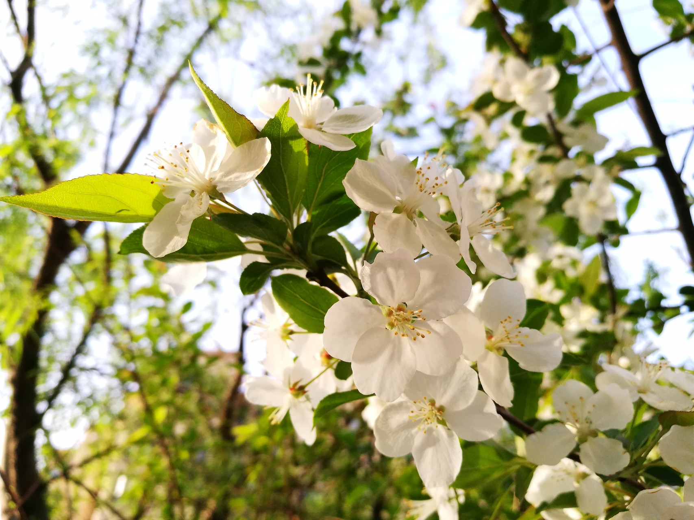
棠梨果实很小，直径1厘米左右，未成熟时比较酸涩，成熟后通常呈红色或黑色。
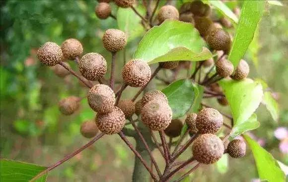
棠梨是具有较高观赏性的花木，郁李桃红色宝石般的花蕾，繁密如云的花朵，深红色的果实，都非常美丽可爱，是园林中重要的观花、观果树种，宜丛植于草坪、山石旁、林缘、建筑物前；或点缀于庭院路边，用作园林造景。而杜梨、川梨植株高大，株形优美，花朵繁茂，云蒸霞蔚，古代在田野坟茔处经常有栽植，寒食节扫墓，正是花期，满树披雪，犹如挂孝，如元稹的诗句有“三春已暮桃李伤，棠梨花白蔓菁黄。”，白居易有“棠梨花映白杨树，尽是死生离别处。”等。

在物尽其用的云南，棠梨花则是一道美食。云南滇中地区的农村家中，每每新春前后都会备一些棠梨花。把棠梨花蕾采摘下来，开水烫一下，清水浸泡一日，即可烹制云南人爱吃的棠梨花美食，加些调料素炒，或配以青蚕豆米、或蒜薹、或火腿，烹制成棠梨花美食，更是云南百花宴中的重要菜肴。

# 一句话快讯

1.Meta/Facebook CEO 扎克伯格(Mark Zuckerberg)通过公司博客宣布了大裁员的消息，裁员规模超过了之前的预测。扎克伯格说，他决定将公司规模缩减 13%，即将裁掉 1.1 万名员工，他对受到影响的人表示道歉，称他个人要对此事负责。

2.全球最大的加密货币交易所币安的 CEO 赵长鹏周二宣布签署了收购竞争对手 FTX 的意向书。但在周三币安宣布在尽职调查之后它决定不再寻求收购FTX。随后，FTX宣布破产并声称遭黑客入侵。

3.国家卫生健康委员会周五发布了《关于进一步优化新冠肺炎疫情防控措施 科学精准做好防控工作的通知》，宣布放宽部分防疫规定。卫健委称，取消入境航班熔断机制，对入境人员，将“7 天集中隔离+ 3 天居家健康监测”调整为“ 5 天集中隔离+ 3 天居家隔离”。将登机前 48 小时内 2 次核酸检测阴性证明调整为登机前 48 小时内 1 次核酸检测阴性证明。对于国内，将风险区由“高、中、低”三类调整为“高、低”两类，高风险区连续 5 天未发现新增感染者，降为低风险区。“7 天集中隔离或 7 天居家隔离”调整为“5 天居家健康监测”，期间赋码管理，第 1、3、5 天各开展 1 次核酸检测，非必要不外出，确需外出的不前往人员密集公共场所、不乘坐公共交通工具。 

# 联系方式

啰里啰唆是一份针对互联网和生活爱好者的数字杂志，旨在发现和分享一切有趣的东西。话题不固定，每期大约十五分钟阅读量，暂定每周四发布。部分内容来自互联网采编，如果为有来源的转载，均会注明转载地址或保留水印。

这是一个关注人文和科技的newsletter。

使用方法建议或素材提供

频道：[https://t.me/notonlyshare](https://t.me/notonlyshare)

github地址：[https://github.com/iminto/luoliluosuo-weekly](https://github.com/iminto/luoliluosuo-weekly)