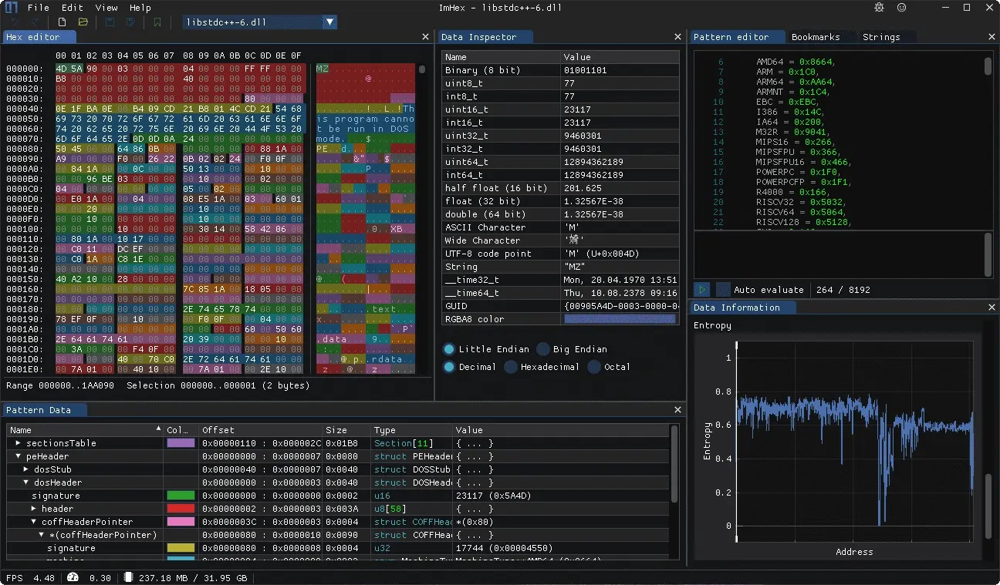
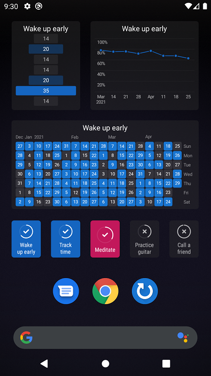
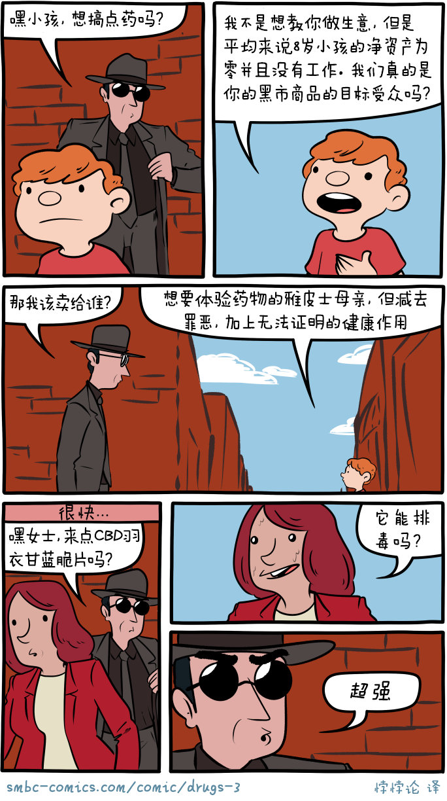

啰里啰唆周刊第38期：树上有个好地方

# 科技日常

## 1.ImHex开源免费的十六进制查看软件

面向逆向工程师和程序员的编辑器，可用来查看、解码、分析和编辑二进制数据。它功能丰富、界面炫酷、多彩高亮，而且项目更新积极，比如最初不支持中文路径的问题，现已解决可正常使用。

跨平台软件，C++开发，体积仅20M.

目前版本在我的windows上并没有彩色效果，不知是不是开发中的功能或者需要安装插件。

[https://github.com/WerWolv/ImHex](https://github.com/WerWolv/ImHex)

有了这软件，没理由再用破解版的010Editor了，话说至少14年没用过010Editor了。

## 2.Loop Habit Tracker-习惯养成App

一款帮助建立和维持好习惯的安卓应用。该软件完全免费、支持中文、无广告和内购，在 Google 应用商店上有 500 万的下载量。首先用户需要在 APP 上新建一个习惯，可以设置频率、量化任务、提醒时间等，每当完成一次习惯就在应用上做一个标记，后面会有详细的图表展示习惯养成情况。
体积小，仅5M。FOSS软件，可到[F-Droid](https://f-droid.org/app/org.isoron.uhabits)下载。

[https://github.com/iSoron/uhabits](https://github.com/iSoron/uhabits)

## 3.PRemoteM -现代化的远程桌面软件

1Remote is a modern personal remote session manager and launcher. It is a single place to manage all your remote sessions supporting number of different protocols.

基于.NET开发的软件，需要Win10 17663以上版本，依赖.NET 6 Desktop Runtime。

特点如下：

1.支持RDP, SSH, VNC, Telnet, (S)FTP协议
2.支持多窗口会话以及HiDPI RDP连接
3.兼容mRemoteNG的配置
4.不需要安装，支持便携化，体积仅10M。

https://github.com/1Remote/PRemoteM

Windwos当然自带远程桌面（MSTSC和Tsmmc），但有一个缺陷用起来很痛苦，就是里面系统的底部任务栏经常会消失，只能看到了外面的任务栏，切换任务很痛苦。[mRemoteNG](https://mremoteng.org/)也不错，各有所长。

注：Tsmmc是Windows server中自带组件，和Windows Desktop版带的远程桌面（MSTSC）相比，多了个特性，就是支持一个进程里开多个窗口连接。

## 4.2035 年起将停止增加闰秒
11 月 18 日全球度量衡大会（CGPM）的各国代表做出决定，2035 年或更早起将停止增加闰秒。闰秒是不可预测的，因为它依赖于地球自转，而地球自转从长期看是不可预测的，它时而加速时而减速。这一决定意味着天文时 UT1 将允许与基于原子钟的协调世界时 UTC 相差一秒以上。

从 1972 年起，每当 UTC 和 UT1 相差 0.9 秒以上时就会加入一个闰秒。加入闰秒会破坏精确计时的系统，会在数字时代产生巨大影响，Meta/Facebook 和 Google 都呼吁停止加入闰秒。CGPM 还提议在至少一百年内不增加闰秒，允许 UTC 和 UT1 之间相差一分钟。它计划与其它国际组织协商，在 2026 年前确定时间上限。俄罗斯代表投票反对在 2035 年后停止增加闰秒，它希望推迟到 2040 年之后，原因是该国的卫星导航系统 GLONASS 含有闰秒，而 GPS 等能忽略闰秒，这意味着俄罗斯可能需要更新其卫星和地面站。国际电信联盟（ITU）有可能阻止这一计划的推行，它认为现在不是做出决定的时候。 

[https://www.nature.com/articles/d41586-022-03783-5](https://www.nature.com/articles/d41586-022-03783-5)

## 5.Meta 开源其内部源码管理系统 Sapling
Git 是广泛使用的源码管理系统，但它在处理规模庞大的源代码库时速度比较慢。微软几年前发布了一个解决方案叫 GVFS（Git 虚拟文件系统）。现在另一家巨型公司 Meta/Facebook 宣布了它的内部解决方案 Sapling。Meta 称，Sapling 项目始于 10 年前，旨在解决现有源代码管理系统难以处理庞大代码库的难题，一开始是作为 Mercurial 的扩展，后来快速成长为有着自己的存储格式、线程协议、算法和行为的独立系统。Meta 目前只开源了兼容 Git 的 Sapling 系统客户端，未来将会开源其它部分。 

[https://sapling-scm.com/](https://sapling-scm.com/)

## 6.Tumblr 将加入对 ActivityPub 协议的支持
Automattic CEO Matt Mullenweg 宣布，轻博客服务 Tumblr 将加入对 ActivityPub 协议的支持。ActivityPub 是一个开放去中心化社交网络协议，被 Mastodon（长毛象）、Misskey 、Pixelfed 和串流服务 PeerTube 等应用使用。ActivityPub 提供了一个客户端到服务器的 API 用于创建、更新和删除内容，以及一个联邦制的服务器到服务器 API 用于传递通知和订阅内容。这一做法与今天围墙花园式的社交网络背道而驰。如果 Tumblr 加入对 ActivityPub 的支持，这意味着 Mastodon 用户可以订阅 Tumblr 用户的帖子， Tumblr 用户也能进入联邦宇宙而无需在 Mastodon 的不同服务器上注册。

使用ActivityPub的软件列表：[https://github.com/topics/activitypub](https://github.com/topics/activitypub)

关于 ActivityPub 协议，有下面这么几个非常有趣的事实：

1）ActivityPub 并不是长毛象专属的协议：原则上任何类型的应用都可以集成 ActivityPub，让跨形态应用之间的互动也成为可能。 

比如，PeerTube 是一个视频流媒体服务，Nextcloud 是一个的文件托管/云盘服务，Pixelfred 是一个照片分享服务。 

和中心化前辈 YouTube、Dropbox、Instagram 相比起来，这些去中心化替代品最大的区别在于集成了 ActivityPub 协议。 理论上， 一个长毛象用户可以直接在它的长毛象服务器里 分享和评论一条来自 PeerTube 的视频； 或者一个 Pixelfred 用户可以把自己的照片发送到 自己粉丝的长毛象时间线上 ，同理亦然。 

2）除了能够跨服务器、平台、应用种类之外，ActivityPub 还有一个好处，就是打碎了过去社交网络之间的围墙花园。 

简单来说，过去用户在 Twitter、Instagram、微博、小红书上要注册多个账号，特别是名人大号如果没有提前“占坑”的话容易在非主要平台遭到仿冒。 

而 ActivityPub 的理想状态，是一个用户在一个支持 ActivityPub 的平台/服务器上的身份在理论上可以直接被其他所有支持 ActivityPub 的平台/服务器所认可，也就实现了在多个平台上使用一个账户，不需要注册多个账号，也不需要担心被仿冒。 

3）而回到长毛象上面来，采用 ActivityPub 协议也使得它不受到网络效应的门槛影响。 

通常，一个新出现的社交网络产品，最经常死掉的原因往往就是一段时间之后没有足够多的人用。但长毛象不用担心这一点，因为如果越来越多的其它平台集成 ActivityPub 协议（即便他们不是社交网络，不叫自己长毛象），长毛象本身的用户也仍然可以从这些其它平台上获得价值。 

# 读书与影视分享

## 1. 电影《树上有个好地方》

《树上有个好地方》是张忠华执导兼编剧，于2020年9月6日在爱奇艺首播。

本故事讲述的是上世纪90年代末发生在陕西关中农村的童年故事。在以成绩高低作为评判学生好坏的环境中，小学生巴王超过在老师与家长的眼中是那种不学无术的“渣滓”。得不到家长和老师认同的巴王超过，将田野里一棵可以栖息的大树变成了自己的“好地方”，并将所有“好玩”的东西都藏在了那棵大树的上面。孩子的天性，让巴王超过与成人世界充满了斗争，直到有一天，他的处境因为前来支教的粉提老师而改变了！粉提老师让他负责班级里的图书管理员，同时他也与女老师成了好朋友，他的“好地方”也成了女老师的“好地方”。然而好景不长，他在粉提老师面前特殊的待遇，又因为粉提老师的男朋友的到来而改变了……

> 看哭了，卡尔维诺《树上的男爵》的点子+王小波《绿毛水怪》那样简单真挚的情感表达+姜文《阳光灿烂的日子》里朦胧的性启蒙。

> “粉提老师的男友始终没有正脸，因为一有正脸，他就有情敌的意思了。其实他就是故事的一个转折点。巴王超过渴望得到认同，粉提老师是巴王超过的精神寄托，而不是情感寄托，可能现在很多观众把巴王超过的情感寄托和性朦胧过度放大了。我们作为剧作者，有最基本的道德基准和电影审美，不可能往三俗和低趣味方向做。我们要做得很高级，观众知道点到了青春期的性朦胧，看完之后会觉得真美好啊，真怀恋。”

## 2.《猫派》
十二则刊载于《纽约客》杂志的“现象级”短篇小说
网络上超三百万人次转发，HBO即将改编影视
人的情感，真的存在某种正确的形式吗？
当疯狂融于日常，幻想成为现实，倒错的欲望倾泻而出
编织出属于千禧世代的人生万花筒
十二篇故事，游走于人性与道德的钢丝之上。

作者克里斯汀·鲁佩南生于波士顿，毕业于巴纳德大学，同时拥有哈佛大学英语文学与心理学的博士学位。她是《纽约客》杂志的常驻供稿人，发表过数篇文学评论，荣获过多个奖项。《猫派》中收录了克里斯汀·鲁佩南的十二部短篇小说，其中同名小说《猫派》在《纽约客》上发表后，迅速成了全美最热门的讨论话题。短篇集中收录的故事引人入胜，仿佛鬼魅般令人不寒而栗。克里斯汀在书中以新颖又黑暗的方式探讨了性别、人性、和权力的话题。

书评：
> 作者特别擅长也特别沉迷于写情感关系中的推拉，每一个犹豫、试探、心理动作都写得很详细。《瞧你的把戏，姑娘》和《猫派》是最好的两篇，清新干净。其他篇目因为节奏拖沓变得非常非常磨叽。

> 我很喜欢！细腻、怪诞又尖锐。《猫派》《好人》都太有切肤之感了，像我遇到过的人。《坏小子》《镜子、木桶、老髀骨》短小精悍，但你会越想越怪。作者很会讲故事，经常选取一个新颖的切入点来做叙述，引人入胜，比如《泳池男孩》少女们暑假迷恋的电影演员带起的朦胧同性情欲，《沙丁鱼》甜蜜邪恶的儿童视角，《火柴盒标志》的寄生虫妄想症看得想挠痒痒。《咬人》很爽很好笑。

cat person原文：[https://www.newyorker.com/magazine/2017/12/11/cat-person](https://www.newyorker.com/magazine/2017/12/11/cat-person) （注：猫派这本小说收录了12个短篇，发表在New Yorker上的只是其中的一篇“cat person”）

关于猫派这篇文章的解读，可以参考此处 [https://www.vox.com/culture/2017/12/12/16762062/cat-person-explained-new-yorker-kristen-roupenian-short-story](https://www.vox.com/culture/2017/12/12/16762062/cat-person-explained-new-yorker-kristen-roupenian-short-story)

# 图论

## 1.drug

> 雅皮士(Yuppie)是美国人根据嬉皮士(Hippies)仿造的一个新词，意思是"年轻的都市专业工作者" 。雅皮士从事那些需要受过高等教育才能胜任的职业，如律师、医生、建筑师、计算机程序员、工商管理人员等。他们的年薪很高。雅皮士们事业上十分成功，踌躇满志，恃才傲物，过着奢侈豪华的生活。与嬉皮士们不同，雅皮士们没有颓废情绪，不关心政治与社会问题， 只关心赚钱，追求舒适的生活。嬉皮士意为"都市中失败的年轻人"。他们虽然觉得自己的 生活无法与雅皮士的生活相比，但又不愿意有失落感，并发誓要找到自己的归宿。

[https://www.smbc-comics.com/comic/drugs-3](https://www.smbc-comics.com/comic/drugs-3) 

## 2.mask

More info: [Instagram](https://www.instagram.com/spaceboycantlol/)

## 3.努力生活

向每一个努力生活的人致敬，无论成败。 

# 谈天说地

## 1.fans quitting Spotify to save their love of music

越来越多的人离开音乐流媒体平台

Meg Lethem was working at her bakery job one morning in Boston when she had an epiphany. Tasked with choosing the day’s soundtrack, she opened Spotify then flicked and flicked, endlessly searching for something to play. Nothing was *perfect* for the moment. She looked some more, through playlist after playlist. An uncomfortably familiar loop, it made her realise: she hated how music was being used in her life. “That was the problem,” she says. “*Using* music, rather than having it be its own experience … What kind of musicam I going to use to set a mood for the day? What am I going to use to enjoy my walk? I started not really liking what that meant.”

“Streaming makes the listening experience much more passive,” he continues. “The word ‘streaming’ is one of those things that’s gradually assimilated into everyone’s vocabulary. Before there was streaming music, what else was streaming? This idea that you can just turn on a faucet, and out comes music. It’s something that leaves everyone to take it for granted.”

和文中不同，我不信任云，不信任互联网，更愿意自己选歌，离线下载播放。

[https://www.theguardian.com/music/2022/sep/27/theres-endless-choice-but-youre-not-listening-fans-quitting-spotify-to-save-their-love-of-music](https://www.theguardian.com/music/2022/sep/27/theres-endless-choice-but-youre-not-listening-fans-quitting-spotify-to-save-their-love-of-music)

## 2.“止痛神药”布洛芬怎么知道你哪里痛的
说起布洛芬，很多人都不会觉得陌生。对于女性更是必备，痛经的时候来一颗——肚子不痛了，腰不酸了，腿脚都利索了。

单身女性可能不知道，布洛芬并不是只针对痛经，除了缓解痛经，布洛芬其实还可以止头痛、牙痛、肌肉痛、关节痛，为人父母必不可少.....哪里疼痛止哪里，妥妥一颗“疼痛克星”。

不得不说，布洛芬在“止痛界”确实有着不可忽视的地位。不过也有很多人因此产生疑惑：“小小一颗布洛芬真的那么神奇吗?”、“布洛芬到底是怎么知道你哪里痛的？”

20世纪50年代和60年代时，当时阿司匹林是市面上非常流行的止痛药，但它的副作用很大。因此英国一名化学家——斯图尔特·亚当斯和他的团队，致力于研制副作用更小的抗炎镇痛药。在经历了数次失败后，一天斯图尔特宿醉后头痛欲裂，偶然间服下了团队新合成的一种化合物——对异丁苯丙酸，没想到头痛居然好了很多。经过进一步研究，很快异丁苯丙酸就通过了临床试验。而这种化合物在1969年被授予了全新的名字——布洛芬，并在英国批准作为处方药上市。

到了1983年，在经过反复评估布洛芬的适应症和安全性之后，布洛芬从处方药变成了非处方药。也就是说，有需要的人在药店就可自行购买。因为它的副作用小，能够快速解决很多类疼痛，加上其便宜的价格，布洛芬在往后的日子里，名声渐渐传遍全世界。

**布洛芬是怎么知道你哪里痛的？**
用过的朋友都知道，布洛芬不仅是女生们公认的“痛经克星”，就连牙痛、头痛、关节痛......布洛芬都能发挥强大的镇痛作用。

不过也有人好奇，不同的疼痛处明明在身体里“相隔甚远”，它到底是怎么知道你哪痛呢？难不成布洛芬身上装有“痛点雷达”？其实布洛芬也不知道你一开始是哪里在痛，它也是用最笨的方法“问”出来的。

第一步：现出本体
当我们因为疼痛而服下一颗布洛芬，它进入体内最先会抵达我们的胃部，被胃酸溶解外壳，从胶囊里散落出无数小颗粒，而这些小颗粒才是布洛芬的“本体”。接下来，布洛芬会经过小肠，穿过蜿蜒曲折的小肠壁，到达我们的肝脏。
众所周知，肝脏具有很强的代谢能力。在这里，有一小部分的布洛芬会被“淘汰出局”，失去止痛作用。
而幸存的布洛芬会跟随人体的血液，开始它的“止痛旅程”。

第二步：挨个排除
我们人体的血液遍布全身，这就给了布洛芬搭乘“顺风车”的机会。
布洛芬会通过血液分散到各个器官，然后用最原始的“排除法”：挨个上门寻找到底是谁在“喊痛”。
如果你吃了布洛芬好一会还是很痛，说明身体这个“地图”太大，布洛芬还没找到“痛点”，耐心等待便是。

第三步：为“民”除害
经历了漫长的找寻，布洛芬终于找到“痛点”，要开始发挥它的止痛作用了。
要知道，生活中一些常见的疼痛属于炎性疼痛，这类型的痛和“前列腺素”有脱不开的关系。
而我们吃下去的布洛芬，在找到“痛点”后，会和能够产生前列腺素的“环氧化酶”结合，去 **阻止前列腺素合成**，让你不再继续痛下去。

**布洛芬能解决生活中大多数痛**
其实日常生活中我们遇到的大多数疼痛，比如头痛、关节痛、牙痛、肌肉痛、痛经、运动后损伤性疼痛，或者劳损、腱鞘炎、引起的疼痛，以及类风湿关节炎、骨关节炎、急性痛风等等，属于炎症和组织损伤引起的疼痛，布洛芬都能起到不错的止痛效果。

而且布洛芬属于非阿片类镇痛药，不是中枢系统镇痛药物，不具有上瘾性。

只要按照说明书按量服用，不仅能有效止痛，在止痛任务结束后，它们还会跟随血液循环再次回到肝脏被代谢出体外。一般来说不到10个小时就可以基本完全代谢，不会给身体带来过多负担。

虽然布洛芬很厉害，但大家还是要清楚，它并不是万能止痛药。
如果你的疼痛不是因为前列腺素引起的，而是心脏或肾脏疾病、胃病、肠胃痉挛，或是外伤性创伤等等引起的疼痛，布洛芬并不适用。一旦出现，最好还是前往医院，寻求医生诊治，对症下药。

**还有一种跟布洛芬比较接近的药，对乙酰氨基酚，也被用来退热止痛。**

我们通过一张表来了解对乙酰氨基酚和布洛芬的区别

遇到以下情况该如何选药？

1. 痛经：布洛芬 
   女性的痛经分为原发性和继发性，引起女性痛经的大多是无器质性病变的原发性痛经。月经中，大量的前列腺素会引起子宫平滑肌过强收缩、血管挛缩，造成子宫缺血、乏氧状态，痛由此来。 因此，痛经应选用有抑制前列腺素作用的布洛芬。 

2. 头痛：对乙酰氨基酚 
对乙酰氨基酚对偏头痛和紧张性头痛都有效，布洛芬对紧张性头痛没有明显效果，并且对乙酰氨基酚起效更快。 

3. 风湿性关节炎和骨关节炎、与炎症相关的牙痛、耳痛：布洛芬 
布洛芬有抗炎作用，而对乙酰氨基酚作为弱的环氧酶抑制剂，不能抑制中性粒细胞的激活，因此不具有抗炎作用。

4. 对于有基础疾病者 
（1）有肝脏疾病者：优选布洛芬 
（2）有哮喘、消化道溃疡、心脏疾病、高血压、腹泻、呕吐：优选对乙酰氨基酚 
（3）有肾脏疾病：应咨询医生，遵医嘱用药。（因布洛芬和对乙酰氨基酚的药品说明书中都特意表明肾功能不全者慎用）

ref:https://video.h5.weibo.cn/1034:4835448695226398/4835491708931470

http://neuro.dxy.cn/article/688130

## 3.31省平均工资发布

国家统计局编著出版的《中国统计年鉴2022》公布了2021年31个省份的城镇非私营单位和私营单位的就业人员平均工资数据。 从平均工资来看，非私营单位中，北京、上海、西藏、天津、浙江、广东、江苏、青海、宁夏和重庆共10个省份超过10万元。10个省份中，6个来自东部沿海发达地区，即京沪津三大直辖市和粤苏浙三个东南沿海经济大省。沿海发达地区外，西部地区的西藏、青海、宁夏、重庆也位居前十。
其中，北京和上海两地的平均工资均超过19万元，在各省份中遥遥领先。京沪两地是我国总部经济最为突出的两个城市。此外，两地金融机构多，研发创新十分突出。总体上，京沪两地高薪岗位多，平均工资也高。 

## 4.救人就畏畏缩缩犹犹豫豫，整人就热血沸腾断然出手

“那两个女生没戴口罩，黄码，没核酸，还冲卡，你告诉我不把她俩当街捆住怎么办？不要伤了防疫人员的心。”
 ——来，这些同学，我不跟你说什么有没有权力，什么责罚相当，什么法律规定，因为这些东西没啥意义。
 我就跟你聊聊该怎么办。怎么办还需要问吗？
 在遇到从没遇到的情况的时候，什么具体措施都不要做啊。
 不要干涉这两个女的啊。打电话层层汇报啊，卡点汇报街道，街道汇报社区，社区让打12345，最多在微信群里互相回复询问一下啊。
 这有什么不可以吗？毕竟有人快死的时候来求助，不也有这么处理的么？那时候就没有权力无法处理必须层层审批了？现在就没有办法必须捆人当街罚跪了？嗯？？
 救人就畏畏缩缩犹犹豫豫，整人就热血沸腾断然出手，嗯？？？
 还“不要伤了防疫人员的心”，是啊，好多人只是没了命，好多人是看着自己的至亲咽下最后一口气，而这些人可是被伤了心啊，这怎么可以啊！

[https://weibo.com/u/1798591054](https://weibo.com/u/1798591054)

## 5.解雇八成工程师后公司仍然能生存下来

马斯克(Elon Musk)解雇了 Twitter 多达八成的软件工程师，但 Twitter 没有瘫痪或者立即瘫痪。这意味着什么？帕累托法则（或 80/20 法则）认为，80% 的结果来自 20% 的原因。如果将这一法则应用于大企业，那么就是八成的工作是二成的工程师完成的。

有很多人想要看马斯克的笑话，但现实不可能如其所愿。

> 但这并不意味着其余八成的工程师不做事，而是因为他们从事着没有直接影响的工作，如半途而废的项目，展望未来的工作，改进维护的内部工作，等等。如果只剩下二成的工程师，那么即使这些工程师是最好的，这意味着企业深深陷入了生存模式。剩余的工程师只能保证服务在目前的情况下还能运行，没法再应付突发的情况，不要再妄想新产品，不要再想改进现有的产品，不要再想优化基础设施或降低成本，忘掉数据泄露或修复严重安全漏洞吧。

并不是其余八成的工程师不做事，而是其余八成工程师的事可以不做。大企业病这一现象，最早就是来自欧美。不仅八成的工作是二成的工程师完成的，八成的收入也是由二成的业务获得的。互联网喜欢盲目扩张，这已经不是什么秘密，这里说的不是扩张，而是盲目扩张。在投资潮升温的时候，更多的业务和功能能吸引更多的投资，而这些功能就需要更多的员工。

从内部管理和招聘来说，互联网团队管理者也热衷于扩大团队规模，因为越大的团队，对管理者本身就是越大的资本和筹码。越多的产出，也就意味着越好的KPI。

有人从推特的每月活跃用户数（MAU）推算，活跃用户的增长速度，分成两个阶段，以2014年底的3亿为界。此前是高速增长，此后是平缓增长。最近8年推特的MAU没有明显增长，员工数却翻了一倍。2010年初，推特只有130个员工，活跃用户是3000万，现在是7500人，即使裁员75%，跟其他一些公司相比，推特的员工还是偏多的。

> 过去十年，科技行业经历了一个高速扩张期，三年买房、十年财务自由的神话在硅谷似乎比比皆是。美联储疯狂地印着钞票，科技公司们肆意挥金扩张，一个简单的业务或许只需要 10 个人即可运转，但在资本的狂欢下，最后招来了 100 人。员工们晒着一个比一个大的包裹，沉浸在 “钱多事少福利好” 的甜梦里，以为这就是自己未来生活的常态。

> “与其说是去泡沫，不如说现在科技公司们在还它们前两年无序扩张欠下的债。只是不幸的是，当在这个过程开始启动时，普通员工被首先推在了最前面。”

抛开道德和个人喜好因素，马斯克本人就是工程师出身，对互联网的架构自然是熟悉的，同时也擅长市场和管理。收购推特或许不是一步好棋，但是收购后的一系列“骚操作”，从管理的角度来说，并无大的错误。

马斯克的特斯拉汽车，一次次用降价换销量，也是因为在上海建厂后，国产化率一步步提升，所以制造成本一降再降。对于来中国投资建厂的这个决定，老马从未怀疑过。马斯克迷恋甚至迷信中国模式，这也是他推特裁员的一大动机，当然，推特本身的增长停滞和资本寒冬的加持，也到了不得不裁的时候。推特的带有中国特色的裁员，不可否认中国模式是一个因，但不是唯一的因，一果多因是常态。 

从公司运营的角度来说，裁员造成的短暂混乱，远远达不到伤筋动骨的地步。一些互联网从业者嘲笑马斯克裁员造成推特部分服务宕机、两步验证无法使用，过于肤浅和娱乐化。对于打工人，不要高估自己对公司的作用，也不要低估潮水涌来的势头。

META裁员，亚马逊裁员，推特裁员，根本不会影响其业务，相反，在市场上，裁员是一个积极的、利好的信号。盈利→扩大产能→扩招→收入不能覆盖成本→裁员→降本增收→盈利→扩大产能→...，这个圈一直是周期循环的。经济有周期、行业有起伏，调整是必然的。只有真实地经历了估值腰斩、大规模裁员的阵痛，整个行业才能从此前盲目的狂热中回归冷静和理性。

至于马斯克热爱的中国模式，则是另一个更大的话题了。

## 6.虐待性游戏设计 On Abusive Game Design (2010) 

来自两位非常有趣的北欧游戏开发者、研究者的文章，由自己的游戏创作实践出发而构建的一套反抗当今所谓「拥护玩家」，且「以玩家为中心的游戏设计」的方法论和学术宣言，从理论到虐待性游戏设计谱系的回顾，再到当代艺术，设计理论与福柯权力的生产性，精彩纷呈。感谢游戏研究者，香港中文大学文化研究在读博士罗皓曦的翻译与同我的讨论。

> 我们将虐待性游戏设计定义为一种态度——一种注重在设计师和玩家之间创造对话的态度。尽管围绕着「虐待」这个术语有一些残酷的想象，但虐待性游戏设计，也许是反直觉的，旨在将游玩过程（gameplay）背后具体的人——包括玩家和设计者放在最前面。虐待性游戏的设计者希望玩家被迫从他们的期待中走出来，并进入到一种体验，在其中，比起理解游戏系统，更重要的是理解系统背后的设计者。

> 也许最熟悉的虐待方式是「不公平的设计」——游戏有魔鬼般的难度，甚至到了荒谬的地步。许多游戏，尤其是8-bit时代的老游戏，其挑战性甚至到了令人沮丧的地步。然而，虐待性难度的游戏明显以其挑战的疯狂性为乐，并兴高采烈地把它推到玩家的脸上。

[https://mp.weixin.qq.com/s/LjyhNCsfiuZ_pXgT5SVl7A](https://mp.weixin.qq.com/s/LjyhNCsfiuZ_pXgT5SVl7A)

# 一句话快讯

1.据报道，绿色和平组织15日谴责说，正在埃及举行的《联合国气候变化框架公约》第二十七次缔约方大会（COP27）的赞助商之一可口可乐公司，连续第五年成为塑料包装污染最严重的公司，产生了320万吨垃圾。

2.美国登月火箭“太空发射系统”（SLS）当地时间11月16日凌晨在肯尼迪航天中心发射升空，携带猎户座飞船，执行“阿耳忒弥斯1号”任务。这次期待已久的发射是在多次推迟后进行的，标志着美国迈出重返月球的第一步。

3.负责游戏版号审批的监管机构新闻出版署已有五百天未批准进口游戏。根据新闻出版署网站的游戏审批结果，上一次发布进口网络游戏审批信息还是 2021 年 6 月 28 日，距今 510 天。

4.社交平台推特已恢复美国前总统特朗普的账号。马斯克写道：“民众已经决定。将恢复特朗普（的账号）。人民之声，就是上帝之声。” 

5.11月21日16时22分，河南安阳市文峰区（高新区）宝莲寺镇平原路凯信达商贸有限公司发生火灾，造成38人死。初步判定，该起事故是因企业人员违规操作，电焊引发火灾。 

6.11月3日，国际知名电子书盗版网站Z-Library被美国政府查封，据Vice援引美国司法部文件，一对俄罗斯夫妇因涉嫌经营Z-Library在阿根廷被捕，除了侵犯版权外，还将面临洗钱和电汇欺诈等刑事指控。 

7.2022年11月20日，北京朝阳区一半地下室供暖水泄漏，消防员经过搜救转移出3名被困人员，经120救护车紧急送往医院进行救治。截至目前，其中2年轻姑娘经抢救无效死亡。

8.世界杯伊朗对战英格兰的足球场上，伊朗观众拉起或举起“女性，生命，自由”的横幅、标牌，伊朗队足球运动员在唱国歌环节保持缄默。 

9.刘强东发布京东全员信：副总监级别以上降薪 10%-20%，为十几万德邦小哥缴齐五险一金

# 联系方式

啰里啰唆是一份针对互联网和生活爱好者的数字杂志，旨在发现和分享一切有趣的东西。话题不固定，每期大约十五分钟阅读量，暂定每周四发布。部分内容来自互联网采编，如果为有来源的转载，均会注明转载地址或保留水印。

这是一个关注人文和科技的newsletter。

使用方法建议或素材提供

频道：[https://t.me/notonlyshare](https://t.me/notonlyshare)

github地址：[https://github.com/iminto/luoliluosuo-weekly](https://github.com/iminto/luoliluosuo-weekly)