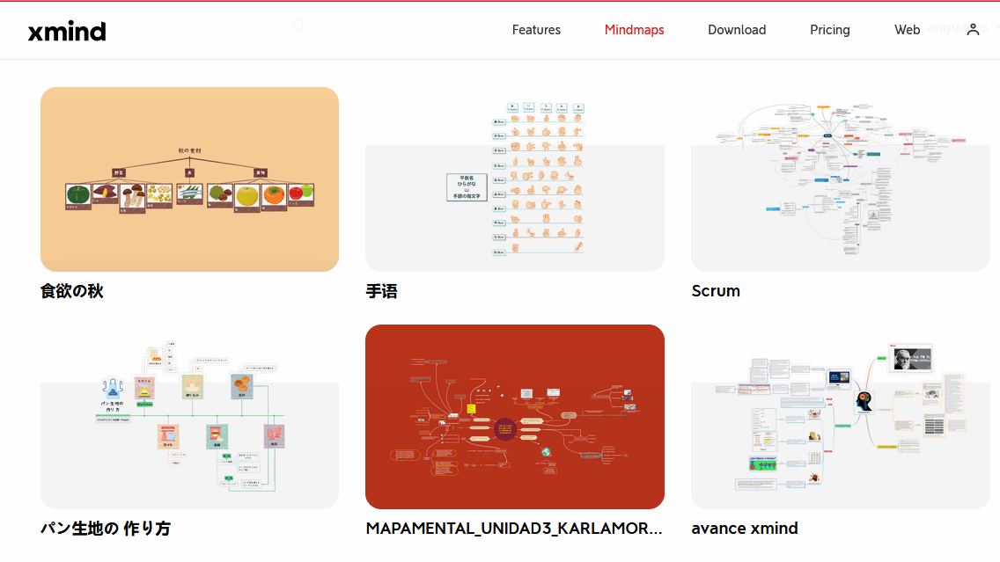
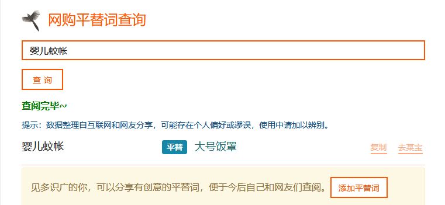
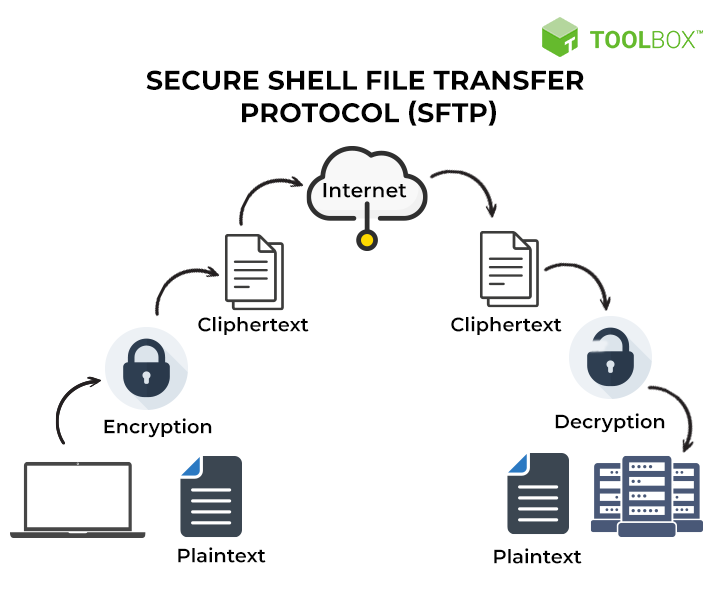

啰里啰唆周刊第39期：陟彼南山，言采其蕨

# 科技日常

## 1.高质量思维导图

Xmind官方展示的，由用户自行创作的一系列高质量思维导图。能学到不少知识。

[https://xmind.app/share/ ](https://xmind.app/share/ )

## 2.网购平替词查询

让你买到便宜的平替品。比如你要买“婴儿蚊帐”，那买“大号饭罩”就会便宜很多。

想买“猫抓板”，淘宝一看二三十，那买“瓦楞纸板”就会便宜不少，十几元就能买到。

当然，数据整理自互联网和网友分享，可能存在个人偏好或谬误，使用中请加以辨别。
[https://tool.mingdawoo.com/sse/shopping_alias/](https://tool.mingdawoo.com/sse/shopping_alias/)

## 3.Windows上的隐藏服务

怎样在Windows上隐藏一个服务以及抓出隐藏的服务

原理就是使用SDDL。不得不说Windows是个黑盒，里面很多隐秘的黑科技，养活了不少搞安全的从业人员。

[https://www.sans.org/blog/red-team-tactics-hiding-windows-services/](https://www.sans.org/blog/red-team-tactics-hiding-windows-services/)
[https://stackoverflow.com/questions/25736268/how-to-register-a-windows-service-but-avoid-it-being-listed-in-the-services-cons#answer-25736814](https://stackoverflow.com/questions/25736268/how-to-register-a-windows-service-but-avoid-it-being-listed-in-the-services-cons#answer-25736814)

## 4.软KVM切换器 barrier

我一直用 Linux 办公，之前都是 Linux host + Windows 虚拟机的方案，但是换 AMD + 4k显示器之后，虚拟机不知道是啥原因，卡得慌，于是把老本本搬出来放 一边用于开会等。

笔记本自然是有一套键盘 + 触控板，触控板摸多了手指指腹会不舒服，所以我还弄了一个鼠标，这就导致有两套键鼠，每天左边右边转来转去，实属有点难受。

考虑过买KVM切换器，但是看起来每一次都要按一下，有点麻烦，并且都是 VGA 接口，显示器不支持。

偶然在群里看到群友同时共用n台电脑，询问后发现是使用的 [synergy](https://github.com/symless/synergy-core) 方案，于是我也去搜索了一下，发现这个软件现在开始要求付费使用，当然也可以自己 编译，但是搜索之后，我发现有一个替代软件 [barrier](https://github.com/debauchee/barrier)， 后者是从前者fork出来的源码，现在星星比前者还多了。

ref:[https://jiajunhuang.com/articles/2021_11_26-use_barrier.md.html](https://jiajunhuang.com/articles/2021_11_26-use_barrier.md.html)

## 5.Buzz – 开源、跨平台、可离线的实时语音转文字工具

Buzz 是一款基于 [OpenAI Whisper](https://github.com/openai/whisper) 的开源、可离线的实时语音转文字工具，支持 Windows、macOS、Linux，它可以将麦克风的语音实时转换为文字，也支持将视频、音频文件转换为文字、字幕。支持中文。

功能：
实时语音转文字、实时翻译（需麦克风权限）
导入音频、视频文件（mp3、wav、m4a、ogg、mp4、webm、ogm），导出逐句字幕或逐词字幕（导出格式：TXT、SRT、VTT）

Whisper 是一种通用语音识别模型。它利用各种大型数据集上的音频进行训练，也是一个多任务模型，可以执行多语言语音识别以及语音翻译和语言识别。

Buzz本身体积不大，但在第一次使用 Buzz 的时候，会下载 Whisper 的模型。模型本身体积不大，从几十M到1G，主要是对显存要求较高，最少1G，10G最佳。

说白了，Buzz就是Whisper 的GUI前端。

[https://github.com/chidiwilliams/buzz](https://github.com/chidiwilliams/buzz)

## 6.Voce chat - superlight Rust powered open-core chat app

是一款支持独立部署的个人云社交媒体聊天服务。15MB 的大小可部署在任何服务器上，部署简单，很少需要维护。前端可以内嵌到自己的网站下，数据完全由用户自己掌握，传输过程加密。

基于rust开发，国产软件。

VoceChat 具备的功能特性

🛠️ 开源 + 自部署：意味着代码 + 数据完全自主，甚至可以做二次开发
📱 全平台：一旦部署成功，既可以通过 WebAPP 使用，也可以通过手机 APP 使用
👨‍👨‍👦‍👦 即时聊天 + 频道：既可以同某个人即时聊天，也可以建立一个主题频道群聊
😃 多种消息格式：文本，图片，文件，emoji ，以及富文本（ markdown ）
⭐ 丰富的可配置项：在登录，注册，通知，成员管理，频道管理，第三方授权等各方面，都做了详尽的可配置化
🤖 强悍的扩展功能：我们有 widget 组件，可以很方便地把 VoceChat 聊天功能扩展到任意网站，让你的网站即刻拥有 IM 功能
🇨🇳 多语言支持，目前有中英两种语言，欢迎贡献其它语种。

**注： 其服务端已不再开源，之前开源地址已删除，目前仅支持二进制部署。选型谨慎考虑** 。

官网：[https://voce.chat](https://voce.chat)

## 7.SFTP和FTPS是同一回事吗？

FTP是什么，大部分人都知道，是当今使用的最古老的文件传输协议之一，是一种非常便捷的移动文件的方式。FTP传输没有加密，通常我们使用SFTP协议更多一些。

SFTP想必知道的人也很多，SFTP 是 Secure Shell File Transfer Protocol 的缩写，也叫作安全外壳文件传送协议。通常我们用xshell管理服务器时，进行文件上传下载，就是用的SFTP。

那FTPS呢，FTPS是SFTP吗？中文网络有很多文章抄来抄去，估计自己都没理解，说的含糊不清。

FTPS 是使用安全套接层（SSL）证书的 FTP 安全技术。整个安全 FTP 连接使用用户 ID、密码和 SSL 证书进行身份验证。一旦建立 FTPS 连接，FTP 客户端软件将检查目标 FTP 服务器证书是否可信的。FTPS的缺点在于需要辅助数据通道（DATA），每次进行文件传输请求（get，put）或目录列表请求时，需要打开另一个端口号。这使得难以通过防火墙使用，而且并非所有 FTP 服务器都支持 SSL/TLS。

而SFTP和FTPS则完全不一样，SFTP文件传输协议是另一种安全的安全文件传输协议，设计为 SSH 扩展以提供文件传输功能，因此它通常仅使用 SSH 端口用于数据传输和控制。

两者的相同点在于S，虽然都用了SSL，但实现则完全不同。

答案很明了，也就是说SFTP和FTP是完全不同的两个协议。FTPS基于FTP协议进行封装，而SFTP基于SSH协议进行封装。两者都带FTP，但FTP的含义也完全不一样。

参考：[https://www.spiceworks.com/tech/networking/articles/sftp-vs-ftps/](https://www.spiceworks.com/tech/networking/articles/sftp-vs-ftps/)

## 8.写脚本就能当导演 —玩句

腾讯近日推出一款名为「玩句」的App，支持安卓与IOS，并在小规模内测。「玩句」是一款创作简易动画视频的工具，用户只需要在软件界面中选择场景和人物，并未每个人物安排动作和台词就可以组装成一个有意思的小视频。

适用群体：有表达欲的创作者。

也就是说「玩句」这款 App 为用户提供了脚本和分镜能力，并且内置了几十种卡通人物和场景。调试过后就可以讲自己制作的动画视频发布。作为一个 UGC App「玩句」提供了可供用户自行浏览他人作品的玩法。当然，作品需要进行审核后才能对外发布。

「玩句」需要使用 QQ 或者微信进行关联授权登录，首次登录后需要使用邀请码（邀请码获取可参照APP提示）才可以参与内测。创作的作品目前可以对外以 H5 页面进行分享，观看者不需要登录，审核通过后的作品可以下载。

# 读书与影视分享

## 1.1998年经典影片《楚门的世界》

《楚门的世界》是派拉蒙影业公司于1998年出品的一部电影。由彼得·威尔执导，金·凯瑞、劳拉·琳妮、诺亚·艾默里奇、艾德·哈里斯等联袂主演。该片于1998年6月1日在美国上映。影片讲述了楚门是一档热门肥皂剧的主人公，他身边的所有事情都是虚假的，他的亲人和朋友全都是演员，但他本人对此一无所知。最终楚门不惜一切代价走出了这个虚拟的世界。1999年，该片获得了第71届奥斯卡最佳原创剧本奖提名。

**逃出不去的时间成为了无限的循环，逃不出去的空间就成为了《楚门的世界》。**

楚门的世界，已经不再是单纯的一部电影。

> 间隔十年看了两遍。
> 
> 十年前看他，怕他在门前回头。
> 
> 十年后看他，怕他在门外后悔。
> 
> 外面的世界过于险恶，习惯了周边被设定好的情节，当变成谁都不可预料的时候，会不会手足无措

机核今日也新出了一期节目谈楚门的世界：[https://www.gcores.com/videos/159374](https://www.gcores.com/videos/159374)

## 2.Netflix 网剧《鹿角男孩》

《鹿角男孩》由吉姆·米可执导，克里斯蒂安·康佛瑞、侬索·阿诺斯、斯蒂芬妮娅·欧文、阿里萨·维拉尼等人主演的奇幻冒险电视剧。
该剧第一季于2021年6月4日在Netflix上线。  第二季于2022年播出。

该剧改编自杰夫·勒米尔的热门DC漫画，讲述了一起灾难性事件改变了世界，一个半人半鹿男孩离开家探寻这起事件背后隐藏的巨大阴谋，最终他对自己的身份也产生了质疑的故事。

十年前，“大崩塌”对世界造成了严重破坏，并导致了神秘变种人的出现——出生时半人半兽的婴儿。由于不确定杂交种是病毒的起因还是结果，许多人害怕并猎杀它们。一个名叫格斯（克里斯蒂安·康佛瑞 饰）的鹿角男孩在与世隔绝的森林安居了十年后，机缘巧合地与一个四 处流浪的名叫杰珀德（侬索·阿诺斯 饰）的独行侠交上了朋友。他们一起踏上了一场穿越美国的非凡冒险，寻找答案——关于格斯的出身，杰珀德的过去，以及家的真正意义。但他们的故事充满了意想不到的盟友和敌人，格斯很快就了解到，森林外郁郁葱葱、危险的世界比他想象的要复杂得多。

 

> 这是一个被磨平棱角的后启示录故事，Netflix的《鹿角男孩》讲述了混血鹿角男孩Gus和他的保护者Jepperd经历了冒险，但其实这些危险和度过危险的方法都没什么存在感。这部剧把杰夫·勒梅尔的惊悚漫画变成了一场孩童般的冒险，但它失去了原本让这部传奇如此丰富的复杂、丑陋和原始的情感。

# 图论

## 1.Honest Horror

More info: [Instagram](https://www.instagram.com/spaceboycantlol/) | [Facebook](https://www.facebook.com/spaceboycantlol/)

## 2.I see you

More Info:[https://www.instagram.com/cheddarbaconstudios/](https://www.instagram.com/cheddarbaconstudios/)

# 谈天说地

## 1.《A&P》

In walks these three girls in nothing but bathing suits. I'm in the third check-out slot, with my back to the door, so I don't see them until they're over by the bread. The one that caught my eye first was the one in the plaid green two-piece. She was a chunky kid, with a good tan and a sweet broad soft-looking can with those two crescents of white just under it, where the sun never seems to hit, at the top of the backs of her legs. I stood there with my hand on a box of HiHo crackers trying to remember if I rang it up or not. I ring it up again and the customer starts giving me hell. She's one of these cash-register-watchers, a witch about fifty with rouge on her cheekbones and no eyebrows, and I knowit made her day to trip me up. She'd been watching cash registers forty years and probably never seen a mistake before. 

上一期提到cat person这篇文章，这次是A&P。
《A&P》是美国作家John Updike的著名短篇小说，创作于1961年，并与1961年7月22日发表在the New Yorks(《纽约人》杂志)。1962年又作为选篇收入作者自选集Pigeon Feathers and Other Stories并出版。迄今为止，A&P一直是作者Updike收录次数最多，也是最受欢迎的短篇小说。这篇短篇在很多方面都体现了典型“《纽约人》小说”的特点：短小精悍，现实手法，以第一人称写就，并集中于角色性格的描写。

小说通篇采用第一人称口吻，为主人公Sammy的自述。三个穿泳衣的女郎来到A&P购物，正处于青春期的Sammy的目光自然立刻被她们吸引而且很快就迷上了其中之一（Sammy称之为Queenie）。但是超市的经理Lengel却当面斥责女郎们没有遵守“穿着得体”的规定，Sammy见到这一幕当下决定辞职。他本意是想借此举来获取女郎们的注意，但是却被匆匆离去的她们忽略，为此Sammy丢掉了自己的工作，而且预感到自己未来的生活会更加艰难。

《A&P》表现了个体性与人类性之间的美学关系和爱欲与文明之间的激烈冲突。

[http://www.tiger-town.com/whatnot/updike/](http://www.tiger-town.com/whatnot/updike/)

## 2.蕨菜

蕨菜为蕨类植物蕨还处于卷曲未展时的嫩叶，蕨菜是野菜的一种，又名“龙爪菜”，“拳头菜”，喜生于浅山区向阳地块，山间地头。其分布和食用历史几乎全国均有。即使是在美食最为匮乏的河南，在靠南的南阳、信阳地区，也有食用蕨菜的历史。西南、华中和长江流域、东北地区是主要产地和食用地。当然，不是所有的蕨都可以食用，比如大多数人认识的蕨都属于观赏蕨。

关于东北，之前提过多次，一般人看来东北是寒冷偏僻之地，但由于东北林业资源丰富，故野菜野果也很丰富，最贫瘠的地方不是北方，而是中原地区。蕨大多喜好西南山地气候，但也有耐寒品种，故而东北也产。

采蕨菜的最佳时间是阳春三月。每当天气转暖，向阳的山坡上、小河边、水塘周围的土埂上，肥嫩的蕨芽破土而出，汁液丰盈，触之即折。提篮采摘，十分惬意。采摘下来的鲜蕨菜，可以用先进的保鲜技术进行分装，再运到大城市的餐桌上；也可以加工成干蕨菜——将鲜蕨菜放进装有沸水的锅里略煮，也就是“淖一滚”，取出后晾干即可。

当然，蕨菜还是鲜吃最美。鲜蕨菜采摘下来，用滚开的水一淖，捞出后将水控净，用刀斜切成寸许的段子，放进油锅里爆炒，趁热上桌，食之滑嫩爽口、清香扑鼻、微软筋脆、了无渣滓，仿佛洋溢着山间清风明月的清新与纯粹。可嫩蕨菜的采摘佳期短暂易逝，蕨芽拱破泥土，暖风一吹，鲜嫩肥硕的茎秆儿一个劲儿地往上蹿，若不及时采摘，“紧握的小拳头”稍一伸开，茎秆就老了；一旦纤维化，食之有如干柴。

早在两千多年前，我国第一部诗歌总集《诗经》中就有歌咏蕨菜的，《诗经·召南·草虫》有“陟彼南山，言采其蕨。未见君子，忧心惙惙。亦既见止，亦既觏止，我心则说”的句子。讲述了一个怀春少女借口上山采蕨，私会情郎，结果情郎迟迟不来，她忧心如焚的故事。

一千多年前，世界上最早的长篇写实小说、日本古典名着《源氏物语》，第四十八回的题目就是「早蕨」。作者紫式部在这一回里写道，阿闍梨派人给二女公子送信来，随函送上蕨及问荆，装在一只精緻的篮子里，附言道：「此蕨与问荆，乃诸童子为供养贫僧而採得者，皆初生时鲜也。」并附诗曰：「年年采蕨供春膳，今岁不忘旧日情。」二女公子即答道：「摘来山蕨谁与赏，物是人非感慨深。」直到今天，日本人仍有食蕨菜的习惯。

食用蕨菜可致癌。原蕨苷在蕨的各部分中都有，而人吃的蕨菜（蕨的幼嫩部分）中含量更高。但是，动物生吃蕨类植物导致中毒是由于部分鳞毛蕨科植物体内含有绵马酸，这是一种神经毒素，跟毒蕈的作用机理类似，但不是所有蕨类植物都含有绵马酸。实验室在做小鼠或者大鼠实验时喂的是生蕨菜，既未经过处理剂量又大！

所以想吃就吃，不必太担心，绝大部分人也到不了大量食用的剂量。就跟鱼腥草致癌一样（有争议），大可不必避而远之。

## 3.内蒙羊圈之谜，过去一周吸引了大量”神秘现象“爱好者

11月17日，中国官方媒体《人民日报》在推特上分享了一段令人毛骨悚然的视频，视频中蒙古的数十只羊围成一圈，超级转转转，路径几乎是完美的同心圆。

[https://twitter.com/PDChina/status/1592891305721372673](https://twitter.com/PDChina/status/1592891305721372673)

视频发布时，羊群已经连续10多天保持队形，吓坏了农场主们。

一些人猜测羊就像蚂蚁，正陷入死亡螺旋。

其他人则认为那些反刍动物患有“盘旋病”。这种疾病是由土壤细菌引起的，这些细菌可以感染动物大脑的一侧，导致身体向受影响的一侧倾斜。然而，通常情况下，在疾病爆发时，只有百分之几的羊受到影响，而且它们往往只遵循个人的盘旋模式，几天后就会死亡。

在内蒙古，人们发现数十只羊围成一圈，媒体报道，这些动物已经连续转了12天，但没有详细说明羊在此期间是如何进食、饮水和死亡的。据我们所知，羊还在继续。

澳大利亚阿米代尔新英格兰大学的畜牧专家 Emma Doyle 对澳大利亚广播公司的 Nick Kilvert 说：“我一看到，就想，‘我从来没有见过这样的羊’。这似乎有点狡猾。看起来有点像他们在中间放了一些东西来阻止羊聚拢。”

英国哈特普里大学的农业科学家Matt Bell认为这未必是骗局。他告诉新闻周刊，羊被关在围栏里很长一段时间后，它们可能会变得沮丧并开始绕圈踱步。

这是圈养的野生动物，尤其是[大型猫科动物的常见症状](https://www.youtube.com/watch?v=YuZFzTpcbfY&ab_channel=BornFreeFoundation)。它被称为[动物精神病](https://www.bornfree.org.uk/zoochosis)，可能引发没有任何目的的重复行为。一旦放牧动物开始以这种方式行事，它甚至可能像某种奇怪的传染病一样蔓延开来。

据报道，随着时间推移，牧场主人注意到越来越多的羊加入了这个圈子。这支持了Bell的解释。然而，据新闻报道，牧场上有34个圈舍，其它都很正常。

这让人想起去年在东萨塞克斯郡的[另一起奇异事件](https://www.dailymail.co.uk/news/article-9453965/Mystery-hundreds-sheep-stand-circle-field.html)。那时候，人们看到有一群羊围城一个完美的圆，一动不动且十分平静。

但后来调查发现，那只是因为农场主用饲料画了一个圆，羊聚过吃东西，然后停留在那个位置一段时间。

对于蒙古盘旋的羊群，则解释不通。如果没有更多细节，“内蒙羊圈之谜”或许会成为下个十年里的世界未解之谜。

https://www.sciencealert.com/eerie-video-of-bizarre-sheep-phenomenon-has-the-world-running-in-circles

视频：https://www.dailymail.co.uk/news/article-11438327/What-flock-Sheep-walk-circle-TWELVE-DAYS-without-stopping-Chinese-farm.html

## 4.解密亚洲第一期刊消失之谜，” 读者” 为啥没有读者了

恰好，我之前第35期也谈到了读者这几本杂志。原视频还是比较客观的。

作为以意识形态为纲，90后、00后为主要群体的B站，评论里将其归类为“公知”这类意识形态问题，预料之中，但大可不必。

它受到追捧，与公知无关，它的衰落也与公知无关。主要还是时代的变化，信息获取渠道的爆发导致纸媒的没落。文章确实有许多编造的，这是那个时代非严肃媒体的通病，况且，严肃媒体也胡编乱造过。

视频中提到一个细节，“一天最多的时候收到了9麻袋读者信件”，这对于70、80后来说，是非常熟悉的故事。对于那个精神世界空白的80/90年代，读者杂志的“鸡汤+窗口”模式满足了那个时代的需求。很多老70/80后可能还记得读者来信这件事。

> 1980年5月，一封署名“潘晓”的读者来信《人生的路呵，怎么越走越窄……》发表在《中国青年》杂志上。 这封信用沉重、幽怨、郁闷、诚挚、激愤的笔触书写了人生痛苦和创伤，甫一发表，即引发一场全国范围内关于人生观的大讨论。 从1980年5月开始到这一年的年底，《中国青年》杂志社收到六万多封读者来信，社会各界，尤其是高校，对这一问题的专场讨论不胜枚举。

对于创刊于1981年的读者，受到追捧已经很清楚了。开口闭口就是公知、意识形态问题，只能体现出B站用户的无知和浅薄。

[https://www.bilibili.com/video/BV13D4y1v7Ph/](https://www.bilibili.com/video/BV13D4y1v7Ph/)

# 一句话快讯

1.近日因知名歌手任贤齐在网上发声引发广泛关注。11月23日下午，孙安亮在社交媒体平台发布消息称，孙泽莀已去世，请各位好心人帮忙删除孙泽莀的寻人启事。

2.《阿凡达》系列电影制作公司迪士尼/二十世纪影业官方微博宣布，《阿凡达》第二部《水之道》将于 12 月 16 日全球同步上映。这是近期第一部同步上映的外国大片

3.11月24日19时49分，乌鲁木齐市天山区吉祥苑小区一高层住宅楼发生火灾，致10人死亡、9人受伤。

# 联系方式

啰里啰唆是一份针对互联网和生活爱好者的数字杂志，旨在发现和分享一切有趣的东西。话题不固定，每期大约十五分钟阅读量，暂定每周四发布。部分内容来自互联网采编，如果为有来源的转载，均会注明转载地址或保留水印。

这是一个关注人文和科技的newsletter。

使用方法建议或素材提供

频道：notonlyshare

github地址：[https://github.com/iminto/luoliluosuo-weekly](https://github.com/iminto/luoliluosuo-weekly)