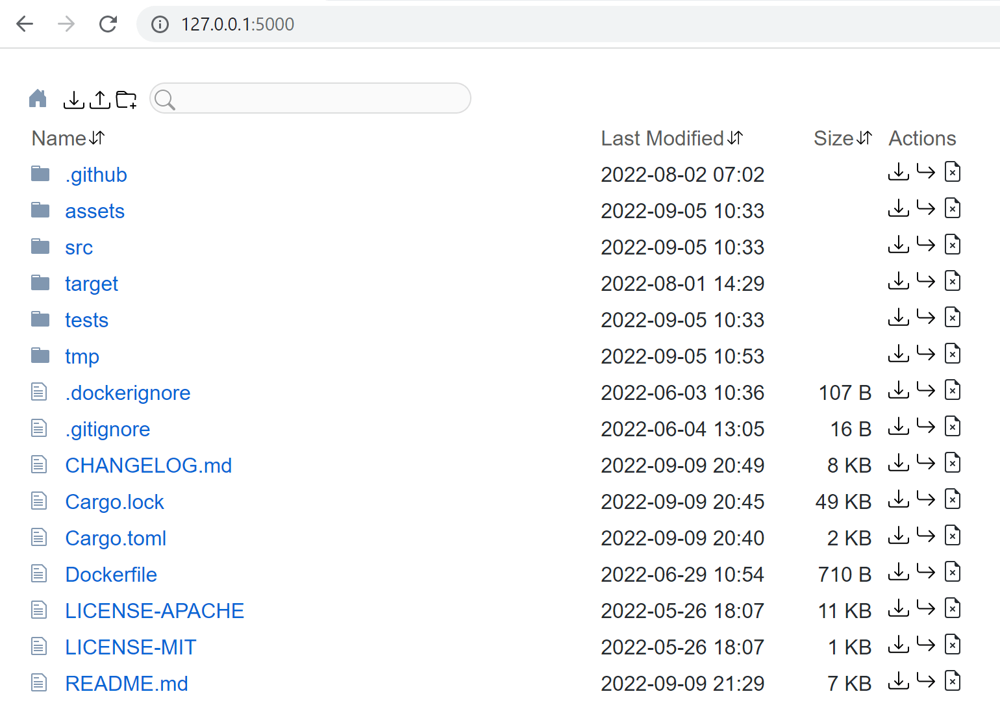
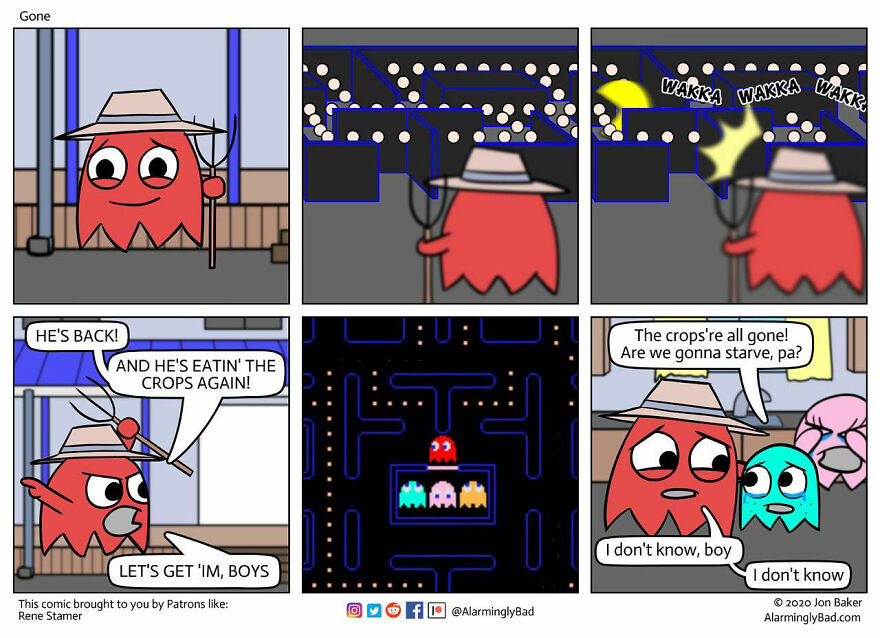
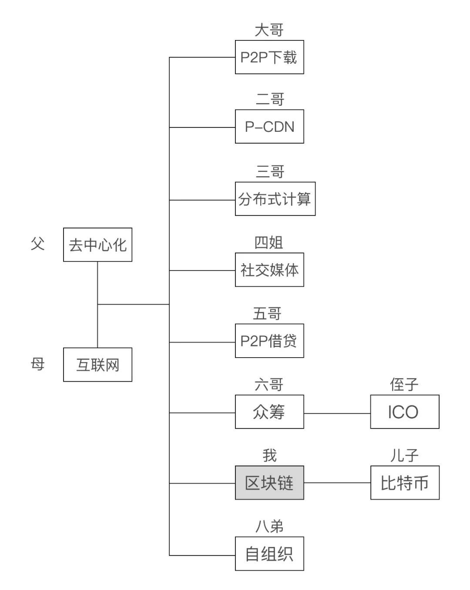
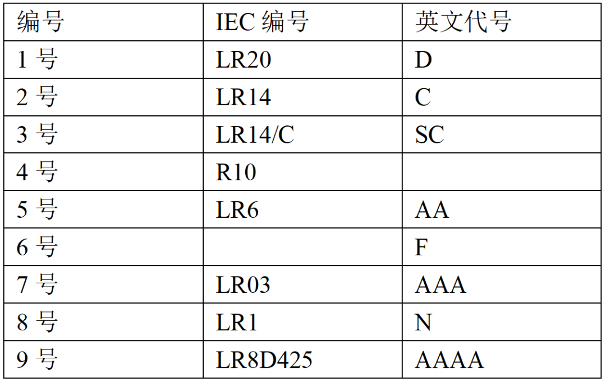

啰里啰唆周刊第40期：我瞻四方，蹙蹙靡所骋。

# 科技日常

## 1. mpv.net- mpv player第三方版

mpv是基于MPlayer和mplayer2的媒体播放器。它支持多种视频文件格式，音频和视频编解码器以及字幕类型。
但MPV使用起来并不易，没有可见的菜单选项，但还是可以通过键盘快捷键和鼠标来进行交互控制。于是网上有很多衍生和改进版。

mpv.net is a modern desktop media player for Windows based on the popular mpv player.

mpv.net is designed to be mpv compatible, almost all mpv features are available because they are all contained in libmpv, this means the official mpv manual applies to mpv.net.

mpv focuses on the usage of the command line and the terminal, mpv.net retains the ability to be used from the command line and the terminal and adds a modern Windows GUI on top of it.

[https://github.com/mpvnet-player/mpv.net](https://github.com/mpvnet-player/mpv.net)

如果仅仅是觉得MPV的配置比较麻烦不直观，可以参考此项目 mpv Config File Generator for Windows：[https://github.com/MattMcManis/Glow](https://github.com/MattMcManis/Glow)

如果看重字幕和媒体库管理，可以参考此第三方版本：[https://kikoplayproject.github.io/](https://kikoplayproject.github.io/)

## 2. Fluent Search-windows桌面搜索和效率工具

Fluent Search，是一个搜索软件。但和 Everything 等传统搜索软件不同，它有一个厉害之处在于屏幕搜索，它可以搜索并定位当前窗口的所有可点击元素，并用两个字母进行表示，你只需要敲下这两个字母，就能模拟鼠标的点击操作！

基于C#开发，Available for Windows 10/11 only.

Fluent Search 的索引器除了可以搜索文件、目录、设置、进程、应用程序、浏览器（火狐需要安装插件）书签和历史记录，还可以对部分格式进行全文搜索，当你只想查相关内容时，通过 files content 标签即可进行搜索，不过受限于性能，搜索内容需要超过 3 个字符才会进行搜索，基本可以替换掉Listary 99%的功能了。

除了杀手级的搜索功能外，它还包含许多其它基础功能，包括：
1.应用启动器
2.切换打开的应用窗口
3.流畅的键盘操作

[https://www.fluentsearch.net/](https://www.fluentsearch.net/)

## 3. Dufs 一个WebDAV的更好选择

WebDAV协议虽然又老又复杂，但是又不得不承认，使用起来他是最广泛的、最方便、最成熟的跨设备跨平台文件同步协议。作为国内唯一支持WebDAV的网盘-坚果云，可以肯定地说，如果没有WebDAV的加持，以坚果云的容量和浏览，它没有任何优势。

要想自己搭建一个WebDAV协议的服务端，选择也不少，比如Nginx+Webdav插件（bug略多，略简陋），或者caddy+webdav插件（配置麻烦，文档不够多），或者一些自建网盘服务如chfs、Seafile或Cloudreve（要么不开源要么太重），那还有其他选择吗？
不妨试试Dufs。它支持多用户访问控制，支持搜索，HTTPS部署简单。

> Dufs is a distinctive utility file server that supports static serving, uploading, searching, accessing control, webdav...

基于rust开发，开源，体积小，跨平台。

[https://github.com/sigoden/dufs](https://github.com/sigoden/dufs)

除了Dufs外，作为云盘管理的一款app，Rclone，也同样足够简单易用，一行命令启动。

> Rclone is a command-line program to manage files on cloud storage. It is a feature-rich alternative to cloud vendors' web storage

Rclone支持几十种云盘，也支持FTP,SFTP，webdav协议，可以利用它的这个特性来做webdav协议的服务端。

[https://rclone.org/](https://rclone.org/)

## 4. 恰当地使用451状态码

451是2016年新增的一个HTTP状态码，其实也有一段时间了，我曾经也介绍过，但使用频率不高。

451 Unavailable For Legal Reasons（因法律原因不可用）是一种 HTTP 协议的错误状态代码，表示服务器由于法律原因，无法提供客户端请求的资源，例如可能会导致法律诉讼或审查的页面。

这个响应示例来自 IETF RFC 规范，其中提到了英国戏剧电影[Monty Python's Life of Brian](https://zh.wikipedia.org/wiki/%E8%92%99%E6%8F%90%C2%B7%E6%B4%BE%E6%A3%AE%E4%B9%8B%E5%B8%83%E8%8E%B1%E6%81%A9%E7%9A%84%E4%B8%80%E7%94%9F)（《蒙提·派森之布莱恩的一生》）。

比起直接返回404，451会清晰很多。

ref:
[https://httpwg.org/specs/rfc7725.html#n-451-unavailable-for-legal-reasons](https://httpwg.org/specs/rfc7725.html#n-451-unavailable-for-legal-reasons)

[https://zh.wikipedia.org/wiki/HTTP_451](https://zh.wikipedia.org/wiki/HTTP_451)

## 5.「更好用」的国际版 app 好在哪？我对比了这 3 款应用 
作为几亿人每天花费数小时，拿起数百次的设备，手机这块「小」屏幕背后有着近乎无限的流量。在各大厂商都试图将这份流量的收益最大化的今天，许多 App 都被逐渐塞入了越来越多的功能和广告，时间流变得肮脏、界面变得臃肿、体积变得庞大。

而「国际版」app 会有更好的使用体验，也在不知不觉间成为了许多用户的共识。在这篇文章里，我对比了 3 款应用的普通版与国际版的差别，带你看看「国际版」究竟好用在哪里，又可能引入哪些不变。

[https://sspai.com/post/76710](https://sspai.com/post/76710)

## 6.OpenAI 发布 AI 对话系统 ChatGPT
OpenAI 上周发布了聊天对话引擎 ChatGPT，它是 GPT-3 的衍生产品。据了解，ChatGPT 不仅可以对话，还能帮助程序员生成代码或解释编程概念，例如「使用 Python 写一段 xx 代码」、「什么是冒泡排序」等，且支持前后端等不同语言。

[https://chat.openai.com/](https://chat.openai.com/)

注：ChatGPT不支持中国大陆以及香港地区的IP和手机号注册。

# 读书与影视分享

## 1.2000年电影《夜奔》

男怕夜奔，女怕思凡。

不熟悉传统戏曲的观众，多是在《霸王别姬》中第一次听到了这句梨园行的俗话，程蝶衣便是因了《思凡》中的一句“我本是女娇娥，又不是男儿郎。”开启了他一生的悲剧，而以《夜奔》为主题的电影又是怎样的结局呢？

《林冲夜奔》本是昆曲传统武生戏，取材于《水浒传》，讲的是林冲受高俅迫害亡命水泊梁山途中的故事。后由京剧大师杨小楼将之改造成一出京剧大戏，《夜奔》从此也成为京剧的常演剧目，而《霸王别姬》中段小楼的原型正是杨小楼。

《夜奔》是徐立功、尹祺执导的文艺爱情电影，由刘若英、黄磊、尹昭德、戴立忍主演，于2000年10月14日在中国台湾上映。该片讲述了大提琴家徐少东经未婚妻英儿介绍与昆曲演员林冲相识，互生倾慕，而林冲被富家公子黄子雷强占，四人之间发生感情纠葛的故事

**注：此片有同性元素，中国大陆版删减较多。(片长: 119分钟(韩国) / 73分钟(中国大陆))**

> 老去的他坐在三块墓碑中间。
> 旁白在说：
> 有人经过，问我这是谁的墓。
> 我会告诉他，这里一个是我的妻子，一个是我的爱人。
> 一个是追寻着自己的，一个是自己追寻但是只能逃避的。
> 这是关于夜奔的故事。
> 这是关于他她他的故事

> 该片借助于《水浒》的历史文化积淀，把林冲的名从历史中剥离出来，重新装填进充满现代意义的灵与肉，通过昆曲《夜奔》这一历史文化具象和“林冲”之间一种内在的文化联系，把数百年前的历史意象和20世纪的现代意识交融为一个整体。在英儿、少东、林冲、黄子雷这一组复杂的人物关系中，影片没有以生活中一般的道德标准来苛求人物，而是从宽泛的人性的角度，对人的丰富性和复杂性进行了细腻而深刻的揭示，从而使影片具有一种沉甸甸的厚重感。在这个意义上来说，影片《夜奔》和昆曲《夜奔》完全不可同日而语。

> 该片的故事复杂、残酷、往人所不能理解或者不愿深究的欲望深度探索，连痛苦与挣扎都受着自我深深的压抑。观看这个影片不会愉快，但幸而有了刘若英，她给整个片子带来了几许亮色

## 2.马伯庸小说《寂静之城》

2005年第5期《科幻世界》登载了一篇意味深长的小说《寂静之城》。灵感来自奥威尔的名著《1984》和《毕业生》主题曲”Sound of Silence”。在不知名的未来，主人公阿瓦登生活的国度-美国，无所不在的互联网网管和电子监控设备（“旁听者”）接收和甄别每个人说的每一句话，写的每一个字，发出的每一个信息。当局每天公布“非法词汇列表”，任何人不得使用里面的词汇。

《寂静之城》2005年获国内科幻文学最高奖项“银河奖”。

阿瓦登和几个志同道合的朋友冒着巨大的风险组织了一个“说话会”，定期聚会，目的无他，只是为了自由自在的说话，自由自在的思考。当局的控制日甚一日，“非法词汇列表”变成了“安全词汇列表”，即只能使用列表中的词汇说话。“安全词汇列表”也越来越短，越来越短，终于有一天，当局公布的当日“安全词汇列表”上，一片空白……“于是，阿瓦登只好保持着沉默，默默的与面无表情的她擦肩而过，继续向前走去。他的身影逐渐融入同样安静的灰色人群中，整个城市寂静无声。”

其实我不是很喜欢马伯庸这个作者，这篇中篇小说的篇幅也不长，文笔也不如马伯庸如今老道，但是这篇文章算是马伯庸众多小说里风格比较少见的一篇。当然，能在2005年就能写出如此具有预见性的文章，也说明了其较深的洞察力。后来马伯庸转向了戏说历史方面的创作。

> 原文节选：每一个使用互联网的人都有一个网络编号，没有这个编号，就无法连接进互联网络。每一个编号都是独一无二的，每个人只有一个；这是使用者在网上的唯一代号，既不能修改，也不能取消。这些编号分别对应着使用者身份证上的名字，因此19842015就是阿瓦登，阿瓦登就是19842015。阿瓦登知道有些记忆力不好的人会把自己的编号印在衣服的后面，那看起来颇为滑稽，也容易引发一些不正当的联想。

> 昨天的科幻小说，今时的魔幻现实主义著作，明日的报告文学

# 图论

## 1.Gone && tired

tired

More info: [Instagram](https://www.instagram.com/alarminglybad/) | [patreon.com](https://www.patreon.com/AlarminglyBad)

## 2.去中心化家族成员

图片来源：[https://mp.weixin.qq.com/s/E4FJuWKV8N2QuWMrDWSaIg](https://mp.weixin.qq.com/s/E4FJuWKV8N2QuWMrDWSaIg)

# 谈天说地

## 1.What happens if we make the Mona Lisa more symmetrical?

The Golden Ratio and symmetry are two universal rules of beauty. The problem is they conflict with one another.

**‘Beauty is in the eye of the beholder,’ wrote** Margaret Wolfe Hungerford in her novel *Molly Bawn* (1878); William Shakespeare made a similar statement in *Love’s Labour’s Lost* (‘Beauty is bought by judgment of the eye’); and such sentiments have been attributed even to Plato.

Yet, for centuries, people have been trying to find objective ways to characterise this ineffable quality of beauty (more broadly, of  aesthetics). Are certain shapes or forms more attractive than others?  Can visual appeal be codified, perhaps even predicted, in terms of  adherence to some universal norms? Is there a formula for beauty, a  rubric, a way to measure it?

[https://psyche.co/ideas/what-happens-if-we-make-the-mona-lisa-more-symmetrical](https://psyche.co/ideas/what-happens-if-we-make-the-mona-lisa-more-symmetrical)

## 2.为什么常见的电池都是以奇数来称呼的

作为家里的小帮手，在日常生活中你有没有这样的疑惑：当家里的遥控器没电的时候，大人通常会让你去商店里买7号电池；当家里的热水器或者煤气燃气灶打不燃的时候，会让你去买“巨大无比”的1号电池；而当你玩电脑发现自己的电池鼠标没电了，则通常会去买5号电池……

所以电池难道只有单数，没有双数吗？

其实，当你打开某宝或者某东的时候，搜索“电池”关键词，就能够发现从1到9号的电池都是能够买得到的。所以说，**不常见并不代表不存在**。

ref: [https://news.mydrivers.com/1/867/867172.htm](https://news.mydrivers.com/1/867/867172.htm)

## 3.美国最大规模的“退坝还河”实验：花5亿美元拆除四座百年大坝

明年，美国四座有百年历史的水坝JC Boyle、Copco 1、Copco 2 和 Iron Gate将开始拆除工作，最大的计划于 2024 年拆除。

Looking down at a pool filled with Klamath River salmon swimming back to their spawning grounds, Karuk Tribal Councilor Aaron “Troy” Hockaday says he can’t wait to see what the future holds for them.

“These fish right here give me hope,” he said. “They had a long journey from the mouth of the Klamath coming up here, so right now what they’re doing is resting a little bit.”

[https://www.opb.org/article/2022/11/18/klamath-river-dam-removal-southern-oregon-dams-northern-california-drought/](https://www.opb.org/article/2022/11/18/klamath-river-dam-removal-southern-oregon-dams-northern-california-drought/)

## 4.「江西」依然在，「江东」去哪了？

关于江西省名称来源，有不少人望文生义地理解为：长江以西。这就跟理解广东、广西一样，犯了同样的错误。很多人已经发现，其他带“东”“西”“南”“北”的省份，往往有一个兄弟相伴，如有山东，就有山西；有广东，就有广西；有湖南，就有湖北。到了江西这里，变了：有“江西省”，没有“江东省”！

熟悉或喜欢秦末楚汉争霸这段历史的童鞋，应该会经常遇到“江东”一词，项羽的队伍号称“江东子弟”，他们都是跟随项王一起造反的老乡。

不过，项羽的籍贯是泗水郡下相（今江苏宿迁），位于今苏北地区，这里并没有大江，何来“江东”？其实，项羽起兵，是在今江浙交界的太湖平原一带，即他们口中的吴中，春秋吴国故地。项羽年轻时跟叔父项梁生活在一起，叔父失手杀人，带他逃到吴中。二人又常常到钱塘江畔游历，以结交豪杰，伺机而动。

江西与江东总结：
秦汉之际，江西指今安徽一带，江东指今长江以南的江浙沪地区（不包括江苏省长江以北地区）。
三国时期，江东泛指江东六郡，从江浙扩大到江西、福建。
唐代以来，江西主要指今江西大部分地区（代称为江右），江东（路）缩小为皖南到九江一带。
元代调整行政区划，“江西”保留，“江东”消失。
明清时期，“江西省”版图确立，原“江东（道、路）”已七零八碎。

[https://mp.weixin.qq.com/s/xVV1mdyfQfwUHp_ni6FJsg](https://mp.weixin.qq.com/s/xVV1mdyfQfwUHp_ni6FJsg)

## 5.《鼠族》

《鼠族》看完了。很好看。
在大屠杀这件事上，有很多犹太人协助了德国人，否则德国根本不够人力完成这么多工作。
“他们拿着大棒，举止就像德国人。”
“有些犹太人是这样想的：只要他们把一小部分人交给德国人，就能拯救其他人。至少能拯救他们自己。”
不过并不能 。
各种帮德国人干活的犹太人，都会死的。
德国人从战俘里招工，有人去为他们工作，结果比当战俘还要不受保护，被肆意杀死。告密的人比被告密的人先死了。
为焚化厂工作的人，“得到更好的面包，但是每隔几个月，他们也会从烟囱飘走。”
令我印象很深的一段，在挺前面，那时他们还都穿着自己平时的衣裳，有钱，有一定的实力，有一次，社区通知二万五到三万名犹太人去一个体育场登记谁是“有用的”（年轻有力的、健康的、掌握技能的）、谁是“没用的”（老人、多儿童家庭、等等），他们就都去了，然后就三分之一的人没能回来。2.5-3万！这么多人聚集在一起乖乖登记，也不那啥。
我觉得书名的“鼠族”，除了指他们后来总是在各种夹板背后东躲西藏，也许也指……
他们（书中主角）好像就没怎么反抗，一直就在干贿赂啊、为自己动点脑筋搞这搞那之类的事。后期是也只能这样了。可是前期这样，是因为本性里的那些所谓务实啊、精明啊、“（犹太人）老祖宗的智慧”之类的吧。全书里一笔带过的反抗者屈指可数，当然也是马上被摁灭了。
靠钻来钻去、还有钻营（和运气）活了下来。
书里这个主角（爸爸）初登场我就觉得不太舒服，比如看见未婚妻家里有很多药瓶，就想“啊她有病啊那我娶她干嘛”。结尾到了美国，他还歧视黑人。
以前看莱维的书，就感觉犹太人挺熟悉的。看了这本书，再次觉得是熟悉啊。
看的时候又一直想起莱维写：“最好的人都死了。”
还有一个人，已经熬到了战争胜利，从集中营跑出来，回家，家被波兰人占了，然后波兰人把他打死了。
战争结束以后，仍有波兰人想打死犹太人。 

ref:[顾不厌](https://weibo.com/gubuyan)

## 6.宋美龄与排华法案
 宋美龄出生于清末中国的一个名门世家。她的父亲宋嘉澍是上海商界大亨，因为帮西方Missionary印刷《xx》而致富。他曾当过牧师，年轻时待过波士顿与北卡罗纳州，因此靠教会的门路把小孩送到美国留学。宋美龄初到美国时曾在乔治亚州梅肯市求学，在那里学会了稍带南方口音的流利英语。后来在一九一三年她前往名校卫斯理学院就读，主修英国文学。回到中国后，她与家中那些曾留学美国的兄弟姐姐们建立起“宋氏王朝”，在刚刚成立的国民政府中呼风唤雨。她的二姐宋庆龄嫁给了中华民国临时大总统孙中山，大姐宋霭龄的丈夫是山西巨富、热衷于实业的孔祥熙，她的哥哥宋子文是哈佛大学毕业生，曾负责筹集北伐行动的军费，帮助蒋介石击败华中、华北各省军阀，因此获得了财政部长职位的酬庸。

对日宣战后，罗斯福总统邀请宋美龄造访美国。她在一九四二年十一月抵美，呼吁各界支持中国抵抗日本入侵。隔年春天，她花了一个月在美国各地巡回访问，足迹遍布纽约、麻州卫斯理镇、波士顿、芝加哥、旧金山与洛杉矶。这次访美的成果丰硕，她的演讲有条有理，口齿清晰，为中国争取到成千上万支持者，也藉由美貌、魅力与优雅气质掳获许多美国人的心。她堪称美国媒体的宠儿，各大报章杂志都刊登了她的照片。她最大的粉丝之一是《时代》与《生活》两大杂志的发行人亨利·鲁斯。鲁斯对于中国的第一家庭笃信基督教这件事非常有好感。他把蒋氏夫妇的合照放上《时代》杂志封面，并且为蒋介石冠上“远东伟人”的称号。

宋美龄也成为第一位在美国参众两院联席会议上发表演说的华人女性，并且博得满堂彩，议员全都起立为她欢呼——事实上在她之前全世界女性中也只有荷兰女王曾获此一殊荣。据说后来曾有一位众议员低声嘟哝：“天杀的，我还真没见识过这种场面。宋美龄几乎把我弄哭了”。宋美龄访美后，华盛顿州参议员华伦·曼纽森提案废除《排华法案》，而且广获支持，他的提案在一九四三年十二月十七日通过，《排华法案》自此遭撤销，不但为华人移民提供每年一〇五人的名额，也让合法入境的华人享有归化为美国籍的权利。与欧洲各国移民的配额相较，这数字的确非常低，但在美国华人史上，曼纽森法案却是个里程碑：经过六十年的等待之后，在外国出生的华人终于有资格成为美国公民了。 

ref：https://weibo.com/u/5545275991

## 7.牛津英语词典的年度词是 goblin mode
韦氏词典的年度词是“gaslighting”（煤气灯效应），而牛津英语词典的年度词是 goblin mode。
gaslighting 可以追溯到 1930 年代，但 goblin mode 完全是因为社交媒体而流行起来的新词，它描述了一种拒绝社会期望或社会规范，不修边幅，自我放纵的行为。goblin mode 最早出现于 2009 年出现在 Twitter，但直到 2022 年才病毒式传播开来。
《牛津英语词典》的发行商 Oxford Languages 总裁 Casper Grathwohl 认为这个词捕捉到了个人拒绝回归正常生活的普遍情绪，或者是一种对社交媒体上展示的日益难以达到的审美标准和不可维持的生活方式的反叛。牛津英语词典对今年最流行的三个词——goblin mode、metaverse 和 IStandWith——进行了投票，goblin mode 的得票率高达 93%。 

Goblin mode（哥布林模式）是一个俚语，曾经席卷欧美各大社交平台，《卫报》曾对这个热词进行过解释，它代表着一种心态，即“堕落的舒适”，指的是“肆无忌惮地放纵自我、懒惰、邋遢或贪婪，通常以一种违背社会规范或期望的方式”做出的行为，俗称“摆烂”。

《韦氏词典》对gaslighting有两条定义。其中一条指：对一个人的心理操纵，通常持续很长一段时间，导致受害者质疑自己的思想、对现实的感知或记忆的可靠性，通常导致困惑、信心和自尊的丧失、情绪或精神的不稳定，以及对施暴者的依赖。

Gaslighting源自帕特里克·汉密尔顿1938年创作的剧本。1944年，改编自该剧本的经典黑色悬疑片《煤气灯下》（Gaslight）问世。这部影片讲述了丈夫为了谋取妻子的财产，千方百计把妻子逼疯的故事。剧中，妻子看到了微弱的煤气灯光，丈夫却一直否认，说她看错了。妻子单纯地爱着丈夫，对其深信不疑，久而久之就确信自己真的看错了。

美国心理学家罗宾·斯特恩受到电影的启发，结合20年的临床经验，写出了轰动一时的书——《煤气灯效应：远离情感暴力和操纵狂》。《煤气灯效应》的美国作者罗宾·斯特恩博士概述了“煤气灯”阴险的本质，写道：“这是一种难以识别的情感虐待和操纵，甚至更难以摆脱。”

> But as Merriam-Webster explained in a blog post, people these days don’t just use gaslighting to describe total reality-distorting manipulation. It can also refer more generally to “the act or practice of grossly misleading someone especially for one’s own advantage.” With all the disinformation floating around the internet, it can be tough to realize when you’re being gaslighted into discarding your own perceptions or beliefs.

但《韦氏词典》在一篇博文中表示，现在gaslighting不仅形容扭曲事实的思想控制，也可以泛指“特专指为自己的利益而严重误导别人的行为或做法”。由于互联网上充斥着虚假信息，当你被激怒而抛弃自己的看法或信念时，是很难意识到自己被操控了。

# 一句话快讯

1.22年11月30日，因在Ins抱怨隔离酒店健身设施垃圾，林书豪被CBA罚款1万元。 

2.上海、浙江、山东、深圳、郑州等多地调整疫情防控措施，乘坐地铁、公交公共交通工具，不再查验核酸检测阴性证明，不再开展常态化核酸检测。

3.人民银行、证监会宣布12月6日江泽民同志追悼大会默哀期间临时停市三分钟措施。

4.NSA 告密者斯诺登(Edward Snowden)获得了俄罗斯护照并完成了入籍宣誓。今年 9 月普京授予了俄罗斯公民身份。他在俄罗斯生活期间与女友 Lindsay Mills 在 2017 年结婚，目前有俩个孩子。

# 联系方式

啰里啰唆是一份针对互联网和生活爱好者的数字杂志，旨在发现和分享一切有趣的东西。话题不固定，每期大约十五分钟阅读量，暂定每周四发布。部分内容来自互联网采编，如果为有来源的转载，均会注明转载地址或保留水印。

这是一个关注人文和科技的newsletter。

使用方法建议或素材提供

频道：notonlyshare

github地址：[https://github.com/iminto/luoliluosuo-weekly](https://github.com/iminto/luoliluosuo-weekly)