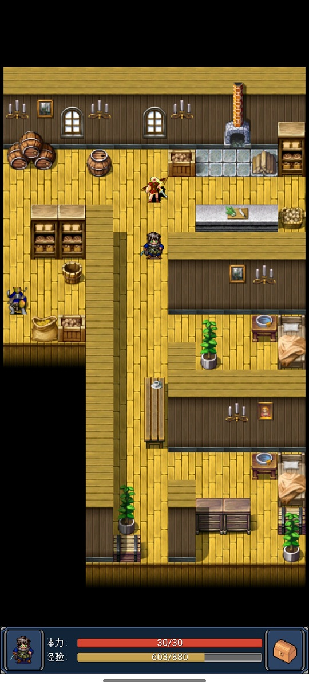
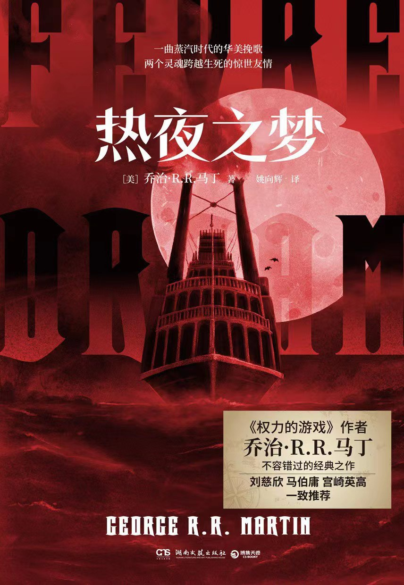
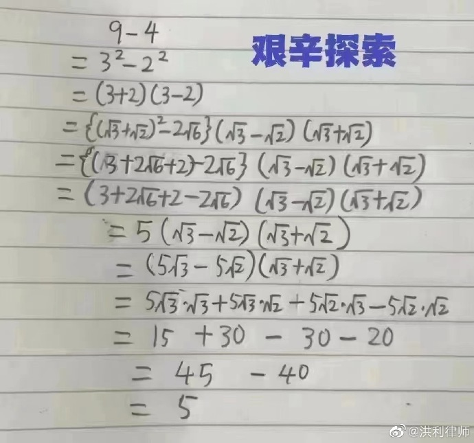
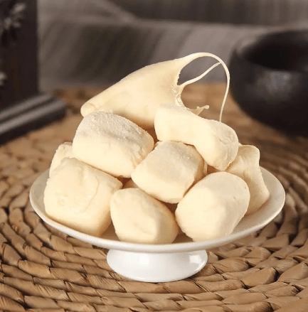

啰里啰唆周刊第41期：麻衣如雪一枝梅

# 科技日常

## 1. PGP 加解密完整教程

PGP（英语：Pretty Good Privacy，中文翻译“优良保密协议”）是一种加密程序，可为数据通信提供加密和身份验证。PGP 可用于对文本、电子邮件、文件、文件夹乃至整个磁盘分区进行签名、加密和解密，并提高电子邮件通信的安全性。

这篇文章写得比较详实，除了GPG的使用外，还详细讲了KeyServer的缺陷，以及发布公钥需要注意的事项。

[https://www.gd1214b.icu/post/7tTaVc1KX/](https://www.gd1214b.icu/post/7tTaVc1KX/)

## 2.LingQ-外语阅读与词汇记忆的沉浸体验

与墨墨、扇贝、不背这些 APP 所采用的纯抽认卡+间隔重复方法不同，LingQ 是在阅读过程中学习单词（基于[克拉申的语言习得假说](https://zh.wikipedia.org/wiki/%E5%8F%B2%E8%92%82%E8%8A%AC%C2%B7%E5%85%8B%E6%8B%89%E7%94%B3)） 

LingQ 的使用过程主要可以划分为：导入阅读材料 、在阅读中标记生词、 间隔重复生词。其支持导入网页、电子书、Word 文档、PDF文件进行阅读训练。

支持Android和IOS，以及浏览器插件。当然，此软件也有收费服务，年费会员每月9美元。

免费会员和收费会员的区别可以见此：[https://www.lingq.com/zh-cn/signup/](https://www.lingq.com/zh-cn/signup/)

也可以看看这个项目，FOSS软件：[https://github.com/tkrajina/10000sentences](https://github.com/tkrajina/10000sentences)

## 3.如何播放amr格式的文件-倾听故人的声音

amr是一种音频格式，通常来说不是很常见，但是一些手机自带的录音就是用的AMR格式（比如oppo系的2022年10月前的Color OS系统）,微信语音也是用的amr格式。amr格式的优点就是体积小，能做到1秒1K的体积。

缺点就是音质不佳，能播放的软件很少，常见的音频播放软件，比如PotPlayer，Window Media Player等通常都不支持。

amr格式播放需求好像比较小众，据我所知，不少是想听到故人或前/现/女/男友的语音，有了这个需求。

比如这种场景
> 奶奶八十多了，经常与我们微信互动交流，我觉得可以抽空记录下奶奶的话，也算是口述历史，可以供儿孙辈翻阅看下，从历史的角度来了解先辈他们对世界，对社会，对自己的看法。一定程度上也能反思下自己，自己的角色，自己的人生观，自己的价值观，乃至历史观。奶奶上过几年学，认字对于日常的文字交流基本无障碍，但怕奶奶累着，我建议奶奶还是用语音来交流。她给我发的语音，我想把它提取出来发至公众号文章，所以需要处理微信语音的存储格式，以及如何转换的工具使用。

但是，安卓手机上导出微信里后缀为amr的语音文件，在网上下载专门的amr播放器后，你也会发现是无法播放这些语音文件的。这是因为，安卓版微信（及手机QQ）的amr语音文件及iPhone手机（包括iPad）的aud文件内部格式并非amr格式及aud格式，而是silk格式文件。

> SILK v3编码是Skype向第三方开发人员和硬件制造商提供免版税认证(RF)的Silk宽带音频编码器，Skype后来将其开源。其encode和decode开发语言为C，便于移植到各类平台。
> silk的优势主要是压缩率高，可以将音频文件压缩到极其小，便于网络传输，这在实时通信服务中非常实用，可以有效降低带宽负载，减少延迟。

要播放这类amr后缀的文件，可以使用楼月微信语音播放器。地址：[https://www.louyue.com/weixinplayer.htm](https://www.louyue.com/weixinplayer.htm)
或者使用第三方工具转为MP3格式，[https://github.com/kn007/silk-v3-decoder/](https://github.com/kn007/silk-v3-decoder/)

参考：
1.[https://en.wikipedia.org/wiki/Skype_protocol](https://en.wikipedia.org/wiki/Skype_protocol)
2.[https://zhuanlan.zhihu.com/p/21783890](https://zhuanlan.zhihu.com/p/21783890)

## 4.谷歌发布 2022 年全球热搜榜：拼字游戏《Wordle》力压「世界杯」「iPhone 14」
12 月 7 日消息，据报道，谷歌 7 日公布了「2022 年全球热搜榜」。榜单结果显示，一款简单的英文拼字游戏《Wordle》高居榜首，成为了 2022 年搜索量最高的词汇，一举超越了「世界杯」和「iPhone 14」等热门搜索关键词。

《Wordle》是一款简单的英文拼字游戏，玩家需要用 6 次机会，猜出一组由五个字母组成的英文单词，如 world 和 realm 等。排在第二位的是一场体育赛事「印度 Vs 英格兰」（India vs England），即在印度和英格兰之间展开的一场板球比赛。

此外，已故的英国女王伊丽莎白（Queen Elizabeth）位于榜单的第四位，正在上演的「世界杯」（World Cup）赛事排名第六，而苹果手机「iPhone 14」位居第八。(来源：新浪科技）

## 5.PageCrypt-加密静态HTML
客户端页面没有秘密。但，仍然有一类需求，尽可能简单地保护静态页面，又不想了解复杂的加密知识。可以借助浏览器的SubtleCrypto来实现，使用简单，代码量少，浏览器兼容性好。此API使用加密算法加密HTML源码，即使在客户端拿到HTML源码也难于破解。

使用demo：[https://www.maxlaumeister.com/pagecrypt/](https://www.maxlaumeister.com/pagecrypt/)

限制：必须使用HTTPS协议或者是磁盘上html文件。

API文档：[https://developer.mozilla.org/en-US/docs/Web/API/SubtleCrypto](https://developer.mozilla.org/en-US/docs/Web/API/SubtleCrypto)

## 6.苹果 iCloud 备份将支持端对端加密 
苹果宣布从 iOS 16.2、iPadOS 16.2 和 macOS 13.1 开始，用户可选择启用“高级数据保护（Advanced Data Protection）” 功能，iCloud Backup、Photos、Notes 等都将使用端对端加密，这意味着如果你丢失了账号，苹果没有加密密钥帮助你恢复——用户需要通过设备密码、帐户恢复联系人或个人的恢复密钥去恢复账号。用户可以在任何时候关闭高级数据保护功能。
这一声明发布在英文版的支持文档上，中文版没有更新，暂时不清楚苹果是否向中国区用户提供该功能。官方宣称美国地区从今天开始公测，年底部署完，全球部署会在2023年完成，并相信中国地区也会有（原话：they don't told me）。

[https://support.apple.com/en-us/HT202303#advanced](https://support.apple.com/en-us/HT202303#advanced)
[https://support.apple.com/zh-cn/HT202303](https://support.apple.com/zh-cn/HT202303)

## 7.费米实验室和 CERN 选择 AlmaLinux
2020 年 Red Hat 决定停止将 CentOS Linux 作为独立发行版，改为推出滚动更新发行版 CentOS Stream，把它作为企业发行版 RHEL 的上游 beta 版本。社区立即推出了多个项目替代 CentOS，其中最为突出的是两个项目：Rocky Enterprise Software Foundation 赞助的 Rocky Linux；另一个是 AlmaLinux OS Foundation 的 AlmaLinux。

现在，著名的科学研究机构费米实验室和欧洲粒子物理研究所（CERN）发表联合声明，宣布将在其研究设施中采用 AlmaLinux。声明称，AlmaLinux 的优点包括每个大版本支持寿命长，支持扩展架构，快速的发布周期，上游社区贡献，支持 security advisory metadata，完美兼容 Red Hat Enterprise Linux 及其它重构版本。

个人建议也是AlmaLinux优于Rocky，AlmaLinux 响应速度更快，更新更早。 

https://news.fnal.gov/2022/12/fermilab-cern-recommendation-for-linux-distribution/ 

## 8.Andor's Trail-Roguelike RPG on Android
10年历史的FOSS游戏。无广告，支持中文，最新版本是2022年发布的0.8.3。
非常经典的RPG小游戏。
> Andor's Trail is a single-player quest-driven roguelike fantasy dungeon crawler RPG with a powerful story.
> Uncover the truths about your home village and the disappearance of your brother. Battle fierce monsters, gain experience and levels. Solve quests, find hidden treasures and improve your equipment.

[https://andorstrail.com/](https://andorstrail.com/)

## 9.小米发布小米13系列，3999元起售
12月11日晚间，小米发布了数字高端旗舰系列小米13系列、MIUI 14操作系统和5款AIoT产品。

被雷军称为“高端化战略三年答卷之作”，小米13系列主要是在处理器、影像电池管理等方面做了关键升级。

首先，小米13系列全系搭载了第二代骁龙8移动平台，这颗芯片的CPU多核性能提升了37%、GPU性能提升了42%。第一代骁龙8 芯片的功耗问题一直备受诟病，而这一问题在这一代得到了明显的改善。据介绍，第二代骁龙8性能在达到上一代峰值时，只产生原来一半的功耗。

小米13全系都搭载了75mm徕卡长焦镜头，但基础版本和Pro版本的差异是，小米13 Pro搭载了和小米12S Ultra同款的1英寸传感器主摄，在长焦上采用了单反级别的浮动镜组技术。

在电池管理方面，小米13系列全系列搭载了小米自研的澎湃电池管理系统，其中，小米13 Pro搭载了50W无线快充。

定价方面，小米13售价3999元起，小米13 Pro售价4999元起。

> 参数全面吊打，体验依然拉跨
> 广告UI，内置反诈

手机之外，这次小米发布会上还发布了几款IoT产品，其中比较值得关注的是小米首款桌面小主机。据介绍，这款产品是小米联合英特尔打造，机身只有0.444L，是传统15L主机的1/30，是目前市面上最小的桌面主机，售价为3699元。此外，小米Sound Pro 7音箱售价999元，小米Watch S2 定价999元起，小米万兆路由器定价1799元，小米Buds 4耳机定价699元。
# 读书与影视分享

## 1.2006年电影《芳香之旅》

上个世纪六十年代，情窦初开的少女春芬（张静初饰）在长途车上屡屡遇见一个让她心仪的男人刘奋斗（聂远饰），旅途因此变得美好。当两人终于在一个滂沱雨夜得以亲近彼此，命运却将这段可能修成正果的情愫戛然掐灭。
惶惑、落寞之下，春芬脸上青春的颜色黯淡了，但内心依然对情爱有着隐秘的憧憬。长途车在崇山峻岭间蜿蜒依旧，春芬的一颗女人心虽然怦怦跃动，但命运再次翻覆，她最后选择嫁给年长自己许多的师傅老崔（范伟饰）。
有了婚姻的春芬，身体却如花苞从未绽放，直到不能给她肌肤之亲的老崔去世，春芬才恍然明了，肉体上做不了男人的老崔，曾经穷其所能证明，在春芬面前，他精神上是个完完全全的男人。寂寥一生之后，春芬最后释然，每一个年代，每一段经历的情感，都无疑是令人感怀万千的“芳香之旅”

> 喜欢这个片里的张静初，坚强，隐忍。她的师傅和丈夫则是憨厚老实，――那个时代的人。影片讲了一个两个男人之间的女人的大半生故事，时代从她身边过去而她懵然不觉。退休后的她已落后于时代，而扫墓的举动则是对过去时代，对那时候的他与她，对曾经幸福美满生活的一次回望与复归。

## 2.《热夜之梦》

《权力的游戏》作者乔治·马丁作品。依托美国南北战争的历史背景，高度还原复杂真实的时代细节。

这是蒸汽时代的美国，雄心勃勃的船长和水手统治着密西西比河，在这条美国大动脉水道上竞相追逐，争夺金钱和荣誉--汽笛长鸣，白烟滚滚，鸣奏着高亢激越的交响曲。

一条华丽的新汽轮下水，交响曲中响起一个不谐和音--“菲佛之梦”，它一路飞奔，将这条大河上的所有快船抛到身后。但它追逐的不是第一快船的荣誉，而是鲜血，因为驱策它的是古老的血族吸血鬼。“菲佛之梦”一路行来，将密西西比搅成一条血河；而它自身，也渐渐变成一条血船。吸血鬼与人、吸血鬼之间，爱恨情仇，无不浸透在浓稠的血浆之中。

但是，从血泊中，诞生了最伟大的情感：友谊和希望。

> 时间之葬：开始时激情澎湃，落幕时哀婉悲伤。这个吸血鬼的故事被安设在内战爆发前的美国南方，简直是一个最贴切的寓言，以种族之名进行的奴役，在漫长的岁月中竟然仿佛天经地义的自然法则。约克的理想与马什的勇气，就像巨大黑暗中的两束耀眼光芒。对最后的收尾稍有不满，那场等待了十三年之久的复仇，实在有悖于约克那洞察事物本质的睿智，和马什不可抑制的冲动。但换一个角度看，也许马丁想说的是，人类注定被嗜血的兽性控制，历史或许也终究只是一个血腥的轮回

> 以吸血鬼为题材的小说居然能写的如此热血，前半部分生动的活力和激情几乎要溢出来，而引入反派后，作者又创造出了暗黑绝望的氛围，靠气氛塑造和扎实的文字功底，而非悬念游戏引人入胜。这部作品和夜晚的河流一样，美丽神秘，处处充满了梦想与荣耀，历史感和暖暖的跨种族情谊扑面而来，常让人激动不已。

# 图论

## 1.charge && do not

The Introverted Attorney is an anxious,  overly caffeinated, and sleep-deprived lawyer with perpetual eye bags  who works among colleagues possessing strangely shaped heads. In spite  of this, just like most disillusioned working and breathing  professionals, he does not find himself well upon receiving emails that  open with, "I hope this message finds you well."

These comics and silly short animations are an attempt to both lighten up and also validate the hopeless feelings that occasionally arise from the  soul-sucking nature of the daily grind.

More info: [theintrovertedattorney.com](https://theintrovertedattorney.com/) | [Instagram](https://instagram.com/theintrovertedattorney) | [tiktok.com](https://tiktok.com/@theintrovertedattorney) | [youtube.com](https://www.youtube.com/@theintrovertedattorney)

## 2.来自Midjourney的AI艺术画廊

图片来自Midjourney官方Facebook页面，由用户Matt Panfil生成。

midjourney的介绍和使用说明可参考谷歌。使用Midjourney测试版唯一需要的是一个Discord账户可以在Discord的网站上注册一个免费账户，之后即可就去Midjourney网站(midjourney.com)，选择 "加入测试"。

ref:[https://boingboing.net/2022/12/03/galleries-of-ai-art-from-midjourney.html](https://boingboing.net/2022/12/03/galleries-of-ai-art-from-midjourney.html)

## 3.艰辛探索

# 谈天说地

## 1.meme

meme读成(/miːm/)。meme可以是一个故意拼写错误的单词，一句话、一张图片、一段视频、甚至是一个行为。一般都是基于某个流行因素，加以复制、改造、转播并跟风。meme作为名词也指某种梗图、表情包。

音译就是“迷因”、“模因”。。。百度翻译使用的就是音译“迷因”。有人把它翻译成“梗”或者表情包。

谷歌对该单词的英文解释：

“an element of a culture or system of behavior that may be considered to be passed from one individual
to another by nongenetic means, especially imitation.”

“一种文化或行为系统的要素，可以通过非遗传手段（尤其是模仿行为）在人群之间传播。”

这个词是在1976年，由理查·道金斯在《自私的基因》一书中所创造，将文化传承的过程，类比成做生物学中的演化繁殖规则（有共同先祖、随著环境改变进化、优胜劣汰等等）。词语本身来自于古希腊语mīmēma（μίμημα，发音：/ mí:mɛ:ma/ ），意思是“模仿的东西”。meme是承载文化思想、符号或实践的一个包含甚广的单位，可以通过包括但不限于宗教、谣言、演讲、手势、新闻、知识、观念、习惯、习俗甚至口号、谚语、用语、写作、用字、网路爆红事物等仪式或其他具有模仿主题的可模仿现象从一个头脑传递到另一个头脑，近似于学习。这个概念的支持者认为meme是基因的文化类比物，因为meme可以自我复制、变异并对选择压力做出反应。

不过老外的迷因真是难以领悟。

[https://www.vogue.com/article/best-memes-of-2022](https://www.vogue.com/article/best-memes-of-2022)

## 2.麻衣如雪一枝梅

麻衣如雪一枝梅，笑掩微妆入梦来。
若到越溪逢越女，红莲池里白莲开。

出自唐代武元衡的《赠道者》，武元衡是当时西川节度使后任宰相，通诗文，有美男子之誉。元和十年（815年），武元衡被藩镇平卢节度使李师道派遣的刺客刺杀身亡。

麻衣如雪，语出《诗经·曹风·蜉蝣》，此处借用来描绘女子一身如雪的白衣。这么漂亮的道者，显然不是普通的尼姑，此诗是武元衡写给唐朝四大女诗人之一的薛涛。薛涛本是官家小姐，后随父亲贬官到四川，14岁时父亲病亡，为了维持自己和病床上母亲的生计，无奈加入乐籍，成了一名官妓。薛涛42岁时，遇到31岁的元稹，两人相处不过三月即分开。元稹为了仕途变心后，薛涛从此脱下了极其喜爱的红裙，换上了道袍，离开了熙熙攘攘的浣花溪，移居到成都郊外，在那里安静度日。一名风尘奇女子，一生去爱，一生被辜负，很少被尊重，后来曾经做过宰相的段文昌，在给薛涛的墓上，落款的是女校书。

至于薛涛和武元衡的关系，一般认为他和薛涛之间的感情更多是友情和敬重。

## 3.A Brief History of Schadenfreude 英语中“幸灾乐祸”一词的来历

The Japanese have a saying: “The misfortunes of others taste like honey.” The French speak of joie maligne, a diabolical delight in other people’s suffering. The Danish talk of skadefryd, and the Dutch of leedvermaak. In Hebrew enjoying other people’s catastrophes is simcha la‑ed, in Mandarin xìng‑zāi‑lè‑huò, in Serbo-Croat it is zlùradōst and in Russian zloradstvo. More than 2,000 years ago, Romans spoke of malevolentia. Earlier still, the Greeks described epichairekakia (literally epi, over, chairo, rejoice, kakia, disgrace). “To see others suffer does one good,” wrote the philosopher Friedrich Nietzsche. “To make others suffer even more so. This is a hard saying, but a mighty, human, all-too-human principle.”

Make no mistake. Over time, and in many different places, when it comes to making ourselves happy, we humans have long relied on the humiliations and failures of other people.

There has never really been a word for these grubby delights in English. In the 1500s, someone attempted to introduce “epicaricacy” from the ancient Greek, but it didn’t catch on. In 1640, the philosopher Thomas Hobbes wrote a list of human passions, and concluded it with a handful of obscure feelings which “want names.” “From what passion proceedeth it,” he asked, “that men take pleasure to behold from the shore the danger of them that are at sea in a tempest?” What strange combination of joy and pity, he wrote, makes people “content to be spectators of the misery of their friends”? Hobbes’s mysterious and terrible passion remained without a name, in the English language at least. In 1926, a journalist in The Spectator asserted that “there is no English word for Schadenfreude because there is no such feeling here.” He was wrong, of course.

https://lithub.com/not-just-a-german-word-a-brief-history-of-schadenfreude

## 4.麦芽糖的故事
蜂蜜和蔗糖是两种最经典的甜味来源，不过蜂蜜历来是又少又贵，中国大部分地区不适合种甘蔗，甜菜也主要分布在东北地区。

但是中国人并不难吃到一口甜的。获得甜味的方法其实有很多种，有一种糖，它到今天仍然日常，它不是来自蜂蜜、甘蔗或甜菜这些经典糖源，也不是来自糖枫树，桦树、龙舌兰这类小众糖源，它来自我们最日常的粮食，它的身世古老，且美味可口，至今仍在各地传统美食中扮演着重要的角色，它就是麦芽糖。

麦芽糖在古代叫做饴[yí]糖，是一种来源于淀粉的糖。

我们在咀嚼粮食的时候能感受到甜味，那是因为唾液中的酶促使淀粉转化为糖。而生产这种糖的过程，利用了相同的原理，只不过催化剂改成了麦芽。

麦芽糖是利用麦类在发芽的过程中所产生的糖酵化酶水解淀粉而成。一般是将大米、糯米、小米、黍米、高粱、玉米等煮熟，再用大麦发芽后产生的一种麦芽酶混合反应而得。

北魏农书《齐民要术》引用了前人《食经》中的做法：“取黍米一石，炊作黍，着盆中。蘖末一斗，搅和。一宿则得一斛五斗，煎成饴。”就是说，将一石黍米，煮成饭放在盆里，加上一斗麦芽末，搅匀。过一夜便得到一斛五斗的溶液，把这些溶液小火烧煮浓缩就得到饴糖。

制作方法图解参考：[https://home.meishichina.com/recipe-241775.html](https://home.meishichina.com/recipe-241775.html)

> 1.将小麦种子泡到种子完全吸收水分,随后撒在渗水的容器上,放到阴凉处自然通风，每一天喷三四次水,麦芽长到一寸左右，大概3到4厘米，还没有出现真叶，就行了。时长大概是4到7天
> 2.两斤糯米清洗干干净净，放进电饭煲内，像平常煮饭似的做熟。水还可以多加一点儿，把糯米煮的稍微软一点儿，可以掺杂些碎玉米。
> 3.做熟后，拿出摊开制冷至60度左右，摸着略微有点儿发烫就还可以。弄碎的麦芽掺到煮熟的糯米饭里，保温发酵功能发5个小时。
> 4.轻按糯米，上边出现许多水分就行了,用纱布挤出来糯米麦芽中的水分,把挤出的水分倒进锅中.
> 5.开大火熬。

麦芽糖有软、硬之分，软的是黄褐色粘稠液体，称饴；硬的是饴糖经过滤提纯，除去渣滓，混入空气后凝固而成，是多孔的黄白色糖块，叫做饧[xíng]。饧是古糖字，古音唐。宋初《寒食》诗“箫声吹暖卖餳天”，卖的正是麦芽糖。

很多地方也把这种白色硬糖块直接叫做“白糖”（其实就是白饧的古读音），和“白砂糖”是两个东西，白砂糖主要来自甘蔗和甜菜。据我所知，白糖这种制作方法在中原（河南，陕西）和云贵赣鄂地区比较流行。

麦芽糖和蔗糖不同，它们都是双糖，但是分子构成不一样。麦芽糖的甜味比蔗糖弱，大约只有蔗糖甜度的一半不到。但是，麦芽糖能从最普通的粮食中获得，所以最便宜最易得。所以麦芽糖在民间流传度最广，也较早。糖人，龙须酥，花生糖等都是基于麦芽糖制作的。

注：甘蔗种植起始于春秋战国时代，从古印度传入。

再提下，有人说西瓜很甜，为什么不用西瓜做糖。主要原因是西瓜的糖主要是果糖和葡萄糖，不稳定，而且含糖量较低。水果的甜度和糖含量不是简单比例关系，除去主观因素和个体差异外（女性的甜度敏感区间比同龄男性要大），和糖酸比也有关。

虽然都是糖，但葡萄糖、果糖和蔗糖的甜度是有较大差别的。
一般以蔗糖的甜度作为1.0
果糖的甜度为1.75~1.8
葡萄糖的甜度为0.7~0.75
麦芽糖的甜度约为0.4~0.46

因此，当一种水果中所含的糖组分比例不同（也就是葡萄糖、果糖、蔗糖所占的百分比不同），这种水果的甜度值就会不同。但是，这还不是决定这种水果“甜不甜、有多甜”的最终结局。虽然可溶性糖的含量和比例对甜味的影响最大，但有机酸在“甜味制造”里也是“股东”、有发言权和决策权的。
当糖酸比＜20，风味淡或趋酸
当糖酸比在20—60之间，风味酸甜适度
当糖酸比＞60，甜味增强

西瓜之所以口感美好、口味清甜，就是因为它所含的可溶性糖里，果糖的比例非常高，同时西瓜有机酸含量低。事实上，西瓜的总含糖量，在水果大军里算低的（多汁少糖）。而与它形成鲜明对比的，是火龙果，吃着没多甜，含糖量和热量却都不低。

ref:
[说说糖的历史：历经千年的甜蜜 ](https://www.sohu.com/a/462988427_717847)
[https://www.cn-healthcare.com/articlewm/20210712/content-1242190.html](https://www.cn-healthcare.com/articlewm/20210712/content-1242190.html)

## 5.中药与西药
这个破事竟然还有人不知道，北京科技报2010年曾经写了一篇文章，采访了当时我国著名的药物不良反应专家、海军总医院原药剂科主任孙忠实，标题叫《中成药违规添加西药成分 药监部门提醒防中毒》，你们去搜下肯定还能搜的到。
我摘一下这个新闻稿里的一些亮点：
1、有些中药添加西药成分的手段非常隐秘，不法分子了解到常规药检只检查药品的内容物，就将西药成分添加到胶囊壳等药品外部载体中；
2、目前中成药中添加西药成分的现象非常普遍，2010年4月2日，国家食品药品监督管理局网站上公布了44种违规添加化学成分的中成药名单；
3、记者查阅《新编国家中成药》收录的5000多种中成药中，至少有160余种含有西药成分，主要集中在抗感冒药、止咳平喘药、胃肠类药等三大类药物中。所含西药主要有扑尔敏、对乙酰氨基酚、麻黄碱、苯海拉明、维生素C等；此外，大多数中药复方感冒药中都含有咖啡碱等兴奋剂类成分；
4、私自在中药里加入西药成分，最大的害处在于对患者的欺骗性和危险性大。西药的成分明确，服用时有严格的剂量限制，说明书注明常见不良反应和注意事项；而中药大多来源于天然植物、动物、矿物等，成分复杂，患者通常不按剂量服用。往中药里加入西药成分，患者不知情很可能会因超量服用造成药物中毒；
5、对于非法添加西药成分的中成药，虽然国家有关部门已经明令是“假药”，但孙忠实认为这种问题仍然相当普遍。其中壮阳、降血糖、降血脂、抗癫痫、高血压是中成药违规添加西药成分的“重灾区”；“中药在这五类疾病治疗过程中只能起到辅助作用，可以毫不夸张地说，如果没有违规添加的西药成分，这类中成药根本没有任何作用。”孙忠实说；
6、1985年以后，国家药品审批整顿，含有西药成分的中成药要由国家药监局来审批，俗称“国标”。在“地标”转“国标”的时候，已经把一批质量、效果不好的含有西药成分的中成药淘汰了，尽管如此，仍有相当数量的中成药，没有经过严格的再评价。那时出于保护药厂利益的考虑，几千人的药厂如果取消批号，就意味着职工下岗、失业，为了照顾地方和药厂的利益，对一些不该通过的含西药成分的中成药批号，放宽了审批的口子。
这也是一个老的历史遗留问题了。

ref:
[https://weibo.com/feng850522](https://weibo.com/feng850522)
[https://www.163.com/news/article/64N6PLQ6000125LI.html](https://www.163.com/news/article/64N6PLQ6000125LI.html)
# 一句话快讯

1.美国《时代》杂志星期三（12月7日）宣布，乌克兰总统泽连斯基被评为今年度风云人物，并表扬泽连斯基为抵抗俄罗斯入侵所展现的勇气，不仅激励了乌克兰人，也赢得全球赞誉。 该杂志其他几个奖项包括：2022年度标志人物—马来西亚华人女演员杨紫琼；2022年度艺人—韩国女子组合Black Pink；2022年度英雄-伊朗女性；2022年度运动员-美国棒球运动员亚伦·贾吉。 

2.台积电创始人张忠谋认为全球化和自由贸易几乎已死。他在周二出席了台积电亚利桑那州凤凰城工厂的活动，张忠谋称，半导体行业过去27年见证了世界的巨大转变和世界地缘政治格局的巨大转变。全球化和自由贸易几乎已死，而且不太可能会回来。

3.12月13日0时起，信通院正式下线“通信行程卡”服务。“通信行程卡”短信、网页、微信小程序、支付宝小程序、 APP等查询渠道将同步下线。

4.12 月 7 日，塔利班邀请观众观看法拉省的公开处决和用石头砸死一名“妇女”。
# 联系方式

啰里啰唆是一份针对互联网和生活爱好者的数字杂志，旨在发现和分享一切有趣的东西。话题不固定，每期大约十五分钟阅读量，暂定每周四发布。部分内容来自互联网采编，如果为有来源的转载，均会注明转载地址或保留水印。

这是一个关注人文和科技的newsletter。

使用方法建议或素材提供

频道：notonlyshare

邮箱：auokyob@outlook.com

github地址：[https://github.com/iminto/luoliluosuo-weekly](https://github.com/iminto/luoliluosuo-weekly)