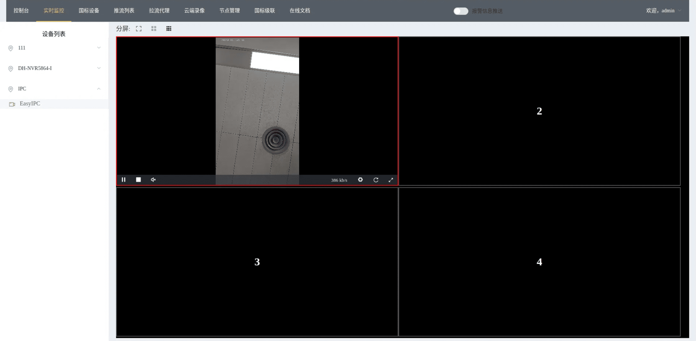
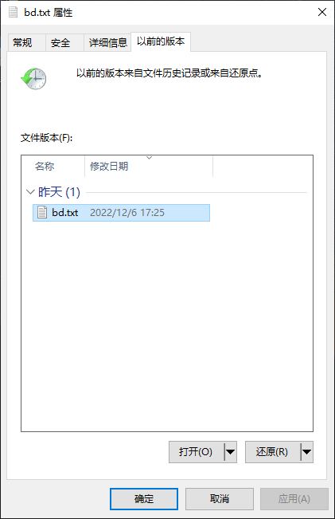
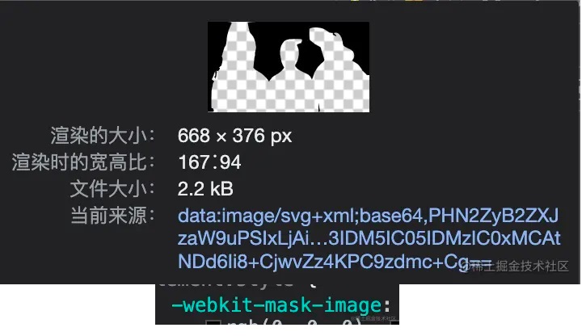
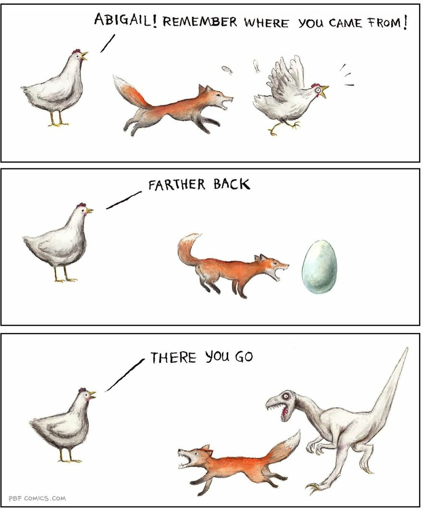
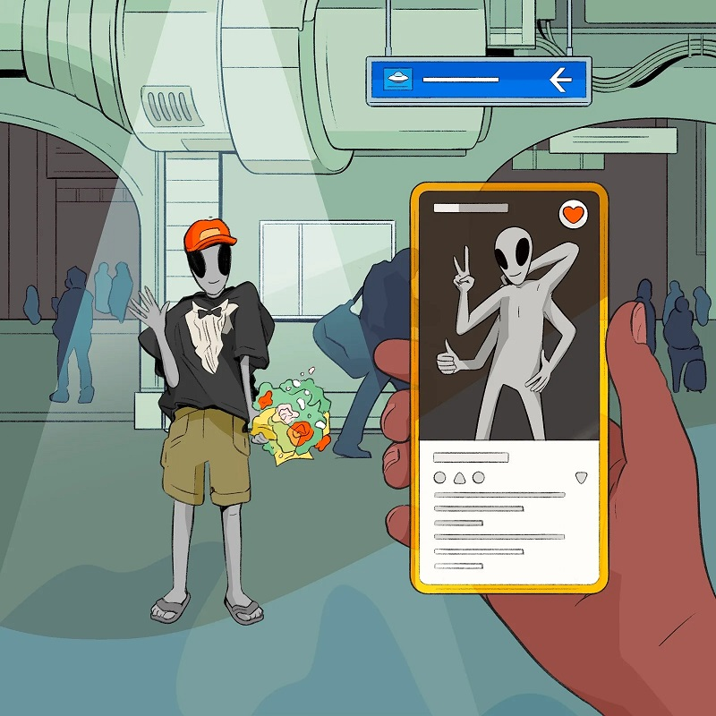

啰里啰唆周刊第42期：神走了，不会再来了

# 科技日常

## 1.wvp-GB28181-pro-开箱即用的网络视频平台

开箱即用的网络视频平台。基于 GB28181 标准实现的网络视频平台，能够接入摄像机、平台、NVR 等设备、支持视频预览、云台控制、录像查询和回放、无人观看自动断流等功能。



https://github.com/648540858/wvp-GB28181-pro

## 2.Windows自带的快照功能

Windows 系统是自带快照功能的，并且是基于文件系统的快照，还可以通过系统自带的文件历史还原。
Windows 称之为 Volume Shadow Copy (VSS),俗称“卷影复制”，基于NTFS文件系统实现。

新建快照演示：
先在E盘新建一个文件，然后开启快照。

```bash
#需要使用管理员权限打开命令行窗口
>wmic shadowcopy call create Volume=E:\
执行(Win32_ShadowCopy)->create()
方法执行成功。
外参数:
instance of __PARAMETERS
{
        ReturnValue = 0;
        ShadowID = "{4D196F30-1874-4B71-9C64-B89BADC8E71A}";
};
```

编辑并保存该文件，在文件管理器打开这个文件的属性，可以打开和恢复到之前的版本。

删除快照则使用vssadmin命令，该命令可以查看和删除快照,使用方法可查看帮助手册。

```bash
vssadmin  delete shadows /for=E:
```

注：
1.Windows 的快照是通过 Copy On Write 实现的，对性能有一定影响。
2.开启还原点功能会导致老的快照更快的被删除，因为快照占用的空间是有限的，而还原点会占用大量的快照空间，快照空间不足就会删除旧的快照。
3.**快照不等同于文件历史记录**，不是每次编辑都会有一个历史版本，它是快照，不是文件版本控制器，不要当成git使用。只有每打一次快照，才有一次文件历史记录。
4.卷影复制是针对整个盘的，临时文件会被自动忽略，有限支持排除指定文件功能。

如果要浏览以前的快照可以用这个软件
[https://www.nirsoft.net/utils/shadow_copy_view.html](https://www.nirsoft.net/utils/shadow_copy_view.html)

ref:
[https://docs.microsoft.com/en-us/windows-server/storage/file-server/volume-shadow-copy-service](https://docs.microsoft.com/en-us/windows-server/storage/file-server/volume-shadow-copy-service)
[https://docs.microsoft.com/zh-cn/windows/win32/vss/volume-shadow-copy-service-portal](https://docs.microsoft.com/zh-cn/windows/win32/vss/volume-shadow-copy-service-portal)

## 3.为什么B站的弹幕可以不挡人物

高端的效果，往往只需要采用最朴素的实现方式。

一句话总结，就是用css的一个属性-webkit-mask-image加一张人物的透明图片就直接搞定了。

这张图片从哪里来？如果一帧一帧的从后端获取，那么服务器的压力一定非常大，这个功能又是一个很小的功能，服务端处理可能不是一个最佳的解决方案，下面我就要讲如何不依赖后端在客户端上实现一个这样的功能。

通过观察图片我们知道，只要在视频播放的时候把人物的轮廓填充透明其他地方填充颜色即可，实现这样的一个功能我们就需要引入tensorflowjs，使用官方训练好的人体分割（Body Segmentation）模型，在视频播放时将每一帧生成一直图片，放到弹幕的父元素上。

[https://juejin.cn/post/7141012605535010823](https://juejin.cn/post/7141012605535010823)
[https://juejin.cn/post/7157955440549036069](https://juejin.cn/post/7157955440549036069)

## 4.Apache NetBeans 16 发布

Apache NetBeans 是顶级的 Apache 项目，是一个开源的开发环境、工具平台和应用框架，可以满足开发者、用户和依靠 NetBeans 作为产品基础的企业的需求，使他们能够快速、有效、轻松地开发产品。NetBeans于2022年11月底发布了16版本。

支持Java/Java EE/PHP/C++/Web前端等语言开发。NetBeans的版本发布曾经采用的是每个语言开发环境都有一套独立的打包程序和安装包产物（当然也支持下载一个大而全的全功能安装包），现在统一均使用同一个安装包+插件实现，减少了下载多个IDE的困扰。

10多年没用了，曾经是我用过的第一款真正意义上的IDE，早期用来做PHP开发。

[https://netbeans.apache.org/](https://netbeans.apache.org/)

## 5.《矮人要塞》开发者现在都是百万富翁了

在免费发布《矮人要塞》二十年后，开发者 Tarn Adams 和 Zach Adams 兄弟有了新的身份：百万富翁。《矮人要塞》的图像升级版于 12 月 6 日发布，售价 30 美元，不同地区的价格略有差异，中国区为 108 元。在发布第一天它就售出了 16 万份拷贝，一周之后达到 30 万份，收入接近 900 万美元，Valve 要拿走 30% 的分成，Adams 兄弟和参与图像升级版的几位开发者还有 600 万美元可分，即便考虑到地区价格差异，Adams 兄弟应该都是百万富翁了。
Tarn Adams 说他在这个项目上工作了 20 年，所以除以 20 的话这个收入差不多落在正常的科技业工作者的薪水范围内，当然仍然很高。Zach 开玩笑的说，我们找到了一种省钱的万无一失的方法：20 年不出售任何东西，然后把东西扔出去。对于这笔百万美元巨款，Zach 表示他的妻子计划买新房，现在住的房子太小。Tarn 则表示他需要时间思考这一切。 

ref:
[https://www.pcgamer.com/after-spending-20-years-simulating-reality-the-dwarf-fortress-devs-have-to-get-used-to-a-new-one-being-millionaires/](https://www.pcgamer.com/after-spending-20-years-simulating-reality-the-dwarf-fortress-devs-have-to-get-used-to-a-new-one-being-millionaires/)

矮人要塞：
[https://www.dwarffortresswiki.org/](https://www.dwarffortresswiki.org/)

# 读书与影视分享

## 1.2010年古装武侠片《剑雨》

八百年前，天竺人罗摩来至中原弘法，其死后尸体被人盗取并分为两部分。传说拿到罗摩尸体的人能练成绝世武功，因此江湖上风波骤起。时有转轮王操控的黑石杀手集团，专为朝廷杀害谋逆相左之人。转轮王率徒众夜袭藏匿半具达摩尸首的首辅张海端宅邸，但是他的手下细雨却带着残尸绝走江湖，致令转轮王发出江湖追杀令，引出一阵血雨腥风。
为避追杀，细雨易容，更名曾静，逃亡期间结识了木讷善良的江阿生。一段时间相处，二人渐渐萌生感情，更喜结连理。但是江湖恩怨，因蔓不断，怎可轻易了结……


> 《卧虎藏龙》之后最好的武侠片。另外，片尾字幕是“吴宇森作品”，“苏照彬电影”。无论如何，苏照彬都成功地在这部电影中留下了属于自己的痕迹。 

> 《剑雨》这部片子混杂了台湾武侠传统的一点文人气、台湾新新人类的一点恶趣味、卡通文化的一点冷幽默和玄幻小说的一点诡秘氛围，却难得地没有成为一锅大杂烩。各种源头的文化脉络互相支撑、水乳交融，撑起了一部好玩好看、与时俱进的武侠片。走出影院后回味再三，心想称其为“武侠电影的后现代”，大约是可以的吧？

## 2.克莉丝汀·汉娜(Kristin Hannah)作品《萤火虫小巷》

《萤火虫小巷》这是一部关于爱、成长与忠诚的小说。作者以美国跨越30年的风俗画卷为背景，以真实历史人物和事件贯穿，讲述一对闺密从少女时期相识相知到相伴，以她们之间超越生死、跨越时间的友情和爱，让这部小说不仅故事生动，语言幽默，而且有历史的厚重感，深具情怀。

克莉丝汀·汉娜(Kristin Hannah)，1960年9月出生于南加州，在海边堆沙堡和玩冲浪长大。登上《纽约时报》等各大畅销书排行榜的一线作家，代表作《萤火虫小巷》畅销30多个国家，感动数亿人！书评人称赞其为“一本描写女性友谊罕见的史诗！”“一部触动灵魂、改变女性一生的佳作”！

塔莉，美丽聪明，却行为叛逆，总是人们目光的焦点，但没有人知道，她一直活在被母亲抛弃的阴影中，更害怕一直照顾她的外婆撒手人寰，让她彻底孤单。她渴望归属感、渴望有人能无条件爱她。
凯蒂，一个看起来中规中矩的乖乖女，有着幸福温馨的家庭，性格温顺可爱，只是乖巧的外表之下，也充斥着无法消解的束缚感，偶尔渴望挣脱。
14岁那年，两个完全不同的女孩，在没有萤火虫的“萤火虫小巷”温暖相遇，从此人生有了巨大转变。
凯蒂将真正的“爱”带给了塔莉，让她开始懂得付出，了解“家”是什么感觉；而塔莉丰富了凯蒂的人生，让她看到了生命的各种精彩。

> 作者简直是个写作兼说故事的高手，永远有办法让读者与角色们融为一体。萤火虫小巷里没有萤火虫，只有闪亮亮的梦想，还有我们疯狂、笑泪交织却比星星永恒的友情。

## 3.IMDb公布2022年热门电影和电视剧

知名电影网站IMDb（互联网电影资料库，Internet Movie Database，简称IMDb）是一个提供全球电影信息的网站。近日，IMDb公布了2022年的热门电影和电视剧名单。《怪奇物语》《龙之家族》《风骚律师》位列电视剧前三，《新蝙蝠侠》《奇异博士2: 失控多元宇宙》《雷神4：爱与雷霆》位列电影前三。

[https://www.imdb.com/best-of/?ref_=nv_ev_csegbest](https://www.imdb.com/best-of/?ref_=nv_ev_csegbest)

## 4.电影版《想见你》发布了首支预告

2019年11月17日，由黄天仁执导，柯佳嬿、许光汉、施柏宇等主演的《想见你》在中视首播，进行了一波原始的口碑传播积累，12月22日上线腾讯、爱奇艺等平台，一时之间穿越神曲《Last Dance》响彻两岸三地，李子维新晋为偶像剧模范男主。

剧版开播三周年之际，电影版《想见你》发布了首支预告，近日再次释出黄雨萱、陈韵如和莫俊杰的角色预告，引发了众多剧粉的期待。 

# 图论

## 1.Miss



Syracuse University student newspaper The Daily Orange, now known by the name of Perry Bible Fellowship, has been making comics for over 20 years now. The twists and turns in these short cartoon stories have been recognized by many comics award committees, such as Ignatz Awards, Web Cartoonist’s Choice Award (WCCA), Harvey Awards, and Eisner Awards.

Nicholas Gurewitch, the creator of PBF, draws in various styles, which is why it can be a bit difficult to connect all the comic strips to one artist, and I am pretty sure you have seen one or more of his comics somewhere before but could not pin them together. The use of different styles keeps things interesting and allows for Nicholas to branch out.
More info: [Instagram](https://www.instagram.com/pbf_comics/) | [pbfcomics.com](https://pbfcomics.com/)

## 2.纽扣


# 谈天说地

## 1.Six-Word Sci-Fi: Stories Written by You

用六个词讲一个故事。下面是节选的一部分，每个问题都有一个最佳答案和几个荣誉奖，下面是节选

A:A Story About an Animal That Hasn‘t Been Discovered Yet
Q:STRANGELY, IT WANTED TO BE CAPTURED.

A:A Story About Living Forever
Q:“SOMETHING NEW FOR DINNER?” SHE LAUGHED.

A:A Story About Tackling Climate Change
B:DUST SPRINKLED FROM PLANES ACTUALLY WORKED.

A:A Story About an Evil Twin
B:BUT I WAS AN ONLY CHILD.

A:A Story About Digital-Age Autocrats
B:BIG BROTHER, TEAR DOWN THIS FIREWALL!

> **Honorable Mentions:**
> 
> Break up the digital data thieves. —Frank D. Monaco, via Facebook
> Digital Guy Fawkes to the rescue! —Kevin Jerome Hinders, via Facebook
> Encryption is poison to a dictator. —Marko Berg, via Facebook
> Plug exhaust pipe with a potato. —@blume_lee, via Twitter
> New feature announcement: “Like” to impeach. —@mina_sonbol, via Instagram
> Use ad blockers. Pay for news. —@dechendolker, via Instagram
> Print Marshall McLuhan quotes on T-shirts. —@antigraviter, via Instagram
> Turn social media into socialism media. —@benzilla_360, via Instagram
> Get behind me, technocrats. Game over. —Anastasia Hunter, via Facebook

A：A Story in Six Emoji

Q：🚀🪐🧑❤️👽🥂

> Honorable Mentions:

> 🏔🏃‍♀️🏃🏻‍♂️🏃🏽‍♀️🦑🛸 —@jessbeckah42, via Instagram
> 
> 💰🏹🦄💋🐸🤴 —@lgvpart, via Instagram
> 
> 👽🤮🦠☠️🌎🏆 —Ché Graham, via email
> 
> 👁🤜🧜‍♂️🌊🔱😵 —@cmayc414, via Instagram
> 
> 💎🏃👮🚗🚔💥 —@aotrivera, via Instagram
> 
> 🦕🌎☄️🐒🤡🤖 —@marcia_storyteller, via Instagram
> 
> 🦈🏊⛱️⚠️🛥️🌠 —@PatCattigan, via Twitter
> 
> 🚀👨‍🚀👽👩‍🔬🎖🍾 —@nadia.bkb, via Instagram
> 
> 🌪🐦❓✨🌬🌺 —@cva.maria, via Instagram

[https://www.wired.com/story/six-word-sci-fi/](https://www.wired.com/story/six-word-sci-fi/)

## 2.讼疫

明清两代瘟疫多发，汗牛充栋的笔记小说中，关于瘟疫的灵异故事也很多，《萤窗异草》中的这个故事，人与鬼的交易，甚吓人。

《讼疫》

富平刘某，素健讼。其刀笔之能，历干守令，咸莫能屈。某年，关中大疫，死者莫数，其父叔亦以疫卒。刘大恚，投词于城隍，备诋疫鬼之暴。凡数百言，词语激切。一日，梦城隍召之去，当庭责问，色似甚怒，曰：“天灾流行，实亦人所自致，汝何喋喋如此？况瘟疫掌之明神，其权操于上帝，予且不能左右于其间，草莽小民，竟敢以狂言相怼耶？”刘即抗声而对曰：“然！言者诚为有罪，但人生寿夭有命，岂于疫而独无命耶？若有命在，何死者命皆当夭，夭者偏皆遇疫？如云无命，又何以有造生造死之说？岂先造疫，而后造命乎？抑不必造命，而独造疫乎？是不可解，因以兴讼，惟神有以教之。”城隍似无以答，徐曰：“此皆强词，予不屑与汝辩。可逮之往见疫神，以正其狂吠之罪。”刘亦不惧。有鬼以巨练絷其项，即毅然从之行。微闻城隍叹曰：“倔强哉，丈夫也。”

乃未及出祠，忽见愁云惨雾中，有青衣童，状貌丑恶，持牒自空中而下。谓刘曰：“疫神以汝论似亦近理。部下诸鬼，止知行疫，而传染者或失轻重，未免滥及无辜。已命瘟疫大使，复加检查矣。”言讫以牒示城隍，命鬼褫其练，纵之自归。刘心窃以为得计，欣欣出门，莫识来路。方贸然前行，俄有同里数人，联袖而来，面容大有喜色。揖刘而谢曰：“赖君片言，吾曹皆免鬼录，将何以酬？”盖俱一二日中物化者。刘亦以失路告之，众乃导以同归。甫行半里许，突遭厉鬼三四辈，虬筋鹘目，吼声如恶盋。见刘皆甚怒，相属争以巨爪攫拿。众遂如鸟兽散，刘独坦然揖之曰：“公等即疫鬼耶？吾父死于是，吾叔死于是，与某而将三矣。所以忘死而与公等讼者，诚以好生者天，正直者神，公等奉行不善，罪且莫逭。予纵死亦不为公等屈。”鬼闻之，相顾愕然，其威顿霁。刘因曰：“公等奔波亦良苦，且时致人怨，莫能血食。诚舍予，则鸡犬之祀亦易易事。当死者固不能生，可生者亦听其祷，不亦一举而兼善乎？”鬼乃大悦，重致不安，反与之订约而别。刘归至里门，俄亦顿寤。使人视某，某则已就饭含，旋得更生。刘遂神其事，每至病疫之家，辄先与鬼谋。凡命之不当绝者，即令椎牲致祭，疾果寻愈。其当绝者，亦预以告之，人因诚信而弗违。阅五年，春疫复行。刘固无恙，忽见鬼来告之曰：“子之名已列疫牍，忝在爱厚，敬以相闻。可预嘱后事，殁后与我辈伍，亦不忧岑寂也。”刘如其言，旬日果疾，但头目发热而已。家人强投以药，竟不获瘳。而卒死之后，里人祀为疫仙，迄今犹祈禳不绝。

外史氏曰：甚矣哉，利口之足畏也。既以理争于神，复以利诱其鬼，而疫之权衡，遂宛然在其掌握。虽然，当天厉之时，良亦有血气衰薄，因而致死，不尽为天灾所中者。故其事似近无稽，而其言不无可采。况稗史所载，有疫入瓮中等事，则知疫之权固在神，而行疫者实鬼为之，犹可取之以相证也。

## 3.英史漫谈02｜与马凌聊革命浪潮中的英国与美国

光荣革命后的英格兰历经思想和工业改革，议会取代君王带来权力分割和自由萌芽，工业技术发展为英格兰带来硝烟和辉煌，一直到美国独立战争时期，“革命”二字贯穿英格兰历史。革命是如何起源的？除了公共领域的变化和政治党派的形成，还有哪些领域的革命正在同步发生？英国如何看待美国的独立战争？请听马凌的精彩讲述！

博客地址：[https://justpodmedia.com/shows/left-right/leftright-bonusen02-20221209?key=2264](https://justpodmedia.com/shows/left-right/leftright-bonusen02-20221209?key=2264)

## 4.为什么运动员喝水后会立刻吐出来？

为什么运动员喝水后会立刻吐出来？
很多运动员喝一大口水后会立马吐出来，这种现象在足球场上更为常见。就像用漱口水漱口一样——把水喝到嘴里然后吐出来，并不下咽。这种喝水方式，有一个专业的名称——“碳水化合物漱口”。
足球场上，运动员们用来补水的碳水化合物溶液，实际上就是富含糖类的溶液，如碳酸饮料、果汁、运动饮料等，其中碳水化合物漱口用的多为运动饮料或自行配制的溶液。
漱口一定要用碳水化合物溶液，水就不行吗？当然不行。
这是因为，我们需要碳水化合物来无情地欺骗大脑，这一点其它成分可替代不了。
一项来自伯明翰大学的研究发现：人类口腔中的受体接收到碳水化合物的刺激后，会激发与奖赏相关的大脑区域，包括前扣带皮层和纹状体，激活这些大脑区域，将会影响人们的情绪和行为。也就是说，通过让碳水化合物溶液在口腔中转一圈充分接触受体，可以欺骗大脑而释放这样一个信息：我们已经得到了充足的碳水化合物供给，可以放心分解储存在肌肉内的肌糖原来提供能量，爆发“洪荒之力”了。
此时，运动员们的身体会暂时忘却疲劳，继续赛场冲杀一阵。
既然漱口能提神，喝下去岂不是事半功倍？不好意思，答案依然是不行。
可以试想一下，我们刚喝完一瓶运动饮料马上就去跑步，那恐怕胃里是会掀起“惊涛骇浪”（突然对铁扇公主表示理解）。
短时间喝下过多运动饮料，不仅会影响我们的跑步速度和可以持续跑步的时间，更会使我们的胃肠道感到不适，轻则恶心、胀气，重则呕吐都不无可能。
荷兰消化内科医生 Nieuwenhoven 等人做过一个试验，通过98名训练有素的受试者（其中包括90名男性，8名女性，年龄41+/-8岁）在8天内完成的3场18公里跑步比赛情况，证实了饮用运动饮料比水和添加咖啡因的饮料更容易导致上消化道及下消化道产生不适。
因此，既能够避免使用胃肠道、又能使运动饮料产生作用的“碳水化合物漱口法”应运而生了。 

ref:[@冷知识bot](https://weibo.com/u/3911558393)

## 5.当一个89岁的女人决定去办身份证

本文首发于《青年志》

2022年8月20日，由于各项身体机能衰竭，玛利亚·索在大兴安岭的森林中平静离世，享年101岁。在短暂的哀悼后，她的讣闻很快被戈尔巴乔夫、稻盛和夫、英国女王去世的新闻所淹没。

你可能没有听过她的名字，但或许你知道一本书：茅盾文学奖得主、小说家迟子建的代表作《额尔古纳河右岸》。这部小说的女主人公原型就是玛利亚·索。她常年生活在大兴安岭，与驯鹿和鄂温克族人为伴。在《额尔古纳河右岸》中，迟子建写道：“我不愿意睡在看不到星星的屋子里，我这辈子是伴着星星度过黑夜的。”而玛利亚·索过的就是这样的一生。这篇文章所讲述的，就是和玛利亚·索、使鹿鄂温克部族有关的故事。

ref:[https://www.gcores.com/articles/159813](https://www.gcores.com/articles/159813)

另一篇，[《最后的山神》](https://www.gcores.com/articles/156806)，讲述了中国鄂伦春族最后一位萨满的故事。

他与消失的神灵沟通。

>    空中漂浮的诸神，请降临我们的生身之地。燃起篝火指引你，敲起神鼓呼唤你。快快降临吧，请赐福予我们，请赐福予山林。

他的老母亲点起一支烟，眼中泛起泪花，悲伤地说：“神走了，不会再来了。”

文章中部分素材来自《犴达罕》，是由顾桃执导的纪录电影，于2013年在中国首映。

## 6.small potato

这是一个美国俚语，如果有人说你是“small potatoes”？小土豆？像小土豆一样圆乎乎的？是有点小胖有点小可爱？

可能别人不是想表达这个意思。small potato通常比喻一个无足轻重的人或事，或者又指“又宅又懒的人”。

如果用来形容事，比如，“In the words of my principal, this one feels like a small potato.”，意思就是“在我看来，目前这事无足轻重，不足挂齿”。

但是，如果是big patato，那意思就不一样了，A big potato is a slang expression for someone who's on top and who's a very important person。

# 一句话快讯

1.2022年世界杯决赛，阿根廷点球大战总比分7-5击败法国，阿根廷时隔36年再次夺得世界杯冠军，梅西圆梦世界杯。

2.2022 年 12 月 11 日，蔚来公司就收到声称拥有蔚来内部数据的外部邮件，发件方以泄露数据为由，向蔚来勒索了 225 万美元（当前约 1570.5 万元人民币）等额比特币。

3.工业和信息化部原党组书记、部长肖亚庆受到开除党籍、政务撤职处分，降为一级主任科员，办理退休手续。

4.据说是最早发现马里乌波尔有“大鱼”的中国公民王晓伟，自称莫斯科国立大学外籍教授，上CCTV当专家，登北大光华学院讲台，遭莫斯科大学打假辟谣。

# 联系方式

啰里啰唆是一份针对互联网和生活爱好者的数字杂志，旨在发现和分享一切有趣的东西。话题不固定，每期大约十五分钟阅读量，暂定每周四发布。部分内容来自互联网采编，如果为有来源的转载，均会注明转载地址或保留水印。

这是一个关注人文和科技的newsletter。

使用方法建议或素材提供

频道：notonlyshare

邮箱：auokyob@outlook.com

github地址：[https://github.com/iminto/luoliluosuo-weekly](https://github.com/iminto/luoliluosuo-weekly)