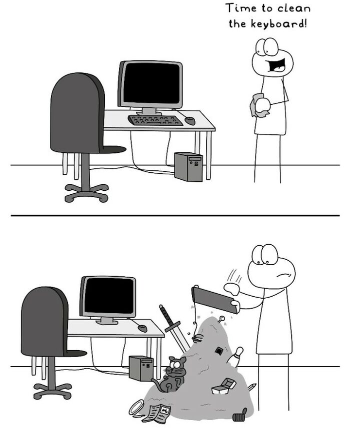
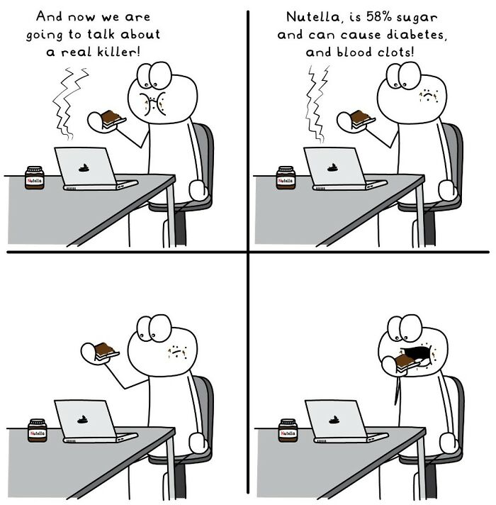
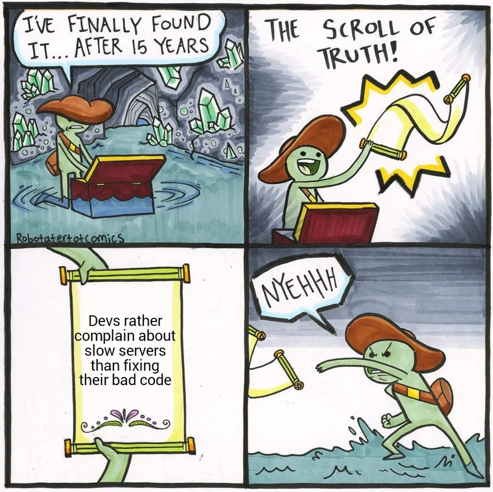
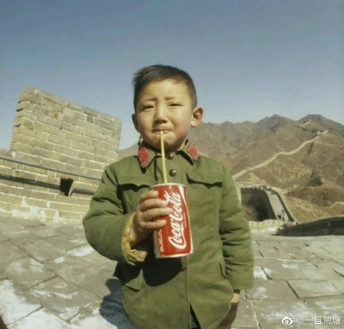
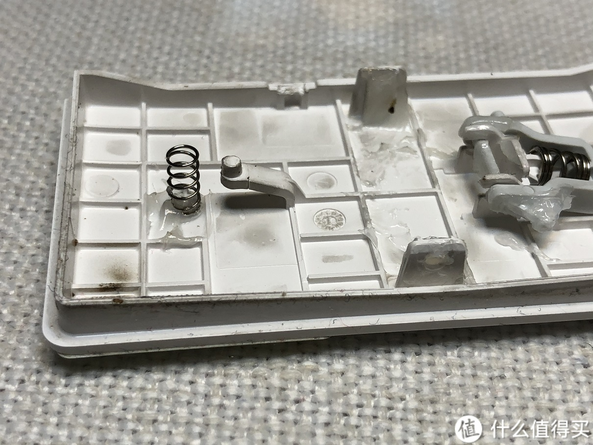
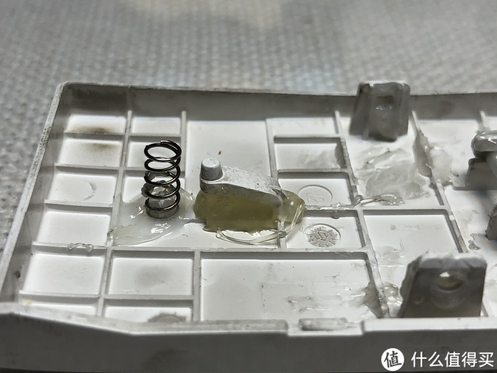

啰里啰唆周刊第43期：但见时光流似箭，岂知天道曲如弓

# 科技日常

## 1. Firefox Monitor
看看您是否也处于数据外泄事件之中。同时也提供了所有有过泄露密码的网站，供你自行排查。

[https://monitor.firefox.com/scan](https://monitor.firefox.com/scan)

## 2. Geogebra -数学绘图和统计的神仙软件
Geogebra 是动态数学软件，它将几何、代数、电子表格、绘图、统计和微积分集成在一个易于使用的软件包中。可以认为它是商业软件“几何画板”的替代品。最新版本6.0.749。

这工具用来画数学图形，教学演示是最佳了，不仅支持画出动态的图形，还支持交互和动画效果。既然是数学软件，其功能就不止是画图了，统计、表格、概率计算等功能也是甚好用。3D画图那也是必然支持的。用过的都称它为“神仙软件”。


注：Geogebra 5曾经是用Java开发的，体积小，占用空间少，Geogebra 6改用了JavaScript的Electron框架来开发。作为一名有洁癖的电脑使用者，怎么能接受Electron下那成千上万的小文件呢，好在目前5和6的功能是同步发布的，小版本号也是一样的。

作为经典开源软件，Geogebra有丰富的中文支持，还有大量的教程和文档，但是不随发布包提供，需要单独去官网查阅，官网就有大量素材和案例提供。

[https://www.geogebra.org/](https://www.geogebra.org/)

网络上有爱好者整合了多个版本，内置帮助文档和素材，可以参考 [http://www.jinhu.me/article.asp?id=231](http://www.jinhu.me/article.asp?id=231)

## 3.史海拾遗之VML

现在提到网页矢量图形，很多人第一个想到的就是SVG，不知还有多少人记得曾经的VML。

矢量标记语言 VML(The Vector Markup Language) 是一种基于 XML 的交换、编辑和交付格式，适用于 Web 上的高质量矢量图形，满足生产力用户和图形设计专业人员的需求，从IE 5.0开始就受浏览器支持。VML在1998 年由 Autodesk ，Hewlett-Packard，Macromedia ，Microsoft几家公司共同向 W3C 提交，并希望能够成为矢量绘图的国际化标准。

代码示例：
```html
<html xmlns:v="urn:schemas-microsoft-com:vml"> 
<style>v\:*{behavior:url(#default#VML);position:absolute}</style>  
<body>
<v:oval style="left:0;top:0;width:100;height:50" fillcolor="blue"/> 
</body> 
</html>
```
效果：

VML 看似简单的标签和属性却定义了很多功能强大的组件。将这些图形标签组合在一起使用可以绘制出很多漂亮、复杂甚至是令人难以想象的画面，例如下图就是一个利用 VML 绘制出的《蒙娜丽莎》画像。


可惜的是，由于VML只是IE的规范，随着IE的没落，截至 2011 年，VML规范就不再维护了，浏览器支持也已弃用到Internet Explorer 9，同时微软也是从IE9开始提供对SVG的支持的。虽然 VML 最终没有成为 W3C 推荐的矢量绘图标准，但其还是被大量应用于 MS Office、Visio 等软件。

ref:[https://www.w3.org/TR/NOTE-VML](https://www.w3.org/TR/NOTE-VML)

我还记得2003年学VML绘图的兴奋劲，眨眼20年过去了。

> 往来千里路长在，聚散十年人不同。
> 但见时光流似箭，岂知天道曲如弓。

## 4.kaf-cli – 将 txt 小说转换为电子书
kaf-cli 是一个基于Golang开发的开源项目，用来自动将 .txt 格式的电子小说转换为 EPub、Mobi、azw3 电子书格式，并且能够自动识别目录、标题，以及添加封面图片。支持 Windows、macOS、Linux，还拥有 Android 版本。

功能：自动识别书名和章节，自定义章节标题识别规则、自动给章节正文生成加粗居中的标题、自动段落识别与缩进、添加图片封面。

使用方法很简单，把 .txt 文件拖到 kaf-cli.exe 上面就能完成自动转换。

体积小，不到6M.

[https://github.com/ystyle/kaf-cli](https://github.com/ystyle/kaf-cli)

原理很简单，使用正则表达式识别章节。之前介绍的calibre也是用正则来区分章节的。
# 读书与影视分享

## 1.《流浪の月》-日本2022年李相日执导的电影
无家可归的女孩更纱在公园遇见孤独的大学生文。“要来我家吗？”一个如甘霖般的邀请将更纱从窒息的世界裡拯救。两个月的共同生活自由快乐，世人却以“女童诱拐事件”一言蔽之。文因诱拐罪遭拘捕，在夏天结束之际，相依相靠的日子随即分崩离析，二人被盖上“诱拐犯”和“受害女童”的烙印从此分道扬镳。十五年后二人重逢，无法控制地靠近彼此，昔日事件却如影随形。大众先入为主的偏见，旁人穷追不捨的关怀，捉错用神的善意将二人推入深渊。

改编自凪良悠的同名小说，《恶人》、《怒》得奖导演李相日最新虐心治癒之作，《烧失乐园》、《上流寄生族》、《哭声》摄影洪垧杓首部日本作品，细腻影像撼动人心，人气新生代女星广濑铃、“日本奥斯卡”影帝松坂桃李破格出演。两个破碎的灵魂，怀抱著难以启齿的秘密，在惊涛骇浪中找到彼此的归宿，不被社会理解的感情，超越爱的禁忌关係。 


> 得到救赎的时刻总会看到月光 无论是从水里仰望抑或雨天的密云缝隙 总能透出亮光指引着前方。曾以为缩在公园长椅上冒雨看书被伞温柔带走 是对更纱一次馈赠 却在看到他的伤痛残疾后幡然了解 在寻死的一刻长椅上看到了你 才是他的重生。想起那天他牵着她的手不舍得分开 真好 因为他最后 把她还给了她自己——他说 “更纱只属于更纱一个人。”从此 无论到哪里都可以浪漫流浪 只要是相爱。

> 如此循环往复，悲剧只会一遍遍上演。 还有无数个更纱，在无助中煎熬。 手不知该伸向哪里，才会伸向加害者。 而回应她们呼救声的，不该只有深渊。 

## 2.《从前的优雅》

《山河小岁月》作者李舒最新随笔集，细述数十位佳人雅士的生活往事。他们多出身名门、品貌高雅，或为见证了紫禁城最后岁月的末代皇妹，或为领一时风尚的画坛才女、名门交际花，或为为中国学术存续一脉希望的教授学者，或为把生活过成艺术的艺术家、收藏家......他们风华绝代，一时无两。他们经历了人生的大起大落，依然不输时光，留下优雅的侧影和余韵。

李舒，女，复旦大学新闻系硕士毕业，作家、媒体人、美食达人。
好读书不求甚解，好唱戏不务正业，好八卦囫囵吞枣，好历史走马观花，好美食不远庖厨。
著有《山河小岁月》《民国太太的厨房》《潘金莲的饺子》等。

书评中有评论复制拼凑居多，作为非严肃文学，可作为民国八卦来看。部分内容可以到作者本人的公众号“山河小岁月”上观看。
# 图论

## 1.Hoppy Doodle


ref: [instagram](https://www.instagram.com/hoppy.doodle/)|[hoppydoodles.com](https://hoppydoodles.com/)

## 2.bad code



## 3.The first person in New China who drinks Coca-Cola



这张珍贵的照片由美国著名摄影师James Anderson亲手拍摄的。在1979年的某一天，詹姆斯慕名来到万里长城参观游玩，同时想拍摄一些长城的壮观景象的照片回国。在游览长城的时候，他注意到了一个顽皮可爱的小男孩，便走上前去用蹩脚的中文搭起话来。

在经过小男孩父母同意后，詹姆斯从包里拿出一听可乐，插上吸管递给了小男孩。就在小男孩喝可乐的时候，詹姆斯举起相机拍下了这一幕。

James especially likes this photo, so he developed the photo and named "Red China's First Can of Coke" , voted for National Geographic calling this "the first person in New China who drinks Coca-Cola".

Whether or not these claims are true is of course, an entirely different topic.

It came to represent a new age of market capitalism in China, something that was inherent to Reform and Opening Up.  In many ways, this shot symbolizes how far China has come since said opening up to the world.

2019年，可口可乐进中国40年，准备举办一场活动，用一个比较温馨的故事，来做这个活动的主题，于是通过各种手段找到了照片的主人公—黑建涛。

[https://new.qq.com/rain/a/20210504A01URW00](https://new.qq.com/rain/a/20210504A01URW00)

[https://www.thatsmags.com/china/post/34038/is-this-the-best-photograph-of-beijing-ever](https://www.thatsmags.com/china/post/34038/is-this-the-best-photograph-of-beijing-ever)

# 谈天说地

## 1.The Clay Conjurer-粘土魔法师

Felipe Ortega was known for his controversial opinions on culture, as well as his expertise with an unusual form of pottery. He devoted his life to bucking tradition, in more ways than one.

一个美洲版的匠人故事。文章来自一个叫《craftsmanship》的线上季刊，涉及来自北美、欧洲、澳洲、非洲和东南亚的工匠故事。

[https://craftsmanship.net/the-clay-conjurer/](https://craftsmanship.net/the-clay-conjurer/)
## 2.小米电磁炉“故意”设计缺陷与有计划的废止制度
最近发现家里的小米电磁炉旋钮按了没反应，拆开看了下发现是旋钮用来触发按钮的一小块塑料拨片断裂了。

网上搜了下并不是个例，很多人都遇到了这种问题；之所以说是“故意”存在的设计缺陷，是因为小学生都能看出来问题所在；三角形具有稳定性，而小米电磁炉的触发开关的塑料拨片偏偏设计为“L”形状，没有支撑的拨片明显要脆弱许多。

> 发现问题了吗，这么重要的按键，设计只用了一个L型的塑料按键，材质倒是无所谓，关键是形状，L型天生是不稳定的.
> 很简单一个问题，却是最重要的一个问题。只要把L型这块重新设计厚一点，或者直接做成完整的长条状就能解决
> 不知道厂家是从什么考虑设计成这样，笔者并不是这个专业的，只是个很业余的喜欢琢磨的电子爱好者，也觉得这个问题真的很简单却显得很幼稚。如此重要的一个功能为何会用这么脆弱的设计来负责，想不明白。

下面有评论指出，
> 工业设计的专业行话叫做【有计划的废止制度】，设计成这样就是故意让它容易损坏。这样你好买新的。

[https://zhuanlan.zhihu.com/p/89698810](https://zhuanlan.zhihu.com/p/89698810)
[https://v2ex.com/t/903249](https://v2ex.com/t/903249)

类似问题，还有这个：[Aqara智能墙壁开关面板触点断裂修复记](https://post.smzdm.com/p/andr6wwv/),同样是触点位置使用的是塑料拨片，长期使用就会使塑料失去弹性或者根部出现断裂。这个拍照比较清晰。
原开关设计:

维修方法：使用热熔胶枪改为实心触点


## 3.同样是小麦，为何在西方制成面包，在中国制成馒头？
实际上，你可千万别觉得，古人直到三国时期才吃到馒头。早在战国时期，《事物绀珠》中就有“秦昭王作蒸饼”的记载，其中“蒸饼”有可能就是馒头。到了南北朝时期，《齐书》中提到一种叫做“面起饼”的食物，将其描述为“入酵面中，令松松然也”，其中“松松然”的描绘十分传神，使得一屉屉热气腾腾的馒头仿佛跃然纸上，让人不禁食指大动。

在西方，同样的面食，我们知道的更多的是面包。而且，不仅有“松软”的，还有“坚硬”的，那种能磨刀的真·硬核面包。

[https://zhuanlan.zhihu.com/p/162811945](https://zhuanlan.zhihu.com/p/162811945)

[https://www.ximalaya.com/sound/325429006](https://www.ximalaya.com/sound/325429006)

评论里有提到欧亨利的一篇短篇小说《女巫的面包》，也甚是有趣。
# 一句话快讯

1.国家卫健委网站25日发布说明：从即日起，不再发布每日疫情信息，将由中国疾控中心发布相关疫情信息，供参考和研究使用

2.当地时间12月24日，阿富汗经济部表示，阿富汗塔利班命令所有国内和国际非政府组织暂停其女性员工的工作。法新社获得的一份发送给所有非政府组织的通知指示所有组织在另行通告前停止女性的工作，若违反通知，其组织许可证将被吊销。

3.字节跳动 CEO 梁汝波在致员工的一封邮件中称，公司内部调查发现有员工不当获取了少量美国 TikTok 用户的数据，包括两名美国记者的 TikTok 用户数据。目前已经将违规获取 TikTok 用户数据的员工解雇。

# 联系方式

啰里啰唆是一份针对互联网和生活爱好者的数字杂志，旨在发现和分享一切有趣的东西。话题不固定，每期大约十五分钟阅读量，暂定每周四发布。部分内容来自互联网采编，如果为有来源的转载，均会注明转载地址或保留水印。

这是一个关注人文和科技的newsletter。

使用方法建议或素材提供

频道：notonlyshare

邮箱：auokyob@outlook.com

github地址：[https://github.com/iminto/luoliluosuo-weekly](https://github.com/iminto/luoliluosuo-weekly)