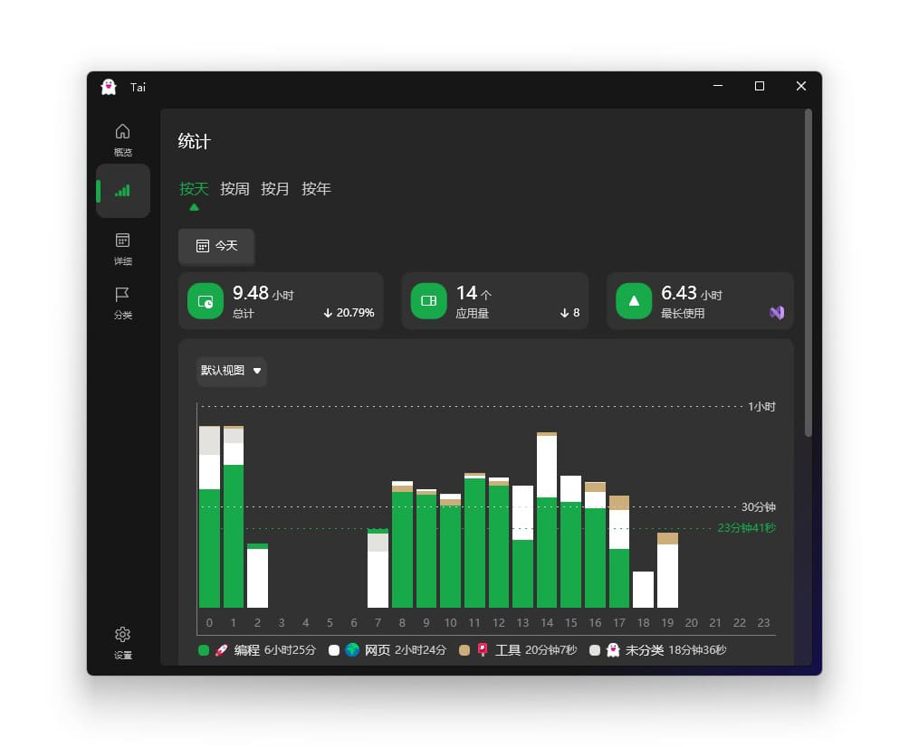
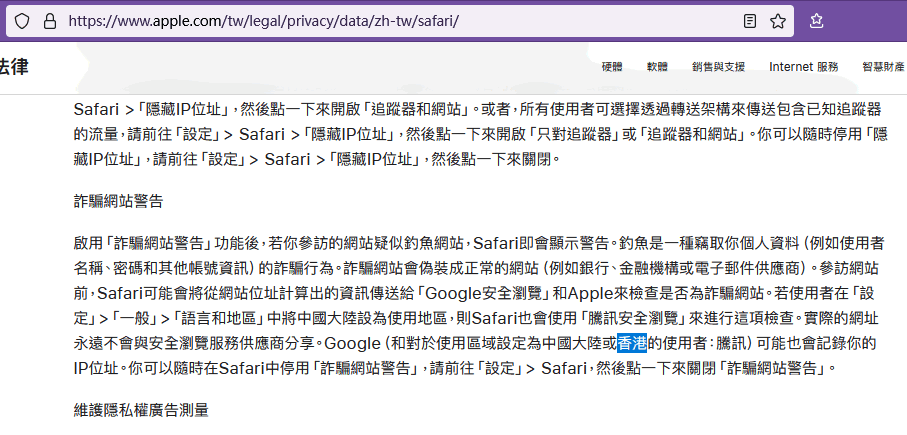
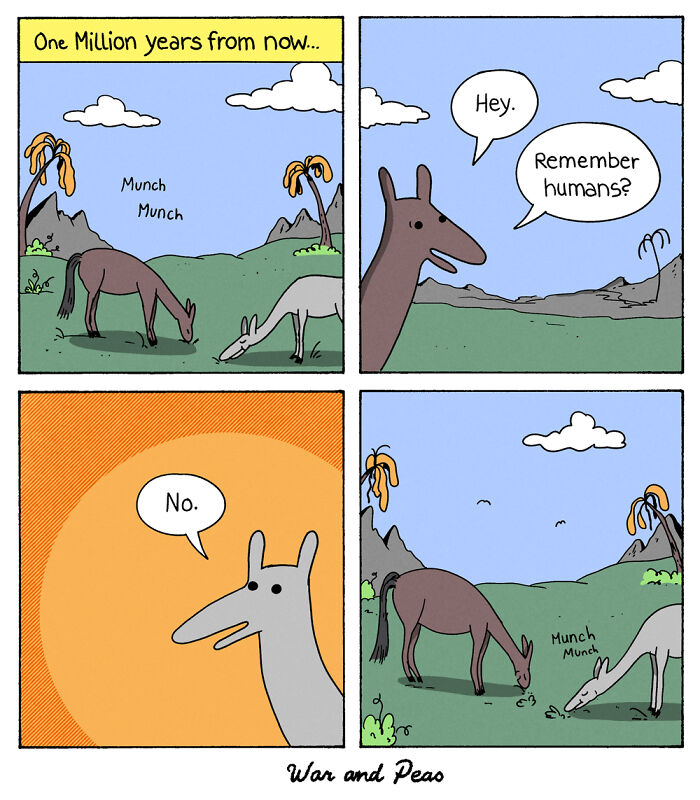
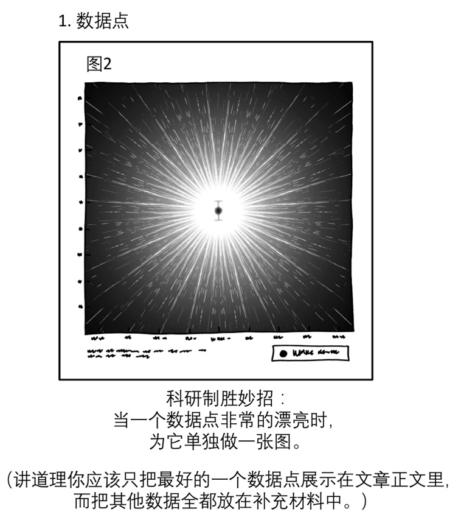
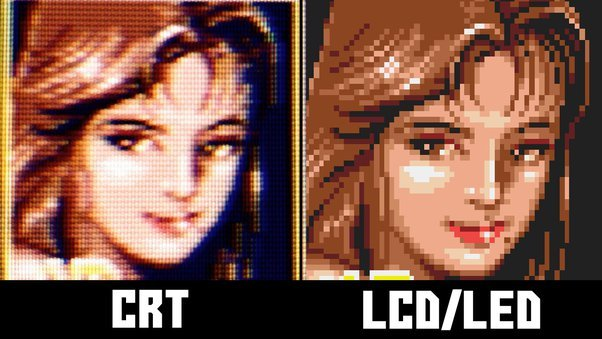

啰里啰唆周刊第44期：地木耳

# 科技日常

## 1. Zimu英语 – 21 部美剧，140W 句台词[微信小程序]

Zimu英语 是一款微信小程序，它收录了 21 部美剧中的 140W 句台词，让用户可以通过中文、英文单词或者短语来检索台词，从而学习地道的英语表达方式。

总的来说，该小程序可以输入中、英文单词或者短语，返回检索到的美剧中的上下文。输入中文，会帮助我们寻找地道的英语表达；输入英文会帮助我们学习该单词或者短语在不同语境下的不同含义。目前该小程序已经收集了 21 部美剧，超过 140W 句台词，常用的表达基本都可以搜到。

已收录美剧包括：老友记、纸牌屋 、绝命毒师、破产姐妹、生活大爆炸、摩登家庭等。

开发者来自V站。

[https://www.v2ex.com/t/905056](https://www.v2ex.com/t/905056)

## 2. iodine-快速创建 DNS 隧道

一款可快速创建 DNS 隧道的工具。该项目包含 C 语言写的 DNS 隧道服务器和客户端，可快速搭建 DNS 隧道传输 IPv4 数据，常用于绕过防火墙等场景。因为一般情况下防火墙的 DNS 端口是打开的，所以将流量伪装成 DNS 数据包，就可以突破防火墙限制啦。

[https://github.com/yarrick/iodine](https://github.com/yarrick/iodine)

## 3.Tai-Windows 上统计软件使用时长

Windows 上统计软件使用时长的工具。该项目会根据软件获得焦点和失去焦点的时间差，来计算软件的真实使用时长，而不是简单地统计软件存活时间。

[https://github.com/Planshit/Tai](https://github.com/Planshit/Tai)

## 4.spacedrive-跨平台文件管理工具

一款 Rust 写的跨平台文件管理工具。它基于用 Rust 编写的虚拟分布式文件系统(VDFS)，可以将  macOS、Windows、Linux、iOS、Android  等不同操作系统的设备连接到一起，统一管理所有的文件。该项目还处于开发阶段，客户端需要自行编译。

[https://github.com/spacedriveapp/spacedrive](https://github.com/spacedriveapp/spacedrive)

## 5.LineageOS 20 正式发布
LineageOS 20 已正式发布。LineageOS 20 基于 Android 13，合并了 2022 年 4 月至 12 月的安全补丁。

此版本还有一个值得关注的变化：采用新的默认 “相机” 应用 Aperture，替换了AOSP自带相机。

[https://lineageos.org/Changelog-27/](https://lineageos.org/Changelog-27/)

## 6.Apple 苹果明确声称会将大陆和香港用户的数据传送给腾讯
Safari 浏览器的隐私政策页面 [https://www.apple.com/tw/legal/privacy/data/zh-tw/safari/](https://www.apple.com/tw/legal/privacy/data/zh-tw/safari/) 的“詐騙網站警告”这段文字当中，上个月（ 2022 年 11 月）的时候文字是“Google （和對於使用區域設定為中國大陸的使用者：騰訊）可能也會記錄你的 IP 位址。”，( [https://web.archive.org/web/20221125014351/https://www.apple.com/tw/legal/privacy/data/zh-tw/safari/](https://web.archive.org/web/20221125014351/https://www.apple.com/tw/legal/privacy/data/zh-tw/safari/) ) ，现在已经变成了“Google （和對於使用區域設定為中國大陸或香港的使用者：騰訊）可能也會記錄你的 IP 位址。”( [https://archive.ph/7en7L](https://archive.ph/7en7L) )，多出了“或香港”三个字。

苹果用户可以把Safari 设置里的 fraudulent warning 关掉，从而避免苹果将数据传送给腾讯。
# 读书与影视分享

## 1.日剧《3年A班：从现在起，大家都是人质》
《3年A班-从此刻起，大家都是我的人质-》是日本台（NTV）出品的悬疑剧，由小室直子、铃木勇马、水野格执导，武藤将吾担任编剧，菅田将晖主演，永野芽郁共演，于2019年1月6日开播，共10集。

离毕业还有10天，学生们的高中生活本应平静地落幕。但是，教师柊一飒却突然将班上的29名学生召集起来，宣布：“从现在开始，大家都是我的人质。”从这一刻开始，他与29名人质学生展开了“最后的授课”，那就是查明数月前自杀的某学生之死的真相。那个学生没留遗书，什么也没有说，就突然离开人世，而她本来是学校的明星学生。被教师掳为人质的29名学生，不得不面对自己掩盖的、不愿触及的真相。

> 【神职者、殉道者与慈悲者】说实话初次被安利此剧，只听剧名还以为是《我是大哥大》那样的沙雕喜剧，没想到是《告白》+好人救赎版《恶之教典》。

> 该剧的设定与推进近似于中岛哲也导演的电影《告白》。剧集对日本青少年中存在的欺凌现象，以及长久以来的教育问题多有展现，虽然受限于民放台的尺度无法像《告白》那样凛冽酷寒，并且每集的节奏略显拖沓，但有菅田将晖的演技压阵，以及一众养眼的年轻演员，配合中二暗黑系的剧情，仍是2019冬季剧中最值得关注的民放剧。

## 2.电影《深海》定档大年初一
继《大圣归来》后，导演田晓鹏七年筹制之作，动画电影《深海》宣布定档大年初一。
同步发布的“比海更深”版定档海报，由黄海设计，女主参宿以海为被，凸显粒子水墨的视觉特效。

“粒子水墨”为电影主创首创研发技术， 实现了中国水墨与主流三维技术的出色结合。
电影《深海》由田晓鹏执导，十月文化、彩条屋影业出品，将于农历大年初一全国上映。 
## 3.豆瓣9.1分书籍《可能性的艺术》

面对林林总总的政治问题，作者刘瑜带领我们以一种比较的视角，在民主问责和国家能力两个政治比较的核心维度下，建立起观察的参照系，将不同体制、不同经济发展水平的国家纳入比较的视野，去分析我们的时代背景和全球化进程，讨论不同国家的政治转型与国家能力，以及文化和经济对政治变迁的影响。

“政治是可能性的艺术。”当我们将面对的政治现实当作一万种可能性之一来对待时，就能从此时此地抽离，获得一种俯瞰的视角，进而再聚焦定位现实，在浩瀚的可能性中理解我们自身。

刘瑜 ，哥伦比亚大学政治学博士，清华大学政治学系副教授。 **此书一定程度上属于禁书，建议谨慎阅读**

> 理想国音频和文稿版本，哈哈。这几年对我思想影响最大的两个音频，一个是周濂的100堂西方哲学课，学会复杂地看待分析一个问题；另一个就是刘瑜的比较政治学，政治在社会中。这十年，很多常识消失了，但遥远的知识终究会抵达它的读者，观念的水位和精神的水位会升起来。

> 连着看了作者刘瑜的两本书，感觉变化还挺明显的，比起《观念的水位》，这本书作者明显成熟了，也深沉了。
这书用30个彼此独立但有逻辑相连的小章节简单介绍了比较政治学的，研究方法，研究对象和研究结果。其实是一门很好的政治学入门书。对于只要跟政治沾边的话题就几乎已经是敏感内容的简中来说，这本书其实挺难得的，因为它非常聪明地绕开了那些会引发当权者不满的东西，直接去比较除中国以外的国家。
# 图论

## 1.Remember Humans

This is Jonathan and Elizabeth, the creators behind the webcomic War and Peas.
[https://warandpeas.com/](https://warandpeas.com/)

《战争与豌豆》是一部由伊丽莎白·皮奇和乔纳森·昆兹两人制作的网络漫画。
## 2.数据点

[https://xkcd.com/2713/](https://xkcd.com/2713/)

# 谈天说地

## 1.如果Y染色体消失，人类会灭绝吗
人类和其他哺乳动物的性别其实由Y染色体(的存在与否)决定。但是人类的Y染色体正在退化，可能会在几百万年后消失，除非我们进化出新的性基因，否则人类会灭绝。

好消息是啮齿动物的两个分支已经失去了它们的Y染色体并且延续至今。

人类和其他哺乳动物一样，雌性有两条 X 染色体，雄性有一条 X 和一条很小的Y染色体。名字与染色体形状无关； X代表“未知”。

X包含大约900个基因，它们执行各种与性无关的工作。但是Y包含很少的基因(大约 55 个)和大量非编码 DNA——简单的重复 DNA，似乎没有任何作用。
[https://www.sciencealert.com/the-y-chromosome-is-slowly-vanishing-a-new-sex-gene-could-be-the-future-of-men](https://www.sciencealert.com/the-y-chromosome-is-slowly-vanishing-a-new-sex-gene-could-be-the-future-of-men)

## 2.古代猫咪与人类一同迁徙到世界各地
将近一万年前，定居在新月沃土——底格里斯河和幼发拉底河周围的中东地区——的人类首次从狩猎采集者变成农民，他们与以老鼠为食的猫咪建立了密切关系，猫在古代充当了控制害虫的角色。密苏里大学的一项新研究发现，人类生活方式的改变是首次驯化猫的催化剂，驯化后的猫与人类一同迁徙到世界各地。研究人员收集和分析了新月沃土及其周边地区，以及欧洲、亚洲和非洲的猫的 DNA，对比了近 200 种不同遗传标记。结果显示，猫不同于牛或马，没有经历不同地区的不同驯化事件，家猫起源于新月沃土。 

[https://showme.missouri.edu/2022/feline-genetics-help-pinpoint-first-ever-domestication-of-cats-mu-study-finds/](https://showme.missouri.edu/2022/feline-genetics-help-pinpoint-first-ever-domestication-of-cats-mu-study-finds/)

## 3.地木耳
地木耳，学名普通念珠藻（Nostoc commune），又名地皮菜、地耳、鼻涕肉等，属于蓝藻门。

地木耳是一种陆生的藻类，在山丘和平原的岩石、砂土、草地、田埂以及近水堤岸都能见到它身影。全国各地都有分布，甚至在河南地区也有食用历史。

下完大雨后去采摘地木耳是最好的时机，它富含蛋白质和多种维生素矿物质，是人体蛋白质的很好来源，最适于做汤，也可凉拌或小炒。地木耳清洗干净之后放在淡盐水中浸泡15分钟，浸泡好之后，把它再一次焯水，然后炒蛋或清炒即可。

作为一种独特的食材，它的营养成分是非常多的，其中含有一定量的脂肪，也包括色素等成分，其中的钙元素、维C等都大于银耳以及木耳，而其中的胡萝卜素、叶绿素、果胶等成分也比较多。

地木耳长得比较像木耳，但是和木耳区别很大，木耳是一种真菌，为真核生物，担子菌亚门层菌纲木耳目，腐生异养，通常必须要在枯朽的木头上才能存活。而地木耳是一种原核的藻类，蓝藻门念珠藻属，自养，长在草地上。

虽然地木耳看起来比较上不了档次，超市也没有卖的，但是营养价值和口感都是超过木耳的。

还有一种生物叫石耳，准确的说，它并不是一种生物，而是由真菌（通常是子囊菌）和藻类（通常是蓝藻或绿藻）共生所形成的一类特殊的生物有机体，为地衣门衣状地衣。石耳口感不佳，一般仅作为药材使用。

## 4.Quora：为什么CRT显示器仍被认为优于现代显示器？
**John McManus:**
然而并不是。

早期的LCD显示器模糊不清、分辨率低，而且不可靠，因此当时CRT要优越得多。我坚持使用CRT多年，因为一台好的CRT显示器比除最昂贵(我指的是2000美元以上)的LCD显示器之外的所有显示器都要好。我们这里谈论的是上世纪90年代末期。情况已经发生了变化。

当时LCD显示器质量不佳，因此CRT要更胜一筹。我多年来一直使用CRT，因为即使是最昂贵的LCD显示器(2000美元以上)也比它不如。这是90年代末的情况。但现在情况已经发生了变化，现代显示器的分辨率、清晰度、刷新率和对比度都比CRT要高得多，而且体积也更小，重量轻，耗电量也更低。

只有复古游戏玩家才有权声称CRT更好。很多8位和16位时代的图形作品实际上都是基于显示器无法完美显示每个像素的想法。打开你最喜欢的搜索引擎，输入“CRT图形”，你会得到大量的结果，比如：

这是误导性的，因为这些图像的比例不同，但原理是正确的。当你有有限的内存用于图像，有有限的调色板时，像素周围的一点模糊实际上是有帮助的。看到你最喜欢的80年代游戏的所有块状荣耀，可能会让你的怀旧之旅变得更有意义。

为什么它们贵得这么多？因为现在几乎没有人制造它们。市场几乎完全是复古游戏玩家。设置一条LCD电视生产线可以赚取更多的钱，而制造CRT显示器供有钱、有空间、有意愿在游戏区域填满超大、超重、超贵、耗电量大的显示设备的人使用，则可赚取的钱少得多。

**Vladislav Zorov:**
它们支持高刷新率，输入延迟低，给你一点“免费的抗锯齿”，而且运动看起来非常棒(由于它们不是采样保持显示器，所以基本上没有运动模糊)。它们还可以正确显示非标准分辨率和刷新率(例如，Doom是以320x200和70Hz的4:3长宽比制作的，如果你试图在TFT显示器上玩原始的DOS版本，它会变得一团糟)。

但是，对我来说最重要的因素是...如果用平板显示器(LCD)看起来会很不对劲和难看.

[https://www.quora.com/Why-are-CRT-monitors-still-considered-superior-to-modern-monitors-Why-do-they-cost-so-much](https://www.quora.com/Why-are-CRT-monitors-still-considered-superior-to-modern-monitors-Why-do-they-cost-so-much)

## 5.中国团队研究发现含糖饮料与脱发相关
清华大学的研究人员在本月出版的《Nutrients》期刊上发表论文，调查了含糖饮料消费与男性脱发之间的关联。从 2022 年 1-4 月，研究人员招募了 1951 名年龄在 18-45 岁之间的年轻男性，以在线调查问卷的方式收集数据。
结果显示，高含糖饮料消费与男性脱发高风险相关。研究人员推荐年轻人减少含糖饮料消费，以最大程度减少对健康的负面影响。

[https://www.mdpi.com/2072-6643/15/1/214](https://www.mdpi.com/2072-6643/15/1/214)
# 一句话快讯

1.当地时间2022年12月29日15时27分，巴西著名足球运动员贝利因结肠癌引发多器官衰竭逝世，享年82岁。

2.中国东方航空全球首架 C919 大型客机，在 2023 年首日测试飞行。C919 被称作全球首架国产大飞机，是按照国际民航规章自行研制、具有自主知识产权的大型喷气式民用飞机。这是自 2022 年 12 月 26 日以来，C919 的第 9 架次验证飞行，据了解，C919 总计要进行 100 小时的验证飞行。

3.乐视宣布自 2023 年 1 月 1 日起，公司将执行每周四天半工作制，每周三实行弹性的半天工作制，考勤时间调整为连续的 5 小时。

# 联系方式

啰里啰唆是一份针对互联网和生活爱好者的数字杂志，旨在发现和分享一切有趣的东西。话题不固定，每期大约十五分钟阅读量，暂定每周四发布。部分内容来自互联网采编，如果为有来源的转载，均会注明转载地址或保留水印。

这是一个关注人文和科技的newsletter。

使用方法建议或素材提供

频道：notonlyshare

邮箱：auokyob@outlook.com

github地址：[https://github.com/iminto/luoliluosuo-weekly](https://github.com/iminto/luoliluosuo-weekly)