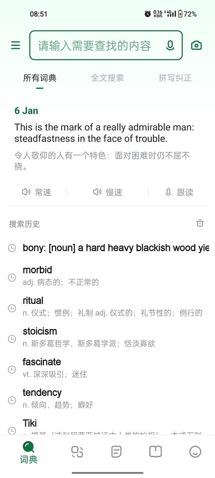
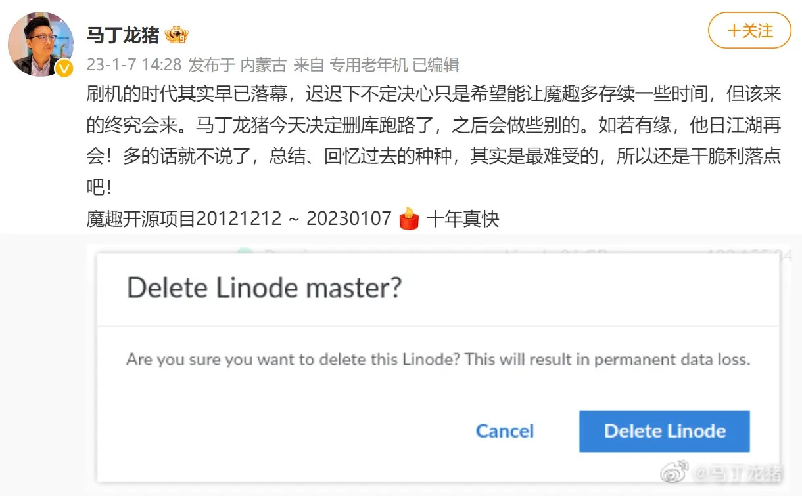

啰里啰唆周刊第45期：状元吃饵丝，连吃三大碗

# 科技日常

## 1. wallabag-开源随后读应用
Save and classify articles. Read them later. Freely. 
wallabag 是一款开源的网络书签、稍后阅读工具，类似火狐的getpocket，但是跨平台和APP支持做的更好，代码开源并且开放API。

如果使用官方的托管服务，需要收费，9镑/年，免费试用14天。当然，也可基于源码自行搭建服务。

主要功能特性如下：
1.wallabag extracts the article's content (and only its content!) and displays it in a comfortable view.
2.If you already have an account on Pocket, Readability, Instapaper or Pinboard, you can import your data into wallabag.
3.If you're a developer and you want to connect your application to wallabag, we offer you an API. 
[https://wallabag.org/en](https://wallabag.org/en)

## 2. FitoTrack-FOSS的健康应用
FitoTrack is a mobile app for logging and viewing your workouts. Whether you’re running, cycling or hiking, FitoTrack will show you the most important information, with detailed charts and statistics. It is open-source and completely ad-free.

FOSS软件，无广告，体积仅9M，支持多种运动模式。

[https://f-droid.org/packages/de.tadris.fitness/](https://f-droid.org/packages/de.tadris.fitness/)

## 3.中国研究人员报告能用现有量子计算机破解 2048 位 RSA
清华和浙大等中国研究人员在预印本平台 arxiv 上发表论文，报告破解 2048 位 RSA 密钥所需的量子比特数可以大幅减少，现有的量子计算机就能做到。

研究人员称，Peter Shor 早在1990年代就发现用量子计算机进行大数的因式分解是很容易的，但所需的量子比特数需要多达数百万，现有技术还制造不出此类规模的量子计算机。今天最先进的量子计算机只有数百个量子比特——如 IBM 的 Osprey 有 433 个量子比特。中国研究人员提出了一种优化方法，将所需的量子比特数减少到 372 个量子比特——这是现有技术能做到的，虽然中国还没有如此先进的量子计算机。

知名加密学专家 Bruce Schneier 在其博客上指出，中国研究人员提出的优化方法是基于 Peter Schnorr 最近发表的一篇受争议论文，Schnorr 的算法在较大的系统上崩溃了，所以中国的方法是否成功还是未知，但至少 IBM 的研究人员可以测试下了。 

[https://arxiv.org/pdf/2212.12372.pdf](https://arxiv.org/pdf/2212.12372.pdf)
[https://www.schneier.com/blog/archives/2023/01/breaking-rsa-with-a-quantum-computer.html](https://www.schneier.com/blog/archives/2023/01/breaking-rsa-with-a-quantum-computer.html)

## 4.谷歌 Android 团队：希望 RISC-V 成为 Android 支持的 “一级” 架构平台
在近期举办的 "RISC-V Summit" 峰会上，谷歌 Android 工程总监 Lars Bergstrom 提到了 Android 对 RISC-V 架构的支持愿景。他表示希望 RISC-V 成为 Android 支持的 “一级” 架构平台 (tier-1 platform)，这和对 Arm 的支持级别一致。

由此可见，谷歌对 RISC-V 的支持态度有了巨大转变。毕竟六个月前，Bergstrom 曾表示在 RISC-V 上优化 Android 构建需要 “大量工作”，并概述了需要 “几年” 才能实现目标的路线图。而 AOSP 对 RISC-V 的支持却非常积极，去年 9 月，AOSP 合并了首个 RISC-V 架构移植相关的代码补丁。现在任何人都可以体验 Android 的 "riscv64" 分支。

[https://arstechnica.com/gadgets/2023/01/google-announces-official-android-support-for-risc-v/](https://arstechnica.com/gadgets/2023/01/google-announces-official-android-support-for-risc-v/)

## 5.cozo-一款图数据库
A free and open-source transactional, relational, graph database that runs everywhere, with time travelling capability.

支持多种语言API，高性能，支持“历史穿梭”功能,支持基于RocksDB/Sqlite/TiKV/内存的存储引擎。

[https://www.cozodb.org/](https://www.cozodb.org/)

## 6.欧陆词典-一个纯粹的字典APP

欧陆词典，没有广告，没有弹窗，没有购物/借贷/视频/游戏,支持导入外部辞典，一个纯粹的英语学习APP。

对比有道词典

## 7.Android 开源系统「魔趣 ROM」项目正式宣布结束
据马丁龙猪的微博，Android 开源系统「魔趣 ROM」项目于1月7日正式结束。

项目 Linode 服务器也被同时删除，下载中心和论坛均已无法访问，仅剩官网主页作为一个空壳可访问。

Mokee（魔趣），全称 MoKee OpenSource，项目发起于 2012 年 12 月 12 日，由马丁龙猪创建，是国内最大的非营利性开源 ROM。早期基于 CyanogenMod (CM)，2016 年 CyanogenMod 停止开发，后开始基于 AOSP。

魔趣论坛前身为 ITFunz 摩托罗拉手机论坛，由 MartinCZ（马丁龙猪）在 2009 年 7 月 17 日发起并建立。2011年5月25日，因为论坛备案所在地区(江苏连云港？)发生政治性事件，因维稳需要导致当地备案的SNS、BBS类型网站被关停，域名无法访问，于是 ITFunz 论坛改名魔趣论坛。

魔趣解散，标志的中国第三方刷机时代的终结。其实魔趣已经停更一年多了，大部分开发者都已跑路，社区内部也纷争不断，不过可惜了很多存档包。

我最后一次使用魔趣是2021年秋给坚果3手机刷了魔趣系统，从Android 7升级到了Android 9，一个月后魔趣发布了新版，刷后变砖，随后魔趣撤回了新版，此后再无更新。魔趣实际上从2021年10月后就已经停止开发了。

> 实话说，这事儿做的不怎么局气，扛不住要撤这没问题，但突然删库，一点准备时间都没给用户，就有点过分了，正常的逻辑应该是宣布不维护，之后给大家一周的时间下载储存自己需要的版本，现在倒好，准备下来的下不了，已经再用的如果没备份，连系统都不敢换了。。。

[https://weibo.com/1803822891/Mnc8C8FAr](https://weibo.com/1803822891/Mnc8C8FAr)

## 8.创新科技公司创办人沈望傅逝世，曾发明会讲中文的电脑
新加坡创新科技公司创始人、首席执行官兼董事长沈望傅已经逝世，根据公司发布的一份新闻稿，他"于 2023 年 1 月 4 日平静地去世"。享年 67 岁。

沈望傅在业界称为「电脑声卡之父」，也有人把他称为「新加坡的马斯克」，是新加坡第一代的科技企业家，有「新加坡科技第一才子」之称，早在 1984 年就发明了「会讲华语的电脑」，在 45 岁的时候，沈望傅成为新加坡最年轻的亿万富翁。

对于年轻的读者来说，这似乎很难相信，曾经有很长一段时间，电脑的声音是没有保证的。如果你想插上耳机或扬声器，使其不只是发出噗噗声或哔哔声，可能需要一个声卡，并且迄今为止没有一个声卡像创新实验室的 Sound Blaster（声霸卡）那样成功，截至 2019 年 30 周年，它的销量超过 4 亿块。沈望傅形容它为「用 20 年才磨成的宝剑」，是改变游戏规则的科技。

## 9.Windows7将彻底退出历史舞台
作为一代经典Windows7即将退出历史舞台，按计划，1月10日，Windows 7操作系统将结束ESU（付费外延扩展支持），也就是对于企业用户来说，即便是想再掏钱，微软也不会再下发安全补丁了。
Windows 7发布于2009年10月，2015年结束主流支持，2020年结束外延支持，随后微软上线了ESU，允许通过付费的方式订阅安全补丁。另外，Windows 10也将于2025年1月14日结束支持。

## 10.爆火游戏《鹅鸭杀》服务器遭大规模网络攻击，官方宣布停服维护
1 月 10 日消息，近日，狼人杀小游戏《Goose_Goose_Duck》「鹅鸭杀」游戏爆火出圈，连续三天 Steam 在线人数超过 60 万。

然而，该游戏的服务器在9日、10日两次宕机，官方不得已宣布将停服维护。两篇公告中，游戏官方称服务器已经遭受了大约两个月攻击，10日早上又经历了一次大规模攻击，随后不得不关闭服务器并进行维护和加强。

游戏方表示，其拥有一定的证据，可能知道攻击方是谁，但公开猜测是不负责任的。游戏官方称已经聘请了优秀的网络安全专家以提供协助。按照计划，游戏将会在北京时间周四早上六点重新开放。

据悉，部分玩家采用了中国大陆敏感字攻击。
# 读书与影视分享

## 1.《苏州河》-2000年娄烨执导电影
《苏州河》是1998年拍摄、2000年上映的一部爱情文艺电影，导演是娄烨，周迅、贾宏声等主演。

该片主要讲述了马达先后与纯真少女牡丹以及和牡丹长相酷似的美人鱼表演的美美两人之间的恩爱纠缠的故事。该片于2000年9月7日在中国香港公映，同年还获得了第29届鹿特丹国际电影节金虎奖和第15届巴黎国际电影节最佳影片奖并入选美国时代周刊年度十佳电影。

该片因未送审即参加国外电影节，而被中华人民共和国国家新闻出版广电总局下令禁止在中国内地公映

> 《苏州河》是第六代导演娄烨的一部电影，获第25届巴黎国际电影节最佳影片和最佳女主角奖等多个国际奖项。《苏州河》不是关于一个生命的双重生活式的寓言，而是一个寻找失落的爱情的现代人的精神漂流记，是男主角马达的尤里西斯生命之旅：基耶洛夫斯基的影片更多的是形而上的生命体验，而该片片还是贯穿在寻找之中。

> 这种片子，故事并不是最主要的，这种琐碎而不凌乱的小情感才是最吸引人和打动人的；大量的第一人称视角和摇摆不定的手持摄影会让观者感同身受，而最令我心有戚戚就是那最后一句台词："可是我宁愿一个人闭上眼睛，等待下一次的爱情。"

## 2.《玫瑰坝》
《玫瑰坝》是绿野出版社出版的图书，作者是谢宝瑜。此书在中国大陆为禁书。

中国西南的崇山峻岭中散布著很多大大小小的山谷，当地人把它们称为“坝子”，玫瑰坝便是其中之一。这裏的交通不便。坝子裏的人很少走出去，坝子外的人很少走进来。山民们孤陋寡闻。除了土匪和贪官污吏偶尔骚扰，他们的生活单调平静。然而，一九五零年，革命的大潮涌进了这个偏远的角落，使这裏发生了翻天覆地的变化，在很短的时间内就彻底地摧毁了延续了千百年的旧的生活方式和风俗习惯。

> 读完《玫瑰坝》我才知道，廖康一点儿也没有言过其实。《玫瑰坝》是真的好。作者谢宝瑜以平实纯净的文字，把二十世纪五六十年代中国人求生存求尊严的挣扎，写得那样生动逼真，那样震撼人心。《玫瑰坝》字里行间所透出的爱和悲悯，《玫瑰坝》对社会现象和历史事件的深刻剖析，《玫瑰坝》对1950-1966年之间这段中国历史的宏观把握和独特思考，令人叹服。

## 3.The 26 Most Anticipated Movies of 2023
This past year, Hollywood gave us enough true highs to make sitting next to random strangers a thing again. In 2023, directors Martin Scorsese, Christopher Nolan, Greta Gerwig, and Denis Villeneuve will lure us back into the dark. Two dolls, Barbie and M3gan, will burst to life, one of whom, from a distance, seems a lot more friendly than the other. Even the sequels look unusually appetizing this year: Indiana Jones will go treasure-hunting again, possibly for the last time. Adonis Creed will get back in the ring. John Wick will get annoyed and kill a bunch of people. Here are the movies we’re looking forward to most. 

[https://www.vanityfair.com/hollywood/2022/12/most-anticipated-2023-movies](https://www.vanityfair.com/hollywood/2022/12/most-anticipated-2023-movies)
# 图论

## 1.Downstair

More info: [Instagram](https://www.instagram.com/bunicomic/) | [bunicomic.com](https://www.bunicomic.com/)
## 2.世界第一高桥-北盘江大桥

“世界第一高桥”（桥面距水面或谷地的垂直距离）北盘江大桥，这座桥跨越黔滇两省交界的北盘江大峡谷。桥梁主跨 720m，桥面距水面 565m，是黔滇交通的重要干道。

北盘江大桥之下，是气势雄浑险峻的北盘江大峡谷。峡谷前后绵延近 14km，最深处超过 1km。让它从壮阔和深邃两个维度，展示出大自然的浩瀚。

在贵州，喀斯特峰丛遍布，河流下切，如同狭长的刀锋，不断侵蚀地貌，便会形成最为幽深险峻的喀斯特峡谷。一座座世界级的贵州高桥，便是为跨越这些天堑而生。 ​​​

注：北盘江和南盘江均发源于云南曲靖，是珠江水系西江最大干流，流经云南、贵州、广西、广东，在广东段称珠江。

# 谈天说地

## 1.The Great Purpling
Streetlights in a bunch of major cities are turning purple. Is it just a fluke — or a warning of the chaos to come?

The sky over the city of Vancouver was the color of a television tuned to a Prince concert.

OK, maybe not the whole sky. But enough of it that people noticed. A bunch of streetlights — a few hundred out of thousands — had suddenly changed. What had been moonshine white was now blue, or purple, or even violet. They weren't any less bright, objectively speaking. But purple doesn't exactly illuminate a sidewalk the way white does. The spectrum of Vancouver had taken a hard left turn. It didn't look bad. It wasn't unsafe, particularly. It was just weird.

[https://www.businessinsider.com/led-city-streetlights-turning-purple-broken-tech-danger-2022-11](https://www.businessinsider.com/led-city-streetlights-turning-purple-broken-tech-danger-2022-11)
## 2.江湖人彼此联系的一种特殊语言符号——春典
春典，也写作“唇典”、“春点”、“寸点”，是通过特殊的语言符号作为江湖上人彼此联系的一种特殊手段。与一般的黑话、隐语、行话相比较，春典主要是是江湖艺人的说法。

艺人把他们的行话叫做“春典”。也有的说最早的江湖行话分南北两派，南方江湖行话叫春，北方叫典。南春、北典各不相同，所以南北两派之间没法沟通。江湖中有“南春北不用，北春南不用”之说。后来经几辈江湖首领的努力，才将南春和北典统一起来，现在江湖行话统称为“春典”。出于竞争的需要，以前的艺人十分注重春典的保密性，没有师承关系，概不传授，有“宁给十吊钱，不把艺来传；宁赠一锭金，不增一句春”之说。

唇典的产生，大致出于下列三种情形：一是由禁忌、避讳所形成的市井隐语，如在船上说话，讳说“住”、“翻”等，而用其他字语代替。住在栈内的同行艺人，早晨一律不搭话，唯恐开大快，犯了大忌；若有人犯了，就要赔偿同行一天的用费。黄昏回寓后，就可以纵谈天下之事，不受行规的约束了。又如出门时包袱口向外，而归家或在人家久住，包袱口向内。住店时无钱，就把筷子放在菜碗上，内行店家一望便知。二是出于回避目的，免使外人知悉群体形成的隐语行话。如称姓杨的为“犀角灵蔓”，称姓何为“九江八蔓”，称姓冷的为“西北风蔓”。三是语言游戏类隐语。

[https://zhuanlan.zhihu.com/p/39748962](https://zhuanlan.zhihu.com/p/39748962)

## 3.云南特色小吃蒸饵丝
蒸饵丝是云南省曲靖市的一道特色小吃 ，“蒸饵丝”则是曲靖独创，在明代形成了完整的技法和理念，之后不断丰富完善。 曲靖蒸饵丝的主料为当地产的筒子饵块 。

它是用曲靖一带产的优质稻米，按传统工艺加工而成的。该小吃可谓是中国独有的一道小吃，享誉大西南。

据《滇游漫笔》记载：清代乾隆年间，山东曲阜文士桂馥派往云南永平任知县，他在赴任途中见到、吃饵块。据他考证说，《周礼·天官·憥人》注释“饵”说，“合蒸曰馈”。

饵块应为“饵馈”，因“馈”与“块”谐音，误称为“饵块”。这也许也是饵块名称的由来。

民间传说，明朝状元杨慎（字升庵）被贬到云南时，有一年春节应朋友邀请来到曲靖，晚上喝酒尽兴，未吃主食。

第二天一早饥肠辘辘，四处找食，朋友遂将饵块切丝蒸热，加上自制腌菜、韭菜等作料拌匀递给状元，杨状元吃过之后赞曰“这碗饵块丝干香浓郁，有嚼头，‘蒸’的好吃”！便连吃三碗。

民间从此有“状元吃饵丝，连吃三大碗”之说，蒸饵丝的做法也在坊间传扬开来……

曲靖蒸饵丝的调配料非常丰富，而且相当考究。首先是选用新鲜的韭菜和绿豆芽，还有专门熬制的酱油和精心炒制的肉酱。熬制酱油时，要配一定比例的香料，熬至浓稠且出味后，再起锅装入容器里备用。肉酱所选用的是新鲜的猪前夹后腿肉，剁细后再与酱料炒成肉酱。蒸饵丝所用的酸菜，是自家精心腌制的，而做油辣子的辣椒来自邱北，花椒来自四川西昌，还有广西出产的八角、草果，福建出产的优质香菇，河南出产的水洗芝麻等等。此外，曲靖越州镇横大路出产的红皮大蒜，也在其中扮演着重要角色。当然，精盐、白糖、味精等也是不可缺少的调料。

曲靖蒸饵丝的制作过程并不复杂。取上好的饵块，先用凉水浸泡，再切成片，然后均匀地切成丝，放入木甑或竹甑里蒸至饵丝发软时，取出装入碗中，放上焯熟的韭菜、绿豆芽，调入精盐、白糖、味精，淋上熬好的酱油，盖上肉酱、蒜泥，撒上酸菜，喜欢吃辣的顾客还可以自行放上油辣子，最后拌匀就可以食用了。等顾客吃完饵丝，再喝上一小碗撒了葱花的筒子骨汤，那才叫回味无穷哩！

饵块在整个云南都有普遍食用习惯，蒸饵丝、煮饵丝、炒饵块、煮饵块、烧饵块、糖饵块等。在江浙地区，还有一种**类似**饵块的食物，叫做 **年糕**。年糕的名气可能更大，在宁波、杭州、苏州、福州等其他南方地区均有悠久的历史，甚至在河南都能见到年糕的身影。

但饵块不是年糕，饵块跟年糕无论是口味还是吃法，差距都比较大，并且年糕一般使用糯米制作，而饵块使用普通大米。能把饵块吃出花来，非云南莫属，尤其是蒸饵丝的做法，在云南之外的地区，很罕见。

## 4.在充满套路的「极速版」赚钱 App 上，我们能赚多少钱？ 
一年多前，我下载并安装了抖音极速版和今日头条极速版，安装原因很常见——在我姨妈热情邀请之下安装的。安装之后填写了她的邀请码，她由此获得了一笔邀请新用户的「佣金」，具体数额我已经忘了，大概能各买一杯奶茶。她也成为这两款 app 的「说客」，劝我如果刷抖音可以刷抖音极速版，在今日头条看新闻用今日头条极速版，理由是「它们可以顺便赚钱，虽然不多，但积少成多。」

钱是个好东西，谁不想赚呢？于是，这两个 app 在我手机上留存下来，抖音极速版代替了抖音，今日头条极速版不仅代替了今日头条，还代替了微信公众号。直到前几天，我看了一眼收益信息，发现一年多下来，我在这两款 app 上累积收益超过 360 元，平均下来一天不到 1 元——「虽然不多」是真，「积少成多」却没多少，360 元仅够我购买微信读书年卡、京东 & 爱奇艺联名年卡以及没什么用的微博年度会员，还得特地选在双十一购买。

我不禁好奇其他的极速版 app 能赚多少钱，于是，我也热情邀请姨妈成为我的顾问，参考了她的意见，下载了市面上多款「极速版」app 以及其他可以赚钱的「非极速版」app

[https://sspai.com/post/77705](https://sspai.com/post/77705)
# 一句话快讯

1.英国政府工作和养老金部门表示，英国政府将在2023年向800多万低收入家庭提供金额为900英镑(约合人民币7458元)的现金补助。这笔补助将从2023年春季开始，分三次汇入低收入家庭的收款人账户。 

2.据道琼斯通讯社消息，知情人士称，亚马逊新一轮裁员将影响超1.7万名员工，高于公司最初计划的人数，这将是迄今为止大型科技公司公布的最大规模裁员。截至去年9月，亚马逊共有150万名雇员，其中很大一部分在其仓库工作。

3.据国家医保局消息，2022年国家医保药品目录谈判工作于1月8日正式结束。其中，阿兹夫定片、清肺排毒颗粒谈判成功，Paxlovid因生产企业辉瑞投资有限公司报价高未能成功。

4.1 月 7 日，蚂蚁集团在官网发布公告，拟在董事会和股东层面采取一系列升级举措，包括引入第五名独立董事，股东上层结构调整、推动股东投票权与经济利益相匹配等，马云已放弃控制权。

# 联系方式

啰里啰唆是一份针对互联网和生活爱好者的数字杂志，旨在发现和分享一切有趣的东西。话题不固定，每期大约十五分钟阅读量，暂定每周四发布。部分内容来自互联网采编，如果为有来源的转载，均会注明转载地址或保留水印。

这是一个关注人文和科技的newsletter。

使用方法建议或素材提供

频道：notonlyshare

邮箱：auokyob@outlook.com

github地址：[https://github.com/iminto/luoliluosuo-weekly](https://github.com/iminto/luoliluosuo-weekly)