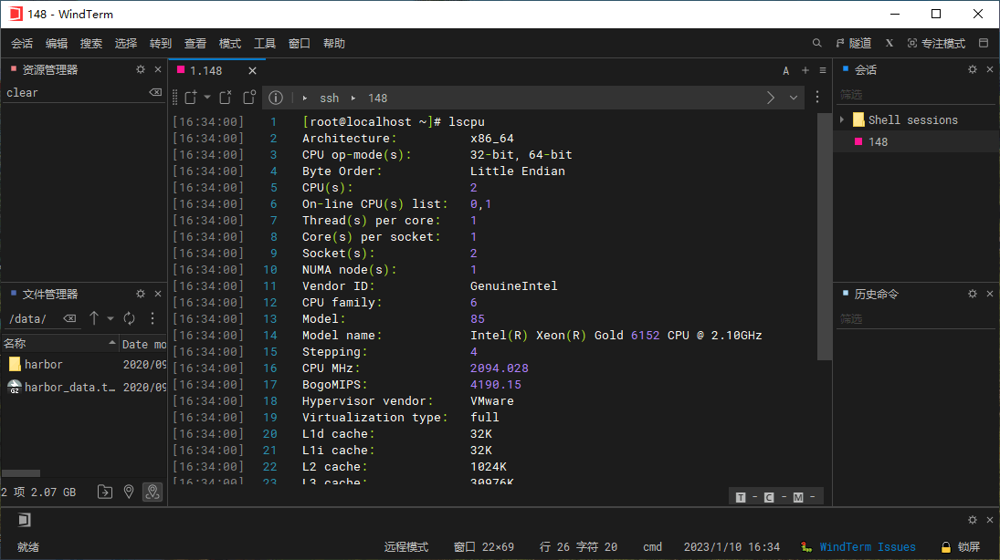
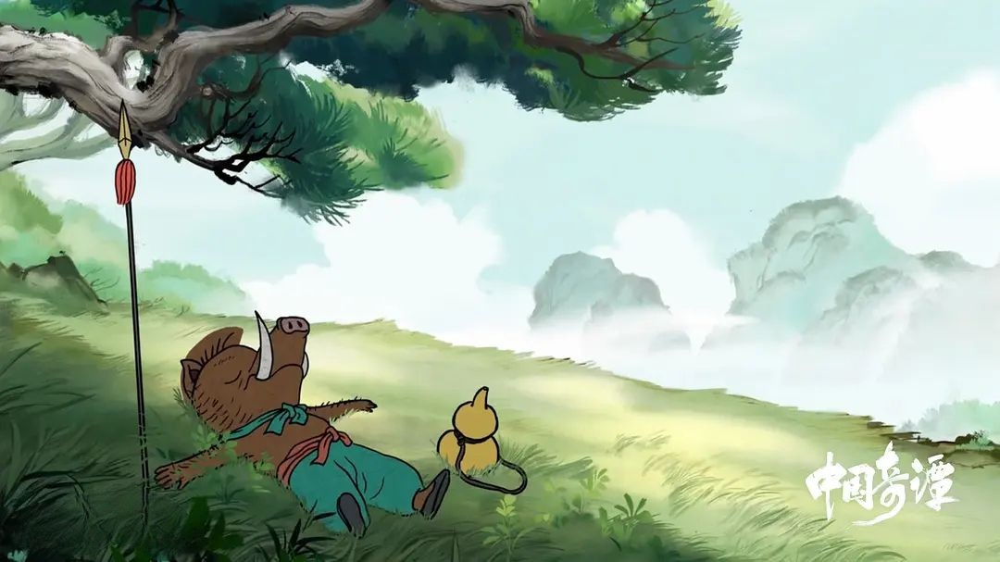
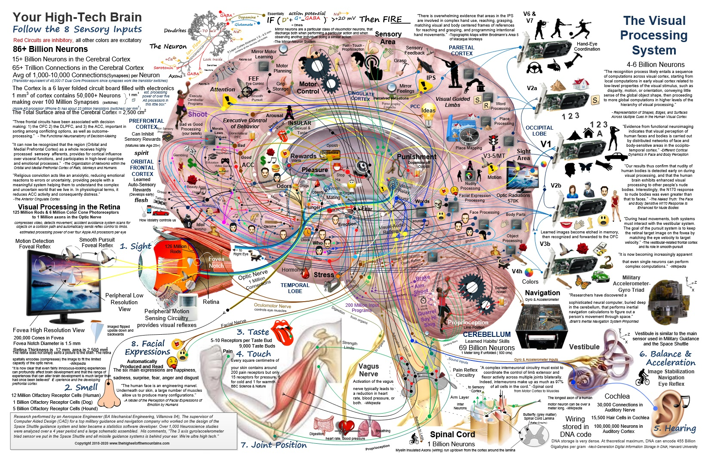
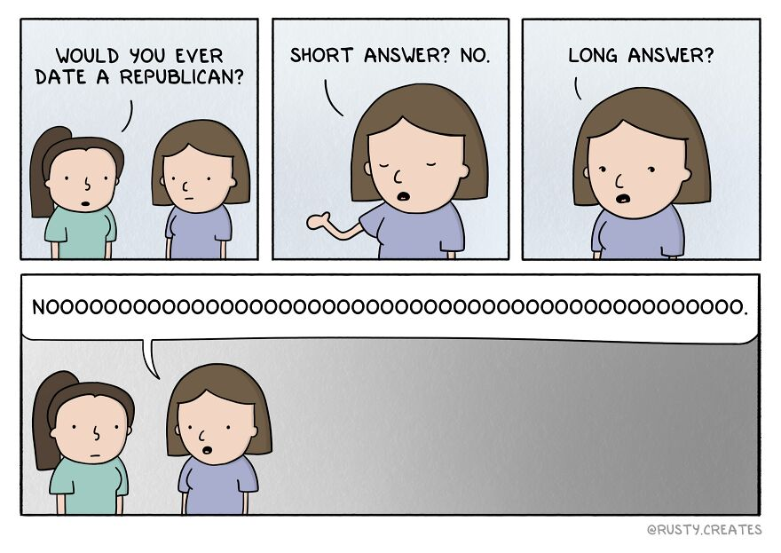
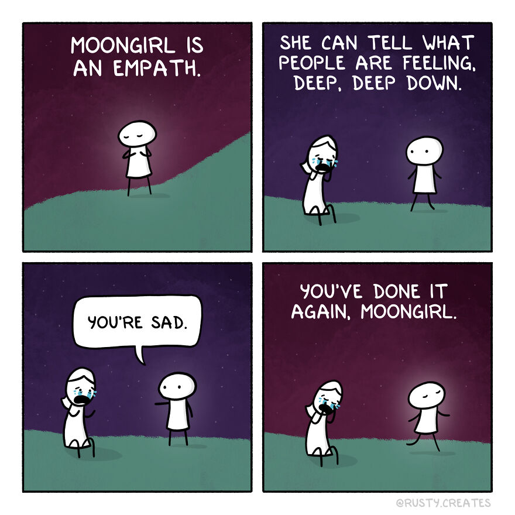
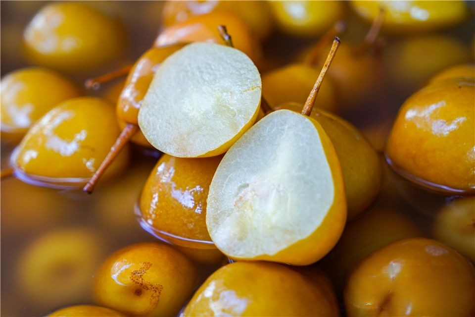

啰里啰唆周刊第46期：小妖怪的夏天

因本周六开始放春节假，下周四停刊一期，节后再见。
# 科技日常

## 1. 简单谈下Zigbee协议与Thread 协议
ZigBee技术是一种近距离、低复杂度、低功耗、低数据速率、低成本的双向无线通信技术。主要适合于自动控制和远程控制领域，可以嵌入各种设备中，同时支持地理定位功能。作为除了wifi、蓝牙之外，ZigBee是目前最重要的无线通信协议之一，主要应用于物联网和智能硬件等领域。

ZigBee是基于IEEE802.15.4协议发展起来的一种短距离无线通信技术，功耗低，被业界认为是最有可能应用在工控场合的无线方式。它是一个由可多到65000个无线数传模块组成的一个无线数传网络平台，在整个网络范围内，每一个ZigBee网络数传模块之间可以相互通信，每个网络节点间的距离可以从标准的75m无限扩展，具有最高250kbit/s的传输速率。

Zigbee联盟集各联盟成员之力，接连发布多个协议标准，意图通过统一的场景标准协议等多种方式解决业内各企业互联互通等一系列问题。

2009年8月，Zigbee联盟推出加强型Zigbee Home Automation应用标准。

2016年5月12日，Zigbee联盟联合Zigbee中国成员组面向亚洲市场正式推出最Zigbee3.0标准。Zigbee3.0 基于 IEEE 802.15.4 标准、工作频率为2.4 GHz(全球通用频率)、使用 Zigbee PRO 网络，由Zigbee联盟市场领先的无线标准统一而来，是第一个统一、开放和完整的无线物联网产品开发解决方案。

Zigbee的最大优点是低功耗，在低耗电待机模式下，2节5号干电池可支持1个节点工作6-24个月，甚至更长，相比之下蓝牙可以工作数周、WiFi可以工作数小时，并且，抗干扰性能高于Wi-Fi和蓝牙技术。

目前，米家智能设备就用的Zigbee，Zigbee在国内也普及了五六年了。最近几年逐渐兴盛的另一种协议，Thread 协议又是怎么回事呢？

Thread® 是一个为低功耗物联网（IEEE 802.15.4-2006 WPAN）设备设计的基于 IPv6 的网络协议。Thread 是一个新的网状网络协议，它并不依赖其它的 802.15 网状网络协议（如 ZigBee、Z-Wave 和 Bluetooth LE）。具有自组网、低成本、低功耗、高容量、高安全性、原生支持 IPv6 等特性，由谷歌在2016年左右起头提出和建立。

苹果新发布的HomePod mini即使用了Thread的协议。我对智能家居协议不熟悉，经过查询资料，Thread协议相比Zigbee，在功耗、速率和容量上的优势并不明显，主要优点在于极端条件下的断网使用。

Zigbee 定义了一套自己的网络层, 即 Zigbee 的数据包并不能被常见的IP交换机/路由器转发(支持 IP 的 Zigbee IP 就是后话了)。 Zigbee 的 Mesh 也仅限 Zigbee 本身的边界路由器和节点进行转发。所以构建 Zigbee 网络的时候, 就离不开 Zigbee Hub, 用于打通 IP-以太网/Wi-Fi 和 Zigbee 网络。而在 Thread 里, 对应的设备为 Thread 边界路由器, Thread 自己的 Mesh 网络基于类似的 IPv6 网络层转发。也就是说，到了 Thread时代, 哪怕边界路由器下线, 理论上 Thread 网络内的开关仍然能控制网络内的灯。甚至是断电断网之后 Wi-Fi 信号全灭这种极端情况, 电池供电的 Thread 设备仍然能完成自组网。

ref: 
[https://zhuanlan.zhihu.com/p/31268746](https://zhuanlan.zhihu.com/p/31268746)
[https://www.zhihu.com/question/431933659](https://www.zhihu.com/question/431933659)
[https://openthread.google.cn/](https://openthread.google.cn/)

## 2. He3-开发者必备的万能工具箱

内置超过 200 种实用工具，免费持续更新更多品类。包含智能搜索、类型识别、自定义快捷键等特性，让你的开发效率直接起飞。
类似[uTools](https://u.tools/)的开发者工具箱。

[https://he3.app/](https://he3.app/zh/)

## 3.中国新年网

[https://chinesenewyear.net/](https://chinesenewyear.net/)

外国公司制作的一个介绍中国春节和生肖等传统文化的网站，设计很精美。

## 4.WindTerm-跨平台 SSH/Sftp/Shell/Telnet/Serial 终端

跨平台 SSH/Sftp/Shell/Telnet/Serial 终端，用腻了SecureCRT、Xshell的可以来试试，c语言实现的速度快内存占用低。

功能基本完整，使用起来问题不大，但有一个缺点，ip写错导致连不上的情况下，不会较快报超时错误，界面会无反应很久（超过一分钟），然后提示连接被关闭，让用户比较困惑。

[https://github.com/kingToolbox/WindTerm/releases](https://github.com/kingToolbox/WindTerm/releases)

## 5. 视频网站的“蓝光”是怎么骗你的
在你斥巨资开通视频网站的会员之后，是不是发现自己终于可以享用“1080P蓝光”画质？然后又发现这个“蓝光”......好像也没有多清晰嘛！

所谓的“1080P蓝光”究竟是怎么回事？为什么有些1080P视频还是那么糊？视频网站的蓝光是真蓝光吗？怎么判断视频画质的好坏？MP4和MKV谁更清晰？

[https://weibo.com/tv/show/1034:4856042736255030](https://weibo.com/tv/show/1034:4856042736255030)

## 6.滴滴恢复新用户注册
1月16日，打车软件巨头滴滴出行发表声明恢复新用户注册：“一年多来，我公司认真配合国家网络安全审查，严肃对待审查中发现的安全问题，进行了全面整改。经报网络安全审查办公室同意，即日起恢复“滴滴出行”的新用户注册。后续，公司将采取有效措施，切实保障平台设施安全和大数据安全，维护国家网络安全。”
滴滴出行是在 2021 年 6 月底赴美上市后引发监管风暴，旗下应用遭下架，被禁止新用户注册。2022 年 7月网信办宣布了对滴滴的行政处罚结果：罚款 80.26 亿元，CEO 程维和总裁柳青分别处以 100 万元罚款。 

## 7.苹果发布新款 MacBook Pro 和 Mac mini，搭载 M2 Pro、Max 芯片
北京时间 1 月 17 日晚间，苹果宣布推出新一代 MacBook Pro 和 Mac mini。此次新款 MacBook Pro 依然拥有 14 英寸以及 16 英寸两种规格，搭载全新的 M2 Pro 与 M2 Max 芯片，提供了更为强大的性能。

新款 14、16 寸 MacBook Pro 的起售价分别为 15999、19999 元人民币；Mac mini 起售价为 4499 人民币。以上产品将于 1 月 19 日起接受预订，并将于 2 月 3 日正式发售。

M2 Pro 以及 M2 Max 芯片均采用 M2 芯片架构，其中 M2 Pro 拥有最多 12 核 CPU 和 19 核 GPU，以及最高 32GB 统一内存。M2 Max 芯片则拥有最多 38 核 GPU，内存最高可达 96G。
# 读书与影视分享

## 1.动画电影《中国奇谭》

《中国奇谭》是由上海美术电影制片厂、哔哩哔哩联合出品的原创网络动画短片合集，由陈廖宇担任总导演，速达、朱贝宁监制，于2023年1月1日起在哔哩哔哩播出，全8集。

《中国奇谭》由八个植根于中国传统文化的独立的故事组成：《小妖怪的夏天》《鹅鹅鹅》《林林》《乡村巴士带走了王孩儿和神仙》《小满》《玉兔》《小卖部》《飞鸟与鱼》。从北国风光到胡同巷里、从未来宇宙到乡土人间，纵览古今、展望未来，故事内容涵盖乡土眷恋、科技幻想、生命母题和人性思考，展现着中式想象力、承载着中国民族文化与哲学。

据说口碑很不错。

> 《小妖怪的夏天》为什么大受好评？以西游为题，借妖生讲人生。大圣实现了村民消灭妖怪的愿望，给猪妖留下了新的选择。这温暖，不仅照亮了猪妖的人生，也给我们留下了美丽。

## 2.美食论

春节了，介绍一本关于小吃的书《沿街尝，回家做-街边小吃炮制全攻略》。

本书将“小吃”诠释成了家乡的味道，童年街头巷尾的叫卖声，放学回家妈妈烧的饭菜香，还有记忆里外婆做香饽饽的背影。浓浓的思念和感动的温馨贯穿全书。看这本书不仅是学做小吃、学做菜，更是品味一种记忆和一种味道。真正将一本普通的菜谱做出了文艺气息。全书分为五个主要部分，分别为面条、饼类、家常菜和各类小吃。

制作过程和原材料都不复杂，比如：四川担担面、鸡丝凉面、陕西凉皮、酸辣豆花、鸭血粉丝汤、奶黄包、川北凉粉等。

当然，对美食，每个人有自己的理解，需要搞清楚一个概念，**知名小吃也不等于美食**。不同地域、文化的人，对美食的理解也天差地别。不过对于大部分没有外地生活史的人来说，此书对了解各地饮食文化也有一些帮助。

**总有很多人搞不清特产和美食的区别**，大部分能众所周知的特产，都不算美食，甚至离美食差了十万八千里。好比河南胡辣汤，第一口固然能让不少人记忆深刻,有辣有咸还有肉，但再入口，即感美食基因之贫乏。真正的美食，色香味意形养不可或缺。

故乡有一种小吃，号称当地特产，多糖多油，小时候总是馋能吃上一口，然而只有附近村落死了人办丧事，家父去帮忙，带回来一包才能尝到一两口。在08年前，是不少人走亲访友出游必带之物，后来吃的人越来越少了，卖的人也越来越少，再有出游或去外地之人，买这特产的人越来越少。故乡特产还有很多，有些依然是美食担当，有些已成老一辈回忆。如果有人让我介绍故乡美食，我是断然不会再介绍这一小吃了，美食有太多选择了。很多特产，是有一定历史原因的，比如当地的气候和历史上的贫穷。

**如果不是物产之特殊，走不出当地和当地人的特产，断不能算美食。能走出当地的，也不一定是美食**

能走出当地的，也不一定是美食，比如武汉热干面，其最大的优势是便宜管饱，在新一线城市不到9元即可吃半饱12元吃饱15元吃撑20吃到住院，是所有面食中最便宜的，论口味离美食还有很大距离。最良心的是热干面没有汤，不像各种烩面和饸饹面，一碗面，60%是水，20%是青菜豆皮等杂物，最多只有20%是面，18元尝个味，又贵又不地道。

热干面是广大贫下中农的饱腹餐，靠的是量大便宜，而不是美。我年轻困顿的时候，在北方某新一线城市吃了两年的热干面和沙县小吃，上午沙县，下午热干面，又恐怖又深刻的回忆。

很多缺少经验的游人对所谓地方美食失望和不解及争议，就是没理解特产和美食的区别。

也有很多特产和美食，是我所说的困于物产之特殊，手法之繁琐，终困于一地，这些后面慢说。

# 图论

## 1.Engineered for Human  Life

作者完全是站在还原论的哲学角度，用目前所知道的高科技和新产品，尽力描述人类大脑的功能。看得出，作者是一个思维缜密、极其有耐心的人。 有兴趣可以到他家的网站上去看一下。其它图片因体积太大，可以去官网下载。

ref:[http://thehighestofthemountains.com/](http://thehighestofthemountains.com/)

## 2.rustycreates

[https://www.instagram.com/rusty.creates/](https://www.instagram.com/rusty.creates/)

## 3.不断放大的图片
比较有趣的不断放大图片的效果。

[https://zoomquilt.org/](https://zoomquilt.org/)

# 谈天说地

## 1.Could I Survive the ‘Quietest Place on Earth’?
Legends tell of an echoless chamber in an old Minneapolis recording studio that drives visitors insane. I figured I’d give it a whirl.

In a leafy Minneapolis neighborhood under a thick cloak of ivy stands a modest concrete building. Contained within the building is silence exceeding the bounds of human perception. This hush is preserved in a small room, expensively engineered to be echoless. Certain people find the promise of such quiet irresistible; it entices them, like a soundless siren call, to visit the building at great personal cost. The room of containment, technically an “anechoic chamber,” is the quietest place on the planet — according to some. According to others, it’s more like the second-quietest. It is quieter than any place most people will ever go, unless they make a point of going to multiple anechoic chambers over the course of a lifetime.

[https://www.nytimes.com/2022/11/23/magazine/quiet-chamber-minneapolis.html](https://www.nytimes.com/2022/11/23/magazine/quiet-chamber-minneapolis.html)

## 2.浸梨
春节就要到了，最近有不少抖音视频提到了东北的冻梨，在云南曲靖和四川凉山的部分地区，有一种梨叫浸梨，比冻梨制作更复杂，口感更好吃。

浸梨，俗称尿（读音sei）浸梨，当然，它的制作和尿没有关系。

云南的一些地方，人们喜欢在秋季精选成熟的、无破烂、无虫眼的、个儿比较均匀的甜酸梨（又名酸大梨）用冷开水加盐、糖、甘草浸泡起来，到春节前后再捞出来食用。这就是有名的浸梨。浸梨色泽鲜艳，呈紫红色；味道酸甜可口，略带咸味，独具特色。买回的浸梨必须尽快吃完，如果存放时间长了，就会变色变味（颜色由紫红色变成紫黑色，吃时有苦味），从而失去了原有的风味。

浸梨需要浸泡长达3-4个月，用于浸泡的水有盐有糖，时间长了水的颜色和气味就像尿一样，这就是“尿浸梨”的来历。但实际上，浸梨本身吃起来并没有尿骚味。

浸梨的神奇之处就是尽管浸泡长达3-4个月，但并不会腐烂、变质。其原材料则为主产云南、四川、贵州、河北、东北的酸梨（安梨）。

冻梨则是将普通白梨冰冻变成乌黑色，洗净之后，就能吃了。冻梨一般是由花盖梨、秋白梨、白梨、尖巴梨冰冻而成（延边地区是由“苹果梨”冰冻而成），食用时，将冻梨置凉水中浸泡，待化透后捞出可食。 冻梨的特点是口感绵密。

冻梨制作最快只需要一天即可，而浸梨制作则需要长达三四个月，当然二者口感也差距很大。两者的相似之处是浸梨捞出来后，接触空气时间长了（一天后），就会变成冻梨一样的黑色。

网上的抖音视频大多源自90后东北人，其冻梨制作是速成简化版。老东北人的冻梨制作更接近云南地区的浸梨手法，也是一种长期储存手段，只是步骤较简单，制作工艺也没那么复杂。

**东北饮食文化与西南饮食文化，是距离最远，但相似度较高的两个文化。**

浸梨或冻梨文化，通常认为是当年冬季水果比较稀少时的一种储存方法，当然，这也跟当地比较奇特的饮食文化有关。

## 3.上了这么多年的网，你是终止谣言的智者，还是传播谣言的帮凶？
上了这么多年的网，你是终止谣言的智者，还是传播谣言的帮凶？
面对泥沙俱下的信息，你是头脑清醒、明辨是非，还是良莠不分、身受其害？
下面有50个观点，你不妨一个个地读下去，一边读，一边计个数：
如果觉得某一个是无稽之谈，胡说八道，傻瓜才信，就累计0分，
如果觉得某一个观点和你的想法一致，或者觉得它很有道理，就累积2分；
如果觉得某一个观点闻所未闻，你可以试着搜索一下，再计分，如果仍然无法判断，就累积1分——如果懒得搜索，就蒙一个，根据蒙的结果计0分或2分。

1. 星座与性格的联系虽然没有科学解释，但在多数时候是灵验的，是一种统计结果。
2. 进化论是错的，人类不是猿猴进化来的。
3. 可能是某种未知的超级文明创造了地球上的生命。
4. 在人类出现之前，地球上还一轮，甚至几轮古老的文明，但他们都灭亡了，所以我们不知道。
5. 某个国家的政府与外星人保持着秘密联系。
6. 犹太人、共济会、光明会……某个神秘的群体正在幕后操纵这个世界。
7. 百慕大三角仍然是未解之谜。
8. 收入微薄的穷人不用交税。
9. 某些食物一起吃，其中的成分会相互反应，会产生毒性，也就是所谓的“食物相克”。
10. 比起工业制品，天然和手工的东西总是更安全、更健康、更环保。
11. 虽然科技不如现代，但古人关于人生的智慧要比现代人更加深邃。
12. 为了使皮肤保持弹性，我们需要补充胶原蛋白，比如吃富含胶原蛋白的食物，或者使用含有胶原蛋白的护肤品。
13. 美国登月是一场骗局，目前正在被怀疑者揭穿。
14. 相比有机食品，转基因食品更不健康。
15. 人类的大脑只开发了很小一部分，绝大多数没有得到充分利用，如果能够充分开发闲置的大脑，我们将展现出不可思议的能力。
16. 食物分酸性和碱性，水果分公的和母的。
17. 月球是空心的，可能是外星人的秘密工程。
18. 有些奸商会用避孕药浸泡水果，给水果催熟。
19. 鬼可能以某种方式真实存在，比如鬼可能是脑神经的电磁活动滞留在遗物上。
20. 肝脏在晚上11点到1点之间排毒，所以要在11点前入睡才能保持健康。
21. 风水可能以某种科学无法解释的方式影响我们的运气。
22. 如果没有证据否认一个理论，那么我们最好姑且相信它。
23. 几百岁的野生人参和灵芝具有极高的药用价值，能用来挽救濒死的病人
24. 鱼的记忆只有七秒。
25. 反季节水果在种植时使用了激素，会导致儿童性早熟。
26. 龙和凤凰都有可能是已经灭绝的物种，但是古人见过它们。
27. 科学是一把双刃剑，它让生活更加方便的同时，也让现代人的身体更不健康了。
28. 有的不法分子会在酒店迷晕受害者，把他的肾割下来拿去黑市上卖。
29. 古人掌握着许多现代科技无法实现的精密工艺，只可惜失传了。
30. 微波炉通过辐射加热食物，所以我们应该在微波炉工作时尽量远离它。
31. 即便不考虑物质和人际关系上的奖励和惩罚，做好事也可以改善运气，做坏事仍然会导致厄运。
32. 科学总有解释不了的事情，为了更好的认识客观世界，我们不妨通过宗教、巫术、冥想等古老途径寻求启示。
33. 性交之后，精子会进入女性体内，被她的生殖系统吸收，也就把基因混入了她的生殖系统。所以女性怀孕，之前与他性交过的男子的基因都会融入胎儿，这让某些孩子不像爸爸，却像妈妈的前任，这在生物学上叫做“先父遗传”。
34. 不含食品添加剂的食品更安全、更健康。
35. 世界上没有人真正懂得量子力学，因为量子力学出现了一些与意识有关的实验现象，暗示了唯心主义未必是错的。
36. 宗教都是教人向善的，所以传播宗教可以让社会变好。
37. 新冠病毒是美国人发明的生物武器。
38. 基因突变可以让人获得超能力。
39. 世界上没有纯粹的偶然，未来一定被现在的某种现象预兆着，所以有些人的占卜非常灵验。
40. 西方历史是伪造的，古埃及和古希腊的建筑和文物都是现代欧洲人做的赝品，古希腊的哲学家也都是现代欧洲人杜撰的。
41. 埃及人的技术水平造不出金字塔，有其他力量帮助过他们。
42. 中国功夫非常厉害，肌肉力量不占优势的武术家可以轻松打败只会蛮力的搏击运动员，只可惜大部分中国功夫都失传了。
43. 《山海经》是一份上古的世界地图，涵盖了非洲和美洲的山水物貌。
44. 有些不法商贩会用人造鸡蛋冒充真鸡蛋。
45. 《易经》可以指导实践，我们应该发掘其中的智慧。
46. 虎骨可以补肾壮阳，燕窝可以滋阴润肺。
47. 孕妇需要额外的防辐射设备，并且尽量避免接触微波炉和WiFi信号。
48. 一些古老的著作，比如《推背图》、《璇玑图》、《圣经·启示录》、《诺查丹玛斯预言》，暗藏了人类未来的命运，但是我们很难解读出来。
49. 玛雅人预言过世界末日。玛雅人预言过世界末日，虽然没有在2012年应验，但也可能是我们没有算对时间，世界末日仍在不远的未来威胁着人类。
50. 各种宗教里宣称的神很有可能真实存在，即便不是以那种魔法的方式，比如可能是外星人，或者甚至隐藏在地球上的另一种智慧生物。

最后累计结果，我们姑且称为“网蠢得分”，它在0分到100分之间，
一个人的分数越低，他分辨是非的能力越强，如果接受了合格的高等教育，分数应该是0分。
分数在15分以内，仍然是一个明辨的人。虽然在很多时候不求甚解，对道听途说的消息缺乏警惕，会姑妄言之姑妄听之地接受一些谣言，但只要反省一下就能很快解开。
如果分数在15分到30分以内，就需要留意自己的信息获取渠道了，你已经陷入了某种信息茧房，只愿意听取自己爱听的信息，不愿意接受反思和批判，这让谣言可以轻易攻陷你的大脑。
那些分数超过了30分的，仍然可能是个合格的劳动者，在自己的岗位上发光发热，但如果你有孩子，请不要亲自教育他，实在迫不得已，照本宣科地辅导一下小学作业就可以了，千万不要给孩子讲什么道理，从小就被荼毒很难纠正。

注意，这是一条周末消遣的博，上面的评分标准并没有什么学术依据。但这50个观点无一例外都是毫无根据的胡说八道，没有任何商榷的余地，别争，争就是我对。 

ref:[https://weibo.com/u/3949671123](https://weibo.com/u/3949671123)

## 4.花100欧元可成为爱沙尼亚的「数位居民」
花100欧元即可成为爱沙尼亚的「数位居民」，没有居留权、没有签证，但可以开银行帐户、设立公司、金融支付。爱沙尼亚的公司，居然有三成是数位居民创立的。

[https://theinitium.com/article/20230112-international-chinese-estonia-e-id/](https://theinitium.com/article/20230112-international-chinese-estonia-e-id/)

# 一句话快讯

1.1月10日，央行发布最新的金融和社会融资数据显示，2022年全年，人民币存款增加26.26万亿元，同比多增6.59万亿元。其中，住户存款增加17.84万亿元。2022年新增居民部门储蓄较上一年有较大规模增长

2.深圳就建立育儿补贴制度公开征求意见：生育一孩亦有补贴，生育第三孩累计补贴1.9万元。补贴截至该子女满3周岁之日止发。超过三个子女的，按照第三个子女计发。

3.优衣库的母公司迅销集团周三表示， 将把日本全职员工的年薪提高至多40%。该公司在一份声明中表示，该计划将影响公司总部和门店的员工。

4.据上海警方通报，王思聪一行4人于1月11日误以为路人偷拍，将路人殴打至鼻部骨折被提请行政拘留。

5.1月17日，在国务院新闻办举行的2022年国民经济运行情况新闻发布会上，国家统计局局长康义介绍称，去年末全国人口141175万人，比上年末减少85万人。这也是我国人口自1962年以来（即近61年来）首次出现负增长。 
# 言论
1.跟一个上海人聊天：你看，农民都盖楼房了。还是农民有钱啊。
我：看农民是不是有钱不能看楼房，因为楼房很有可能是借钱盖的。
他：那有多少钱办多大事，还不是好面子的了。
我：看农民的生活，不能看楼，要看他家的厕所和厨房。
他：什么意思？
我：看厕所是旱厕还是蹲坑还是马桶。旱厕也分好几种，有的简单搭在屋后，有的水泥砌的。
他：那你这不对，我妈来我家，还是习惯蹲坑的，不习惯马桶。
我：那不一样。城市的蹲坑和农村的不一样。还有，厨房，你得看农民每天吃的啥，用啥做饭。他们是用柴火灶，还是半柴火灶半燃气灶，全燃气灶。
他：我觉得柴火灶很香。贵州有道菜XXX，就要用柴火做才香呢。
我跟他说，我12年、13年上大学的时候，回家还要到旱厕掏粪。旱厕改为密封式（好像沼气）蹲坑还是这两年的事。他没回我，换了个话题。
一些城里人，特别是一线城市的，一直靠一半现实一半想象认识农民和农村。

ref:[@putaobanzhuan](https://m.cmx.im/@putaobanzhuan)

2.“不像”很重要。一个人“不像大人”，“不像女人”，“不像老师”，“不像学生”……“像”意味着一种规训、一种霸权，诱导着每个个体纳入一种流水线道德。

ref:[atreides1030](http://www.douban.com/people/atreides1030/status/4106490245/)

3.高校的生涯规划别再虎头虎脑搞点心理辅导了
怎么租房怎么看合同五险一金社保怎么搞这些通通安排上，能让80%的应届生少受很多社会的拳打脚踢。

ref:[@Moon法学申请研究所](https://weibo.com/u/7402780783)

4.“酒桌文化”的乐趣，就是知道你要“高情商”推辞，然后“上位者”笑嘻嘻地让你知道“高情商”的无用……或者说对方享受的正是你绞尽脑汁思索“如何高情商”的乐趣。上位者欣赏你的小技巧，感觉有趣，看自己心情要不要放过你。这才是权力的本质。
破解“酒桌文化”需要的是“低情商”而不是“高情商”。“低情商”很无聊，上位者感觉无趣，下次就不找你了。

ref：[@荞麦chen](https://weibo.com/u/2262351592)
# 联系方式

啰里啰唆是一份针对互联网和生活爱好者的数字杂志，旨在发现和分享一切有趣的东西。话题不固定，每期大约十五分钟阅读量，暂定每周四发布。部分内容来自互联网采编，如果为有来源的转载，均会注明转载地址或保留水印。

这是一个关注人文和科技的newsletter。

使用方法建议或素材提供

频道：notonlyshare

邮箱：auokyob@outlook.com

github地址：[https://github.com/iminto/luoliluosuo-weekly](https://github.com/iminto/luoliluosuo-weekly)