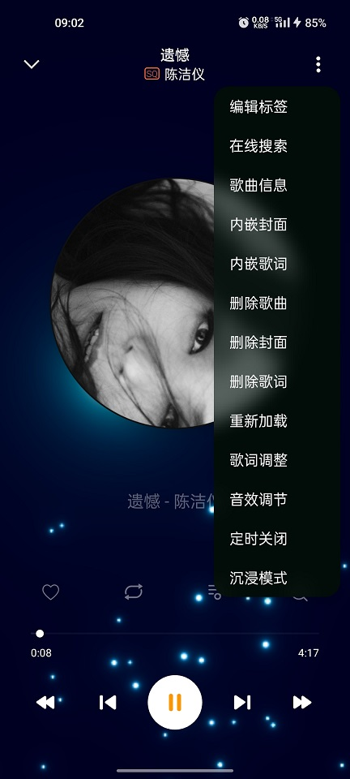
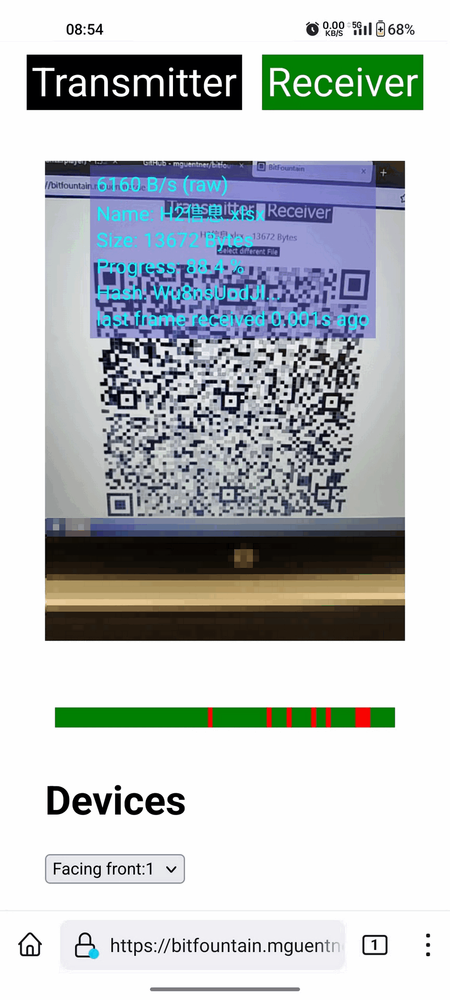
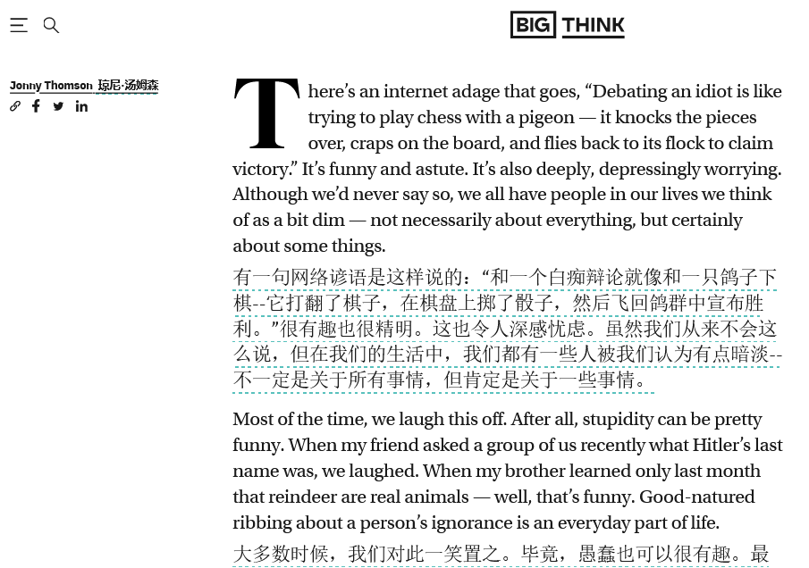
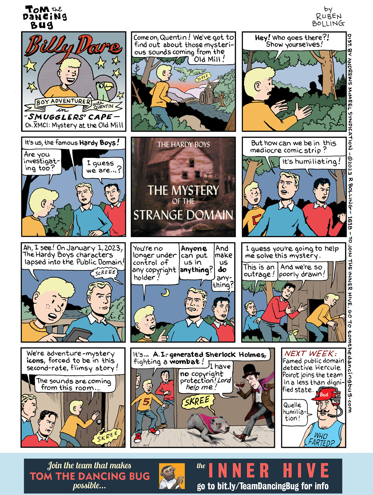
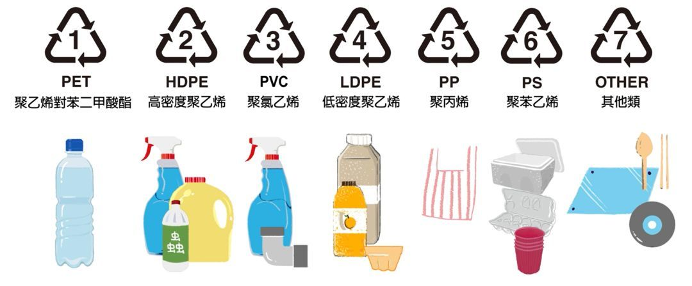
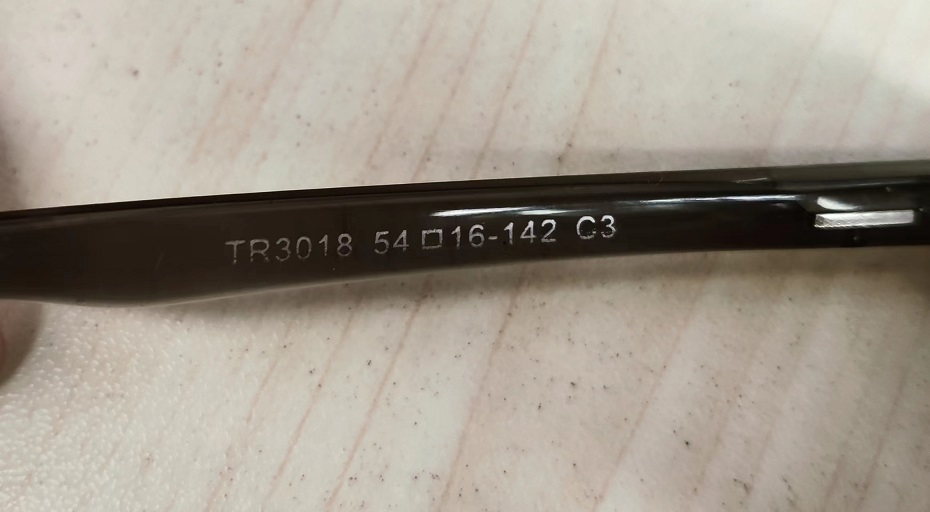
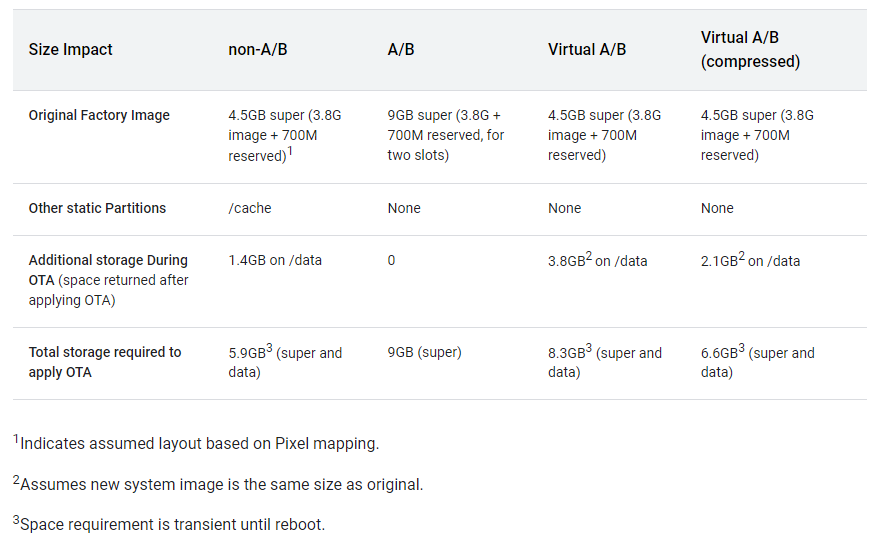

啰里啰唆周刊第48期：云根浮浪花，生气来何处

# 科技日常

## 1. NeoDB | 书影音标记 – 豆瓣、GoodReads 和 Google Book 的替代品

NeoDB 致力于为联邦宇宙居民提供一个自由开放互联的书籍、电影、音乐和游戏收藏评论空间，NeoDB 通过 Mastodon 登陆。
NeoDB 支持豆瓣， Goodreads， The Movie Database， Steam， Spotify， IMDB， Bangumi， Bandcamp 数据导入。

NeoDB 的优点：
    免费；
    支持多个数据库，聚合各平台的优势内容，
    对中英文内容都支持的很好；
    Mastodon 登陆，能看到 Mastodon 好友的动态，兼顾社交属性；
    学习成本低；
    小众，同温层。

NeoDB 也有很多缺点：
    NeoDB 的开放性有所欠缺，由站长 [@alphatownsman](https://github.com/alphatownsman) 一人维护；
    「导出个人数据」功能在优化中；
    豆瓣和 Goodreads 有丰富的扩展和插件；
    小众，欠缺社区活力。

ref:
[https://anotherdayu.com/2023/4434/](https://anotherdayu.com/2023/4434/)
[https://neodb.social/](https://neodb.social/)
## 2. Rplayer 本地音乐播放器
Rplayer 是一款集大成的本地音乐播放器。它除了遵循 Material Design 的设计规范且没有广告外，还添加了丰富的外观自定义选项和网络歌词。

Rplayer属于国产个人作品，且免费不含内购、无广告，安装包体积仅8MB，最近更新于2022-11-19。

Rplayer是对音乐文件标签支持最好的App，除了编辑艺术家、专辑等常用ID3标签外，还支持编辑歌词、封面，将自动获取的外部歌词嵌入到音乐文件中。

播放界面支持烟花、水波、模糊等特效。比起之前提到的Aplayer和现在比较火的椒盐播放器，它的主要优势在于界面颜值高、标签编辑功能完善。但有一个主要的缺点，就是主界面不支持“播放下一首”功能，只能在播放页面切换，这点在使用习惯上和其他软件有较大区别。

当然，作为本地播放器，是不支持网络功能的，如果需要支持NAS或webdav的，建议使用 Eddict Player。Eddict Player 在功能性上非常丰富。它不但能够播放 FLAC、APE 等各种格式的无损音乐，也支持直接通过 USB-C 外接专业的 DAC 设备来进行输出。除了内置了索尼精选 Hi-Res 音乐商店外，Eddict Player 还有 Wi-Fi 传歌、SyncLink 等发烧友们可能会常用到的功能。

注：因该App属于非商业公司开发，需要到酷安下载（需要去酷安官网下载酷安App，在手机自带应用商店下载到的酷安App是不包含应用下载功能的）。直链地址 ：[https://www.coolapk.com/apk/com.r.rplayer](https://www.coolapk.com/apk/com.r.rplayer)

## 3. bitfountain-使用二维码传输数据
如果在某个位置有一台 PC ，这台 PC 是完全离线的（以太网，蓝牙，USB等），也不能连接外部存储设备，输出设备只有显示屏，是否存在一种方法能将 PC 中的任意文件传输到外部。

那就只有二维码了，把文件转为二维码动画，然后拍摄动画，再逐帧转为二维码，还原为数据本身。

文件转二维码动画技术上不难，难点在于二维码动画还原为数据，动画的帧率和拍摄屏幕导致的摩尔纹都会导致得到的视频数据有缺失，需要反复进行完整性校验，所以数据传输会表现为刚开始比较快，越到后面越慢，而bitfountain的优点就在于其实现完全考虑到了这种情况，进行了比较完善的处理。我试了一个14K的xls文件，大约需要20多秒的处理时间，主要是后期的校验比较耗时，平均1KB/S的传输速率很慢，但是从内网拷贝到外网一些复杂的审核流程，在某些场景下还是有实用价值的。

当然，离实际使用还有些距离，比如缺乏离线手机App端。该功能完全通过Js代码实现，体积较大，我尝试过把离线网页打包成APK，但是扫码接收有点问题，遂放弃。

[https://github.com/mguentner/bitfountain](https://github.com/mguentner/bitfountain)

## 4. Plasmo-构建现代浏览器插件的框架
Plasmo 框架是一个开源的浏览器扩展 SDK，支持所有主流的浏览器，构建你的插件，无需担心配置文件编写和构建浏览器扩展时的奇怪特性，plasmo 帮助我们屏蔽了底层的差异。支持 Recat + Typescript,声明式开发热加载，自动化部署。

plasmo依赖Node.js 16+和NPM打包环境。

[https://www.plasmo.com/](https://www.plasmo.com/)
[https://juejin.cn/post/7138820996840030215](https://juejin.cn/post/7138820996840030215)

## 5. LibreOffice 7.5 已正式发布
LibreOffice 7.5 已在 LibreOffice 7.4 发布 6 个月后正式发布，这是 144 位贡献者齐心协力的成果。
LibreOffice 有了新的应用程序图标，新版图标是彩色的，更明亮一些，看起来也更现代化一点。

此版本还包含大量优化，更多详细信息，请参阅 [官方 LibreOffice 7.5 发行说明](https://wiki.documentfoundation.org/ReleaseNotes/7.5)。

最新版本 [下载地址](https://www.libreoffice.org/download/download-libreoffice/)。
## 6.Win10关闭（隐藏）“最近使用的文件”的功能

win10系统默认打开的“最近使用的文件”功能，它可以让我们快速打开之前访问过的文件，但另一方面又让我们的隐私予以泄露，你看过哪些文件，别人通过“最近使用的文件”的功能就能看到。

1、进入资源管理器 。    2、在菜单栏找到并打开“文件夹选项”界面，切换到“常规”选项卡，从“隐私”栏目中清除勾选“在‘快速访问’中显示最近使用的文件”和“在‘快速访问’中显示常用文件夹”两个项即可。

很多小功能，看着烦眼，又懒得处理，我都纳闷为啥能忍这种功能好几年，直到忍无可忍。。。

## 7.restic Linux备份软件

Saving a backup on the same machine is nice but not a real backup strategy. Therefore, restic supports the following backends for storing backups natively。

Local directory
sftp server (via SSH)
HTTP REST server (protocol, rest-server)
Amazon S3 (either from Amazon or using the Minio server)
Microsoft Azure Blob Storage
Google Cloud Storage
And many other services via the rclone Backend

使用GoLang开发，跨平台支持，体积仅8M。

[https://restic.net/](https://restic.net/)

## 8.两仪-轻量级的 Android 容器
两仪就是一个轻量级的 Android 容器。它可以在 Android 系统上以一个普通 App 的身份（免ROOT）来运行一个相对完整的 Android 系统。并且它支持 Android 8.1 ~ 12。两仪内部 Android 系统版本为 Android 8.1。

可免ROOT在设备上使用 ROOT 功能，用作安全研究等，部分支持 Magisk 模块，甚至可以在免 ROOT 的手机上刷入 ROM，体验玩机的乐趣。

当前最新版本2022年10月发布的0.7.5，体积约200M。0.5及之前版本部分开源。

**注意**：如果你主机是Android12或Android13系统，需要使用ADB进行一些权限处理，否则无法使用。某些系统下会报“writing to settings requires:android.permission.WRITE_SECURE_SETTINGS”错误，需要在开发者选项里，把“USB调试（安全设置）"打开或者把"禁止权限监控"打开。

另外，所谓支持刷入自己的ROM，并不是刷入任意第三方ROM（比如lineageOS等），而是指导入“在两仪ROM的基础上制作的满足两仪ROM格式的ROM”。

[https://www.coolapk.com/apk/io.twoyi](https://www.coolapk.com/apk/io.twoyi)

## 9.沉浸式翻译浏览器插件
沉浸式网页双语翻译是一款支持Deepl、谷歌、 腾讯翻译君、火山翻译、彩云小译等多种翻译服务的插件，以双语的形式来为你在网页上面显示两种语言的内容，方便你在网页上面完成对照翻译的内容。

智能识别网页主内容区，区别于同类插件翻译整个网页所有的区域，这极大的增强了翻译后的网页阅读体验。类似浏览器的沉浸式阅读模式，所以该扩展被命名为“沉浸式翻译”。双语显示，中文/英文对照着看（按照段落分割，或者自定义段落长度，自动为长段落按照每句话换行）。

效果如下：

配合 epub 在线阅读网站[https://epub-reader.online/](https://epub-reader.online/) 或 [https://readwise.io/read ](https://readwise.io/read) 即可实现双语阅读国外电子书。

项目主页：[https://immersive-translate.owenyoung.com/](https://immersive-translate.owenyoung.com/)

## 10.去中心化社交应用Damus上线
2月1日，Twitter 前 CEO Jack Dorsey 发推称，基于去中心化社交协议 Nostr 的社交产品 Damus 和 Amethyst 已分别在苹果 App Store 和谷歌 Google Play Store 上线，同时网页端 snort.social 也正式开放。其中，IOS版功能最为完善。

消息一出，引发大量关注。Damus 是一个基于去中心化社交协议 Nostr 的、允许用户控制的社交网络，支持加密消息传递、比特币闪电小费等功能。Damus 的外观设计和使用感受跟 iOS版的 Twitter 非常相似。Damus的注册并不像传统的社交软件需要通过手机、邮箱或者是实名认证进行注册。Damus注册通过公钥和私钥进行完成（这里可以把公钥看作是用户名或者银行账户，把私钥看作是个人密码）。

但是，上架之后，随着Damus在中文社区中的爆火，中国用户的大量涌入，也让Damus几乎复刻了当时Clubhouse一样的名场面：充斥着中文与中国用户，还有不少用户抱怨Damus全是中文广告。以及“Damus微信交流群”从一个开放的社交网络重回封闭社交网络这样滑稽的情况发生。和Clubhouse一样昙花一现，似乎已是注定结局。

2月3日，Damus在中国区App Store已被相关部门勒令下架。

## 11.Google 宣布了挑战 ChatGPT 的 AI 服务 Bard
2 月 6 日，Google 发布 The Keyword 博客，CEO Sundar Pichai 公布了 AI 聊天机器人 Bard，该项目由 LaMDA（面向对话应用的语言模型）提供支持。Google 将在今天向受信任的测试者开放 Bard，预计未来几周后提供给公众。目前发布的 Bard 采用了轻量版 LaMDA，需要的算力更低，可以开放给更多用户以收集反馈。Google 期望让 Bard 的回复基于现实世界信息，在质量与安全性上达到高标准。未来 Google 搜索中也将引入 AI 引擎。

[https://blog.google/technology/ai/bard-google-ai-search-updates/](https://blog.google/technology/ai/bard-google-ai-search-updates/)

## 12.arXiv 上研究报告指中国 Android 手机收集了过量数据

英国和爱尔兰大学的研究人员在预印本平台 arXiv 上发表研究报告《Android OS Privacy Under the Loupe -- A Tale from the East》，分析了一加、小米和 Oppo Realme  上预装的系统应用软件，假定用户没有登陆，退出个性化和分析，没有使用任何云储存等第三方服务。这些手机预装了 30 多个第三方软件包，其中小米  Redmi Note 11 预装了百度输入法、科大讯飞和搜狗输入法等，OnePlus 9R 和 Realme Q3 Pro  预装了百度地图和高德地图，此外还捆绑了各种新闻、视频和在线购物应用。研究人员发现，即使手机没有插入 SIM 卡或 SIM  卡属于不同运营商，手机仍然会向厂商、百度和中国移动网络运营商发送个人身份识别信息，传输的数据包括 IMEI、MAC 地址、GPS  坐标、用户配置文件和社交联系（通话/短信历史/时间、联系电话号码等）。研究人员称，每当打开预安装设置、便签、录音机、电话、消息和相机应用时，小米的 Redmi 手机都会向 tracking.miui.com/track/v4 发送 post  请求，不管用户如何设置选择退出跟踪都会发送。研究人员注意到，国行版的 Android 手机预装第三方应用数量是其它国家 Android  手机系统的 3-4 倍。

[https://arxiv.org/abs/2302.01890](https://arxiv.org/abs/2302.01890)

> arXiv是由康奈尔大学运营维护的一个非盈利的数据库，由于免费，学术研究人员可以在其他顶会或者期刊没有录用之前，将自己最新的研究成果发布到该平台上，一方面是为了扩大宣传提升自己的影响力；另外一方面是为了保护自己的科研成果，arXiv可以证明论文的原创性。arXiv主要涉及物理、数学、计算机科学、定量生物学、定量金融、统计学、电气工程与系统科学、经济学等领域。

# 读书与影视分享

## 1.长篇小说《少年巴比伦》
《少年巴比伦》是作家路内创作的长篇小说，讲述一个“不良”青年路小路的青春爱恋，及其成长过程中遭遇的无奈与感伤。

《少年巴比伦》作为路内“追随三部曲”之一，最初发表于2007年第6期的《收获》杂志，这部小说以幽默粗俗的语言、调侃不屑的语气，叙述了路小路等一群生活在城市，卖命于工厂的底层人物的爱情、友情、事业。青春故事在十年之后的具有现代气息的上海被作者重忆，而承载小说人物过往岁月的地点却是在十年前的拥有泛黄气味的戴城。历史的变迁让“香甜而腐烂的青春”随时光远逝，却从未让它离开戴城。小说在结局安排路小路回到戴城，与小噘嘴、长腿、小李重逢，用友情的圆满表达路内对荒芜青春的肯定，对戴城的依恋。路内的城市书写不歌颂小城的繁华经济，不表现人在经济发展以后的富足生活与饱满的精神状态。他将工厂与工人作为反映城市的一面镜子，侧重写人在城市中围困的日常生活以及人如何在城市中寻找自己的位置。

该小说有同名改编电影。

> 如果你之前没有读过这两本小说(《少年巴比伦》、《追随她的旅程》)，请一定要去读一下，相信我，这两本书足够引人入胜，我的阅读算是相当广泛，所有有点名气的中国当代小说作家我都有拜读。而这两本书——在我心里就是中国最好的青春文学。这也是我唯一一本安利成功的书，在隔壁寝室轮流着借了一遍。我同学一直都觉得我是那种非常偏门的文青，总之我推荐的书、电影他们都看不下去。就连我推荐的游戏他们都玩不下去。光看书名大家都觉得这书挺傻逼的，但是读了之后确发现，路内已然自称一派，把所有号称「青春」的小说远远地甩在身后。

> 我最好的朋友小蔡说这本书表达的是一种黏腻的哀伤，我觉得他说得还蛮精准的。 我个人认为那些流传广泛的伟大文学作品，很多时候表达的东西，都是伤怀。爱丽丝门罗的伤怀是对于生活和人那种漫长的磨损和消耗，《红楼梦》的伤怀是千红一哭，万艳同悲，白茫茫一片大地真干净，马尔克斯的伤怀是面对厚重的宿命与时间的荒诞与沉重。《少年巴比伦》里的那种伤怀，是在工厂里的，不知道该说是虚度还是不是虚度的时光的流逝，对于却看不到出路，而且注定要倾覆的一种生活的无奈。但是路小路的底色是戏谑的，是满是笑声的，他没有像《大象席地而坐》那样以灰色的色调，阴郁的长镜头面对这个令人感到无望和沉闷至极的世界。他喜欢笑，笑声不给答案，但是笑声让我们觉得安稳。所有焦虑和绝望，隐忍和渴求，都被埋在生活中的搞笑琐事和花一样美好的爱情下面轻轻地盖着。看这本书的时候我也确实好几次笑出声来。

[https://www.gcores.com/articles/160833](https://www.gcores.com/articles/160833)

## 2.2018年张艺谋电影《影》-水墨风+开放式结局

《影》是由乐视影业（北京）有限公司、上海腾讯影业文化传播有限公司、完美威秀娱乐（香港）有限公司联合出品的武侠动作片，张艺谋执导，邓超、孙俪、郑恺、王千源、胡军、王景春、关晓彤、吴磊等主演 。

这是一个关于替身的故事。替身自古有之，人称“影子”。有刺杀，就有影子，影子必须在危急关头挺身而出，替主人博回一命；影子又必须与真身互为一体，令旁人真假难辨如同孪生。关于影子的来龙去脉，真身从来忌讳莫深，不愿提及而令真相扑朔迷离 。

战乱年代，群雄并起。割据一方的沛国安于现状，一任国主沛良（郑恺 饰）慨歌太平。要冲之地境州早年为强邻炎国借去，而今据而不还。沛国都督子虞（邓超 饰）前往讨伐，却中了对方大将杨苍（胡军 饰）的拖刀，重伤不愈。心有不甘的子虞暗中派出替身境州（邓超饰）假扮自己，总理军政，内则使令夫人小艾（孙俪 饰）襄助。真假子虞切磋战法，寻求破解杨苍刀法的绝技。而另一方面，沛良恼怒子虞私自约战杨苍，不惜将妹妹青萍（关晓彤饰）嫁于杨苍之子为妾媾和。淫雨霏霏，连日不开。境州上空，杀戮与机谋纠缠撕裂…… 

《影》并非一部全黑白的影像，而是选择控制色彩，导演张艺谋用物质的控制代替后期的褪色处理，所有的服装、道具、场景尽量呈现黑白化，最终达到像中国水墨画的感觉，但又不是纯黑白色的效果。电影中的大部分实拍戏份都是在真正的阴雨天拍摄完成的，直接从物理上控制了色彩，拍完之后不用电脑把多余的颜色褪掉。这种水墨画风格在《影》前，张艺谋多年前就想尝试了。

个人感觉比张艺谋早期电影肯定是差很多，内容无力纯视觉流，，但比2023年的春节档电影《满江红》要略好。

> 《影》是探索个人意识的禅意化武侠。《影》是水润的，仿佛是水里面长出来的，有很浓烈的江南水乡的质感。该片的叙述手法简单明确，但它还有相对深奥的伦理表达。故事叙述既有东方戏曲的基因，也有西方戏剧的方法，前半截和后半截是一静一动，前面越安静，后面越激烈。张艺谋用屏风制造出来的朦胧美，将整个故事框在了影子的灰度里，形成了一个明明很空旷，但却很逼仄的封闭空间

> 《长城》有多花枝招展讨人厌，《影》就有多含蓄内敛惹人喜。张艺谋的这部“正名”之作，更像《黄金甲》版的《刺客聂隐娘》，只不过“影子”比“隐娘”更懂生存之道。总得来说，这是一场发生在水墨江山里的权谋杀局，绝对是国师的水准之作。
# 图论

## 1.Dancing bug

## 2.常见塑料材质
到目前为止，已知的塑料材料有近一百多种。按功能塑料分为通用塑料、工程塑料和特种塑料三种类型。常用的塑料一共有七种，如果仔细看看一下透明塑料瓶底部（例如：装食品、洗衣粉的塑料瓶），我们会注意到一个由三个箭头组成的三角形回收符号以及其中1-7的数字。

这套代码是由美国塑料工业协会（Society of Plastics Industry，SPI）制定的塑料制品使用种类的代码，1-7的数字代表了塑料所使用的树脂种类。有了这个数字，在垃圾回收处理厂的塑料品种的识别就变得简单而容易，回收成本得到了大幅度的削减。现今世界上的许多国家都采用了这套SPI的标识方案。

1-喝完就丢,饮料瓶和分装瓶,不耐热易变形，缓慢释放有毒物质。
2-不建议作盛水用具，沐浴产品的塑料容器或塑料袋。
3-千万不要让它受热，雨衣、塑料膜、管道等。受热有毒。
4-超过110℃会出现热熔现象，保鲜膜、塑料膜的原料，耐热性不强。
5.小心清洁后可重复使用，饮料盖、医疗器械。
6.切忌直接加热碗装的泡面盒，加热有毒
7.小心用，多用于制造奶瓶、太空杯等，制造合格可无毒。

如果没有标记的或超出前6种的材质，则归为7类塑料，比如PC材质（工程塑料、水壶）、PA材质（尼龙）、PMMA（亚克力，光学材料）、POM（聚甲醛，齿轮材料）、ABS（苯乙烯，乐高玩具）。

# 谈天说地

## 1.Bonhoeffer’s “theory of stupidity”: We have more to fear from stupid people than evil ones
There’s an internet adage that goes, “Debating an idiot is like trying to play chess with a pigeon — it knocks the pieces over, craps on the board, and flies back to its flock to claim victory.” It’s funny and astute. It’s also deeply, depressingly worrying. Although we’d never say so, we all have people in our lives we think of as a bit dim — not necessarily about everything, but certainly about some things.

Most of the time, we laugh this off. After all, stupidity can be pretty funny. When my friend asked a group of us recently what Hitler’s last name was, we laughed. When my brother learned only last month that reindeer are real animals — well, that’s funny. Good-natured ribbing about a person’s ignorance is an everyday part of life.

Stupidity, though, has its dark side. For theologian and philosopher Dietrich Bonhoeffer, the stupid person is often more dangerous than the evil one.

[https://bigthink.com/thinking/bonhoeffers-theory-stupidity-evil/](https://bigthink.com/thinking/bonhoeffers-theory-stupidity-evil/)
## 2.随园诗话·卷八·谢梅庄
谢梅庄讳济世，广西浔州人；作御史三日，即奏劾河东总督田文镜。朝廷疑有指使，交刑部严讯。先生称指使有人。问：“为谁?”曰：“孔子、孟子。”问：“何为指使?”“读孔、孟书，便应尽忠直谏。”世宗怜其呆，谪军前效力。时雍正丙午十二月初七日也。
先生《次东坡(狱中寄子由)韵寄从弟佩苍》云：“严霜初陨陡回春，留得冲寒冒雪身。纶绰乍传浑似梦，亲朋相庆更为人。敢愁弓剑趋戎幕，已免银铛礼狱神。早晚扶归君莫恸，婴姗勃牢亦前因。”“尚方借剑心何壮，牍背书辞气渐低。已分黄泉埋碧血，忽闻丹阙放金鸡。花看上苑期吾弟，萱树高堂仗老妻。且脱南冠北庭去，大宛东畔贺兰西。”今上登极，赦还原职。先生疏求外用，授湖南粮道。长沙士人，感其遗爱，片纸只字，俱珍重之，故传此二首。
先生不信风水之说，《题金山郭璞墓》云：“云根浮浪花，生气来何处?上有古碑存，葬师郭璞墓。”晓世之意，隐然言外。

## 3.聊聊湖北与麻辣烫与生活
在西南官话地区有这么一个说法，叫“苍蝇馆子”，是指环境脏乱差，但是味道却十分不错的小餐馆。也许苍蝇馆子的味道不算好，可绝对对得起其价格。有时朋友们三三两两想小聚一番，首选就是这种苍蝇馆子，还得选老馆子，看起来越有年代感越好。环境没那个味，菜吃起来就不香。而我第一次认识到湖北麻辣烫这么个东西，还得从家门口附近的一家苍蝇馆子说起。

店名叫小x麻辣烫，x是老板娘的姓氏，我们那的麻辣烫店，总是夫妻店，店里一般只雇一到两个干杂活的，那就够了。男的在后面串串子，或者做炒面炒粉炒饭，卤点东西；女的在前面吆喝着，“来了！来了！”便马上去给客人递碗递筷子，或者是下一些锅里没有的食材；杂活伙计则是什么都干，干的最多的要数擦桌子和扫地。

ref:[机核](https://www.gcores.com/articles/161419)
## 4.An English joke
A man, obsessed with trains finally steals one and immediately crashes it, killing several people...

At the trial, the man is found guilty of multiple murders and is sentenced to death.

Before he is sentenced, he is offered a last meal, and asks for a single banana, which is given to him. The next day, he is led to the electric chair. They strap him in, pull the switch, and... nothing happens.

There has never been a failure before. Since you cannot punish a person twice for the same crime, the court is forced to let him go free.

Within a week's time, naturally, the man, who is obsessed with trains, goes and steals another one. He doesn't care that he can't drive it or that he failed catastrophically before; he is obsessed with trains and his only desire is to operate one. As before, he crashes it, and kills several people. Again, he stands trial, and again, he is sentenced to death, showing no remorse, only delight that he got to operate the train.

His last meal request is again a single banana.

When he goes to the chair, the executioner pulls the switch, but nothing happens. As before, he goes free again.

The train-obsessed maniac, once more on the loose, wastes no time in hijacking a train and crashes it.

His trial is swift, as this has already happened twice, and he is again sentenced to death. They ask him what he would like for his last meal.

"A single banana," he says.

"Oh, no you don't, you son of a bitch. We're on to you, now. We know all about your little banana trick, and you're not escaping this time!" The guards refuse his request, and instead serve him a standard last meal of steak, potatoes, and berry cobbler.

The next morning they strap him into the electric chair, pull the switch, and... nothing happens.

"Did you give him the banana?" demands the head guard.

"No, sir! He asked for the banana but we didn't give it to him, we swear!" says one of the guards.

Turns out the banana had nothing to do with anything. He was just a really bad conductor.

source:reddit/Joke 版块

## 5.2023年第一天，他宣告死亡 

> 不论何时，只要重新翻开纸质书刊，触摸柔软的纸张，闻到熟悉的油墨香气，就能让人忆起曾经美好的点点滴滴。 纵使风光不再，感谢这些杂志陪伴几代人成长。

老牌杂志《城市画报》，在12月30号发布公告，将于2023年1月正式休刊。
1999年创刊，用426期杂志陪伴读者23年，最后留下的一句话是：“爱你，再会。”

城市画报休刊这个事，并不能用之前那套纸媒已死的逻辑来套。
因为我印象非常深刻，在 2014 年前后，《城市画报》可以说是公号的行业标杆。
你现在去翻当时的历史记录，会发现几乎所有新媒体十佳公号，最美排版公号，年轻人最值得关注的公号等榜单里，永远有它。

ref：[诗翰](https://mp.weixin.qq.com/s/62KedjXf45766K3D9PhzsQ)

## 6.眼镜架上数字是什么意思
就像鞋子一样，甚至眼镜也有不同的尺寸，但我觉得大多数人不知道它们。

第一步：找到你眼镜上写的尺寸。它通常在你的脸颞位置(镜腿内侧)。

这是我眼镜上的号码：TR3018 54□16–142 C3(你的也差不多，□不是乱码)。

第二步：从右向左开始阅读。

第一个数字是C3，根据网上的资料，这个代号应该是镜框色号，这个数字也有可能标在商品型号后。具体色号代表哪种颜色需要看使用的是什么色卡，目前未找到其参考色卡标准。

第二个数字是142。
这意味着我的脸颞/眼镜脚有142毫米长。

下一个数字是16。
这意味着鼻梁架有16毫米宽。

最后一个数字是54
这意味着我的镜片有54毫米宽。

54+16=70，这个数值也叫镜框的瞳距，行内也说这是70大的镜框。

这几个数字只能保证眼镜佩戴基本的舒适性，一个镜架的参数不止包括这三个尺寸加颜色，还有譬如镜腿耳弯等参数，更精准的配置需要咨询行业内人士。

依据GB/T 38010.1-2019,上述四个基本参数是必须的。

最后，TR3018 应该是商品型号，也可能会影响眼镜的尺寸和佩戴舒适度。

## 7.安卓的A/B 分区问题
最近几天看到这么一篇文章，三星 Galaxy S23 的系统软件占用了 60 GB 空间

> Android 操作系统并不以臃肿著称，它需要满足各种不同配置智能手机的需求 ，而部分低端型号的储存空间是相当有限的。然而三星最新智能手机 Galaxy S23 使用的 Android 定制系统使用了多达 60 GB 空间。也就是如果你的 Galaxy S23 手机存储空间是 128GB，那么有一半的空间被操作系统及预装的应用给占用了。为什么三星的系统如此臃肿？原因可能包括：三星软件部门开发的软件质量较差；三星为了突出自己的独立性而克隆了每一个 Google 应用。但三星同时还有合同义务在设备中包含 Google 应用，结果是系统同时预装了一套 Google 应用和对应的三星版本。这意味着设备上有两个应用商店，两个浏览器，两个语音助手，两个短信应用，诸如此类。 

包括一些外媒也在谈这个事情。第一眼看到这条新闻，感觉很可能是A/B双分区系统的问题。

ref:[https://arstechnica.com/gadgets/2023/02/the-samsung-galaxy-s23s-bloated-android-build-somehow-uses-60gb-of-storage/](https://arstechnica.com/gadgets/2023/02/the-samsung-galaxy-s23s-bloated-android-build-somehow-uses-60gb-of-storage/)

A/B系统，顾名思义是有两套系统，一套系统分区，另一套备份分区。这两套系统出厂时一样，此后可能不一样。一个新版本，另一个旧版本，旧版本升级至新版本，不断更新切换。A/B系统更新又称之为无缝更新(Seamless updates)。

早前一些国产机比如一加也使用了A/B分区，A/B分区无疑会导致系统空间占用增加，同时会导致系统占用统计不准确。正常单分区手机，系统空间占用一般为12G左右，如果使用A/B双分区则会达到25G左右，同时，A/B双分区会把应用数据和缓存也统计进去，并且会随着使用不断增长且基本不会减少，60 GB占用不算奇怪，论坛上也有用户反应自己手机系统空间有90多G的占用。

后来谷歌又搞出来一个Virtual A/B设计，但是占用依然超过non-A/B设备。后来谷歌又在Android 12引入了VAB 的压缩快照特性,于是VAB变成了VABC（virtual A/B compress）。VABC的占用能做到比较接近于non-A/B的系统占用。

(此表比较了使用Pixel的操作系统和OTA大小的不同OTA机制的空间使用情况,[source](https://source.android.com/docs/core/ota/virtual_ab#space-usage))

GMS只是要求使用Android 10或更高版本启动的设备支持动态分区，并没有要求使用A/B分区。Android设备上常见的分区方案有四种：非A/B、具有动态分区的非A/B、A/B和虚拟A/B。由于早期A/B分区带来的优点明显小于带来的弊端，所以很少手机使用这种设计了。

但是，根据网友反映，Galaxy S23并没有使用A/B分区，因此其60G占用应该是统计方式的问题。

关于VABC的介绍，可以阅读此博客：[https://blog.esper.io/android-13-virtual-ab-requirement/](https://blog.esper.io/android-13-virtual-ab-requirement/)

# 一句话快讯

1.乌克兰国防部长表示，俄罗斯已经动员了大约50万人的军队，正准备发动一场新的大规模进攻，时机可能选定在2月24日即俄乌冲突爆发一周年之际。

2.2023 年开年才一个月，科技公司里已经有 10 万人丢了饭碗。据 trueup.io 统计，2023 年1 月 1 日至 2 月 1 日，全球已经有 326 家科技公司提出裁员，总计 106950 人受到影响，平均每天 3342 人。

3.据湖南高速交警通报许广高速多起多车追尾事故：已致16死66伤。

4.中国星期天（2月5日）指美国反应过度，使用武力袭击飞入美国领空民用无人飞艇，对此表示强烈不满和抗议，并说将保留作出进一步必要反应的权利。 

5.2 月 6 日消息，工业与信息化部（以下简称「工信部」）运行监测协调局近日发布「2022 年互联网和相关服务业运行情况」报告。数据显示，2022 年，中国规模以上互联网和相关服务企业总收入达 1.46 万亿元人民币，比上一年下降 1.1%，是过去十年（2013 年）该数据统计以来首次出现同比下滑。

# 联系方式

啰里啰唆是一份针对互联网和生活爱好者的数字杂志，旨在发现和分享一切有趣的东西。话题不固定，每期大约十五分钟阅读量，暂定每周四发布。部分内容来自互联网采编，如果为有来源的转载，均会注明转载地址或保留水印。

这是一个关注人文和科技的newsletter。

使用方法建议或素材提供

tg频道：notonlyshare

邮箱：auokyob@outlook.com

github地址：[https://github.com/iminto/luoliluosuo-weekly](https://github.com/iminto/luoliluosuo-weekly)