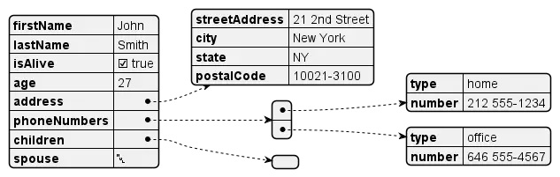
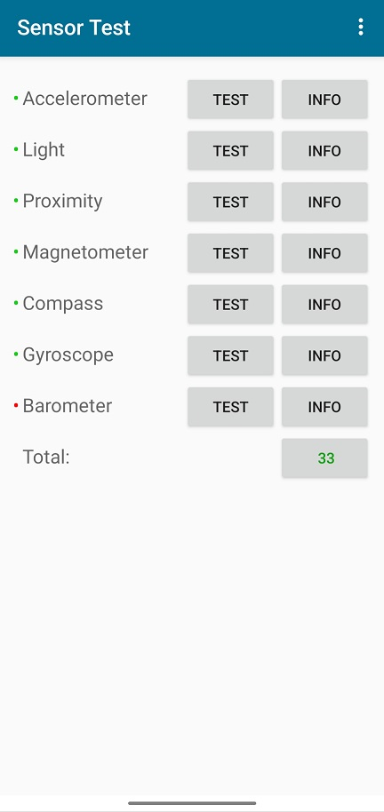
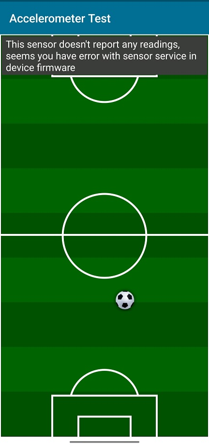
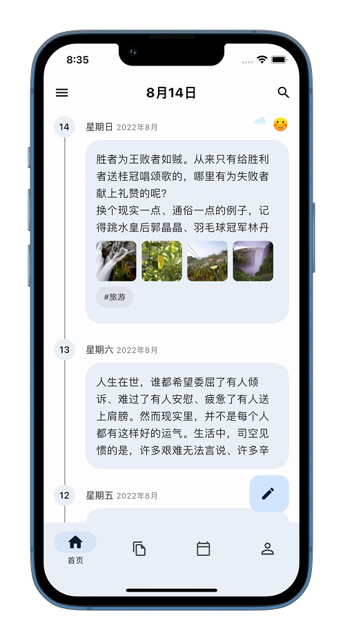
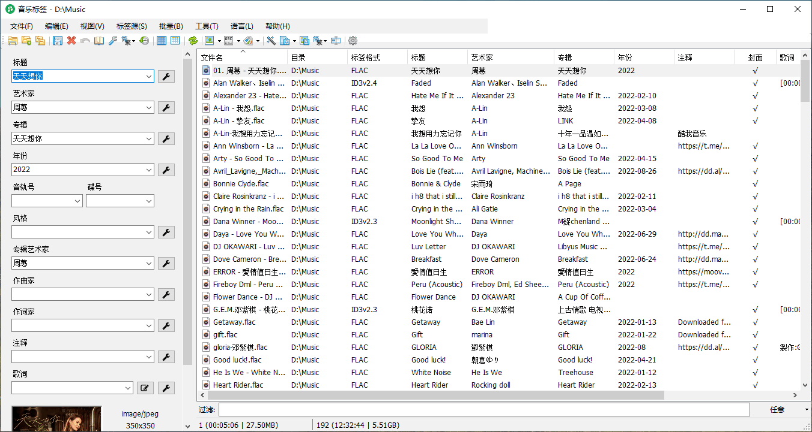
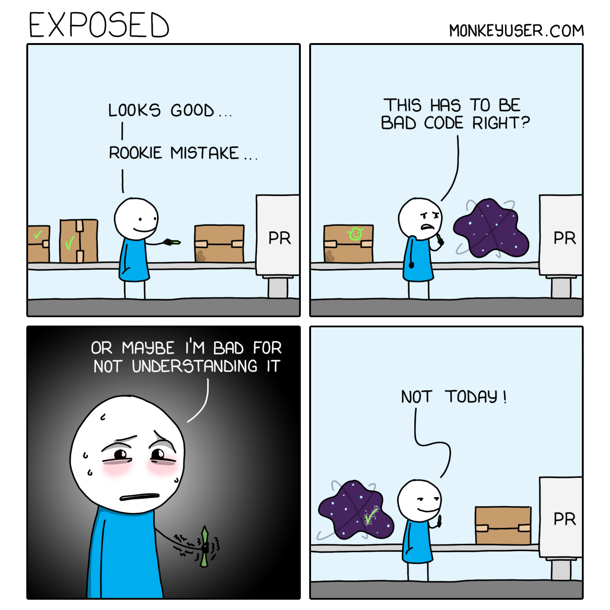
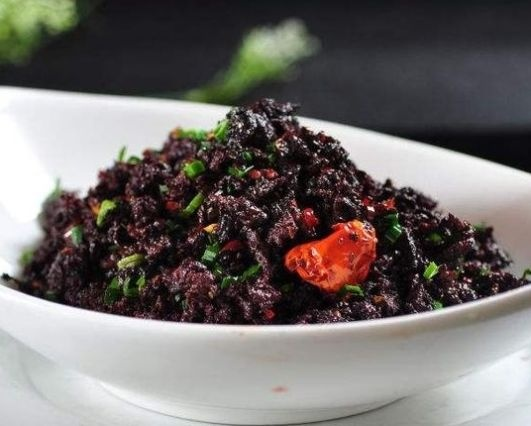

啰里啰唆周刊第49期：云是雨的皮影戏

# 科技日常

## 1. 构建网络丢包和延迟的测试环境 Comcast
Testing distributed systems under hard failures like network partitions and instance termination is critical, but it's also important we test them under less catastrophic conditions because this is what they most often experience. Comcast is a tool designed to simulate common network problems like latency, bandwidth restrictions, and dropped/reordered/corrupted packets.

It works by wrapping up some system tools in a portable(ish) way. On BSD-derived systems such as OSX, we use tools like ipfw and pfctl to inject failure. On Linux, we use iptables and tc. Comcast is merely a thin wrapper around these controls. Windows support may be possible with wipfw or even the native network stack, but this has not yet been implemented in Comcast and may be at a later date.

如果你不信任这个软件，或者对Golang有偏见，也可以自己使用iptables命令来模拟网络丢包和延迟，Comcast也是iptables的封装。
```bash
$ iptables -A INPUT -m statistic --mode random --probability 0.1 -j DROP
$ iptables -A OUTPUT -m statistic --mode random --probability 0.1 -j DROP
```

下载地址：[https://github.com/tylertreat/comcast](https://github.com/tylertreat/comcast)

这个软件还不支持Windwos系统。Windwos系统可以使用clumsy这款软件。

[http://jagt.github.io/clumsy/download.html](http://jagt.github.io/clumsy/download.html)


## 2. plantUML-开源免费的绘图工具

老牌的UML绘制工具，使用Java开发，单jar包实现，使用方便。

虽然现在UML快成了互联网遗迹，但是plantUML并不是只能用于画UML，也可以用来画 流程图、甘特图、架构图、思维导图、Ditaa图等，甚至支持数学公式、YAML和JSON。开源免费，支持部署为HTTP服务，生成的图像也比较美观

比如这样


[https://plantuml.com/](https://plantuml.com/)

## 3.安卓12+的传感器控制功能更新
安卓 10引入了传感器控制功能，在第14期已经介绍过了，关闭传感器也会让你的拍照、录音，重力和位置传感器等不可用，用于保护隐私。

安卓12以后，引入了单独的“Camera Access”和“Mic Access”，隐藏了“Sensors Off”按钮，然后安卓13的开发者设置里面又出现了“Sensors Off”按钮。很多升级了安卓12的用户如果还在用Android 10的测试方法，就会发现，即使关闭了传感器，拍照和录音功能依然是可用的，而不是之前的闪退或白屏，于是就认为安卓12的传感器关闭功能失效了，或者是手机ROM的bug。

其实就是因为安卓12以后，把摄像头和录音权限从传感器里剥离了，其它传感器控制功能还是可用的。但是其它传感器的测试并不像摄像头那么很直观，可以使用“Sensor Test” 这款软件来测试。


测试加速度传感器


## 4.Android 14 Preview 1 释出
Google 释出了 Android 14 的首个预览版本。在今年下半年释出正式版本前，Google 会发布多个预览版本，让开发者能抢先体验新功能。Pixel 6 系列手机可以获取到Android 14更新。

官方文档的新特性如下：

1.targetSdkVersion 低于 Android 6.0 的 App 禁止安装。
2.系统字体缩放支持到 200%
3.限制隐式 Intent
4.动态加载 dex 的 dex 文件必须是只读的
5.支持原生的应用多开实现。

Android 14 目前最显著的一个变化是它禁止安装旧的 Android 应用：阻止安装有 8 年历史的 Android 6.0 或以下版本的 APP。选择 Android 6.0 是因为该版本在 2015 年引入了运行时权限，在访问相机等功能时会弹出允许或拒绝的窗口。Google 表示部分恶意程序会通过使用针对 Android 5.1 的 targetSdkVersion 躲避这一约束。Google 官方应用商店 Play Store 对 Android 版本的要求更高，针对 Android 12 以下版本的应用会无法搜索到。

## 5.免费外刊下载和在线浏览
上千种免费外刊下载和在线浏览，支持多种语言，也有中文刊物。

无需注册登录。

[https://mgreader.com/](https://mgreader.com/)

## 6.天悦日记-一款三无产品
天悦日记，一款纯粹记录日记的App，将每一天经历都清晰记录在手机，一目了然知道曾经的经历，是一个无开屏，无广告，无社区的三无产品。适合有写日志需求的用户。基于Flutter开发，支持Windows/Android/IOS/Mac平台。

此软件为个人作品,因此数据本地存储，支持同步到到百度网盘和支持webdav协议的网盘，可自由导入导出，良心软件。


ref:[https://tianyueapp.com/#/](https://tianyueapp.com/#/)

## 7.MusicTag 音乐标签批量编辑
『音乐标签』是一款可以编辑歌曲的标题，专辑，艺术家等信息的应用程序， 支持FLAC, APE, WAV, AIFF, WV, TTA, MP3, MP4, M4A, OGG, MPC, OPUS, WMA, DSF, DFF等音频格式，绿色无广告，无任何功能限制。支持Windows和Android系统。

支持在线查找编辑歌词、修改封面。



手机版地址：[https://www.coolapk.com/apk/com.xjcheng.musictageditor](https://www.coolapk.com/apk/com.xjcheng.musictageditor)

# 读书与影视分享

## 1.马伯庸小说《长安的荔枝》

《长安的荔枝》是马伯庸2022年的一部作品，作者从一个九品小吏着手，描绘了荔枝从岭南运往长安途中的种种艰辛，让我看到了另一个不同角度的历史，以及那个时代小人物的顽强抗争。

大唐天宝十四年，长安城的小吏李善德突然接到一个任务：要在贵妃诞日之前，从岭南运来新鲜荔枝。荔枝“一日色变，两日香变，三日味变”，而岭南距长安五千余里，山水迢迢，这是个不可能完成的任务，可为了家人，李善德决心放手一搏：“就算失败，我也想知道，自己倒在距离终点多远的地方。”
唐朝诗人杜牧的一句“一骑红尘妃子笑，无人知是荔枝来”一千多年来引发了人们的无限遐想，但鲜荔枝的保鲜时限仅有三天，这场跨越五千余里的传奇转运之旅究竟是如何达成的，谁让杨贵妃在长安吃到了来自岭南的鲜荔枝？作者马伯庸就此展开了一场脑洞非常大的想象。

> 唐朝诗人杜牧的一句“一骑红尘妃子笑，无人知是荔枝来”惹得世人艳羡杨贵妃上千年，但其中的荔枝是如何从五千余里外的岭南运送到长安城的，却鲜有史书详细记载，作者马伯庸脑洞大开以此为蓝本构建了一个大唐社畜李善德拼尽全力做项目的故事，虽然是历史小说，却能让读者从中书中看到自己的生活影子，大城市买房落脚、职场情商博弈、不得已的违规逾矩等，也感受到了事在人为的热血奋斗，小说以微观人事折射大唐宏观社会。

马伯庸的风格在我看来，一直是“有文化地炫技般戏说历史”，不过其文笔老辣畅快，青菜萝卜各有所爱。

## 2.《张晓乐药学通识讲义》
作为一本日常药物知识的专业指导，《张晓乐药学通识讲义》将帮助你看懂药物的副作用和不良反应、 防范药物成瘾、错误用药方法的致命后果，甚至帮你合理停药，谨慎对待超说明书用药，辨识药品和保健品，正确进行自我药疗、使用处方药。

搭配《薄世宁医学通识讲义》，你将填补医学知识盲区，大大提升自己利用医疗资源的能力。

以药品有效性为例。如何表示有效性的程度呢？就用半数有效量（ED50）半数有效量，是指在药物有效性实验中能引起50%实验动物发生阳性反应的最小剂量。除了量上的差距，还有快慢和维持时间长短之分。药品安全性和药物有效性一样，是个统计学上的概念，由于人的个体差异，对大多数人都十分安全的药物，可能对极少数人有严重的不良反应，反之也一样。美国食药监督管理局最早采取的上市药物动态监测措施便是发布黑框警告，在上市后临床使用过程中发现的严重不良反应，要求用加黑加粗的边框来显示，并印在说明书的最前端。英国则是在1964年建立了黄卡制度，医生或患者可以通过黄卡系统自发报告药物安全事件，有助于发现未知的不良反应信号。而我国曾经风靡一时的“宝塔糖”也在证实OR值（即使用过药品的优势比）高达20.3后，确认宝塔糖与不明原因脑炎的明确相关性。

对于一个比较有深度的行业，这本书受制于篇幅解释的内容和深度都比较有限，读者可以看一下目录，重点关注自己感兴趣的目录。

## 3.纪录片《梦的背后》
又名《风中有朵雨做的云纪录片》、《风雨云纪录片》。

以《推拿》获得金马奖最佳改编剧本奖的编剧马英力，在纪录片《梦的背后》中执起导演筒，近身跟拍导演丈夫娄烨入围本届金马奖最佳导演的《风中有朵雨做的云》制作过程，从前期筹备、拍摄现场、后期制作。知名编剧张家鲁、摄影包轩鸣、演员秦昊、 井柏然、宋佳等主创人员也现身说法。除了见证一部电影的诞生，更侧面察看中国电影制作的现状，真实呈现摄影机外的疯狂世界。 

> 在微博上看了一个片段。太惨了，连阿云被烧的那场戏原来是燃烧途中诈醒，姜紫成见状又狠狠补了几棍子直至尖叫声平息，忽而就理解了火光下他恸哭又邪笑的神情。没有任何一种情绪是突如其来的，也没有任何一段删减是毫无缘由的，很难想象到底哪一种更惨。电影的全貌是不大可能看到了，但愿还能看到这部纪录片的全貌。

> 时间会证明，谁才是纯粹在用影像记录我们的时代，谁才是沉默用自己作品不断在和当局周旋，不断触及底线，但也不卑不亢毫不显耀地维护着自由的声音。

> 我原来以为风雨云这个名字是在讲剧变时代里人就像风中的雨和云，这次在纪录片里看到英文名the shadowplay很早就定了，才明白它的另一个意思——云是雨的皮影戏。
# 图论

## 1.How can i help


[https://www.npr.org/2022/09/16/1123560719/splitting-chores-partner-roommate](https://www.npr.org/2022/09/16/1123560719/splitting-chores-partner-roommate)

## 2.Exposed



ref:[https://www.monkeyuser.com/2021/exposed/](https://www.monkeyuser.com/2021/exposed/)
# 谈天说地

## 1.血辣子
又名猪血辣子，流行于滇东北一带。

猪血辣子首先是把干辣椒用剪子剪开，变成辣子筒，杀猪时把相当的盐巴和辣子置入盆中，灌满猪血，加入白酒，然后用土罐密封装置起来，待到来年庄稼活路忙碌时再启封食用，每顿舀一两勺，猪油煎之，味道香辣，养胃健脾，是一道既方便又可口的农家菜。

血辣子通常直接蒸制出来就可以吃了，也可以用蒜苗来炒，炒出来的血辣子用来拌饭那叫一个香！

也有把猪血和辣椒放入猪大肠的做法，类似丽江一代米血肠的做法。

米血肠是纳西族普遍喜爱的食品，纳西语称为“麻补”。
其做法是把蒸到半熟的大米或糯米趁热拌上鲜猪血或蛋清以及各种香料，紧紧灌入洗干净的猪大肠内封好口蒸熟即成。
因制作的方法不同，用鲜血的叫黑麻补，用蛋清的叫白麻补。食用时需切成圆片，或用油煎炸，或用甑蒸热，色泽油亮，异香扑鼻，脍炙人口。

## 2.fuck与Bowdlerize考
fuck的词源至今仍无定论，充斥着各种类似都市传说式的考据，有各种各样的说法。其中涉及年代最久远的说法是，15世纪有一首由拉丁文和英文混合所写的讽刺诗《Flen, flyys and freris（跳蚤，苍蝇和修道士）》，其中有一行是这样写的：

> “Non sunt in coeli, quia gxddbov xxkxzt pg ifmk.”

开头拉丁文“Non sunt in coeli，quia”意为“他们（指修道士们）不在天堂，因为……”，而之后的“gxddbov xxkxzt pg ifmk”用的是隐语，相当于是密码书写。透过字母重映射的方法破译之后，其规则为向前回推一个字母（当时的字母没有J、U和W），“gxddbov xxkxzt pg ifmk.”解码之后就成了“fvccant vvivys of heli.”而全句也变为“Non sunt in coeli, quia fvccant vvivys of heli.”意思是“他们不在天堂，因为他们与伊利的妇女‘性交’。”句中的“fvccant”为故意伪装成拉丁文形式的“fuck”，即“fvcco”的现在式第三人称复数。

另外，1598年出版的一本字典认为Fuck这个字源自拉丁文的fūtuere或古德语的ficken，原意是“to strike”（可作攻击、袭击、压铸等不同意思）或“to penetrate”（穿透），但在俗语（slang）却可用来暗示性交（to copulate）。著名的语源学家Eric Partridge亦指出这个德语字源自拉丁文，意思就是“pugilist, puncture, and prick”，就是刺穿的意思。耐人寻味的是：到了今时今日，“prick”这个英文字除了解作刺穿以外，在现代口语中更常用来指男性的阴茎。

18世纪中叶以前，西方社会对“fuck”一类的脏话和猥亵文字是较为宽容的，不管是日常交流还是文学作品，都不会有太多的禁忌。而直到以崇尚道德修养著称的维多利亚时代，突然就变得严格起来。那个时代的人对性的象征或描述比对性行为本身更觉得恐惧，就完全是个“谈性色变”的年代。于是，以“fuck”为首的“四字单词（英语中的脏话几乎全部由四个字母组成所以统称为四字单词）”逐渐在各种文学作品中销声匿迹，甚至从字典中也消失了。

这一时期，英国一名医生和慈善家Thomas Bowdler(托马斯·鲍德勒)在1818年对莎士比亚全集进行“和谐”，删去所有猥亵及色情描写的词句，使其成为适合每个家庭阅读的版本。后来，这位学者的名字直接演变成了一个英语动词——Bowdlerize，意思直接就是指删去猥亵色情词句。恩，直译过来对应中文动词“和谐”。

ref:[https://zhuanlan.zhihu.com/p/24047330](https://zhuanlan.zhihu.com/p/24047330)

## 3.How the ancient Greeks viewed pederasty and homosexuality

As the French philosopher Michel Foucault argued in his book The History of Sexuality, the things we consider acceptable and unacceptable are dictated by our cultures and, as such, are subject to change. Behavior that is tolerated in one part of the world might be completely inexcusable in another place or time period, and this is especially true when it comes to sex.

For a good example, look no further than ancient Greece. The way that Plato, Aristotle, and their contemporaries conceived of human sexuality was fundamentally different from the way we do today. Hellenistic scholars doubt the Greeks would have been able to understand the modern distinction between homosexual and heterosexual relationships. In classical antiquity, people didn’t care if you were attracted to men or women; what mattered was whether you were the dominant (active) or submissive (passive) partner in the bedroom.


ref:[https://bigthink.com/the-past/pederasty-homosexuality-ancient-greece/](https://bigthink.com/the-past/pederasty-homosexuality-ancient-greece/)

## 4.我63岁回农村养老不到一年，落荒而逃
> 来源网易故事频道，且当故事。故事源于生活，是生活的比喻。

我是老袁，江西人，一个儿子在上海工作，儿子和儿媳都有不错的单位。孙子住寄宿学校，也不需要我们操心。
我退休前是一家事业单位的高级工程师，我老伴退休前是市人民医院的内科医生，本来单位要返聘，但我们拒绝了。
我和老伴退休工资加起来1万5左右，衣食无忧，想着人生苦短，不如趁现在还能动，保养一下身体，过自己想要的生活。
我的老家在赣北的一个小村庄，依山傍水，风景秀丽，绝对是一个养老的好地方。 
...
世上有两种东西不能直视，一是太阳，二是人心。
时代在变化，家乡已经不是你追求的诗和远方的田野了。
现在农村的留守老人，大部分都是像老袁的大哥大嫂这样，儿子在外打工，老人在家操劳。
枯燥的生活、闭塞的环境、受教育的程度都决定了他们的认知有限，有淳朴善良也有精明世侩。
所以，退休以后，不管在哪里养老，永远不要让情怀高于现实生活。

**不要感叹故乡的人变了，其实故乡从来没有变过，真正改变的是你。**
**因为你从当年离乡，走的就是跟他们不同的路，并且渐行渐远，再也回不去了。** 

来源：[https://c.m.163.com/news/a/HSJ5CVVB05560SWS.html](https://c.m.163.com/news/a/HSJ5CVVB05560SWS.html)

# 一句话快讯

1.《中华人民共和国预备役人员法》将于2023年3月1日起正式实施。

2.武汉医保局回应医保改革调整后个人账户钱变少：长期看增加了普通门诊待遇。此次医保改革公务员不受影响。

3.上海普陀区“中远两湾城”小区炒掉了管理小区长达20年的物业公司，还请来专业律师团队和审计团队，全面审计过去20年账目，向法院申请调查令，倒查20年的公共水电及停车费，最终法院判决前物业公司返还全体业主4000余万元。

4.工信部发表声明，它将停止受理和审批部分电信设备的进网许可，其中包括固定电话终端、无绳电话终端、集团电话、传真机、调制解调器（含卡）、无线寻呼机、窄带综合业务数字网络终端（ISDN终端）、接入移动通信网络的多媒体终端、帧中继交换机、异步传输模式交换机（ATM交换机）、呼叫中心设备等。而卫星互联网设备和功能虚拟化设备将纳入现行进网许可管理。

5.网传国内 45 亿个人信息泄露遭到泄露，最新数据大概来自 2022 年，数据主要来自各快递平台以及淘宝、京东等购物网站，数据包含用户真实姓名、电话与住址等。泄露的数据量为 4541420022 条，数据库大小为 435.35GB。主要购物平台尚未对此消息做出回应。 

6.2 月 14 日，三星发布 Galaxy S23 系列国行版，Galaxy S23 系列全系搭载第二代骁龙 8 移动平台，配备 120Hz Dynamic AMOLED 2X 屏幕；其中 S23、S23+ 采用 5000 万像素后置三摄，支持 3 倍光学变焦；S23 Ultra 采用 2 亿像素后置四摄，支持 10 倍光学变焦。

# 联系方式

啰里啰唆是一份针对互联网和生活爱好者的数字杂志，旨在发现和分享一切有趣的东西。话题不固定，每期大约十五分钟阅读量，暂定每周四发布。部分内容来自互联网采编，如果为有来源的转载，均会注明转载地址或保留水印。

这是一个关注人文和科技的newsletter。

使用方法建议或素材提供

频道：notonlyshare

邮箱：auokyob@outlook.com

github地址：[https://github.com/iminto/luoliluosuo-weekly](https://github.com/iminto/luoliluosuo-weekly)