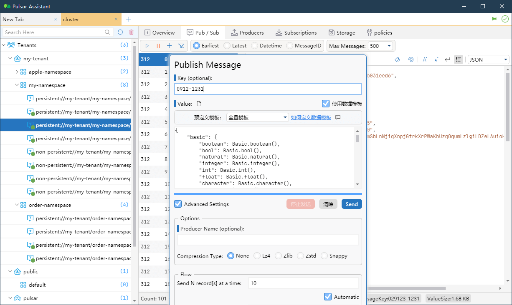
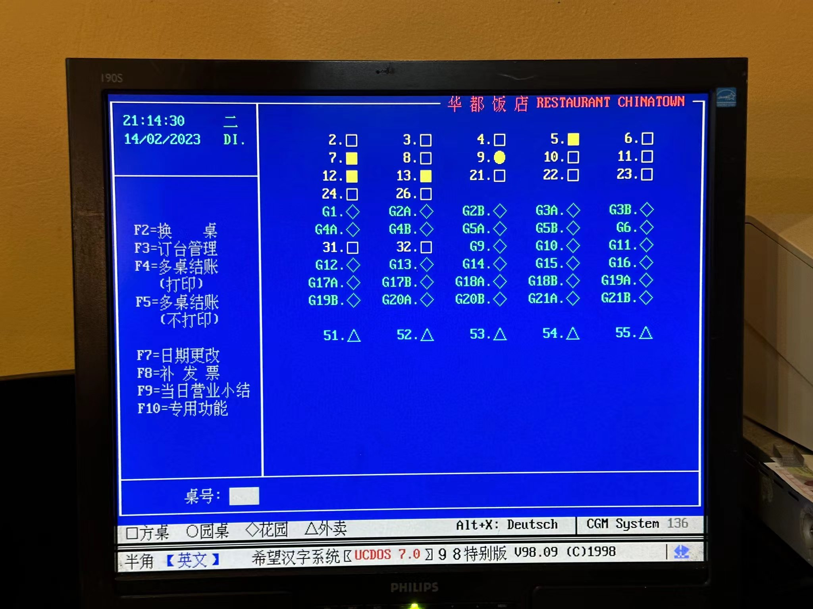

啰里啰唆周刊第50期：一字六十春

# 科技日常

## 1. 如何搭建家用 homelab
homelab: a laboratory of (usually slightly outdated) awesome in the domicile
从语言直译来看可以说是家庭 homelab，把这个事情延展到网络及服务上面那就可以干很多有意思的事情，比如：

NAS 存储：资源下载、存放任何的数据（照片、小姐姐、学习资料、代码等）
影视库：从最简单的网络共享文件夹到可以托管影视管理、播放、转码为一体的 Jellyfin、Plex 服务
网络管理：设备限流、流量审计、防火墙策略
应用开发：做一些 side projects 需要开发环境、缓存、数据存储等
DevOps：ansible、salt、k8s 来操作维护多个服务器、VM 或者是 lxc

如果您恰好是一名软件应用开发者，homelab 是最佳的扩展你的技能的很好的实验田，学习网络拓扑、Linux 系统、安全管理等。 对于大部分人来说或许多多少少都会听说过 NAS 服务器，其实他也是 homelab 的实践应用之一。

ref:
[如何搭建家用 homelab: 先导篇](https://icyleaf.com/2022/02/how-to-homelab-part-0/)
[如何搭建家用 homelab: 硬件和架构](https://icyleaf.com/2023/01/how-to-homelab-part-1-hardware-and-architecture/)

## 2. 为什么64位安卓应用比32位快
2021年底，国内安卓五大应用商店，共同宣布了将会推进国内安卓生态对于64位应用的支持，如今到了2023年，64位App已经成了应用商店的首先甚至唯一选择。

然而，安卓的64位之路并不顺利。其实早在Android 5.0系统发布时，就已经支持64位应用，当时处理器为高通骁龙410，这也是高通首款支持64位的处理器，时间为2013年，而到2022年才“强制”实现到64位，这与谷歌在2019年要求开发者在google商店中提交64位应用整整推迟了3年。

不仅手机厂商有自己的官方软件商店，还有像百度软件管家、酷安、腾讯手机助手等等这样的第三方市场。如果手机中安装了非手机市场的官方版，可能还会在多个商店的版本之间“反复横跳”，其实到2021年，高通8 Gen 1和联发科9000处理器出来之前，都缺乏一套行之有效的方式来从“根儿上”解决这个问题。

高通、联发科于2021年底发布的骁龙8 Gen 1和天玑9000，除了具有非常强劲的性能提升这个大众可以“感知”的部分：整个框架升级到了ARM最新一代Cortex-X2超大核、Cortex-A710大核和Cortex-A510小核架构外，最大变化是更为底层的“提升”，即指令集就采用了ARM V9。

ARM V9和上一代V8一样，都为纯64位指令集，Cortex-X2超大核与Cortex-A510小核只支持（向下兼容V8）64位，只有“中核”Cortex-A710大核兼容32位的V7指令集。

**很多PC用户都有这么一种感觉或者说认知，早期的32位应用相比如今的程序不仅体积小，而且内存占用低，为什么到了安卓，反而不推荐32位，而是说64位的App运行效率更快呢?**

其实，安卓上64位比32位快的一个主要原因就是现在处理器上指令集和CPU的变化。如果这款软件还是32位的，那么运行在骁龙8 Gen 1和天玑9000这类V9指令集的新架构处理器新机上，就只能被锁定在A710上运行，这样手机不管是锁屏还是打开“性能模式”运行，应用始终都处在A710这个比上超级大核性能不足，比下小核也不省电的核心上。为什么目前主流的ARM架构芯片都采用的是big.LITTLE大小核切换技术呢？这是一项可以将正确的任务调度到正确CPU核心的技术，可以让大核心负责游戏等高负载任务、小核心负责听歌、浏览网页等低负载任务。但这一技术的代价是芯片的工作模式必须统一，不能是大核使用AArch64指令集，小核使用AArch32指令集。
另外，64位一些独有CPU指令（比如压缩和视频处理），也能让64位App运行性能更高。

另外，支持 64 位设备是安卓应用程序利用超过 4GB RAM 地址空间、在数据处理中利用更宽寄存器和更高精度，以及获取强化安全特性的唯一途径。64位应用可以使用动态内存分配将一个大于4GB的应用放到内存进行处理，而32位应用就需要使用类似“分块读入”的复杂方式来完成，这对于运行大型手游是有利的。

因此，充分利用大小核性能和运行大型App是64位App流行的原因，而硬件配置的提升助长了这一需求。至于64位占用更多内存，这不在手机厂商和业界考虑的范围内。

### 怎么知道你的App是32位还是64位？
使用Libchecker这款app，LibChecker 提供了一些基本的功能，包括 app 的 ABI 架构查看和统计（32 位 / 64 位）、原生库的查看、四大组件的查看（服务、活动、广播接收器、内容提供器）。
[https://www.coolapk.com/apk/com.absinthe.libchecker](https://www.coolapk.com/apk/com.absinthe.libchecker)

另外，如果手动下载APK文件安装，那么文件名如xxx-arm64-v8a-release.apk，那就是64位app，而xxx-armeabi-v7a-release.apk 通常就是32位app。至于xxx.apk这种，通常是兼容多种架构的安装包，体积臃肿，在有选择的情况下不建议使用。

## 3.中國歷代人物傳記資料庫CBDB
中國歷代人物傳記資料(或稱數據)庫係線上的關係型資料庫，其遠程目標在於系統性地收入中國歷史上所有重要的傳記資料，並將其內容毫無限制地、免費地公諸學術之用。

截至 2022 年 8 月為止，本資料庫共收錄約 521,442 人的傳記資料，這些人物主要出自七世紀至十九世紀，本資料庫現正致力於增錄更多唐代和明清的人物傳記資料。

此网站提供Microsoft Access及SQlite格式的数据下载。

[https://projects.iq.harvard.edu/chinesecbdb](https://projects.iq.harvard.edu/chinesecbdb) 

## 4.KeyCastOW-录制视频时显示按键
在录屏的时候，我们可能需要把按键情况准确的显示出来，这样就需要把按键映射到屏幕上。

有一个小软件KeyCastOW能实现这个效果，如图所示：

其设置界面也很完善

虽然最后一次更新是2017年，但是最新的Win10上运行一切正常。作者也没有提供二进制文件，需要使用源码自行编译。编译也不麻烦，编译后体积不到200K。

已知bug：打游戏的时候这个软件就不显示了（网友反映，目测应该是底层图形库API冲突导致）
同类软件：[Carnac](http://carnackeys.com/)（最近更新2020年，官方提供exe文件）

上述两个软件，均只支持Windows。如果是macOS 用户，请使用：KeyCastr

官网地址：[http://brookhong.github.io/2014/04/28/keycast-on-windows.html](http://brookhong.github.io/2014/04/28/keycast-on-windows.html)

## 5.Apache Pulsar Desktop GUI
Apache Pulsar 是 Apache 软件基金会顶级项目，是下一代云原生分布式消息流平台，集消息、存储、轻量化函数式计算为一体，采用计算与存储分离架构设计，支持多租户、持久化存储、多机房跨区域数据复制，具有强一致性、高吞吐、低延时及高可扩展性等流数据存储特性，被看作是云原生时代实时消息流传输、存储和计算优秀解决方案。

目前 Apache Pulsar 的桌面端 GUI 工具很少，一款好用的可视化管理工具可以极大的提升效率，在此分享一款 Pulsar GUI 工具：Pulsar Assistant。

该软件支持跨平台，采用 [Avalonia](https://avaloniaui.net/How-It-Works) 进行构建，提供接近原生的性能，比使用 Electron 等 Web 技术开发的同等应用程序消耗的资源少。

官网地址： [http://www.redisant.cn/pa](http://www.redisant.cn/pa)

提示：此软件为国产 **收费应用**，提供3-7天免费试用，买断价79.9元。如需开源免费应用，可参考pulsar[官方文档-Pulsar Manager](https://pulsar.apache.org/docs/2.11.x/administration-pulsar-manager/)。

## 6.MusicBee-Windwos上全方位的音乐管理工具
MusicBee makes it easy to manage, find, and play music files on your computer. MusicBee also supports podcasts, web radio stations and SoundCloud integration。

有人把MusicBee作为iTunes 的另类替代，实际上音乐管理这一块, 在 Windows 上全方位无死角吊打 iTunes, 在装了插件之后甚至可以同步 iPhone/iPod 里的歌，关键是快, 还免费。最新版本MusicBee 3.4.8033，支持便携版，体积仅10M.

特性：
1.丰富的介面定制。MusicBee 不仅可以定制应用本身的皮肤，还可以调整各个信息版块的位置，以及定制音乐播放介面。
2.强大的插件库。
3.喜闻乐见的 Podcast 订阅。用户可以自行添加 rss 订阅链接，对播客支持较好。
4.优秀的音乐管理，包括标签、封面等
5.自带格式转换功能

缺点：
1.对歌词支持不佳，需要通过第三方插件来增强。

官网:[https://getmusicbee.com/](https://getmusicbee.com/)

## 7.Pathos 古老的roguelike游戏。
Pathos 是一款由 Nethack 的规则激发灵感的 roguelike 冒险游戏。您可以从十三种职业中选择一种扮演并深入地牢。深入地狱并击败你最终的复仇者，然后携带所有宝藏离开地牢！

Pathos不是Nethack，而是Nethack的延续与发展，或是作为同人作品。请不要把Pathos与Nethack混淆。可以认为是Nethack的简化版，规则更简单，玩法更丰富。但即使是简化版的Nethack，Pathos的复杂度也不是现在的普通地牢游戏可以比的。内核极其丰富，适合比较有耐心的慢节奏人群。

支持随机地牢、地表之旅、像素之旅模式。跨平台游戏，支持安卓、Windows、Linux、iOS、网页版。

ref:[http://pathos.azurewebsites.net/](http://pathos.azurewebsites.net/)

## 8.开源电子书《高并发的哲学原理》
本书的目标是在作者有限的认知范围内，讨论一下高并发问题背后隐藏的一个哲学原理——找出单点，进行拆分。

> 我们将从动静分离讲起，一步步深入 Apache、Nginx、epoll、虚拟机、k8s、异步非阻塞、协程、应用网关、L4/L7 负载均衡器、路由器(网关)、交换机、LVS、软件定义网络(SDN)、Keepalived、DPDK、ECMP、全冗余架构、用户态网卡、集中式存储、分布式存储、PCI-E 5.0、全村的希望 CXL、InnoDB 三级索引、内存缓存、KV 数据库、列存储、内存数据库、Shared-Nothing、计算存储分离、Paxos、微服务架构、削峰、基于地理位置拆分、高可用等等等等。并最终基于地球和人类社会的基本属性，设计出可以服务地球全体人类的高并发架构。

全书共八万多字。
[https://github.com/johnlui/PPHC](https://github.com/johnlui/PPHC)

## 9.Debian 12 Bookworm 进入软冻结
Debian 发行版项目正在开发代号为 Bookworm 的新版本，开发者上周五在邮件列表上宣布了软冻结（soft freeze），意味着所有上传都仅限是小的、有针对性的修复，并且不允许新的源码包进入 Bookworm。 Bookworm 存档中的包也不再允许添加或删除二进制包。

Debian 发行版大约每两年发布一个大版本，Debian 11 Bullseye 是在 2021 年 8 月发布的，正在开发的 Debian 12 Bookworm 预计在今年晚些时候发布。它的软件包括了 GNOME 43、KDE Plasma 5.26.90、Linux 6.1 LTS kernel、Mesa 22.3、LLVM 15 等等。 

[https://www.phoronix.com/news/Debian-12-Soft-Freeze](https://www.phoronix.com/news/Debian-12-Soft-Freeze)

## 10.义乌自己的全球支付方式 Yiwu Pay 义支付正式发布
2 月 20 日消息，浙江中国小商品城集团今日正式发布了 Yiwu Pay 义支付，标志着全球最大的小商品集散中心拥有了自己的全球支付渠道。

据介绍，Yiwu Pay 创立于 2012 年，是浙江中国小商品城集团股份有限公司旗下的持牌的第三方支付公司，注册资本 1.8 亿元。以“支付结算”为着力点，为企业提供合规、安全、高效的全链路贸易支付服务。

Yiwu Pay 已与全球 400 多家银行达成合作，业务覆盖 100 多个国家和地区，国际收付主流币种达到 16 种，打通了跨境人民币支付通道。并且和其他支付工具类似，支持扫码支付、网银支付等，也支持提现、转账等。并且支持 PC 端支付、移动 App 支付、移动 H5 支付和线上扫码多种收款场景，方便买卖双方交易。

官网：[https://www.yiwupay.com/](https://www.yiwupay.com/)
# 读书与影视分享

## 1.默音·小说《一字六十春》
作家默音2022年出版小说《一字六十春》，原名《姨婆的春夏秋冬》，为“记忆三部曲”的首部作品。

关于默音，我们在第14期讲云南民俗文化的时候提到过她的另一本小说《甲马》。

老弄堂作为纽带，不同人物在各篇登场：人人在别人的眼皮子底下出生，长大，工作，结婚生子，离婚或丧偶，渐渐变老乃至退休……1941—2001 弄堂普通人的悲欢日常、死生契阔，周而复始中蕴藏着变化。

《一字六十春》是关于姨婆的春夏秋冬的故事。在这里，拥有神秘预知能力的姨婆闭口不提尘封的往事秘密，保持着养花、泡脚、练字的爱好，与收养的孩子程勉一起过着平淡的生活。作为一位预言者，姨婆如何处理自身与命运的关系？神秘的通灵能力于她而言，是否意味着对于众人命运走向的掌控力？这是默音在写作时要处理的难题，也是她向读者抛出的真实困惑。

> 这本书特别好看。 有乱世、有民国、有名伶、有侠骨、有公子、有生离死别；有今朝、有夏天、有青梅竹马、有匆匆而过的那些年；有将来、有命运、有字谶、有天眼、有爱和错交织的不堪。 然而，这么多的东西驳杂在一起，故事一点也不乱，埋线扎实、行文舒服、剧情好看。 这真的是不该错过的一本书。
## 2.1999年电影《绿里奇迹》-豆瓣评分8.9
《绿里奇迹》是华纳兄弟影片公司出品的悬疑电影，由弗兰克·德拉邦特执导，汤姆·汉克斯、大卫·摩斯、迈克·克拉克·邓肯等主演，于1999年12月6日上映
影片改编自史蒂芬·金的小说《绿里奇迹》，讲述了二十世纪，保罗在老人院回忆起在当狱警时，高个子黑人约翰·科菲因被误判来到死牢后发生的超自然的事件。影片全长188分钟，豆瓣评分8.9。

1935年，美国南部惨淡肃杀的冷山监狱。有个编号为E区的监舍，因为地板是绿色的，别人叫它“绿里”，里面住的皆为死囚。在监舍的另一头，便是行刑用的电椅。保罗·艾治科姆是这里的E区监狱主管，对于走过“绿里”、继而在电椅上惨叫毙命的死囚行刑程序，他俨然已无动于衷。除了保罗及其爱妻简外，“绿里”上还有正直的副狱监豪威尔，监狱长海尔和他身患绝症的妻子美琳达，身为州长侄子并有施虐倾向的狱吏佩西，喜用宠物鼠逗狱吏和诸“难友”取乐的德拉克，连环杀人狂威廉，负疚深重的犯人彼特等一干形形色色的人们。

绿里监狱里面的生活泛善可陈，但神秘的约翰•考夫利的到来改变了一切。约翰因杀了两名幼女被判死刑来到了这座著名的冷山监狱，约翰不仅不像想象中的凶残，相反，他出奇的温厚、机智。约翰的到来给狱中的各人带来了天翻地覆的变化：为老囚犯特里沃的小老鼠注入了生命的强度，给特里沃最后的人生带来最后的慰籍；神奇的拯救了被病痛折磨的保罗和马琳达；将金保斯从死神手中拉了回来……保罗这些天也从约翰身上看到了人生的真谛。 

> 故事性很强的传奇宗教寓言式电影。神爱世人，而世人却不理解这份爱。人类摧毁了神迹，而神却不忍让世人背负这罪名。

> 《肖申克的救赎》导演+汤姆汉克斯。居然是一部有奇幻色彩的片子。剧本打磨得完美无瑕。演员们的演技均可圈可点，各展所长。但一本正经地讲述这样一个离奇的奇幻故事还是无法让人完全信服。宗教色彩浓厚。角色脸谱化。而且三小时篇幅太冗长，可以砍到2小时。虽然没被感动到，但依然是一部用心的佳作。

# 图论

## 1.A perfect day

As long as I have a blanket and book, and a cat, it’ll be a perfect day

ref:[https://www.instagram.com/explodinglobstercomics](https://www.instagram.com/explodinglobstercomics/?hl=en)
## 2.ucdos

欧洲华人饭店使用的管理程序，使用的UCDOS系统。UCDOS最后的版本是UCDOS 7.0系统，发布于1997年，安装只需24M硬盘空间。UCDOS依赖DOS系统。

UCDOS体验地址：[https://www.compumuseum.com/emularity.html?machine=ucdos](https://www.compumuseum.com/emularity.html?machine=ucdos)

# 谈天说地

## 1.Trouble at Sea
一篇关于阿拉斯加鲑鱼生态的文章，全文内容较多，阅读时间30-45分钟。

It’s late July and I’m standing with Daniel Schindler at the mouth of Sam Creek, a small tributary of western Alaska’s Bristol Bay, home to the largest wild sockeye salmon fishery in the world. The mouth of the creek—barely 20 feet wide—boils with fish. Schindler, a renowned salmon biologist, estimates that there are some 500 sockeye at our feet, their bodies gone cherry red and heads a copper-ore green because it’s spawning time.
...
Yet here in this little corner of Bristol Bay, the scene is joyous, absurd. We are knee-deep in the largest Bristol Bay sockeye return on record. Initial estimates put the run at over 80 million fish, nearly double the most recent 20-year average. But as Schindler and I maneuver up the fish-filled creek, there is one troubling addendum to this historic season: The fish are some of the smallest on record for their age.

[https://www.biographic.com/trouble-at-sea/](https://www.biographic.com/trouble-at-sea/)
## 2.正史之外的都叫野史吗
正史指《史记》、《汉书》等以帝王本纪为纲的纪传体史书，且被官方正式承认为正史。
清朝以后，我们常说的正史，一般是清朝乾隆皇帝诏定的二十四史为正史。

  > 《史记》《汉书》《后汉书》《三国志》《晋书》《宋书》《南齐书》《梁书》《陈书》《魏书》《北齐书》《周书》《隋书》《南史》《北史》《旧唐书》《新唐书》《旧五代史》《新五代史》《宋史》《辽史》《金史》《元史》《明史》

正史对应的并不是野史。

比如《四库全书》“史部” 分为 15 类：

> 正史、编年、纪事本末、别史、杂史、诏令奏议、传记、史钞、载记、时令、地理、职官、政书、目录、史评

正史作为官方认可或统修统编的纪传体史书，对应的是编年等另外十几类，而不是野史。纪传体被各朝奉为正规体列。而以纪传体为编撰体例的书也就称作正史，意味用正规体例写作的史书。它的内涵，一是纪传体，二是官方认可。如果不是纪传体，即使再是官方主持编修，再是史学大家主编，再是史料价值巨大，再是万古流传的煌煌巨著，如《资治通鉴》，它也不能叫 “正史”。

唐朝开始，朝廷才开始有官修前朝史的传统。从此是依据司马迁《史记》与班固《汉书》的纪传体作为正史体例。所以，正史的概念其实出现得很晚，唐朝才有。

ref:[https://daily.zhihu.com/story/9757812](https://daily.zhihu.com/story/9757812)
## 3.日本人真的说过「花姑娘大大的有」这种话吗
其实这种语言真的存在，它叫「协和语」，也有其语法和语义规则；

协和语是曾经使用于日本影响下的中国东北地区的一种日语和汉语混杂的皮钦语（混杂语言），其主要存在时期自清末日俄战争后至 1945 年（伪）满洲国灭亡。
指代“通行于满洲地区的日中混杂语”这一概念的名称很多，例如日满混淆语、沿线官话等。现在较常使用的“协和语”一名的可考用法最早出现在1948年的中文报纸，在满洲国存在的时代并未发现中文或日文材料如此称呼。

皮钦语(pidgin),指由不同种语言混合而成的混合语。从纯粹语言学的观点看，皮钦语只是语言发展的一个阶段，指在没有共同语言而又急于进行交流的人群中间产生的一种混合语言，属于不同语言人群的联系语言。皮钦语一旦作为母语传递，成为一个社会交际语，它就会开始逐步扩大词汇，严密语法，迅速发展丰富起来成为共同交际语言或独立语言。在中国，最著名的皮钦语当为“洋泾浜”，即一种变了形的外语。

快二十年前，有一款IM集成软件，可以同时使用ICQ/QQ/雅虎通/MSN/IRC等聊天协议，名字就叫[pidgin](https://pidgin.im/)，其语义来源就是皮钦语。

[https://medium.com/@croath](https://medium.com/@croath/)

## 4.清朝33两白银政策
今天在网上看到这么一段话
> 在清朝，一个中等收入的家庭一年的正常收入是33两白银，而刚性支出却是36两，这中间还差3两，这生计需要维持下去，这3两就是一个门槛，老百姓就得自己去想办法。

> 可能很多人对“3两”没有概念哈，觉得不就是3两嘛，又不是很多，以及为什么是“3两"呢?"3两"相当于年收入的十分之一，相当于你每年，都有1个半月时间没收入，而你又没有存款。不同的朝代，一两银子的购买力也有所差别，比如在乾隆年间，3两银子相当于1200块的购买力，可以买450斤大米，所以这是相对比较大的一笔钱。那么为什么是”3两“呢？因为这是一个老百姓可以想办法解决的数字，比如借，节约，或者通过其他方式去填补，让人民始终处在压力之下，这个压力又是勉强能承受。
那么很多人会好奇，为什么要有这么奇葩的政策呢？这就回到了我们开头的片段，不管是科举，还是这个政策，都是维护统治平稳的一种手段。读书人可以通过科举，而老百姓，就需要这么一个手段——人为的塑造平穷，让人民始终生活在生活的压力、焦虑之中，为生计发愁，但又不至于让人生活不下去，这样，人民也就没有心思去考虑其他的事情了。

理论是没错。但是33两白银这个数据受到了很多人质疑，很多『清史专家』认为是段子，离谱。按照清朝末期的购买力，33两白银相当于5-6W，当然这个收入在现在不算高。但是就算放在2023年的农村，5-6W的年收入也是不错的。所以33两白银视为中等收入的家庭，是没有毛病的。『专家』认为33两白银太离谱就太离谱了。

这个33两白银和目前中国的中产阶级困境也是很类似的。33两白银政策当然是不存在的，清朝的时候还没有这么精确的手段控制收入和支出，更不可能有官方文件，清朝时期的手段和思想与现在也不可相提并论。这明显是现代人对历史教训的总结。但是，是谁在互联网第一个提出了这个概念呢，我搜了下，网上提到此政策的文章中，讲到了这么一个故事，说来自英国在乾隆时期派出的马加尔尼使团中一名使者约翰巴罗，写了一本书《我看乾隆盛世》。
> 使团的船经过运河时，一伙看热闹的人压翻了河中的一艘小船，许多人掉进河里，巴罗记载虽然这一带有不少船只在行驶，却没有一艘船前去救援在河里挣扎的人。我们劝说我们船上的人开过去救他们，却被船夫拒绝。他陷于33两白银的穷困状态，一旦手暂停，停船救人不说一定能救起来，哪怕救起来也没任何好处，但是如果自己耽误了工作挣钱，很可能自己一家人都吃不上饭，也没人可怜他们饿肚， 最后他们眼睁睁看着好几个人在这场热闹中落水淹死。

这本书是真实存在的，也确实有这么一个麻木不仁的故事，很明显“陷于33两白银的穷困状”的话在原书不存在，是文章作者自己加上去的理解。原书也有对清朝政府的各级政府人员支出做了统计，也客观佐证了33两白银的收入并不离谱。

因此33两白银政策，在数字上是没问题的，虽然本身是个段子，但并非离谱，更不是瞎编。

托古讽今，自古以来就是文人抒发自己心中对于当下社会和现实的不满的一种手法。专家质疑数字，不是真的数字有问题，而是『讽』有问题。
# 一句话快讯

1.2023年2月16日上午6时07分左右，苏州市渭塘镇珍珠湖路1号发生火灾，7时10分火势扑灭，现场搜救已完成。事故造成6人死亡，另有28人送医院救治，其中2人伤势较重，暂无生命危险。

2.美国政府初步评估认为，近日击落的三个不明飞行物可能属于商业用途，并非用于收集情报，目前也没有迹象显示与中国或其他国家政府对美国的监视计划有关。

3.土耳其灾难与应急管理局: 地震死亡人数上升至40642人。

4.CNN 2月19日（中国时间）报道，99岁的美国前总统吉米·卡特开始接受临终关怀，拒绝医疗干预，卡特决定与家人渡过剩下时光不受打扰，并对所有关爱他的人表示感谢。

5.2 月 16 日，钛媒体从企查查方面获得的独家数据显示，2022 年，中国吊销、注销芯片相关企业达 5746 家，远超过往年，而且比 2021 年的 3420 家增长了 68%。目前，中国现存芯片相关企业超 17 万家（注：仅统计企业名称、名牌名称、经营范围含芯片的相关企业）。

6.中国脱口秀演员池子因在北美巡演谈及疫情和言论自由等敏感信息遭封杀。

7.当地时间2月20日，美国总统拜登突然访问乌克兰首都基辅，会见乌克兰总统泽连斯基。

# 联系方式

啰里啰唆是一份针对互联网和生活爱好者的数字杂志，旨在发现和分享一切有趣的东西。话题不固定，每期大约十五分钟阅读量，暂定每周四发布。部分内容来自互联网采编，如果为有来源的转载，均会注明转载地址或保留水印。

这是一个关注人文和科技的newsletter。

使用方法建议或素材提供

频道：notonlyshare

邮箱：auokyob@outlook.com

github地址：[https://github.com/iminto/luoliluosuo-weekly](https://github.com/iminto/luoliluosuo-weekly)