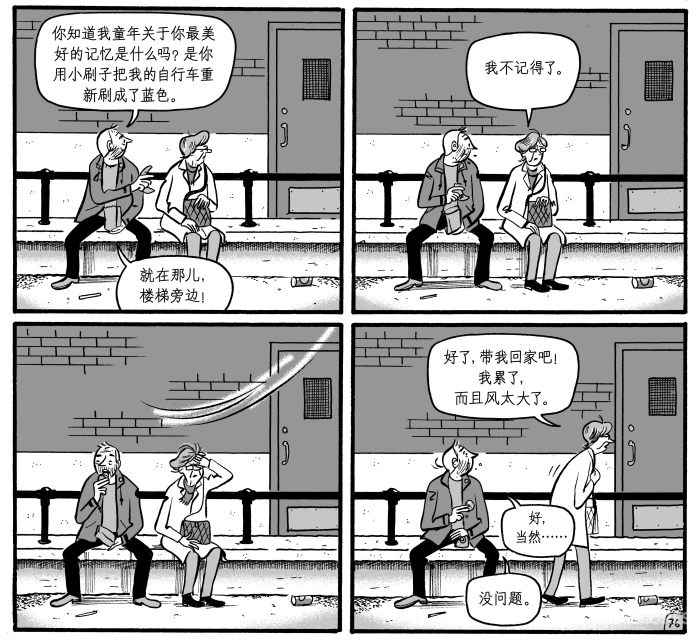
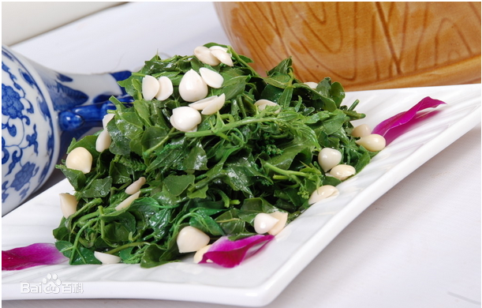

啰里啰唆周刊第51期：吹灭读书灯，一身都是月

# 科技日常

## 1. lapse-跨平台的代码编辑器
Lapce (IPA: /læps/) is written in pure Rust with a UI in Druid (which is also written in Rust). It is designed with Rope Science from the [Xi-Editor](https://github.com/xi-editor/xi-editor) which makes for lightning-fast computation, and leverages OpenGL for rendering.

功能特性：
1.Built-in LSP (Language Server Protocol) support
2.Modal editing support as first class citizen (Vim-like, and toggleable
3.Built-in remote development support inspired by VSCode Remote Development. 
4.Plugins can be written in programming languages that can compile to the WASI format

目前处于开发早期，可以认为是Xi editor的后续者，star数23K，建议养肥后使用。

无意中发现，此软件在Windows 10上与FastStoneCapture这款截图软件冲突，对其窗口截图导致CPU占用100%致重启，可复现。

[http://lapce.dev/](http://lapce.dev/)
## 2. 简而轻的在线构建系统-Jpom

Jpom是一款简而轻的低侵入式在线构建、自动部署、日常运维、项目监控软件，是类似Jenkins的CI/CD工具，开源免费，后端基于Java开发。

功能特性：
1.在线 SSH 终端，让您在没有 Xshell、FinalShell 等软件也能轻松管理服务器
2.使用项目分发一键搞定集群项目多机部署
3.支持拉取 GIT、SVN 仓库，支持容器构建（docker），支持定时构建，支持 WebHook 形式触发构建
4.项目状态监控异常自动报警、自动尝试重启

根据官方文档来看，对Java/Node/Python项目支持最佳。

官网：[https://jpom.top/](https://jpom.top/)

## 3.写写高斯模糊——从 CSS 模糊滤镜的白边说起

> 一篇高质量的高斯算法和优化的技术文章。

通常我们可以很容易地使用 PhotoShop 中的「高斯模糊」来模糊图片。
这也是一种很好的艺术效果，苹果惯用的毛玻璃效果本质便是高斯模糊，而我们将图片模糊后作为网站背景，既减小了图片的体积，也能别有一番风味。

而 CSS3 提供了滤镜 [filter](https://developer.mozilla.org/zh-CN/docs/Web/CSS/filter)/[backdrop-filter](https://developer.mozilla.org/zh-CN/docs/Web/CSS/backdrop-filter)，其中的模糊功能同样也是高斯模糊。（Canvas 中的 [filter](https://developer.mozilla.org/zh-CN/docs/Web/API/CanvasRenderingContext2D/filter) 亦是如此。）

只是当我们为图片背景添加 CSS 滤镜时，便会出现不和谐的白边。

虽然有一些奇技淫巧（比如放大图片再截去模糊的边）去解决，但皆治标不治本，我们不妨借此机会探究一下高斯模糊，并尝试自己实现它。

ref:[https://www.yunyoujun.cn/posts/gaussian-blur-for-image](https://www.yunyoujun.cn/posts/gaussian-blur-for-image)

## 4.MiXplorer-安卓最佳文件管理器,免费无广告
2022年末的时候，魔趣跑路，我刷了魔趣的手机也快两年没有获得更新了。魔趣里内置的App，有的来自开源软件魔改，有的用的AOSP自带。

但是魔趣自带App质量不是太高，并且由于长久没有更新，或多或少有bug，于是我root后卸载了很多内置软件，用最新的FOSS软件替代了。魔趣自带的文件管理器应该是AOSP自带，使用起来用户体验较差（没有面包屑导航，不支持root），试了很多文件管理器后，最终选择了MiXplorer。

MiXplorer是一款老牌安卓文件管理器了，刷机党最爱，支持挂载root权限，并且支持挂载网络文件系统（SAMBA, FTP, SFTP, WEBDAV协议和Dropbox、Google Drive, Meo, OneDrive等网盘），支持各种压缩格式的解压和打包，内置FTP/HTTP Server ，可以说功能十分强大了。

MiXplorer可免费下载，下载地址：[https://forum.xda-developers.com/showpost.php?p=23109280](https://forum.xda-developers.com/showpost.php?p=23109280&postcount=2)

Google Play提供 MiX Silver版本下载，MiX Silver为收费版本，和免费版本区别了内置集成了一些插件（如SMB2,Archive等），当然你可以自己手动下载插件安装。

缺点：自带epub阅读器对epub支持不佳，主要表现在切换到下一章节功能有时不可用。当然，毕竟MiXplorer不是专业的阅读软件。

官网：[https://mixplorer.com/](https://mixplorer.com/)

后来发现，在删除/system/pri-app/Doucumensui.apk后，即删除了自带文件管理器，会导致部分App的某些功能异常。原因是这部分软件的文件读写和定位选择依赖AOSP内置的Doucumensui框架，但是用户量比较大的国民应用是没有问题的，比如支付宝和张小龙。会出现异常的大多是用户量偏少的开源软件，因为其没有动力和精力适配各种异常和特殊情况，😓。当然，也可以选择不处理这种情况，而是换一个更健壮的app。

说起安卓优化，另一款文件管理器 [MaterialFiles-质感文件](https://github.com/zhanghai/MaterialFiles) 也提到过

> 这个应用没有使用 java.io.File 或者解析 ls 的输出，而是构建了 Linux 系统调用的绑定来正确地访问文件系统。java.io.File 是一个陈旧并且缺少许多功能的 API，并且无法正确处理符号链接，因此许多人宁愿解析 ls 的输出。然而解析 ls 的输出不仅缓慢，而且不可靠，同时也正是 [Cabinet](https://github.com/aminb/cabinet/blob/master/app/src/main/java/com/afollestad/cabinet/file/root/LsParser.java) 在新版本 Android 上无法正确运行的原因。而通过使用 Linux 系统调用，这个应用可以做到快速流畅，并且能够处理例如 Linux 权限、符号链接以至于 SELinux 上下文等等高级特性。应用也可以正确地处理含有无效 UTF-8 编码的文件名，因为应用中的路径没有简单地使用 Java 的 String 存储，而大多数其他文件管理器却并非如此，因此无法正确地进行文件操作。

一款好的App，其优化也依赖各种“奇葩”用户的考验和作者的巧妙构思。我没选择MaterialFiles的主要原因是其不支持webdav，虽然作者两年前表示会考虑。。。

遇到这种删除内置App的情况不要慌，可使用ROM编辑工具打开刷机包，提取出apk安装即可。

## 5.开源技术书籍《Rust 程序设计语言简体中文版》

欢迎阅读《Rust 程序设计语言》，这是一本Rust 语言的入门书。Rust 程序设计语言能帮助你编写更快、更可靠的软件。在编程语言设计中，上层的编程效率和底层的细粒度控制往往不能兼得，而Rust 则试图挑战这一矛盾。Rust 通过平衡技术能力和开发体验，允许你控制内存使用等底层细节，同时也不需要担心底层控制带来的各种麻烦。

本书参照最新的 Rust 1.58.0 版及开发版进行调整，这是目前网上最新的中文版本，最后更新时间 2022 年 2 月 6 日，PDF格式，大小3M。

项目地址：[https://rustwiki.org/zh-CN/book/](https://rustwiki.org/zh-CN/book/)

## 6.中国移动云手机
中国移动云手机提供试玩功能，登陆后可每日免费试用2小时云手机。每日0点重置试用时间。

地址：[https://cloudphoneh5.buy.139.com/](https://cloudphoneh5.buy.139.com/)

## 7.Nameless-一个优秀的类原生安卓ROM
Nameless AOSP is based on Android Open Source Project, inspired by Google Pixel. We offer a smooth and stable experience for your device with a selected set of amazing features that provide an exceptional user experience.

最新版本支持安卓13，专为一加8、9系列手机而生。早期Nameless也有其它系列手机支持，如今专门做一加手机。如果你的手机不是一加手机，建议刷[LineageOS](https://lineageos.org/)或[pixelexperience](https://wiki.pixelexperience.org/)等。

该ROM作者为中国高校在读大学生，基本一月一更。

重要特性：内置GAPP中杯；无内置ROOT；无内置应用双开功能；无小窗，无屏幕翻译；无通话录音功能；无公交卡和NFC模拟功能；**无广告**。

提示：类原生为隐私和轻巧而生，如果你看重功能和易用性，那么类原生不适合你。

[https://nameless.wiki](https://nameless.wiki)
# 读书与影视分享

## 1.漫画《不必为我歌唱》
保罗是一名成功的漫画家，但他正在经历一段失意的人生。

十几年前，保罗和妻子露西买下了这座带着花园的房子。这里曾经是家庭欢聚的地方，承载着一家人最美好的回忆。而现在，保罗独自住在空荡荡的房子里。
妻子的离去，女儿的叛逆和离巢，母亲对治疗的抗拒，让他不得不随时准备面对悲痛、 变化和分离。肩膀的疼痛、逐渐脱落的牙齿和致命的睡眠呼吸暂停症也折磨着他，他不知该怎样面对这种孤身一人、逐渐老去的生活。

往日的幸福已悄然逝去，如何才能度过这段艰难的时光？保罗在迷惘中不停寻找着答案……

作者 米歇尔·拉巴利亚蒂 Michel Rabagliati，加拿大漫画家。该书中文版于2023年1月由四川美术出版社出版。

2021年，米歇尔凭借《不必为我歌唱》拿下“漫画界奥斯卡”安古兰国际漫画节大奖，记者问他的第一个问题是：“您还好吗？”
“我和书中的保罗一模一样，对生活充满怀疑。但别担心，我不会就此消沉下去。我日复一日地生活着，每天早上，我都暗示自己，这将是美好的一天。”
“天虽然黑了，但我并不绝望。我还能开玩笑。”他笑着说。。

> 看《当尘埃落尽》的时候更多是在体会故事与感情，看这部的时候对作者的风格已稍有了解，所以增加了对绘画线条的关注，突然也觉得很喜欢他的画风。这本书整体更加成人漫画了，没有完整的故事线，重在展示多重境遇下拥抱生活的状态，以如此方式走进一个加拿大漫画家的中年危机，其中或棉柔、或诗意、或机灵、或坏脾气的生活细节处处能够带来强烈的认同，他的快乐、悲伤、无奈和乐观都太吸引我了。非常希望能够尽快看到更多中文版的“保罗”系列。

## 2.2002年纪录片《厚街》
《厚街》是周浩执导的纪录电影，于2002年在中国上映。该片记录了东莞出租屋内打工者的众生相、日常起居、讨债砍人，甚至还有深沉的爱情故事。片长55分钟，2022年导演发布了一个重剪版。豆瓣评分8.2分。

《厚街》是周浩的第一部纪录长片，该片的拍摄地在东莞市厚街镇，那里是台湾人进入中国大陆最早的地区。凭着敏锐的新闻直觉，周浩带着摄影机驻守进一个出租房。出租房里有孩子出生，有血腥的杀人事件，也有特别世俗又特别深沉的爱情，这些统统被周浩的摄影机捕捉到了。《厚街》真实地记录了东莞外来务工人员鲜为人知的生活状况，这也是中国城市化进程中不可忽视的组成部分 。该片是国内少有的反映中国城市农民工生存现状的作品。

> 看的55分钟阳光卫视版（只找到这个版本）。里面夹杂有对周浩的访谈，当那个孕妇在逼仄的出租房里产子之后，导演说了一段话：“我不觉得他们很苦，我也不觉得他们不苦。其实有很多苦是我们这种人强加给别人的，另外一个阶级的人用一种怜悯的心态去看待别人的时候就会觉得别人苦，其实你有什么资格怜悯别人，也许你又被另一个阶层怜悯。”这段话解开了我之前的疑惑：一个人怎么能在长期、频繁地接触底层的痛苦之后，还能保持“健康”的心态。如果导演真是这样想的话，那确实可以消化掉所有的阴暗面。只是隐隐感到这一看似超然的说法里有一种过于轻巧的“相对主义”，以及我认为怜悯其实并不可耻，很多时候它就是爱的表现和正义的动力。

> 粗粝鲜活,洞察力敏锐。拍下民工鲜为人知的现状,窥见众生相。素材珍贵,没有做作和修饰。道尽喜怒哀乐,离合悲欢。

# 图论

## 1.Grim Reaper

Ever since I read Terry Pratchett's Discworld I realized that the Grim Reaper has so much comedy potential. I'm of course not alone in this and it seems like every webcomic artist has danced around with death. But still, some of my favorite comics that I made involve death, and it's always fun to think of new jokes with him.

ref:[https://www.instagram.com/realmundiriki/](https://www.instagram.com/realmundiriki/)
## 2.努力说真话

人民日报”推送的一个短视频，是一位缉毒警察与涉毒“劣迹艺人”的精彩对话。
令人费解的是，该视频竟然避讳在字幕中打出“涉毒”“吸毒”“封杀”“禁毒”等所谓“敏感词”，而以“SD”“XD”“FS”“JD”这些拼音字母替代之。短短1分钟的短视频，避讳用字竟达到8个之多！
# 谈天说地

## 1.美国对秃鹰的爱恨情仇
Revered as a national symbol, reviled as an actual bird

If Davis’s plea seems especially plaintive, that’s because it contradicts centuries of personal testimony and expert accounts. Alexander Wilson, in his foundational American Ornithology (1808–14), described a bald eagle dragging a baby along the ground and flying off with a fragment of her frock. The naturalist Thomas Nuttall wrote in 1832 of “credibly related” accounts of balds abducting infants, and the 1844 edition of McGuffey’s Reader, a primer in most American grade schools, told the story of an eagle that deposited a girl in its aerie on top of a rock ledge, amid the blood-spattered bones of previous victims. As recently as 1930, an ornithologist with the Geological Survey refused to rule out baby snatchings in congressional testimony. Davis’s defense rests on the finding that a bald eagle’s maximum cargo capacity is five pounds. Although he acknowledges that eagles do fly off with chickens, the five-pound limit puts most newborns out of range. Still, in fairness to Wilson, Nuttall, and McGuffey, it should be noted that the average female birth weight in the 19th century was barely over six pounds.

...

“No animal in American history,” Davis writes, “has to the same extreme been the simultaneous object of reverence and recrimination.” 

ref:[America’s Love-Hate Relationship With the Bald Eagle
](https://www.theatlantic.com/magazine/archive/2022/03/bald-eagle-america-history-jack-e-davis/621311/)

## 2.为什么和在哪里

坐等进场的时候听见旁边的母子说话，男孩大概十岁。他们在看一本画册，估计是什么世界名画。
妈妈把书页指给孩子看，男孩提高声音说太丑了，他讨厌。
妈妈问：你不喜欢哪里？
男孩别扭了一会儿，指着书说，这个地方让他想起了另一个小孩，那小孩欺负过他。
妈妈捂住小孩指的地方，问现在是不是好一点儿。是不是不那么讨厌了。
男孩又别扭了一会儿，说：是，好多了。这画还挺好看的。画讲的是什么呀。
那个妈妈讲了一阵子，最后摸了摸孩子的头。说下次他再欺负你，回来告诉我。
觉得这个妈妈真懂得，她问的不是“为什么不喜欢”，而是“哪里不喜欢？”
为什么的原因往往很难表达，也比较主观，仿佛不喜欢的原因在小孩身上，他会先判断一下家长是否赞同他的不喜欢，会犹豫一下，往往一犹豫就不想说了。
问“哪里”，就具体、随意的多，容易顺畅表达，无关对错。 

ref:[@Lelac](https://weibo.com/u/1882384753)

## 3.小红书到底能不能赚钱？ 
> 越来越多男性同事加入小红书，并把其视作一个更好的百度，更好的知乎，更好的抖音。似乎值得关注。

小红书现在的月活是 2.6 个亿。

小红书最近几年的成长曲线斜率极高。小红书积累第一个一亿月活用户，花了 8 年。而从 1 亿月活到将近 3 亿月活，小红书只用了不到两年。

2014 年成立的小红书，这么多年来在社区的基本逻辑上几乎没有发生过大的变化，一直坚持双列信息流、只有「笔记」一种内容发布方式，坚持 UGC 为主要内容来源。

小红书的破圈，主要是社区里的用户属性的扩展，从少数一二线「白富美」服务的出境旅游攻略平台，一路成长为女性平台，再到突破男性用户，使得平台男女比例达到 3:7。其中的每一步都意味着社区跳跃式的变化与增长。

但社区这件事，一如既往地太难赚钱了。小红书的用户价值和商业价值，也显然不是个「一笔画出来」的东西。

ref:[http://www.geekpark.net/news/315472](http://www.geekpark.net/news/315472)

## 4.凉拌花椒芽
春天就要到了，很快就要到吃花椒的季节了。

花椒芽是在花椒树春季叶芽刚冒头的时候摘下的嫩叶，这时候的叶片肥厚较嫩，小刺也是软的，味道兼具花椒和薄荷的清香和清冽。

鲜嫩的花椒叶芽摘来洗净后用芝麻酱，香醋，加一点蒜蓉拌成小菜，此时的花椒叶鲜嫩翠绿，酸咸清冽，再加上芝麻酱的香味。细嚼，花椒的鲜香麻辣如雨后森林里湿润清冽的空气一般沁人肺腑；像山涧里清冽的山泉慢慢滑淌过您的心头。当然最简单的做法就是跟吃香椿一样，热水过几秒，然后放上生抽即可做一道凉菜了。

除了凉拌，花椒叶伴着面团一起油炸，也是西部地区的一道美食，老家清明时节的一道『上坟菜』。说起油炸花椒面团，不得不说老家的包子和花卷，可谓天下第一色香味，毫不夸张。

老家在西部，故而包子、花卷比南方和北方要精致很多。我们这里的包子，和好面之后，是一层一层擀好包在一起的，一个包子有十几、几十层，每一层跟纸一样薄，在家的时候就喜欢蒸熟了后一层一层撕着吃。花卷也是一层一层擀的，但每层都会抹上少许花椒油和花椒面，但花卷的层略厚一点，当然花卷是没馅的。这样做出来的包子和花卷，味道都特别透。至于馅料，更是讲究。老家的包子用料很少，但很讲究，品类就肉包、白糖包、豆沙包这三种，无论你吃哪家包子，都只做这三种馅料，但是很精致。

不像我在北方和江浙一带吃的包子，就是一坨面，丝毫没有口感和美感。北方的花卷更粗糙，一坨面团绕个圈打个结就成了花卷，其实就是个异形馒头。北方和南方的包子还有个共同特点，品类很多，但难以下口。譬如萝卜丝包、青菜包、香菇包、粉丝包，鸡肉包，猪肉包，鸡蛋包。。。看着品类极其丰富，但色香味都稍逊。

南北方与西方的饮食有个很大的区别，就是南北方的有些食物看起来品类很丰富，选择很多，但较多粗糙，譬如在无论南方还是北方，很多面馆里做的面有十几种，青菜肉丝面，番茄鸡蛋面，炸酱面，牛肉面。。。老家的面，就叫面，进了面馆，说一声，“来碗面”就够了。一家店就一种面，通用的馅料就是一坨碎猪肉酱（部分少数民族则去清真馆），好不好吃很容易区分，看面质量，看馅料是否新鲜，看调料汤底，看似选择单一，但是做法简单，反而都在往味道上去做。

顺便提下，我们通常说的花椒，是指红色的花椒，在我国西部地区广泛种植，比如四川、云南、贵州等等。还有一种麻椒，也叫青花椒，是花椒的一种，颜色为绿色，即使成熟后，依然是绿色，所以跟花椒能一眼就辨别出来。另外一种最近几年经常出现的藤椒，和麻椒比较接近，但麻椒的果实是并不聚拢、比较疏散，而藤椒的果实比较紧密，像提子一串串的。

总体来说，它们之间的区别在于香味和麻味：

1.花椒香味浓郁，麻味一般且持续时间短；
2.麻椒香味青涩、清淡，但麻味比较重且持续时间长；
3.藤椒香味浓郁，麻味很重且持续时间长久。

至于胡椒，虽然也主种植于西部地区，但很多人没见过本尊。胡椒和花椒是比较容易区别的，胡椒的植株没有小刺，叶片卵圆形，果穗状，果皮较光滑。

据说胡椒原产于印度，古代是宫廷御用的奢侈品，重要的香料。在欧洲，胡椒成为地地道道的贵族食品，价格昂贵，一度可以用胡椒代替货币。

此时期的中国，唐朝-宋朝，胡椒也是昂贵的奢侈品。唐·李绰 《尚书故实》中记载——“元载破家，籍财货诸物，得胡椒九百石。”

宋朝人记载——珊瑚数十株，胡椒八百斛。就是记录在唐朝有个官员腐败，被抓了，抄家的时候富可敌国，其中胡椒有八百斛，和珍珠一样有价值。

## 5.不毛之地
“深入不毛”不是泛指不长植物，只是不适宜种植庄稼 
> 一曰割裂。就是孤立地采用前代已有的個别訓詁材料，不問條件地套用，而不能將大量的有關材料融會貫通，從實際出發，得出恰如其分的結論。清代的訓詁大師王念孫稱這種作法爲“墨守成訓而鮮會通”。例如杜預注《左傳》“澗溪沼沚之毛”時說：“毛，草也。”《廣雅·釋草》也有“毛，草也”的訓詁。有人便忽略在另一些地方“毛”是“苗”的同音借用字，而以為“毛”的古義只有一個“草”。於是將“不毛之地”釋作“寸草不生的荒地”，將《甘藷疏序》中“方輿之内，山陬海澨，麗土之毛，足以活人者多矣”一段話中的“毛”，泛泛地翻譯作“植物”。以至《出師表》中“五月渡瀘，深入不毛”的“毛”也成了“植物”，於是雲南那樣氣候温潤的地方，恰值五月生長的季節，便被說得連草木也不長了。這都是墨守杜預的個别注釋，孤立運用《廣雅》造成的（詳見《“麗土之毛”與“不毛之地”》一文）。又如，《說文·十二下·乁部》：“也，女陰也。”不少人懷疑《說文》的說法。

出自《古代词语义答问 ﹒陆宗达 王宁 著》
# 一句话快讯

1.据彭博社报道，国家财政部等机构对国有企业提出指导性意见。要求使用四大国际会计师事务所（普华永道，安永，德勤，毕马威）的国有企业在合同到期后不再与这些公司续约，而改而使用中国内地及香港的公司来进行审计工作。

2.NASA 火星勘测轨道器（MRO）公布了祝融号在 2022 年 3 月 11 日、2022 年 9 月 8 日、2023 年 2 月 7 日的照片，显示其位置没有任何改变，且表面光谱变暗，表明车身被火星沙尘覆盖,已接近死亡。祝融号火星车于 2021 年 5 月 15 日登陆火星，它于 2022 年 5 月火星冬季期间进入休眠模式，原计划在 12 月前后恢复工作，但它至今没有苏醒。

3.中共中央办公厅、国务院办公厅近日印发文件，要求法学院校师生和法学理论工作者在原则问题和大是大非面前立场坚定，反对和抵制西方“宪政”、“三权鼎立”、“司法独立”等观点。

4.我国短期内医保个人账户不会取消。

5.韩国官方统计数据显示，去年第四季度有近两成家庭月均收入不足200万韩元（约10521元人民币）。2022年，韩国最低时薪为9160韩元（48元人民币），若按每周工作48小时（每月209个小时）来计算，相关群体的最低月薪仅191.444万韩元（10007元人民币）。

6.2023年2月27日19点31分，经济体制改革的积极倡导者，“非公经济36条”和“新36条”的推进者，著名经济学家厉以宁先生因病医治无效，在北京协和医院逝世，享年92岁。

7.据路透社2月27日报道，白宫已向美国联邦政府机构发布备忘录，要求在30天内确保政府设备上不能再出现抖音海外版TikTok。
# 联系方式

啰里啰唆是一份针对互联网和生活爱好者的数字杂志，旨在发现和分享一切有趣的东西。话题不固定，每期大约十五分钟阅读量，暂定每周四发布。部分内容来自互联网采编，如果为有来源的转载，均会注明转载地址或保留水印。

这是一个关注人文和科技的newsletter。

使用方法建议或素材提供

频道：notonlyshare

邮箱：auokyob@outlook.com

github地址：[https://github.com/iminto/luoliluosuo-weekly](https://github.com/iminto/luoliluosuo-weekly)