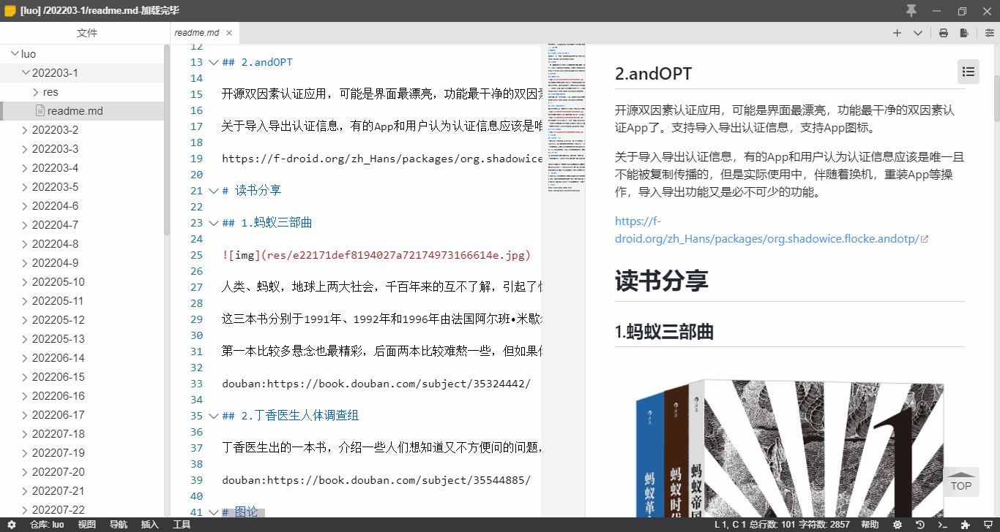
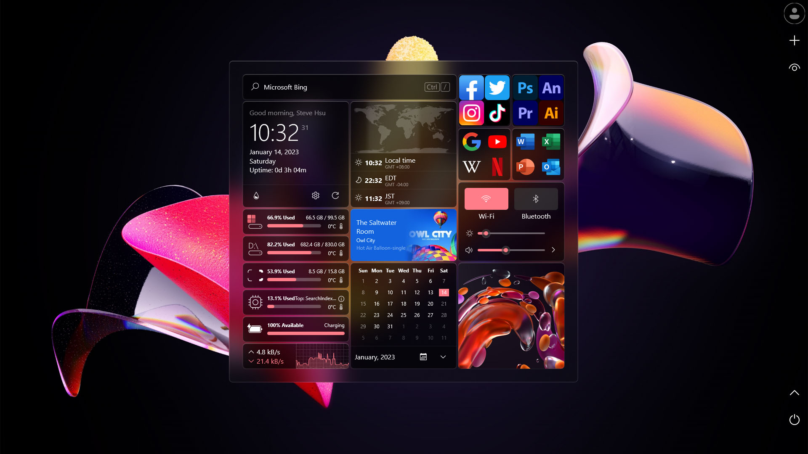
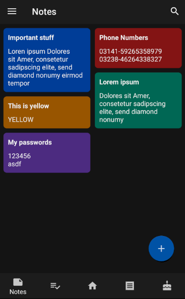
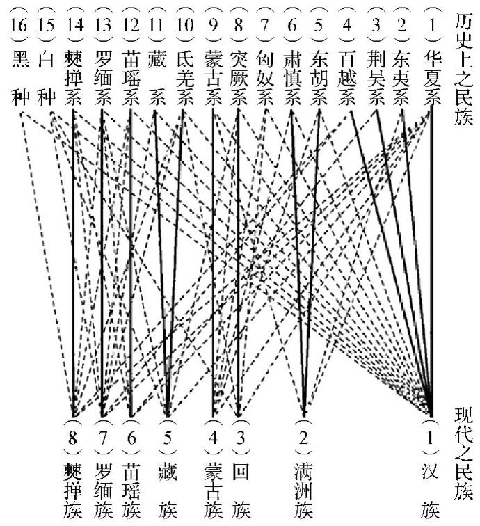
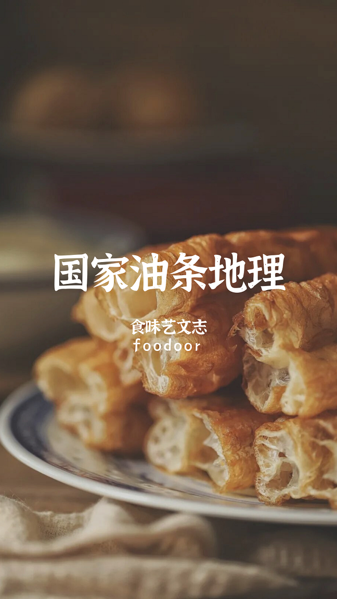
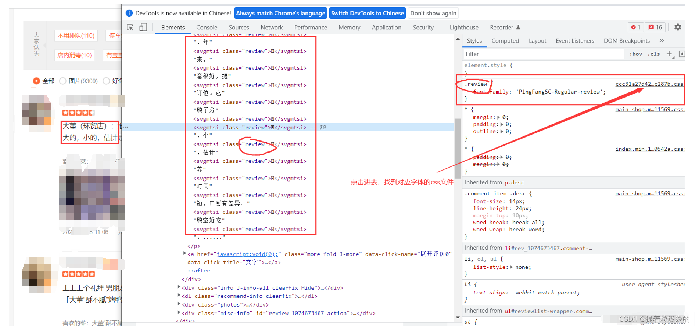
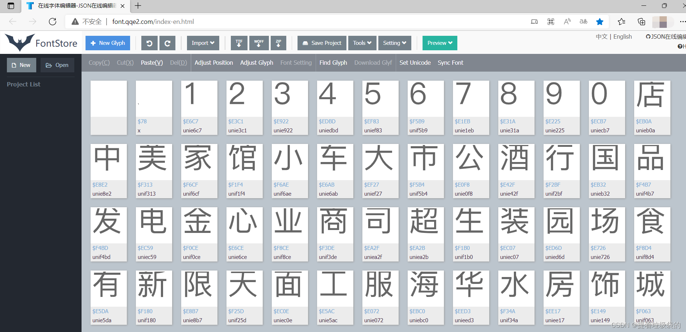
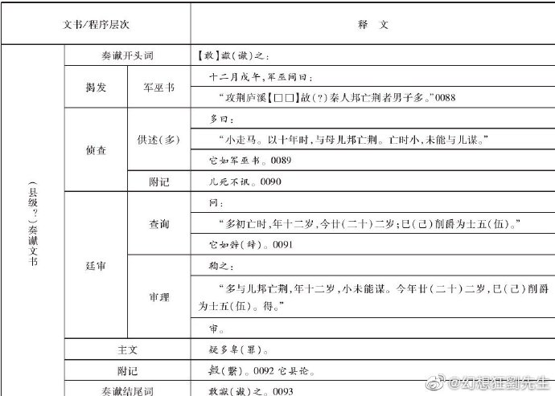

啰里啰唆周刊第53期：穿条纹睡衣的男孩

# 科技日常

## 1. Yank Note-面向程序员的 Markdown 笔记应用  
Yank Note 号称面向程序员的 Markdown 笔记应用，使用 Monaco 内核，专为 Markdown 优化。支持历史版本回溯；可在文档中嵌入小工具。支持用户编写自己的插件来拓展编辑器的功能。YankNote 编辑区和预览区同步滚动，预览区可独立滚动。

Yank Note 不仅可以作为日常的笔记应用，也可以作为个人知识库搭建软件，还可以作为你的程序开发软件，与 VSCode 和 Sublime 有一样的使用功能。

支持windows/Mac/Linux操作系统，x64及arm64两种架构。

该软件有免费和收费版本，免费版本的功能未作大的阉割，区别是收费版本支持暗色主题和更多插件。

优点：
1.支持文档历史功能。
2.内置插件商店，支持插件功能，可扩展性强。
3.开源，大部分功能免费。

缺点：
1.编辑器不支持类似Typora那种边写边预览的模式，这样在屏幕面积有限的情况下使用时会有不通畅的感觉。
2.PDF导出不支持书签。

官网：[https://yanknote.com](https://yanknote.com)

## 2. 雨滴皮肤，Windows个性化桌面定制-Rainmeter

Rainmeter原本是一个系统状态监视软件，由于其强大的可定制性及拓展性，诸多使用者在原来的基础上开发了成百上千的插件程序和皮肤样式，使得现在的Rainmeter几乎成为一款完美的系统美化工具。受到众多美化爱好者的青睐。Rainmeter的皮肤大都走抽象、简洁的设计路线，非常适合作为一款桌面美化软件。现在它的功能已经得到了极大的扩展，rss feeder、邮件监视器等常用功能都能够实现，而低资源占用和简易的设计方式为它赢得了大批用户。

可以说，Rainmeter就是PC上的[KWGT](https://kustom.gitlab.io/)了。

官网：[https://www.rainmeter.net/](https://www.rainmeter.net/)

雨滴本身是一个体积仅4M的小软件，要想实现炫酷的效果，需要自己制作皮肤或使用第三方皮肤。爱好者制作的皮肤可到此食用。[https://zhutix.com/tag/rainmeter/](https://zhutix.com/tag/rainmeter/)

当然，图中的那种效果过于炫酷和浪费CPU，我用Rainmeter来实现桌面贴图，效果很满意。

## 3.peazip-免费开源的解压缩软件
PeaZip free file archiver utility, open extract RAR TAR ZIP files，Supports over 200 archive formats。

Peazip是一款支持三大主流PC平台的解压缩软件，支持格式众多。开源免费无广告，但是缺点也很明显，就是在Windows上有点卡慢，尤其是解压tar.gz这种两层格式的软件，用户体验不佳。Linux上没试过体验如何。

但是这个软件也有一些其它软件不能替代的优点，就是支持的格式非常多，可以解压其它常规软件不支持的格式。比如rpm格式，我常用的bandizip就不支持，而peazip支持则比较完美。

[https://peazip.github.io/](https://peazip.github.io/)

## 4.PocketPlan-安卓上的Todo&&Notes软件
The goal of this project is to create a simplistic, lightweight, open-source, ad-free android app, designed to take care of small everyday tasks like managing a todo-list, keeping notes, reminding you of upcoming birthdays, providing a smart shopping list etc.

功能：To-do list，Notes ，纪念日， Sleep Reminder 等。简单轻巧，体积仅有5M，不支持云备份，便签编辑不支持插入图片。

ref:[https://github.com/RayLeaf-Studios/PocketPlan](https://github.com/RayLeaf-Studios/PocketPlan)

## 5.Sweet Home 3D v7.1 发布
Sweet Home 3D 是一个室内装潢设计软件，它能帮你通过二维的家居平面图来设计和布置你的家具，还可以用 3D 的视角预览整个装修布局的全新面貌，快速高质量的传递渲染器，使任何用户都能轻而易举做出专业水准的三维效果图。

这是一个基于Java开发的软件，适合做室内装修效果图，不过不知道目前搞室内装修设计的用的是哪款软件，应该不是这个。所以这个软件的目标用户不是很多，但是其3D效果实在很不错。

[https://www.sweethome3d.com](https://www.sweethome3d.com)
# 读书与影视分享

## 1.2022年Netflix新剧《黑暗荣耀》

这是一部涉及校园暴力题材的黑暗风复仇剧，从镜头语言到剧本台词属于干净利落、直白但不浅白、美感与故事兼备，就第一季内容来说故事完成度很高，就像小说一样谋篇布局，同时为第二季留下了伏笔与悬念。第一季共8集。该剧口碑很高。《黑暗荣耀》第二季于10日上线，上线仅一天即登顶全球多地收视榜，在北美地区跻身前三，并在南美、中东、东欧等地区走红，预计排名将进一步上升。

故事并不复杂，校园暴力被害者文东恩，被迫退学后开始筹划向朴妍珍为首的加害者们复仇，当仇恨成为生存的动力，似乎没有做不到的事。文东恩成为了朴妍珍女儿的班主任，并用围棋吸引了妍珍老公的注意······她筹划了十余年的复仇，现在才正式开始。 

>  看完《黑暗荣耀2》后，男主妈妈在得知他要帮文东恩复仇后对他说的那台词一直在我脑海里反复回旋——“我发现盲目的善意和伦理原则，只不过是华而不实的荣耀。你想帮她吗？如果那就是你的天堂，那么我不会反对。”
我想《黑暗荣耀》的成功之处也许恰恰就在于此，这部剧里没有握手言和，没有放下过去的反转，文东恩清楚地记得自己的每一份憎恨，应杀尽杀，那些积攒多年的恨意、压抑的憎恶，在漫长的复仇里被一点点释放。
《黑暗荣耀》在当下的爆火也许恰恰说明了观众们的态度——歌颂人性之美的故事固然优美，但我们已经厌倦了过去复仇剧里屡见不鲜的握手言和的放下、和解

## 2.《穿条纹睡衣的男孩》

高墙和铁丝网挡住了自由之路，却挡不住孩童干净的双眼。他们被当成了犯人，可是他们并没有错。
九岁男孩布鲁诺一家随着纳粹军官父亲的一纸调令，由柏林搬到了波兰。酷爱探险的他很快对新家附近的“农场”产生了兴趣，隔着高耸的围墙和铁丝网，人们身穿条纹睡衣终日忙碌。

没有人告诉他“农场”究竟是什么，所有人都禁止他发问。在好奇心的驱使下，布鲁诺悄悄溜出家门，结识了铁丝网另一边的同龄男孩什穆埃尔。
某日，什穆埃尔的父亲失踪了，于是布鲁诺决定穿上和什穆埃尔一模一样的条纹睡衣，到铁丝网的另一边帮他寻找父亲，作为两个人分别前最后的探险……

作者约翰·伯恩 John Boyne，2006年出版代表作《穿条纹睡衣的男孩》，一举斩获爱尔兰图书奖之年度最佳童书、爱尔兰图书奖之年度读者之选、Bisto年度图书奖、西班牙Qué Leer年度最佳国际小说奖、柑橘奖读者俱乐部年度图书5项大奖。

根据这本小说改编的同名电影《穿条纹睡衣的男孩》，豆瓣评分9.2。

# 图论

## 1.Rewriting Extinction

由《重写灭绝》出版的连环画正吸引着年轻观众的注意力，激励他们了解环境并采取行动。本组织强调，通过开放包容、非评判性的对话实现环境扫盲是一条正确的道路，已经在社交媒体上与1亿多人进行了完全有机的互动。他们甚至出版了一本名为《地球上最重要的漫画书》的选集，里面充满了独特而鼓舞人心的环保漫画。

[https://www.rewritingextinction.com/](https://www.rewritingextinction.com/)
## 2.历史上之民族

林惠祥先生总结的历史民族与现代民族的血统关系，现代汉族汇入了几乎古代所有民族的血统，古代华夏系血统也几乎融入了现代所有民族。
林惠祥(1901年～1958年) ，中国人类学家。代表作品《文化人类学 》 、《中国民族史》。

# 谈天说地

## 1.The Dirty Little Secret of Credit Card Rewards Programs
> 信用卡积分兑换下的经济常识，天下没有免费的午餐

There’s an undeniable feeling of excitement when you turn your daily credit card swipes at Starbucks into first-class airfare or a weekend jaunt to Costa Rica. Thanks to mobile banking and the ease of autopay, you can scrupulously avoid any additional costs by paying your monthly bill in full. Free flights and exclusive discounts abound.

Something for nothing, right?

[https://www.nytimes.com/2023/03/04/opinion/credit-card-rewards-points-poor-interchange-fees.html](https://www.nytimes.com/2023/03/04/opinion/credit-card-rewards-points-poor-interchange-fees.html)

## 2.马斯克这次带火的「热泵」，为何没烧热市场
> 一篇不错的科普文

和水泵不会生产水一样，热泵并不生产热量，而是作为热量的“搬运工”。热泵是在电力的驱动下，将热量移动到更被需要的地方去，以提升能量利用效率，降低能耗水平。尤其对于建筑供暖系统来说，热泵是重要的节能解决方案之一。

3月2日，在马斯克的言论影响之下，A股热泵概念板块开盘领涨，一时间让这项技术受到更多关注。
其实，热泵并不算是一项新兴的技术，它的历史可以追溯到两个世纪以前。

但是，由于过去传统化石能源总量充足，这项成本昂贵的技术并未受到青睐。直到2021年，全球也只有约10%的空间供暖需求是依靠热泵满足的。
时至今日，非可再生能源储量告急，能源结构转型任务紧迫，热泵的需求也比以往更大。特别是在贡献了全球碳排放约40%的建筑行业，热泵这项清洁能源技术逐渐成为关注焦点。

通俗理解，热泵的原理就是把传统的燃煤、燃气制热，改为电制热。
不过究其本质，无论是燃煤、燃气还是电制热，其本质都是能量的转化。但对于电制热的热泵来讲，热量是被转移而不是产生，热能利用效率也会高些。

[https://36kr.com/p/2163643491037447](https://36kr.com/p/2163643491037447)
## 3.国家油条地理
油条，中国点心之王。

和面、擀压、切条、滚油翻炸、迅速膨大，几分钟内，一份金黄、油润、兼具酥脆和嚼劲的平民小吃，就会出现在食客面前。

如果说千姿百态的语言、风俗和饮食，反映的是 960 万平方公里土地的辽阔和多元；那么对油条这种食物不论阶层品位、不分男女老幼的爱好，则展现了我们对 “中国” 二字的一致认同。

有趣的是，与古国中华悠久的底蕴传承不同，油条本身并不是有多么深邃文化和历史的食品。它廉价、易得，几乎没有任何技术门槛；另一方面，作为一种极其耗费燃料、油料，对添加剂有苛刻要求的食品，在前工业时代，它又有着巨大的普及壁垒。

这种特殊的境遇，让中国人对油条有着矛盾复杂的感情，饥馑时代，它是廉价的果腹主食；到了钟鸣鼎食的场合，它又能变身为赋予食物油润、酥脆、喷香口感的绝妙辅料。

成书于公元六世纪的《齐民要术》里，出现了一种名为 “细环饼” 的面食，用蜂蜜水或枣汁和面，再下锅油炸到 “美脆”。

不管是蜂蜜还是枣汁，它们的主要成分都是糖。在甘蔗种植还未普及，蔗糖还没有出现的时代，它们都是糖水的替代品。以糖水和面，能增加面团里碳水的比例，提高油炸面食的酥脆程度，对抗小麦蛋白带来的硬、韧。同时，一定量的糖，还能在高温下产生焦化反应，在油炸面食表面生成漂亮的深色外壳。

这种纤细、环状的面食，今天人们称之为 “馓子”。从某种角度理解，它其实是一种更古老版本的油条。

在中国古代更隆重的场合，馓子又被称为 “寒具”，与中国人最重要的节日之一：寒食节绑定，用以祭祖。在儒学兴盛的古代中国，能放到敬献祖先的供桌上，就是对食物最大的褒扬。

来源：[食味艺文志](https://mp.weixin.qq.com/s/saFmv3PNBX7xv7TlAjjfTw) 微信号：foodoor 

## 4.AI为什么会胡说八道
有人吐槽Bing查的航班信息不准确，比如显示从携程查到的航班是cz3521，但实际上是cz3529。

这种吐槽，说明不是互联网开发者发出的，互联网开发者应该对各种爬虫和反爬措施可以说是顺手拈来了。

下面也有人回复了：
“携程做了反爬虫…
京东和天眼查也使用类似的技术，随机性地在某些关键字符（通常是数字）使用小心眼。
具体地说就是把某些阿拉伯数字弄乱（比如所有的9都变成6，所有6变成3，3变成9之类。 然后内嵌一个自制的字体，这个字体是拿网站默认字体修改出来的，那个字体里 9 的样子就是6。
所以人看没问题”

字体反爬，其实已经是10多年前的古老技术了，不止是携程，京东、大众点评、58等也有类似技术，已经是国内互联网公司的标配了。最早的字体反爬是用图片来展示数字，比如京东这样的网站，商品价格是一个重要指标，为了防止被采集，京东在展示价格的时候使用了图片。但是图片有一个问题，就是OCR比较容易识别，因为图片显示不能过于离谱以至于影响肉眼的体验，让用户察觉到有不对劲的地方。简单的切割和二值化后，再和预先做好的图片进行比较，就很容易解出图片里的数字了。

进化到了自定义字体后，字体的参数是可以调的，每个客户端都能有一套自己的字体，做到了让爬虫望而生畏。其原理很简单，网站在CSS里使用了自定义字体

找到对应的css字体加密文件（.woff文件）,然后使用FontCreator软件打开，或者使用[在线字体编辑器](https://font.qqe2.com/index-en.html)。自定义字体体积通常不大，也不会包含所有字体，而是包含了一些重要的容易被采集的信息，比如数字、省市地址、单位等字符。

在源码里看起来是乱码的字符譬如`&#10026;`对应的就是字体文件里某个字符的编码，编辑器不能识别自然是乱码了，但是浏览器认识，浏览器会把这个乱码字符渲染成能被肉眼识别的正常字符。当然，这个字体文件的映射不是固定的，是每次加载动态生成的。至于为什么能实现编码到人眼可见字体的转换，那就要去理解woff字体的原理了。

后面还进化出了更复杂的字体反爬技术，比如SVG字体，但关键原理相差不大。

ref:
[https://www.zhihu.com/question/305189499](https://www.zhihu.com/question/305189499)
[woff字体图元结构剖析，自定义字体的制作与匹配和识别](https://blog.51cto.com/u_11866025/5714476)

> 因中文互联网[内容农场](https://zh.wikipedia.org/wiki/%E5%85%A7%E5%AE%B9%E8%BE%B2%E5%A0%B4)泛滥，很多文章已经找不到原始出处，故而只能选用知乎、CSDN等至少排版比较正常的出处。

## 5.秦的军功制
很多人对秦的军功制有一种简单的印象，认为是普通百姓阶层上升的通道，就像打游戏一样层层升级最后化身龙傲天，其实是一种比较浅薄的错误认知
1、秦的军功制设计极其精妙，它确实能让普通人比较容易的拥有下级爵位，但要达到士大夫那个层次，成为真正的贵族，实际上非常之难，从制度设计上来说，他就预防了“新增贵族”这种现象。
2、普通人要靠军功成为贵族很难，贵族要靠军功变成普通人却很容易，因为军法里可以“削爵”的罪名实在是太多了，上升是有天花板的，下落却没有兜底，所以士大夫阶层是越打越少而不是越打越多，这才是这个制度的设计初衷，即消灭贵族，加强君权。
3、获得下级军功爵位的人数是海量的，到了战国末期，战争规模越来越大，军功爵位也越来越多，爵位也会通货膨胀，解决方法有两个，一是更加严酷的执行军法，加加减减控制下级爵位上升，二就是更广泛的因罪削爵、夺爵，控制爵位的总体数量。
4、爵位通胀之后，获得的收益减少，风险和成本却与日俱增，秦简的奏谳里像下图这样带爵逃亡的现象就越来越多了，这个逃亡案里的男子“多”逃亡时尚年幼，爵位可能是继承他父亲的，在没有犯罪的情况下弃爵逃亡，可见战国末期秦爵的含金量。
5、秦皇陵旁出土的城旦舂尸骨上很多都带着致命的利器伤，他们是因为丧失了劳动力，或者工程完工后，被屠杀的。而他们中间的很多人，曾经就是下级军功爵位的拥有者。
最近不少人在研究《商君书》，要想比较好的理解商鞅这一套，一定要有底线思维，对其思想以及其思想衍生出的制度，一定要从人性底线的角度去思考，因为他的一切思考和实践全都是围绕着人性底线展开的。

来源：[@幻想狂劉先生](https://weibo.com/u/2155926845)

## 6.明代的不可思议的货币政策
说说明代的不可思议的货币政策。

朱元璋建立明王朝之后，推行大明宝钞。官方规定一贯钞兑1000文铜钱或一两白银，4贯钞兑一两黄金。但明政府发行宝钞，完全可以用“随心所欲”来形容，既不设准备金，不分界发行，又无发行额度的预算，无任何称提的政策。总而言之，朱元璋想印多少贯钞票就印多少贯。据研究者统计，单单洪武一朝，大明宝钞的发行量已高达10450万锭，流通中的宝钞约有9200万锭。一绽有5贯，9200万锭即有46000万贯。而另一方面，明初，官府严厉限制人口流动，工商业严重凋敝，社会退回自然经济状态，财税规模极小，且赋税以实物为主，这几亿贯的宝钞能怎么流通？

如此随心所欲地印钞，大明宝钞当然以史上最快速度与最大幅度贬值，洪武二十六年（1393），“两浙、江西、闽、广，民重钱轻钞，有以钱百六十文折钞一贯者，由是物价翔贵，而钞法益坏不行”，一贯宝钞只能折钱160文。正统十三年（1448），朝廷“禁使铜钱，时钞既通行，而市廛仍以铜钱交易，每钞一贯折铜钱二文”，宝钞跟废纸没什么差别。其后，随着海外白银的流入，民间的交易基本以银钱为主，没有人愿意使用宝钞，“积之市肆，过者不顾”，只不过官府还在坚持使用，比如在发给官员的俸禄或赏赐中搭配宝钞。一位明朝人说：“宝钞，今惟官府行之，然一贯仅直银三厘，钱二文，民间得之，置之无用。”

于是，我们可以发现，明王朝的货币政策非常的奇怪，以常人的理性很难理解：

1）明代的主要货币是宝钞、白银与铜钱。宝钞属于法定信用货币，但非常快就形同废纸，民间的交易没有谁愿意使用宝钞，奇怪的是，朝廷却没有停止发行，官俸、兵饷的发放都要搭配一定比例的宝钞，老百姓缴纳田赋与杂课也要求交一定比例的宝钞，直到明末，朝廷还保留着赐钞的惯例，茶课、租税中也保留征钞的做法。

2）从明中后期开始，白银已经成为最重要、最常用的货币，但明政府从未想过以白银为本币发行银票，也一直不知道铸造标准化的银币，虽然晚明之时，已有大量西班牙银元从海外流入，如果政府略有作为，完全是可以仿造银元的。别说铸造银元，就连给市场制定一套统一的白银成色与平砝标准都做不到，各个地方甚至各家银号的白银成色与天平砝码各标准，这一家银号出品的五十两十足银锭，按另一家银号的标准，可能并没有五十两整，也不是十足银。因此，用白银支付的每一次交易，结算时都要称量重量、验看成色、换算平砝，十分麻烦。

3）白银更适宜用于大宗贸易，市井间的日常琐碎交易需要大量铜钱，但明王朝却很少铸币，据学者的研究与统计，“明代政府从1368至1572年这200年总计铸造铜钱400万~600万贯，只是北宋熙宁变法期间一年的铸币量”，以至明朝人使用的铜钱主要就是宋钱。朱元璋甚至禁止铸造、行用铜钱：“宜令有司，悉收其钱归官，依数换钞，不许更用铜钱行使。限半月内，凡军民商贾所有铜钱悉送赴官，敢有私自行使及埋藏弃毁者，罪之。”禁用铜钱的目的，是为了推行宝钞。但朱元璋对宝钞的发行又过于随心所欲，导致宝钞以史上最快的速度贬值。

4）由于宝钞不可用，铜钱不够用，在明王朝的许多地方，人们只好使用原始的实物货币进行交易：“云南专用海贝，四川、贵州用茴香花银及盐、布，江西、湖广用米谷、银、布，山西、陕西间用皮毛”。贝壳、茴银、盐、布、米谷、皮毛等实物，都成了“代币”。

> 结合第36期-《海贝与贝币》，就能理解明朝时期云南地区用海贝做为实物货币，不是因为生产力落后，而是因为政策导致。

来源：[吴钩](https://weibo.com/u/1668244557)
# 一句话快讯

1.国家医保局发布2022年医疗保障事业发展统计快报。2022年，基本医疗保险基金（含生育保险）总收入、总支出分别为30697.72亿元、24431.72亿元，年末基金累计结存42540.73亿元。职工基本医疗保险基金（含生育保险）收入20637.18亿元，同比增长8.6%，其中征缴收入19494.57亿元。基金支出15158.30亿元，同比增长2.8%。 

2.TikTok当地时间周三推出“三叶草计划”（Project Clover），提出每年将在保护超1.5亿欧洲用户的措施上花费12亿美元，并承诺将欧洲TikTok用户数据存储在本地。

3.伊朗和沙特阿拉伯在中国北京举行会谈后，同意重新建立外交关系，并重开大使馆。 

4.据外媒10日报道，德国柏林当局近日表示，女性很快将被允许与男性一样，在公共泳池中不穿上衣游泳。 

# 联系方式

啰里啰唆是一份针对互联网和生活爱好者的数字杂志，旨在发现和分享一切有趣的东西。话题不固定，每期大约十五分钟阅读量，暂定每周四发布。部分内容来自互联网采编，如果为有来源的转载，均会注明转载地址或保留水印。

这是一个关注人文和科技的newsletter。

使用方法建议或素材提供

频道：notonlyshare

邮箱：auokyob@outlook.com

github地址：[https://github.com/iminto/luoliluosuo-weekly](https://github.com/iminto/luoliluosuo-weekly)